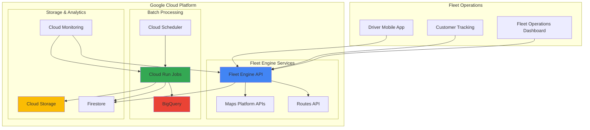

# Fleet Operations with Fleet Engine and Cloud Run Jobs

## Problem

Modern logistics companies struggle with inefficient fleet management, including suboptimal route planning, delayed delivery estimates, and lack of real-time visibility into vehicle locations and driver performance. Traditional fleet management systems often lack the intelligence to dynamically optimize routes based on traffic conditions, driver availability, and customer priorities, leading to increased fuel costs, poor customer satisfaction, and operational inefficiencies.

## Solution

This solution combines Google Fleet Engine's real-time vehicle tracking and route optimization capabilities with Cloud Run Jobs for serverless batch processing of fleet analytics. Fleet Engine provides the foundation for tracking vehicle locations, managing delivery tasks, and optimizing routes, while Cloud Run Jobs processes historical fleet data to generate insights for operational improvements and predictive maintenance scheduling.

## Architecture Diagram



## Prerequisites

1. Google Cloud account with billing enabled and appropriate permissions for Fleet Engine, Cloud Run, and BigQuery
2. Google Cloud CLI (gcloud) installed and configured or access to Cloud Shell
3. Basic understanding of fleet management concepts and REST APIs
4. Knowledge of serverless computing and batch processing patterns
5. Estimated cost: $50-100/month for moderate fleet size (10-50 vehicles) with regular analytics processing

> **Note**: Fleet Engine requires API key authentication and has usage-based pricing. Review the [Fleet Engine pricing documentation](https://cloud.google.com/maps-platform/pricing/sheet) for cost estimates based on your fleet size and usage patterns.

## Preparation

```bash
# Set environment variables for GCP resources
export PROJECT_ID="fleet-ops-$(date +%s)"
export REGION="us-central1"
export ZONE="us-central1-a"

# Generate unique suffix for resource names
RANDOM_SUFFIX=$(openssl rand -hex 3)
export ANALYTICS_JOB_NAME="fleet-analytics-${RANDOM_SUFFIX}"
export BUCKET_NAME="fleet-data-${RANDOM_SUFFIX}"
export DATASET_NAME="fleet_analytics"

# Create the project and set as default
gcloud projects create ${PROJECT_ID} \
    --name="Fleet Operations Platform"

gcloud config set project ${PROJECT_ID}
gcloud config set compute/region ${REGION}
gcloud config set compute/zone ${ZONE}

# Enable required APIs
gcloud services enable \
    fleetengine.googleapis.com \
    run.googleapis.com \
    cloudscheduler.googleapis.com \
    bigquery.googleapis.com \
    storage.googleapis.com \
    firestore.googleapis.com \
    maps-backend.googleapis.com \
    routes.googleapis.com \
    monitoring.googleapis.com \
    cloudbuild.googleapis.com

echo "✅ Project ${PROJECT_ID} configured and APIs enabled"
```

## Steps

1. **Configure Fleet Engine Service Account and Authentication**:

   Fleet Engine requires proper service account setup with specific IAM roles to manage vehicle tracking, route optimization, and task management. The service account acts as the authentication bridge between your fleet management application and Fleet Engine's backend services, ensuring secure access to vehicle location data and routing capabilities.

   ```bash
   # Create service account for Fleet Engine
   gcloud iam service-accounts create fleet-engine-sa \
       --display-name="Fleet Engine Service Account" \
       --description="Service account for Fleet Engine operations"
   
   # Grant necessary roles for Fleet Engine operations
   gcloud projects add-iam-policy-binding ${PROJECT_ID} \
       --member="serviceAccount:fleet-engine-sa@${PROJECT_ID}.iam.gserviceaccount.com" \
       --role="roles/fleetengine.deliveryFleetReader"
   
   gcloud projects add-iam-policy-binding ${PROJECT_ID} \
       --member="serviceAccount:fleet-engine-sa@${PROJECT_ID}.iam.gserviceaccount.com" \
       --role="roles/fleetengine.deliveryConsumer"
   
   # Create and download service account key for local development
   gcloud iam service-accounts keys create fleet-engine-key.json \
       --iam-account=fleet-engine-sa@${PROJECT_ID}.iam.gserviceaccount.com
   
   export FLEET_ENGINE_SA_EMAIL="fleet-engine-sa@${PROJECT_ID}.iam.gserviceaccount.com"
   echo "✅ Fleet Engine service account configured"
   ```

   Fleet Engine is now authenticated and ready to handle real-time vehicle tracking and route optimization requests. The service account provides the necessary permissions to access Fleet Engine APIs while maintaining security through role-based access control.

2. **Create Cloud Storage Bucket for Fleet Data**:

   Cloud Storage serves as the central repository for fleet operational data, including vehicle telemetry, route histories, and analytics results. The bucket configuration includes lifecycle management and versioning to optimize storage costs while maintaining data integrity for compliance and audit requirements.

   ```bash
   # Create bucket for fleet data storage
   gsutil mb -p ${PROJECT_ID} \
       -c STANDARD \
       -l ${REGION} \
       gs://${BUCKET_NAME}
   
   # Enable versioning for data protection
   gsutil versioning set on gs://${BUCKET_NAME}
   
   # Create folder structure for organized data storage
   echo "Fleet data initialized" | gsutil cp - \
       gs://${BUCKET_NAME}/vehicle-telemetry/README.txt
   echo "Route histories storage" | gsutil cp - \
       gs://${BUCKET_NAME}/route-histories/README.txt
   echo "Analytics results storage" | gsutil cp - \
       gs://${BUCKET_NAME}/analytics-results/README.txt
   
   # Set lifecycle policy for cost optimization
   cat > lifecycle-policy.json << EOF
   {
     "lifecycle": {
       "rule": [
         {
           "action": {"type": "SetStorageClass", "storageClass": "NEARLINE"},
           "condition": {"age": 30}
         },
         {
           "action": {"type": "SetStorageClass", "storageClass": "COLDLINE"},
           "condition": {"age": 90}
         }
       ]
     }
   }
   EOF
   
   gsutil lifecycle set lifecycle-policy.json gs://${BUCKET_NAME}
   echo "✅ Cloud Storage bucket configured with lifecycle policies"
   ```

   The storage infrastructure now supports efficient data management with automated lifecycle transitions, reducing costs while maintaining accessibility for recent fleet data and archiving historical records for long-term analysis.

3. **Set Up BigQuery Dataset for Fleet Analytics**:

   BigQuery provides the analytical foundation for processing large volumes of fleet data, enabling complex queries across vehicle performance metrics, route efficiency analysis, and predictive maintenance insights. The dataset structure supports both real-time streaming and batch processing workflows.

   ```bash
   # Create BigQuery dataset for fleet analytics
   bq mk \
       --dataset \
       --description="Fleet operations analytics dataset" \
       --location=${REGION} \
       ${PROJECT_ID}:${DATASET_NAME}
   
   # Create table for vehicle telemetry data
   bq mk \
       --table \
       --description="Vehicle telemetry and location data" \
       ${PROJECT_ID}:${DATASET_NAME}.vehicle_telemetry \
       vehicle_id:STRING,timestamp:TIMESTAMP,latitude:FLOAT,longitude:FLOAT,speed:FLOAT,fuel_level:FLOAT,engine_status:STRING,driver_id:STRING
   
   # Create table for route performance metrics
   bq mk \
       --table \
       --description="Route performance and optimization metrics" \
       ${PROJECT_ID}:${DATASET_NAME}.route_performance \
       route_id:STRING,vehicle_id:STRING,start_time:TIMESTAMP,end_time:TIMESTAMP,distance_km:FLOAT,fuel_consumed:FLOAT,average_speed:FLOAT,stops_count:INTEGER,efficiency_score:FLOAT
   
   # Create table for delivery tasks
   bq mk \
       --table \
       --description="Delivery task tracking and completion data" \
       ${PROJECT_ID}:${DATASET_NAME}.delivery_tasks \
       task_id:STRING,vehicle_id:STRING,driver_id:STRING,pickup_location:STRING,delivery_location:STRING,scheduled_time:TIMESTAMP,completed_time:TIMESTAMP,status:STRING,customer_rating:INTEGER
   
   echo "✅ BigQuery dataset and tables created for fleet analytics"
   ```

   BigQuery is now configured to handle structured fleet data with optimized schemas for common analytics queries. This foundation supports real-time dashboards, performance monitoring, and machine learning models for predictive fleet management.

4. **Create Firestore Database for Real-time Fleet State**:

   Firestore provides real-time synchronization capabilities essential for fleet operations, storing current vehicle states, driver assignments, and active delivery tasks. The NoSQL structure supports flexible data models while enabling real-time updates to fleet management dashboards and mobile applications.

   ```bash
   # Create Firestore database in Native mode
   gcloud firestore databases create \
       --database="(default)" \
       --location=${REGION} \
       --type=firestore-native
   
   # Create composite indexes for efficient queries
   cat > firestore-indexes.yaml << EOF
   indexes:
   - collectionGroup: vehicles
     queryScope: COLLECTION
     fields:
     - fieldPath: status
       order: ASCENDING
     - fieldPath: last_updated
       order: DESCENDING
   
   - collectionGroup: delivery_tasks
     queryScope: COLLECTION
     fields:
     - fieldPath: vehicle_id
       order: ASCENDING
     - fieldPath: status
       order: ASCENDING
     - fieldPath: scheduled_time
       order: ASCENDING
   
   - collectionGroup: route_plans
     queryScope: COLLECTION
     fields:
     - fieldPath: vehicle_id
       order: ASCENDING
     - fieldPath: created_at
       order: DESCENDING
   EOF
   
   gcloud firestore indexes composite create --file=firestore-indexes.yaml
   
   echo "✅ Firestore database configured with optimized indexes"
   ```

   Firestore is now ready to handle real-time fleet state management with optimized query performance. The database structure supports efficient lookups for vehicle status, delivery task management, and route planning operations.

5. **Deploy Cloud Run Job for Fleet Analytics Processing**:

   Cloud Run Jobs provide serverless batch processing capabilities for fleet analytics, automatically scaling to handle varying data volumes while minimizing costs. The containerized job processes historical fleet data, generates performance insights, and updates predictive models for operational optimization.

   ```bash
   # Create the analytics job container source code
   mkdir -p fleet-analytics-job
   cd fleet-analytics-job
   
   # Create Python requirements with latest versions
   cat > requirements.txt << EOF
   google-cloud-bigquery==3.17.2
   google-cloud-storage==2.13.0
   google-cloud-firestore==2.14.0
   pandas==2.2.0
   numpy==1.26.3
   scikit-learn==1.4.0
   EOF
   
   # Create the analytics processing script
   cat > analytics_processor.py << 'EOF'
   import os
   import pandas as pd
   from google.cloud import bigquery
   from google.cloud import storage
   from google.cloud import firestore
   from datetime import datetime, timedelta
   import json
   
   def process_fleet_analytics():
       """Process fleet data and generate analytics insights"""
       
       # Initialize clients
       bq_client = bigquery.Client()
       storage_client = storage.Client()
       firestore_client = firestore.Client()
       
       project_id = os.environ.get('PROJECT_ID')
       dataset_name = os.environ.get('DATASET_NAME')
       bucket_name = os.environ.get('BUCKET_NAME')
       
       print(f"Processing fleet analytics for project: {project_id}")
       
       # Query vehicle telemetry data from last 24 hours
       query = f"""
       SELECT 
           vehicle_id,
           AVG(speed) as avg_speed,
           MAX(speed) as max_speed,
           MIN(fuel_level) as min_fuel_level,
           COUNT(*) as data_points,
           STDDEV(speed) as speed_variance
       FROM `{project_id}.{dataset_name}.vehicle_telemetry`
       WHERE timestamp >= TIMESTAMP_SUB(CURRENT_TIMESTAMP(), INTERVAL 24 HOUR)
       GROUP BY vehicle_id
       """
       
       try:
           df = bq_client.query(query).to_dataframe()
           
           if not df.empty:
               # Generate performance insights
               insights = {
                   'total_vehicles': len(df),
                   'avg_fleet_speed': float(df['avg_speed'].mean()) if len(df) > 0 else 0,
                   'vehicles_needing_fuel': len(df[df['min_fuel_level'] < 0.2]),
                   'high_variance_vehicles': len(df[df['speed_variance'] > 10]),
                   'timestamp': datetime.now().isoformat()
               }
               
               # Store insights in Firestore
               firestore_client.collection('fleet_insights').document('daily_summary').set(insights)
               
               # Save detailed analytics to Cloud Storage
               analytics_data = df.to_json(orient='records')
               bucket = storage_client.bucket(bucket_name)
               blob = bucket.blob(f'analytics-results/{datetime.now().strftime("%Y-%m-%d")}/vehicle_performance.json')
               blob.upload_from_string(analytics_data, content_type='application/json')
               
               print(f"Analytics processed for {len(df)} vehicles")
               print(f"Fleet insights: {insights}")
               
           else:
               print("No telemetry data found for processing")
               
       except Exception as e:
           print(f"Error processing analytics: {e}")
           raise
   
   if __name__ == "__main__":
       process_fleet_analytics()
   EOF
   
   # Create Dockerfile for the analytics job
   cat > Dockerfile << EOF
   FROM python:3.11-slim
   
   WORKDIR /app
   
   COPY requirements.txt .
   RUN pip install --no-cache-dir -r requirements.txt
   
   COPY analytics_processor.py .
   
   CMD ["python", "analytics_processor.py"]
   EOF
   
   # Build and push the container image using Cloud Build
   gcloud builds submit --tag gcr.io/${PROJECT_ID}/${ANALYTICS_JOB_NAME}
   
   cd ..
   echo "✅ Analytics job container built and pushed to registry"
   ```

   The analytics processing job is now containerized and ready for deployment. This serverless solution automatically processes fleet data without requiring permanent infrastructure, scaling based on workload demands while maintaining cost efficiency.

6. **Deploy Cloud Run Job with Proper Configuration**:

   Cloud Run Jobs deployment requires specific configuration for fleet analytics processing, including resource allocation, environment variables, and service account permissions. The job configuration ensures optimal performance for batch processing while maintaining security and cost efficiency.

   ```bash
   # Deploy the Cloud Run Job
   gcloud run jobs create ${ANALYTICS_JOB_NAME} \
       --image gcr.io/${PROJECT_ID}/${ANALYTICS_JOB_NAME} \
       --region=${REGION} \
       --max-retries=2 \
       --parallelism=1 \
       --task-count=1 \
       --task-timeout=3600 \
       --memory=2Gi \
       --cpu=1 \
       --service-account=${FLEET_ENGINE_SA_EMAIL} \
       --set-env-vars="PROJECT_ID=${PROJECT_ID},DATASET_NAME=${DATASET_NAME},BUCKET_NAME=${BUCKET_NAME}"
   
   # Grant additional permissions for BigQuery and Storage access
   gcloud projects add-iam-policy-binding ${PROJECT_ID} \
       --member="serviceAccount:${FLEET_ENGINE_SA_EMAIL}" \
       --role="roles/bigquery.dataEditor"
   
   gcloud projects add-iam-policy-binding ${PROJECT_ID} \
       --member="serviceAccount:${FLEET_ENGINE_SA_EMAIL}" \
       --role="roles/storage.objectAdmin"
   
   gcloud projects add-iam-policy-binding ${PROJECT_ID} \
       --member="serviceAccount:${FLEET_ENGINE_SA_EMAIL}" \
       --role="roles/datastore.user"
   
   echo "✅ Cloud Run Job deployed with proper configuration"
   ```

   The Cloud Run Job is now deployed with appropriate resource allocation and security permissions. The job can process fleet analytics data efficiently while maintaining secure access to Google Cloud services through the service account authentication.

7. **Configure Cloud Scheduler for Automated Analytics Processing**:

   Cloud Scheduler enables automated execution of fleet analytics processing at regular intervals, ensuring consistent data processing without manual intervention. The scheduler configuration supports flexible timing patterns and retry policies for reliable batch processing operations.

   ```bash
   # Create Cloud Scheduler job for daily analytics processing
   gcloud scheduler jobs create http fleet-analytics-daily \
       --schedule="0 2 * * *" \
       --time-zone="America/New_York" \
       --uri="https://${REGION}-run.googleapis.com/apis/run.googleapis.com/v1/namespaces/${PROJECT_ID}/jobs/${ANALYTICS_JOB_NAME}:run" \
       --http-method=POST \
       --oidc-service-account-email=${FLEET_ENGINE_SA_EMAIL} \
       --oidc-token-audience="https://${REGION}-run.googleapis.com/apis/run.googleapis.com/v1/namespaces/${PROJECT_ID}/jobs/${ANALYTICS_JOB_NAME}:run" \
       --location=${REGION} \
       --description="Daily fleet analytics processing" \
       --max-retry-attempts=3 \
       --max-retry-duration=300s
   
   # Create additional scheduler job for hourly insights
   gcloud scheduler jobs create http fleet-insights-hourly \
       --schedule="0 * * * *" \
       --time-zone="America/New_York" \
       --uri="https://${REGION}-run.googleapis.com/apis/run.googleapis.com/v1/namespaces/${PROJECT_ID}/jobs/${ANALYTICS_JOB_NAME}:run" \
       --http-method=POST \
       --oidc-service-account-email=${FLEET_ENGINE_SA_EMAIL} \
       --oidc-token-audience="https://${REGION}-run.googleapis.com/apis/run.googleapis.com/v1/namespaces/${PROJECT_ID}/jobs/${ANALYTICS_JOB_NAME}:run" \
       --location=${REGION} \
       --description="Hourly fleet insights processing" \
       --max-retry-attempts=3 \
       --max-retry-duration=300s
   
   echo "✅ Cloud Scheduler configured for automated analytics processing"
   ```

   The scheduling system is now configured to automatically process fleet analytics at regular intervals. This ensures consistent data processing and insight generation without manual intervention, supporting operational decision-making with timely information.

8. **Set Up Monitoring and Alerting for Fleet Operations**:

   Cloud Monitoring provides comprehensive observability for fleet operations, tracking key performance indicators, system health, and operational metrics. The monitoring configuration includes custom dashboards and alerting policies to ensure proactive management of fleet operations and system performance.

   ```bash
   # Create monitoring dashboard for fleet operations
   cat > fleet-dashboard.json << 'EOF'
   {
     "displayName": "Fleet Operations Dashboard",
     "mosaicLayout": {
       "tiles": [
         {
           "width": 6,
           "height": 4,
           "widget": {
             "title": "Fleet Engine API Requests",
             "xyChart": {
               "dataSets": [
                 {
                   "timeSeriesQuery": {
                     "timeSeriesFilter": {
                       "filter": "resource.type=\"consumed_api\" AND resource.label.service=\"fleetengine.googleapis.com\"",
                       "aggregation": {
                         "alignmentPeriod": "60s",
                         "perSeriesAligner": "ALIGN_RATE"
                       }
                     }
                   }
                 }
               ]
             }
           }
         },
         {
           "width": 6,
           "height": 4,
           "xPos": 6,
           "widget": {
             "title": "Cloud Run Job Executions",
             "xyChart": {
               "dataSets": [
                 {
                   "timeSeriesQuery": {
                     "timeSeriesFilter": {
                       "filter": "resource.type=\"cloud_run_job\"",
                       "aggregation": {
                         "alignmentPeriod": "300s",
                         "perSeriesAligner": "ALIGN_RATE"
                       }
                     }
                   }
                 }
               ]
             }
           }
         }
       ]
     }
   }
   EOF
   
   # Create the monitoring dashboard
   gcloud monitoring dashboards create --config-from-file=fleet-dashboard.json
   
   # Create notification channel for alerting (email)
   gcloud alpha monitoring channels create \
       --display-name="Fleet Operations Team" \
       --description="Email notifications for fleet operations" \
       --type=email \
       --channel-labels=email_address=fleet-ops@example.com
   
   echo "✅ Monitoring and alerting configured for fleet operations"
   ```

   The monitoring system now provides comprehensive visibility into fleet operations and system performance. Dashboards enable proactive management of the fleet management platform, ensuring high availability and optimal performance.

## Validation & Testing

1. **Verify Fleet Engine API Access and Configuration**:

   ```bash
   # Test Fleet Engine API access
   curl -H "Authorization: Bearer $(gcloud auth print-access-token)" \
       -H "Content-Type: application/json" \
       "https://fleetengine.googleapis.com/v1/providers/${PROJECT_ID}/vehicles" \
       -d '{}'
   
   # Check service account permissions
   gcloud projects get-iam-policy ${PROJECT_ID} \
       --flatten="bindings[].members" \
       --format="table(bindings.role)" \
       --filter="bindings.members:fleet-engine-sa@${PROJECT_ID}.iam.gserviceaccount.com"
   ```

   Expected output: HTTP 200 response from Fleet Engine API and proper IAM role assignments displayed.

2. **Test Cloud Run Job Execution**:

   ```bash
   # Execute the analytics job manually
   gcloud run jobs execute ${ANALYTICS_JOB_NAME} \
       --region=${REGION} \
       --wait
   
   # Check job execution status
   gcloud run jobs executions list \
       --job=${ANALYTICS_JOB_NAME} \
       --region=${REGION} \
       --limit=5
   ```

   Expected output: Job execution completes successfully with SUCCEEDED status.

3. **Verify Data Pipeline Functionality**:

   ```bash
   # Check BigQuery tables have been created
   bq ls ${PROJECT_ID}:${DATASET_NAME}
   
   # Verify Cloud Storage bucket structure
   gsutil ls -r gs://${BUCKET_NAME}/
   
   # Check Firestore collections
   gcloud firestore collections list
   ```

   Expected output: All tables, bucket folders, and collections are present and accessible.

4. **Test Scheduled Job Execution**:

   ```bash
   # Check Cloud Scheduler job status
   gcloud scheduler jobs list --location=${REGION}
   
   # Manually trigger a scheduled job
   gcloud scheduler jobs run fleet-analytics-daily --location=${REGION}
   
   # Monitor job execution logs
   gcloud logging read "resource.type=\"cloud_run_job\" AND resource.labels.job_name=\"${ANALYTICS_JOB_NAME}\"" \
       --limit=10 \
       --format="table(timestamp,jsonPayload.message)"
   ```

   Expected output: Scheduler jobs listed as ENABLED and manual execution triggers successful job run.

## Cleanup

1. **Remove Cloud Scheduler Jobs**:

   ```bash
   # Delete scheduler jobs
   gcloud scheduler jobs delete fleet-analytics-daily \
       --location=${REGION} \
       --quiet
   
   gcloud scheduler jobs delete fleet-insights-hourly \
       --location=${REGION} \
       --quiet
   
   echo "✅ Cloud Scheduler jobs removed"
   ```

2. **Delete Cloud Run Job and Container Images**:

   ```bash
   # Delete Cloud Run Job
   gcloud run jobs delete ${ANALYTICS_JOB_NAME} \
       --region=${REGION} \
       --quiet
   
   # Delete container images
   gcloud container images delete gcr.io/${PROJECT_ID}/${ANALYTICS_JOB_NAME} \
       --quiet
   
   echo "✅ Cloud Run Job and images deleted"
   ```

3. **Remove Storage and Database Resources**:

   ```bash
   # Delete Cloud Storage bucket
   gsutil -m rm -r gs://${BUCKET_NAME}
   
   # Delete BigQuery dataset
   bq rm -r -f ${PROJECT_ID}:${DATASET_NAME}
   
   # Delete Firestore database (requires manual action in console)
   echo "⚠️  Firestore database must be deleted manually in the Google Cloud Console"
   
   echo "✅ Storage and database resources removed"
   ```

4. **Clean Up Project and Service Accounts**:

   ```bash
   # Remove IAM policy bindings
   gcloud projects remove-iam-policy-binding ${PROJECT_ID} \
       --member="serviceAccount:${FLEET_ENGINE_SA_EMAIL}" \
       --role="roles/fleetengine.deliveryFleetReader"
   
   gcloud projects remove-iam-policy-binding ${PROJECT_ID} \
       --member="serviceAccount:${FLEET_ENGINE_SA_EMAIL}" \
       --role="roles/bigquery.dataEditor"
   
   gcloud projects remove-iam-policy-binding ${PROJECT_ID} \
       --member="serviceAccount:${FLEET_ENGINE_SA_EMAIL}" \
       --role="roles/storage.objectAdmin"
   
   # Delete service account
   gcloud iam service-accounts delete ${FLEET_ENGINE_SA_EMAIL} \
       --quiet
   
   # Delete the entire project (optional)
   gcloud projects delete ${PROJECT_ID} \
       --quiet
   
   echo "✅ Project and service accounts cleaned up"
   ```

## Discussion

Fleet Engine represents Google's comprehensive solution for modern fleet management, providing real-time vehicle tracking, route optimization, and delivery task management through a unified API platform. The integration with Cloud Run Jobs creates a powerful serverless architecture that can scale automatically based on fleet size and analytical processing requirements. This combination enables logistics companies to implement intelligent fleet operations without managing complex infrastructure.

The serverless batch processing approach using Cloud Run Jobs offers significant advantages over traditional analytics pipelines. Jobs execute only when needed, automatically scaling to handle varying data volumes while minimizing costs during low-activity periods. This event-driven architecture ensures that fleet insights are generated consistently without requiring permanent compute resources, making it ideal for businesses with fluctuating operational demands.

The real-time capabilities of Fleet Engine combined with batch analytics processing create a comprehensive fleet intelligence platform. Real-time data supports immediate operational decisions like route adjustments and driver assignments, while batch processing generates historical insights for strategic planning and predictive maintenance. This dual approach ensures both operational efficiency and long-term fleet optimization.

Security and compliance are critical considerations in fleet management, and this architecture addresses these concerns through Google Cloud's enterprise-grade security features. Service account authentication, IAM role-based access control, and audit logging provide comprehensive security coverage. The solution also supports data residency requirements and compliance frameworks common in logistics and transportation industries. For additional security considerations, review the [Fleet Engine security documentation](https://developers.google.com/maps/documentation/mobility/fleet-engine/security) and [Google Cloud security best practices](https://cloud.google.com/security/best-practices).

> **Tip**: Implement gradual rollout strategies when deploying Fleet Engine in production environments. Start with a subset of vehicles and gradually expand coverage while monitoring performance metrics and user feedback.

## Challenge

Extend this fleet management solution by implementing these enhancements:

1. **Implement predictive maintenance scheduling** using Vertex AI to analyze vehicle telemetry data and predict maintenance needs before failures occur, integrating with the existing analytics pipeline.

2. **Add real-time traffic optimization** by integrating with Google Maps Traffic API to dynamically adjust routes based on current traffic conditions and incident reports.

3. **Create driver performance analytics** with Cloud Run Jobs that process driver behavior data to generate safety scores, fuel efficiency metrics, and personalized coaching recommendations.

4. **Implement customer notification system** using Cloud Pub/Sub and Cloud Functions to send real-time delivery updates and estimated arrival times to customers based on Fleet Engine tracking data.

5. **Add multi-modal transportation support** by extending the Fleet Engine configuration to handle different vehicle types (trucks, vans, bikes) with specific routing and capacity constraints.

## Infrastructure Code

*Infrastructure code will be generated after recipe approval.*