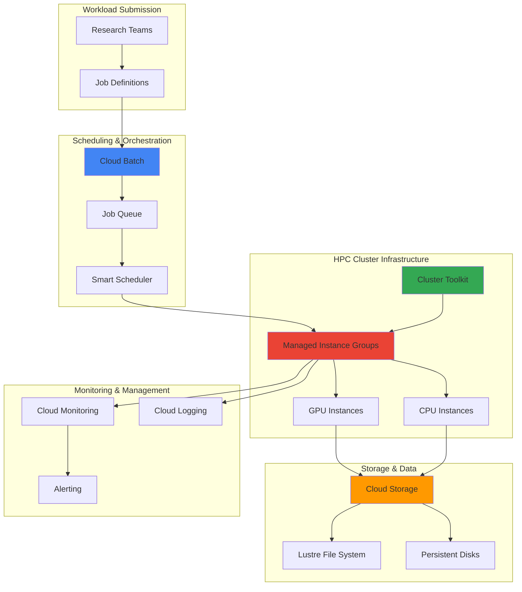

# Flexible HPC Workloads with Cluster Toolkit and Dynamic Scheduler

## Problem

Research institutions and enterprises face significant challenges when running large-scale scientific computing workloads that require expensive GPU and TPU resources. Traditional HPC cluster management often leads to resource over-provisioning, idle capacity costs, and inflexible scheduling that can't adapt to varying computational demands. Organizations need a cost-effective solution that can dynamically allocate high-performance computing resources while providing both immediate access for urgent workloads and predictable scheduling for planned computational campaigns.

## Solution

Deploy Google Cloud's integrated HPC platform using Cluster Toolkit for infrastructure provisioning and Cloud Batch with intelligent scheduling capabilities for resource allocation. This approach combines the flexibility of on-demand GPU/TPU access through spot instances with predictable capacity reservations, enabling cost-efficient scaling based on actual computational needs. The solution integrates Compute Engine's high-performance instances with Cloud Storage for scalable data management, creating a comprehensive HPC environment that adapts to diverse workload requirements.

## Architecture Diagram



## Prerequisites

1. Google Cloud project with billing enabled and appropriate IAM permissions for Compute Engine, Cloud Storage, and Batch services
2. Google Cloud CLI installed and configured (version 400.0.0 or later)
3. Basic understanding of HPC workloads, container orchestration, and scientific computing workflows
4. Familiarity with Terraform for infrastructure as code deployments
5. Estimated cost: $50-200 for a 45-minute session depending on GPU/TPU usage and storage requirements

> **Note**: This recipe demonstrates advanced HPC concepts and requires careful resource monitoring to manage costs effectively.

## Preparation

```bash
# Set environment variables for GCP resources
export PROJECT_ID="hpc-cluster-$(date +%s)"
export REGION="us-central1"
export ZONE="us-central1-a"

# Generate unique suffix for resource names
RANDOM_SUFFIX=$(openssl rand -hex 3)
export CLUSTER_NAME="hpc-cluster-${RANDOM_SUFFIX}"
export STORAGE_BUCKET="hpc-data-${RANDOM_SUFFIX}"
export JOB_QUEUE_NAME="hpc-queue-${RANDOM_SUFFIX}"

# Set default project and region
gcloud config set project ${PROJECT_ID}
gcloud config set compute/region ${REGION}
gcloud config set compute/zone ${ZONE}

# Enable required APIs for HPC services
gcloud services enable compute.googleapis.com
gcloud services enable storage.googleapis.com
gcloud services enable batch.googleapis.com
gcloud services enable container.googleapis.com
gcloud services enable monitoring.googleapis.com
gcloud services enable logging.googleapis.com

# Install Cluster Toolkit dependencies
curl -LO https://github.com/GoogleCloudPlatform/cluster-toolkit/releases/latest/download/gcluster
chmod +x gcluster
sudo mv gcluster /usr/local/bin/

echo "✅ Project configured: ${PROJECT_ID}"
echo "✅ Cluster Toolkit installed and ready"
```

## Steps

1. **Create HPC Data Storage Infrastructure**:

   Cloud Storage provides the foundational data layer for HPC workloads, offering high-throughput access patterns essential for scientific computing. The regional storage configuration ensures data availability with low latency while lifecycle policies optimize costs for long-term research data retention.

   ```bash
   # Create high-performance storage bucket for HPC data
   gsutil mb -p ${PROJECT_ID} \
       -c STANDARD \
       -l ${REGION} \
       gs://${STORAGE_BUCKET}
   
   # Enable versioning for data protection
   gsutil versioning set on gs://${STORAGE_BUCKET}
   
   # Configure lifecycle management for cost optimization
   cat > lifecycle.json << EOF
   {
     "rule": [
       {
         "action": {"type": "SetStorageClass", "storageClass": "NEARLINE"},
         "condition": {"age": 30}
       },
       {
         "action": {"type": "SetStorageClass", "storageClass": "COLDLINE"},
         "condition": {"age": 90}
       }
     ]
   }
   EOF
   
   gsutil lifecycle set lifecycle.json gs://${STORAGE_BUCKET}
   
   echo "✅ HPC storage infrastructure created: gs://${STORAGE_BUCKET}"
   ```

   The storage bucket now provides scalable, high-performance data access with automated cost optimization through intelligent tiering. This foundation supports the entire HPC pipeline from data ingestion through computational processing and results storage.

2. **Configure Cluster Toolkit Blueprint for HPC Environment**:

   Cluster Toolkit automates the deployment of HPC infrastructure following Google Cloud best practices. The blueprint defines a complete cluster configuration including compute nodes, storage integration, and monitoring capabilities optimized for scientific workloads.

   ```bash
   # Create Cluster Toolkit blueprint for HPC workloads
   cat > hpc-blueprint.yaml << EOF
   blueprint_name: ${CLUSTER_NAME}
   
   vars:
     project_id: ${PROJECT_ID}
     deployment_name: ${CLUSTER_NAME}
     region: ${REGION}
     zone: ${ZONE}
   
   deployment_groups:
   - group: primary
     modules:
     - id: network
       source: modules/network/pre-existing-vpc
     
     - id: hpc-compute
       source: modules/compute/vm-instance
       use: [network]
       settings:
         name_prefix: hpc-worker
         machine_type: c2-standard-16
         instance_count: 2
         enable_placement: true
         placement_policy_name: hpc-placement
         disk_size_gb: 100
         disk_type: pd-ssd
         
     - id: gpu-compute
       source: modules/compute/vm-instance
       use: [network]
       settings:
         name_prefix: gpu-worker
         machine_type: n1-standard-8
         instance_count: 1
         guest_accelerator:
         - type: nvidia-tesla-t4
           count: 1
         disk_size_gb: 200
         disk_type: pd-ssd
         
     - id: storage-mount
       source: modules/file-system/cloud-storage-bucket
       settings:
         bucket_name: ${STORAGE_BUCKET}
         mount_point: /mnt/hpc-data
   EOF
   
   # Generate cluster deployment folder
   gcluster create hpc-blueprint.yaml
   
   echo "✅ HPC cluster blueprint configured with GPU and high-performance compute nodes"
   ```

   The blueprint creates a heterogeneous cluster with both CPU-optimized and GPU-accelerated compute nodes, providing flexibility for different types of scientific workloads while ensuring optimal placement and performance.

3. **Deploy HPC Cluster Infrastructure with Terraform**:

   The Cluster Toolkit generates Terraform configurations that follow Google Cloud's infrastructure as code best practices. This deployment creates the complete HPC environment with proper networking, security, and monitoring configurations.

   ```bash
   # Navigate to generated deployment folder
   cd ${CLUSTER_NAME}
   
   # Initialize Terraform for cluster deployment
   terraform init
   
   # Plan the infrastructure deployment
   terraform plan -var="project_id=${PROJECT_ID}"
   
   # Deploy the HPC cluster
   terraform apply -var="project_id=${PROJECT_ID}" -auto-approve
   
   # Store cluster information
   export CLUSTER_NODES=$(gcloud compute instances list \
       --filter="name~hpc-worker" \
       --format="value(name)" | tr '\n' ' ')
   export GPU_NODES=$(gcloud compute instances list \
       --filter="name~gpu-worker" \
       --format="value(name)" | tr '\n' ' ')
   
   cd ..
   
   echo "✅ HPC cluster deployed successfully"
   echo "CPU Nodes: ${CLUSTER_NODES}"
   echo "GPU Nodes: ${GPU_NODES}"
   ```

   The cluster is now operational with compute nodes optimally configured for HPC workloads, including placement policies for low-latency communication and high-performance storage integration.

4. **Configure Cloud Batch with Intelligent Scheduling**:

   Cloud Batch provides a fully managed service for running batch and HPC workloads at scale. The intelligent scheduling capabilities optimize resource allocation by automatically selecting the most cost-effective instance types and managing workload distribution across available resources.

   ```bash
   # Create sample workload with intelligent spot scheduling
   gcloud batch jobs submit hpc-workload-spot \
       --location=${REGION} \
       --config=- << EOF
   {
     "taskGroups": [{
       "taskSpec": {
         "runnables": [{
           "script": {
             "text": "#!/bin/bash\necho 'Processing HPC workload with Cloud Batch'\necho 'Instance type:' && curl -H 'Metadata-Flavor: Google' http://metadata.google.internal/computeMetadata/v1/instance/machine-type\nsleep 300\necho 'Workload completed successfully'"
           }
         }],
         "computeResource": {
           "cpuMilli": 8000,
           "memoryMib": 16384
         },
         "maxRetryCount": 2,
         "maxRunDuration": "1800s"
       },
       "taskCount": 4,
       "parallelism": 2
     }],
     "allocationPolicy": {
       "instances": [{
         "policy": {
           "machineType": "c2-standard-8",
           "provisioningModel": "SPOT"
         }
       }],
       "location": {
         "allowedLocations": ["zones/${ZONE}"]
       }
     },
     "logsPolicy": {
       "destination": "CLOUD_LOGGING"
     }
   }
   EOF
   
   echo "✅ Cloud Batch configured with intelligent spot scheduling"
   echo "✅ Sample HPC workload submitted for flexible scheduling"
   ```

   The Cloud Batch configuration enables cost-effective HPC processing by leveraging spot instances and automatic resource optimization, reducing computational costs while maintaining performance for fault-tolerant workloads.

5. **Set Up Predictable GPU Reservations**:

   Compute reservations provide guaranteed resource availability for time-critical computational campaigns. This scheduling approach is essential for research deadlines, collaborative projects, and workloads requiring specific start times and predictable resource access.

   ```bash
   # Create future reservation for predictable GPU access
   gcloud compute reservations create hpc-gpu-reservation \
       --zone=${ZONE} \
       --vm-count=2 \
       --machine-type=n1-standard-8 \
       --accelerator=type=nvidia-tesla-t4,count=1 \
       --start-time=$(date -d '+1 hour' -Iseconds) \
       --duration=3600
   
   # Configure workload targeting reservation
   cat > reservation-workload.json << EOF
   {
     "taskGroups": [{
       "taskSpec": {
         "runnables": [{
           "script": {
             "text": "#!/bin/bash\necho 'Running reserved GPU workload'\nnvidia-smi || echo 'GPU tools not available'\necho 'GPU computation starting'\npython3 -c 'import time; time.sleep(600); print(\"GPU workload completed\")'"
           }
         }],
         "computeResource": {
           "cpuMilli": 8000,
           "memoryMib": 16384
         }
       }],
       "taskCount": 1
     }],
     "allocationPolicy": {
       "instances": [{
         "policy": {
           "machineType": "n1-standard-8",
           "accelerators": [{
             "type": "nvidia-tesla-t4",
             "count": 1
           }],
           "reservation": "projects/${PROJECT_ID}/reservations/hpc-gpu-reservation"
         }
       }]
     },
     "logsPolicy": {
       "destination": "CLOUD_LOGGING"
     }
   }
   EOF
   
   echo "✅ GPU reservation created for predictable access"
   echo "✅ Reserved workload configuration prepared"
   ```

   The reservation ensures guaranteed GPU availability at specified times, providing the predictability required for critical computational deadlines and collaborative research projects.

6. **Implement Multi-Modal Workload Orchestration**:

   Advanced HPC environments require sophisticated orchestration to handle diverse computational requirements. This configuration demonstrates how different scheduling modes can coexist, enabling organizations to optimize both cost and performance across varied workload types.

   ```bash
   # Create workload orchestration script
   cat > orchestrate-workloads.sh << 'EOF'
   #!/bin/bash
   
   echo "Starting multi-modal HPC workload orchestration"
   
   # Submit immediate processing jobs via spot instances
   for i in {1..3}; do
     gcloud batch jobs submit "spot-job-${i}" \
         --location=${REGION} \
         --config=- << SPOTEOF
   {
     "taskGroups": [{
       "taskSpec": {
         "runnables": [{
           "script": {
             "text": "echo 'Spot job ${i} processing on:' && curl -H 'Metadata-Flavor: Google' http://metadata.google.internal/computeMetadata/v1/instance/machine-type && sleep 180 && echo 'Job ${i} completed'"
           }
         }],
         "computeResource": {
           "cpuMilli": 4000,
           "memoryMib": 8192
         }
       }],
       "taskCount": 1
     }],
     "allocationPolicy": {
       "instances": [{
         "policy": {
           "machineType": "c2-standard-4",
           "provisioningModel": "SPOT"
         }
       }]
     }
   }
   SPOTEOF
   done
   
   echo "Submitted 3 spot instance jobs for immediate processing"
   
   # Monitor job progress
   echo "Monitoring workload execution..."
   gcloud batch jobs list --location=${REGION} \
       --format="table(name,state,createTime)"
   
   EOF
   
   chmod +x orchestrate-workloads.sh
   ./orchestrate-workloads.sh
   
   echo "✅ Multi-modal workload orchestration configured and running"
   ```

   The orchestration system now manages multiple workload types simultaneously, demonstrating how Cloud Batch adapts to different computational demands while optimizing resource utilization and costs.

7. **Configure Advanced Monitoring and Cost Optimization**:

   Comprehensive monitoring is crucial for HPC environments to track resource utilization, performance metrics, and cost optimization opportunities. Cloud Monitoring integration provides real-time visibility into cluster performance and automated alerting for resource efficiency.

   ```bash
   # Create monitoring dashboard for HPC cluster
   cat > hpc-monitoring.json << EOF
   {
     "displayName": "HPC Cluster Monitoring",
     "mosaicLayout": {
       "tiles": [
         {
           "width": 6,
           "height": 4,
           "widget": {
             "title": "GPU Utilization",
             "xyChart": {
               "dataSets": [{
                 "timeSeriesQuery": {
                   "timeSeriesFilter": {
                     "filter": "resource.type=\"gce_instance\" AND metric.type=\"compute.googleapis.com/instance/accelerator/utilization\"",
                     "aggregation": {
                       "alignmentPeriod": "60s",
                       "perSeriesAligner": "ALIGN_MEAN"
                     }
                   }
                 }
               }]
             }
           }
         },
         {
           "width": 6,
           "height": 4,
           "widget": {
             "title": "Batch Job Status",
             "scorecard": {
               "timeSeriesQuery": {
                 "timeSeriesFilter": {
                   "filter": "resource.type=\"batch_job\" AND metric.type=\"batch.googleapis.com/job/num_tasks_per_state\""
                 }
               }
             }
           }
         }
       ]
     }
   }
   EOF
   
   # Create the monitoring dashboard
   gcloud monitoring dashboards create \
       --config-from-file=hpc-monitoring.json
   
   # Set up cost alerting for HPC resources
   BILLING_ACCOUNT=$(gcloud beta billing projects describe ${PROJECT_ID} \
       --format="value(billingAccountName)" | cut -d'/' -f2)
   
   gcloud alpha billing budgets create \
       --billing-account=${BILLING_ACCOUNT} \
       --display-name="HPC Cluster Budget Alert" \
       --budget-amount=100USD \
       --threshold-rule=percent=80,basis=CURRENT_SPEND \
       --threshold-rule=percent=100,basis=CURRENT_SPEND
   
   echo "✅ Advanced monitoring and cost optimization configured"
   echo "✅ GPU utilization and batch job monitoring active"
   ```

   The monitoring infrastructure now provides comprehensive visibility into HPC cluster performance, enabling proactive optimization and cost management for large-scale computational workloads.

## Validation & Testing

1. **Verify HPC Cluster Infrastructure Deployment**:

   ```bash
   # Check cluster node status and placement
   gcloud compute instances list \
       --filter="name~(hpc-worker|gpu-worker)" \
       --format="table(name,status,machineType,zone,scheduling.preemptible)"
   
   # Verify storage bucket configuration
   gsutil ls -L gs://${STORAGE_BUCKET}
   
   # Check Cloud Batch job status
   gcloud batch jobs list --location=${REGION} \
       --format="table(name,state,createTime)"
   ```

   Expected output: All cluster nodes should show "RUNNING" status, storage bucket should be accessible with lifecycle policies, and batch jobs should show appropriate scheduling states.

2. **Test Spot Instance Resource Allocation**:

   ```bash
   # Monitor spot instance job execution
   for job in $(gcloud batch jobs list \
       --location=${REGION} \
       --format="value(name)"); do
     echo "Job: $job"
     gcloud batch jobs describe $job \
         --location=${REGION} \
         --format="value(status.state)"
   done
   
   # Check spot instance utilization
   gcloud compute instances list \
       --filter="scheduling.preemptible=true" \
       --format="table(name,status,cpuPlatform,scheduling.provisioningModel)"
   ```

   Expected output: Jobs should transition from QUEUED to RUNNING states, and spot instances should be allocated based on availability and cost optimization.

3. **Validate GPU Reservation System**:

   ```bash
   # Check reservation status and utilization
   gcloud compute reservations describe hpc-gpu-reservation \
       --zone=${ZONE} \
       --format="yaml(status,specificReservation)"
   
   # Verify GPU resource allocation
   gcloud compute instances list \
       --filter="name~gpu-worker" \
       --format="table(name,status,guestAccelerators[].acceleratorType)"
   ```

   Expected output: Reservation should show active status with available GPU resources, and instances should have properly configured accelerators.

4. **Test Workload Scaling and Performance**:

   ```bash
   # Submit scaling test with multiple task groups
   gcloud batch jobs submit scaling-test \
       --location=${REGION} \
       --config=- << EOF
   {
     "taskGroups": [{
       "taskSpec": {
         "runnables": [{
           "script": {
             "text": "echo 'Scaling test started' && stress-ng --cpu 4 --timeout 60s && echo 'Test completed'"
           }
         }],
         "computeResource": {
           "cpuMilli": 8000,
           "memoryMib": 16384
         }
       }],
       "taskCount": 8,
       "parallelism": 4
     }]
   }
   EOF
   
   # Monitor resource scaling behavior
   watch "gcloud compute instances list \
       --format='table(name,status,cpuPlatform)'"
   ```

   Expected output: The system should automatically scale compute resources to handle the increased task load while maintaining performance targets.

## Cleanup

1. **Remove Cloud Batch Jobs and Reservations**:

   ```bash
   # Delete all batch jobs
   for job in $(gcloud batch jobs list \
       --location=${REGION} \
       --format="value(name)"); do
     gcloud batch jobs delete $job \
         --location=${REGION} \
         --quiet
   done
   
   # Remove GPU reservations
   gcloud compute reservations delete hpc-gpu-reservation \
       --zone=${ZONE} \
       --quiet
   
   echo "✅ Cloud Batch and reservation resources cleaned up"
   ```

2. **Destroy HPC Cluster Infrastructure**:

   ```bash
   # Navigate to deployment folder and destroy infrastructure
   cd ${CLUSTER_NAME}
   terraform destroy -var="project_id=${PROJECT_ID}" -auto-approve
   cd ..
   
   # Clean up deployment folder
   rm -rf ${CLUSTER_NAME}
   
   echo "✅ HPC cluster infrastructure destroyed"
   ```

3. **Remove Storage and Monitoring Resources**:

   ```bash
   # Delete storage bucket and contents
   gsutil -m rm -r gs://${STORAGE_BUCKET}
   
   # Remove monitoring dashboard
   gcloud monitoring dashboards list \
       --format="value(name)" | \
       grep "HPC Cluster Monitoring" | \
       xargs -I {} gcloud monitoring dashboards delete {} --quiet
   
   # Clean up local configuration files
   rm -f hpc-blueprint.yaml lifecycle.json reservation-workload.json
   rm -f hpc-monitoring.json orchestrate-workloads.sh
   
   echo "✅ Storage and monitoring resources cleaned up"
   ```

4. **Remove Project and Environment Variables**:

   ```bash
   # Delete project (if created specifically for this recipe)
   gcloud projects delete ${PROJECT_ID} --quiet
   
   # Clear environment variables
   unset PROJECT_ID REGION ZONE CLUSTER_NAME STORAGE_BUCKET JOB_QUEUE_NAME
   unset CLUSTER_NODES GPU_NODES RANDOM_SUFFIX
   
   echo "✅ Project and environment variables cleaned up"
   echo "Note: Project deletion may take several minutes to complete"
   ```

## Discussion

Google Cloud's integrated HPC platform represents a significant advancement in scientific computing infrastructure, combining the flexibility of cloud resources with the performance demands of high-performance computing workloads. Cloud Batch addresses one of the most challenging aspects of HPC management: efficiently allocating expensive GPU and TPU resources across diverse computational requirements while optimizing costs.

The intelligent scheduling capabilities in Cloud Batch revolutionize how organizations approach batch processing by enabling opportunistic resource usage. Rather than maintaining idle capacity or over-provisioning infrastructure, research teams can submit computational jobs and let the scheduler automatically provision resources when they become available. This approach is particularly valuable for fault-tolerant workloads such as parameter sweeps, Monte Carlo simulations, and machine learning training jobs where immediate execution is less critical than cost efficiency. The integration with spot instances further enhances cost optimization, potentially reducing computational expenses by up to 80% compared to on-demand pricing.

Compute reservations complement spot scheduling by providing predictable resource access for time-sensitive computational campaigns. This scheduling approach is essential for collaborative research projects with hard deadlines, iterative algorithm development cycles, and regulatory compliance scenarios where computational resources must be available at specific times. The reservation system ensures that critical workloads receive guaranteed access to GPU and TPU resources, eliminating the uncertainty that has traditionally plagued cloud-based HPC deployments.

The Cluster Toolkit integration demonstrates Google Cloud's commitment to infrastructure as code best practices for HPC environments. By generating Terraform configurations that follow cloud architecture principles, the toolkit enables reproducible cluster deployments while maintaining the flexibility to customize infrastructure for specific computational requirements. This approach significantly reduces the complexity of HPC cluster management while ensuring that deployments follow security and performance best practices established by Google's internal engineering teams. The comprehensive monitoring and cost optimization features provide the operational visibility necessary for managing large-scale computational infrastructure effectively.

> **Tip**: Use Cloud Monitoring's custom metrics to track computational efficiency and adjust scheduling parameters based on actual workload performance patterns and cost optimization goals.

For additional guidance on HPC best practices, see the [Google Cloud HPC Documentation](https://cloud.google.com/hpc), [Cloud Batch Documentation](https://cloud.google.com/batch/docs), [Cluster Toolkit Repository](https://github.com/GoogleCloudPlatform/cluster-toolkit), and [Google Cloud Architecture Center](https://cloud.google.com/architecture).

## Challenge

Extend this HPC platform by implementing these advanced capabilities:

1. **Multi-Region Burst Scheduling**: Configure Cloud Batch to automatically burst workloads across multiple regions when local capacity is unavailable, implementing scheduling policies that optimize for both cost and data locality while managing cross-region data transfer costs.

2. **AI-Powered Workload Optimization**: Integrate Vertex AI to analyze historical job patterns and automatically optimize scheduling decisions, resource allocation, and cost management based on machine learning predictions of computational requirements and resource availability patterns.

3. **Advanced Data Pipeline Integration**: Implement automated data preprocessing and post-processing workflows using Cloud Dataflow and Cloud Functions that integrate seamlessly with the HPC cluster, enabling end-to-end scientific computing pipelines with automatic data transformation and result processing.

4. **Federated Identity and Multi-Tenant Security**: Deploy enterprise-grade identity federation using Cloud Identity and implement fine-grained access controls that enable secure multi-tenant usage while maintaining isolation between research groups and computational projects using IAM policies and resource hierarchy.

5. **Real-Time Performance Tuning**: Develop custom monitoring solutions using Cloud Functions and Pub/Sub that automatically adjust cluster configurations, scaling parameters, and resource allocation based on real-time performance metrics and computational efficiency analysis for optimal resource utilization.

## Infrastructure Code

*Infrastructure code will be generated after recipe approval.*