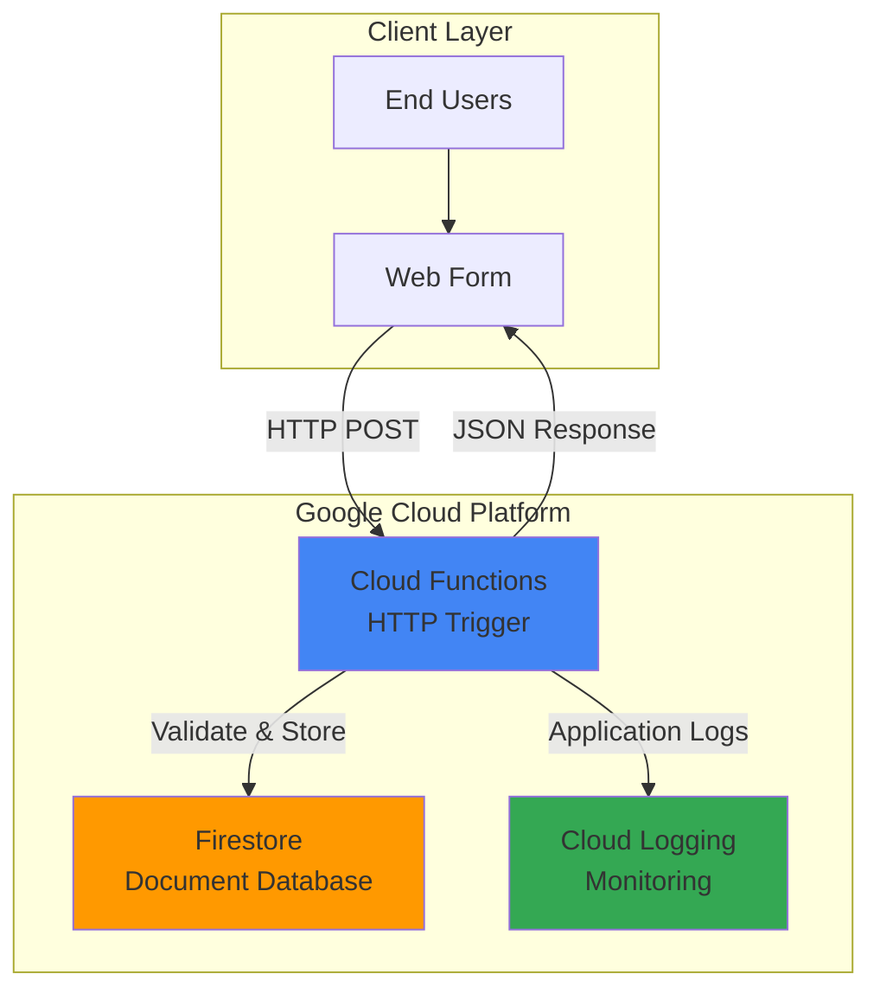

# Form Data Validation with Cloud Functions and Firestore

## Problem

Small businesses often need to collect customer information through web forms but struggle with unreliable data quality and lack of proper validation. Without server-side validation, forms accept incomplete or incorrectly formatted data, leading to customer service issues and unusable contact information that impacts business operations and customer communication effectiveness.

## Solution

Create a serverless HTTP API using Cloud Functions that validates form submissions with Python validation rules and stores clean data in Firestore. This approach provides automatic scaling, built-in security, and reliable data persistence while maintaining cost efficiency through pay-per-request pricing and eliminating server management overhead.

## Architecture Diagram



## Prerequisites

1. Google Cloud account with billing enabled and appropriate permissions for Cloud Functions, Firestore, and Cloud Logging
2. Google Cloud CLI installed and configured (or Cloud Shell access)
3. Basic understanding of Python programming and HTTP requests
4. Understanding of JSON data structures and NoSQL concepts
5. Estimated cost: $0.02-0.05 for tutorial completion (free tier eligible)

> **Note**: This recipe uses serverless services that automatically scale and only charge for actual usage, making it cost-effective for learning and small applications.

## Preparation

```bash
# Set environment variables for GCP resources
export PROJECT_ID="form-validation-$(date +%s)"
export REGION="us-central1"
export FUNCTION_NAME="validate-form-data"

# Generate unique suffix for resource names
RANDOM_SUFFIX=$(openssl rand -hex 3)

# Create and set project
gcloud projects create ${PROJECT_ID} \
    --name="Form Validation Tutorial"
gcloud config set project ${PROJECT_ID}
gcloud config set compute/region ${REGION}

# Enable required APIs
gcloud services enable cloudfunctions.googleapis.com
gcloud services enable firestore.googleapis.com
gcloud services enable logging.googleapis.com

echo "✅ Project configured: ${PROJECT_ID}"
```

## Steps

1. **Initialize Firestore Database**:

   Firestore provides a serverless, NoSQL document database that automatically scales and handles high availability without requiring database administration. The native mode offers strong consistency and ACID transactions, making it ideal for storing validated form data with reliable read-after-write consistency.

   ```bash
   # Create Firestore database in native mode
   gcloud firestore databases create \
       --location=${REGION} \
       --type=firestore-native
   
   echo "✅ Firestore database initialized in native mode"
   ```

   The database is now ready to accept document writes with automatic indexing and real-time synchronization capabilities built into the Google Cloud infrastructure.

2. **Create Function Source Directory**:

   ```bash
   # Create project directory structure
   mkdir -p form-validation-function
   cd form-validation-function
   
   echo "✅ Function directory created"
   ```

3. **Create Python Dependencies File**:

   The Functions Framework enables local development and cloud deployment with consistent behavior across environments. The google-cloud-firestore client provides Python access to Firestore with automatic authentication and connection pooling for optimal performance.

   ```bash
   # Create requirements.txt with necessary dependencies
   cat > requirements.txt << 'EOF'
   functions-framework==3.*
   google-cloud-firestore>=2.0.0
   google-cloud-logging>=3.0.0
   EOF
   
   echo "✅ Dependencies file created"
   ```

4. **Implement Form Validation Function**:

   This serverless function uses the Functions Framework HTTP decorator to handle web requests and implements comprehensive validation logic for common form fields. The validation includes email format checking, required field validation, and data sanitization to ensure clean data storage.

   ```bash
   # Create main function file
   cat > main.py << 'EOF'
   import functions_framework
   import json
   import re
   from google.cloud import firestore
   from google.cloud import logging as cloud_logging
   import logging
   from datetime import datetime

   # Initialize Firestore client
   db = firestore.Client()

   # Initialize Cloud Logging
   logging_client = cloud_logging.Client()
   logging_client.setup_logging()

   def validate_email(email):
       """Validate email format using regex pattern"""
       pattern = r'^[a-zA-Z0-9._%+-]+@[a-zA-Z0-9.-]+\.[a-zA-Z]{2,}$'
       return re.match(pattern, email) is not None

   def validate_phone(phone):
       """Validate phone number (basic US format)"""
       # Remove all non-digits
       clean_phone = re.sub(r'\D', '', phone)
       return len(clean_phone) == 10

   def sanitize_string(value, max_length=100):
       """Sanitize string input by trimming and limiting length"""
       if not isinstance(value, str):
           return ""
       return value.strip()[:max_length]

   @functions_framework.http
   def validate_form_data(request):
       """
       HTTP Cloud Function for form data validation and storage
       """
       # Set CORS headers for web browser compatibility
       headers = {
           'Access-Control-Allow-Origin': '*',
           'Access-Control-Allow-Methods': 'POST, OPTIONS',
           'Access-Control-Allow-Headers': 'Content-Type'
       }
       
       # Handle preflight OPTIONS request
       if request.method == 'OPTIONS':
           return ('', 204, headers)
       
       # Only accept POST requests for form submission
       if request.method != 'POST':
           return (json.dumps({'error': 'Method not allowed'}), 405, headers)
       
       try:
           # Parse JSON request body
           request_json = request.get_json(silent=True)
           if not request_json:
               return (json.dumps({'error': 'Invalid JSON payload'}), 400, headers)
           
           # Extract and validate form fields
           errors = []
           
           # Validate required name field
           name = sanitize_string(request_json.get('name', ''))
           if not name:
               errors.append('Name is required')
           elif len(name) < 2:
               errors.append('Name must be at least 2 characters')
           
           # Validate email field
           email = sanitize_string(request_json.get('email', ''))
           if not email:
               errors.append('Email is required')
           elif not validate_email(email):
               errors.append('Invalid email format')
           
           # Validate phone field (optional)
           phone = sanitize_string(request_json.get('phone', ''))
           if phone and not validate_phone(phone):
               errors.append('Invalid phone number format')
           
           # Validate message field
           message = sanitize_string(request_json.get('message', ''), 500)
           if not message:
               errors.append('Message is required')
           elif len(message) < 10:
               errors.append('Message must be at least 10 characters')
           
           # Return validation errors if any
           if errors:
               logging.warning(f'Form validation failed: {errors}')
               return (json.dumps({
                   'success': False,
                   'errors': errors
               }), 400, headers)
           
           # Create document data for Firestore
           form_data = {
               'name': name,
               'email': email.lower(),  # Normalize email to lowercase
               'phone': re.sub(r'\D', '', phone) if phone else None,
               'message': message,
               'submitted_at': datetime.utcnow(),
               'source': 'web_form'
           }
           
           # Store validated data in Firestore
           doc_ref = db.collection('form_submissions').add(form_data)
           document_id = doc_ref[1].id
           
           # Log successful submission
           logging.info(f'Form submitted successfully: {document_id}')
           
           # Return success response
           return (json.dumps({
               'success': True,
               'message': 'Form submitted successfully',
               'id': document_id
           }), 200, headers)
           
       except Exception as e:
           # Log error and return generic error response
           logging.error(f'Function error: {str(e)}')
           return (json.dumps({
               'success': False,
               'error': 'Internal server error'
           }), 500, headers)
   EOF
   
   echo "✅ Function code created with validation logic"
   ```

   The function implements comprehensive validation including email regex patterns, phone number formatting, and string sanitization while providing detailed error messages for client-side handling. Cloud Logging integration enables monitoring and debugging in production environments.

5. **Deploy Cloud Function**:

   Cloud Functions automatically provisions compute resources, handles HTTP routing, and manages scaling based on request volume. The deployment process builds the runtime environment with specified dependencies and configures the HTTP trigger endpoint.

   ```bash
   # Deploy function with HTTP trigger (2nd generation)
   gcloud functions deploy ${FUNCTION_NAME} \
       --runtime python312 \
       --trigger-http \
       --allow-unauthenticated \
       --region ${REGION} \
       --source . \
       --entry-point validate_form_data \
       --memory 256MB \
       --timeout 60s \
       --gen2
   
   # Get function URL for testing
   FUNCTION_URL=$(gcloud functions describe ${FUNCTION_NAME} \
       --region=${REGION} \
       --format="value(httpsTrigger.url)")
   
   echo "✅ Function deployed successfully"
   echo "Function URL: ${FUNCTION_URL}"
   ```

   The function is now accessible via HTTPS with automatic SSL termination and global load balancing provided by Google Cloud's infrastructure.

6. **Test Form Validation with Valid Data**:

   ```bash
   # Test with valid form submission
   curl -X POST "${FUNCTION_URL}" \
       -H "Content-Type: application/json" \
       -d '{
           "name": "John Smith",
           "email": "john@example.com",
           "phone": "555-123-4567",
           "message": "Hello, this is a test message for the form validation system."
       }'
   
   echo "✅ Valid form data test completed"
   ```

7. **Test Form Validation with Invalid Data**:

   ```bash
   # Test with invalid data to verify validation
   curl -X POST "${FUNCTION_URL}" \
       -H "Content-Type: application/json" \
       -d '{
           "name": "A",
           "email": "invalid-email",
           "phone": "123",
           "message": "Short"
       }'
   
   echo "✅ Invalid form data test completed"
   ```

## Validation & Testing

1. **Verify Firestore Data Storage**:

   ```bash
   # Check stored documents in Firestore using Cloud Console
   echo "View documents at: https://console.cloud.google.com/firestore/data?project=${PROJECT_ID}"
   
   # Alternative: Query documents programmatically
   gcloud firestore documents list \
       --collection=form_submissions \
       --limit=5 \
       --format="table(name,createTime)"
   ```

   Expected output: List of document references with creation timestamps showing validated form data storage.

2. **Test Function Logs**:

   ```bash
   # View function execution logs
   gcloud functions logs read ${FUNCTION_NAME} \
       --region=${REGION} \
       --limit=10
   ```

   Expected output: Log entries showing successful form submissions and any validation errors with timestamps and severity levels.

3. **Test API Response Format**:

   ```bash
   # Verify JSON response structure
   curl -s -X POST "${FUNCTION_URL}" \
       -H "Content-Type: application/json" \
       -d '{"name":"Test User","email":"test@example.com","message":"Test message for API verification"}' \
       | python3 -m json.tool
   ```

   Expected output: Well-formed JSON response with success status, message, and document ID.

## Cleanup

1. **Delete Cloud Function**:

   ```bash
   # Remove deployed function
   gcloud functions delete ${FUNCTION_NAME} \
       --region=${REGION} \
       --quiet
   
   echo "✅ Cloud Function deleted"
   ```

2. **Clear Firestore Data**:

   ```bash
   # Delete Firestore database (requires manual confirmation)
   gcloud firestore databases delete \
       --database=${PROJECT_ID} \
       --quiet || echo "Database deletion may require manual confirmation"
   
   echo "✅ Firestore data cleared"
   ```

3. **Delete Project Resources**:

   ```bash
   # Delete entire project to ensure complete cleanup
   gcloud projects delete ${PROJECT_ID} --quiet
   
   echo "✅ Project and all resources deleted"
   echo "Note: Project deletion may take several minutes to complete"
   ```

## Discussion

This serverless form validation solution demonstrates the power of Google Cloud's managed services for building scalable, cost-effective applications. Cloud Functions (2nd generation) provides automatic scaling from zero to thousands of concurrent requests while maintaining sub-second cold start times for Python runtimes. The pay-per-invocation pricing model makes it ideal for applications with variable or unpredictable traffic patterns, as you only pay for actual usage rather than provisioned capacity.

Firestore's document-based storage model naturally accommodates form data structure with its flexible schema and automatic indexing capabilities. The strong consistency guarantees ensure that validated data is immediately available for read operations, while the multi-region replication provides built-in disaster recovery. The integration between Cloud Functions and Firestore leverages Google's internal network for low-latency, high-throughput data operations without additional configuration.

The validation logic implemented follows industry best practices for input sanitization and error handling. Email validation uses RFC-compliant regular expressions, while phone number validation accommodates common US formatting variations. The error response structure provides actionable feedback for client-side form improvements while preventing information disclosure about the system's internal workings. For production deployments, consider implementing rate limiting, request size limits, and more sophisticated validation rules based on business requirements as outlined in the [Google Cloud security best practices](https://cloud.google.com/security/best-practices).

Cloud Logging integration provides comprehensive observability into function execution with structured logging and automatic correlation between related log entries. This enables effective monitoring, alerting, and debugging capabilities essential for production applications. The logging configuration follows Google Cloud's best practices for log sampling and retention policies as described in the [Cloud Logging documentation](https://cloud.google.com/logging/docs/best-practices).

> **Tip**: Consider implementing client-side validation as the first line of defense, with server-side validation as the authoritative check to ensure data quality and security.

## Challenge

Extend this solution by implementing these enhancements:

1. **Add Email Notifications**: Integrate with SendGrid or use Cloud Functions with Gmail API to send confirmation emails to form submitters using the validated email addresses.

2. **Implement Form Templates**: Create multiple form schemas stored in Firestore and modify the validation function to handle different form types dynamically based on a form_type parameter.

3. **Add Analytics Dashboard**: Use BigQuery and Looker Studio to create analytics dashboards showing form submission trends, validation error patterns, and conversion rates.

4. **Implement Advanced Security**: Add reCAPTCHA verification, IP-based rate limiting using Cloud Armor, and input validation against common attack patterns like SQL injection and XSS.

5. **Create Multi-Language Support**: Extend validation to support international phone numbers, addresses, and localized error messages using Cloud Translation API.

## Infrastructure Code

### Available Infrastructure as Code:

- [Infrastructure Code Overview](code/README.md) - Detailed description of all infrastructure components
- [Infrastructure Manager](code/infrastructure-manager/) - GCP Infrastructure Manager templates
- [Bash CLI Scripts](code/scripts/) - Example bash scripts using gcloud CLI commands to deploy infrastructure
- [Terraform](code/terraform/) - Terraform configuration files