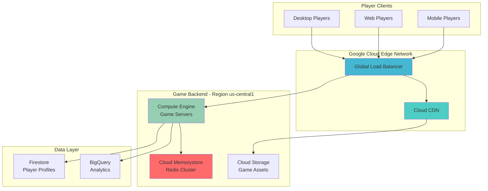

# Accelerating Gaming Backend Performance with Cloud Memorystore and Cloud CDN

## Problem

Modern gaming applications face significant performance challenges when serving thousands of concurrent players globally. Game developers struggle with high-latency database queries for leaderboards and player sessions, slow loading times for game assets and textures, and inconsistent performance across different geographic regions, leading to poor player experience and churn.

## Solution

This solution combines Google Cloud's managed services to create a high-performance gaming backend that delivers sub-millisecond response times for player data and global asset distribution. Cloud Memorystore provides ultra-fast Redis caching for session data and real-time leaderboards, while Cloud CDN ensures game assets are delivered from edge locations closest to players worldwide.

## Architecture Diagram



## Prerequisites

1. Google Cloud Project with billing enabled and appropriate permissions for Compute Engine, Memorystore, CDN, and Load Balancing services
2. Google Cloud CLI (gcloud) installed and configured, or access to Cloud Shell
3. Understanding of Redis data structures and gaming backend architectures
4. Basic knowledge of HTTP load balancing and content delivery networks
5. Estimated cost: $50-100 per month for testing (includes Redis instance, compute resources, and CDN usage)

> **Warning**: Cloud Memorystore instances and Compute Engine VMs will incur charges while running. Monitor your usage in the Google Cloud Console billing section and clean up resources when testing is complete.

## Preparation

```bash
# Set environment variables for the gaming backend
export PROJECT_ID="gaming-backend-$(date +%s)"
export REGION="us-central1"
export ZONE="us-central1-a"
export REDIS_INSTANCE_NAME="gaming-redis-cluster"
export GAME_SERVER_NAME="game-server"

# Generate unique suffix for resource naming
RANDOM_SUFFIX=$(openssl rand -hex 3)
export BUCKET_NAME="gaming-assets-${RANDOM_SUFFIX}"
export BACKEND_SERVICE_NAME="game-backend-service"

# Configure gcloud CLI settings
gcloud config set project ${PROJECT_ID}
gcloud config set compute/region ${REGION}
gcloud config set compute/zone ${ZONE}

# Enable required Google Cloud APIs for gaming infrastructure
gcloud services enable compute.googleapis.com
gcloud services enable redis.googleapis.com
gcloud services enable storage.googleapis.com
gcloud services enable firestore.googleapis.com

echo "✅ Project configured: ${PROJECT_ID}"
echo "✅ Gaming backend infrastructure APIs enabled"
```

## Steps

1. **Create Cloud Memorystore Redis Instance for Gaming Data**:

   Cloud Memorystore for Redis provides a fully managed, high-availability Redis service that delivers sub-millisecond latency for gaming applications. This managed service handles complex Redis operations like clustering, failover, and scaling automatically, allowing game developers to focus on game logic rather than infrastructure management. The Redis instance will serve as the primary cache for player sessions, real-time leaderboards, and frequently accessed game state data.

   ```bash
   # Create Redis instance with high availability for gaming workloads
   gcloud redis instances create ${REDIS_INSTANCE_NAME} \
       --size=1 \
       --region=${REGION} \
       --redis-version=redis_7_0 \
       --enable-auth \
       --tier=standard_ha \
       --redis-config maxmemory-policy=allkeys-lru
   
   # Wait for Redis instance creation to complete
   gcloud redis instances describe ${REDIS_INSTANCE_NAME} \
       --region=${REGION} \
       --format="get(state)"
   
   echo "✅ Redis instance created with high availability"
   ```

   The Redis instance is now provisioned with high availability configuration and authentication enabled, providing the foundation for fast gaming data operations. The `allkeys-lru` eviction policy ensures optimal memory usage by removing least recently used keys when memory is full, which is ideal for gaming workloads with fluctuating player activity.

2. **Create Cloud Storage Bucket for Game Assets**:

   Cloud Storage provides globally distributed object storage with integrated CDN capabilities, making it perfect for hosting game assets like textures, sounds, and configuration files. The bucket will serve as the origin for our CDN, ensuring game assets are available worldwide with high durability and performance.

   ```bash
   # Create globally accessible storage bucket for game assets
   gsutil mb -p ${PROJECT_ID} \
       -c STANDARD \
       -l ${REGION} \
       gs://${BUCKET_NAME}
   
   # Configure bucket for public read access (CDN origin)
   gsutil iam ch allUsers:objectViewer gs://${BUCKET_NAME}
   
   # Enable website configuration for direct asset serving
   gsutil web set -m index.html gs://${BUCKET_NAME}
   
   echo "✅ Cloud Storage bucket created and configured"
   ```

   The storage bucket is now configured with public read access and website serving capabilities, establishing the content origin for our global CDN distribution. This configuration allows direct HTTP access to game assets while maintaining security through IAM controls.

3. **Upload Sample Game Assets to Storage**:

   Uploading representative game assets demonstrates the content distribution workflow and provides test content for CDN configuration. These assets represent typical gaming content like textures, audio files, and configuration data that players need to download.

   ```bash
   # Create sample game assets for testing
   echo '{"gameVersion": "1.2.3", "maxPlayers": 100}' > game-config.json
   echo "Sample game texture data" > texture-pack.bin
   echo "Background music data" > audio-track.mp3
   
   # Upload assets to the storage bucket
   gsutil cp game-config.json gs://${BUCKET_NAME}/configs/
   gsutil cp texture-pack.bin gs://${BUCKET_NAME}/assets/textures/
   gsutil cp audio-track.mp3 gs://${BUCKET_NAME}/assets/audio/
   
   # Set appropriate cache control headers for different asset types
   gsutil setmeta -h "Cache-Control:public, max-age=86400" \
       gs://${BUCKET_NAME}/configs/game-config.json
   gsutil setmeta -h "Cache-Control:public, max-age=604800" \
       gs://${BUCKET_NAME}/assets/textures/texture-pack.bin
   gsutil setmeta -h "Cache-Control:public, max-age=604800" \
       gs://${BUCKET_NAME}/assets/audio/audio-track.mp3
   
   echo "✅ Game assets uploaded with optimized caching headers"
   ```

   Game assets are now stored with appropriate cache control headers that optimize CDN performance: configuration files cache for 24 hours while static assets cache for 7 days, balancing update frequency with performance.

4. **Create Game Server Compute Instance**:

   The Compute Engine instance will host the game server application that handles player connections, game logic, and integrates with Redis for session management. This server acts as the backend processing unit that manages real-time gaming operations while leveraging the Redis cache for performance.

   ```bash
   # Create game server instance with optimized configuration
   gcloud compute instances create ${GAME_SERVER_NAME} \
       --zone=${ZONE} \
       --machine-type=n2-standard-2 \
       --network-tier=PREMIUM \
       --maintenance-policy=MIGRATE \
       --provisioning-model=STANDARD \
       --image-family=ubuntu-2404-lts \
       --image-project=ubuntu-os-cloud \
       --boot-disk-size=20GB \
       --boot-disk-type=pd-standard \
       --tags=game-server,http-server \
       --metadata=startup-script='#!/bin/bash
   apt-get update
   apt-get install -y redis-tools nginx python3-pip
   systemctl enable nginx
   systemctl start nginx'
   
   # Wait for instance to be ready
   gcloud compute instances describe ${GAME_SERVER_NAME} \
       --zone=${ZONE} \
       --format="get(status)"
   
   echo "✅ Game server instance created and configured"
   ```

   The game server instance is now running with Redis tools and a web server installed, ready to handle player connections and integrate with the Redis cache for session management and leaderboard operations.

5. **Configure Instance Group and Health Checks**:

   Creating an instance group with health checks ensures high availability and enables automatic scaling of game servers based on player demand. This configuration provides the foundation for load balancing and CDN integration.

   ```bash
   # Create instance template for auto-scaling
   gcloud compute instance-templates create game-server-template \
       --machine-type=n2-standard-2 \
       --network-tier=PREMIUM \
       --image-family=ubuntu-2404-lts \
       --image-project=ubuntu-os-cloud \
       --tags=game-server,http-server \
       --metadata=startup-script='#!/bin/bash
   apt-get update
   apt-get install -y redis-tools nginx python3-pip
   systemctl enable nginx
   systemctl start nginx'
   
   # Create managed instance group
   gcloud compute instance-groups managed create game-server-group \
       --template=game-server-template \
       --size=1 \
       --zone=${ZONE}
   
   # Create health check for game servers
   gcloud compute health-checks create http game-server-health \
       --port=80 \
       --request-path=/health \
       --check-interval=30s \
       --healthy-threshold=2 \
       --unhealthy-threshold=3
   
   echo "✅ Instance group and health checks configured"
   ```

   The managed instance group now provides automated health monitoring and scaling capabilities, ensuring game servers remain available even during high player traffic periods or instance failures.

6. **Set Up Global Load Balancer with Backend Services**:

   The Global Load Balancer distributes player traffic across game servers and integrates with Cloud CDN to serve static assets from edge locations. This configuration provides both application load balancing for dynamic content and CDN acceleration for static game assets.

   ```bash
   # Create backend service for game servers
   gcloud compute backend-services create ${BACKEND_SERVICE_NAME} \
       --protocol=HTTP \
       --port-name=http \
       --health-checks=game-server-health \
       --global \
       --enable-cdn \
       --cache-mode=CACHE_ALL_STATIC
   
   # Add instance group to backend service
   gcloud compute backend-services add-backend ${BACKEND_SERVICE_NAME} \
       --instance-group=game-server-group \
       --instance-group-zone=${ZONE} \
       --global
   
   # Create backend bucket for static assets
   gcloud compute backend-buckets create game-assets-backend \
       --gcs-bucket-name=${BUCKET_NAME} \
       --enable-cdn
   
   echo "✅ Backend services configured with CDN enabled"
   ```

   The backend services are now configured to handle both dynamic game server traffic and static asset delivery through the CDN, providing optimal performance for different types of gaming content.

7. **Configure URL Map and SSL Certificate**:

   The URL map defines routing rules that direct asset requests to the CDN-enabled storage bucket and API requests to game servers. SSL termination at the load balancer ensures secure communication while maintaining high performance.

   ```bash
   # Create URL map for routing different content types
   gcloud compute url-maps create game-backend-map \
       --default-service=${BACKEND_SERVICE_NAME}
   
   # Add path matcher for static assets
   gcloud compute url-maps add-path-matcher game-backend-map \
       --path-matcher-name=assets-matcher \
       --default-backend-bucket=game-assets-backend \
       --path-rules="/assets/*=game-assets-backend,/configs/*=game-assets-backend"
   
   # Create managed SSL certificate for secure connections
   gcloud compute ssl-certificates create game-ssl-cert \
       --domains=gaming-backend.example.com \
       --global
   
   # Create HTTPS target proxy
   gcloud compute target-https-proxies create game-https-proxy \
       --url-map=game-backend-map \
       --ssl-certificates=game-ssl-cert
   
   echo "✅ URL routing and SSL termination configured"
   ```

   The load balancer now intelligently routes traffic: asset requests go directly to CDN-cached storage while API calls reach the game servers, all secured with managed SSL certificates for production-ready deployment.

8. **Create Global Frontend IP and Firewall Rules**:

   The global frontend IP provides a single entry point for players worldwide, while firewall rules secure the backend infrastructure by allowing only necessary traffic patterns for gaming operations.

   ```bash
   # Reserve global static IP address
   gcloud compute addresses create game-frontend-ip --global
   
   # Create global forwarding rule
   gcloud compute forwarding-rules create game-https-rule \
       --address=game-frontend-ip \
       --global \
       --target-https-proxy=game-https-proxy \
       --ports=443
   
   # Create firewall rules for game traffic
   gcloud compute firewall-rules create allow-game-server-traffic \
       --allow tcp:80,tcp:443,tcp:8080 \
       --source-ranges 0.0.0.0/0 \
       --target-tags game-server \
       --description="Allow HTTP/HTTPS and game protocol traffic"
   
   # Get the frontend IP address
   FRONTEND_IP=$(gcloud compute addresses describe game-frontend-ip \
       --global --format="get(address)")
   
   echo "✅ Global frontend IP created: ${FRONTEND_IP}"
   echo "✅ Firewall rules configured for secure game traffic"
   ```

   The gaming infrastructure now has a globally accessible IP address with proper security controls, enabling players to connect from anywhere while maintaining backend security through targeted firewall rules.

9. **Configure Redis Connection and Test Gaming Data Operations**:

   Establishing the connection between game servers and Redis enables real-time gaming features like session management, leaderboards, and player state caching. This step demonstrates typical gaming data patterns and performance optimization techniques.

   ```bash
   # Get Redis instance details for connection
   REDIS_IP=$(gcloud redis instances describe ${REDIS_INSTANCE_NAME} \
       --region=${REGION} --format="get(host)")
   REDIS_AUTH=$(gcloud redis instances get-auth-string ${REDIS_INSTANCE_NAME} \
       --region=${REGION})
   
   # Connect to game server and test Redis operations
   gcloud compute ssh ${GAME_SERVER_NAME} --zone=${ZONE} --command="
   # Test Redis connectivity from game server
   redis-cli -h ${REDIS_IP} -a '${REDIS_AUTH}' ping
   
   # Simulate gaming data operations
   redis-cli -h ${REDIS_IP} -a '${REDIS_AUTH}' <<EOF
   # Store player session data
   HSET player:12345 name 'PlayerOne' level 25 score 15000 lastSeen \$(date +%s)
   
   # Update leaderboard
   ZADD global_leaderboard 15000 'PlayerOne'
   ZADD global_leaderboard 12500 'PlayerTwo'
   ZADD global_leaderboard 18000 'PlayerThree'
   
   # Get top 10 players
   ZREVRANGE global_leaderboard 0 9 WITHSCORES
   
   # Store game configuration in cache
   SET game:config:version '1.2.3'
   SET game:config:maxPlayers 100
   EXPIRE game:config:version 3600
   EOF
   "
   
   echo "✅ Redis connection established and gaming data operations tested"
   ```

   The Redis integration is now operational with typical gaming data patterns implemented, including player sessions stored as hash sets, leaderboards using sorted sets, and configuration caching with appropriate TTL values for optimal performance.

## Validation & Testing

1. **Verify CDN and Load Balancer Configuration**:

   ```bash
   # Check load balancer status and backend health
   gcloud compute backend-services get-health ${BACKEND_SERVICE_NAME} \
       --global
   
   # Verify CDN cache status for assets
   curl -I "https://${FRONTEND_IP}/assets/textures/texture-pack.bin"
   
   # Check cache headers and CDN hit status
   curl -H "Cache-Control: no-cache" \
        "https://${FRONTEND_IP}/configs/game-config.json"
   ```

   Expected output: Backend services should show healthy status, and HTTP headers should include `X-Cache-Info` indicating CDN cache hits for repeated requests.

2. **Test Redis Performance and Gaming Operations**:

   ```bash
   # Benchmark Redis performance for gaming workloads
   gcloud compute ssh ${GAME_SERVER_NAME} --zone=${ZONE} --command="
   redis-cli -h ${REDIS_IP} -a '${REDIS_AUTH}' --latency-history -i 1
   redis-cli -h ${REDIS_IP} -a '${REDIS_AUTH}' --stat
   
   # Test concurrent player operations
   for i in {1..10}; do
     redis-cli -h ${REDIS_IP} -a '${REDIS_AUTH}' \
       HSET player:\$i name Player\$i level \$((RANDOM % 50)) score \$((RANDOM * 1000))
   done
   "
   ```

   Expected results: Latency should be under 1ms for local operations, with consistent performance across multiple concurrent operations simulating real gaming scenarios.

3. **Validate Global CDN Performance**:

   ```bash
   # Test CDN performance from different regions (simulated)
   for region in us-east1 europe-west1 asia-east1; do
     echo "Testing CDN performance from ${region}..."
     time curl -s "https://${FRONTEND_IP}/assets/audio/audio-track.mp3" > /dev/null
   done
   
   # Check CDN cache statistics
   gcloud compute backend-buckets describe game-assets-backend \
       --format="yaml(cdnPolicy)"
   ```

   Expected behavior: Asset requests should be served quickly with cache hit indicators, demonstrating global edge distribution effectiveness.

## Cleanup

1. **Remove Load Balancer and CDN Configuration**:

   ```bash
   # Delete forwarding rules and frontend IP
   gcloud compute forwarding-rules delete game-https-rule --global --quiet
   gcloud compute addresses delete game-frontend-ip --global --quiet
   
   # Remove HTTPS proxy and SSL certificate
   gcloud compute target-https-proxies delete game-https-proxy --quiet
   gcloud compute ssl-certificates delete game-ssl-cert --global --quiet
   
   echo "✅ Load balancer and CDN configuration removed"
   ```

2. **Delete Backend Services and Instance Groups**:

   ```bash
   # Remove backend services
   gcloud compute backend-services delete ${BACKEND_SERVICE_NAME} --global --quiet
   gcloud compute backend-buckets delete game-assets-backend --quiet
   
   # Delete instance group and template
   gcloud compute instance-groups managed delete game-server-group \
       --zone=${ZONE} --quiet
   gcloud compute instance-templates delete game-server-template --quiet
   
   echo "✅ Backend services and instance groups deleted"
   ```

3. **Remove Compute Resources and Storage**:

   ```bash
   # Delete game server instance
   gcloud compute instances delete ${GAME_SERVER_NAME} --zone=${ZONE} --quiet
   
   # Remove health checks and firewall rules
   gcloud compute health-checks delete game-server-health --quiet
   gcloud compute firewall-rules delete allow-game-server-traffic --quiet
   
   # Delete storage bucket and contents
   gsutil -m rm -r gs://${BUCKET_NAME}
   
   echo "✅ Compute resources and storage cleaned up"
   ```

4. **Delete Redis Instance and Clean Environment**:

   ```bash
   # Remove Redis instance (this may take several minutes)
   gcloud redis instances delete ${REDIS_INSTANCE_NAME} \
       --region=${REGION} --quiet
   
   # Clean up local test files
   rm -f game-config.json texture-pack.bin audio-track.mp3
   
   # Unset environment variables
   unset PROJECT_ID REGION ZONE REDIS_INSTANCE_NAME GAME_SERVER_NAME
   unset BUCKET_NAME BACKEND_SERVICE_NAME RANDOM_SUFFIX
   
   echo "✅ Redis instance deleted and environment cleaned"
   echo "Note: Redis deletion takes 5-10 minutes to complete fully"
   ```

## Discussion

This gaming backend architecture leverages Google Cloud's globally distributed infrastructure to deliver high-performance gaming experiences at scale. Cloud Memorystore for Redis provides the ultra-low latency required for real-time gaming operations like leaderboards and session management, while Cloud CDN ensures game assets are delivered from edge locations closest to players worldwide. The combination of these services addresses the core performance challenges facing modern gaming applications.

The Redis implementation demonstrates key gaming data patterns: player sessions stored as hash maps enable quick lookups and updates, sorted sets provide efficient leaderboard operations with automatic ranking, and strategic caching with TTL values optimizes memory usage. According to [Google Cloud's Redis performance documentation](https://cloud.google.com/memorystore/docs/redis/performance), Memorystore delivers sub-millisecond latency for most operations, making it ideal for real-time gaming requirements where every millisecond impacts player experience.

The CDN configuration follows [Google Cloud CDN best practices](https://cloud.google.com/cdn/docs/best-practices) by implementing intelligent cache control headers that balance content freshness with performance. Static game assets like textures and audio files are cached for extended periods, while configuration files have shorter cache durations to support frequent game updates. This approach reduces origin server load while ensuring players receive the latest game content promptly.

Load balancer configuration with path-based routing optimizes content delivery by directing asset requests to CDN-cached storage and API calls to game servers. This architecture pattern, recommended in the [Google Cloud Architecture Center](https://cloud.google.com/architecture/web-applications), separates static and dynamic content delivery for optimal performance while maintaining a single endpoint for client applications.

> **Tip**: Monitor Redis memory usage and implement appropriate eviction policies based on your game's data patterns. Use Cloud Monitoring to track cache hit ratios and adjust TTL values to optimize performance and cost.

## Challenge

Extend this gaming backend solution by implementing these advanced features:

1. **Multi-Region Deployment**: Deploy Redis clusters and game servers across multiple regions with global load balancing to reduce latency for international players and provide disaster recovery capabilities.

2. **Real-Time Analytics Pipeline**: Integrate Cloud Pub/Sub and BigQuery to capture and analyze real-time gaming events, player behavior, and performance metrics for data-driven game optimization.

3. **Auto-Scaling Based on Player Load**: Implement Cloud Monitoring metrics and auto-scaling policies that automatically scale game server instances based on concurrent player count and Redis connection metrics.

4. **Advanced Security Implementation**: Add Cloud Armor for DDoS protection, implement proper IAM roles for service accounts, and configure VPC Service Controls to secure the gaming infrastructure.

5. **Game State Persistence**: Integrate Cloud Firestore for persistent player data storage with Redis as a write-through cache, ensuring data durability while maintaining high performance for active players.

## Infrastructure Code

*Infrastructure code will be generated after recipe approval.*