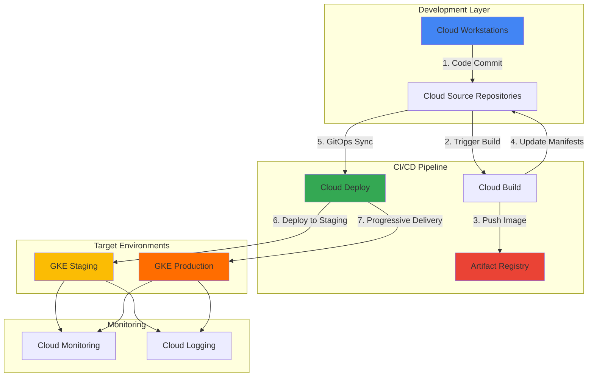

# GitOps Development Workflows with Cloud Workstations and Deploy

## Problem

Development teams struggle with inconsistent development environments, manual deployment processes, and lack of visibility into code-to-production workflows. Traditional development setups require extensive local configuration, while manual deployments create bottlenecks and increase the risk of production failures. Organizations need secure, standardized development environments paired with automated GitOps-based delivery pipelines that ensure code quality and deployment consistency.

## Solution

Create a complete GitOps development workflow using Cloud Workstations for standardized development environments and Cloud Deploy for automated continuous delivery. This solution combines secure, browser-accessible development environments with declarative infrastructure-as-code stored in Git repositories. Cloud Build orchestrates the CI/CD pipeline, while Cloud Deploy manages progressive delivery to GKE clusters, ensuring code changes flow seamlessly from development to production with full traceability and rollback capabilities.

## Architecture Diagram



## Prerequisites

1. Google Cloud account with billing enabled and Project Editor permissions
2. gcloud CLI installed and configured (or use Cloud Shell)
3. Basic knowledge of Kubernetes, Docker, and Git workflows
4. Understanding of GitOps principles and CI/CD concepts
5. Estimated cost: $50-100 for running this recipe (includes GKE clusters, workstations, and build minutes)

> **Note**: This recipe creates multiple Google Cloud resources including GKE clusters and Cloud Workstations. Monitor your usage to control costs and clean up resources when finished.

## Preparation

```bash
# Set environment variables for GCP resources
export PROJECT_ID="gitops-workflow-$(date +%s)"
export REGION="us-central1"
export ZONE="us-central1-a"

# Generate unique suffix for resource names
RANDOM_SUFFIX=$(openssl rand -hex 3)
export CLUSTER_NAME="gitops-cluster-${RANDOM_SUFFIX}"
export WORKSTATION_CONFIG="dev-config-${RANDOM_SUFFIX}"
export APP_REPO="hello-app-${RANDOM_SUFFIX}"
export ENV_REPO="hello-env-${RANDOM_SUFFIX}"

# Set default project and region
gcloud config set project ${PROJECT_ID}
gcloud config set compute/region ${REGION}
gcloud config set compute/zone ${ZONE}

# Enable required APIs
gcloud services enable container.googleapis.com \
    cloudbuild.googleapis.com \
    sourcerepo.googleapis.com \
    artifactregistry.googleapis.com \
    workstations.googleapis.com \
    clouddeploy.googleapis.com

echo "✅ Project configured: ${PROJECT_ID}"
echo "✅ Region set to: ${REGION}"
echo "✅ Required APIs enabled"
```

## Steps

1. **Create GKE Clusters for Staging and Production**:

   Google Kubernetes Engine provides managed Kubernetes clusters optimized for GitOps workflows. Creating separate staging and production clusters enables proper environment isolation and progressive delivery patterns. GKE Autopilot simplifies cluster management by automatically handling node provisioning, scaling, and security configurations.

   ```bash
   # Create GKE Autopilot clusters for staging and production
   gcloud container clusters create-auto ${CLUSTER_NAME}-staging \
       --region ${REGION} \
       --labels="env=staging,purpose=gitops"
   
   gcloud container clusters create-auto ${CLUSTER_NAME}-prod \
       --region ${REGION} \
       --labels="env=production,purpose=gitops"
   
   # Get cluster credentials
   gcloud container clusters get-credentials ${CLUSTER_NAME}-staging \
       --region ${REGION}
   gcloud container clusters get-credentials ${CLUSTER_NAME}-prod \
       --region ${REGION}
   
   echo "✅ GKE clusters created successfully"
   ```

   The clusters are now ready with Autopilot's security-hardened configurations and automatic scaling capabilities. This foundation supports GitOps deployments with built-in observability and compliance features essential for production workloads.

2. **Create Artifact Registry Repository**:

   Artifact Registry provides secure, scalable container image storage with vulnerability scanning and access controls. Creating a dedicated repository ensures consistent image management across the CI/CD pipeline while maintaining security through IAM-based access controls and automated vulnerability detection.

   ```bash
   # Create Artifact Registry repository for container images
   gcloud artifacts repositories create ${APP_REPO} \
       --repository-format=docker \
       --location=${REGION} \
       --description="GitOps application images"
   
   # Configure Docker authentication
   gcloud auth configure-docker ${REGION}-docker.pkg.dev
   
   echo "✅ Artifact Registry repository created"
   ```

   The repository is configured with automated vulnerability scanning enabled by default, providing security insights for all pushed container images and supporting compliance requirements for production deployments.

3. **Create Cloud Source Repositories**:

   Cloud Source Repositories provides fully-featured Git repositories with integrated CI/CD triggers and IAM-based access controls. Creating separate repositories for application code and environment configurations follows GitOps best practices by maintaining clear separation between code changes and deployment manifests.

   ```bash
   # Create Git repositories for app code and environment configs
   gcloud source repos create ${APP_REPO}
   gcloud source repos create ${ENV_REPO}
   
   # Clone sample application code
   cd ~
   git clone https://github.com/GoogleCloudPlatform/kubernetes-engine-samples
   cd kubernetes-engine-samples/hello-app
   
   # Configure remote repositories
   git remote add app-origin \
       "https://source.developers.google.com/p/${PROJECT_ID}/r/${APP_REPO}"
   
   echo "✅ Source repositories created and configured"
   ```

   The repositories are now ready with proper authentication and remote configuration, enabling seamless integration with Cloud Build triggers and maintaining audit trails for all code and configuration changes.

4. **Set Up Cloud Workstations Configuration**:

   Cloud Workstations provides secure, standardized development environments accessible through browsers or local IDEs. Creating a workstation configuration ensures all developers work in consistent environments with pre-installed tools, proper authentication, and direct access to Google Cloud services.

   ```bash
   # Create workstation cluster
   gcloud workstations clusters create ${WORKSTATION_CONFIG}-cluster \
       --region=${REGION} \
       --network="projects/${PROJECT_ID}/global/networks/default" \
       --subnetwork="projects/${PROJECT_ID}/regions/${REGION}/subnetworks/default"
   
   # Wait for cluster to be ready
   echo "Waiting for workstation cluster to be ready..."
   sleep 60
   
   # Create workstation configuration with development tools
   gcloud workstations configs create ${WORKSTATION_CONFIG} \
       --cluster=${WORKSTATION_CONFIG}-cluster \
       --cluster-region=${REGION} \
       --machine-type=e2-standard-4 \
       --persistent-disk-size=100GB \
       --container-image=us-central1-docker.pkg.dev/cloud-workstations-images/predefined/code-oss:latest
   
   # Create a workstation instance
   gcloud workstations create dev-workstation \
       --config=${WORKSTATION_CONFIG} \
       --cluster=${WORKSTATION_CONFIG}-cluster \
       --cluster-region=${REGION} \
       --region=${REGION}
   
   echo "✅ Cloud Workstation created successfully"
   ```

   The workstation is configured with VS Code and essential development tools, providing a secure environment with automatic IAM integration and network isolation while maintaining full access to Google Cloud services.

5. **Create Cloud Build CI Pipeline**:

   Cloud Build provides serverless CI/CD capabilities with native integration to Google Cloud services. This pipeline automatically builds container images when code changes are pushed to the app repository, following GitOps principles by updating deployment manifests in the environment repository.

   ```bash
   # Create Cloud Build configuration for CI pipeline
   cat > cloudbuild-ci.yaml << 'EOF'
   steps:
   # Build the container image
   - name: 'gcr.io/cloud-builders/docker'
     args: ['build', '-t', '${_REGION}-docker.pkg.dev/${PROJECT_ID}/${_APP_REPO}/hello-app:${SHORT_SHA}', '.']
   
   # Push the container image to Artifact Registry
   - name: 'gcr.io/cloud-builders/docker'
     args: ['push', '${_REGION}-docker.pkg.dev/${PROJECT_ID}/${_APP_REPO}/hello-app:${SHORT_SHA}']
   
   # Clone the env repository and update manifests
   - name: 'gcr.io/cloud-builders/gcloud'
     entrypoint: 'bash'
     args:
     - '-c'
     - |
       gcloud source repos clone ${_ENV_REPO} env-repo
       cd env-repo
       git config user.email "cloudbuild@${PROJECT_ID}.iam.gserviceaccount.com"
       git config user.name "Cloud Build"
       
       # Update the deployment manifest
       sed -i "s|image: .*|image: ${_REGION}-docker.pkg.dev/${PROJECT_ID}/${_APP_REPO}/hello-app:${SHORT_SHA}|g" k8s/hello-app-deployment.yaml
       git add .
       git commit -m "Update image to ${SHORT_SHA}"
       git push origin main
   
   substitutions:
     _REGION: '${REGION}'
     _APP_REPO: '${APP_REPO}'
     _ENV_REPO: '${ENV_REPO}'
   
   options:
     logging: CLOUD_LOGGING_ONLY
   EOF
   
   echo "✅ CI pipeline configuration created"
   ```

   This CI pipeline follows GitOps principles by automatically updating deployment manifests with new image tags, maintaining a complete audit trail of all changes through Git commits and enabling easy rollbacks through Git history.

6. **Create Cloud Deploy Delivery Pipeline**:

   Cloud Deploy automates progressive delivery across multiple environments with built-in approval gates and rollback capabilities. This configuration enables automated deployments to staging with optional manual approval for production releases, ensuring safety and compliance in the delivery process.

   ```bash
   # Create environment configuration files
   mkdir -p k8s
   
   # Create Kubernetes deployment manifest
   cat > k8s/hello-app-deployment.yaml << 'EOF'
   apiVersion: apps/v1
   kind: Deployment
   metadata:
     name: hello-app
     labels:
       app: hello-app
   spec:
     replicas: 3
     selector:
       matchLabels:
         app: hello-app
     template:
       metadata:
         labels:
           app: hello-app
       spec:
         containers:
         - name: hello-app
           image: us-central1-docker.pkg.dev/PROJECT_ID/APP_REPO/hello-app:latest
           ports:
           - containerPort: 8080
   ---
   apiVersion: v1
   kind: Service
   metadata:
     name: hello-app-service
   spec:
     selector:
       app: hello-app
     ports:
     - protocol: TCP
       port: 80
       targetPort: 8080
     type: LoadBalancer
   EOF
   
   # Create Cloud Deploy configuration
   cat > clouddeploy.yaml << EOF
   apiVersion: deploy.cloud.google.com/v1
   kind: DeliveryPipeline
   metadata:
     name: gitops-pipeline
   description: GitOps delivery pipeline
   serialPipeline:
     stages:
     - targetId: staging
       profiles: []
     - targetId: production
       profiles: []
       strategy:
         standard:
           verify: false
   ---
   apiVersion: deploy.cloud.google.com/v1
   kind: Target
   metadata:
     name: staging
   description: Staging environment
   gke:
     cluster: projects/${PROJECT_ID}/locations/${REGION}/clusters/${CLUSTER_NAME}-staging
   ---
   apiVersion: deploy.cloud.google.com/v1
   kind: Target
   metadata:
     name: production
   description: Production environment
   gke:
     cluster: projects/${PROJECT_ID}/locations/${REGION}/clusters/${CLUSTER_NAME}-prod
   EOF
   
   # Apply Cloud Deploy configuration
   gcloud deploy apply --file=clouddeploy.yaml --region=${REGION}
   
   echo "✅ Cloud Deploy pipeline configured"
   ```

   The delivery pipeline is configured with progressive deployment stages, automated deployment to staging, and manual approval gates for production, ensuring code quality and enabling safe, controlled releases.

7. **Initialize Environment Repository**:

   The environment repository contains Kubernetes manifests and deployment configurations that define the desired state of applications across environments. Initializing this repository with proper structure and configurations enables GitOps controllers to synchronize the actual cluster state with the declared desired state.

   ```bash
   # Initialize environment repository with manifests
   cd ~
   mkdir ${ENV_REPO}-local
   cd ${ENV_REPO}-local
   
   git init
   git remote add origin \
       "https://source.developers.google.com/p/${PROJECT_ID}/r/${ENV_REPO}"
   
   # Create directory structure
   mkdir -p k8s
   
   # Copy deployment manifests
   cp ~/k8s/hello-app-deployment.yaml k8s/
   
   # Update manifest with correct project and repository
   sed -i "s/PROJECT_ID/${PROJECT_ID}/g" k8s/hello-app-deployment.yaml
   sed -i "s/APP_REPO/${APP_REPO}/g" k8s/hello-app-deployment.yaml
   
   # Configure Git and push initial commit
   git config user.email "admin@${PROJECT_ID}.iam.gserviceaccount.com"
   git config user.name "GitOps Admin"
   git add .
   git commit -m "Initial environment configuration"
   git push -u origin main
   
   echo "✅ Environment repository initialized"
   ```

   The environment repository is now structured for GitOps workflows with versioned Kubernetes manifests that serve as the source of truth for deployment configurations across all environments.

8. **Configure Cloud Build Triggers**:

   Cloud Build triggers enable automatic CI/CD pipeline execution based on Git repository changes. Setting up triggers for both application code changes and environment configuration updates creates a complete GitOps workflow with automated testing, building, and deployment processes.

   ```bash
   # Create CI trigger for app repository
   gcloud builds triggers create cloud-source-repositories \
       --repo=${APP_REPO} \
       --branch-pattern="^main$" \
       --build-config=cloudbuild-ci.yaml \
       --description="CI pipeline for application code"
   
   # Push application code to trigger initial build
   cd ~/kubernetes-engine-samples/hello-app
   cp ~/cloudbuild-ci.yaml .
   git add .
   git commit -m "Add CI/CD pipeline configuration"
   git push app-origin main
   
   echo "✅ Build triggers configured and initial pipeline started"
   ```

   The triggers are now active and will automatically execute the CI/CD pipeline whenever changes are pushed to the main branch, ensuring continuous integration and automated deployment of application updates.

## Validation & Testing

1. **Verify GKE Clusters and Cloud Deploy Setup**:

   ```bash
   # Check cluster status
   gcloud container clusters list --filter="name~${CLUSTER_NAME}"
   
   # Verify Cloud Deploy pipeline
   gcloud deploy delivery-pipelines list --region=${REGION}
   
   # Check Artifact Registry repository
   gcloud artifacts repositories list --location=${REGION}
   ```

   Expected output: Both clusters should show as "RUNNING", delivery pipeline should be listed, and Artifact Registry repository should be created.

2. **Test Cloud Workstation Access**:

   ```bash
   # Check workstation status
   gcloud workstations list \
       --config=${WORKSTATION_CONFIG} \
       --cluster=${WORKSTATION_CONFIG}-cluster \
       --cluster-region=${REGION} \
       --region=${REGION}
   
   # Start the workstation
   gcloud workstations start dev-workstation \
       --config=${WORKSTATION_CONFIG} \
       --cluster=${WORKSTATION_CONFIG}-cluster \
       --cluster-region=${REGION} \
       --region=${REGION}
   ```

   Expected output: Workstation should show as "ACTIVE" status and be accessible through the Cloud Console.

3. **Verify CI/CD Pipeline Execution**:

   ```bash
   # Check recent Cloud Build jobs
   gcloud builds list --limit=5
   
   # Verify container image was pushed
   gcloud artifacts docker images list \
       ${REGION}-docker.pkg.dev/${PROJECT_ID}/${APP_REPO}
   
   # Check Cloud Deploy releases
   gcloud deploy releases list \
       --delivery-pipeline=gitops-pipeline \
       --region=${REGION}
   ```

   Expected output: Recent builds should show "SUCCESS" status, container images should be listed, and releases should be created for the delivery pipeline.

4. **Test Application Deployment**:

   ```bash
   # Check application pods in staging cluster
   kubectl config use-context \
       gke_${PROJECT_ID}_${REGION}_${CLUSTER_NAME}-staging
   kubectl get pods -l app=hello-app
   
   # Get service external IP
   kubectl get service hello-app-service
   
   # Test application endpoint (wait for LoadBalancer IP)
   EXTERNAL_IP=$(kubectl get service hello-app-service \
       -o jsonpath='{.status.loadBalancer.ingress[0].ip}')
   curl http://${EXTERNAL_IP}
   ```

   Expected output: Pods should be running, service should have external IP assigned, and curl should return application response.

## Cleanup

1. **Delete Cloud Deploy Resources**:

   ```bash
   # Delete delivery pipeline
   gcloud deploy delivery-pipelines delete gitops-pipeline \
       --region=${REGION} \
       --quiet
   
   echo "✅ Cloud Deploy pipeline deleted"
   ```

2. **Remove GKE Clusters**:

   ```bash
   # Delete GKE clusters
   gcloud container clusters delete ${CLUSTER_NAME}-staging \
       --region=${REGION} \
       --quiet
   
   gcloud container clusters delete ${CLUSTER_NAME}-prod \
       --region=${REGION} \
       --quiet
   
   echo "✅ GKE clusters deleted"
   ```

3. **Delete Cloud Workstations**:

   ```bash
   # Delete workstation instance
   gcloud workstations delete dev-workstation \
       --config=${WORKSTATION_CONFIG} \
       --cluster=${WORKSTATION_CONFIG}-cluster \
       --cluster-region=${REGION} \
       --region=${REGION} \
       --quiet
   
   # Delete workstation configuration
   gcloud workstations configs delete ${WORKSTATION_CONFIG} \
       --cluster=${WORKSTATION_CONFIG}-cluster \
       --cluster-region=${REGION} \
       --quiet
   
   # Delete workstation cluster
   gcloud workstations clusters delete ${WORKSTATION_CONFIG}-cluster \
       --region=${REGION} \
       --quiet
   
   echo "✅ Cloud Workstations deleted"
   ```

4. **Remove Repositories and Artifacts**:

   ```bash
   # Delete Cloud Build triggers
   TRIGGER_IDS=$(gcloud builds triggers list --format="value(id)")
   for trigger in $TRIGGER_IDS; do
       gcloud builds triggers delete $trigger --quiet
   done
   
   # Delete Artifact Registry repository
   gcloud artifacts repositories delete ${APP_REPO} \
       --location=${REGION} \
       --quiet
   
   # Delete Source repositories
   gcloud source repos delete ${APP_REPO} --quiet
   gcloud source repos delete ${ENV_REPO} --quiet
   
   # Clean up local directories
   rm -rf ~/${ENV_REPO}-local
   rm -rf ~/kubernetes-engine-samples
   rm -f ~/cloudbuild-ci.yaml
   rm -f ~/clouddeploy.yaml
   rm -rf ~/k8s
   
   echo "✅ All resources cleaned up successfully"
   ```

## Discussion

This GitOps workflow implementation demonstrates how Google Cloud's integrated DevOps services create a complete development-to-production pipeline that follows modern software delivery best practices. Cloud Workstations provides the foundation with secure, standardized development environments that eliminate the "works on my machine" problem while ensuring developers have consistent access to tools and authentication. The browser-based access model reduces local setup complexity and enables secure remote development patterns essential for distributed teams.

The core of this solution lies in the GitOps methodology, where Git repositories serve as the single source of truth for both application code and infrastructure configuration. This approach, popularized by Google's Site Reliability Engineering practices, ensures that all changes are auditable, reversible, and consistently applied across environments. Cloud Build orchestrates the continuous integration process by automatically building container images, running tests, and updating deployment manifests in response to code changes, while Cloud Deploy manages the progressive delivery across staging and production environments with built-in approval gates and rollback capabilities.

The separation of application and environment repositories follows GitOps best practices by maintaining different lifecycles for code and configuration changes. This pattern enables teams to deploy the same application version across multiple environments while maintaining environment-specific configurations. Cloud Deploy's integration with GKE clusters provides automated deployment capabilities with visibility into deployment status and history, enabling teams to quickly identify and resolve issues while maintaining deployment velocity.

The solution leverages Google Cloud's integrated security model through IAM-based access controls, service account authentication, and encrypted communication between services. Artifact Registry provides vulnerability scanning for container images, while GKE Autopilot ensures security-hardened cluster configurations with automatic updates and compliance monitoring. This security-by-default approach reduces the operational burden on development teams while maintaining enterprise-grade security standards required for production workloads.

> **Tip**: Monitor Cloud Build usage and optimize trigger configurations to reduce build minutes. Use Cloud Deploy's Progressive Delivery features to implement canary deployments and automated rollbacks for enhanced reliability in production environments.

For additional guidance on GitOps implementation patterns, see the [Google Cloud Architecture Framework](https://cloud.google.com/architecture/framework) and [GKE best practices documentation](https://cloud.google.com/kubernetes-engine/docs/best-practices). The [Cloud Deploy documentation](https://cloud.google.com/deploy/docs) provides detailed configuration options for advanced deployment strategies, while the [Cloud Workstations documentation](https://cloud.google.com/workstations/docs) offers guidance on customizing development environments for specific use cases.

## Challenge

Extend this GitOps workflow by implementing these enhancements:

1. **Implement multi-environment promotion** by adding development and testing stages to the Cloud Deploy pipeline with automated testing and manual approval gates between environments.

2. **Add canary deployment capabilities** using Cloud Deploy's advanced deployment strategies to automatically roll out changes to a subset of users before full production deployment.

3. **Integrate security scanning** by adding Container Analysis API scanning to the CI pipeline and implementing Binary Authorization policies to prevent vulnerable images from being deployed.

4. **Implement automated testing** by extending the Cloud Build pipeline with unit tests, integration tests, and security scans that must pass before deployment proceeds to staging environments.

5. **Add monitoring and alerting** by integrating Cloud Monitoring with custom dashboards for deployment metrics and Cloud Alerting policies that notify teams of deployment failures or performance degradation.

## Infrastructure Code

### Available Infrastructure as Code:

- [Infrastructure Code Overview](code/README.md) - Detailed description of all infrastructure components
- [Infrastructure Manager](code/infrastructure-manager/) - GCP Infrastructure Manager templates
- [Bash CLI Scripts](code/scripts/) - Example bash scripts using gcloud CLI commands to deploy infrastructure
- [Terraform](code/terraform/) - Terraform configuration files