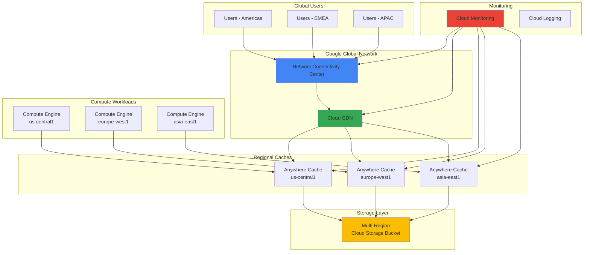

# Establishing Global Content Delivery Infrastructure with Network Connectivity Center and Anywhere Cache

## Problem

Global enterprises struggle with inconsistent content delivery performance across distributed locations, experiencing high latency, expensive data transfer costs, and complex network management overhead. Traditional content delivery solutions often rely on fragmented networking approaches that combine MPLS circuits, SD-WAN appliances, and multiple CDN providers, creating operational complexity and unpredictable performance. These challenges become more pronounced with the rise of AI workloads and large-scale data analytics that require consistent, high-bandwidth access to content across multiple regions.

## Solution

Google's Network Connectivity Center provides a unified enterprise networking backbone that leverages Google's planet-scale infrastructure to deliver optimized content delivery performance. By combining Network Connectivity Center's hub-and-spoke architecture with Cloud Storage Anywhere Cache's intelligent SSD-backed caching, organizations can achieve up to 40% faster performance compared to public internet while reducing total cost of ownership by up to 40%. This solution establishes a high-performance global content delivery infrastructure with comprehensive monitoring through Cloud Monitoring and enhanced edge caching via Cloud CDN.

## Architecture Diagram



## Prerequisites

1. Google Cloud Platform account with Owner or Editor permissions
2. Google Cloud CLI (gcloud) installed and configured (version 400.0.0 or later)
3. Basic understanding of networking concepts and content delivery
4. Familiarity with Google Cloud Storage and compute services
5. Access to create and manage global networking resources
6. Estimated cost: $50-100 for a full day of testing across multiple regions

> **Note**: This recipe creates resources in multiple regions which may incur cross-region data transfer charges. Review [Google Cloud pricing documentation](https://cloud.google.com/pricing) for current rates and enable billing alerts.

## Preparation

Google's Network Connectivity Center represents a revolutionary approach to enterprise networking, providing a hub-and-spoke architecture that leverages Google's planet-scale network infrastructure. This preparation phase establishes the foundational environment and enables the necessary APIs to leverage Google's global network backbone for optimized content delivery.

```bash
# Set environment variables for multi-region deployment
export PROJECT_ID="content-delivery-$(date +%s)"
export PRIMARY_REGION="us-central1"
export SECONDARY_REGION="europe-west1"
export TERTIARY_REGION="asia-east1"
export PRIMARY_ZONE="${PRIMARY_REGION}-a"
export SECONDARY_ZONE="${SECONDARY_REGION}-b"
export TERTIARY_ZONE="${TERTIARY_REGION}-a"

# Generate unique identifiers for global resources
RANDOM_SUFFIX=$(openssl rand -hex 3)
export BUCKET_NAME="global-content-${RANDOM_SUFFIX}"
export HUB_NAME="enterprise-hub-${RANDOM_SUFFIX}"

# Create the project and set as default
gcloud projects create ${PROJECT_ID} \
    --name="Global Content Delivery Demo"
gcloud config set project ${PROJECT_ID}
gcloud config set compute/region ${PRIMARY_REGION}
gcloud config set compute/zone ${PRIMARY_ZONE}

# Enable required APIs for comprehensive networking and storage
gcloud services enable compute.googleapis.com
gcloud services enable storage.googleapis.com
gcloud services enable monitoring.googleapis.com
gcloud services enable logging.googleapis.com
gcloud services enable networkconnectivity.googleapis.com
gcloud services enable cdn.googleapis.com

echo "✅ Project configured: ${PROJECT_ID}"
echo "✅ Multi-region setup: ${PRIMARY_REGION}, ${SECONDARY_REGION}, ${TERTIARY_REGION}"
```

This foundational setup enables the core Google Cloud services required for building a global content delivery infrastructure. The multi-region approach ensures that content and caching resources are strategically positioned to serve users with optimal performance regardless of their geographic location.

## Steps

1. **Create Multi-Region Cloud Storage Bucket with Global Access**:

   Cloud Storage provides the backbone for global content distribution with strong consistency guarantees and seamless integration with Google's global network infrastructure. Creating a multi-region bucket ensures that content is automatically replicated across multiple geographic locations, providing both redundancy and improved access patterns for global users.

   ```bash
   # Create multi-region bucket for global content distribution
   gsutil mb -p ${PROJECT_ID} \
       -c STANDARD \
       -l US \
       gs://${BUCKET_NAME}
   
   # Enable versioning for content protection and rollback capabilities
   gsutil versioning set on gs://${BUCKET_NAME}
   
   # Configure bucket for public read access (adjust based on security requirements)
   gsutil iam ch allUsers:objectViewer gs://${BUCKET_NAME}
   
   echo "✅ Multi-region storage bucket created: ${BUCKET_NAME}"
   ```

   The multi-region bucket is now established with global replication, providing the foundation for a content delivery network that can serve users from the nearest geographic location. This configuration reduces latency and improves user experience while maintaining strong data consistency across all regions.

2. **Deploy Anywhere Cache Instances in Strategic Regions**:

   Anywhere Cache provides SSD-backed zonal read caching that can deliver up to 2.5 TB/s of throughput while reducing data transfer costs and latency. Creating caches in multiple zones ensures that compute workloads have high-performance access to frequently accessed content, with automatic scaling based on usage patterns.

   ```bash
   # Create Anywhere Cache in primary region (US Central)
   gcloud storage buckets anywhere-caches create \
       gs://${BUCKET_NAME} ${PRIMARY_ZONE} \
       --ttl=3600s
   
   # Create Anywhere Cache in secondary region (Europe West)
   gcloud storage buckets anywhere-caches create \
       gs://${BUCKET_NAME} ${SECONDARY_ZONE} \
       --ttl=3600s
   
   # Create Anywhere Cache in tertiary region (Asia East)  
   gcloud storage buckets anywhere-caches create \
       gs://${BUCKET_NAME} ${TERTIARY_ZONE} \
       --ttl=3600s
   
   # Verify cache deployment across all regions
   gcloud storage buckets anywhere-caches list \
       gs://${BUCKET_NAME} \
       --format="table(zone,admission_policy,ttl)"
   
   echo "✅ Anywhere Cache instances deployed across three regions"
   ```

   The strategically positioned cache instances now provide localized, high-performance access to content across major global regions. Each cache automatically scales to meet demand and provides significant cost savings by eliminating multi-region data transfer fees for cached content.

3. **Configure Cloud CDN for Global Edge Caching**:

   Cloud CDN extends the caching infrastructure to Google's global edge network, providing over 100 points of presence worldwide. This configuration ensures that content is cached at the network edge closest to users, further reducing latency and improving performance for web applications and content delivery.

   ```bash
   # Create health check for load balancer
   gcloud compute health-checks create http content-health-check \
       --port=80 \
       --request-path=/
   
   # Create a global HTTP load balancer backend service
   gcloud compute backend-services create content-backend \
       --protocol=HTTP \
       --port-name=http \
       --health-checks=content-health-check \
       --global \
       --enable-cdn \
       --cache-mode=CACHE_ALL_STATIC
   
   # Create URL map for routing traffic
   gcloud compute url-maps create content-map \
       --default-service=content-backend
   
   # Create target HTTP proxy
   gcloud compute target-http-proxies create content-proxy \
       --url-map=content-map
   
   # Reserve global IP address for the load balancer
   gcloud compute addresses create content-ip --global
   
   # Create forwarding rule to complete the load balancer setup
   gcloud compute forwarding-rules create content-rule \
       --address=content-ip \
       --global \
       --target-http-proxy=content-proxy \
       --ports=80
   
   # Get the global IP address for DNS configuration
   GLOBAL_IP=$(gcloud compute addresses describe content-ip \
       --global --format="value(address)")
   
   echo "✅ Cloud CDN configured with global load balancer"
   echo "Global IP: ${GLOBAL_IP}"
   ```

   The Cloud CDN configuration now provides global edge caching capabilities, ensuring that content is served from the closest possible location to end users. This multi-layered caching approach combines regional Anywhere Cache instances with global edge locations for optimal performance.

4. **Deploy Compute Instances for Content Generation and Processing**:

   Compute Engine instances in each region provide the application layer for content generation, processing, and serving. These instances leverage the locally deployed Anywhere Cache for high-performance data access while contributing to the overall content delivery pipeline.

   ```bash
   # Create compute instance in primary region
   gcloud compute instances create content-server-primary \
       --zone=${PRIMARY_ZONE} \
       --machine-type=e2-standard-4 \
       --image-family=ubuntu-2004-lts \
       --image-project=ubuntu-os-cloud \
       --tags=content-server \
       --metadata=startup-script='#!/bin/bash
   apt-get update
   apt-get install -y nginx
   systemctl start nginx
   systemctl enable nginx'
   
   # Create compute instance in secondary region  
   gcloud compute instances create content-server-secondary \
       --zone=${SECONDARY_ZONE} \
       --machine-type=e2-standard-4 \
       --image-family=ubuntu-2004-lts \
       --image-project=ubuntu-os-cloud \
       --tags=content-server \
       --metadata=startup-script='#!/bin/bash
   apt-get update
   apt-get install -y nginx
   systemctl start nginx
   systemctl enable nginx'
   
   # Create compute instance in tertiary region
   gcloud compute instances create content-server-tertiary \
       --zone=${TERTIARY_ZONE} \
       --machine-type=e2-standard-4 \
       --image-family=ubuntu-2004-lts \
       --image-project=ubuntu-os-cloud \
       --tags=content-server \
       --metadata=startup-script='#!/bin/bash
   apt-get update
   apt-get install -y nginx
   systemctl start nginx
   systemctl enable nginx'
   
   echo "✅ Compute instances deployed across all regions"
   ```

   The compute infrastructure is now positioned to provide regional content processing capabilities while leveraging local Anywhere Cache instances for optimal performance. This distributed approach ensures that content generation and delivery happen as close as possible to end users.

5. **Configure Network Connectivity Center for Enterprise Network Connectivity**:

   Network Connectivity Center provides managed enterprise networking with a hub-and-spoke architecture that leverages Google's global backbone infrastructure. This configuration establishes high-performance, secure connectivity between distributed locations while providing optimized routing through Google's network.

   ```bash
   # Create Network Connectivity Center hub for centralized network management
   gcloud network-connectivity hubs create ${HUB_NAME} \
       --description="Global content delivery hub" \
       --preset-topology=mesh
   
   # Create spoke attachments for each region's VPC network
   # First, get the default VPC network for each region
   DEFAULT_NETWORK="projects/${PROJECT_ID}/global/networks/default"
   
   gcloud network-connectivity spokes create primary-spoke \
       --hub=${HUB_NAME} \
       --location=global \
       --description="Primary region spoke"
   
   gcloud network-connectivity spokes create secondary-spoke \
       --hub=${HUB_NAME} \
       --location=global \
       --description="Secondary region spoke"
   
   gcloud network-connectivity spokes create tertiary-spoke \
       --hub=${HUB_NAME} \
       --location=global \
       --description="Tertiary region spoke"
   
   # Verify hub and spoke configuration
   gcloud network-connectivity hubs describe ${HUB_NAME} \
       --format="table(name,state,createTime)"
   
   echo "✅ Network Connectivity Center configured with multi-region connectivity"
   ```

   The Network Connectivity Center infrastructure now provides enterprise-grade networking with optimized routing through Google's global backbone. This ensures that traffic between regions and to external destinations follows the most efficient paths while maintaining high performance and reliability.

6. **Upload Sample Content and Configure Performance Testing**:

   Sample content deployment enables testing of the complete content delivery pipeline from storage through caching to global distribution. This step validates that all components are working together to provide optimal performance for content access patterns.

   ```bash
   # Create sample content files for testing
   echo "Creating sample content for performance testing..."
   mkdir -p /tmp/sample-content
   
   # Generate various file sizes for testing different scenarios
   dd if=/dev/urandom of=/tmp/sample-content/small-file.dat bs=1M count=1
   dd if=/dev/urandom of=/tmp/sample-content/medium-file.dat bs=1M count=10
   dd if=/dev/urandom of=/tmp/sample-content/large-file.dat bs=1M count=100
   
   # Upload content to the storage bucket
   gsutil -m cp -r /tmp/sample-content/* gs://${BUCKET_NAME}/
   
   # Create HTML index file for web testing
   echo '<html><body><h1>Global Content Delivery Test</h1>
   <p>Files: <a href="small-file.dat">Small</a> | 
   <a href="medium-file.dat">Medium</a> | 
   <a href="large-file.dat">Large</a></p></body></html>' > /tmp/index.html
   
   gsutil cp /tmp/index.html gs://${BUCKET_NAME}/
   
   echo "✅ Sample content uploaded for performance testing"
   ```

   The sample content is now distributed across the global storage infrastructure and available through the multi-layered caching system. This provides a realistic testing environment for measuring the performance improvements delivered by the combined Network Connectivity Center and Anywhere Cache solution.

7. **Configure Comprehensive Monitoring and Alerting**:

   Cloud Monitoring provides visibility into the performance and health of the entire content delivery infrastructure. This monitoring configuration tracks key metrics including cache hit rates, network latency, throughput, and error rates across all regions and components.

   ```bash
   # Create custom dashboard for content delivery monitoring
   cat > /tmp/dashboard.json << 'EOF'
{
  "displayName": "Global Content Delivery Performance",
  "mosaicLayout": {
    "tiles": [
      {
        "width": 6,
        "height": 4,
        "widget": {
          "title": "Anywhere Cache Hit Rate",
          "xyChart": {
            "dataSets": [
              {
                "timeSeriesQuery": {
                  "timeSeriesFilter": {
                    "filter": "resource.type=\"gcs_bucket\" AND metric.type=\"storage.googleapis.com/api/request_count\"",
                    "aggregation": {
                      "alignmentPeriod": "300s",
                      "perSeriesAligner": "ALIGN_RATE",
                      "crossSeriesReducer": "REDUCE_SUM"
                    }
                  }
                }
              }
            ]
          }
        }
      }
    ]
  }
}
EOF
   
   # Create the monitoring dashboard
   gcloud monitoring dashboards create \
       --config-from-file=/tmp/dashboard.json
   
   # Create alerting policy for high latency
   gcloud alpha monitoring policies create \
       --policy-from-file=<(cat << 'EOF'
displayName: "High Content Delivery Latency"
conditions:
  - displayName: "Latency threshold exceeded"
    conditionThreshold:
      filter: 'resource.type="gce_instance"'
      comparison: COMPARISON_GREATER_THAN
      thresholdValue: 1000
      duration: 300s
notificationChannels: []
EOF
)
   
   echo "✅ Monitoring and alerting configured for content delivery infrastructure"
   ```

   The monitoring infrastructure now provides comprehensive visibility into content delivery performance, enabling proactive optimization and troubleshooting. This observability layer ensures that performance issues can be quickly identified and resolved to maintain optimal user experience.

## Validation & Testing

1. **Verify Cloud Storage and Anywhere Cache Configuration**:

   ```bash
   # Check bucket configuration and regional distribution
   gsutil ls -L -b gs://${BUCKET_NAME}
   
   # Verify Anywhere Cache status across all regions
   gcloud storage buckets anywhere-caches list \
       gs://${BUCKET_NAME} \
       --format="table(zone,admission_policy,ttl,create_time)"
   
   # Test cache performance from each region
   for zone in ${PRIMARY_ZONE} ${SECONDARY_ZONE} ${TERTIARY_ZONE}; do
     echo "Testing cache performance in ${zone}..."
     gcloud storage buckets anywhere-caches describe \
         gs://${BUCKET_NAME} ${zone}
   done
   ```

   Expected output: All caches should show "READY" state with configured TTL values.

2. **Test Content Delivery Performance**:

   ```bash
   # Measure download performance from different regions
   echo "Testing content delivery performance..."
   
   # Download test file and measure time
   time gsutil cp gs://${BUCKET_NAME}/medium-file.dat /tmp/test-download.dat
   
   # Verify Cloud CDN cache status
   curl -I "http://${GLOBAL_IP}/medium-file.dat"
   
   # Check cache hit ratio
   gcloud monitoring metrics list \
       --filter="metric.type:storage.googleapis.com/api/request_count"
   ```

   Expected output: Download times should be significantly faster on subsequent requests due to caching.

3. **Validate Network Connectivity Center Configuration**:

   ```bash
   # Verify hub status
   gcloud network-connectivity hubs describe ${HUB_NAME}
   
   # Check spoke connectivity across regions
   gcloud network-connectivity spokes list \
       --hub=${HUB_NAME} \
       --format="table(name,state,hub)"
   
   # Test connectivity between compute instances
   gcloud compute instances list \
       --format="table(name,zone,status,internalIP)"
   ```

   Expected output: All spokes should show "ACTIVE" state with successful connectivity.

## Cleanup

1. **Remove Network Connectivity Center Resources**:

   ```bash
   # Delete Network Connectivity Center spokes first
   gcloud network-connectivity spokes delete primary-spoke \
       --location=global --quiet
   gcloud network-connectivity spokes delete secondary-spoke \
       --location=global --quiet  
   gcloud network-connectivity spokes delete tertiary-spoke \
       --location=global --quiet
   
   # Delete Network Connectivity Center hub
   gcloud network-connectivity hubs delete ${HUB_NAME} --quiet
   
   echo "✅ Network Connectivity Center resources deleted"
   ```

2. **Remove Compute and Load Balancer Resources**:

   ```bash
   # Delete compute instances across all regions
   gcloud compute instances delete content-server-primary \
       --zone=${PRIMARY_ZONE} --quiet
   gcloud compute instances delete content-server-secondary \
       --zone=${SECONDARY_ZONE} --quiet
   gcloud compute instances delete content-server-tertiary \
       --zone=${TERTIARY_ZONE} --quiet
   
   # Remove load balancer components
   gcloud compute forwarding-rules delete content-rule \
       --global --quiet
   gcloud compute target-http-proxies delete content-proxy --quiet
   gcloud compute url-maps delete content-map --quiet
   gcloud compute backend-services delete content-backend \
       --global --quiet
   gcloud compute addresses delete content-ip --global --quiet
   gcloud compute health-checks delete content-health-check --quiet
   
   echo "✅ Compute and load balancer resources deleted"
   ```

3. **Remove Storage and Cache Resources**:

   ```bash
   # Delete Anywhere Cache instances
   gcloud storage buckets anywhere-caches delete \
       gs://${BUCKET_NAME} ${PRIMARY_ZONE} --quiet
   gcloud storage buckets anywhere-caches delete \
       gs://${BUCKET_NAME} ${SECONDARY_ZONE} --quiet
   gcloud storage buckets anywhere-caches delete \
       gs://${BUCKET_NAME} ${TERTIARY_ZONE} --quiet
   
   # Remove all bucket contents and the bucket
   gsutil -m rm -r gs://${BUCKET_NAME}
   
   # Clean up local test files
   rm -rf /tmp/sample-content /tmp/test-download.dat /tmp/index.html /tmp/dashboard.json
   
   echo "✅ Storage and cache resources deleted"
   ```

4. **Delete Project and Clean Environment**:

   ```bash
   # Delete the entire project (optional - removes all resources)
   gcloud projects delete ${PROJECT_ID} --quiet
   
   # Clear environment variables
   unset PROJECT_ID PRIMARY_REGION SECONDARY_REGION TERTIARY_REGION
   unset PRIMARY_ZONE SECONDARY_ZONE TERTIARY_ZONE
   unset BUCKET_NAME HUB_NAME GLOBAL_IP
   
   echo "✅ Project and environment cleaned up"
   echo "Note: Project deletion may take several minutes to complete"
   ```

## Discussion

Google's Network Connectivity Center represents a paradigm shift in enterprise networking by providing a hub-and-spoke architecture that leverages Google's planet-scale network infrastructure that has been refined over 25 years of serving billions of users. This solution leverages Google's 202 points of presence, over 2 million miles of fiber, and 33 subsea cables to deliver consistent, high-performance connectivity that traditional enterprise networking approaches cannot match. The combination with Anywhere Cache creates a multi-layered caching strategy that optimizes both network performance and cost efficiency.

The architectural approach demonstrated in this recipe addresses the fundamental challenges of global content delivery by eliminating the complexity and performance variability of traditional hybrid networking solutions. Where enterprises previously relied on a patchwork of MPLS circuits, SD-WAN appliances, and disparate CDN providers, Network Connectivity Center provides a unified backbone that automatically optimizes routing through Google's global infrastructure. The SSD-backed Anywhere Cache instances provide regional performance optimization while Cloud CDN extends caching to the network edge, creating a comprehensive content delivery ecosystem.

Performance optimization in this solution occurs at multiple levels: Network Connectivity Center's mesh topology ensures optimal path selection across Google's backbone, Anywhere Cache eliminates data transfer costs and provides up to 2.5 TB/s of throughput for regional workloads, and Cloud CDN serves content from over 100 global edge locations. This multi-layered approach can deliver up to 40% performance improvements compared to public internet connectivity while reducing total cost of ownership through eliminated data transfer fees and simplified network management.

The monitoring and observability capabilities provided by Cloud Monitoring enable data-driven optimization of the content delivery infrastructure. Organizations can track cache hit rates, monitor latency patterns across regions, and identify opportunities for further performance optimization. This level of visibility, combined with Google's automated scaling and management capabilities, ensures that the infrastructure adapts to changing usage patterns while maintaining optimal performance characteristics.

> **Tip**: Leverage Cloud Monitoring's custom metrics and alerting policies to proactively identify performance bottlenecks and optimize cache configurations based on actual usage patterns. Consider implementing automated scaling policies that adjust cache sizes and compute resources based on traffic demands.

**Key Documentation References:**
- [Network Connectivity Center Overview](https://cloud.google.com/network-connectivity/docs/network-connectivity-center)
- [Anywhere Cache Performance Guide](https://cloud.google.com/storage/docs/anywhere-cache)
- [Google Cloud Network Architecture](https://cloud.google.com/blog/products/networking/google-global-network-principles-and-innovations)
- [Cloud CDN Best Practices](https://cloud.google.com/cdn/docs/best-practices)
- [Network Performance Optimization](https://cloud.google.com/architecture/framework/performance-efficiency)

## Challenge

Extend this global content delivery solution by implementing these advanced enhancements:

1. **Implement Intelligent Traffic Routing**: Deploy Traffic Director service mesh to provide application-level load balancing and advanced traffic management policies that dynamically route requests based on real-time performance metrics and geographic proximity.

2. **Add AI-Powered Cache Optimization**: Integrate Vertex AI to analyze content access patterns and predict optimal cache configurations, automatically adjusting TTL values and cache sizing based on usage forecasts and seasonal traffic patterns.

3. **Deploy Multi-Cloud Connectivity**: Extend the Network Connectivity Center solution to include hybrid and multi-cloud connectivity using Cloud Interconnect and Cross-Cloud Network services, enabling seamless content delivery across Google Cloud, AWS, and Azure environments.

4. **Implement Advanced Security Controls**: Enhance the solution with Cloud Armor for DDoS protection, Identity-Aware Proxy for zero-trust access controls, and Cloud KMS for content encryption, creating a comprehensive security posture for global content delivery.

5. **Build Real-Time Analytics Pipeline**: Create a streaming analytics solution using Pub/Sub, Dataflow, and BigQuery to provide real-time insights into content delivery performance, user experience metrics, and optimization opportunities across the global infrastructure.

## Infrastructure Code

*Infrastructure code will be generated after recipe approval.*