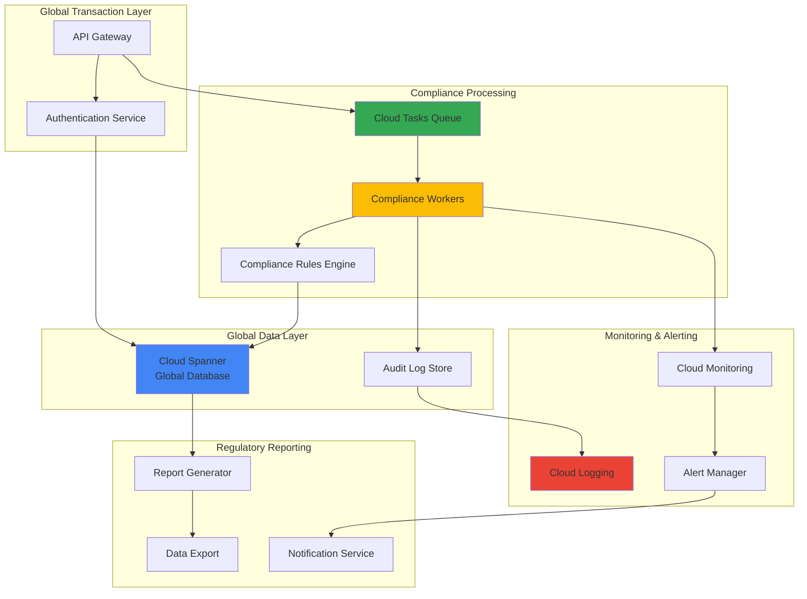

# Global Financial Compliance Monitoring with Cloud Spanner and Cloud Tasks

## Problem

Financial institutions operating across multiple jurisdictions face complex compliance requirements that demand real-time transaction monitoring, cross-border regulatory reporting, and immutable audit trails. Traditional databases struggle with global consistency while maintaining the performance needed for real-time compliance checks, creating compliance gaps that can result in regulatory penalties, operational disruptions, and inability to meet stringent reporting deadlines across different time zones and regulatory frameworks.

## Solution

This solution leverages Cloud Spanner's globally distributed ACID transactions and Cloud Tasks' reliable task queuing to create a comprehensive financial compliance monitoring system. Cloud Spanner provides the globally consistent database foundation for transaction storage and compliance state management, while Cloud Tasks orchestrates automated compliance checks, regulatory reporting, and audit trail generation. The architecture ensures real-time compliance monitoring across all regions while maintaining data consistency and providing centralized audit logging through Cloud Logging.

## Architecture Diagram



## Prerequisites

1. Google Cloud account with billing enabled and appropriate permissions for:
   - Cloud Spanner administration
   - Cloud Tasks administration
   - Cloud Logging configuration
   - IAM role management
2. gcloud CLI installed and configured (version 400.0.0 or later)
3. Understanding of financial compliance requirements (KYC, AML, cross-border regulations)
4. Familiarity with distributed systems and eventual consistency concepts
5. Estimated cost: $200-400/month for development environment (depends on transaction volume and data retention)

> **Warning**: This solution handles sensitive financial data. Ensure proper encryption, access controls, and audit logging are configured before processing real financial transactions.

## Preparation

```bash
# Set environment variables for GCP resources
export PROJECT_ID="financial-compliance-$(date +%s)"
export REGION="us-central1"
export SPANNER_INSTANCE="compliance-monitor"
export SPANNER_DATABASE="financial-compliance"
export TASK_QUEUE="compliance-checks"

# Generate unique suffix for resource names
RANDOM_SUFFIX=$(openssl rand -hex 4)
export CLUSTER_NAME="compliance-cluster-${RANDOM_SUFFIX}"
export SERVICE_ACCOUNT="compliance-monitor-sa-${RANDOM_SUFFIX}"

# Create new project for isolation
gcloud projects create ${PROJECT_ID} \
    --name="Financial Compliance Monitor"

# Set as default project
gcloud config set project ${PROJECT_ID}
gcloud config set compute/region ${REGION}

# Enable required APIs
gcloud services enable spanner.googleapis.com
gcloud services enable cloudtasks.googleapis.com
gcloud services enable logging.googleapis.com
gcloud services enable monitoring.googleapis.com
gcloud services enable cloudfunctions.googleapis.com
gcloud services enable pubsub.googleapis.com

echo "✅ Project configured: ${PROJECT_ID}"
echo "✅ Region set to: ${REGION}"
```

## Steps

1. **Create Cloud Spanner Instance and Database**:

   Cloud Spanner provides globally distributed, ACID-compliant transactions essential for financial compliance monitoring. Its ability to scale horizontally while maintaining strong consistency makes it ideal for handling high-volume financial transactions across multiple regions. The instance configuration determines the geographic distribution and availability of your compliance data.

   ```bash
   # Create regional Spanner instance for compliance monitoring
   gcloud spanner instances create ${SPANNER_INSTANCE} \
       --config=regional-${REGION} \
       --description="Financial compliance monitoring instance" \
       --nodes=2
   
   # Create database with compliance schema
   gcloud spanner databases create ${SPANNER_DATABASE} \
       --instance=${SPANNER_INSTANCE}
   
   echo "✅ Spanner instance and database created"
   ```

   The Spanner instance is now provisioned with regional configuration for optimal performance and compliance with data residency requirements. The 2-node configuration provides high availability while keeping costs manageable for the compliance monitoring workload.

2. **Define Compliance Database Schema**:

   Financial compliance requires structured data models that support both transactional integrity and audit trail requirements. The schema design incorporates regulatory reporting fields, transaction lifecycle tracking, and compliance status management to ensure all regulatory requirements are met.

   ```bash
   # Create transactions table with compliance fields
   gcloud spanner databases ddl update ${SPANNER_DATABASE} \
       --instance=${SPANNER_INSTANCE} \
       --ddl='CREATE TABLE transactions (
           transaction_id STRING(36) NOT NULL,
           account_id STRING(36) NOT NULL,
           amount NUMERIC NOT NULL,
           currency STRING(3) NOT NULL,
           source_country STRING(2) NOT NULL,
           destination_country STRING(2) NOT NULL,
           transaction_type STRING(50) NOT NULL,
           timestamp TIMESTAMP NOT NULL OPTIONS (allow_commit_timestamp=true),
           compliance_status STRING(20) NOT NULL DEFAULT "PENDING",
           risk_score NUMERIC,
           kyc_verified BOOL DEFAULT false,
           aml_checked BOOL DEFAULT false,
           regulatory_flags ARRAY<STRING(MAX)>,
           created_at TIMESTAMP NOT NULL OPTIONS (allow_commit_timestamp=true),
           updated_at TIMESTAMP NOT NULL OPTIONS (allow_commit_timestamp=true)
       ) PRIMARY KEY (transaction_id)'
   
   # Create compliance_checks table for audit trail
   gcloud spanner databases ddl update ${SPANNER_DATABASE} \
       --instance=${SPANNER_INSTANCE} \
       --ddl='CREATE TABLE compliance_checks (
           check_id STRING(36) NOT NULL,
           transaction_id STRING(36) NOT NULL,
           check_type STRING(50) NOT NULL,
           check_status STRING(20) NOT NULL,
           check_result JSON,
           checked_at TIMESTAMP NOT NULL OPTIONS (allow_commit_timestamp=true),
           checked_by STRING(100) NOT NULL,
           regulatory_requirement STRING(100)
       ) PRIMARY KEY (check_id),
       INTERLEAVE IN PARENT transactions ON DELETE CASCADE'
   
   echo "✅ Compliance database schema created"
   ```

   The database schema now supports comprehensive compliance tracking with proper audit trails, regulatory flag management, and interleaved tables for optimal performance when querying related compliance data.

3. **Create Service Account and IAM Roles**:

   Proper identity and access management is crucial for financial compliance systems. The service account provides secure, automated access to Cloud Spanner and Cloud Tasks while maintaining the principle of least privilege. This configuration ensures that compliance processes can operate autonomously while maintaining security boundaries.

   ```bash
   # Create service account for compliance monitoring
   gcloud iam service-accounts create ${SERVICE_ACCOUNT} \
       --display-name="Compliance Monitor Service Account" \
       --description="Service account for financial compliance monitoring"
   
   # Grant necessary permissions for Spanner operations
   gcloud projects add-iam-policy-binding ${PROJECT_ID} \
       --member="serviceAccount:${SERVICE_ACCOUNT}@${PROJECT_ID}.iam.gserviceaccount.com" \
       --role="roles/spanner.databaseUser"
   
   # Grant Cloud Tasks permissions
   gcloud projects add-iam-policy-binding ${PROJECT_ID} \
       --member="serviceAccount:${SERVICE_ACCOUNT}@${PROJECT_ID}.iam.gserviceaccount.com" \
       --role="roles/cloudtasks.enqueuer"
   
   # Grant logging permissions for audit trails
   gcloud projects add-iam-policy-binding ${PROJECT_ID} \
       --member="serviceAccount:${SERVICE_ACCOUNT}@${PROJECT_ID}.iam.gserviceaccount.com" \
       --role="roles/logging.logWriter"
   
   echo "✅ Service account and IAM roles configured"
   ```

   The service account now has the minimum required permissions to perform compliance monitoring operations while maintaining security isolation and audit capabilities through structured logging.

4. **Create Cloud Tasks Queue for Compliance Processing**:

   Cloud Tasks provides reliable, asynchronous task execution essential for compliance processing workflows. The queue configuration ensures that compliance checks are processed in order, with appropriate retry mechanisms and dead letter handling to prevent compliance violations from being missed due to system failures.

   ```bash
   # Create Cloud Tasks queue for compliance checks
   gcloud tasks queues create ${TASK_QUEUE} \
       --location=${REGION} \
       --max-concurrent-dispatches=10 \
       --max-retry-duration=3600s \
       --max-backoff=300s \
       --min-backoff=10s \
       --max-attempts=5
   
   # Create dead letter queue for failed compliance checks
   gcloud tasks queues create ${TASK_QUEUE}-dlq \
       --location=${REGION} \
       --max-concurrent-dispatches=5 \
       --max-retry-duration=86400s
   
   echo "✅ Cloud Tasks queues created for compliance processing"
   ```

   The task queues are now configured with appropriate retry policies and dead letter handling to ensure reliable compliance check processing even during system failures or temporary outages.

5. **Deploy Compliance Rules Engine**:

   The compliance rules engine implements regulatory logic for KYC, AML, and cross-border transaction monitoring. This cloud function processes compliance checks asynchronously, ensuring that regulatory requirements are evaluated consistently across all transactions while maintaining system performance.

   ```bash
   # Create directory for compliance function
   mkdir -p compliance-function
   cd compliance-function
   
   # Create compliance rules engine function
   cat > main.py << 'EOF'
import json
import logging
from datetime import datetime
from google.cloud import spanner
from google.cloud import logging as cloud_logging
from google.cloud import tasks_v2
import functions_framework

# Initialize clients
spanner_client = spanner.Client()
tasks_client = tasks_v2.CloudTasksClient()
logging_client = cloud_logging.Client()

@functions_framework.cloud_event
def process_compliance_check(cloud_event):
    """Process compliance check for financial transaction"""
    
    # Extract transaction data from event
    transaction_data = json.loads(cloud_event.data)
    transaction_id = transaction_data.get('transaction_id')
    
    # Connect to Spanner database
    instance = spanner_client.instance('compliance-monitor')
    database = instance.database('financial-compliance')
    
    # Retrieve transaction details
    with database.snapshot() as snapshot:
        results = snapshot.execute_sql(
            "SELECT * FROM transactions WHERE transaction_id = @transaction_id",
            params={'transaction_id': transaction_id},
            param_types={'transaction_id': spanner.param_types.STRING}
        )
        
        transaction = list(results)[0]
        
        # Perform compliance checks
        compliance_results = perform_compliance_checks(transaction)
        
        # Update transaction with compliance status
        update_compliance_status(database, transaction_id, compliance_results)
        
        # Log compliance check results
        log_compliance_check(transaction_id, compliance_results)
        
        return {'status': 'completed', 'transaction_id': transaction_id}

def perform_compliance_checks(transaction):
    """Perform various compliance checks on transaction"""
    results = {}
    
    # KYC Check
    results['kyc_verified'] = check_kyc_compliance(transaction)
    
    # AML Check
    results['aml_risk_score'] = calculate_aml_risk(transaction)
    
    # Cross-border compliance
    results['cross_border_compliant'] = check_cross_border_rules(transaction)
    
    # Determine overall compliance status
    results['compliance_status'] = determine_compliance_status(results)
    
    return results

def check_kyc_compliance(transaction):
    """Simulate KYC compliance check"""
    # In reality, this would integrate with KYC providers
    return transaction['amount'] < 10000  # Simplified check

def calculate_aml_risk(transaction):
    """Calculate AML risk score"""
    risk_score = 0
    
    # High-risk countries
    high_risk_countries = ['XX', 'YY']  # Example high-risk countries
    if transaction['source_country'] in high_risk_countries:
        risk_score += 50
    
    # Large transactions
    if transaction['amount'] > 50000:
        risk_score += 30
    
    return min(risk_score, 100)

def check_cross_border_rules(transaction):
    """Check cross-border compliance rules"""
    source = transaction['source_country']
    destination = transaction['destination_country']
    
    # Simplified cross-border check
    return source != destination and transaction['amount'] < 100000

def determine_compliance_status(results):
    """Determine overall compliance status"""
    if not results['kyc_verified']:
        return 'FAILED'
    if results['aml_risk_score'] > 75:
        return 'HIGH_RISK'
    if not results['cross_border_compliant']:
        return 'BLOCKED'
    return 'APPROVED'

def update_compliance_status(database, transaction_id, results):
    """Update transaction compliance status in Spanner"""
    with database.batch() as batch:
        batch.update(
            table='transactions',
            columns=['transaction_id', 'compliance_status', 'risk_score', 
                    'kyc_verified', 'aml_checked', 'updated_at'],
            values=[(
                transaction_id,
                results['compliance_status'],
                results['aml_risk_score'],
                results['kyc_verified'],
                True,
                spanner.COMMIT_TIMESTAMP
            )]
        )

def log_compliance_check(transaction_id, results):
    """Log compliance check results for audit trail"""
    logging_client.logger('compliance-checks').log_struct({
        'transaction_id': transaction_id,
        'compliance_results': results,
        'timestamp': datetime.utcnow().isoformat(),
        'severity': 'INFO'
    })
EOF
   
   # Create requirements.txt
   cat > requirements.txt << 'EOF'
google-cloud-spanner==3.41.0
google-cloud-logging==3.8.0
google-cloud-tasks==2.14.2
functions-framework==3.4.0
EOF
   
   # Deploy the compliance function
   gcloud functions deploy compliance-processor \
       --gen2 \
       --runtime=python311 \
       --source=. \
       --entry-point=process_compliance_check \
       --trigger-topic=compliance-events \
       --service-account=${SERVICE_ACCOUNT}@${PROJECT_ID}.iam.gserviceaccount.com \
       --region=${REGION} \
       --memory=512Mi \
       --timeout=540s
   
   cd ..
   echo "✅ Compliance rules engine deployed"
   ```

   The compliance rules engine is now deployed and ready to process compliance checks asynchronously, implementing KYC, AML, and cross-border regulatory requirements while maintaining comprehensive audit trails.

6. **Create Transaction Processing API**:

   The transaction processing API provides the entry point for financial transactions while automatically triggering compliance checks. This API ensures that all transactions are immediately queued for compliance processing, maintaining regulatory requirements while providing real-time transaction processing capabilities.

   ```bash
   # Create transaction API directory
   mkdir -p transaction-api
   cd transaction-api
   
   # Create transaction processing function
   cat > main.py << 'EOF'
import json
import uuid
from datetime import datetime
from google.cloud import spanner
from google.cloud import tasks_v2
from google.cloud import pubsub_v1
import functions_framework

# Initialize clients
spanner_client = spanner.Client()
tasks_client = tasks_v2.CloudTasksClient()
publisher = pubsub_v1.PublisherClient()

@functions_framework.http
def process_transaction(request):
    """Process financial transaction and trigger compliance checks"""
    
    # Parse request data
    request_json = request.get_json()
    
    # Generate transaction ID
    transaction_id = str(uuid.uuid4())
    
    # Validate transaction data
    if not validate_transaction_data(request_json):
        return {'error': 'Invalid transaction data'}, 400
    
    # Connect to Spanner database
    instance = spanner_client.instance('compliance-monitor')
    database = instance.database('financial-compliance')
    
    # Insert transaction into database
    with database.batch() as batch:
        batch.insert(
            table='transactions',
            columns=['transaction_id', 'account_id', 'amount', 'currency',
                    'source_country', 'destination_country', 'transaction_type',
                    'timestamp', 'compliance_status', 'created_at', 'updated_at'],
            values=[(
                transaction_id,
                request_json['account_id'],
                request_json['amount'],
                request_json['currency'],
                request_json['source_country'],
                request_json['destination_country'],
                request_json['transaction_type'],
                spanner.COMMIT_TIMESTAMP,
                'PENDING',
                spanner.COMMIT_TIMESTAMP,
                spanner.COMMIT_TIMESTAMP
            )]
        )
    
    # Trigger compliance check
    trigger_compliance_check(transaction_id, request_json)
    
    return {
        'transaction_id': transaction_id,
        'status': 'pending_compliance',
        'message': 'Transaction submitted for compliance processing'
    }

def validate_transaction_data(data):
    """Validate required transaction fields"""
    required_fields = ['account_id', 'amount', 'currency', 'source_country',
                      'destination_country', 'transaction_type']
    
    for field in required_fields:
        if field not in data:
            return False
    
    return True

def trigger_compliance_check(transaction_id, transaction_data):
    """Trigger compliance check via Pub/Sub"""
    topic_path = publisher.topic_path('financial-compliance-monitor', 'compliance-events')
    
    message_data = {
        'transaction_id': transaction_id,
        'transaction_data': transaction_data,
        'timestamp': datetime.utcnow().isoformat()
    }
    
    # Publish message to trigger compliance processing
    publisher.publish(topic_path, json.dumps(message_data).encode('utf-8'))
EOF
   
   # Create requirements.txt
   cat > requirements.txt << 'EOF'
google-cloud-spanner==3.41.0
google-cloud-tasks==2.14.2
google-cloud-pubsub==2.18.4
functions-framework==3.4.0
EOF
   
   # Deploy transaction processing API
   gcloud functions deploy transaction-processor \
       --gen2 \
       --runtime=python311 \
       --source=. \
       --entry-point=process_transaction \
       --trigger-http \
       --service-account=${SERVICE_ACCOUNT}@${PROJECT_ID}.iam.gserviceaccount.com \
       --region=${REGION} \
       --memory=512Mi \
       --timeout=60s \
       --allow-unauthenticated
   
   cd ..
   echo "✅ Transaction processing API deployed"
   ```

   The transaction processing API is now live and ready to accept financial transactions, automatically storing them in Cloud Spanner and triggering compliance checks through the established processing pipeline.

7. **Configure Audit Logging and Monitoring**:

   Comprehensive audit logging is essential for financial compliance, providing immutable records of all compliance decisions and system activities. This configuration ensures that all compliance-related events are captured, stored, and available for regulatory reporting and audit purposes.

   ```bash
   # Create custom log sink for compliance events
   gcloud logging sinks create compliance-audit-sink \
       bigquery.googleapis.com/projects/${PROJECT_ID}/datasets/compliance_audit \
       --log-filter='resource.type="cloud_function" AND 
                     (resource.labels.function_name="compliance-processor" OR 
                      resource.labels.function_name="transaction-processor")'
   
   # Create monitoring dashboard for compliance metrics
   cat > compliance-dashboard.json << 'EOF'
{
  "displayName": "Financial Compliance Monitor",
  "mosaicLayout": {
    "tiles": [
      {
        "width": 6,
        "height": 4,
        "widget": {
          "title": "Transaction Volume",
          "xyChart": {
            "dataSets": [
              {
                "timeSeriesQuery": {
                  "timeSeriesFilter": {
                    "filter": "resource.type=\"spanner_database\"",
                    "aggregation": {
                      "alignmentPeriod": "300s",
                      "perSeriesAligner": "ALIGN_RATE"
                    }
                  }
                }
              }
            ]
          }
        }
      },
      {
        "width": 6,
        "height": 4,
        "xPos": 6,
        "widget": {
          "title": "Compliance Check Success Rate",
          "scorecard": {
            "timeSeriesQuery": {
              "timeSeriesFilter": {
                "filter": "resource.type=\"cloud_function\" AND resource.labels.function_name=\"compliance-processor\"",
                "aggregation": {
                  "alignmentPeriod": "300s",
                  "perSeriesAligner": "ALIGN_RATE"
                }
              }
            }
          }
        }
      }
    ]
  }
}
EOF
   
   # Create the monitoring dashboard
   gcloud monitoring dashboards create --config-from-file=compliance-dashboard.json
   
   echo "✅ Audit logging and monitoring configured"
   ```

   The monitoring and audit logging infrastructure is now in place, providing comprehensive visibility into compliance operations and maintaining the audit trails required for regulatory compliance.

8. **Create Compliance Reporting System**:

   Regulatory reporting requires automated generation of compliance reports across different jurisdictions and time periods. This system leverages Cloud Spanner's SQL capabilities to generate comprehensive compliance reports while maintaining data consistency across global operations.

   ```bash
   # Create compliance reporting function
   mkdir -p compliance-reporting
   cd compliance-reporting
   
   cat > main.py << 'EOF'
import json
from datetime import datetime, timedelta
from google.cloud import spanner
from google.cloud import storage
import functions_framework

spanner_client = spanner.Client()
storage_client = storage.Client()

@functions_framework.http
def generate_compliance_report(request):
    """Generate compliance report for regulatory authorities"""
    
    # Parse request parameters
    request_json = request.get_json()
    report_type = request_json.get('report_type', 'daily')
    jurisdiction = request_json.get('jurisdiction', 'US')
    
    # Connect to Spanner database
    instance = spanner_client.instance('compliance-monitor')
    database = instance.database('financial-compliance')
    
    # Generate report data
    report_data = generate_report_data(database, report_type, jurisdiction)
    
    # Save report to Cloud Storage
    report_filename = save_report_to_storage(report_data, report_type, jurisdiction)
    
    return {
        'report_generated': True,
        'report_file': report_filename,
        'report_type': report_type,
        'jurisdiction': jurisdiction,
        'timestamp': datetime.utcnow().isoformat()
    }

def generate_report_data(database, report_type, jurisdiction):
    """Generate compliance report data from Spanner"""
    
    # Calculate time range based on report type
    if report_type == 'daily':
        start_date = datetime.utcnow() - timedelta(days=1)
    elif report_type == 'weekly':
        start_date = datetime.utcnow() - timedelta(weeks=1)
    elif report_type == 'monthly':
        start_date = datetime.utcnow() - timedelta(days=30)
    
    with database.snapshot() as snapshot:
        # Query transaction summary
        results = snapshot.execute_sql("""
            SELECT 
                compliance_status,
                COUNT(*) as transaction_count,
                SUM(amount) as total_amount,
                AVG(risk_score) as avg_risk_score
            FROM transactions 
            WHERE created_at >= @start_date
            AND (source_country = @jurisdiction OR destination_country = @jurisdiction)
            GROUP BY compliance_status
        """, params={
            'start_date': start_date,
            'jurisdiction': jurisdiction
        })
        
        transaction_summary = list(results)
        
        # Query high-risk transactions
        high_risk_results = snapshot.execute_sql("""
            SELECT transaction_id, amount, source_country, destination_country, 
                   risk_score, compliance_status
            FROM transactions
            WHERE created_at >= @start_date
            AND risk_score > 75
            AND (source_country = @jurisdiction OR destination_country = @jurisdiction)
            ORDER BY risk_score DESC
            LIMIT 100
        """, params={
            'start_date': start_date,
            'jurisdiction': jurisdiction
        })
        
        high_risk_transactions = list(high_risk_results)
        
        return {
            'summary': transaction_summary,
            'high_risk_transactions': high_risk_transactions,
            'report_period': {
                'start': start_date.isoformat(),
                'end': datetime.utcnow().isoformat()
            }
        }

def save_report_to_storage(report_data, report_type, jurisdiction):
    """Save compliance report to Cloud Storage"""
    
    bucket_name = f'compliance-reports-{jurisdiction.lower()}'
    filename = f'{report_type}-compliance-report-{datetime.utcnow().strftime("%Y%m%d-%H%M%S")}.json'
    
    # Create bucket if it doesn't exist
    try:
        bucket = storage_client.bucket(bucket_name)
        bucket.create()
    except:
        bucket = storage_client.bucket(bucket_name)
    
    # Upload report
    blob = bucket.blob(filename)
    blob.upload_from_string(json.dumps(report_data, indent=2))
    
    return f'gs://{bucket_name}/{filename}'
EOF
   
   # Create requirements.txt
   cat > requirements.txt << 'EOF'
google-cloud-spanner==3.41.0
google-cloud-storage==2.10.0
functions-framework==3.4.0
EOF
   
   # Deploy compliance reporting function
   gcloud functions deploy compliance-reporter \
       --gen2 \
       --runtime=python311 \
       --source=. \
       --entry-point=generate_compliance_report \
       --trigger-http \
       --service-account=${SERVICE_ACCOUNT}@${PROJECT_ID}.iam.gserviceaccount.com \
       --region=${REGION} \
       --memory=1Gi \
       --timeout=540s \
       --allow-unauthenticated
   
   cd ..
   echo "✅ Compliance reporting system deployed"
   ```

   The compliance reporting system is now operational, capable of generating comprehensive regulatory reports on-demand or through scheduled automation, ensuring compliance with various jurisdictional requirements.

## Validation & Testing

1. **Verify Spanner Database Configuration**:

   ```bash
   # Check Spanner instance status
   gcloud spanner instances describe ${SPANNER_INSTANCE}
   
   # Verify database schema
   gcloud spanner databases ddl describe ${SPANNER_DATABASE} \
       --instance=${SPANNER_INSTANCE}
   ```

   Expected output: Instance should show "READY" state and database should list all created tables with proper schema.

2. **Test Transaction Processing API**:

   ```bash
   # Get the transaction processor URL
   TRANSACTION_URL=$(gcloud functions describe transaction-processor \
       --region=${REGION} --format="value(serviceConfig.uri)")
   
   # Submit a test transaction
   curl -X POST ${TRANSACTION_URL} \
       -H "Content-Type: application/json" \
       -d '{
           "account_id": "test-account-001",
           "amount": 5000.00,
           "currency": "USD",
           "source_country": "US",
           "destination_country": "CA",
           "transaction_type": "wire_transfer"
       }'
   ```

   Expected output: JSON response with transaction_id and "pending_compliance" status.

3. **Verify Compliance Processing**:

   ```bash
   # Check compliance processing logs
   gcloud logging read "resource.type=\"cloud_function\" AND 
                        resource.labels.function_name=\"compliance-processor\"" \
       --limit=10 --format="value(timestamp,textPayload)"
   
   # Query transaction compliance status
   gcloud spanner databases execute-sql ${SPANNER_DATABASE} \
       --instance=${SPANNER_INSTANCE} \
       --sql="SELECT transaction_id, compliance_status, risk_score FROM transactions LIMIT 5"
   ```

   Expected output: Logs should show compliance processing events and transactions should have updated compliance status.

4. **Test Compliance Reporting**:

   ```bash
   # Get compliance reporter URL
   REPORTER_URL=$(gcloud functions describe compliance-reporter \
       --region=${REGION} --format="value(serviceConfig.uri)")
   
   # Generate a test compliance report
   curl -X POST ${REPORTER_URL} \
       -H "Content-Type: application/json" \
       -d '{
           "report_type": "daily",
           "jurisdiction": "US"
       }'
   ```

   Expected output: JSON response confirming report generation with Cloud Storage location.

## Cleanup

1. **Delete Cloud Functions**:

   ```bash
   # Delete all deployed functions
   gcloud functions delete transaction-processor \
       --region=${REGION} --quiet
   
   gcloud functions delete compliance-processor \
       --region=${REGION} --quiet
   
   gcloud functions delete compliance-reporter \
       --region=${REGION} --quiet
   
   echo "✅ Cloud Functions deleted"
   ```

2. **Remove Cloud Tasks Queues**:

   ```bash
   # Delete task queues
   gcloud tasks queues delete ${TASK_QUEUE} \
       --location=${REGION} --quiet
   
   gcloud tasks queues delete ${TASK_QUEUE}-dlq \
       --location=${REGION} --quiet
   
   echo "✅ Task queues deleted"
   ```

3. **Delete Spanner Resources**:

   ```bash
   # Delete Spanner database
   gcloud spanner databases delete ${SPANNER_DATABASE} \
       --instance=${SPANNER_INSTANCE} --quiet
   
   # Delete Spanner instance
   gcloud spanner instances delete ${SPANNER_INSTANCE} --quiet
   
   echo "✅ Spanner resources deleted"
   ```

4. **Clean Up Project Resources**:

   ```bash
   # Delete the entire project (optional)
   gcloud projects delete ${PROJECT_ID} --quiet
   
   # Clean up local files
   rm -rf compliance-function transaction-api compliance-reporting
   rm -f compliance-dashboard.json
   
   echo "✅ Project and local files cleaned up"
   ```

## Discussion

This comprehensive financial compliance monitoring solution demonstrates the power of combining Cloud Spanner's global consistency with Cloud Tasks' reliable processing capabilities. The architecture addresses critical requirements for financial institutions operating across multiple jurisdictions by providing real-time compliance monitoring, automated regulatory reporting, and comprehensive audit trails.

Cloud Spanner's globally distributed ACID transactions ensure that compliance decisions are consistent across all regions, eliminating the data consistency issues that plague traditional sharded database approaches. The ability to perform strongly consistent reads and writes across continents is particularly valuable for financial compliance, where conflicting compliance states can lead to regulatory violations. The [Cloud Spanner documentation](https://cloud.google.com/spanner/docs) provides extensive guidance on optimizing performance for financial workloads, including best practices for schema design and query optimization.

The Cloud Tasks integration provides reliable, asynchronous processing of compliance checks, ensuring that regulatory requirements are evaluated for every transaction without impacting transaction processing performance. The queue configuration includes appropriate retry policies and dead letter queues to handle system failures gracefully, maintaining compliance even during infrastructure issues. According to the [Cloud Tasks documentation](https://cloud.google.com/tasks/docs), the service provides guaranteed at-least-once delivery, which is essential for compliance workloads where missed checks can result in regulatory violations.

The comprehensive audit logging through Cloud Logging creates immutable records of all compliance decisions, supporting regulatory reporting and forensic analysis. This approach aligns with the [Google Cloud Architecture Framework](https://cloud.google.com/architecture/framework) principles of operational excellence and security, ensuring that compliance operations are transparent, traceable, and defensible during regulatory audits.

> **Note**: This implementation focuses on the core compliance monitoring infrastructure. Production deployments should integrate with existing KYC/AML providers, implement additional security controls such as data encryption at rest and in transit, and establish proper backup and disaster recovery procedures as outlined in the [Cloud Spanner best practices](https://cloud.google.com/spanner/docs/best-practices).

## Challenge

Extend this solution by implementing these advanced compliance and operational enhancements:

1. **Multi-Region Deployment**: Configure Cloud Spanner with multi-region instances to provide global data distribution while maintaining compliance with data residency requirements across different jurisdictions.

2. **Advanced AML Integration**: Integrate with external AML providers like Dow Jones Risk & Compliance or World-Check to enhance risk scoring and sanctions screening capabilities.

3. **Real-Time Alerting**: Implement Cloud Monitoring alerting policies that trigger immediate notifications for high-risk transactions, failed compliance checks, and system anomalies.

4. **Automated Regulatory Reporting**: Create scheduled Cloud Functions that automatically generate and submit regulatory reports to different jurisdictions based on their specific requirements and deadlines.

5. **Compliance Analytics Dashboard**: Build a comprehensive BigQuery-powered analytics dashboard that provides insights into compliance trends, risk patterns, and regulatory performance metrics across all monitored transactions.

## Infrastructure Code

*Infrastructure code will be generated after recipe approval.*