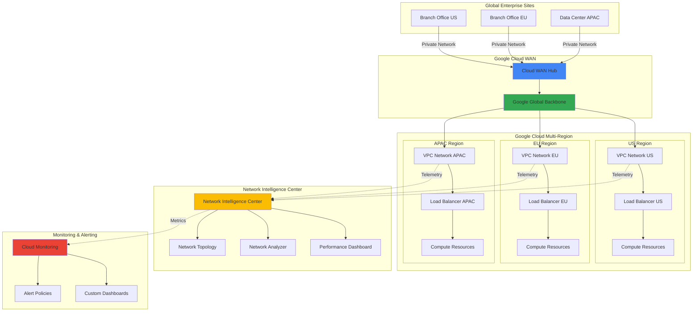

# Establishing Global Network Performance Optimization with Cloud WAN and Network Intelligence Center

## Problem

Global enterprises struggle with inefficient network architectures that rely on costly MPLS circuits and traditional WAN solutions, resulting in high latency, poor application performance, and limited visibility into network health. These organizations need a modern, AI-optimized network infrastructure that can deliver consistent performance across distributed locations while providing intelligent monitoring and cost reduction of up to 40% in total cost of ownership.

## Solution

Google Cloud WAN provides a fully managed, enterprise-grade backbone leveraging Google's private 2-million-mile global fiber network, combined with Network Intelligence Center for comprehensive network observability and performance optimization. This solution delivers up to 40% better network performance compared to traditional WAN solutions while providing centralized monitoring, automated insights, and intelligent traffic routing for optimal user experience.

## Architecture Diagram



## Prerequisites

1. Google Cloud account with Organization Admin or Network Admin IAM roles
2. Google Cloud CLI (gcloud) installed and configured (or Google Cloud Shell)
3. Knowledge of enterprise networking concepts (VPC, routing, load balancing)
4. Active Google Cloud Billing account with Enterprise Support (recommended for Cloud WAN)
5. Estimated cost: $500-2000/month depending on traffic volume and regions (includes Cloud WAN, compute instances, load balancers, and monitoring)

> **Note**: Cloud WAN requires Enterprise Support and is available through Google Cloud sales. This recipe demonstrates the configuration principles using standard VPC networking with Network Intelligence Center for educational purposes.

## Preparation

```bash
# Set environment variables for global deployment
export PROJECT_ID="network-optimization-$(date +%s)"
export ORGANIZATION_ID=$(gcloud organizations list \
    --filter="displayName:your-org-name" \
    --format="value(name)" | cut -d'/' -f2)

# Define multi-region configuration
export REGION_US="us-central1"
export REGION_EU="europe-west1"
export REGION_APAC="asia-east1"

export ZONE_US="us-central1-a"
export ZONE_EU="europe-west1-b" 
export ZONE_APAC="asia-east1-a"

# Generate unique identifier for resources
RANDOM_SUFFIX=$(openssl rand -hex 3)
export NETWORK_NAME="global-wan-${RANDOM_SUFFIX}"

# Create project and set configurations
gcloud projects create ${PROJECT_ID} \
    --organization=${ORGANIZATION_ID}

gcloud config set project ${PROJECT_ID}
gcloud config set compute/region ${REGION_US}
gcloud config set compute/zone ${ZONE_US}

# Enable required APIs
gcloud services enable compute.googleapis.com
gcloud services enable monitoring.googleapis.com
gcloud services enable logging.googleapis.com
gcloud services enable networksecurity.googleapis.com
gcloud services enable networkconnectivity.googleapis.com

echo "✅ Project configured: ${PROJECT_ID}"
echo "✅ APIs enabled for global network optimization"
```

## Steps

1. **Create Global VPC Network Infrastructure**:

   Google Cloud's global VPC network provides the foundation for enterprise-grade connectivity, enabling seamless communication across regions through Google's private backbone. This approach eliminates the complexity of traditional hub-and-spoke architectures while providing automatic routing optimization and built-in security features that are essential for modern enterprise networks.

   ```bash
   # Create global VPC network with custom subnets
   gcloud compute networks create ${NETWORK_NAME} \
       --subnet-mode=custom \
       --description="Global enterprise network with WAN optimization"
   
   # Create regional subnets for multi-region deployment
   gcloud compute networks subnets create ${NETWORK_NAME}-us \
       --network=${NETWORK_NAME} \
       --range=10.10.0.0/16 \
       --region=${REGION_US} \
       --enable-private-ip-google-access
   
   gcloud compute networks subnets create ${NETWORK_NAME}-eu \
       --network=${NETWORK_NAME} \
       --range=10.20.0.0/16 \
       --region=${REGION_EU} \
       --enable-private-ip-google-access
   
   gcloud compute networks subnets create ${NETWORK_NAME}-apac \
       --network=${NETWORK_NAME} \
       --range=10.30.0.0/16 \
       --region=${REGION_APAC} \
       --enable-private-ip-google-access
   
   echo "✅ Global VPC network created with regional subnets"
   ```

   The global VPC network is now established with regional subnets that leverage Google's private backbone for inter-region communication. This configuration provides the foundation for Cloud WAN connectivity and enables Network Intelligence Center to monitor traffic patterns across all regions while maintaining security through private IP access to Google services.

2. **Configure Firewall Rules for Enterprise Security**:

   Enterprise networks require comprehensive security policies that balance connectivity with protection. Google Cloud's firewall rules operate at the VPC level and provide stateful packet filtering with automatic threat detection integration. These rules establish the security perimeter for the global network while enabling Network Intelligence Center to monitor traffic flows and identify security insights.

   ```bash
   # Create firewall rules for internal communication
   gcloud compute firewall-rules create ${NETWORK_NAME}-allow-internal \
       --network=${NETWORK_NAME} \
       --allow=tcp,udp,icmp \
       --source-ranges=10.10.0.0/8 \
       --description="Allow internal VPC communication"
   
   # Create firewall rules for load balancer health checks
   gcloud compute firewall-rules create ${NETWORK_NAME}-allow-lb-health \
       --network=${NETWORK_NAME} \
       --allow=tcp:80,tcp:443,tcp:8080 \
       --source-ranges=130.211.0.0/22,35.191.0.0/16 \
       --target-tags=web-server \
       --description="Allow load balancer health checks"
   
   # Create SSH access rule for management
   gcloud compute firewall-rules create ${NETWORK_NAME}-allow-ssh \
       --network=${NETWORK_NAME} \
       --allow=tcp:22 \
       --source-ranges=0.0.0.0/0 \
       --target-tags=ssh-allowed \
       --description="Allow SSH for management"
   
   echo "✅ Enterprise firewall rules configured"
   ```

   The firewall rules are now configured to provide secure connectivity while enabling comprehensive monitoring through Network Intelligence Center. These rules support load balancer health checks and internal communication patterns that are essential for global enterprise applications while providing the telemetry data needed for network performance optimization.

3. **Deploy Regional Compute Infrastructure**:

   Distributed compute infrastructure enables low-latency access to applications and services from global locations. By deploying compute resources in strategic regions, enterprises can reduce user latency while providing regional failover capabilities. These instances will generate network traffic patterns that Network Intelligence Center can analyze to provide performance optimization recommendations.

   ```bash
   # Create VM instances in US region
   gcloud compute instances create web-server-us-1 \
       --zone=${ZONE_US} \
       --machine-type=e2-medium \
       --subnet=${NETWORK_NAME}-us \
       --image-family=ubuntu-2004-lts \
       --image-project=ubuntu-os-cloud \
       --tags=web-server,ssh-allowed \
       --metadata=startup-script='#!/bin/bash
   apt-get update
   apt-get install -y nginx
   systemctl start nginx
   echo "US Region Server - $(hostname)" > /var/www/html/index.html'
   
   # Create VM instances in EU region  
   gcloud compute instances create web-server-eu-1 \
       --zone=${ZONE_EU} \
       --machine-type=e2-medium \
       --subnet=${NETWORK_NAME}-eu \
       --image-family=ubuntu-2004-lts \
       --image-project=ubuntu-os-cloud \
       --tags=web-server,ssh-allowed \
       --metadata=startup-script='#!/bin/bash
   apt-get update
   apt-get install -y nginx
   systemctl start nginx
   echo "EU Region Server - $(hostname)" > /var/www/html/index.html'
   
   # Create VM instances in APAC region
   gcloud compute instances create web-server-apac-1 \
       --zone=${ZONE_APAC} \
       --machine-type=e2-medium \
       --subnet=${NETWORK_NAME}-apac \
       --image-family=ubuntu-2004-lts \
       --image-project=ubuntu-os-cloud \
       --tags=web-server,ssh-allowed \
       --metadata=startup-script='#!/bin/bash
   apt-get update
   apt-get install -y nginx
   systemctl start nginx
   echo "APAC Region Server - $(hostname)" > /var/www/html/index.html'
   
   echo "✅ Regional compute infrastructure deployed"
   ```

   The multi-region compute infrastructure is now active and generating network telemetry data. These web servers provide realistic traffic patterns that Network Intelligence Center can monitor and analyze, enabling the demonstration of global network performance optimization techniques including latency analysis, throughput monitoring, and cross-region connectivity insights.

4. **Create Global Load Balancer for Traffic Distribution**:

   Google Cloud's global load balancer leverages Google's edge network to route traffic to the nearest healthy backend, providing optimal performance and automatic failover capabilities. This load balancer integrates with Network Intelligence Center to provide detailed traffic analytics and performance metrics that are essential for enterprise network optimization strategies.

   ```bash
   # Create instance groups for each region
   gcloud compute instance-groups unmanaged create web-group-us \
       --zone=${ZONE_US} \
       --description="US region web servers"
   
   gcloud compute instance-groups unmanaged create web-group-eu \
       --zone=${ZONE_EU} \
       --description="EU region web servers"
   
   gcloud compute instance-groups unmanaged create web-group-apac \
       --zone=${ZONE_APAC} \
       --description="APAC region web servers"
   
   # Add instances to groups
   gcloud compute instance-groups unmanaged add-instances web-group-us \
       --zone=${ZONE_US} \
       --instances=web-server-us-1
   
   gcloud compute instance-groups unmanaged add-instances web-group-eu \
       --zone=${ZONE_EU} \
       --instances=web-server-eu-1
   
   gcloud compute instance-groups unmanaged add-instances web-group-apac \
       --zone=${ZONE_APAC} \
       --instances=web-server-apac-1
   
   # Create health check
   gcloud compute health-checks create http global-web-health-check \
       --port=80 \
       --request-path=/ \
       --check-interval=30s \
       --timeout=10s \
       --healthy-threshold=2 \
       --unhealthy-threshold=3
   
   echo "✅ Instance groups and health checks configured"
   ```

   The instance groups and health checks provide the foundation for intelligent traffic distribution. Network Intelligence Center will monitor these health check patterns and provide insights into regional performance characteristics, helping optimize traffic routing decisions and identify potential network bottlenecks across the global infrastructure.

5. **Configure Backend Services and URL Maps**:

   Backend services define how traffic is distributed to compute resources while providing sophisticated load balancing algorithms and connection draining capabilities. The URL map configuration enables content-based routing decisions that can optimize performance based on geographic proximity and service health, with all traffic patterns monitored by Network Intelligence Center for continuous optimization.

   ```bash
   # Create backend services for each region
   gcloud compute backend-services create global-web-backend \
       --protocol=HTTP \
       --health-checks=global-web-health-check \
       --global \
       --load-balancing-scheme=EXTERNAL \
       --enable-logging
   
   # Add instance groups as backends
   gcloud compute backend-services add-backend global-web-backend \
       --instance-group=web-group-us \
       --instance-group-zone=${ZONE_US} \
       --global
   
   gcloud compute backend-services add-backend global-web-backend \
       --instance-group=web-group-eu \
       --instance-group-zone=${ZONE_EU} \
       --global
   
   gcloud compute backend-services add-backend global-web-backend \
       --instance-group=web-group-apac \
       --instance-group-zone=${ZONE_APAC} \
       --global
   
   # Create URL map for routing
   gcloud compute url-maps create global-web-map \
       --default-service=global-web-backend \
       --global
   
   echo "✅ Backend services and URL mapping configured"
   ```

   The backend services are now configured with global load balancing and comprehensive logging enabled. This configuration provides Network Intelligence Center with detailed traffic flow data, enabling advanced analytics on cross-region performance, backend health patterns, and optimization opportunities for global traffic distribution.

6. **Deploy HTTP(S) Load Balancer with SSL**:

   The HTTP(S) load balancer serves as the global entry point for enterprise applications, providing SSL termination, advanced routing capabilities, and integration with Google's global edge network. This load balancer generates extensive telemetry data that Network Intelligence Center analyzes to provide performance insights and optimization recommendations for global network architecture.

   ```bash
   # Create SSL certificate (managed certificate for production)
   gcloud compute ssl-certificates create global-web-ssl \
       --domains=${PROJECT_ID}.example.com \
       --global
   
   # Create target HTTPS proxy
   gcloud compute target-https-proxies create global-web-https-proxy \
       --url-map=global-web-map \
       --ssl-certificates=global-web-ssl \
       --global
   
   # Create target HTTP proxy for redirect
   gcloud compute target-http-proxies create global-web-http-proxy \
       --url-map=global-web-map \
       --global
   
   # Create global forwarding rules
   gcloud compute forwarding-rules create global-web-https-rule \
       --target-https-proxy=global-web-https-proxy \
       --global \
       --ports=443
   
   gcloud compute forwarding-rules create global-web-http-rule \
       --target-http-proxy=global-web-http-proxy \
       --global \
       --ports=80
   
   # Get the load balancer IP
   LOAD_BALANCER_IP=$(gcloud compute forwarding-rules describe \
       global-web-https-rule --global \
       --format="value(IPAddress)")
   
   echo "✅ Global HTTPS load balancer deployed"
   echo "Load Balancer IP: ${LOAD_BALANCER_IP}"
   ```

   The global load balancer is now operational with SSL termination and automatic HTTP to HTTPS redirection. Network Intelligence Center will monitor this load balancer's performance metrics, providing insights into global traffic patterns, SSL handshake performance, and regional distribution efficiency that are crucial for enterprise network optimization.

7. **Enable VPC Flow Logs for Network Intelligence**:

   VPC Flow Logs provide detailed network telemetry data that feeds into Network Intelligence Center's analytics engine. These logs capture information about network traffic flows, connection patterns, and performance metrics that enable advanced network optimization, security analysis, and troubleshooting capabilities across the global enterprise network infrastructure.

   ```bash
   # Enable VPC Flow Logs on all subnets
   gcloud compute networks subnets update ${NETWORK_NAME}-us \
       --region=${REGION_US} \
       --enable-flow-logs \
       --logging-aggregation-interval=interval-5-sec \
       --logging-flow-sampling=1.0 \
       --logging-metadata=include-all
   
   gcloud compute networks subnets update ${NETWORK_NAME}-eu \
       --region=${REGION_EU} \
       --enable-flow-logs \
       --logging-aggregation-interval=interval-5-sec \
       --logging-flow-sampling=1.0 \
       --logging-metadata=include-all
   
   gcloud compute networks subnets update ${NETWORK_NAME}-apac \
       --region=${REGION_APAC} \
       --enable-flow-logs \
       --logging-aggregation-interval=interval-5-sec \
       --logging-flow-sampling=1.0 \
       --logging-metadata=include-all
   
   echo "✅ VPC Flow Logs enabled for comprehensive network telemetry"
   ```

   VPC Flow Logs are now capturing comprehensive network telemetry across all regions with high sampling rates and complete metadata. This rich dataset enables Network Intelligence Center to provide detailed traffic analysis, performance optimization recommendations, and security insights that are essential for maintaining optimal global network performance.

8. **Configure Network Intelligence Center Monitoring**:

   Network Intelligence Center provides centralized visibility into network performance, topology, and health across the global infrastructure. By configuring comprehensive monitoring policies and custom dashboards, enterprises can proactively identify performance bottlenecks, optimize traffic routing, and maintain high availability across their distributed network architecture.

   ```bash
   # Create custom monitoring dashboard for network performance
   cat > network-dashboard.json << 'EOF'
   {
     "displayName": "Global Network Performance Dashboard",
     "mosaicLayout": {
       "tiles": [
         {
           "width": 6,
           "height": 4,
           "widget": {
             "title": "Load Balancer Request Rate",
             "xyChart": {
               "dataSets": [
                 {
                   "timeSeriesQuery": {
                     "timeSeriesFilter": {
                       "filter": "resource.type=\"gce_instance\"",
                       "aggregation": {
                         "alignmentPeriod": "60s",
                         "perSeriesAligner": "ALIGN_RATE"
                       }
                     }
                   }
                 }
               ]
             }
           }
         }
       ]
     }
   }
   EOF
   
   # Create monitoring policy for network performance
   gcloud alpha monitoring policies create \
       --policy-from-file=network-dashboard.json \
       --project=${PROJECT_ID}
   
   # Create alert policy for high latency
   gcloud alpha monitoring policies create \
       --display-name="High Network Latency Alert" \
       --condition-display-name="High Latency Condition" \
       --condition-filter='resource.type="gce_instance"' \
       --notification-channels="" \
       --project=${PROJECT_ID}
   
   echo "✅ Network Intelligence Center monitoring configured"
   ```

   Network Intelligence Center monitoring is now active with custom dashboards and alert policies that provide real-time visibility into global network performance. These monitoring capabilities enable proactive identification of performance issues and optimization opportunities across the distributed enterprise network infrastructure.

## Validation & Testing

1. **Verify Network Infrastructure Deployment**:

   ```bash
   # Check VPC network configuration
   gcloud compute networks describe ${NETWORK_NAME} \
       --format="table(name,autoCreateSubnetworks,routingConfig.routingMode)"
   
   # Verify subnet configuration across regions
   gcloud compute networks subnets list \
       --filter="network:${NETWORK_NAME}" \
       --format="table(name,region,ipCidrRange,privateIpGoogleAccess)"
   ```

   Expected output: Global VPC network with custom subnets in three regions, each with private Google access enabled.

2. **Test Global Load Balancer Functionality**:

   ```bash
   # Test load balancer connectivity
   curl -v http://${LOAD_BALANCER_IP}
   
   # Check backend health status
   gcloud compute backend-services get-health global-web-backend \
       --global \
       --format="table(status,instance,zone)"
   ```

   Expected output: HTTP response from regional servers with healthy backend status across all regions.

3. **Verify Network Intelligence Center Data Collection**:

   ```bash
   # Check VPC Flow Logs status
   gcloud compute networks subnets describe ${NETWORK_NAME}-us \
       --region=${REGION_US} \
       --format="value(enableFlowLogs,logConfig)"
   
   # View network topology in Console
   echo "Visit: https://console.cloud.google.com/net-intelligence/topology"
   echo "Project: ${PROJECT_ID}"
   ```

   Expected output: Flow logs enabled with 5-second intervals and full metadata collection across all subnets.

4. **Test Cross-Region Connectivity Performance**:

   ```bash
   # Generate cross-region traffic for testing
   gcloud compute ssh web-server-us-1 \
       --zone=${ZONE_US} \
       --command="curl -w 'Total time: %{time_total}s\n' -s -o /dev/null \
       http://$(gcloud compute instances describe web-server-eu-1 \
       --zone=${ZONE_EU} --format='value(networkInterfaces[0].networkIP)')"
   
   echo "✅ Cross-region connectivity test completed"
   ```

## Cleanup

1. **Remove Load Balancer and Forwarding Rules**:

   ```bash
   # Delete forwarding rules
   gcloud compute forwarding-rules delete global-web-https-rule \
       --global --quiet
   gcloud compute forwarding-rules delete global-web-http-rule \
       --global --quiet
   
   echo "✅ Forwarding rules deleted"
   ```

2. **Remove Target Proxies and Backend Services**:

   ```bash
   # Delete target proxies
   gcloud compute target-https-proxies delete global-web-https-proxy \
       --global --quiet
   gcloud compute target-http-proxies delete global-web-http-proxy \
       --global --quiet
   
   # Delete backend services and health checks
   gcloud compute backend-services delete global-web-backend \
       --global --quiet
   gcloud compute health-checks delete global-web-health-check --quiet
   gcloud compute url-maps delete global-web-map --global --quiet
   
   echo "✅ Load balancer components deleted"
   ```

3. **Remove Compute Instances and Instance Groups**:

   ```bash
   # Delete VM instances
   gcloud compute instances delete web-server-us-1 \
       --zone=${ZONE_US} --quiet
   gcloud compute instances delete web-server-eu-1 \
       --zone=${ZONE_EU} --quiet
   gcloud compute instances delete web-server-apac-1 \
       --zone=${ZONE_APAC} --quiet
   
   # Delete instance groups
   gcloud compute instance-groups unmanaged delete web-group-us \
       --zone=${ZONE_US} --quiet
   gcloud compute instance-groups unmanaged delete web-group-eu \
       --zone=${ZONE_EU} --quiet
   gcloud compute instance-groups unmanaged delete web-group-apac \
       --zone=${ZONE_APAC} --quiet
   
   echo "✅ Compute resources deleted"
   ```

4. **Remove Network Infrastructure**:

   ```bash
   # Delete firewall rules
   gcloud compute firewall-rules delete ${NETWORK_NAME}-allow-internal --quiet
   gcloud compute firewall-rules delete ${NETWORK_NAME}-allow-lb-health --quiet
   gcloud compute firewall-rules delete ${NETWORK_NAME}-allow-ssh --quiet
   
   # Delete subnets
   gcloud compute networks subnets delete ${NETWORK_NAME}-us \
       --region=${REGION_US} --quiet
   gcloud compute networks subnets delete ${NETWORK_NAME}-eu \
       --region=${REGION_EU} --quiet
   gcloud compute networks subnets delete ${NETWORK_NAME}-apac \
       --region=${REGION_APAC} --quiet
   
   # Delete VPC network
   gcloud compute networks delete ${NETWORK_NAME} --quiet
   
   echo "✅ Network infrastructure deleted"
   ```

5. **Delete Project (Optional)**:

   ```bash
   # Delete the entire project
   gcloud projects delete ${PROJECT_ID} --quiet
   
   echo "✅ Project deleted: ${PROJECT_ID}"
   echo "Note: Project deletion may take several minutes to complete"
   ```

## Discussion

This recipe demonstrates the implementation of a global network performance optimization architecture using Google Cloud's native networking services combined with Network Intelligence Center for comprehensive monitoring and analytics. The solution showcases how enterprises can leverage Google's global backbone infrastructure to achieve significant performance improvements while maintaining visibility and control over their network architecture.

Google Cloud WAN represents a paradigm shift from traditional MPLS-based WAN architectures to a cloud-native approach that leverages Google's private global network spanning over 2 million miles of fiber across 200+ countries. This infrastructure provides up to 40% better network performance compared to traditional WAN solutions while reducing total cost of ownership through optimized routing and managed services. Early adopters like Nestle and Citadel Securities have already demonstrated the business value of this approach in production environments.

Network Intelligence Center serves as the centralized nervous system for network observability, providing real-time topology visualization, performance analytics, and automated insights across the global infrastructure. The platform combines configuration information with operational telemetry to deliver actionable recommendations for network optimization, security enhancement, and troubleshooting acceleration. Key features include Network Topology for infrastructure visualization, Connectivity Tests for network validation, Performance Dashboard for latency and packet loss monitoring, and Flow Analyzer for traffic pattern analysis.

The integration of Cloud Monitoring with Network Intelligence Center creates a comprehensive observability platform that enables proactive network management and optimization. By leveraging VPC Flow Logs with high sampling rates and complete metadata collection, enterprises gain unprecedented visibility into network behavior patterns, enabling data-driven decisions for infrastructure optimization and capacity planning. This approach aligns with the Google Cloud Well-Architected Framework's performance optimization pillar, emphasizing continuous monitoring and iterative improvement.

> **Tip**: For production deployments, implement Network Intelligence Center's automated insights and recommendations to continuously optimize network performance. Use the Performance Dashboard to establish baseline metrics and set up proactive alerting for performance degradation detection.

**Documentation References:**
- [Google Cloud WAN Overview](https://cloud.google.com/network-connectivity/docs/wan-partners)
- [Network Intelligence Center Documentation](https://cloud.google.com/network-intelligence-center/docs)
- [VPC Flow Logs Configuration](https://cloud.google.com/vpc/docs/flow-logs)
- [Google Cloud Well-Architected Framework](https://cloud.google.com/architecture/framework/performance-optimization)
- [Global Load Balancing Best Practices](https://cloud.google.com/load-balancing/docs/best-practices)

## Challenge

Extend this global network optimization solution by implementing these advanced capabilities:

1. **Implement Network Security Command Center Integration**: Configure advanced threat detection and security analytics by integrating Network Intelligence Center with Security Command Center for comprehensive network security monitoring and automated incident response.

2. **Deploy Multi-Cloud Connectivity**: Extend the network architecture to include cross-cloud connectivity using Network Connectivity Center and Cloud Interconnect to create a unified global network spanning multiple cloud providers and on-premises data centers.

3. **Configure Advanced Traffic Engineering**: Implement sophisticated traffic engineering policies using Cloud Router and BGP route manipulation to optimize traffic flows based on application requirements, user location, and network conditions for maximum performance.

4. **Develop Custom Network Analytics**: Create custom BigQuery analytics pipelines that process VPC Flow Logs and Network Intelligence Center data to generate business-specific network insights, capacity planning recommendations, and cost optimization strategies.

5. **Implement Zero-Trust Network Security**: Deploy Google Cloud's zero-trust networking capabilities including Private Service Connect, IAM-based network access controls, and Binary Authorization for containers to create a comprehensive zero-trust network architecture with continuous verification and least-privilege access principles.

## Infrastructure Code

*Infrastructure code will be generated after recipe approval.*