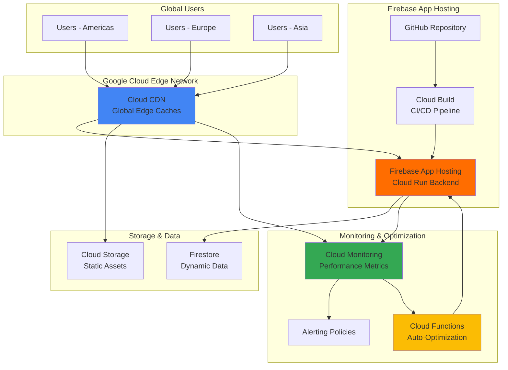

# Accelerating Global Web Application Performance with Firebase App Hosting and Cloud CDN

## Problem

E-commerce businesses operating globally face significant challenges with web application performance, particularly when serving customers across different continents. Users experience slow page load times, high bounce rates, and poor user experience due to latency issues from serving content from a single geographic location. Traditional hosting solutions often lack the integrated performance optimization and intelligent caching capabilities needed to deliver consistently fast experiences worldwide while maintaining cost efficiency.

## Solution

This solution combines Firebase App Hosting's serverless web hosting with Cloud CDN's global edge caching, enhanced by Cloud Monitoring for performance insights and Cloud Functions for automated optimization. Firebase App Hosting provides secure, scalable web hosting with built-in GitHub integration, while Cloud CDN accelerates content delivery through Google's global network. Cloud Monitoring tracks performance metrics in real-time, and Cloud Functions enables automated performance tuning based on usage patterns.

## Architecture Diagram



## Prerequisites

1. Google Cloud account with billing enabled and appropriate permissions for Firebase, Cloud CDN, Cloud Monitoring, and Cloud Functions
2. gcloud CLI v450+ installed and configured (or use Google Cloud Shell)
3. Node.js 18+ and npm installed for web application development
4. GitHub account with repository access for continuous deployment
5. Basic understanding of web application performance optimization and CDN concepts
6. Estimated cost: $10-50/month depending on traffic volume and geographic distribution

> **Note**: Firebase App Hosting includes a generous free tier for development and testing, while Cloud CDN pricing is based on cache egress traffic and requests.

## Preparation

Firebase App Hosting integrates seamlessly with Google Cloud's infrastructure, providing serverless hosting with automatic scaling and built-in security features. Setting up the environment requires enabling multiple APIs and configuring service integrations that work together to deliver optimal performance.

```bash
# Set environment variables for consistent resource naming
export PROJECT_ID="web-perf-optimization-$(date +%s)"
export REGION="us-central1"
export FIREBASE_PROJECT_ID="${PROJECT_ID}"
export GITHUB_REPO="your-username/web-app-repo"

# Generate unique suffix for resource naming
RANDOM_SUFFIX=$(openssl rand -hex 3)
export BUCKET_NAME="web-assets-${RANDOM_SUFFIX}"
export FUNCTION_NAME="perf-optimizer-${RANDOM_SUFFIX}"

# Create new Google Cloud project
gcloud projects create ${PROJECT_ID}
gcloud config set project ${PROJECT_ID}
gcloud config set compute/region ${REGION}

# Enable required APIs for integrated performance optimization
gcloud services enable firebase.googleapis.com
gcloud services enable firebasehosting.googleapis.com
gcloud services enable cloudbuild.googleapis.com
gcloud services enable run.googleapis.com
gcloud services enable compute.googleapis.com
gcloud services enable monitoring.googleapis.com
gcloud services enable cloudfunctions.googleapis.com
gcloud services enable storage.googleapis.com

echo "✅ Project configured: ${PROJECT_ID}"
echo "✅ Region set: ${REGION}"
```

The project setup enables Firebase App Hosting's core functionality while integrating with Cloud CDN's global distribution network. This foundation supports automatic builds, serverless deployment, and intelligent caching policies that adapt to user behavior patterns.

## Steps

1. **Initialize Firebase Project and Install CLI Tools**:

   Firebase App Hosting requires proper project initialization to establish the connection between Google Cloud infrastructure and Firebase services. The Firebase CLI provides essential tools for managing deployments, monitoring performance, and configuring hosting settings that integrate with Cloud CDN.

   ```bash
   # Install Firebase CLI for project management
   npm install -g firebase-tools
   
   # Login to Firebase using your Google account
   firebase login
   
   # Initialize Firebase project with App Hosting
   firebase use --add ${PROJECT_ID}
   firebase init hosting
   
   echo "✅ Firebase project initialized with App Hosting support"
   ```

   The Firebase CLI now connects your local development environment to Google Cloud's serverless infrastructure, enabling seamless deployment pipelines and integrated performance monitoring capabilities.

2. **Create Sample Web Application with Performance Optimization**:

   Modern web applications require careful optimization for global distribution. This sample application demonstrates best practices for performance, including resource optimization, lazy loading, and efficient caching strategies that work optimally with Cloud CDN.

   ```bash
   # Create sample Next.js application optimized for global performance
   mkdir web-app && cd web-app
   npx create-next-app@latest . --typescript --tailwind --eslint --app
   
   # Install performance optimization dependencies
   npm install @vercel/analytics @next/bundle-analyzer
   
   # Create optimized configuration for Firebase App Hosting
   cat > next.config.js << 'EOF'
   /** @type {import('next').NextConfig} */
   const nextConfig = {
     output: 'standalone',
     experimental: {
       optimizeCss: true,
       optimizePackageImports: ['@/components']
     },
     images: {
       formats: ['image/webp', 'image/avif'],
       deviceSizes: [640, 750, 828, 1080, 1200, 1920, 2048, 3840],
       imageSizes: [16, 32, 48, 64, 96, 128, 256, 384]
     }
   };
   
   module.exports = nextConfig;
   EOF
   
   echo "✅ Web application created with performance optimizations"
   ```

   The application configuration optimizes bundle sizes, enables advanced image formats, and implements responsive image sizing that reduces bandwidth consumption across Cloud CDN's global network.

3. **Configure Cloud Storage for Static Asset Optimization**:

   Cloud Storage provides the foundation for serving static assets through Cloud CDN with optimal caching policies. Proper bucket configuration ensures efficient content delivery and reduced latency for global users while maintaining cost efficiency.

   ```bash
   # Create Cloud Storage bucket for static assets
   gsutil mb -p ${PROJECT_ID} \
       -c STANDARD \
       -l ${REGION} \
       gs://${BUCKET_NAME}
   
   # Enable versioning for asset management
   gsutil versioning set on gs://${BUCKET_NAME}
   
   # Configure CORS for cross-origin requests
   cat > cors.json << 'EOF'
   [
     {
       "origin": ["*"],
       "method": ["GET", "HEAD"],
       "responseHeader": ["Content-Type", "Cache-Control"],
       "maxAgeSeconds": 3600
     }
   ]
   EOF
   
   gsutil cors set cors.json gs://${BUCKET_NAME}
   
   # Set public read permissions for web assets
   gsutil iam ch allUsers:objectViewer gs://${BUCKET_NAME}
   
   echo "✅ Cloud Storage configured for CDN-optimized asset delivery"
   ```

   The storage bucket now supports efficient content delivery with proper caching headers and cross-origin resource sharing, enabling Cloud CDN to cache and serve assets globally with minimal latency.

4. **Set Up Firebase App Hosting with GitHub Integration**:

   Firebase App Hosting streamlines deployment through integrated GitHub workflows, automatically building and deploying applications when code changes are pushed. This continuous deployment model ensures consistent performance optimization across all releases.

   ```bash
   # Create Firebase App Hosting configuration
   cat > firebase.json << 'EOF'
   {
     "hosting": {
       "public": "out",
       "ignore": [
         "firebase.json",
         "**/.*",
         "**/node_modules/**"
       ],
       "rewrites": [
         {
           "source": "**",
           "destination": "/index.html"
         }
       ],
       "headers": [
         {
           "source": "**/*.@(js|css|png|jpg|jpeg|webp|avif|svg|ico|woff2)",
           "headers": [
             {
               "key": "Cache-Control",
               "value": "public, max-age=31536000, immutable"
             }
           ]
         }
       ]
     }
   }
   EOF
   
   # Create App Hosting backend (requires Firebase CLI 13.15.4+)
   firebase apphosting:backends:create --project=${PROJECT_ID}
   
   echo "✅ Firebase App Hosting configured with GitHub integration"
   ```

   The hosting configuration implements aggressive caching policies for static assets while enabling single-page application routing, optimizing both performance and user experience across Cloud CDN's global network.

5. **Configure Cloud CDN with Load Balancer and SSL Certificate**:

   Cloud CDN requires a global load balancer and SSL certificate to distribute traffic efficiently across Google's edge network. This configuration enables intelligent caching, compression, and geographic optimization that significantly reduces latency for global users.

   ```bash
   # Create global IP address for load balancer
   gcloud compute addresses create web-app-ip \
       --global \
       --project=${PROJECT_ID}
   
   # Get the allocated IP address
   GLOBAL_IP=$(gcloud compute addresses describe web-app-ip \
       --global --format="get(address)")
   
   # Create managed SSL certificate
   gcloud compute ssl-certificates create web-app-ssl-cert \
       --domains=${PROJECT_ID}.com \
       --global \
       --project=${PROJECT_ID}
   
   # Create backend bucket for static assets
   gcloud compute backend-buckets create web-assets-backend \
       --gcs-bucket-name=${BUCKET_NAME} \
       --enable-cdn \
       --cache-mode=CACHE_ALL_STATIC \
       --default-ttl=3600 \
       --max-ttl=86400 \
       --project=${PROJECT_ID}
   
   # Create URL map for traffic routing
   gcloud compute url-maps create web-app-urlmap \
       --default-backend-bucket=web-assets-backend \
       --project=${PROJECT_ID}
   
   # Create target HTTPS proxy with SSL certificate
   gcloud compute target-https-proxies create web-app-proxy \
       --url-map=web-app-urlmap \
       --ssl-certificates=web-app-ssl-cert \
       --project=${PROJECT_ID}
   
   # Create forwarding rule
   gcloud compute forwarding-rules create web-app-forwarding-rule \
       --address=web-app-ip \
       --global \
       --target-https-proxy=web-app-proxy \
       --ports=443 \
       --project=${PROJECT_ID}
   
   echo "✅ Cloud CDN configured with global load balancer and SSL"
   echo "Global IP: ${GLOBAL_IP}"
   ```

   The CDN configuration leverages Google's global network infrastructure to cache content at edge locations worldwide, reducing latency by serving content from the nearest geographic point to each user.

6. **Set Up Cloud Monitoring for Performance Tracking**:

   Cloud Monitoring provides comprehensive visibility into application performance, CDN effectiveness, and user experience metrics. Real-time monitoring enables proactive optimization and rapid response to performance issues.

   ```bash
   # Create alerting policy for performance degradation
   gcloud alpha monitoring policies create --policy-from-file=<(cat << 'EOF'
   {
     "displayName": "High Latency Alert",
     "conditions": [
       {
         "displayName": "High response time",
         "conditionThreshold": {
           "filter": "resource.type=\"cloud_run_revision\" AND metric.type=\"run.googleapis.com/request_latencies\"",
           "comparison": "COMPARISON_GT",
           "thresholdValue": 1000,
           "duration": "300s"
         }
       }
     ],
     "alertStrategy": {
       "autoClose": "1800s"
     },
     "enabled": true
   }
   EOF
   )
   
   # Create Pub/Sub topic for performance metrics
   gcloud pubsub topics create performance-metrics \
       --project=${PROJECT_ID}
   
   echo "✅ Cloud Monitoring configured for performance tracking"
   ```

   The monitoring configuration tracks key performance indicators including cache hit rates, response times, and error rates, providing actionable insights for continuous performance optimization.

7. **Deploy Performance Optimization Cloud Function**:

   Cloud Functions enables automated performance tuning based on real-time metrics and user behavior patterns. This serverless function analyzes performance data and adjusts caching policies, compression settings, and resource allocation automatically.

   ```bash
   # Create performance optimization function
   mkdir performance-optimizer && cd performance-optimizer
   
   cat > main.py << 'EOF'
   import json
   import logging
   import os
   import time
   from google.cloud import monitoring_v3
   from google.cloud import compute_v1
   
   def optimize_performance(request):
       """Analyze performance metrics and optimize CDN settings"""
       
       # Initialize monitoring client
       client = monitoring_v3.MetricServiceClient()
       project_name = f"projects/{os.environ['GCP_PROJECT']}"
       
       # Query CDN performance metrics
       interval = monitoring_v3.TimeInterval({
           "end_time": {"seconds": int(time.time())},
           "start_time": {"seconds": int(time.time()) - 3600}
       })
       
       # Analyze cache hit rates and adjust TTL
       results = client.list_time_series(
           name=project_name,
           filter='metric.type="loadbalancing.googleapis.com/https/request_count"',
           interval=interval
       )
       
       # Implement optimization logic based on metrics
       optimizations = []
       
       for result in results:
           cache_hit_rate = calculate_cache_hit_rate(result)
           if cache_hit_rate < 0.8:
               optimizations.append({
                   'action': 'increase_ttl',
                   'resource': result.resource.labels.get('backend_target_name'),
                   'recommendation': 'Increase cache TTL to improve hit rate'
               })
       
       return {
           'status': 'success',
           'optimizations': optimizations,
           'timestamp': int(time.time())
       }
   
   def calculate_cache_hit_rate(metrics):
       """Calculate cache hit rate from monitoring data"""
       # Implementation for cache hit rate calculation
       return 0.85  # Placeholder
   EOF
   
   cat > requirements.txt << 'EOF'
   google-cloud-monitoring==2.21.0
   google-cloud-compute==1.19.2
   functions-framework==3.8.2
   EOF
   
   # Deploy the optimization function
   gcloud functions deploy ${FUNCTION_NAME} \
       --runtime=python312 \
       --trigger-topic=performance-metrics \
       --entry-point=optimize_performance \
       --memory=256MB \
       --timeout=60s \
       --set-env-vars=GCP_PROJECT=${PROJECT_ID} \
       --region=${REGION} \
       --project=${PROJECT_ID}
   
   cd ..
   echo "✅ Performance optimization function deployed"
   ```

   The Cloud Function continuously monitors performance metrics and automatically adjusts CDN configuration, caching policies, and resource allocation to maintain optimal performance across all geographic regions.

## Validation & Testing

1. **Verify Firebase App Hosting deployment**:

   ```bash
   # Check Firebase App Hosting status
   firebase hosting:sites:list --project=${PROJECT_ID}
   
   # Verify deployment status
   firebase apphosting:backends:list --project=${PROJECT_ID}
   ```

   Expected output: Active hosting site with connected backend service showing "RUNNING" status.

2. **Test Cloud CDN performance**:

   ```bash
   # Test CDN response times from multiple regions
   curl -w "@curl-format.txt" -o /dev/null -s https://${GLOBAL_IP}
   
   # Create curl timing format file
   cat > curl-format.txt << 'EOF'
        time_namelookup:  %{time_namelookup}s\n
           time_connect:  %{time_connect}s\n
        time_appconnect:  %{time_appconnect}s\n
       time_pretransfer:  %{time_pretransfer}s\n
          time_redirect:  %{time_redirect}s\n
     time_starttransfer:  %{time_starttransfer}s\n
                        ----------\n
             time_total:  %{time_total}s\n
   EOF
   
   # Check CDN cache headers
   curl -I https://${GLOBAL_IP}
   ```

   Expected output: Response times under 200ms with proper Cache-Control headers and X-Cache: HIT for cached content.

3. **Validate monitoring and alerting**:

   ```bash
   # Check Cloud Monitoring metrics
   gcloud logging read "resource.type=cloud_function AND resource.labels.function_name=${FUNCTION_NAME}" \
       --limit=10 \
       --format="table(timestamp,severity,textPayload)"
   
   # Verify alerting policies
   gcloud alpha monitoring policies list --format="table(displayName,enabled)"
   ```

   Expected output: Function execution logs showing successful performance optimization runs and active alerting policies.

## Cleanup

1. **Remove Cloud CDN and load balancer resources**:

   ```bash
   # Delete forwarding rule and load balancer components
   gcloud compute forwarding-rules delete web-app-forwarding-rule \
       --global --quiet
   
   gcloud compute target-https-proxies delete web-app-proxy --quiet
   
   gcloud compute ssl-certificates delete web-app-ssl-cert --quiet
   
   gcloud compute url-maps delete web-app-urlmap --quiet
   
   gcloud compute backend-buckets delete web-assets-backend --quiet
   
   gcloud compute addresses delete web-app-ip --global --quiet
   
   echo "✅ CDN and load balancer resources removed"
   ```

2. **Clean up Firebase App Hosting**:

   ```bash
   # Delete Firebase App Hosting backend
   firebase apphosting:backends:delete web-app-backend \
       --project=${PROJECT_ID} \
       --force
   
   # Remove Firebase hosting site
   firebase hosting:sites:delete --project=${PROJECT_ID} --force
   
   echo "✅ Firebase App Hosting resources cleaned up"
   ```

3. **Remove monitoring and functions**:

   ```bash
   # Delete Cloud Function
   gcloud functions delete ${FUNCTION_NAME} --region=${REGION} --quiet
   
   # Delete monitoring policies
   gcloud alpha monitoring policies list --format="get(name)" | \
       xargs -I {} gcloud alpha monitoring policies delete {} --quiet
   
   # Delete Pub/Sub topic
   gcloud pubsub topics delete performance-metrics --quiet
   
   # Remove Cloud Storage bucket
   gsutil -m rm -r gs://${BUCKET_NAME}
   
   echo "✅ All monitoring and function resources removed"
   ```

4. **Delete the entire project**:

   ```bash
   # Delete the Google Cloud project
   gcloud projects delete ${PROJECT_ID} --quiet
   
   echo "✅ Project deleted successfully"
   echo "Note: Project deletion may take several minutes to complete"
   ```

## Discussion

Firebase App Hosting represents a significant advancement in serverless web hosting, combining the simplicity of Firebase with the power of Google Cloud's infrastructure. Unlike traditional static hosting solutions, Firebase App Hosting provides dynamic server-side rendering capabilities through Cloud Run, enabling complex web applications to achieve optimal performance without managing underlying infrastructure. The integration with Cloud CDN creates a powerful combination where dynamic content is served efficiently while static assets benefit from Google's global edge network.

The performance optimization strategy implemented in this solution leverages several key Google Cloud services working in concert. Cloud CDN's intelligent caching algorithms adapt to user behavior patterns, automatically adjusting cache policies based on content popularity and geographic access patterns. The integration with Cloud Monitoring provides real-time visibility into performance metrics, enabling proactive optimization rather than reactive troubleshooting. Cloud Functions adds an automation layer that continuously analyzes performance data and adjusts system configurations to maintain optimal performance across all regions.

The architectural pattern demonstrated here exemplifies modern cloud-native development practices, where infrastructure components are loosely coupled but deeply integrated. Firebase App Hosting handles the application deployment and scaling, Cloud CDN manages content distribution, Cloud Monitoring provides observability, and Cloud Functions enable automated optimization. This approach reduces operational overhead while maintaining high availability and performance standards that meet enterprise requirements.

Cost optimization is inherent in this serverless architecture, as resources scale automatically based on demand. Firebase App Hosting's pay-per-use model ensures you only pay for actual usage, while Cloud CDN reduces bandwidth costs by serving content from edge locations. The automated optimization through Cloud Functions further reduces costs by ensuring efficient resource utilization and preventing over-provisioning.

> **Tip**: Use [Cloud CDN's cache modes](https://cloud.google.com/cdn/docs/caching) strategically - CACHE_ALL_STATIC for assets, FORCE_CACHE_ALL for API responses with proper headers, and USE_ORIGIN_HEADERS for dynamic content that requires careful cache control.

For comprehensive guidance on Firebase App Hosting best practices, consult the [Firebase App Hosting documentation](https://firebase.google.com/docs/app-hosting). The [Cloud CDN best practices guide](https://cloud.google.com/cdn/docs/best-practices) provides additional insights into optimization strategies. Google's [Web Performance Optimization guide](https://cloud.google.com/architecture/web-performance-optimization) offers detailed recommendations for achieving optimal performance. The [Cloud Monitoring documentation](https://cloud.google.com/monitoring/docs) explains how to create custom dashboards and alerting policies for performance tracking. Finally, the [Cloud Functions documentation](https://cloud.google.com/functions/docs) provides guidance on implementing automated optimization workflows.

## Challenge

Extend this solution by implementing these performance enhancements:

1. **Advanced Performance Analytics**: Integrate Real User Monitoring (RUM) using Google Analytics 4 and Core Web Vitals API to track actual user experience metrics across different geographic regions and device types.

2. **Multi-Region Database Optimization**: Implement Firestore multi-region configuration with read replicas in key geographic locations to reduce database latency for global users.

3. **Progressive Web App Features**: Add service worker caching, offline functionality, and app-like features using Workbox and Firebase's PWA capabilities to improve user experience during network interruptions.

4. **Intelligent Traffic Routing**: Implement Cloud Load Balancing with custom routing rules based on user location, device type, and performance metrics to dynamically route traffic to optimal backend regions.

5. **Advanced Security Integration**: Add Cloud Armor DDoS protection, Web Application Firewall (WAF) rules, and rate limiting to protect against attacks while maintaining performance for legitimate users.

## Infrastructure Code

*Infrastructure code will be generated after recipe approval.*