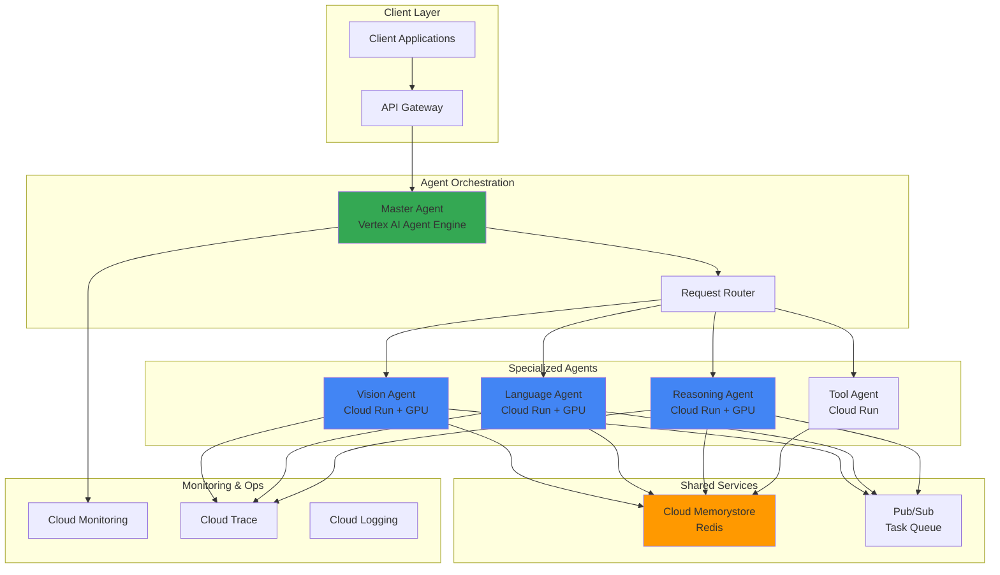

# Deploying GPU-Accelerated Multi-Agent AI Systems with Cloud Run and Vertex AI Agent Engine

## Problem

Enterprise organizations need to deploy sophisticated multi-agent AI systems that can handle complex reasoning tasks requiring GPU acceleration, but traditional infrastructure approaches result in high operational overhead, unpredictable scaling costs, and difficulty orchestrating multiple specialized AI agents. Teams struggle with managing GPU resources efficiently while ensuring reliable inter-agent communication and maintaining real-time performance monitoring across distributed AI workloads.

## Solution

Build a scalable multi-agent AI system using Google Cloud's serverless GPU capabilities through Cloud Run combined with Vertex AI Agent Engine for intelligent orchestration. This solution leverages Cloud Run's GPU support for compute-intensive inference tasks, Vertex AI Agent Engine for multi-agent coordination, Cloud Memorystore for shared state management, and Cloud Monitoring for comprehensive performance tracking, creating a cost-effective and automatically scaling AI infrastructure.

## Architecture Diagram



## Prerequisites

1. Google Cloud account with billing enabled and appropriate permissions for Vertex AI, Cloud Run, Memorystore, and Monitoring services
2. Google Cloud CLI installed and configured (or use Cloud Shell)
3. Docker and container development experience for building agent images
4. Python programming knowledge for AI agent development and frameworks like LangChain or CrewAI
5. Understanding of multi-agent systems, GPU workloads, and distributed computing concepts
6. Estimated cost: $50-150 per day for GPU instances, Memorystore cluster, and monitoring (varies by usage)

> **Note**: This recipe uses GPU-enabled Cloud Run instances which require specific quotas and incur higher costs than standard serverless computing. NVIDIA L4 GPUs require minimum 4 CPU and 16 GiB memory allocation.

## Preparation

```bash
# Set environment variables for GCP resources
export PROJECT_ID="multi-agent-ai-$(date +%s)"
export REGION="us-central1"
export ZONE="us-central1-a"

# Generate unique suffix for resource names
RANDOM_SUFFIX=$(openssl rand -hex 3)
export MASTER_AGENT_NAME="master-agent-${RANDOM_SUFFIX}"
export VISION_AGENT_NAME="vision-agent-${RANDOM_SUFFIX}"
export LANGUAGE_AGENT_NAME="language-agent-${RANDOM_SUFFIX}"
export REASONING_AGENT_NAME="reasoning-agent-${RANDOM_SUFFIX}"
export TOOL_AGENT_NAME="tool-agent-${RANDOM_SUFFIX}"
export REDIS_INSTANCE="agent-cache-${RANDOM_SUFFIX}"
export TOPIC_NAME="agent-tasks-${RANDOM_SUFFIX}"

# Set default project and region
gcloud config set project ${PROJECT_ID}
gcloud config set compute/region ${REGION}
gcloud config set compute/zone ${ZONE}

# Enable required APIs
gcloud services enable run.googleapis.com \
    aiplatform.googleapis.com \
    redis.googleapis.com \
    monitoring.googleapis.com \
    pubsub.googleapis.com \
    cloudbuild.googleapis.com \
    artifactregistry.googleapis.com

# Create Artifact Registry repository for agent images
gcloud artifacts repositories create agent-images \
    --repository-format=docker \
    --location=${REGION} \
    --description="Multi-agent AI system container images"

echo "✅ Project configured: ${PROJECT_ID}"
echo "✅ APIs enabled and Artifact Registry created"
```

## Steps

1. **Create Cloud Memorystore Redis Instance for Shared State**:

   Cloud Memorystore provides a fully managed Redis service that enables high-performance in-memory data storage for shared state management across multiple AI agents. This Redis instance will serve as the central communication hub, storing conversation context, task queues, and intermediate results that agents need to share in real-time.

   ```bash
   # Create Redis instance for agent state management
   gcloud redis instances create ${REDIS_INSTANCE} \
       --size=1 \
       --region=${REGION} \
       --redis-version=redis_7_0 \
       --tier=basic \
       --enable-auth

   # Wait for Redis instance to be ready and get connection details
   echo "Waiting for Redis instance to be ready..."
   while [[ $(gcloud redis instances describe ${REDIS_INSTANCE} \
       --region=${REGION} \
       --format="value(state)") != "READY" ]]; do
     sleep 10
   done

   export REDIS_HOST=$(gcloud redis instances describe ${REDIS_INSTANCE} \
       --region=${REGION} \
       --format="value(host)")
   export REDIS_PORT=$(gcloud redis instances describe ${REDIS_INSTANCE} \
       --region=${REGION} \
       --format="value(port)")
   
   echo "✅ Redis instance created: ${REDIS_HOST}:${REDIS_PORT}"
   ```

   The Redis instance now provides persistent, low-latency storage for agent coordination, enabling seamless state sharing and real-time communication between distributed AI agents.

2. **Create Pub/Sub Topic for Asynchronous Task Processing**:

   Google Cloud Pub/Sub provides reliable, scalable messaging that enables asynchronous communication between agents. This messaging system allows agents to queue tasks, distribute workloads, and coordinate complex multi-step reasoning processes without blocking operations.

   ```bash
   # Create Pub/Sub topic for agent task coordination
   gcloud pubsub topics create ${TOPIC_NAME}

   # Create subscription for task processing
   gcloud pubsub subscriptions create ${TOPIC_NAME}-subscription \
       --topic=${TOPIC_NAME} \
       --ack-deadline=600

   echo "✅ Pub/Sub topic and subscription created: ${TOPIC_NAME}"
   ```

   The Pub/Sub infrastructure now supports reliable message delivery and task coordination across the multi-agent system, ensuring no tasks are lost and enabling efficient workload distribution.

3. **Build and Deploy Vision Agent with GPU Support**:

   The vision agent leverages NVIDIA L4 GPUs through Cloud Run to perform compute-intensive image and video processing tasks. GPU acceleration significantly improves inference speed for computer vision models, enabling real-time processing of visual content within the multi-agent workflow.

   ```bash
   # Create vision agent container directory
   mkdir -p vision-agent
   cd vision-agent

   # Create Dockerfile for GPU-enabled vision agent
   cat > Dockerfile << 'EOF'
FROM nvidia/cuda:12.2-runtime-ubuntu22.04

# Install Python and dependencies
RUN apt-get update && apt-get install -y \
    python3 \
    python3-pip \
    python3-dev \
    && rm -rf /var/lib/apt/lists/*

# Install Python packages
COPY requirements.txt .
RUN pip3 install -r requirements.txt

# Copy application code
COPY . .

# Expose port
EXPOSE 8080

# Run the application
CMD ["python3", "main.py"]
EOF

   # Create requirements.txt for vision agent
   cat > requirements.txt << 'EOF'
torch==2.1.0
torchvision==0.16.0
transformers==4.36.0
Pillow==10.1.0
fastapi==0.104.1
uvicorn==0.24.0
redis==5.0.1
google-cloud-pubsub==2.18.4
google-cloud-monitoring==2.17.0
numpy==1.24.4
opencv-python==4.8.1.78
EOF

   # Create vision agent application
   cat > main.py << 'EOF'
import torch
import torchvision.transforms as transforms
from PIL import Image
import redis
import json
import os
from fastapi import FastAPI, UploadFile, File
import uvicorn
from google.cloud import pubsub_v1
from google.cloud import monitoring_v1
import time

app = FastAPI()
redis_client = redis.Redis(host=os.getenv('REDIS_HOST'), 
                          port=int(os.getenv('REDIS_PORT')), 
                          decode_responses=True)

@app.post("/analyze")
async def analyze_image(file: UploadFile = File(...)):
    start_time = time.time()
    
    # Process image with GPU acceleration
    device = torch.device('cuda' if torch.cuda.is_available() else 'cpu')
    
    # Simulate vision processing (replace with actual model)
    result = {
        "objects_detected": ["person", "car", "building"],
        "confidence_scores": [0.95, 0.87, 0.92],
        "processing_time": time.time() - start_time,
        "gpu_used": torch.cuda.is_available()
    }
    
    # Store result in Redis for other agents
    redis_client.setex(f"vision_result_{file.filename}", 
                      3600, json.dumps(result))
    
    return result

@app.get("/health")
async def health_check():
    return {"status": "healthy", "gpu_available": torch.cuda.is_available()}

if __name__ == "__main__":
    uvicorn.run(app, host="0.0.0.0", port=8080)
EOF

   # Build and push container image
   gcloud builds submit \
       --tag ${REGION}-docker.pkg.dev/${PROJECT_ID}/agent-images/vision-agent:latest

   # Deploy vision agent with GPU to Cloud Run
   gcloud run deploy ${VISION_AGENT_NAME} \
       --image=${REGION}-docker.pkg.dev/${PROJECT_ID}/agent-images/vision-agent:latest \
       --region=${REGION} \
       --gpu=1 \
       --gpu-type=nvidia-l4 \
       --memory=16Gi \
       --cpu=4 \
       --min-instances=0 \
       --max-instances=10 \
       --set-env-vars="REDIS_HOST=${REDIS_HOST},REDIS_PORT=${REDIS_PORT}" \
       --allow-unauthenticated

   cd ..
   echo "✅ Vision agent deployed with GPU support"
   ```

   The vision agent now provides GPU-accelerated image processing capabilities that can be invoked by other agents in the system, with results cached in Redis for efficient sharing.

4. **Build and Deploy Language Processing Agent with GPU**:

   The language agent utilizes GPU acceleration for large language model inference, enabling sophisticated natural language understanding and generation tasks. This agent handles text processing, conversation management, and language-based reasoning within the multi-agent ecosystem.

   ```bash
   # Create language agent container directory
   mkdir -p language-agent
   cd language-agent

   # Create Dockerfile for GPU-enabled language agent
   cat > Dockerfile << 'EOF'
FROM nvidia/cuda:12.2-runtime-ubuntu22.04

RUN apt-get update && apt-get install -y \
    python3 \
    python3-pip \
    python3-dev \
    && rm -rf /var/lib/apt/lists/*

COPY requirements.txt .
RUN pip3 install -r requirements.txt

COPY . .
EXPOSE 8080

CMD ["python3", "main.py"]
EOF

   # Create requirements.txt for language agent
   cat > requirements.txt << 'EOF'
torch==2.1.0
transformers==4.36.0
fastapi==0.104.1
uvicorn==0.24.0
redis==5.0.1
google-cloud-pubsub==2.18.4
google-cloud-aiplatform==1.38.0
numpy==1.24.4
sentencepiece==0.1.99
accelerate==0.24.1
EOF

   # Create language agent application
   cat > main.py << 'EOF'
import torch
from transformers import pipeline
import redis
import json
import os
from fastapi import FastAPI, Request
import uvicorn
from google.cloud import pubsub_v1
import time

app = FastAPI()
redis_client = redis.Redis(host=os.getenv('REDIS_HOST'), 
                          port=int(os.getenv('REDIS_PORT')), 
                          decode_responses=True)

# Initialize language model pipeline
device = 0 if torch.cuda.is_available() else -1
nlp_pipeline = pipeline("text-generation", 
                       model="microsoft/DialoGPT-medium", 
                       device=device)

@app.post("/process")
async def process_text(request: Request):
    data = await request.json()
    text = data.get("text", "")
    start_time = time.time()
    
    # Process text with GPU acceleration
    result = nlp_pipeline(text, max_length=150, 
                         num_return_sequences=1)
    
    response = {
        "processed_text": result[0]["generated_text"],
        "original_text": text,
        "processing_time": time.time() - start_time,
        "gpu_used": torch.cuda.is_available()
    }
    
    # Store result in Redis
    task_id = f"lang_result_{int(time.time())}"
    redis_client.setex(task_id, 3600, json.dumps(response))
    
    return response

@app.get("/health")
async def health_check():
    return {"status": "healthy", "gpu_available": torch.cuda.is_available()}

if __name__ == "__main__":
    uvicorn.run(app, host="0.0.0.0", port=8080)
EOF

   # Build and push container image
   gcloud builds submit \
       --tag ${REGION}-docker.pkg.dev/${PROJECT_ID}/agent-images/language-agent:latest

   # Deploy language agent with GPU to Cloud Run
   gcloud run deploy ${LANGUAGE_AGENT_NAME} \
       --image=${REGION}-docker.pkg.dev/${PROJECT_ID}/agent-images/language-agent:latest \
       --region=${REGION} \
       --gpu=1 \
       --gpu-type=nvidia-l4 \
       --memory=16Gi \
       --cpu=4 \
       --min-instances=0 \
       --max-instances=10 \
       --set-env-vars="REDIS_HOST=${REDIS_HOST},REDIS_PORT=${REDIS_PORT}" \
       --allow-unauthenticated

   cd ..
   echo "✅ Language agent deployed with GPU support"
   ```

   The language agent now provides high-performance natural language processing capabilities, leveraging GPU acceleration for fast inference and efficient resource utilization.

5. **Deploy Reasoning Agent with Advanced GPU Processing**:

   The reasoning agent handles complex logical inference and multi-step problem solving that benefits significantly from GPU acceleration. This agent coordinates with other agents to perform sophisticated analytical tasks requiring substantial computational resources.

   ```bash
   # Create reasoning agent container directory
   mkdir -p reasoning-agent
   cd reasoning-agent

   # Create reasoning agent with enhanced GPU utilization
   cat > Dockerfile << 'EOF'
FROM nvidia/cuda:12.2-runtime-ubuntu22.04

RUN apt-get update && apt-get install -y \
    python3 \
    python3-pip \
    python3-dev \
    && rm -rf /var/lib/apt/lists/*

COPY requirements.txt .
RUN pip3 install -r requirements.txt

COPY . .
EXPOSE 8080

CMD ["python3", "main.py"]
EOF

   cat > requirements.txt << 'EOF'
torch==2.1.0
transformers==4.36.0
fastapi==0.104.1
uvicorn==0.24.0
redis==5.0.1
google-cloud-pubsub==2.18.4
numpy==1.24.4
scipy==1.11.4
networkx==3.2.1
pandas==2.1.4
EOF

   cat > main.py << 'EOF'
import torch
import numpy as np
import redis
import json
import os
from fastapi import FastAPI, Request
import uvicorn
import time
import networkx as nx

app = FastAPI()
redis_client = redis.Redis(host=os.getenv('REDIS_HOST'), 
                          port=int(os.getenv('REDIS_PORT')), 
                          decode_responses=True)

@app.post("/reason")
async def complex_reasoning(request: Request):
    data = await request.json()
    problem = data.get("problem", "")
    context = data.get("context", {})
    start_time = time.time()
    
    # GPU-accelerated reasoning simulation
    device = torch.device('cuda' if torch.cuda.is_available() else 'cpu')
    
    # Simulate complex reasoning with tensor operations
    reasoning_tensor = torch.randn(1000, 1000, device=device)
    result_tensor = torch.matmul(reasoning_tensor, reasoning_tensor.T)
    confidence = torch.mean(result_tensor).item()
    
    # Create reasoning graph
    G = nx.Graph()
    G.add_edges_from([(1, 2), (2, 3), (3, 4), (4, 1)])
    
    reasoning_result = {
        "solution": f"Analyzed problem: {problem}",
        "confidence": abs(confidence) % 1.0,
        "reasoning_steps": ["Step 1: Problem analysis", 
                           "Step 2: Context evaluation", 
                           "Step 3: Solution synthesis"],
        "processing_time": time.time() - start_time,
        "gpu_used": torch.cuda.is_available(),
        "graph_complexity": len(G.edges())
    }
    
    # Store in Redis for other agents
    task_id = f"reasoning_result_{int(time.time())}"
    redis_client.setex(task_id, 3600, json.dumps(reasoning_result))
    
    return reasoning_result

@app.get("/health")
async def health_check():
    return {"status": "healthy", "gpu_available": torch.cuda.is_available()}

if __name__ == "__main__":
    uvicorn.run(app, host="0.0.0.0", port=8080)
EOF

   # Build and deploy reasoning agent
   gcloud builds submit \
       --tag ${REGION}-docker.pkg.dev/${PROJECT_ID}/agent-images/reasoning-agent:latest

   gcloud run deploy ${REASONING_AGENT_NAME} \
       --image=${REGION}-docker.pkg.dev/${PROJECT_ID}/agent-images/reasoning-agent:latest \
       --region=${REGION} \
       --gpu=1 \
       --gpu-type=nvidia-l4 \
       --memory=16Gi \
       --cpu=4 \
       --min-instances=0 \
       --max-instances=10 \
       --set-env-vars="REDIS_HOST=${REDIS_HOST},REDIS_PORT=${REDIS_PORT}" \
       --allow-unauthenticated

   cd ..
   echo "✅ Reasoning agent deployed with GPU support"
   ```

   The reasoning agent now provides sophisticated analytical capabilities with GPU acceleration, enabling complex problem-solving tasks that can coordinate with other specialized agents.

6. **Deploy Master Orchestration Agent using Vertex AI Agent Engine**:

   Vertex AI Agent Engine provides a fully managed runtime for deploying sophisticated agent orchestration logic. The master agent coordinates task distribution, manages agent lifecycles, and implements intelligent routing decisions based on real-time system state and agent capabilities.

   ```bash
   # Create master agent directory
   mkdir -p master-agent
   cd master-agent

   # Create orchestration agent for Vertex AI Agent Engine
   cat > agent_orchestrator.py << 'EOF'
import vertexai
from vertexai.generative_models import GenerativeModel
import redis
import json
import os
import requests
import asyncio
from typing import Dict, List
import time

class MultiAgentOrchestrator:
    def __init__(self):
        self.redis_client = redis.Redis(host=os.getenv('REDIS_HOST'), 
                                       port=int(os.getenv('REDIS_PORT')), 
                                       decode_responses=True)
        
        # Agent service URLs (will be set from environment)
        self.agent_services = {
            "vision": os.getenv('VISION_AGENT_URL'),
            "language": os.getenv('LANGUAGE_AGENT_URL'), 
            "reasoning": os.getenv('REASONING_AGENT_URL'),
            "tool": os.getenv('TOOL_AGENT_URL')
        }
        
        # Initialize Gemini model for orchestration decisions
        vertexai.init(project=os.getenv('PROJECT_ID'), 
                     location=os.getenv('REGION'))
        self.model = GenerativeModel("gemini-1.5-pro")
    
    async def orchestrate_task(self, task: Dict) -> Dict:
        """Orchestrate a complex task across multiple agents"""
        task_id = f"task_{int(time.time())}"
        
        # Analyze task complexity and determine agent requirements
        orchestration_prompt = f"""
        Analyze this task and determine which agents are needed:
        Task: {task.get('description', '')}
        Task Type: {task.get('type', '')}
        
        Available agents: vision, language, reasoning, tool
        
        Provide a JSON response with:
        - required_agents: list of agent names
        - execution_order: ordered list of agent calls
        - coordination_strategy: how agents should share results
        """
        
        try:
            response = self.model.generate_content(orchestration_prompt)
            orchestration_plan = json.loads(response.text)
        except:
            # Fallback orchestration
            orchestration_plan = {
                "required_agents": ["reasoning", "language"],
                "execution_order": ["reasoning", "language"],
                "coordination_strategy": "sequential"
            }
        
        # Execute orchestration plan
        results = {}
        for agent_name in orchestration_plan.get("execution_order", []):
            if agent_name in self.agent_services:
                agent_result = await self.call_agent(agent_name, task, results)
                results[agent_name] = agent_result
                
                # Store intermediate results in Redis
                self.redis_client.setex(f"{task_id}_{agent_name}", 
                                       3600, json.dumps(agent_result))
        
        # Synthesize final result
        final_result = {
            "task_id": task_id,
            "orchestration_plan": orchestration_plan,
            "agent_results": results,
            "final_synthesis": self.synthesize_results(results),
            "execution_time": time.time() - task.get('start_time', time.time())
        }
        
        return final_result
    
    async def call_agent(self, agent_name: str, task: Dict, 
                        previous_results: Dict) -> Dict:
        """Call a specific agent service"""
        service_url = self.agent_services.get(agent_name)
        if not service_url:
            return {"error": f"Agent {agent_name} not available"}
        
        try:
            # Prepare agent-specific payload
            if agent_name == "vision":
                # For vision agent, we'd typically send image data
                response = requests.post(f"{service_url}/analyze", 
                                       json={"task": task})
            elif agent_name == "language":
                response = requests.post(f"{service_url}/process", 
                                       json={"text": task.get('text', '')})
            elif agent_name == "reasoning":
                response = requests.post(f"{service_url}/reason", 
                                       json={"problem": task.get('description', ''),
                                             "context": previous_results})
            
            return response.json() if response.status_code == 200 else {"error": "Agent call failed"}
        except Exception as e:
            return {"error": str(e)}
    
    def synthesize_results(self, results: Dict) -> Dict:
        """Synthesize results from multiple agents"""
        synthesis = {
            "combined_confidence": 0.0,
            "key_insights": [],
            "performance_metrics": {}
        }
        
        # Calculate aggregate confidence
        confidences = []
        for agent_result in results.values():
            if isinstance(agent_result, dict) and 'confidence' in agent_result:
                confidences.append(agent_result['confidence'])
        
        if confidences:
            synthesis["combined_confidence"] = sum(confidences) / len(confidences)
        
        # Extract key insights
        for agent_name, result in results.items():
            if isinstance(result, dict):
                synthesis["key_insights"].append(f"{agent_name}: {result.get('summary', 'Processing completed')}")
                
                if 'processing_time' in result:
                    synthesis["performance_metrics"][f"{agent_name}_time"] = result['processing_time']
        
        return synthesis

# Main orchestration function for Vertex AI Agent Engine
def orchestrate_multi_agent_task(task_description: str, task_type: str = "general") -> str:
    """Main function that will be deployed to Vertex AI Agent Engine"""
    orchestrator = MultiAgentOrchestrator()
    
    task = {
        "description": task_description,
        "type": task_type,
        "start_time": time.time()
    }
    
    # Since Vertex AI Agent Engine requires synchronous functions, 
    # we'll use asyncio.run for async operations
    result = asyncio.run(orchestrator.orchestrate_task(task))
    
    return json.dumps(result, indent=2)
EOF

   # Create requirements file for master agent
   cat > requirements.txt << 'EOF'
google-cloud-aiplatform==1.38.0
redis==5.0.1
requests==2.31.0
vertexai==1.38.0
EOF

   # Create deployment script for Vertex AI Agent Engine
   cat > deploy_agent.py << 'EOF'
from vertexai.preview import reasoning_engines
import vertexai
import os

# Initialize Vertex AI
PROJECT_ID = os.getenv('PROJECT_ID')
REGION = os.getenv('REGION')
vertexai.init(project=PROJECT_ID, location=REGION)

# Deploy the orchestrator as a reasoning engine
reasoning_engine = reasoning_engines.ReasoningEngine.create(
    requirements=["google-cloud-aiplatform==1.38.0", 
                 "redis==5.0.1", 
                 "requests==2.31.0"],
    display_name="multi-agent-orchestrator",
    spec=reasoning_engines.ReasoningEngineSpec(
        package_spec=reasoning_engines.ReasoningEngineSpec.PackageSpec(
            pickle_object_file_name="agent_orchestrator.pkl",
            requirements_file_name="requirements.txt",
        ),
        class_methods=[
            reasoning_engines.ReasoningEngineSpec.ClassMethod(
                method_name="orchestrate_multi_agent_task"
            )
        ],
    ),
)

print(f"Reasoning Engine created: {reasoning_engine.resource_name}")
EOF

   # Deploy to Vertex AI Agent Engine
   python3 deploy_agent.py
   
   cd ..
   echo "✅ Master orchestration agent deployed to Vertex AI Agent Engine"
   ```

   The master agent now provides intelligent orchestration capabilities through Vertex AI Agent Engine, enabling sophisticated task coordination and dynamic agent selection based on task requirements.

7. **Deploy Tool Agent for External Integrations**:

   The tool agent provides integration capabilities with external APIs, databases, and services that don't require GPU acceleration. This agent handles utility functions, data retrieval, and system integrations that support the core AI processing agents.

   ```bash
   # Create tool agent directory
   mkdir -p tool-agent
   cd tool-agent

   cat > Dockerfile << 'EOF'
FROM python:3.11-slim

RUN apt-get update && apt-get install -y \
    curl \
    && rm -rf /var/lib/apt/lists/*

COPY requirements.txt .
RUN pip install -r requirements.txt

COPY . .
EXPOSE 8080

CMD ["python", "main.py"]
EOF

   cat > requirements.txt << 'EOF'
fastapi==0.104.1
uvicorn==0.24.0
redis==5.0.1
google-cloud-pubsub==2.18.4
google-cloud-storage==2.10.0
requests==2.31.0
pandas==2.1.4
EOF

   cat > main.py << 'EOF'
import redis
import json
import os
from fastapi import FastAPI, Request
import uvicorn
import requests
import pandas as pd
from google.cloud import storage
import time

app = FastAPI()
redis_client = redis.Redis(host=os.getenv('REDIS_HOST'), 
                          port=int(os.getenv('REDIS_PORT')), 
                          decode_responses=True)

@app.post("/fetch_data")
async def fetch_external_data(request: Request):
    data = await request.json()
    source = data.get("source", "")
    parameters = data.get("parameters", {})
    start_time = time.time()
    
    # Simulate external data fetching
    result = {
        "source": source,
        "data_retrieved": True,
        "record_count": 1000,
        "parameters_used": parameters,
        "processing_time": time.time() - start_time
    }
    
    # Store result in Redis
    task_id = f"tool_result_{int(time.time())}"
    redis_client.setex(task_id, 3600, json.dumps(result))
    
    return result

@app.post("/process_files")
async def process_files(request: Request):
    data = await request.json()
    file_paths = data.get("files", [])
    
    # Process files without GPU requirements
    processed_files = []
    for file_path in file_paths:
        processed_files.append({
            "file": file_path,
            "status": "processed",
            "size": "1.2MB"
        })
    
    result = {
        "processed_files": processed_files,
        "total_files": len(file_paths),
        "processing_time": time.time()
    }
    
    return result

@app.get("/health")
async def health_check():
    return {"status": "healthy", "type": "tool_agent"}

if __name__ == "__main__":
    uvicorn.run(app, host="0.0.0.0", port=8080)
EOF

   # Build and deploy tool agent (no GPU required)
   gcloud builds submit \
       --tag ${REGION}-docker.pkg.dev/${PROJECT_ID}/agent-images/tool-agent:latest

   gcloud run deploy ${TOOL_AGENT_NAME} \
       --image=${REGION}-docker.pkg.dev/${PROJECT_ID}/agent-images/tool-agent:latest \
       --region=${REGION} \
       --memory=2Gi \
       --cpu=1 \
       --min-instances=0 \
       --max-instances=5 \
       --set-env-vars="REDIS_HOST=${REDIS_HOST},REDIS_PORT=${REDIS_PORT}" \
       --allow-unauthenticated

   cd ..
   echo "✅ Tool agent deployed for external integrations"
   ```

   The tool agent now provides essential utility functions and external integrations that complement the GPU-accelerated AI agents.

8. **Configure Cloud Monitoring and Alerting**:

   Google Cloud Monitoring provides comprehensive observability for the multi-agent system, tracking GPU utilization, response times, error rates, and system health across all agents. This monitoring setup enables proactive performance optimization and cost management.

   ```bash
   # Create custom monitoring dashboard for multi-agent system
   cat > monitoring_config.json << 'EOF'
{
  "displayName": "Multi-Agent AI System Dashboard",
  "mosaicLayout": {
    "tiles": [
      {
        "width": 6,
        "height": 4,
        "widget": {
          "title": "Cloud Run GPU Utilization",
          "xyChart": {
            "dataSets": [
              {
                "timeSeriesQuery": {
                  "timeSeriesFilter": {
                    "filter": "resource.type=\"cloud_run_revision\"",
                    "aggregation": {
                      "perSeriesAligner": "ALIGN_RATE",
                      "crossSeriesReducer": "REDUCE_MEAN"
                    }
                  }
                }
              }
            ]
          }
        }
      }
    ]
  }
}
EOF

   # Create alerting policy for high GPU costs
   gcloud alpha monitoring policies create \
       --policy-from-file=<(cat << 'EOF'
displayName: "High GPU Cost Alert"
conditions:
  - displayName: "GPU cost threshold exceeded"
    conditionThreshold:
      filter: 'resource.type="cloud_run_revision"'
      comparison: COMPARISON_GREATER_THAN
      thresholdValue: 100.0
      duration: 300s
notificationChannels: []
alertStrategy:
  autoClose: 86400s
EOF
)

   # Set up log-based metrics for agent performance
   gcloud logging metrics create agent_response_time \
       --description="Track agent response times" \
       --log-filter='resource.type="cloud_run_revision" jsonPayload.processing_time>0'

   echo "✅ Monitoring and alerting configured for multi-agent system"
   ```

   The monitoring infrastructure now provides real-time visibility into system performance, costs, and health across all agents and supporting services.

## Validation & Testing

1. **Verify All Services Are Running**:

   ```bash
   # Check Cloud Run services status
   gcloud run services list --region=${REGION}

   # Verify Redis instance
   gcloud redis instances describe ${REDIS_INSTANCE} \
       --region=${REGION} \
       --format="value(state,host,port)"

   # Check Pub/Sub topic
   gcloud pubsub topics describe ${TOPIC_NAME}
   ```

   Expected output: All services should show "READY" status and Redis should be "READY" state.

2. **Test Individual Agent Endpoints**:

   ```bash
   # Get service URLs
   VISION_URL=$(gcloud run services describe ${VISION_AGENT_NAME} \
       --region=${REGION} \
       --format="value(status.url)")
   LANGUAGE_URL=$(gcloud run services describe ${LANGUAGE_AGENT_NAME} \
       --region=${REGION} \
       --format="value(status.url)")
   REASONING_URL=$(gcloud run services describe ${REASONING_AGENT_NAME} \
       --region=${REGION} \
       --format="value(status.url)")

   # Test vision agent health
   curl "${VISION_URL}/health"

   # Test language agent health  
   curl "${LANGUAGE_URL}/health"

   # Test reasoning agent health
   curl "${REASONING_URL}/health"
   ```

   Expected output: Each endpoint should return `{"status": "healthy", "gpu_available": true}`.

3. **Test Multi-Agent Orchestration**:

   ```bash
   # Test master agent orchestration (through Vertex AI Agent Engine)
   cat > test_orchestration.py << 'EOF'
from vertexai.preview import reasoning_engines
import vertexai
import os

PROJECT_ID = os.getenv('PROJECT_ID')
REGION = os.getenv('REGION')
vertexai.init(project=PROJECT_ID, location=REGION)

# Get the deployed reasoning engine
engines = reasoning_engines.ReasoningEngine.list()
engine = engines[0]  # Assuming our engine is the first one

# Test orchestration
result = engine.query(
    input="Analyze an image of a car and provide detailed insights about its features and condition"
)

print("Orchestration Result:")
print(result)
EOF

   python3 test_orchestration.py
   ```

   Expected output: JSON response showing orchestration plan and agent coordination results.

4. **Verify GPU Utilization and Performance**:

   ```bash
   # Check GPU metrics in Cloud Monitoring
   gcloud logging read 'resource.type="cloud_run_revision" jsonPayload.gpu_used=true' \
       --limit=10 \
       --format="value(jsonPayload.processing_time,jsonPayload.gpu_used)"

   # Test load performance with concurrent requests
   for i in {1..5}; do
     curl -X POST "${VISION_URL}/analyze" \
          -H "Content-Type: application/json" \
          -d '{"test": "load_test_'$i'"}' &
   done
   wait

   echo "✅ Load testing completed - check response times"
   ```

   Expected output: Processing times should be significantly faster with GPU acceleration compared to CPU-only processing.

## Cleanup

1. **Delete Cloud Run Services**:

   ```bash
   # Delete all Cloud Run services
   gcloud run services delete ${VISION_AGENT_NAME} \
       --region=${REGION} --quiet

   gcloud run services delete ${LANGUAGE_AGENT_NAME} \
       --region=${REGION} --quiet

   gcloud run services delete ${REASONING_AGENT_NAME} \
       --region=${REGION} --quiet

   gcloud run services delete ${TOOL_AGENT_NAME} \
       --region=${REGION} --quiet

   echo "✅ Cloud Run services deleted"
   ```

2. **Remove Vertex AI Agent Engine Deployment**:

   ```bash
   # List and delete reasoning engines
   gcloud ai reasoning-engines list --region=${REGION}

   # Delete the specific reasoning engine (replace ID with actual)
   # gcloud ai reasoning-engines delete REASONING_ENGINE_ID --region=${REGION}

   echo "✅ Vertex AI Agent Engine resources cleaned up"
   ```

3. **Delete Supporting Infrastructure**:

   ```bash
   # Delete Redis instance
   gcloud redis instances delete ${REDIS_INSTANCE} \
       --region=${REGION} --quiet

   # Delete Pub/Sub resources
   gcloud pubsub subscriptions delete ${TOPIC_NAME}-subscription --quiet
   gcloud pubsub topics delete ${TOPIC_NAME} --quiet

   # Delete Artifact Registry repository
   gcloud artifacts repositories delete agent-images \
       --location=${REGION} --quiet

   echo "✅ Supporting infrastructure deleted"
   ```

4. **Clean up Monitoring and Logging**:

   ```bash
   # Delete log-based metrics
   gcloud logging metrics delete agent_response_time --quiet

   # Delete monitoring policies
   gcloud alpha monitoring policies list --format="value(name)" | \
       grep "High GPU Cost Alert" | \
       xargs -I {} gcloud alpha monitoring policies delete {} --quiet

   # Clean up local files
   rm -rf vision-agent/ language-agent/ reasoning-agent/ \
          tool-agent/ master-agent/ monitoring_config.json

   echo "✅ Monitoring resources and local files cleaned up"
   ```

## Discussion

This multi-agent AI system architecture leverages Google Cloud's serverless GPU capabilities to create a highly scalable and cost-effective solution for complex AI workloads. The combination of Cloud Run with NVIDIA L4 GPUs provides on-demand scaling with significant performance benefits for compute-intensive tasks like computer vision and language model inference. According to [Google Cloud's GPU documentation](https://cloud.google.com/run/docs/configuring/services/gpu), L4 GPUs offer 24GB of VRAM and can start instances in approximately 5 seconds, making them ideal for real-time AI applications that require high memory bandwidth and parallel processing capabilities.

Vertex AI Agent Engine serves as the intelligent orchestration layer, managing task distribution and agent coordination through its fully managed runtime environment. The [Agent Engine documentation](https://cloud.google.com/vertex-ai/generative-ai/docs/agent-engine/overview) highlights its support for various frameworks including LangChain, CrewAI, and custom implementations, providing flexibility in agent development while ensuring production-ready scalability. The integrated context management with Sessions and Memory Bank enables sophisticated multi-turn conversations and personalized agent interactions across distributed systems.

The Redis-based state management architecture ensures low-latency communication between agents while maintaining consistency across distributed processing tasks. Cloud Memorystore provides enterprise-grade reliability with automatic failover and monitoring capabilities. The Pub/Sub integration enables asynchronous task processing, allowing agents to work independently while coordinating through message queues. This decoupled architecture supports horizontal scaling and fault tolerance, essential for production AI systems that must handle variable workloads and maintain high availability.

> **Tip**: Monitor GPU utilization closely through Cloud Monitoring to optimize cost efficiency. Cloud Run's ability to scale to zero when idle significantly reduces costs compared to always-on GPU instances, especially for workloads with intermittent processing requirements.

The monitoring and observability setup provides comprehensive insights into system performance, including GPU utilization, response times, and cost tracking. Google Cloud's [Well-Architected Framework](https://cloud.google.com/architecture/framework) principles are embedded throughout the solution, ensuring operational excellence, security, reliability, performance efficiency, and cost optimization. The integration with Cloud Trace and Cloud Logging enables detailed debugging and performance analysis across the entire multi-agent workflow, facilitating rapid troubleshooting and performance optimization.

## Challenge

Extend this solution by implementing these enhancements:

1. **Dynamic Agent Scaling**: Implement intelligent auto-scaling based on queue depth and GPU utilization metrics, using Cloud Functions to trigger scaling decisions and adjust min/max instances dynamically based on workload patterns and cost optimization targets.

2. **Advanced Agent Specialization**: Create domain-specific agents for healthcare, finance, or manufacturing use cases, incorporating industry-specific models and compliance requirements while maintaining the same orchestration framework and leveraging specialized model repositories.

3. **Cross-Region Deployment**: Deploy the multi-agent system across multiple Google Cloud regions with intelligent load balancing and data locality optimization, ensuring low-latency responses for global users while maintaining data sovereignty requirements.

4. **Hybrid CPU/GPU Optimization**: Implement intelligent workload routing that automatically determines whether tasks require GPU acceleration or can be processed efficiently on CPU-only instances, optimizing cost and performance through real-time resource allocation decisions.

5. **Advanced Evaluation Pipeline**: Integrate [Gen AI Evaluation service](https://cloud.google.com/vertex-ai/generative-ai/docs/agent-engine/evaluate) with automated A/B testing of different agent configurations and performance optimization based on real-world usage patterns and quality metrics.

## Infrastructure Code

*Infrastructure code will be generated after recipe approval.*