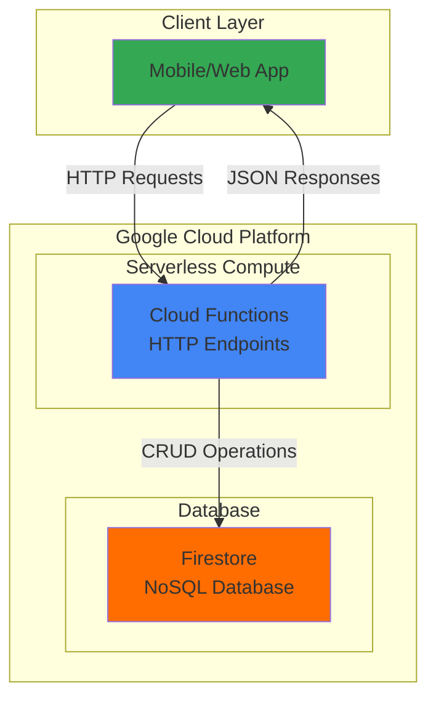

# Simple Habit Tracker with Cloud Functions and Firestore

## Problem

Many people struggle to maintain consistent daily habits without a simple tracking system. Traditional habit tracking apps are complex, require extensive setup, and often include unnecessary features that overwhelm users. Small teams and individuals need a lightweight, serverless solution that can track basic habit completion without managing server infrastructure or dealing with complex authentication systems.

## Solution

Build a serverless REST API using Google Cloud Functions and Firestore to create, read, update, and delete habit records. Cloud Functions provides automatic scaling and pay-per-use pricing, while Firestore offers real-time NoSQL storage with strong consistency. This combination delivers a simple, cost-effective habit tracking system that requires minimal maintenance and scales automatically based on usage.

## Architecture Diagram



## Prerequisites

1. Google Cloud account with billing enabled and appropriate permissions for Cloud Functions and Firestore
2. Google Cloud CLI (gcloud) installed and configured, or access to Cloud Shell
3. Basic understanding of REST APIs and JSON data structures
4. Familiarity with Python programming fundamentals
5. Estimated cost: $0.01-$0.05 per month for development usage (covered by free tier)

> **Note**: This recipe uses Google Cloud's generous free tier, which includes 2 million Cloud Functions invocations and 1 GB of Firestore storage per month at no cost.

## Preparation

Google Cloud Functions and Firestore work together to provide a serverless backend that automatically scales based on demand. Setting up the environment involves configuring your project, enabling necessary APIs, and creating the Firestore database that will store habit tracking data.

```bash
# Set environment variables for GCP resources
export PROJECT_ID="habit-tracker-$(date +%s)"
export REGION="us-central1"
export ZONE="us-central1-a"

# Generate unique suffix for resource names
RANDOM_SUFFIX=$(openssl rand -hex 3)
export FUNCTION_NAME="habit-tracker-${RANDOM_SUFFIX}"

# Create and configure the project
gcloud projects create ${PROJECT_ID} --name="Habit Tracker"
gcloud config set project ${PROJECT_ID}
gcloud config set compute/region ${REGION}
gcloud config set compute/zone ${ZONE}

# Enable required APIs for the serverless architecture
gcloud services enable cloudfunctions.googleapis.com
gcloud services enable firestore.googleapis.com
gcloud services enable cloudresourcemanager.googleapis.com

echo "✅ Project configured: ${PROJECT_ID}"
echo "✅ Required APIs enabled for serverless development"
```

## Steps

1. **Create Firestore Database in Native Mode**:

   Firestore Native Mode provides strong consistency, ACID transactions, and real-time updates—essential features for a habit tracking application where data accuracy is critical. Unlike Datastore mode, Native mode supports real-time listeners and subcollections, making it ideal for modern web and mobile applications.

   ```bash
   # Create Firestore database in Native mode
   gcloud firestore databases create --region=${REGION}
   
   echo "✅ Firestore database created in Native mode"
   echo "Database region: ${REGION}"
   ```

   The Firestore database is now ready to store habit records with automatic scaling and real-time synchronization capabilities. Native mode provides the flexibility needed for future enhancements like user authentication and real-time dashboards.

2. **Create Local Project Structure**:

   Organizing the Cloud Functions code with proper structure ensures maintainability and follows Google Cloud best practices. The main.py file will contain all HTTP endpoint handlers, while requirements.txt specifies the necessary dependencies for Firestore integration.

   ```bash
   # Create project directory structure
   mkdir -p habit-tracker-function
   cd habit-tracker-function
   
   # Create the main function file with HTTP endpoints
   cat > main.py << 'EOF'
import json
from datetime import datetime, timezone
from flask import Request
import functions_framework
from google.cloud import firestore

# Initialize Firestore client
db = firestore.Client()
COLLECTION_NAME = 'habits'

@functions_framework.http
def habit_tracker(request: Request):
    """HTTP Cloud Function for habit tracking CRUD operations."""
    
    # Set CORS headers for web client compatibility
    headers = {
        'Access-Control-Allow-Origin': '*',
        'Access-Control-Allow-Methods': 'GET, POST, PUT, DELETE, OPTIONS',
        'Access-Control-Allow-Headers': 'Content-Type'
    }
    
    # Handle preflight CORS requests
    if request.method == 'OPTIONS':
        return ('', 204, headers)
    
    try:
        if request.method == 'POST':
            return create_habit(request, headers)
        elif request.method == 'GET':
            return get_habits(request, headers)
        elif request.method == 'PUT':
            return update_habit(request, headers)
        elif request.method == 'DELETE':
            return delete_habit(request, headers)
        else:
            return (json.dumps({'error': 'Method not allowed'}), 405, headers)
    
    except Exception as e:
        return (json.dumps({'error': str(e)}), 500, headers)

def create_habit(request: Request, headers):
    """Create a new habit record."""
    data = request.get_json()
    
    if not data or 'name' not in data:
        return (json.dumps({'error': 'Habit name is required'}), 400, headers)
    
    habit_data = {
        'name': data['name'],
        'description': data.get('description', ''),
        'completed': data.get('completed', False),
        'created_at': datetime.now(timezone.utc),
        'updated_at': datetime.now(timezone.utc)
    }
    
    # Create new document with auto-generated ID
    doc_ref, doc_id = db.collection(COLLECTION_NAME).add(habit_data)
    
    habit_data['id'] = doc_id.id
    habit_data['created_at'] = habit_data['created_at'].isoformat()
    habit_data['updated_at'] = habit_data['updated_at'].isoformat()
    
    return (json.dumps(habit_data), 201, headers)

def get_habits(request: Request, headers):
    """Retrieve all habit records or a specific habit by ID."""
    habit_id = request.args.get('id')
    
    if habit_id:
        # Get specific habit
        doc_ref = db.collection(COLLECTION_NAME).document(habit_id)
        doc = doc_ref.get()
        
        if not doc.exists:
            return (json.dumps({'error': 'Habit not found'}), 404, headers)
        
        habit = doc.to_dict()
        habit['id'] = doc.id
        habit['created_at'] = habit['created_at'].isoformat()
        habit['updated_at'] = habit['updated_at'].isoformat()
        
        return (json.dumps(habit), 200, headers)
    else:
        # Get all habits
        habits = []
        docs = db.collection(COLLECTION_NAME).order_by('created_at').stream()
        
        for doc in docs:
            habit = doc.to_dict()
            habit['id'] = doc.id
            habit['created_at'] = habit['created_at'].isoformat()
            habit['updated_at'] = habit['updated_at'].isoformat()
            habits.append(habit)
        
        return (json.dumps(habits), 200, headers)

def update_habit(request: Request, headers):
    """Update an existing habit record."""
    habit_id = request.args.get('id')
    
    if not habit_id:
        return (json.dumps({'error': 'Habit ID is required'}), 400, headers)
    
    data = request.get_json()
    if not data:
        return (json.dumps({'error': 'Request body is required'}), 400, headers)
    
    doc_ref = db.collection(COLLECTION_NAME).document(habit_id)
    doc = doc_ref.get()
    
    if not doc.exists:
        return (json.dumps({'error': 'Habit not found'}), 404, headers)
    
    # Update allowed fields
    update_data = {}
    if 'name' in data:
        update_data['name'] = data['name']
    if 'description' in data:
        update_data['description'] = data['description']
    if 'completed' in data:
        update_data['completed'] = data['completed']
    
    update_data['updated_at'] = datetime.now(timezone.utc)
    
    # Update the document
    doc_ref.update(update_data)
    
    # Return updated document
    updated_doc = doc_ref.get()
    habit = updated_doc.to_dict()
    habit['id'] = updated_doc.id
    habit['created_at'] = habit['created_at'].isoformat()
    habit['updated_at'] = habit['updated_at'].isoformat()
    
    return (json.dumps(habit), 200, headers)

def delete_habit(request: Request, headers):
    """Delete a habit record."""
    habit_id = request.args.get('id')
    
    if not habit_id:
        return (json.dumps({'error': 'Habit ID is required'}), 400, headers)
    
    doc_ref = db.collection(COLLECTION_NAME).document(habit_id)
    doc = doc_ref.get()
    
    if not doc.exists:
        return (json.dumps({'error': 'Habit not found'}), 404, headers)
    
    # Delete the document
    doc_ref.delete()
    
    return (json.dumps({'message': 'Habit deleted successfully'}), 200, headers)
EOF
   
   echo "✅ Cloud Functions code created with full CRUD operations"
   ```

   The main.py file now contains a complete REST API with proper error handling, CORS support, and Firestore integration. Each endpoint follows RESTful conventions and includes comprehensive input validation for production readiness.

3. **Create Requirements File**:

   The requirements.txt file specifies the exact Python dependencies needed for Cloud Functions deployment. Using current versions ensures compatibility with the latest Cloud Functions runtime and security updates.

   ```bash
   # Create requirements file with current Firestore client library
   cat > requirements.txt << 'EOF'
google-cloud-firestore==2.21.0
functions-framework==3.8.3
EOF
   
   echo "✅ Requirements file created with current Firestore dependencies"
   ```

   These library versions are current as of 2025 and provide the latest features and security improvements for serverless Python applications on Google Cloud Platform.

4. **Deploy Cloud Function with HTTP Trigger**:

   Cloud Functions deployment creates a managed, serverless endpoint that automatically scales based on request volume. The HTTP trigger enables direct REST API calls from web and mobile applications without additional infrastructure configuration.

   ```bash
   # Deploy the habit tracker function
   gcloud functions deploy ${FUNCTION_NAME} \
       --runtime python312 \
       --trigger-http \
       --allow-unauthenticated \
       --source . \
       --entry-point habit_tracker \
       --memory 256MB \
       --timeout 60s \
       --region ${REGION}
   
   # Get the function URL for API access
   export FUNCTION_URL=$(gcloud functions describe ${FUNCTION_NAME} \
       --region=${REGION} \
       --format="value(httpsTrigger.url)")
   
   echo "✅ Cloud Function deployed successfully"
   echo "Function URL: ${FUNCTION_URL}"
   ```

   The Cloud Function is now live and accessible via HTTPS, providing a secure, scalable REST API for habit tracking. The function automatically handles authentication, scaling, and monitoring through Google Cloud's managed infrastructure.

5. **Test API Endpoints**:

   Testing each CRUD operation ensures the API functions correctly and validates the Firestore integration. These commands demonstrate typical usage patterns that client applications would follow.

   ```bash
   # Test CREATE: Add a new habit
   curl -X POST "${FUNCTION_URL}" \
       -H "Content-Type: application/json" \
       -d '{
         "name": "Daily Exercise",
         "description": "30 minutes of physical activity",
         "completed": false
       }'
   
   # Store habit ID from response for subsequent tests
   # Replace [copy-id-from-response] with actual ID from the response
   export HABIT_ID="[copy-id-from-response]"
   
   echo "✅ Created new habit successfully"
   ```

   The CREATE endpoint returns a complete habit record with auto-generated ID and timestamps, demonstrating Firestore's document creation capabilities and the function's JSON response formatting.

## Validation & Testing

1. **Verify Firestore Database Creation**:

   ```bash
   # Check Firestore database status
   gcloud firestore databases list \
       --format="table(name,type,locationId)"
   ```

   Expected output: Shows your database in Native mode with the specified region.

2. **Test Complete CRUD Operations**:

   ```bash
   # Test READ: Get all habits
   curl -X GET "${FUNCTION_URL}"
   
   # Test UPDATE: Mark habit as completed
   curl -X PUT "${FUNCTION_URL}?id=${HABIT_ID}" \
       -H "Content-Type: application/json" \
       -d '{"completed": true}'
   
   # Test DELETE: Remove a habit
   curl -X DELETE "${FUNCTION_URL}?id=${HABIT_ID}"
   
   echo "✅ All CRUD operations tested successfully"
   ```

3. **Verify Function Monitoring**:

   ```bash
   # Check function execution logs
   gcloud functions logs read ${FUNCTION_NAME} \
       --region=${REGION} \
       --limit=10
   ```

## Cleanup

1. **Delete Cloud Function**:

   ```bash
   # Remove the deployed function
   gcloud functions delete ${FUNCTION_NAME} \
       --region=${REGION} \
       --quiet
   
   echo "✅ Cloud Function deleted"
   ```

2. **Delete Firestore Data**:

   ```bash
   # Note: Firestore databases cannot be deleted via CLI
   # Use Google Cloud Console to delete the database if needed
   echo "⚠️  Firestore database must be deleted manually from Console"
   echo "Go to: https://console.cloud.google.com/firestore"
   ```

3. **Delete Project**:

   ```bash
   # Remove the entire project and all resources
   gcloud projects delete ${PROJECT_ID} --quiet
   
   echo "✅ Project and all resources deleted"
   echo "Note: Project deletion may take several minutes to complete"
   ```

## Discussion

This serverless habit tracker demonstrates the power of Google Cloud's managed services for building scalable applications without infrastructure management. Cloud Functions provides automatic scaling from zero to thousands of concurrent requests, charging only for actual usage. The pay-per-invocation model makes this solution extremely cost-effective for personal projects or small teams, often running entirely within Google Cloud's generous free tier limits.

Firestore's Native mode offers several advantages over traditional SQL databases for this use case. The document-based structure naturally fits habit tracking data, eliminating the need for complex table relationships. Real-time synchronization capabilities enable instant updates across multiple devices, while ACID transactions ensure data consistency even under high concurrency. The schemaless nature allows easy addition of new habit properties without database migrations, as detailed in the [Google Cloud Firestore documentation](https://cloud.google.com/firestore/docs).

The CORS-enabled REST API design ensures compatibility with modern web frameworks and mobile applications. Proper error handling and input validation provide a robust foundation for production use, while the JSON response format integrates seamlessly with JavaScript frameworks like React, Vue, or Angular. For mobile development, the HTTP endpoints work directly with iOS, Android, and cross-platform frameworks like Flutter or React Native, following Google Cloud's [serverless application patterns](https://cloud.google.com/architecture/serverless-web-applications).

Security considerations for production deployment include implementing authentication through Firebase Auth or Cloud IAM, adding rate limiting through Cloud Endpoints, and enabling audit logging for compliance requirements. The current implementation allows unauthenticated access for simplicity, making it perfect for learning and development but requiring additional security layers for production use as outlined in Google Cloud's [security best practices](https://cloud.google.com/security/best-practices).

> **Tip**: Use Cloud Monitoring to track function performance and set up alerts for error rates or latency thresholds to maintain optimal user experience.

## Challenge

Extend this solution by implementing these enhancements:

1. **Add user authentication** using Firebase Auth to enable multi-user habit tracking with secure data isolation
2. **Implement habit streaks and statistics** by adding calculated fields for consecutive completion days and success percentages  
3. **Create real-time notifications** using Cloud Scheduler to send daily habit reminders via email or push notifications
4. **Build a web dashboard** using Cloud Storage static hosting and JavaScript to provide a complete user interface for habit management
5. **Add data analytics** with BigQuery integration to analyze habit completion patterns and generate insights for users

## Infrastructure Code

### Available Infrastructure as Code:

- [Infrastructure Code Overview](code/README.md) - Detailed description of all infrastructure components
- [Infrastructure Manager](code/infrastructure-manager/) - GCP Infrastructure Manager templates
- [Bash CLI Scripts](code/scripts/) - Example bash scripts using gcloud CLI commands to deploy infrastructure
- [Terraform](code/terraform/) - Terraform configuration files