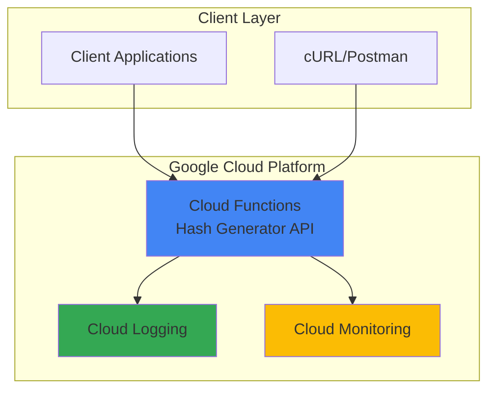

# Hash Generator API with Cloud Functions

## Problem

Development teams frequently need secure hash generation capabilities for data integrity verification, password hashing, and digital signatures across applications. Building and maintaining dedicated servers for simple hash operations introduces unnecessary infrastructure overhead, security maintenance burdens, and scaling complexities that drain development resources from core business features.

## Solution

Deploy a serverless HTTP API using Google Cloud Functions that generates MD5, SHA256, and SHA512 hashes from input text. This serverless approach eliminates infrastructure management while providing automatic scaling, built-in security, and pay-per-request pricing that scales efficiently with demand patterns.

## Architecture Diagram



## Prerequisites

1. Google Cloud Project with billing enabled
2. Google Cloud CLI installed and authenticated
3. Basic knowledge of HTTP APIs and Python
4. Cloud Functions API enabled in your project
5. Estimated cost: $0.00 - $0.40 per 1 million requests (well within free tier)

> **Note**: Cloud Functions provides 2 million free invocations per month, making this recipe cost-effective for development and moderate production workloads.

## Preparation

```bash
# Set environment variables for GCP resources
export PROJECT_ID="hash-api-$(date +%s | tail -c 6)"
export REGION="us-central1"
export FUNCTION_NAME="hash-generator"

# Generate unique suffix for resource names
RANDOM_SUFFIX=$(openssl rand -hex 3)

# Create and set the project
gcloud projects create ${PROJECT_ID} \
    --name="Hash Generator API Project"

# Set as active project
gcloud config set project ${PROJECT_ID}
gcloud config set compute/region ${REGION}

# Enable required APIs
gcloud services enable cloudfunctions.googleapis.com
gcloud services enable cloudbuild.googleapis.com
gcloud services enable logging.googleapis.com

echo "✅ Project configured: ${PROJECT_ID}"
```

## Steps

1. **Create the Function Source Directory**:

   Cloud Functions require a specific directory structure to properly package and deploy serverless code. Creating a dedicated directory ensures clean separation of function code from other project files and provides the foundation for Google Cloud's automated build and deployment process.

   ```bash
   # Create function directory and navigate to it
   mkdir hash-generator-function
   cd hash-generator-function
   
   echo "✅ Function directory created successfully"
   ```

   The directory structure is now ready to contain the Python function code and its dependencies, following Google Cloud Functions best practices for code organization.

2. **Create the Requirements File**:

   Python Cloud Functions use a requirements.txt file to specify dependencies that will be automatically installed during deployment. The Functions Framework provides the HTTP request handling capabilities needed for our serverless API endpoint.

   ```bash
   # Create requirements.txt with necessary dependencies
   cat > requirements.txt << 'EOF'
functions-framework==3.*
EOF
   
   echo "✅ Requirements file created with Functions Framework"
   ```

   This configuration ensures our function has access to the latest stable version of the Google Cloud Functions Framework, which handles HTTP request routing and provides the Flask-compatible request/response interface for our hash generator API.

3. **Implement the Hash Generator Function**:

   The main function implements secure hash generation using Python's built-in hashlib library, which provides cryptographically secure hash algorithms. The function accepts JSON input, validates the data, and returns multiple hash formats in a structured response.

   ```bash
   # Create the main function file
   cat > main.py << 'EOF'
import hashlib
import json
from flask import Request
import functions_framework

@functions_framework.http
def hash_generator(request: Request):
    """
    HTTP Cloud Function that generates MD5, SHA256, and SHA512 hashes
    from input text for security and data integrity use cases.
    """
    
    # Set CORS headers for web browser compatibility
    headers = {
        'Access-Control-Allow-Origin': '*',
        'Access-Control-Allow-Methods': 'POST, OPTIONS',
        'Access-Control-Allow-Headers': 'Content-Type'
    }
    
    # Handle preflight OPTIONS request
    if request.method == 'OPTIONS':
        return ('', 204, headers)
    
    # Only accept POST requests for hash generation
    if request.method != 'POST':
        return json.dumps({
            'error': 'Method not allowed. Use POST with JSON payload.'
        }), 405, headers
    
    try:
        # Parse JSON request body
        request_json = request.get_json(silent=True)
        
        if not request_json or 'text' not in request_json:
            return json.dumps({
                'error': 'Missing required field: text'
            }), 400, headers
        
        input_text = request_json['text']
        
        # Validate input is not empty
        if not input_text or not isinstance(input_text, str):
            return json.dumps({
                'error': 'Text field must be a non-empty string'
            }), 400, headers
        
        # Generate hashes using secure algorithms
        text_bytes = input_text.encode('utf-8')
        
        md5_hash = hashlib.md5(text_bytes).hexdigest()
        sha256_hash = hashlib.sha256(text_bytes).hexdigest()
        sha512_hash = hashlib.sha512(text_bytes).hexdigest()
        
        # Return structured response with all hash types
        response_data = {
            'input': input_text,
            'hashes': {
                'md5': md5_hash,
                'sha256': sha256_hash,
                'sha512': sha512_hash
            },
            'input_length': len(input_text),
            'timestamp': request.headers.get('X-Cloud-Trace-Context', 'unknown')
        }
        
        return json.dumps(response_data, indent=2), 200, headers
        
    except Exception as e:
        # Log error and return generic error message
        print(f"Error processing request: {str(e)}")
        return json.dumps({
            'error': 'Internal server error occurred'
        }), 500, headers
EOF
   
   echo "✅ Hash generator function code created successfully"
   ```

   The function implements comprehensive error handling, CORS support for web browsers, and returns multiple hash algorithms in a single API call. This design provides maximum utility while maintaining security best practices.

4. **Deploy the Cloud Function**:

   Google Cloud Functions deployment uses the gcloud CLI to package source code, build the runtime environment, and create the HTTP trigger endpoint. The deployment process automatically handles dependency installation, runtime provisioning, and network configuration using the latest Python 3.12 runtime.

   ```bash
   # Deploy the function with HTTP trigger using Python 3.12
   gcloud functions deploy ${FUNCTION_NAME} \
       --runtime python312 \
       --trigger-http \
       --allow-unauthenticated \
       --source . \
       --entry-point hash_generator \
       --memory 256MB \
       --timeout 60s \
       --region ${REGION}
   
   # Get the function URL for testing
   FUNCTION_URL=$(gcloud functions describe ${FUNCTION_NAME} \
       --region=${REGION} \
       --format="value(httpsTrigger.url)")
   
   echo "✅ Function deployed successfully at: ${FUNCTION_URL}"
   ```

   The function is now live with automatic HTTPS endpoint provisioning, built-in DDoS protection, and Google Cloud's global load balancing for optimal performance and reliability.

5. **Create Test Data File**:

   Testing serverless functions requires structured test cases that validate both successful operations and error handling scenarios. Creating a dedicated test file ensures consistent validation of the API's functionality across different input types.

   ```bash
   # Create a JSON test file with sample data
   cat > test-data.json << 'EOF'
{
  "text": "Hello, World!"
}
EOF
   
   echo "✅ Test data file created for function validation"
   ```

   This test data provides a simple, predictable input that will generate consistent hash outputs, enabling reliable validation of the function's core functionality.

## Validation & Testing

1. **Test the Hash Generator API**:

   ```bash
   # Test the function with sample data
   curl -X POST ${FUNCTION_URL} \
       -H "Content-Type: application/json" \
       -d @test-data.json
   ```

   Expected output should show JSON response with MD5, SHA256, and SHA512 hashes:
   ```json
   {
     "input": "Hello, World!",
     "hashes": {
       "md5": "65a8e27d8879283831b664bd8b7f0ad4",
       "sha256": "dffd6021bb2bd5b0af676290809ec3a53191dd81c7f70a4b28688a362182986f",
       "sha512": "374d794a95cdcfd8b35993185fef9ba368f160d8daf432d08ba9f1ed1e5abe6cc69291e0fa2fe0006a52570ef18c19def4e617c33ce52ef0a6e5fbe318cb0387"
     },
     "input_length": 13,
     "timestamp": "unknown"
   }
   ```

2. **Validate Error Handling**:

   ```bash
   # Test with invalid JSON structure
   curl -X POST ${FUNCTION_URL} \
       -H "Content-Type: application/json" \
       -d '{"invalid": "field"}'
   
   # Test with empty request
   curl -X POST ${FUNCTION_URL} \
       -H "Content-Type: application/json" \
       -d '{}'
   ```

3. **Verify Function Logs**:

   ```bash
   # Check function execution logs
   gcloud functions logs read ${FUNCTION_NAME} \
       --region=${REGION} \
       --limit=10
   
   echo "✅ Function logs retrieved successfully"
   ```

## Cleanup

1. **Delete the Cloud Function**:

   ```bash
   # Remove the deployed function
   gcloud functions delete ${FUNCTION_NAME} \
       --region=${REGION} \
       --quiet
   
   echo "✅ Cloud Function deleted successfully"
   ```

2. **Remove Project Resources**:

   ```bash
   # Delete the entire project to ensure complete cleanup
   gcloud projects delete ${PROJECT_ID} --quiet
   
   # Clean up local files
   cd ..
   rm -rf hash-generator-function
   
   echo "✅ All resources cleaned up successfully"
   echo "Note: Project deletion may take several minutes to complete"
   ```

## Discussion

Google Cloud Functions provides an ideal serverless platform for implementing utility APIs like hash generators, eliminating the operational overhead of managing servers while providing enterprise-grade security and scalability. The pay-per-invocation pricing model ensures cost efficiency, especially for applications with variable or unpredictable traffic patterns. This approach allows development teams to focus on business logic rather than infrastructure management, significantly reducing time-to-market for new features.

The hash generator implementation demonstrates several Cloud Functions best practices including comprehensive error handling, CORS support for web applications, structured JSON responses, and proper logging integration. The function supports multiple hash algorithms simultaneously, providing maximum utility in a single API call. This design pattern is particularly valuable for microservices architectures where each function serves a specific, well-defined purpose.

Security considerations are paramount when implementing hash generation services. This implementation uses Python's built-in hashlib library, which provides cryptographically secure hash algorithms that are regularly updated and maintained by the Python security team. The function validates all inputs and implements proper error handling to prevent information leakage through error messages. Additionally, Google Cloud Functions provides automatic HTTPS termination, DDoS protection, and integration with Cloud IAM for authentication when needed.

The serverless approach offers significant advantages over traditional server-based deployments including automatic scaling from zero to thousands of concurrent executions, built-in high availability across multiple zones, and seamless integration with other Google Cloud services like Cloud Monitoring and Cloud Logging. For hash generation workloads, the cold start latency is minimal due to the lightweight nature of the function, making it suitable for both batch processing and real-time applications. The use of Python 3.12 runtime ensures access to the latest language features and security updates while maintaining long-term support through 2028.

> **Tip**: Monitor function performance using Cloud Monitoring to optimize memory allocation and timeout settings based on actual usage patterns. Consider implementing caching strategies for frequently requested hash values to improve response times.

**Documentation Sources:**
- [Google Cloud Functions Documentation](https://cloud.google.com/functions/docs)
- [Cloud Functions HTTP Triggers](https://cloud.google.com/functions/docs/writing/http)
- [Python Functions Framework](https://cloud.google.com/functions/docs/functions-framework)
- [Cloud Functions Best Practices](https://cloud.google.com/functions/docs/bestpractices/tips)
- [Google Cloud Security Best Practices](https://cloud.google.com/security/best-practices)
- [Cloud Functions Runtime Support](https://cloud.google.com/functions/docs/runtime-support)

## Challenge

Extend this solution by implementing these enhancements:

1. **Authentication Integration**: Add Cloud IAM authentication to secure the API endpoint and implement API key validation for controlled access to the hash generation service.

2. **Batch Processing Support**: Modify the function to accept arrays of text inputs and return corresponding hash arrays, enabling efficient processing of multiple values in a single API call.

3. **Custom Hash Algorithms**: Extend the function to support additional hash algorithms like BLAKE2, Argon2, or custom salt-based hashing for password security applications.

4. **File Hash Generation**: Enhance the API to accept file uploads via multipart form data and generate hashes for file contents, supporting common formats like images, documents, and executables.

5. **Monitoring Dashboard**: Create a Cloud Monitoring dashboard with custom metrics tracking request volume, response times, error rates, and hash algorithm usage patterns for operational insights.

## Infrastructure Code

### Available Infrastructure as Code:

- [Infrastructure Code Overview](code/README.md) - Detailed description of all infrastructure components
- [Infrastructure Manager](code/infrastructure-manager/) - GCP Infrastructure Manager templates
- [Bash CLI Scripts](code/scripts/) - Example bash scripts using gcloud CLI commands to deploy infrastructure
- [Terraform](code/terraform/) - Terraform configuration files