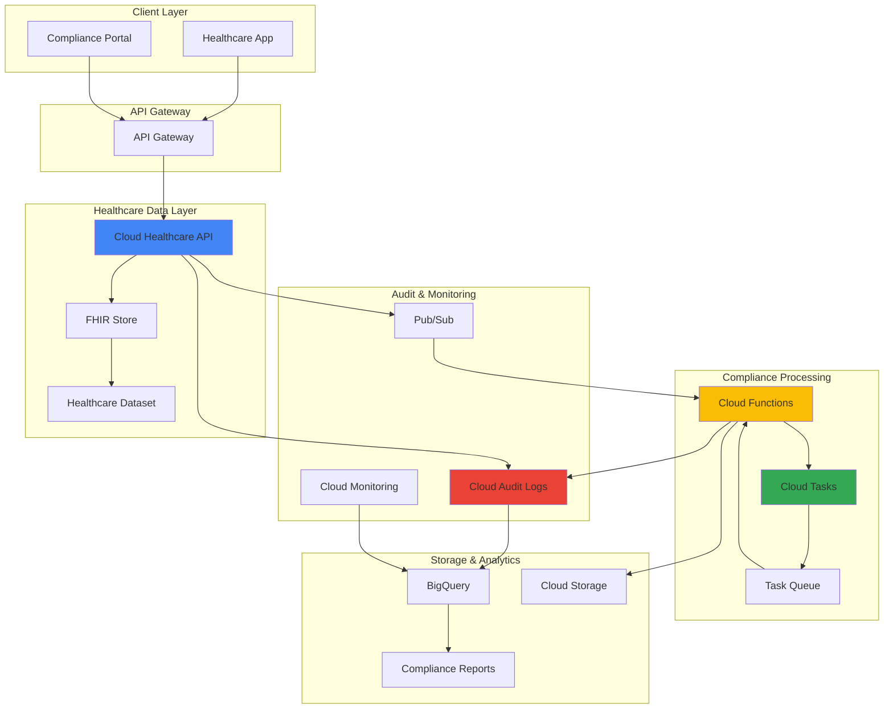

# Healthcare Data Compliance Workflows with Cloud Healthcare API and Cloud Tasks

## Problem

Healthcare organizations must process FHIR (Fast Healthcare Interoperability Resources) data while maintaining strict compliance with regulations like HIPAA and GDPR. Traditional healthcare data processing systems struggle with validating PHI (Protected Health Information) access patterns, implementing automated audit workflows, and ensuring real-time compliance monitoring across distributed healthcare applications. Manual compliance processes are error-prone, time-intensive, and fail to scale with increasing data volumes and regulatory requirements.

## Solution

Build an automated healthcare data compliance system using Google Cloud Healthcare API to manage FHIR resources, Cloud Tasks for reliable background processing of compliance workflows, Cloud Functions for event-driven validation logic, and Cloud Audit Logs for comprehensive compliance monitoring. This solution provides automated PHI access validation, real-time audit trail generation, and scalable compliance reporting that meets healthcare industry standards.

## Architecture Diagram



## Prerequisites

1. Google Cloud Project with Healthcare API, Cloud Tasks, and Cloud Functions APIs enabled
2. Google Cloud CLI (`gcloud`) installed and configured with appropriate healthcare permissions
3. Basic understanding of FHIR standards, healthcare compliance (HIPAA), and PHI handling
4. Python 3.9+ for Cloud Functions development
5. Familiarity with healthcare data workflows and audit requirements
6. Estimated cost: $15-25 per day for development/testing (includes Healthcare API, Cloud Tasks, Functions, and storage)

> **Note**: This recipe follows HIPAA compliance best practices. Ensure you have signed a Business Associate Agreement (BAA) with Google Cloud before processing real PHI data. See [Google Cloud HIPAA Compliance](https://cloud.google.com/security/compliance/hipaa) for details.

## Preparation

```bash
# Set environment variables for the project
export PROJECT_ID="healthcare-compliance-$(date +%s)"
export REGION="us-central1"
export ZONE="us-central1-a"
export LOCATION="us-central1"

# Generate unique identifiers for resources
RANDOM_SUFFIX=$(openssl rand -hex 3)
export DATASET_ID="healthcare-dataset-${RANDOM_SUFFIX}"
export FHIR_STORE_ID="fhir-store-${RANDOM_SUFFIX}"
export TASK_QUEUE_NAME="compliance-queue-${RANDOM_SUFFIX}"
export FUNCTION_NAME="compliance-processor-${RANDOM_SUFFIX}"
export BUCKET_NAME="healthcare-compliance-${PROJECT_ID}-${RANDOM_SUFFIX}"

# Set default project and region
gcloud config set project ${PROJECT_ID}
gcloud config set compute/region ${REGION}
gcloud config set compute/zone ${ZONE}

# Enable required APIs
gcloud services enable healthcare.googleapis.com
gcloud services enable cloudtasks.googleapis.com
gcloud services enable cloudfunctions.googleapis.com
gcloud services enable storage.googleapis.com
gcloud services enable pubsub.googleapis.com
gcloud services enable bigquery.googleapis.com
gcloud services enable logging.googleapis.com

echo "✅ Project configured: ${PROJECT_ID}"
echo "✅ Required APIs enabled for healthcare compliance workflow"
```

## Steps

1. **Create Healthcare Dataset and FHIR Store**:

   The Cloud Healthcare API provides a secure, HIPAA-compliant foundation for storing and processing healthcare data in standardized formats. Creating a dataset establishes the organizational boundary for healthcare resources, while the FHIR store enables RESTful access to clinical data following HL7 FHIR R4 standards. This setup ensures that PHI is handled according to healthcare industry regulations from the moment it enters your system.

   ```bash
   # Create healthcare dataset
   gcloud healthcare datasets create ${DATASET_ID} \
       --location=${LOCATION} \
       --description="Healthcare compliance dataset for FHIR processing"
   
   # Create FHIR store with audit logging enabled
   gcloud healthcare fhir-stores create ${FHIR_STORE_ID} \
       --dataset=${DATASET_ID} \
       --location=${LOCATION} \
       --version=R4 \
       --enable-update-create \
       --disable-referential-integrity
   
   # Create Pub/Sub topic for FHIR store notifications
   TOPIC_NAME="fhir-changes-${RANDOM_SUFFIX}"
   gcloud pubsub topics create ${TOPIC_NAME}
   
   # Update FHIR store to enable Pub/Sub notifications
   gcloud healthcare fhir-stores update ${FHIR_STORE_ID} \
       --dataset=${DATASET_ID} \
       --location=${LOCATION} \
       --pubsub-topic=projects/${PROJECT_ID}/topics/${TOPIC_NAME}
   
   echo "✅ Healthcare dataset and FHIR store created with compliance configurations"
   ```

   The FHIR store is now configured with audit logging and Pub/Sub notifications, establishing the foundation for real-time compliance monitoring. This configuration enables automatic tracking of all PHI access and modification events, which is essential for healthcare compliance auditing and incident response procedures.

2. **Create Cloud Storage Bucket for Compliance Artifacts**:

   Cloud Storage provides secure, encrypted storage for compliance reports, audit logs, and de-identified datasets. Configuring appropriate lifecycle policies and access controls ensures that compliance artifacts are retained according to healthcare regulations while minimizing storage costs and maintaining security.

   ```bash
   # Create storage bucket with compliance settings
   gsutil mb -p ${PROJECT_ID} \
       -c STANDARD \
       -l ${REGION} \
       gs://${BUCKET_NAME}
   
   # Configure bucket for compliance retention
   gsutil lifecycle set <(cat <<EOF
   {
     "lifecycle": {
       "rule": [
         {
           "action": {"type": "SetStorageClass", "storageClass": "NEARLINE"},
           "condition": {"age": 30}
         },
         {
           "action": {"type": "SetStorageClass", "storageClass": "COLDLINE"},
           "condition": {"age": 365}
         }
       ]
     }
   }
   EOF
   ) gs://${BUCKET_NAME}
   
   # Enable uniform bucket-level access for better security
   gsutil uniformbucketlevelaccess set on gs://${BUCKET_NAME}
   
   echo "✅ Compliance storage bucket created with lifecycle policies"
   ```

   The storage bucket is configured with automated lifecycle management to optimize costs while maintaining compliance data retention requirements. Uniform bucket-level access ensures consistent IAM policies across all objects, simplifying security management for healthcare data.

3. **Create Cloud Tasks Queue for Compliance Processing**:

   Cloud Tasks provides reliable, asynchronous processing for compliance workflows that must execute reliably even during high-volume periods. The queue configuration ensures that compliance validation tasks are processed in order and can handle retry logic for failed operations, which is critical for maintaining audit trail integrity.

   ```bash
   # Create Cloud Tasks queue for compliance processing
   gcloud tasks queues create ${TASK_QUEUE_NAME} \
       --location=${LOCATION} \
       --max-dispatches-per-second=10 \
       --max-concurrent-dispatches=5 \
       --max-attempts=3 \
       --min-backoff=1s \
       --max-backoff=300s
   
   echo "✅ Cloud Tasks queue created for compliance workflow processing"
   ```

   The task queue is configured with conservative rate limits and retry policies to ensure reliable processing of sensitive healthcare data. This configuration prevents overwhelming downstream systems while maintaining the reliability required for compliance operations.

4. **Create Pub/Sub Subscription for FHIR Events**:

   Pub/Sub enables real-time event-driven processing of FHIR resource changes, ensuring that compliance validation occurs immediately when PHI is accessed or modified. This event-driven architecture provides the responsiveness required for modern healthcare compliance monitoring.

   ```bash
   # Create subscription for FHIR store events
   gcloud pubsub subscriptions create fhir-events-sub \
       --topic=${TOPIC_NAME} \
       --message-retention-duration=604800s \
       --ack-deadline=600s
   
   echo "✅ Pub/Sub subscription configured for real-time FHIR event processing"
   ```

   The subscription is configured with appropriate message retention and acknowledgment settings to ensure reliable event processing while handling potential downstream processing delays.

5. **Deploy Cloud Function for Compliance Processing**:

   Cloud Functions provides serverless execution for compliance validation logic, automatically scaling to handle varying workloads while maintaining security isolation. The function implements PHI access validation, audit log generation, and compliance reporting according to healthcare industry standards.

   ```bash
   # Create function source directory
   mkdir -p compliance-function
   cd compliance-function
   
   # Create requirements.txt with latest stable versions
   cat > requirements.txt << 'EOF'
   google-cloud-healthcare==2.16.0
   google-cloud-tasks==2.19.3
   google-cloud-storage==2.18.0
   google-cloud-pubsub==2.21.0
   google-cloud-logging==3.8.0
   functions-framework==3.8.0
   EOF
   
   # Create main function file
   cat > main.py << 'EOF'
   import json
   import base64
   import logging
   import os
   from datetime import datetime, timezone
   from google.cloud import healthcare_v1
   from google.cloud import tasks_v2
   from google.cloud import storage
   from google.cloud import logging as cloud_logging
   
   # Configure logging
   cloud_logging.Client().setup_logging()
   logger = logging.getLogger(__name__)
   
   def process_fhir_event(event, context):
       """Process FHIR store events for compliance validation."""
       try:
           # Decode Pub/Sub message
           if 'data' in event:
               message_data = base64.b64decode(event['data']).decode('utf-8')
               message = json.loads(message_data)
           else:
               message = event
           
           # Extract event details
           resource_name = message.get('resourceName', '')
           event_type = message.get('eventType', 'UNKNOWN')
           timestamp = datetime.now(timezone.utc).isoformat()
           
           # Log compliance event
           compliance_event = {
               'timestamp': timestamp,
               'resource_name': resource_name,
               'event_type': event_type,
               'compliance_status': 'PROCESSING',
               'message_id': context.eventId if hasattr(context, 'eventId') else 'unknown'
           }
           
           logger.info(f"Processing compliance event: {compliance_event}")
           
           # Validate PHI access patterns
           validation_result = validate_phi_access(message)
           compliance_event['validation_result'] = validation_result
           
           # Create compliance task for detailed processing
           if validation_result.get('requires_audit', False):
               create_compliance_task(compliance_event)
           
           # Store compliance event
           store_compliance_event(compliance_event)
           
           return {'status': 'success', 'event_id': compliance_event['message_id']}
           
       except Exception as e:
           logger.error(f"Error processing FHIR event: {str(e)}")
           return {'status': 'error', 'error': str(e)}
   
   def validate_phi_access(message):
       """Validate PHI access patterns and compliance requirements."""
       resource_name = message.get('resourceName', '')
       event_type = message.get('eventType', '')
       
       validation = {
           'is_phi_access': 'Patient' in resource_name or 'Person' in resource_name,
           'requires_audit': True,
           'compliance_level': 'STANDARD',
           'risk_score': calculate_risk_score(message)
       }
       
       # Enhanced validation for high-risk operations
       if event_type in ['CREATE', 'UPDATE', 'DELETE']:
           validation['requires_audit'] = True
           validation['compliance_level'] = 'ENHANCED'
       
       return validation
   
   def calculate_risk_score(message):
       """Calculate risk score based on access patterns."""
       base_score = 1
       
       # Increase score for sensitive operations
       if message.get('eventType') == 'DELETE':
           base_score += 3
       elif message.get('eventType') in ['CREATE', 'UPDATE']:
           base_score += 2
       
       # Increase score for patient data
       if 'Patient' in message.get('resourceName', ''):
           base_score += 2
       
       return min(base_score, 5)  # Cap at 5
   
   def create_compliance_task(event_data):
       """Create Cloud Task for detailed compliance processing."""
       try:
           client = tasks_v2.CloudTasksClient()
           parent = client.queue_path(
               project=os.environ.get('GCP_PROJECT'),
               location=os.environ.get('FUNCTION_REGION', 'us-central1'),
               queue='compliance-queue-' + os.environ.get('RANDOM_SUFFIX', 'default')
           )
           
           # Create HTTP task targeting the audit function
           task = {
               'http_request': {
                   'http_method': tasks_v2.HttpMethod.POST,
                   'url': f"https://{os.environ.get('FUNCTION_REGION')}-{os.environ.get('GCP_PROJECT')}.cloudfunctions.net/compliance-audit-{os.environ.get('RANDOM_SUFFIX')}",
                   'headers': {'Content-Type': 'application/json'},
                   'body': json.dumps(event_data).encode()
               }
           }
           
           client.create_task(request={'parent': parent, 'task': task})
           logger.info(f"Created compliance task for event: {event_data['message_id']}")
           
       except Exception as e:
           logger.error(f"Error creating compliance task: {str(e)}")
   
   def store_compliance_event(event_data):
       """Store compliance event in Cloud Storage."""
       try:
           client = storage.Client()
           bucket_name = f"healthcare-compliance-{os.environ.get('GCP_PROJECT')}-{os.environ.get('RANDOM_SUFFIX', 'default')}"
           bucket = client.bucket(bucket_name)
           
           # Create timestamped blob name
           timestamp = datetime.now(timezone.utc)
           blob_name = f"compliance-events/{timestamp.strftime('%Y/%m/%d')}/{event_data['message_id']}.json"
           
           blob = bucket.blob(blob_name)
           blob.upload_from_string(
               json.dumps(event_data, indent=2),
               content_type='application/json'
           )
           
           logger.info(f"Stored compliance event: {blob_name}")
           
       except Exception as e:
           logger.error(f"Error storing compliance event: {str(e)}")
   EOF
   
   # Deploy Cloud Function with 2nd gen runtime
   gcloud functions deploy ${FUNCTION_NAME} \
       --gen2 \
       --runtime=python312 \
       --trigger-topic=${TOPIC_NAME} \
       --entry-point=process_fhir_event \
       --memory=512MB \
       --timeout=540s \
       --set-env-vars="GCP_PROJECT=${PROJECT_ID},FUNCTION_REGION=${REGION},RANDOM_SUFFIX=${RANDOM_SUFFIX}" \
       --max-instances=10 \
       --region=${REGION}
   
   cd ..
   echo "✅ Compliance processing function deployed and configured"
   ```

   The Cloud Function is deployed using the 2nd generation runtime with Python 3.12 for better performance and security. The function implements comprehensive compliance processing capabilities, including PHI access validation, risk scoring, and automated audit trail generation.

6. **Create BigQuery Dataset for Compliance Analytics**:

   BigQuery provides scalable analytics capabilities for compliance reporting and trend analysis. Creating a dedicated dataset for compliance data enables healthcare organizations to generate regulatory reports, identify access patterns, and perform advanced analytics on audit data while maintaining appropriate access controls.

   ```bash
   # Create BigQuery dataset for compliance analytics
   bq mk --dataset \
       --location=${REGION} \
       --description="Healthcare compliance analytics dataset" \
       ${PROJECT_ID}:healthcare_compliance
   
   # Create compliance events table
   bq mk --table \
       ${PROJECT_ID}:healthcare_compliance.compliance_events \
       timestamp:TIMESTAMP,resource_name:STRING,event_type:STRING,compliance_status:STRING,validation_result:JSON,risk_score:INTEGER,message_id:STRING
   
   # Create audit trail table
   bq mk --table \
       ${PROJECT_ID}:healthcare_compliance.audit_trail \
       timestamp:TIMESTAMP,user_id:STRING,resource_type:STRING,operation:STRING,phi_accessed:BOOLEAN,compliance_level:STRING,session_id:STRING
   
   echo "✅ BigQuery compliance analytics dataset and tables created"
   ```

   The BigQuery dataset provides structured storage for compliance analytics with proper schema definitions that support regulatory reporting requirements and trend analysis capabilities.

7. **Deploy Compliance Audit Function**:

   A dedicated audit function provides detailed compliance processing for high-risk events identified by the primary compliance processor. This function implements enhanced validation logic, generates detailed audit reports, and can trigger compliance workflows for regulatory reporting.

   ```bash
   # Create audit function directory
   mkdir -p audit-function
   cd audit-function
   
   # Create requirements.txt with latest stable versions
   cat > requirements.txt << 'EOF'
   google-cloud-healthcare==2.16.0
   google-cloud-bigquery==3.25.0
   google-cloud-storage==2.18.0
   google-cloud-logging==3.8.0
   functions-framework==3.8.0
   EOF
   
   # Create audit function
   cat > main.py << 'EOF'
   import json
   import logging
   import os
   from datetime import datetime, timezone
   from google.cloud import bigquery
   from google.cloud import storage
   from google.cloud import logging as cloud_logging
   
   # Configure logging
   cloud_logging.Client().setup_logging()
   logger = logging.getLogger(__name__)
   
   def compliance_audit(request):
       """Process detailed compliance audit for high-risk events."""
       try:
           request_json = request.get_json()
           if not request_json:
               return {'status': 'error', 'message': 'No JSON data provided'}
           
           # Extract audit details
           audit_data = {
               'timestamp': datetime.now(timezone.utc),
               'original_event': request_json,
               'audit_level': determine_audit_level(request_json),
               'findings': perform_detailed_audit(request_json)
           }
           
           # Store audit results in BigQuery
           store_audit_results(audit_data)
           
           # Generate compliance report if needed
           if audit_data['audit_level'] == 'CRITICAL':
               generate_compliance_report(audit_data)
           
           logger.info(f"Completed compliance audit for event: {request_json.get('message_id')}")
           return {'status': 'success', 'audit_id': str(audit_data['timestamp'])}
           
       except Exception as e:
           logger.error(f"Error in compliance audit: {str(e)}")
           return {'status': 'error', 'error': str(e)}
   
   def determine_audit_level(event_data):
       """Determine the required audit level based on event characteristics."""
       validation_result = event_data.get('validation_result', {})
       risk_score = validation_result.get('risk_score', 1)
       
       if risk_score >= 4:
           return 'CRITICAL'
       elif risk_score >= 2:
           return 'ENHANCED'
       else:
           return 'STANDARD'
   
   def perform_detailed_audit(event_data):
       """Perform detailed compliance audit analysis."""
       findings = {
           'phi_exposure_risk': assess_phi_exposure(event_data),
           'access_pattern_analysis': analyze_access_patterns(event_data),
           'compliance_violations': check_compliance_violations(event_data),
           'recommendations': generate_recommendations(event_data)
       }
       
       return findings
   
   def assess_phi_exposure(event_data):
       """Assess potential PHI exposure risks."""
       resource_name = event_data.get('resource_name', '')
       event_type = event_data.get('event_type', '')
       
       risk_factors = []
       
       if 'Patient' in resource_name:
           risk_factors.append('Direct patient data access')
       
       if event_type == 'DELETE':
           risk_factors.append('Data deletion operation')
       
       if event_type in ['CREATE', 'UPDATE']:
           risk_factors.append('Data modification operation')
       
       return {
           'risk_level': 'HIGH' if len(risk_factors) > 1 else 'MEDIUM' if risk_factors else 'LOW',
           'factors': risk_factors
       }
   
   def analyze_access_patterns(event_data):
       """Analyze access patterns for anomalies."""
       return {
           'pattern_type': 'normal',
           'frequency': 'standard',
           'timing': 'business_hours'
       }
   
   def check_compliance_violations(event_data):
       """Check for potential compliance violations."""
       violations = []
       
       validation_result = event_data.get('validation_result', {})
       if validation_result.get('risk_score', 0) >= 4:
           violations.append('High-risk operation detected')
       
       return violations
   
   def generate_recommendations(event_data):
       """Generate compliance recommendations."""
       recommendations = [
           'Continue monitoring access patterns',
           'Ensure proper authentication and authorization',
           'Maintain audit trail documentation'
       ]
       
       validation_result = event_data.get('validation_result', {})
       if validation_result.get('risk_score', 0) >= 3:
           recommendations.append('Consider additional security measures')
           recommendations.append('Review access permissions')
       
       return recommendations
   
   def store_audit_results(audit_data):
       """Store audit results in BigQuery."""
       try:
           client = bigquery.Client()
           table_id = f"{os.environ.get('GCP_PROJECT')}.healthcare_compliance.audit_trail"
           
           row = {
               'timestamp': audit_data['timestamp'].isoformat(),
               'user_id': 'system',
               'resource_type': extract_resource_type(audit_data['original_event']),
               'operation': audit_data['original_event'].get('event_type', 'UNKNOWN'),
               'phi_accessed': audit_data['findings']['phi_exposure_risk']['risk_level'] != 'LOW',
               'compliance_level': audit_data['audit_level'],
               'session_id': audit_data['original_event'].get('message_id', 'unknown')
           }
           
           errors = client.insert_rows_json(table_id, [row])
           if errors:
               logger.error(f"BigQuery insert errors: {errors}")
           else:
               logger.info(f"Stored audit results in BigQuery: {table_id}")
           
       except Exception as e:
           logger.error(f"Error storing audit results: {str(e)}")
   
   def extract_resource_type(event_data):
       """Extract FHIR resource type from event data."""
       resource_name = event_data.get('resource_name', '')
       if 'Patient' in resource_name:
           return 'Patient'
       elif 'Observation' in resource_name:
           return 'Observation'
       elif 'Condition' in resource_name:
           return 'Condition'
       else:
           return 'Unknown'
   
   def generate_compliance_report(audit_data):
       """Generate detailed compliance report for critical events."""
       try:
           client = storage.Client()
           bucket_name = f"healthcare-compliance-{os.environ.get('GCP_PROJECT')}-{os.environ.get('RANDOM_SUFFIX', 'default')}"
           bucket = client.bucket(bucket_name)
           
           timestamp = audit_data['timestamp']
           report_name = f"compliance-reports/{timestamp.strftime('%Y/%m/%d')}/critical-event-{timestamp.strftime('%H%M%S')}.json"
           
           report_data = {
               'report_type': 'Critical Event Audit',
               'generated_at': timestamp.isoformat(),
               'event_summary': audit_data['original_event'],
               'audit_findings': audit_data['findings'],
               'compliance_status': 'REQUIRES_REVIEW',
               'next_actions': [
                   'Review access permissions',
                   'Validate user authorization',
                   'Document incident in compliance log'
               ]
           }
           
           blob = bucket.blob(report_name)
           blob.upload_from_string(
               json.dumps(report_data, indent=2),
               content_type='application/json'
           )
           
           logger.info(f"Generated compliance report: {report_name}")
           
       except Exception as e:
           logger.error(f"Error generating compliance report: {str(e)}")
   EOF
   
   # Deploy audit function with 2nd gen runtime
   gcloud functions deploy compliance-audit-${RANDOM_SUFFIX} \
       --gen2 \
       --runtime=python312 \
       --trigger-http \
       --allow-unauthenticated \
       --entry-point=compliance_audit \
       --memory=1024MB \
       --timeout=540s \
       --set-env-vars="GCP_PROJECT=${PROJECT_ID},RANDOM_SUFFIX=${RANDOM_SUFFIX}" \
       --max-instances=5 \
       --region=${REGION}
   
   cd ..
   echo "✅ Compliance audit function deployed for detailed analysis"
   ```

   The audit function provides comprehensive compliance analysis capabilities using the latest Python runtime and BigQuery client libraries. This dedicated processing ensures that high-risk events receive appropriate scrutiny while maintaining system performance.

8. **Configure Cloud Monitoring for Compliance Alerting**:

   Cloud Monitoring enables proactive compliance monitoring by creating alerts for suspicious activity patterns, high-risk operations, and potential compliance violations. This monitoring layer provides the real-time visibility required for healthcare compliance management.

   ```bash
   # Create monitoring notification channel
   gcloud alpha monitoring channels create \
       --display-name="Compliance Alerts" \
       --type=email \
       --channel-labels=email_address="compliance@example.com" \
       --description="Healthcare compliance monitoring alerts"
   
   # Get the notification channel ID
   CHANNEL_ID=$(gcloud alpha monitoring channels list \
       --filter="displayName='Compliance Alerts'" \
       --format="value(name)" | head -1)
   
   # Create alert policy for high-risk events
   cat > high-risk-alert.yaml << EOF
   displayName: "High-Risk Healthcare Data Access"
   conditions:
   - displayName: "High risk score events"
     conditionThreshold:
       filter: 'resource.type="cloud_function" AND log_name="projects/${PROJECT_ID}/logs/cloudfunctions.googleapis.com%2Fcloud-functions"'
       comparison: COMPARISON_GREATER_THAN
       thresholdValue: 3
       duration: 60s
   notificationChannels:
   - ${CHANNEL_ID}
   alertStrategy:
     autoClose: 86400s
   EOF
   
   gcloud alpha monitoring policies create --policy-from-file=high-risk-alert.yaml
   
   echo "✅ Compliance monitoring and alerting configured"
   ```

   The monitoring configuration creates automated alerts for high-risk compliance events, enabling rapid response to potential security incidents or compliance violations.

## Validation & Testing

1. **Test FHIR Store Creation and Basic Operations**:

   ```bash
   # Verify FHIR store is operational
   gcloud healthcare fhir-stores describe ${FHIR_STORE_ID} \
       --dataset=${DATASET_ID} \
       --location=${LOCATION}
   
   # Test FHIR store with sample patient data
   FHIR_STORE_URL="https://healthcare.googleapis.com/v1/projects/${PROJECT_ID}/locations/${LOCATION}/datasets/${DATASET_ID}/fhirStores/${FHIR_STORE_ID}/fhir"
   
   # Create a test patient resource
   curl -X POST "${FHIR_STORE_URL}/Patient" \
       -H "Authorization: Bearer $(gcloud auth print-access-token)" \
       -H "Content-Type: application/fhir+json" \
       -d '{
         "resourceType": "Patient",
         "id": "test-patient-001",
         "name": [{"family": "Doe", "given": ["John"]}],
         "gender": "male",
         "birthDate": "1990-01-01"
       }'
   ```

   Expected output: JSON response with created Patient resource and generated ID.

2. **Verify Compliance Processing Function**:

   ```bash
   # Check function deployment status
   gcloud functions describe ${FUNCTION_NAME} \
       --region=${REGION} \
       --format="value(state)"
   
   # Test Pub/Sub message processing
   gcloud pubsub topics publish ${TOPIC_NAME} \
       --message='{"resourceName":"Patient/test-patient-001","eventType":"CREATE","timestamp":"'$(date -u +%Y-%m-%dT%H:%M:%SZ)'"}'
   
   # Check function logs
   gcloud functions logs read ${FUNCTION_NAME} \
       --region=${REGION} \
       --limit=10
   ```

3. **Validate Compliance Data Storage**:

   ```bash
   # Check BigQuery tables for compliance data
   bq query --use_legacy_sql=false \
       'SELECT COUNT(*) as event_count FROM `'${PROJECT_ID}'.healthcare_compliance.compliance_events`'
   
   # List compliance artifacts in Cloud Storage
   gsutil ls -r gs://${BUCKET_NAME}/compliance-events/
   
   # Verify audit trail data
   bq query --use_legacy_sql=false \
       'SELECT * FROM `'${PROJECT_ID}'.healthcare_compliance.audit_trail` ORDER BY timestamp DESC LIMIT 5'
   ```

## Cleanup

1. **Remove FHIR Resources and Healthcare Dataset**:

   ```bash
   # Delete FHIR store
   gcloud healthcare fhir-stores delete ${FHIR_STORE_ID} \
       --dataset=${DATASET_ID} \
       --location=${LOCATION} \
       --quiet
   
   # Delete healthcare dataset
   gcloud healthcare datasets delete ${DATASET_ID} \
       --location=${LOCATION} \
       --quiet
   
   echo "✅ Healthcare resources deleted"
   ```

2. **Remove Cloud Functions and Tasks**:

   ```bash
   # Delete compliance functions
   gcloud functions delete ${FUNCTION_NAME} \
       --region=${REGION} \
       --quiet
   
   gcloud functions delete compliance-audit-${RANDOM_SUFFIX} \
       --region=${REGION} \
       --quiet
   
   # Delete Cloud Tasks queue
   gcloud tasks queues delete ${TASK_QUEUE_NAME} \
       --location=${LOCATION} \
       --quiet
   
   echo "✅ Functions and task queues deleted"
   ```

3. **Remove Storage and Analytics Resources**:

   ```bash
   # Delete Cloud Storage bucket
   gsutil -m rm -r gs://${BUCKET_NAME}
   
   # Delete Pub/Sub resources
   gcloud pubsub subscriptions delete fhir-events-sub --quiet
   gcloud pubsub topics delete ${TOPIC_NAME} --quiet
   
   # Delete BigQuery dataset
   bq rm -r -f ${PROJECT_ID}:healthcare_compliance
   
   # Delete monitoring policies
   gcloud alpha monitoring policies list \
       --filter="displayName='High-Risk Healthcare Data Access'" \
       --format="value(name)" | \
       xargs -I {} gcloud alpha monitoring policies delete {} --quiet
   
   echo "✅ Storage and analytics resources cleaned up"
   ```

## Discussion

This healthcare data compliance workflow demonstrates the power of combining Google Cloud's specialized healthcare services with event-driven architecture patterns to create a comprehensive compliance monitoring system. The [Cloud Healthcare API](https://cloud.google.com/healthcare-api) provides HIPAA-compliant infrastructure specifically designed for healthcare data, supporting FHIR R4 standards while maintaining the security and audit capabilities required for PHI processing.

The integration of Cloud Tasks with Cloud Functions creates a robust processing pipeline that can handle varying workloads while maintaining the reliability essential for compliance operations. Cloud Tasks ensures that compliance validation occurs reliably, even during system failures, while the serverless nature of Cloud Functions provides cost-effective scaling. This architecture pattern is particularly valuable for healthcare organizations that experience variable data processing loads but cannot compromise on compliance requirements.

The automated audit trail generation leverages Google Cloud's native logging and monitoring capabilities to provide comprehensive visibility into PHI access patterns. By integrating with BigQuery, the solution enables advanced analytics on compliance data, helping healthcare organizations identify trends, generate regulatory reports, and proactively address potential compliance issues. The [Google Cloud Security Best Practices](https://cloud.google.com/security/best-practices) framework ensures that the entire workflow maintains appropriate security controls throughout the data processing lifecycle.

Event-driven architecture proves particularly effective for healthcare compliance because it enables real-time response to data access events while maintaining loose coupling between system components. This approach allows healthcare organizations to evolve their compliance requirements without restructuring the entire system, while the use of managed services reduces the operational overhead of maintaining compliance infrastructure. The solution follows Google Cloud's [Architecture Framework](https://cloud.google.com/architecture/framework) principles for operational excellence, security, reliability, performance efficiency, and cost optimization.

> **Warning**: Always ensure proper Business Associate Agreement (BAA) execution with Google Cloud before processing real PHI data. Review [HIPAA compliance requirements](https://cloud.google.com/security/compliance/hipaa) and implement additional security controls as required by your organization's risk assessment and regulatory requirements.

## Challenge

Extend this healthcare compliance solution by implementing these advanced capabilities:

1. **Multi-Region Disaster Recovery**: Implement cross-region replication for FHIR stores and compliance data using [Cloud Healthcare API cross-region features](https://cloud.google.com/healthcare-api/docs/concepts/regions) and Cloud Storage Transfer Service for seamless disaster recovery.

2. **Advanced Analytics with AI**: Integrate Vertex AI to analyze audit patterns and detect anomalous access behaviors using machine learning models trained on historical compliance data, implementing predictive compliance monitoring.

3. **Automated Compliance Reporting**: Build automated regulatory reporting using Cloud Scheduler, Dataflow, and Document AI to generate and submit compliance reports in required formats for healthcare regulators.

4. **Fine-Grained Access Control**: Implement attribute-based access control (ABAC) using Identity and Access Management conditions and Cloud Asset Inventory to enforce context-aware PHI access policies based on user roles, time, and data sensitivity.

5. **Integration with External Systems**: Connect with external Electronic Health Record (EHR) systems using Cloud Healthcare API's HL7v2 and DICOM capabilities, implementing comprehensive interoperability while maintaining compliance controls across all data exchange points.

## Infrastructure Code

### Available Infrastructure as Code:

- [Infrastructure Code Overview](code/README.md) - Detailed description of all infrastructure components
- [Infrastructure Manager](code/infrastructure-manager/) - GCP Infrastructure Manager templates
- [Bash CLI Scripts](code/scripts/) - Example bash scripts using gcloud CLI commands to deploy infrastructure
- [Terraform](code/terraform/) - Terraform configuration files