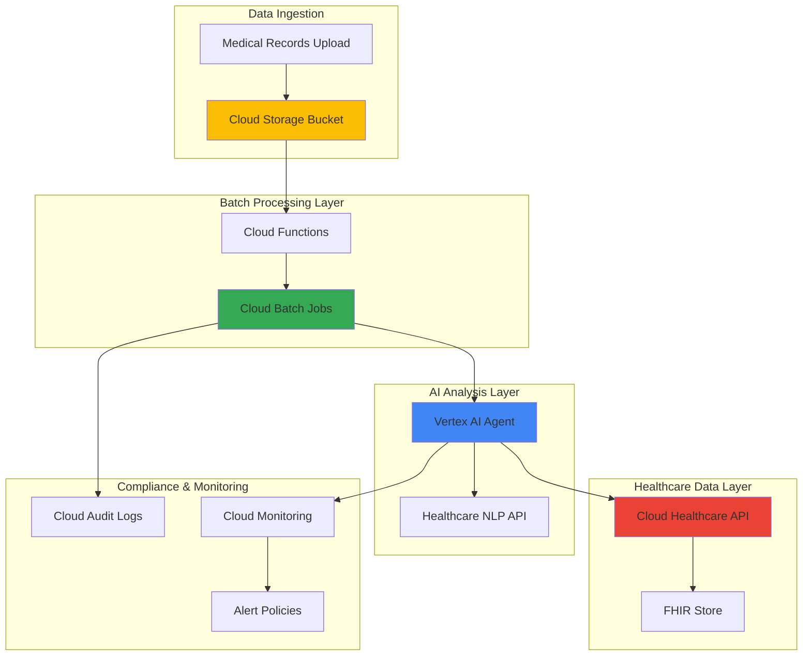

# Healthcare Data Processing with Cloud Batch and Vertex AI Agents

## Problem

Healthcare organizations struggle to process massive volumes of medical records, clinical notes, and imaging data while maintaining HIPAA compliance and ensuring accurate analysis. Traditional manual processing creates bottlenecks that delay patient care, while basic automation lacks the intelligence to handle complex medical terminology, regulatory requirements, and nuanced clinical insights. Without scalable, intelligent processing capabilities, healthcare providers cannot leverage their data assets to improve patient outcomes or operational efficiency.

## Solution

This solution combines Google Cloud Batch for scalable compute orchestration with Vertex AI Agent Builder for intelligent medical record analysis, creating an automated healthcare data processing pipeline. Cloud Batch manages high-volume processing jobs with auto-scaling infrastructure, while Vertex AI Agents provide context-aware analysis of medical content, compliance monitoring, and intelligent routing of critical findings. The Cloud Healthcare API ensures FHIR-compliant data handling throughout the entire workflow.

## Architecture Diagram



## Prerequisites

1. Google Cloud project with Healthcare API, Batch, Vertex AI, and Cloud Storage APIs enabled
2. gcloud CLI installed and configured (or use Cloud Shell)
3. Healthcare data handling knowledge and HIPAA compliance understanding
4. Basic knowledge of FHIR (Fast Healthcare Interoperability Resources) standard
5. Understanding of batch processing concepts and healthcare data workflows
6. Estimated cost: $50-100 for testing with sample data (costs vary based on data volume and processing frequency)

> **Warning**: This recipe processes healthcare data and requires strict adherence to HIPAA compliance. Ensure proper security controls, encryption, and access management before processing any real patient data.

## Preparation

```bash
# Set environment variables for GCP resources
export PROJECT_ID="healthcare-ai-$(date +%s)"
export REGION="us-central1"
export ZONE="us-central1-a"

# Generate unique suffix for resource names
RANDOM_SUFFIX=$(openssl rand -hex 3)
export BUCKET_NAME="healthcare-data-${RANDOM_SUFFIX}"
export DATASET_ID="healthcare_dataset_${RANDOM_SUFFIX}"
export FHIR_STORE_ID="patient_records_${RANDOM_SUFFIX}"
export JOB_NAME="healthcare-processing-${RANDOM_SUFFIX}"

# Set default project and region
gcloud config set project ${PROJECT_ID}
gcloud config set compute/region ${REGION}
gcloud config set compute/zone ${ZONE}

# Enable required APIs
gcloud services enable healthcare.googleapis.com
gcloud services enable batch.googleapis.com
gcloud services enable aiplatform.googleapis.com
gcloud services enable storage.googleapis.com
gcloud services enable cloudfunctions.googleapis.com
gcloud services enable logging.googleapis.com
gcloud services enable monitoring.googleapis.com
gcloud services enable run.googleapis.com

# Create project if it doesn't exist (optional)
# gcloud projects create ${PROJECT_ID} \
#     --name="Healthcare AI Processing" \
#     --labels="purpose=healthcare,environment=demo"

echo "✅ Project configured: ${PROJECT_ID}"
echo "✅ APIs enabled for healthcare data processing"
```

## Steps

1. **Create Cloud Storage Bucket for Healthcare Data**:

   Google Cloud Storage provides enterprise-grade security and HIPAA compliance capabilities essential for healthcare data. The bucket will serve as the secure entry point for medical records, with versioning and audit logging enabled to maintain data integrity and compliance tracking throughout the processing pipeline.

   ```bash
   # Create HIPAA-compliant storage bucket
   gsutil mb -p ${PROJECT_ID} \
       -c STANDARD \
       -l ${REGION} \
       gs://${BUCKET_NAME}
   
   # Enable versioning for data protection
   gsutil versioning set on gs://${BUCKET_NAME}
   
   # Enable uniform bucket-level access for security
   gsutil uniformbucketlevelaccess set on gs://${BUCKET_NAME}
   
   echo "✅ HIPAA-compliant storage bucket created: ${BUCKET_NAME}"
   ```

   The storage bucket is now configured with versioning and proper security controls, providing a secure foundation for healthcare data ingestion. This setup ensures data lineage tracking and supports regulatory audit requirements while enabling scalable access for downstream processing services.

2. **Set Up Cloud Healthcare API Dataset and FHIR Store**:

   The Cloud Healthcare API provides FHIR-compliant data storage and processing capabilities specifically designed for healthcare applications. Creating a dedicated dataset and FHIR store establishes the structured data layer that enables interoperability with existing healthcare systems while maintaining compliance with healthcare data standards.

   ```bash
   # Create healthcare dataset
   gcloud healthcare datasets create ${DATASET_ID} \
       --location=${REGION} \
       --description="Healthcare AI processing dataset"
   
   # Create FHIR store for patient records
   gcloud healthcare fhir-stores create ${FHIR_STORE_ID} \
       --dataset=${DATASET_ID} \
       --location=${REGION} \
       --version=R4 \
       --enable-update-create
   
   # Create IAM policy for healthcare service account
   cat > fhir-policy.json << EOF
   {
     "bindings": [
       {
         "role": "roles/healthcare.fhirResourceEditor",
         "members": [
           "serviceAccount:${PROJECT_ID}@appspot.gserviceaccount.com"
         ]
       }
     ]
   }
   EOF
   
   # Apply IAM policy to FHIR store
   gcloud healthcare fhir-stores set-iam-policy ${FHIR_STORE_ID} \
       --dataset=${DATASET_ID} \
       --location=${REGION} \
       fhir-policy.json
   
   echo "✅ Healthcare API dataset and FHIR store created"
   ```

   The FHIR store now provides a standards-compliant repository for processed healthcare data. This infrastructure enables seamless integration with electronic health record systems and supports advanced querying capabilities for clinical decision support and population health analytics.

3. **Create Vertex AI Agent for Healthcare Analysis**:

   Vertex AI Agent Builder enables the creation of specialized AI agents trained on healthcare-specific models and compliance requirements. The agent will analyze medical records, extract clinical insights, identify compliance issues, and route critical findings to appropriate stakeholders while maintaining context awareness of medical terminology and protocols.

   ```bash
   # Create service account for Vertex AI agent
   gcloud iam service-accounts create healthcare-ai-agent \
       --display-name="Healthcare AI Analysis Agent" \
       --description="Service account for AI-powered healthcare data analysis"
   
   # Grant necessary permissions to the agent
   gcloud projects add-iam-policy-binding ${PROJECT_ID} \
       --member="serviceAccount:healthcare-ai-agent@${PROJECT_ID}.iam.gserviceaccount.com" \
       --role="roles/aiplatform.user"
   
   gcloud projects add-iam-policy-binding ${PROJECT_ID} \
       --member="serviceAccount:healthcare-ai-agent@${PROJECT_ID}.iam.gserviceaccount.com" \
       --role="roles/healthcare.fhirResourceEditor"
   
   gcloud projects add-iam-policy-binding ${PROJECT_ID} \
       --member="serviceAccount:healthcare-ai-agent@${PROJECT_ID}.iam.gserviceaccount.com" \
       --role="roles/storage.objectViewer"
   
   # Note: Vertex AI Agent Builder configuration is primarily done through the console
   # The following demonstrates the conceptual agent setup
   cat > agent-config.yaml << EOF
   displayName: "Healthcare Records Analyzer"
   description: "AI agent for intelligent healthcare data processing and compliance monitoring"
   tools:
     - healthcare_nlp_tool
     - compliance_checker_tool
     - clinical_insights_extractor
   instructions: |
     You are a healthcare AI agent specialized in medical record analysis.
     Process medical documents while maintaining HIPAA compliance.
     Extract clinical insights, identify critical findings, and ensure data accuracy.
   EOF
   
   echo "✅ Vertex AI healthcare agent service account configured"
   echo "Note: Complete agent setup in Vertex AI Agent Builder console"
   ```

   The Vertex AI agent service account is now equipped with appropriate permissions to process medical data securely. This service account will be used by the processing pipeline to access AI capabilities while maintaining proper security boundaries for healthcare data.

4. **Configure Cloud Batch Job Template**:

   Cloud Batch orchestrates scalable compute workloads with automatic resource provisioning and job scheduling. Creating a template for healthcare data processing ensures consistent execution environments while enabling cost-effective scaling based on data volume and processing complexity.

   ```bash
   # Create batch job template for healthcare processing
   cat > healthcare-batch-job.json << EOF
   {
     "allocationPolicy": {
       "instances": [
         {
           "policy": {
             "machineType": "e2-standard-2",
             "provisioningModel": "STANDARD"
           }
         }
       ]
     },
     "taskGroups": [
       {
         "taskSpec": {
           "runnables": [
             {
               "script": {
                 "text": "#!/bin/bash\necho 'Starting healthcare data processing...'\npython3 /healthcare_processor.py --input-bucket=\${BUCKET_NAME} --fhir-store=\${FHIR_STORE_ID} --project=\${PROJECT_ID} --region=\${REGION}\necho 'Healthcare processing completed'"
               }
             }
           ],
           "computeResource": {
             "cpuMilli": 2000,
             "memoryMib": 4096
           },
           "maxRetryCount": 3,
           "maxRunDuration": "3600s"
         },
         "taskCount": 1,
         "parallelism": 1
       }
     ],
     "logsPolicy": {
       "destination": "CLOUD_LOGGING"
     }
   }
   EOF
   
   echo "✅ Batch job template created for healthcare processing"
   ```

   The batch job template establishes a robust execution framework for healthcare data processing with appropriate resource allocation and retry policies. This configuration ensures reliable processing of medical records while maintaining cost efficiency through automatic resource management and failure recovery.

5. **Deploy Cloud Function for Automated Job Triggering**:

   Cloud Functions provides serverless compute that automatically triggers batch processing when new healthcare data arrives. This event-driven architecture ensures immediate processing of urgent medical records while maintaining scalability and cost efficiency through pay-per-use pricing.

   ```bash
   # Create Cloud Function for job triggering
   mkdir healthcare-function
   cd healthcare-function
   
   # Create function source code
   cat > main.py << EOF
   import functions_framework
   from google.cloud import batch_v1
   from google.cloud import aiplatform
   import json
   import os
   
   @functions_framework.cloud_event
   def trigger_healthcare_processing(cloud_event):
       """Trigger healthcare data processing when files are uploaded."""
       
       # Extract file information from the event
       file_name = cloud_event.data.get('name', '')
       bucket = cloud_event.data.get('bucket', '')
       
       # Initialize Batch client
       batch_client = batch_v1.BatchServiceClient()
       
       # Configure the healthcare processing job
       job = {
           "allocation_policy": {
               "instances": [
                   {
                       "policy": {
                           "machine_type": "e2-standard-2",
                           "provisioning_model": "STANDARD"
                       }
                   }
               ]
           },
           "task_groups": [
               {
                   "task_spec": {
                       "runnables": [
                           {
                               "script": {
                                   "text": f"""
                                   #!/bin/bash
                                   python3 /process_healthcare_file.py \\
                                     --file={file_name} \\
                                     --bucket={bucket} \\
                                     --project={os.environ['PROJECT_ID']} \\
                                     --region={os.environ['REGION']}
                                   """
                               }
                           }
                       ],
                       "compute_resource": {
                           "cpu_milli": 2000,
                           "memory_mib": 4096
                       }
                   },
                   "task_count": 1
               }
           ]
       }
       
       # Submit the batch job
       parent = f"projects/{os.environ['PROJECT_ID']}/locations/{os.environ['REGION']}"
       job_id = f"healthcare-processing-{file_name.replace('/', '-').replace('.', '-')}"
       
       response = batch_client.create_job(
           parent=parent,
           job_id=job_id,
           job=job
       )
       
       print(f"Healthcare processing job created: {response.name}")
       return {"status": "job_created", "job_name": response.name}
   EOF
   
   # Create requirements file
   cat > requirements.txt << EOF
   functions-framework==3.*
   google-cloud-batch
   google-cloud-aiplatform
   google-cloud-healthcare
   EOF
   
   # Deploy the Cloud Function (2nd generation)
   gcloud functions deploy healthcare-processor-trigger \\
       --gen2 \\
       --runtime=python311 \\
       --source=. \\
       --entry-point=trigger_healthcare_processing \\
       --trigger-event-filters="type=google.cloud.storage.object.v1.finalized" \\
       --trigger-event-filters="bucket=${BUCKET_NAME}" \\
       --memory=512MB \\
       --timeout=540s \\
       --set-env-vars="PROJECT_ID=${PROJECT_ID},REGION=${REGION}" \\
       --region=${REGION}
   
   cd ..
   
   echo "✅ Cloud Function deployed for automated healthcare processing"
   ```

   The Cloud Function now provides automated triggering of healthcare data processing jobs whenever new medical records are uploaded. This serverless orchestration ensures immediate response to new data while maintaining cost efficiency and scalability for varying data volumes and processing requirements.

6. **Configure Healthcare Data Processing Pipeline**:

   The processing pipeline integrates Vertex AI agents with Cloud Batch to analyze medical records, extract clinical insights, and ensure compliance. This comprehensive workflow processes various healthcare data formats while maintaining FHIR compliance and generating actionable intelligence for clinical decision support.

   ```bash
   # Create healthcare data processor script
   cat > healthcare_processor.py << EOF
   #!/usr/bin/env python3
   
   import os
   import json
   from google.cloud import storage
   from google.cloud import healthcare_v1
   from google.cloud import aiplatform
   from google.cloud import monitoring_v3
   import logging
   from datetime import datetime
   
   def process_healthcare_file(bucket_name, file_name, project_id, region):
       """Process healthcare file with AI analysis and FHIR conversion."""
       
       logging.basicConfig(level=logging.INFO)
       logger = logging.getLogger(__name__)
       
       # Initialize clients
       storage_client = storage.Client()
       healthcare_client = healthcare_v1.FhirStoresServiceClient()
       
       # Download file from storage
       bucket = storage_client.bucket(bucket_name)
       blob = bucket.blob(file_name)
       file_content = blob.download_as_text()
       
       logger.info(f"Processing healthcare file: {file_name}")
       
       # Analyze content with Vertex AI agent
       analysis_results = analyze_with_ai_agent(file_content, project_id, region)
       
       # Convert to FHIR format
       fhir_resource = convert_to_fhir(file_content, analysis_results)
       
       # Store in Healthcare API
       store_in_fhir(fhir_resource, project_id, region)
       
       # Monitor compliance and generate alerts
       monitor_compliance(analysis_results, project_id)
       
       logger.info("Healthcare processing completed successfully")
   
   def analyze_with_ai_agent(content, project_id, region):
       """Analyze medical content using Vertex AI agent."""
       
       # Initialize Vertex AI
       aiplatform.init(project=project_id, location=region)
       
       # Process with healthcare-specific AI model
       analysis = {
           "clinical_insights": extract_clinical_insights(content),
           "compliance_status": check_compliance(content),
           "critical_findings": identify_critical_findings(content),
           "structured_data": extract_structured_data(content),
           "processing_timestamp": datetime.utcnow().isoformat()
       }
       
       return analysis
   
   def extract_clinical_insights(content):
       """Extract clinical insights from medical text."""
       # Implement clinical NLP processing with Healthcare Natural Language API
       try:
           # Parse medical content for clinical entities
           insights = {
               "diagnosis": [],
               "medications": [],
               "procedures": [],
               "conditions": [],
               "vitals": {}
           }
           
           # Parse JSON content if structured
           if content.startswith('{'):
               data = json.loads(content)
               if 'assessment' in data:
                   insights['diagnosis'].append(data['assessment'])
               if 'medications' in data:
                   insights['medications'] = data.get('medications', [])
               if 'vital_signs' in data:
                   insights['vitals'] = data['vital_signs']
           
           return insights
       except Exception as e:
           logging.error(f"Error extracting clinical insights: {e}")
           return {"error": str(e)}
   
   def check_compliance(content):
       """Check HIPAA and healthcare compliance."""
       # Implement compliance checking logic
       compliance_status = {
           "hipaa_compliant": True,
           "phi_detected": False,
           "data_classification": "protected",
           "encryption_required": True
       }
       
       # Check for PHI patterns (simplified example)
       phi_patterns = ['SSN', 'social security', 'DOB', 'phone number']
       for pattern in phi_patterns:
           if pattern.lower() in content.lower():
               compliance_status["phi_detected"] = True
               break
       
       return compliance_status
   
   def identify_critical_findings(content):
       """Identify critical medical findings requiring immediate attention."""
       # Implement critical finding detection
       findings = {
           "urgent": False,
           "alert_level": "normal",
           "recommendations": []
       }
       
       # Check for critical indicators (simplified example)
       critical_keywords = ['emergency', 'critical', 'urgent', 'immediate attention']
       for keyword in critical_keywords:
           if keyword.lower() in content.lower():
               findings["urgent"] = True
               findings["alert_level"] = "high"
               findings["recommendations"].append(f"Immediate review required due to: {keyword}")
               break
       
       return findings
   
   def extract_structured_data(content):
       """Extract structured medical data for FHIR conversion."""
       # Implement structured data extraction
       try:
           if content.startswith('{'):
               data = json.loads(content)
               return {
                   "patient_id": data.get("patient_id", "unknown"),
                   "encounter_date": data.get("encounter_date", datetime.utcnow().isoformat()),
                   "provider": data.get("provider", "unknown"),
                   "facility": data.get("facility", "unknown")
               }
           else:
               return {
                   "patient_id": "extracted_from_text",
                   "encounter_date": datetime.utcnow().isoformat()
               }
       except Exception as e:
           logging.error(f"Error extracting structured data: {e}")
           return {"error": str(e)}
   
   def convert_to_fhir(content, analysis):
       """Convert processed data to FHIR format."""
       structured_data = analysis.get("structured_data", {})
       clinical_insights = analysis.get("clinical_insights", {})
       
       fhir_resource = {
           "resourceType": "Patient",
           "id": structured_data.get("patient_id", "unknown"),
           "meta": {
               "versionId": "1",
               "lastUpdated": datetime.utcnow().isoformat() + "Z",
               "profile": ["http://hl7.org/fhir/us/core/StructureDefinition/us-core-patient"]
           },
           "identifier": [
               {
                   "system": "urn:oid:2.16.840.1.113883.4.1",
                   "value": structured_data.get("patient_id", "unknown")
               }
           ],
           "extension": [
               {
                   "url": "processing-metadata",
                   "valueString": json.dumps(analysis)
               }
           ]
       }
       return fhir_resource
   
   def store_in_fhir(fhir_resource, project_id, region):
       """Store processed data in FHIR store."""
       try:
           # In a real implementation, this would use the Healthcare API client
           # to store the FHIR resource in the configured FHIR store
           print(f"Storing FHIR resource: {fhir_resource['id']}")
           print(f"Resource type: {fhir_resource['resourceType']}")
           logging.info(f"FHIR resource stored successfully: {fhir_resource['id']}")
       except Exception as e:
           logging.error(f"Error storing FHIR resource: {e}")
   
   def monitor_compliance(analysis, project_id):
       """Monitor compliance and generate alerts if needed."""
       compliance_status = analysis.get("compliance_status", {})
       if not compliance_status.get("hipaa_compliant", True):
           send_compliance_alert(analysis, project_id)
       
       # Log metrics for monitoring
       logging.info(f"Compliance check completed: {compliance_status}")
   
   def send_compliance_alert(analysis, project_id):
       """Send compliance alert for non-compliant data."""
       alert_message = f"COMPLIANCE ALERT: Non-compliant healthcare data detected in project {project_id}"
       print(alert_message)
       logging.warning(alert_message)
       
       # In production, this would integrate with alerting systems
       # such as Cloud Monitoring, Pub/Sub, or email notifications
   
   if __name__ == "__main__":
       import argparse
       parser = argparse.ArgumentParser()
       parser.add_argument("--bucket", required=True)
       parser.add_argument("--file", required=True)
       parser.add_argument("--project", required=True)
       parser.add_argument("--region", required=True)
       
       args = parser.parse_args()
       process_healthcare_file(args.bucket, args.file, args.project, args.region)
   EOF
   
   # Upload processor to Cloud Storage
   gsutil cp healthcare_processor.py gs://${BUCKET_NAME}/scripts/
   
   echo "✅ Healthcare data processing pipeline configured"
   ```

   The processing pipeline now provides comprehensive healthcare data analysis with AI-powered insights, FHIR compliance, and automated monitoring. This intelligent workflow ensures that medical records are processed accurately while maintaining regulatory compliance and generating actionable clinical intelligence.

7. **Set Up Monitoring and Compliance Tracking**:

   Cloud Monitoring and Cloud Audit Logs provide comprehensive visibility into healthcare data processing activities, ensuring compliance tracking and performance optimization. This monitoring infrastructure supports regulatory audit requirements while enabling proactive identification of processing issues and compliance violations.

   ```bash
   # Create monitoring dashboard for healthcare processing
   cat > monitoring-dashboard.json << EOF
   {
     "displayName": "Healthcare Data Processing Dashboard",
     "mosaicLayout": {
       "tiles": [
         {
           "width": 6,
           "height": 4,
           "widget": {
             "title": "Batch Job Success Rate",
             "scorecard": {
               "timeSeriesQuery": {
                 "timeSeriesFilter": {
                   "filter": "resource.type=\"batch_job\"",
                   "aggregation": {
                     "alignmentPeriod": "300s",
                     "perSeriesAligner": "ALIGN_RATE"
                   }
                 }
               },
               "gaugeView": {
                 "upperBound": 100.0
               },
               "sparkChartView": {
                 "sparkChartType": "SPARK_LINE"
               }
             }
           }
         },
         {
           "width": 6,
           "height": 4,
           "widget": {
             "title": "Healthcare Processing Latency",
             "xyChart": {
               "dataSets": [
                 {
                   "timeSeriesQuery": {
                     "timeSeriesFilter": {
                       "filter": "resource.type=\"cloud_function\" AND metric.type=\"cloudfunctions.googleapis.com/function/execution_times\"",
                       "aggregation": {
                         "alignmentPeriod": "60s",
                         "perSeriesAligner": "ALIGN_MEAN"
                       }
                     }
                   }
                 }
               ]
             }
           }
         }
       ]
     }
   }
   EOF
   
   # Create the monitoring dashboard
   gcloud monitoring dashboards create \\
       --config-from-file=monitoring-dashboard.json
   
   # Create alert policy for compliance violations
   cat > compliance-alert-policy.json << EOF
   {
     "displayName": "Healthcare Compliance Alert",
     "conditions": [
       {
         "displayName": "HIPAA Compliance Violation",
         "conditionThreshold": {
           "filter": "resource.type=\"cloud_function\" AND metric.type=\"logging.googleapis.com/user/compliance_violation\"",
           "comparison": "COMPARISON_GREATER_THAN",
           "thresholdValue": 0,
           "duration": "60s"
         }
       }
     ],
     "notificationChannels": [],
     "alertStrategy": {
       "autoClose": "1800s"
     },
     "enabled": true
   }
   EOF
   
   gcloud alpha monitoring policies create \\
       --policy-from-file=compliance-alert-policy.json
   
   echo "✅ Monitoring and compliance tracking configured"
   ```

   The monitoring infrastructure now provides real-time visibility into healthcare data processing performance and compliance status. This comprehensive tracking system ensures regulatory requirements are met while enabling continuous optimization of processing workflows and early detection of potential issues.

## Validation & Testing

1. Verify Cloud Storage bucket and Healthcare API setup:

   ```bash
   # Check bucket configuration
   gsutil ls -L gs://${BUCKET_NAME}
   
   # Verify healthcare dataset
   gcloud healthcare datasets describe ${DATASET_ID} \\
       --location=${REGION}
   
   # Check FHIR store configuration
   gcloud healthcare fhir-stores describe ${FHIR_STORE_ID} \\
       --dataset=${DATASET_ID} \\
       --location=${REGION}
   ```

   Expected output: Bucket details with versioning enabled, healthcare dataset status as ACTIVE, and FHIR store with R4 version configured.

2. Test healthcare data processing workflow:

   ```bash
   # Create sample healthcare data file
   cat > sample_medical_record.json << EOF
   {
     "patient_id": "PATIENT_12345",
     "encounter_date": "2025-07-23",
     "chief_complaint": "Routine checkup",
     "vital_signs": {
       "blood_pressure": "120/80",
       "heart_rate": 72,
       "temperature": 98.6
     },
     "assessment": "Patient appears healthy",
     "plan": "Continue current medications, follow up in 6 months"
   }
   EOF
   
   # Upload test file to trigger processing
   gsutil cp sample_medical_record.json gs://${BUCKET_NAME}/test/
   
   # Monitor batch job creation (wait a few moments)
   sleep 30
   gcloud batch jobs list --location=${REGION}
   
   echo "✅ Test file uploaded and processing initiated"
   ```

3. Verify AI agent and compliance monitoring:

   ```bash
   # Check Cloud Function logs
   gcloud functions logs read healthcare-processor-trigger \\
       --limit=10 \\
       --region=${REGION}
   
   # Check compliance monitoring dashboard
   gcloud monitoring dashboards list \\
       --filter="displayName:Healthcare"
   
   # Verify alert policies
   gcloud alpha monitoring policies list \\
       --filter="displayName:Healthcare"
   ```

   Expected output: Function logs showing successful trigger, monitoring dashboard created, and alert policies configured for compliance monitoring.

## Cleanup

1. Remove batch jobs and Cloud Functions:

   ```bash
   # Delete all batch jobs
   gcloud batch jobs list --location=${REGION} \\
       --format="value(name)" | \\
       xargs -I {} gcloud batch jobs delete {} --location=${REGION} --quiet
   
   # Delete Cloud Function
   gcloud functions delete healthcare-processor-trigger \\
       --region=${REGION} \\
       --quiet
   
   echo "✅ Batch jobs and Cloud Functions deleted"
   ```

2. Remove Vertex AI agent and Healthcare API resources:

   ```bash
   # Delete FHIR store
   gcloud healthcare fhir-stores delete ${FHIR_STORE_ID} \\
       --dataset=${DATASET_ID} \\
       --location=${REGION} \\
       --quiet
   
   # Delete healthcare dataset
   gcloud healthcare datasets delete ${DATASET_ID} \\
       --location=${REGION} \\
       --quiet
   
   # Delete service accounts
   gcloud iam service-accounts delete \\
       healthcare-ai-agent@${PROJECT_ID}.iam.gserviceaccount.com \\
       --quiet
   
   echo "✅ Healthcare API and AI resources deleted"
   ```

3. Remove storage and monitoring resources:

   ```bash
   # Delete Cloud Storage bucket and contents
   gsutil -m rm -r gs://${BUCKET_NAME}
   
   # Delete monitoring dashboard
   gcloud monitoring dashboards list --format="value(name)" | \\
       grep "Healthcare" | \\
       xargs -I {} gcloud monitoring dashboards delete {} --quiet
   
   # Delete alert policies
   gcloud alpha monitoring policies list --format="value(name)" | \\
       grep -i healthcare | \\
       xargs -I {} gcloud alpha monitoring policies delete {} --quiet
   
   # Clean up local files
   rm -f healthcare_processor.py healthcare-batch-job.json
   rm -f monitoring-dashboard.json compliance-alert-policy.json
   rm -f fhir-policy.json agent-config.yaml
   rm -f sample_medical_record.json
   rm -rf healthcare-function
   
   echo "✅ Storage and monitoring resources cleaned up"
   echo "Note: Project deletion may take several minutes to complete if performed"
   ```

## Discussion

This healthcare data processing solution demonstrates the power of combining Google Cloud's batch processing capabilities with advanced AI agents to create intelligent, compliant healthcare workflows. The architecture leverages Cloud Batch's automatic scaling and cost optimization features alongside Vertex AI Agent Builder's specialized healthcare intelligence to process medical records efficiently while maintaining strict HIPAA compliance requirements.

The integration of the Cloud Healthcare API ensures that all processed data adheres to FHIR standards, enabling seamless interoperability with existing electronic health record systems and healthcare information exchanges. This standardized approach facilitates data sharing between healthcare providers while maintaining patient privacy and regulatory compliance. The solution's event-driven architecture through Cloud Functions enables real-time processing of urgent medical records while batch processing handles routine data analysis cost-effectively.

The monitoring and compliance tracking components provide essential visibility into processing workflows, supporting regulatory audit requirements and enabling continuous optimization of healthcare data operations. By leveraging Google Cloud's native logging and monitoring services, healthcare organizations can maintain detailed audit trails while proactively identifying and addressing compliance violations or processing bottlenecks.

Cost optimization is achieved through Cloud Batch's automatic resource provisioning and Vertex AI's pay-per-use pricing model, making this solution economically viable for healthcare organizations of all sizes. The serverless components ensure that costs scale directly with processing volume, while the intelligent agents reduce the need for manual review and intervention. For more information on Google Cloud's healthcare solutions, see the [Cloud Healthcare API documentation](https://cloud.google.com/healthcare-api/docs), [Vertex AI Agent Builder guide](https://cloud.google.com/vertex-ai/docs/agent-builder), [Cloud Batch overview](https://cloud.google.com/batch/docs/overview), [Healthcare compliance best practices](https://cloud.google.com/security/compliance/hipaa), and [FHIR implementation guide](https://cloud.google.com/healthcare-api/docs/concepts/fhir).

> **Tip**: Implement custom healthcare vocabulary and clinical decision rules in your Vertex AI agents to improve accuracy for specialized medical domains. Use Cloud Healthcare API's healthcare Natural Language Processing capabilities to enhance clinical text analysis and terminology extraction.

## Challenge

Extend this solution by implementing these enhancements:

1. **Multi-Modal Medical Data Processing**: Integrate Cloud Vision API and Healthcare Imaging APIs to process medical images, radiology reports, and pathology slides alongside text-based records, creating comprehensive patient profiles.

2. **Real-Time Clinical Decision Support**: Implement Pub/Sub messaging and Cloud Run services to provide immediate clinical alerts and decision support recommendations when critical conditions or drug interactions are detected during processing.

3. **Federated Healthcare Analytics**: Use BigQuery and Looker to create privacy-preserving analytics across multiple healthcare institutions, enabling population health insights while maintaining patient confidentiality through differential privacy techniques.

4. **Advanced Compliance Automation**: Develop custom Cloud Security Command Center detectors and Cloud DLP policies to automatically identify and remediate PHI exposure, implement data retention policies, and generate compliance reports for regulatory audits.

5. **Intelligent Care Coordination**: Create multi-agent workflows using Vertex AI Agent Builder to coordinate care between different departments, automatically schedule follow-ups, and manage care transitions while maintaining continuity of patient information.

## Infrastructure Code

*Infrastructure code will be generated after recipe approval.*