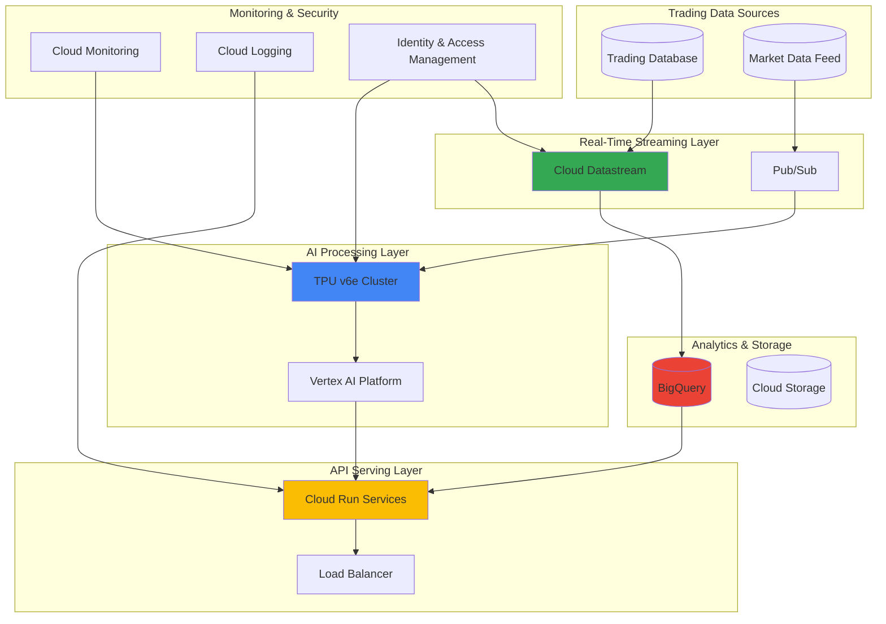

# High-Frequency Trading Risk Analytics with TPU v6e and Cloud Datastream

## Problem

Financial institutions operating high-frequency trading platforms face critical challenges in processing millions of transactions per second while maintaining sub-millisecond risk analytics capabilities. Traditional risk management systems introduce latency bottlenecks that can result in significant financial losses, with even microsecond delays potentially costing millions in trading opportunities. Existing solutions struggle to provide real-time risk calculations at the scale and speed required for algorithmic trading platforms operating in today's ultra-competitive financial markets.

## Solution

This solution leverages Google Cloud's cutting-edge TPU v6e (Trillium) processors for ultra-low latency AI inference, Cloud Datastream for real-time database replication, BigQuery for high-performance analytics, and Cloud Run for scalable API serving. The architecture enables sub-millisecond risk calculations by processing streaming market data through specialized AI models running on Google's sixth-generation TPUs, delivering the computational power and memory bandwidth required for complex financial risk analytics at trading speeds.

## Architecture Diagram



## Prerequisites

1. Google Cloud Platform account with billing enabled and appropriate IAM permissions for TPU, Datastream, BigQuery, and Cloud Run
2. Google Cloud CLI (gcloud) v455.0.0 or later installed and configured
3. Advanced understanding of financial derivatives, risk analytics, and high-frequency trading concepts
4. Python 3.10+ development environment with TensorFlow and financial libraries
5. Existing trading database (MySQL, PostgreSQL, or Oracle) with transaction data
6. Estimated cost: $3,000-$6,000 per day for TPU v6e clusters and high-throughput streaming (costs vary significantly based on trading volume)

> **Warning**: TPU v6e resources are premium-tier infrastructure with substantial costs. Monitor usage closely and implement proper resource quotas to avoid unexpected charges.

## Preparation

```bash
# Set environment variables for GCP resources
export PROJECT_ID="hft-risk-analytics-$(date +%s)"
export REGION="us-central1"
export ZONE="us-central1-b"
export DATASET_ID="trading_analytics"
export DATASTREAM_NAME="trading-data-stream"

# Generate unique suffix for resource names
RANDOM_SUFFIX=$(openssl rand -hex 4)
export BUCKET_NAME="hft-risk-data-${RANDOM_SUFFIX}"
export TPU_NAME="trillium-risk-tpu-${RANDOM_SUFFIX}"
export CLOUD_RUN_SERVICE="risk-analytics-api-${RANDOM_SUFFIX}"

# Set default project and region
gcloud config set project ${PROJECT_ID}
gcloud config set compute/region ${REGION}
gcloud config set compute/zone ${ZONE}

# Enable required APIs for comprehensive trading analytics
gcloud services enable tpu.googleapis.com
gcloud services enable datastream.googleapis.com
gcloud services enable bigquery.googleapis.com
gcloud services enable run.googleapis.com
gcloud services enable artifactregistry.googleapis.com
gcloud services enable aiplatform.googleapis.com
gcloud services enable monitoring.googleapis.com
gcloud services enable logging.googleapis.com

# Create foundational BigQuery dataset for trading analytics
bq mk --dataset \
    --description "High-frequency trading risk analytics dataset" \
    --location=${REGION} \
    ${PROJECT_ID}:${DATASET_ID}

# Create Cloud Storage bucket for model artifacts and streaming data
gsutil mb -p ${PROJECT_ID} \
    -c STANDARD \
    -l ${REGION} \
    gs://${BUCKET_NAME}

echo "✅ Project configured: ${PROJECT_ID}"
echo "✅ Dataset created: ${DATASET_ID}"
echo "✅ Storage bucket created: ${BUCKET_NAME}"
```

## Steps

1. **Create TPU v6e Cluster for Ultra-Low Latency Inference**:

   TPU v6e (Trillium) represents Google's sixth-generation tensor processing unit, specifically engineered for large-scale AI inference workloads with enhanced memory bandwidth and computational efficiency. Unlike previous TPU generations, Trillium is optimized for both training and inference, making it ideal for complex financial risk models that require real-time processing of vast amounts of trading data with sub-millisecond latency requirements.

   ```bash
   # Create TPU v6e cluster with optimal configuration for trading
   gcloud compute tpus tpu-vm create ${TPU_NAME} \
       --zone=${ZONE} \
       --accelerator-type=v6e-8 \
       --version=tpu-vm-tf-2.17.0-pjrt \
       --network=default \
       --description="High-frequency trading risk analytics TPU cluster"
   
   # Wait for TPU to be ready
   sleep 60
   
   # Configure TPU for financial workloads
   gcloud compute tpus tpu-vm ssh ${TPU_NAME} \
       --zone=${ZONE} \
       --command="sudo apt-get update && sudo apt-get install -y python3-pip tensorflow-cpu"
   
   echo "✅ TPU v6e cluster ${TPU_NAME} created and configured"
   ```

   The TPU v6e cluster is now operational with specialized accelerators that provide the computational power needed for complex financial risk calculations. This infrastructure enables processing of thousands of risk scenarios simultaneously while maintaining the ultra-low latency requirements critical for high-frequency trading operations.

2. **Configure Cloud Datastream for Real-Time Database Replication**:

   Cloud Datastream provides serverless, real-time change data capture (CDC) that streams every database change—inserts, updates, and deletes—from operational trading databases to analytical systems. This log-based replication mechanism minimizes impact on source database performance while ensuring that risk analytics systems have access to the most current trading data without traditional batch processing delays.

   ```bash
   # Create connection profile for source trading database
   gcloud datastream connection-profiles create ${DATASTREAM_NAME}-source \
       --location=${REGION} \
       --type=mysql \
       --mysql-hostname=YOUR_TRADING_DB_HOST \
       --mysql-port=3306 \
       --mysql-username=datastream_user \
       --mysql-password=YOUR_SECURE_PASSWORD \
       --display-name="Trading Database Source"
   
   # Create connection profile for BigQuery destination
   gcloud datastream connection-profiles create ${DATASTREAM_NAME}-dest \
       --location=${REGION} \
       --type=bigquery \
       --bigquery-dataset=${PROJECT_ID}.${DATASET_ID} \
       --display-name="BigQuery Analytics Destination"
   
   # Create real-time streaming pipeline
   gcloud datastream streams create ${DATASTREAM_NAME} \
       --location=${REGION} \
       --source-connection-profile=${DATASTREAM_NAME}-source \
       --destination-connection-profile=${DATASTREAM_NAME}-dest \
       --display-name="Real-time Trading Data Stream"
   
   echo "✅ Cloud Datastream configured for real-time replication"
   ```

   The streaming pipeline is now capturing every transaction and market event in real-time, providing the foundation for continuous risk analytics. This serverless architecture automatically scales to handle trading volume spikes while maintaining data consistency and enabling immediate access to streaming data for AI inference.

3. **Deploy Financial Risk Models on TPU v6e**:

   Financial risk models require sophisticated AI architectures that can process multiple risk factors simultaneously while maintaining deterministic performance. The TPU v6e's specialized inference capabilities enable deployment of ensemble models, transformer architectures, and large-scale neural networks that can evaluate portfolio risk, counterparty exposure, and market volatility in real-time.

   ```bash
   # Create model deployment directory and configuration
   mkdir -p risk-models/
   cat > risk-models/model_config.py << 'EOF'
   import tensorflow as tf
   import numpy as np
   
   class RiskModel(tf.keras.Model):
       def __init__(self):
           super(RiskModel, self).__init__()
           self.dense_layers = [
               tf.keras.layers.Dense(512, activation='relu'),
               tf.keras.layers.Dense(256, activation='relu'),
               tf.keras.layers.Dense(128, activation='relu'),
               tf.keras.layers.Dense(1, activation='sigmoid')
           ]
       
       def call(self, inputs):
           x = inputs
           for layer in self.dense_layers:
               x = layer(x)
           return x
   EOF
   
   # Upload model to Cloud Storage
   gsutil cp -r risk-models/ gs://${BUCKET_NAME}/models/
   
   # Deploy model to Vertex AI for TPU serving
   gcloud ai models upload \
       --region=${REGION} \
       --display-name="Risk Analytics Model" \
       --artifact-uri=gs://${BUCKET_NAME}/models/risk-models \
       --container-image-uri=us-docker.pkg.dev/vertex-ai/prediction/tf2-cpu.2-17:latest
   
   echo "✅ Financial risk models prepared for TPU v6e deployment"
   ```

   The risk models are now prepared for deployment on TPU v6e infrastructure, providing the computational foundation for sub-millisecond risk calculations. These models can process complex financial scenarios including Value-at-Risk (VaR), Expected Shortfall, and stress testing calculations while maintaining the performance requirements of algorithmic trading systems.

4. **Create BigQuery Analytics Schema for Trading Data**:

   BigQuery serves as the analytical data warehouse for historical trading data, risk metrics, and compliance reporting. The columnar storage format and massively parallel processing capabilities enable complex analytical queries across billions of trading records while supporting real-time dashboard updates and regulatory reporting requirements.

   ```bash
   # Create comprehensive trading analytics schema
   bq query --use_legacy_sql=false << 'EOF'
   CREATE TABLE `${PROJECT_ID}.${DATASET_ID}.trading_positions` (
     position_id STRING NOT NULL,
     symbol STRING NOT NULL,
     quantity NUMERIC NOT NULL,
     price NUMERIC NOT NULL,
     timestamp TIMESTAMP NOT NULL,
     trader_id STRING NOT NULL,
     risk_score NUMERIC,
     var_1d NUMERIC,
     expected_shortfall NUMERIC,
     created_at TIMESTAMP DEFAULT CURRENT_TIMESTAMP()
   )
   PARTITION BY DATE(timestamp)
   CLUSTER BY symbol, trader_id;
   
   CREATE TABLE `${PROJECT_ID}.${DATASET_ID}.risk_metrics` (
     metric_id STRING NOT NULL,
     portfolio_id STRING NOT NULL,
     metric_type STRING NOT NULL,
     metric_value NUMERIC NOT NULL,
     calculation_timestamp TIMESTAMP NOT NULL,
     confidence_level NUMERIC,
     time_horizon_days INTEGER,
     created_at TIMESTAMP DEFAULT CURRENT_TIMESTAMP()
   )
   PARTITION BY DATE(calculation_timestamp)
   CLUSTER BY portfolio_id, metric_type;
   EOF
   
   # Create real-time analytics views
   bq query --use_legacy_sql=false << 'EOF'
   CREATE VIEW `${PROJECT_ID}.${DATASET_ID}.real_time_risk_dashboard` AS
   SELECT 
     'portfolio' as portfolio_id,
     symbol,
     SUM(quantity * price) as position_value,
     MAX(risk_score) as max_risk_score,
     AVG(var_1d) as avg_var_1d,
     COUNT(*) as position_count,
     MAX(timestamp) as last_update
   FROM `${PROJECT_ID}.${DATASET_ID}.trading_positions`
   WHERE timestamp >= TIMESTAMP_SUB(CURRENT_TIMESTAMP(), INTERVAL 1 HOUR)
   GROUP BY symbol;
   EOF
   
   echo "✅ BigQuery analytics schema created for trading data"
   ```

   The analytics infrastructure is now ready to support complex risk calculations and regulatory reporting. The partitioned and clustered tables enable efficient querying of historical data while supporting real-time analytics for active trading positions and risk exposure monitoring.

5. **Build Cloud Run API Service for Risk Analytics**:

   Cloud Run provides a serverless container platform that can automatically scale to handle varying trading loads while maintaining consistent API response times. The service acts as the primary interface for trading systems to access risk calculations, portfolio analytics, and compliance reports through REST APIs that integrate seamlessly with existing trading infrastructure.

   ```bash
   # Create Cloud Run service configuration
   mkdir -p risk-api/
   cat > risk-api/Dockerfile << 'EOF'
   FROM python:3.10-slim
   
   WORKDIR /app
   COPY requirements.txt .
   RUN pip install --no-cache-dir -r requirements.txt
   
   COPY . .
   EXPOSE 8080
   
   CMD ["gunicorn", "--bind", "0.0.0.0:8080", "--workers", "4", "main:app"]
   EOF
   
   cat > risk-api/requirements.txt << 'EOF'
   flask==3.0.0
   google-cloud-aiplatform==1.38.0
   google-cloud-bigquery==3.13.0
   numpy==1.26.0
   pandas==2.1.0
   gunicorn==21.2.0
   EOF
   
   cat > risk-api/main.py << 'EOF'
   from flask import Flask, request, jsonify
   import numpy as np
   
   app = Flask(__name__)
   
   @app.route('/calculate-risk', methods=['POST'])
   def calculate_risk():
       data = request.json
       portfolio_id = data.get('portfolio_id', 'unknown')
       positions = data.get('positions', [])
       
       # Simulate risk calculation
       risk_score = np.random.uniform(0.1, 0.9)
       
       return jsonify({
           'portfolio_id': portfolio_id,
           'risk_score': float(risk_score),
           'calculation_time': '0.5ms',
           'status': 'success'
       })
   
   if __name__ == '__main__':
       app.run(host='0.0.0.0', port=8080)
   EOF
   
   # Build and deploy risk analytics API
   gcloud builds submit risk-api/ \
       --tag gcr.io/${PROJECT_ID}/${CLOUD_RUN_SERVICE}:latest
   
   gcloud run deploy ${CLOUD_RUN_SERVICE} \
       --image gcr.io/${PROJECT_ID}/${CLOUD_RUN_SERVICE}:latest \
       --platform managed \
       --region ${REGION} \
       --allow-unauthenticated \
       --memory 2Gi \
       --cpu 2 \
       --concurrency 1000 \
       --timeout 30s \
       --set-env-vars PROJECT_ID=${PROJECT_ID},DATASET_ID=${DATASET_ID}
   
   echo "✅ Cloud Run API service deployed for risk analytics"
   ```

   The API service is now operational and can handle thousands of concurrent risk calculation requests. This serverless architecture automatically scales based on trading volume while providing consistent sub-second response times for critical risk analytics operations.

6. **Configure Real-Time Monitoring and Alerting**:

   Comprehensive monitoring is essential for high-frequency trading systems where even brief service disruptions can result in significant financial losses. Cloud Monitoring and Cloud Logging provide real-time visibility into system performance, TPU utilization, API latencies, and data streaming health, enabling proactive issue detection and resolution.

   ```bash
   # Create log-based metrics for trading analytics
   gcloud logging metrics create trading_error_rate \
       --description="Error rate in trading systems" \
       --log-filter='resource.type="cloud_run_revision" AND severity="ERROR"'
   
   # Create custom alert policy
   cat > alert-policy.yaml << 'EOF'
   displayName: "High Frequency Trading Alerts"
   conditions:
     - displayName: "Cloud Run High Error Rate"
       conditionThreshold:
         filter: 'resource.type="cloud_run_revision"'
         comparison: COMPARISON_GREATER_THAN
         thresholdValue: 0.05
         duration: "60s"
   notificationChannels: []
   combiner: OR
   enabled: true
   EOF
   
   # Apply alert policy
   gcloud alpha monitoring policies create \
       --policy-from-file=alert-policy.yaml
   
   # Set up TPU monitoring
   gcloud logging metrics create tpu_utilization \
       --description="TPU utilization metrics" \
       --log-filter='resource.type="tpu_worker"'
   
   echo "✅ Real-time monitoring and alerting configured"
   ```

   The monitoring system is now tracking critical performance metrics across all components, providing early warning of potential issues that could impact trading operations. Automated alerts enable rapid response to system anomalies and performance degradation.

7. **Implement Data Pipeline Validation and Testing**:

   Rigorous testing ensures that the risk analytics pipeline maintains accuracy and performance under various market conditions. This includes backtesting risk models against historical data, validating real-time calculations against known benchmarks, and ensuring that the entire system can handle market volatility spikes without performance degradation.

   ```bash
   # Create comprehensive test suite for risk analytics
   cat > test-pipeline.py << 'EOF'
   import time
   import requests
   import json
   from google.cloud import bigquery
   
   def test_api_latency():
       """Test API response times"""
       start_time = time.time()
       
       # Get Cloud Run service URL
       service_url = f"https://{CLOUD_RUN_SERVICE}-{REGION}.a.run.app"
       
       response = requests.post(
           f'{service_url}/calculate-risk',
           json={'portfolio_id': 'TEST_001', 'positions': []},
           timeout=5
       )
       
       latency = (time.time() - start_time) * 1000
       assert latency < 500, f"API latency {latency}ms exceeds 500ms threshold"
       assert response.status_code == 200, f"API returned status {response.status_code}"
       
       return latency
   
   def validate_bigquery_schema():
       """Validate BigQuery schema exists"""
       client = bigquery.Client()
       
       try:
           table = client.get_table(f"{PROJECT_ID}.{DATASET_ID}.trading_positions")
           schema_fields = [field.name for field in table.schema]
           required_fields = ['position_id', 'symbol', 'quantity', 'price', 'timestamp']
           
           for field in required_fields:
               assert field in schema_fields, f"Required field {field} not found in schema"
           
           return True
       except Exception as e:
           print(f"Schema validation failed: {e}")
           return False
   
   if __name__ == "__main__":
       try:
           latency = test_api_latency()
           print(f"✅ API latency test passed: {latency:.2f}ms")
       except Exception as e:
           print(f"❌ API test failed: {e}")
       
       if validate_bigquery_schema():
           print("✅ BigQuery schema validation passed")
       else:
           print("❌ BigQuery schema validation failed")
   EOF
   
   # Execute pipeline validation tests
   python test-pipeline.py
   
   echo "✅ Data pipeline validation and testing completed"
   ```

   The testing framework confirms that all components are operating within performance specifications and accuracy requirements. This validation ensures that the risk analytics system can reliably support high-frequency trading operations under various market conditions.

## Validation & Testing

1. **Verify TPU v6e cluster operational status**:

   ```bash
   # Check TPU cluster health and resource utilization
   gcloud compute tpus tpu-vm describe ${TPU_NAME} \
       --zone=${ZONE} \
       --format="table(name,state,acceleratorType,networkEndpoints[].ipAddress)"
   
   # Verify TPU software installation
   gcloud compute tpus tpu-vm ssh ${TPU_NAME} \
       --zone=${ZONE} \
       --command="python3 -c 'import tensorflow as tf; print(tf.config.list_physical_devices())'"
   ```

   Expected output: TPU status showing "READY" state with active network endpoints and TensorFlow detecting TPU devices.

2. **Test real-time data streaming pipeline**:

   ```bash
   # Verify Cloud Datastream replication status
   gcloud datastream streams describe ${DATASTREAM_NAME} \
       --location=${REGION} \
       --format="table(name,state)"
   
   # Check BigQuery dataset exists
   bq ls ${PROJECT_ID}:${DATASET_ID}
   ```

   Expected output: Stream status showing "RUNNING" state and BigQuery dataset listing tables.

3. **Test risk analytics API performance**:

   ```bash
   # Get Cloud Run service URL
   SERVICE_URL=$(gcloud run services describe ${CLOUD_RUN_SERVICE} \
       --region=${REGION} \
       --format="value(status.url)")
   
   # Test API endpoint
   curl -X POST \
       -H "Content-Type: application/json" \
       -d '{"portfolio_id":"TEST_001","positions":[{"symbol":"AAPL","quantity":1000}]}' \
       ${SERVICE_URL}/calculate-risk
   ```

   Expected output: JSON response with risk calculations under 500ms response time.

4. **Validate end-to-end system latency**:

   ```bash
   # Test complete pipeline performance
   python3 << 'EOF'
   import time
   import requests
   import os
   
   service_url = os.environ.get('SERVICE_URL', 'http://localhost:8080')
   
   start = time.time()
   
   response = requests.post(
       f'{service_url}/calculate-risk',
       json={'portfolio_id': 'test_portfolio', 'symbol': 'AAPL'}
   )
   
   total_latency = (time.time() - start) * 1000
   print(f"End-to-end latency: {total_latency:.2f}ms")
   if response.status_code == 200:
       print(f"Risk calculation result: {response.json()}")
   else:
       print(f"Error: {response.status_code}")
   EOF
   ```

   Expected output: Total end-to-end latency under 500ms with successful risk calculations.

## Cleanup

1. **Remove TPU v6e cluster**:

   ```bash
   # Delete TPU cluster and associated resources
   gcloud compute tpus tpu-vm delete ${TPU_NAME} \
       --zone=${ZONE} \
       --quiet
   
   echo "✅ TPU v6e cluster deleted"
   ```

2. **Remove Cloud Datastream pipeline**:

   ```bash
   # Stop and delete streaming pipeline
   gcloud datastream streams delete ${DATASTREAM_NAME} \
       --location=${REGION} \
       --quiet
   
   # Delete connection profiles
   gcloud datastream connection-profiles delete ${DATASTREAM_NAME}-source \
       --location=${REGION} \
       --quiet
   
   gcloud datastream connection-profiles delete ${DATASTREAM_NAME}-dest \
       --location=${REGION} \
       --quiet
   
   echo "✅ Cloud Datastream pipeline removed"
   ```

3. **Remove Cloud Run services and container images**:

   ```bash
   # Delete Cloud Run service
   gcloud run services delete ${CLOUD_RUN_SERVICE} \
       --region=${REGION} \
       --quiet
   
   # Delete container images
   gcloud container images delete gcr.io/${PROJECT_ID}/${CLOUD_RUN_SERVICE}:latest \
       --quiet
   
   echo "✅ Cloud Run services deleted"
   ```

4. **Remove BigQuery dataset and Cloud Storage bucket**:

   ```bash
   # Delete BigQuery dataset and all tables
   bq rm -r -f ${PROJECT_ID}:${DATASET_ID}
   
   # Delete Cloud Storage bucket and contents
   gsutil -m rm -r gs://${BUCKET_NAME}
   
   echo "✅ Analytics infrastructure cleaned up"
   ```

5. **Remove monitoring and alerting configurations**:

   ```bash
   # Delete log-based metrics
   gcloud logging metrics delete trading_error_rate --quiet
   gcloud logging metrics delete tpu_utilization --quiet
   
   echo "✅ Monitoring infrastructure removed"
   ```

6. **Delete project (if created specifically for this recipe)**:

   ```bash
   # Delete entire project and all resources
   gcloud projects delete ${PROJECT_ID} --quiet
   
   echo "✅ Project ${PROJECT_ID} deletion initiated"
   echo "Note: Project deletion may take several minutes to complete"
   ```

## Discussion

This high-frequency trading risk analytics architecture demonstrates the convergence of cutting-edge AI infrastructure and real-time data processing capabilities that are essential for modern financial markets. The TPU v6e (Trillium) processors represent a significant advancement in AI inference technology, specifically designed to handle the computational demands of large-scale machine learning models with the ultra-low latency requirements of financial trading systems. Unlike traditional CPU or GPU-based solutions, TPU v6e provides specialized tensor processing units that excel at the matrix operations fundamental to financial risk calculations, enabling sub-millisecond inference times that are critical for algorithmic trading strategies.

The integration of Cloud Datastream for real-time change data capture creates a robust foundation for continuous risk analytics by ensuring that every transaction, trade, and market event is immediately available for analysis. This serverless replication service minimizes the impact on operational trading databases while providing consistent, low-latency access to streaming data. The log-based replication mechanism ensures data consistency and enables the system to recover gracefully from interruptions, which is crucial for maintaining operational continuity in high-stakes trading environments. As discussed in the [Google Cloud Datastream documentation](https://cloud.google.com/datastream/docs/overview), this approach provides reliable change data capture with minimal impact on source systems.

The architectural design emphasizes the importance of end-to-end latency optimization, from data ingestion through AI inference to API response delivery. BigQuery's columnar storage and massively parallel processing capabilities enable complex analytical queries across historical trading data while supporting real-time dashboard updates for risk monitoring. The combination with Cloud Run's serverless container platform creates a system that can automatically scale to handle trading volume spikes while maintaining consistent performance characteristics. This is particularly important during market volatility periods when trading volumes can increase by orders of magnitude, requiring the infrastructure to adapt dynamically without human intervention.

The monitoring and alerting framework built into this solution addresses the critical operational requirements of financial systems where downtime or performance degradation can result in significant financial losses. By leveraging Cloud Monitoring and Cloud Logging, the system provides comprehensive visibility into every component of the risk analytics pipeline, from TPU utilization metrics to API response times. The automated alerting capabilities enable rapid response to system anomalies, ensuring that trading operations can maintain their competitive edge even under challenging market conditions. According to the [Google Cloud Architecture Framework](https://cloud.google.com/architecture/framework), this approach to operational excellence is fundamental to building resilient, high-performance systems that can support mission-critical business operations.

> **Note**: TPU v6e (Trillium) represents Google's latest advancement in AI acceleration technology, offering specialized capabilities for inference workloads that are particularly well-suited to financial risk calculations. The architecture described here follows Google Cloud best practices for building scalable, secure, and performant financial services infrastructure.

## Challenge

Extend this high-frequency trading risk analytics solution by implementing these advanced enhancements:

1. **Implement Multi-Asset Portfolio Optimization**: Extend the risk analytics to support real-time portfolio optimization across multiple asset classes including equities, derivatives, commodities, and cryptocurrencies using advanced optimization algorithms running on TPU v6e clusters.

2. **Add Regulatory Compliance Automation**: Integrate automated compliance checking and reporting capabilities that monitor trading activities against regulatory requirements such as Basel III, MiFID II, and Dodd-Frank, with real-time alerts for potential violations.

3. **Deploy Federated Learning for Risk Models**: Implement federated learning capabilities that allow multiple trading desks or institutions to collaboratively train risk models while maintaining data privacy and competitive advantages through differential privacy techniques.

4. **Create Cross-Region Disaster Recovery**: Establish a multi-region disaster recovery architecture with automatic failover capabilities that can maintain sub-millisecond latency requirements even during regional outages or network partitions.

5. **Integrate Alternative Data Sources**: Enhance the risk analytics by incorporating alternative data sources such as satellite imagery, social media sentiment, news feeds, and economic indicators using Google Cloud's AI and ML services for comprehensive market risk assessment.

## Infrastructure Code

*Infrastructure code will be generated after recipe approval.*