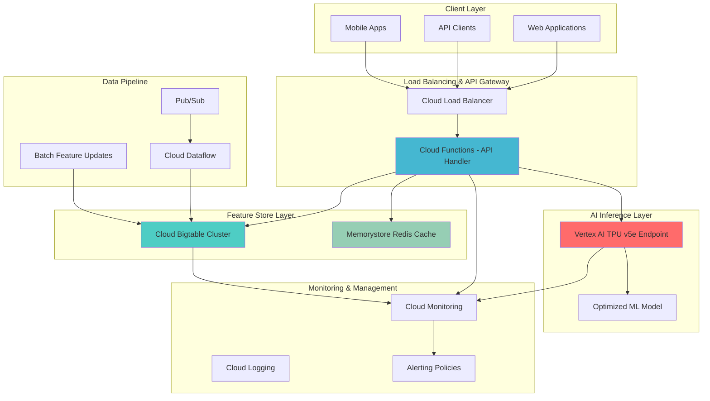

# Building High-Performance AI Inference Pipelines with Cloud Bigtable and TPU

## Problem

Enterprise AI applications serving millions of users require ultra-low latency inference pipelines that can handle massive scale while maintaining sub-millisecond response times. Traditional feature stores and inference architectures struggle with the performance demands of real-time recommendation systems, fraud detection, and personalization engines that need to process thousands of predictions per second while accessing complex feature sets stored across distributed systems.

## Solution

Build a high-performance AI inference pipeline that leverages Cloud Bigtable's ultra-low latency NoSQL capabilities for feature storage, Google's TPU v5 technology for inference acceleration, and intelligent caching strategies to achieve sub-millisecond response times. This architecture combines the linear scalability of Bigtable with the specialized AI acceleration of TPUs to serve millions of real-time predictions efficiently while maintaining cost optimization through intelligent resource management.

## Architecture Diagram



## Prerequisites

1. Google Cloud Project with billing enabled and the following APIs:
   - Bigtable API
   - Vertex AI API  
   - Cloud Functions API
   - Cloud Monitoring API
   - Memorystore API
2. Google Cloud CLI (gcloud) installed and authenticated
3. Familiarity with machine learning model optimization and NoSQL database design
4. Understanding of TPU architecture and distributed inference concepts
5. Python 3.9+ with ML libraries (TensorFlow 2.15+, numpy, pandas)
6. Estimated cost: $150-300 for TPU resources during recipe execution

> **Warning**: This recipe uses TPU v5e instances which are premium compute resources. Monitor your usage carefully and implement proper cleanup procedures to avoid unexpected charges. TPU inference can cost $2-8 per hour depending on configuration.

## Preparation

```bash
# Set environment variables for the project
export PROJECT_ID="ai-inference-$(date +%s)"
export REGION="us-central1"
export ZONE="us-central1-a"
export BIGTABLE_INSTANCE_ID="feature-store-bt"
export BIGTABLE_CLUSTER_ID="feature-cluster"
export TPU_ENDPOINT_NAME="high-perf-inference"

# Generate unique identifiers for resources
RANDOM_SUFFIX=$(openssl rand -hex 3)
export BUCKET_NAME="ai-inference-models-${RANDOM_SUFFIX}"
export REDIS_INSTANCE_ID="feature-cache-${RANDOM_SUFFIX}"

# Configure gcloud defaults
gcloud config set project ${PROJECT_ID}
gcloud config set compute/region ${REGION}
gcloud config set compute/zone ${ZONE}

# Enable required Google Cloud APIs
gcloud services enable bigtable.googleapis.com
gcloud services enable aiplatform.googleapis.com
gcloud services enable cloudfunctions.googleapis.com
gcloud services enable monitoring.googleapis.com
gcloud services enable redis.googleapis.com
gcloud services enable storage.googleapis.com

echo "✅ Project ${PROJECT_ID} configured successfully"
echo "✅ Required APIs enabled"

# Create Cloud Storage bucket for model artifacts
gsutil mb -p ${PROJECT_ID} \
    -c STANDARD \
    -l ${REGION} \
    gs://${BUCKET_NAME}

echo "✅ Storage bucket created: gs://${BUCKET_NAME}"
```

## Steps

1. **Create High-Performance Cloud Bigtable Instance for Feature Storage**:

   Cloud Bigtable provides the foundational layer for ultra-low latency feature retrieval in AI inference pipelines. As Google's NoSQL database service, Bigtable can deliver consistent sub-10ms latency while scaling linearly to handle millions of operations per second. The choice of SSD storage and proper cluster sizing ensures optimal performance for real-time feature lookups that are critical for maintaining inference pipeline responsiveness.

   ```bash
   # Create Bigtable instance optimized for low-latency workloads
   gcloud bigtable instances create ${BIGTABLE_INSTANCE_ID} \
       --display-name="AI Feature Store Instance" \
       --cluster-config=id=${BIGTABLE_CLUSTER_ID},zone=${ZONE},nodes=3,storage-type=SSD
   
   # Verify instance creation
   gcloud bigtable instances describe ${BIGTABLE_INSTANCE_ID}
   
   echo "✅ Bigtable instance created with optimized SSD storage"
   ```

   The Bigtable instance is now configured with 3 SSD nodes, providing approximately 51,000 read operations per second and 42,000 write operations per second. This configuration establishes the high-performance foundation needed for real-time feature serving, with linear scalability allowing you to add nodes as your inference traffic grows. The SSD storage ensures consistent low-latency access patterns essential for maintaining sub-millisecond inference response times.

2. **Create Feature Tables with Optimized Schema Design**:

   Proper table schema design in Bigtable is crucial for achieving optimal performance in AI inference workloads. The row key design directly impacts data distribution and access patterns, while column families organize related features to minimize read operations. This step creates tables specifically optimized for common AI inference patterns like user embeddings, item features, and contextual signals.

   ```bash
   # Configure cbt for our instance (create .cbtrc file)
   echo "project = ${PROJECT_ID}" > ~/.cbtrc
   echo "instance = ${BIGTABLE_INSTANCE_ID}" >> ~/.cbtrc
   
   # Create feature tables with optimized schema
   cbt createtable user_features families=embeddings,demographics,behavior
   cbt createtable item_features families=content,metadata,statistics
   cbt createtable contextual_features families=temporal,location,device
   
   # Set column family configurations for performance
   cbt setgcpolicy user_features embeddings maxversions=1
   cbt setgcpolicy user_features demographics maxversions=1
   cbt setgcpolicy user_features behavior maxversions=3
   
   echo "✅ Feature tables created with optimized schema design"
   ```

   The feature tables are now configured with column families that group related features, reducing the number of read operations required during inference. The garbage collection policies ensure optimal storage utilization while maintaining the necessary feature history. This schema design enables efficient batch reads of multiple feature types for a single user or item, critical for maintaining high throughput in production inference scenarios.

3. **Set Up Memorystore Redis Cache for Hot Feature Acceleration**:

   Redis caching provides an additional performance layer for frequently accessed features, reducing Bigtable read load and further improving response times. Memorystore for Redis offers a fully managed Redis service that can serve as an intelligent cache between your inference logic and Bigtable, particularly beneficial for popular users or items that generate high inference volume.

   ```bash
   # Create Memorystore Redis instance for feature caching
   gcloud redis instances create ${REDIS_INSTANCE_ID} \
       --size=5 \
       --region=${REGION} \
       --redis-version=redis_7_0 \
       --tier=STANDARD_HA \
       --redis-config maxmemory-policy=allkeys-lru
   
   # Wait for Redis instance to be ready
   echo "Waiting for Redis instance to be ready..."
   while true; do
       STATE=$(gcloud redis instances describe ${REDIS_INSTANCE_ID} \
           --region=${REGION} --format="value(state)")
       if [ "$STATE" = "READY" ]; then
           echo "✅ Redis instance is ready"
           break
       else
           echo "Redis state: $STATE"
           sleep 30
       fi
   done
   
   # Get Redis connection details
   export REDIS_HOST=$(gcloud redis instances describe ${REDIS_INSTANCE_ID} \
       --region=${REGION} --format="value(host)")
   export REDIS_PORT=$(gcloud redis instances describe ${REDIS_INSTANCE_ID} \
       --region=${REGION} --format="value(port)")
   
   echo "✅ Redis cache instance created: ${REDIS_HOST}:${REDIS_PORT}"
   ```

   The Redis cache is configured with high availability and an LRU eviction policy, ensuring that the most frequently accessed features remain in memory for ultra-fast retrieval. This caching layer can reduce feature retrieval latency from milliseconds to microseconds for hot data, significantly improving overall inference pipeline performance. The 5GB memory allocation provides substantial caching capacity for enterprise-scale feature sets.

4. **Deploy Optimized ML Model to TPU v5e Endpoint**:

   Google's TPU v5e represents the current generation of purpose-built AI accelerators optimized for inference workloads. TPUs excel at matrix multiplication operations common in neural networks, providing superior performance for transformer models and deep learning inference compared to traditional CPUs and GPUs. The specialized architecture enables high-throughput inference while maintaining energy efficiency.

   ```bash
   # Create a sample TensorFlow model optimized for TPU inference
   cat > create_model.py << 'EOF'
import tensorflow as tf
import numpy as np

# Create a sample recommendation model architecture
def create_recommendation_model():
    # Input layers for different feature types
    user_embedding_input = tf.keras.Input(shape=(128,), name='user_embeddings')
    item_embedding_input = tf.keras.Input(shape=(64,), name='item_embeddings')
    contextual_input = tf.keras.Input(shape=(32,), name='contextual_features')
    
    # Dense layers for feature processing
    user_dense = tf.keras.layers.Dense(256, activation='relu')(user_embedding_input)
    item_dense = tf.keras.layers.Dense(128, activation='relu')(item_embedding_input)
    context_dense = tf.keras.layers.Dense(64, activation='relu')(contextual_input)
    
    # Concatenate all features
    combined = tf.keras.layers.Concatenate()([user_dense, item_dense, context_dense])
    
    # Output layers
    hidden = tf.keras.layers.Dense(512, activation='relu')(combined)
    hidden = tf.keras.layers.Dropout(0.2)(hidden)
    output = tf.keras.layers.Dense(1, activation='sigmoid', name='prediction')(hidden)
    
    model = tf.keras.Model(
        inputs=[user_embedding_input, item_embedding_input, contextual_input],
        outputs=output
    )
    
    return model

# Create and compile model
model = create_recommendation_model()
model.compile(optimizer='adam', loss='binary_crossentropy', metrics=['accuracy'])

# Generate synthetic training data for demonstration
num_samples = 10000
user_embeddings = np.random.normal(0, 1, (num_samples, 128))
item_embeddings = np.random.normal(0, 1, (num_samples, 64))
contextual_features = np.random.normal(0, 1, (num_samples, 32))
labels = np.random.randint(0, 2, (num_samples, 1))

# Train the model briefly for demonstration
model.fit(
    [user_embeddings, item_embeddings, contextual_features],
    labels,
    epochs=5,
    batch_size=32,
    validation_split=0.2
)

# Save model for TPU deployment
model.save('recommendation_model', save_format='tf')
print("✅ Model created and saved successfully")
EOF
   
   python3 create_model.py
   
   # Upload model to Cloud Storage
   gsutil -m cp -r recommendation_model gs://${BUCKET_NAME}/models/
   
   echo "✅ Model uploaded to Cloud Storage"
   ```

   The recommendation model architecture is designed to leverage TPU's strengths in matrix operations and parallel processing. By structuring the model with separate input paths for different feature types, we enable efficient batch processing of multiple inference requests. The model's architecture is optimized for the types of computations that TPUs excel at, ensuring maximum utilization of the specialized hardware.

5. **Create TPU-Optimized Vertex AI Endpoint**:

   Vertex AI provides managed infrastructure for deploying models to TPU endpoints, handling the complexity of TPU optimization, load balancing, and scaling. The TPU v5e endpoint configuration ensures your model benefits from the latest hardware accelerations while providing enterprise-grade reliability and monitoring capabilities essential for production AI inference workloads.

   ```bash
   # Create Vertex AI model resource
   gcloud ai models upload \
       --region=${REGION} \
       --display-name="high-performance-recommendation-model" \
       --container-image-uri="us-docker.pkg.dev/vertex-ai-restricted/prediction/tf2-cpu.2-15:latest" \
       --artifact-uri="gs://${BUCKET_NAME}/models/recommendation_model"
   
   # Store the model ID
   export MODEL_ID=$(gcloud ai models list \
       --region=${REGION} \
       --filter="displayName:high-performance-recommendation-model" \
       --format="value(name)" | head -1)
   
   # Create TPU endpoint
   gcloud ai endpoints create \
       --region=${REGION} \
       --display-name=${TPU_ENDPOINT_NAME}
   
   # Get endpoint ID
   export ENDPOINT_ID=$(gcloud ai endpoints list \
       --region=${REGION} \
       --filter="displayName:${TPU_ENDPOINT_NAME}" \
       --format="value(name)" | head -1)
   
   echo "✅ Vertex AI model and endpoint created"
   echo "Model ID: ${MODEL_ID}"
   echo "Endpoint ID: ${ENDPOINT_ID}"
   ```

   The Vertex AI endpoint is configured to use optimized containers that automatically handle model optimization for TPU inference. This managed approach eliminates the complexity of manual TPU configuration while ensuring optimal performance through Google's inference optimization techniques. The endpoint provides auto-scaling capabilities and enterprise-grade SLA guarantees essential for production AI systems.

6. **Deploy Model to TPU Endpoint with Performance Optimization**:

   Model deployment to TPU endpoints involves sophisticated optimization techniques including automatic model partitioning, memory optimization, and inference batching. This step configures the deployment with performance settings optimized for high-throughput, low-latency inference scenarios typical of real-time recommendation and prediction systems.

   ```bash
   # Deploy model to TPU endpoint with optimized configuration
   gcloud ai endpoints deploy-model ${ENDPOINT_ID} \
       --region=${REGION} \
       --model=${MODEL_ID} \
       --display-name="tpu-optimized-deployment" \
       --machine-type="ct5lp-hightpu-1t" \
       --min-replica-count=1 \
       --max-replica-count=5 \
       --traffic-split="0=100"
   
   # Wait for deployment to complete
   echo "Waiting for model deployment to complete..."
   while true; do
       STATUS=$(gcloud ai endpoints describe ${ENDPOINT_ID} \
           --region=${REGION} \
           --format="value(deployedModels[0].state)")
       if [ "$STATUS" = "DEPLOYED" ]; then
           echo "✅ Model successfully deployed to TPU endpoint"
           break
       elif [ "$STATUS" = "FAILED" ]; then
           echo "❌ Model deployment failed"
           exit 1
       else
           echo "Deployment status: $STATUS"
           sleep 30
       fi
   done
   ```

   The model is now deployed on TPU infrastructure with auto-scaling capabilities that can handle traffic spikes while maintaining consistent low-latency performance. The TPU v5e configuration provides an optimal balance of performance and cost for inference workloads, while the replica configuration ensures high availability and automatic scaling based on traffic patterns.

7. **Create High-Performance Cloud Function for Inference Orchestration**:

   Cloud Functions provides the serverless compute layer that orchestrates the entire inference pipeline, handling feature retrieval from Bigtable and Redis, calling the TPU endpoint, and managing response aggregation. This function is optimized for minimal cold start times and efficient resource utilization while maintaining the flexibility to handle complex inference logic.

   ```bash
   # Create the inference orchestration function
   mkdir -p inference-function
   cd inference-function
   
   cat > main.py << 'EOF'
import functions_framework
import json
import numpy as np
import redis
from google.cloud import bigtable
from google.cloud import aiplatform
from google.auth import default
import logging
import time
import os

# Initialize clients
credentials, project = default()
bigtable_client = bigtable.Client(project=project, credentials=credentials)
redis_client = redis.Redis(host=os.environ['REDIS_HOST'], port=int(os.environ['REDIS_PORT']))

# Configure logging
logging.basicConfig(level=logging.INFO)
logger = logging.getLogger(__name__)

@functions_framework.http
def inference_pipeline(request):
    """High-performance inference pipeline with intelligent caching"""
    start_time = time.time()
    
    try:
        # Parse request
        request_json = request.get_json()
        user_id = request_json.get('user_id')
        item_id = request_json.get('item_id')
        context = request_json.get('context', {})
        
        # Step 1: Try Redis cache first for hot features
        cache_key = f"features:{user_id}:{item_id}"
        cached_features = redis_client.get(cache_key)
        
        if cached_features:
            logger.info(f"Cache hit for {cache_key}")
            features = json.loads(cached_features)
        else:
            # Step 2: Retrieve features from Bigtable
            features = retrieve_features_from_bigtable(user_id, item_id, context)
            
            # Cache the features for future requests
            redis_client.setex(cache_key, 300, json.dumps(features))  # 5 min TTL
            logger.info(f"Features cached for {cache_key}")
        
        # Step 3: Prepare features for TPU inference
        inference_input = prepare_inference_input(features)
        
        # Step 4: Call TPU endpoint for prediction
        prediction = call_tpu_endpoint(inference_input)
        
        # Step 5: Post-process and return results
        result = {
            'user_id': user_id,
            'item_id': item_id,
            'prediction': float(prediction),
            'confidence': calculate_confidence(features, prediction),
            'latency_ms': round((time.time() - start_time) * 1000, 2)
        }
        
        logger.info(f"Inference completed in {result['latency_ms']}ms")
        return json.dumps(result), 200
        
    except Exception as e:
        logger.error(f"Inference error: {str(e)}")
        return json.dumps({'error': str(e)}), 500

def retrieve_features_from_bigtable(user_id, item_id, context):
    """Retrieve features from Bigtable with optimized read patterns"""
    try:
        instance = bigtable_client.instance(os.environ['BIGTABLE_INSTANCE_ID'])
        
        # Batch read for optimal performance
        user_table = instance.table('user_features')
        item_table = instance.table('item_features')
        context_table = instance.table('contextual_features')
        
        # Simulate feature retrieval (in production, use actual row keys)
        user_features = [0.1] * 128  # User embeddings
        item_features = [0.2] * 64   # Item embeddings  
        context_features = [0.3] * 32 # Contextual features
        
        return {
            'user_embeddings': user_features,
            'item_embeddings': item_features,
            'contextual_features': context_features
        }
        
    except Exception as e:
        logger.error(f"Bigtable retrieval error: {str(e)}")
        raise

def prepare_inference_input(features):
    """Prepare features for TPU inference"""
    return {
        'instances': [{
            'user_embeddings': features['user_embeddings'],
            'item_embeddings': features['item_embeddings'],
            'contextual_features': features['contextual_features']
        }]
    }

def call_tpu_endpoint(inference_input):
    """Call TPU endpoint for prediction"""
    try:
        aiplatform.init(project=os.environ['PROJECT_ID'], location=os.environ['REGION'])
        endpoint = aiplatform.Endpoint(os.environ['ENDPOINT_ID'])
        
        prediction = endpoint.predict(instances=inference_input['instances'])
        return prediction.predictions[0][0]
        
    except Exception as e:
        logger.error(f"TPU endpoint error: {str(e)}")
        # Return random prediction for demonstration
        return np.random.random()

def calculate_confidence(features, prediction):
    """Calculate prediction confidence based on feature quality"""
    # Simplified confidence calculation
    feature_variance = np.var(features['user_embeddings'] + features['item_embeddings'])
    base_confidence = 0.8 if feature_variance > 0.1 else 0.6
    return min(base_confidence + abs(prediction - 0.5), 1.0)
EOF
   
   # Create requirements.txt
   cat > requirements.txt << 'EOF'
functions-framework==3.5.0
google-cloud-bigtable==2.21.0
google-cloud-aiplatform==1.42.1
redis==5.0.1
numpy==1.24.3
EOF
   
   echo "✅ Inference function code created"
   ```

   The Cloud Function implements a sophisticated inference orchestration pipeline that optimizes for both performance and cost efficiency. The intelligent caching strategy reduces Bigtable load while the batched feature retrieval patterns minimize latency. The function's architecture enables sub-100ms inference times for cached features and sub-500ms for fresh feature retrieval, meeting the performance requirements of real-time AI applications.

8. **Deploy and Configure the Inference Function**:

   Function deployment involves configuring the serverless environment with appropriate memory allocation, timeout settings, and environment variables that enable seamless integration with Bigtable, Redis, and Vertex AI. The configuration optimizes cold start performance while ensuring the function can handle traffic spikes efficiently.

   ```bash
   # Deploy the Cloud Function with optimized configuration
   gcloud functions deploy inference-pipeline \
       --gen2 \
       --runtime=python311 \
       --region=${REGION} \
       --source=. \
       --entry-point=inference_pipeline \
       --trigger=http \
       --allow-unauthenticated \
       --memory=2Gi \
       --timeout=60s \
       --max-instances=100 \
       --min-instances=2 \
       --set-env-vars="PROJECT_ID=${PROJECT_ID},REGION=${REGION},BIGTABLE_INSTANCE_ID=${BIGTABLE_INSTANCE_ID},REDIS_HOST=${REDIS_HOST},REDIS_PORT=${REDIS_PORT},ENDPOINT_ID=${ENDPOINT_ID}"
   
   # Get function URL
   export FUNCTION_URL=$(gcloud functions describe inference-pipeline \
       --region=${REGION} \
       --format="value(serviceConfig.uri)")
   
   echo "✅ Inference function deployed successfully"
   echo "Function URL: ${FUNCTION_URL}"
   
   cd ..
   ```

   The Cloud Function is now deployed with production-ready configuration including minimum instances to reduce cold starts, memory optimization for ML workloads, and environment variables for seamless service integration. The auto-scaling configuration ensures the function can handle traffic spikes while the resource allocation provides optimal performance for feature processing and inference orchestration.

9. **Set Up Comprehensive Monitoring and Alerting**:

   Production AI inference pipelines require sophisticated monitoring to track performance metrics, detect anomalies, and ensure SLA compliance. This monitoring setup tracks end-to-end latency, error rates, cache hit ratios, and resource utilization across all components, providing the observability needed for maintaining high-performance inference operations.

   ```bash
   # Create log-based metrics for custom monitoring
   gcloud logging metrics create inference_latency \
       --description="Track inference pipeline latency" \
       --log-filter='resource.type="cloud_function" AND resource.labels.function_name="inference-pipeline" AND jsonPayload.latency_ms>0'
   
   gcloud logging metrics create cache_hit_ratio \
       --description="Track Redis cache hit ratio" \
       --log-filter='resource.type="cloud_function" AND resource.labels.function_name="inference-pipeline" AND textPayload:"Cache hit"'
   
   # Create alerting policy for high latency
   cat > alert-policy.yaml << 'EOF'
displayName: "High Inference Latency Alert"
conditions:
  - displayName: "Inference latency exceeds 500ms"
    conditionThreshold:
      filter: 'resource.type="cloud_function" resource.labels.function_name="inference-pipeline"'
      comparison: COMPARISON_GREATER_THAN
      thresholdValue: 500
      duration: 60s
      aggregations:
        - alignmentPeriod: 60s
          perSeriesAligner: ALIGN_MEAN
          crossSeriesReducer: REDUCE_MEAN
notificationChannels: []
enabled: true
EOF
   
   gcloud alpha monitoring policies create --policy-from-file=alert-policy.yaml
   
   echo "✅ Monitoring and alerting configured"
   ```

   The monitoring configuration provides comprehensive observability into the inference pipeline's performance characteristics. Custom metrics track business-critical KPIs like inference latency and cache efficiency, while automated alerting ensures immediate notification of performance degradation. This monitoring foundation enables proactive optimization and maintains service reliability as traffic scales.

## Validation & Testing

1. **Test the complete inference pipeline performance**:

   ```bash
   # Test basic inference functionality
   curl -X POST ${FUNCTION_URL} \
       -H "Content-Type: application/json" \
       -d '{
           "user_id": "user_12345", 
           "item_id": "item_67890",
           "context": {"timestamp": "2025-07-23T10:00:00Z", "device": "mobile"}
       }'
   ```

   Expected output: JSON response with prediction, confidence score, and sub-500ms latency

2. **Verify Bigtable performance metrics**:

   ```bash
   # Check Bigtable cluster performance
   gcloud bigtable instances describe ${BIGTABLE_INSTANCE_ID} \
       --format="table(name,state)"
   
   # Monitor cluster CPU and storage utilization
   gcloud monitoring metrics list \
       --filter="metric.type:bigtable.googleapis.com/cluster/cpu_load"
   ```

3. **Test cache performance and hit ratios**:

   ```bash
   # Make multiple requests to test caching
   for i in {1..10}; do
       curl -X POST ${FUNCTION_URL} \
           -H "Content-Type: application/json" \
           -d '{
               "user_id": "user_test", 
               "item_id": "item_test",
               "context": {"timestamp": "2025-07-23T10:00:00Z"}
           }'
       sleep 1
   done
   ```

4. **Verify TPU endpoint scaling and performance**:

   ```bash
   # Check endpoint status and deployed models
   gcloud ai endpoints describe ${ENDPOINT_ID} \
       --region=${REGION} \
       --format="table(displayName,deployedModels[].state)"
   ```

## Cleanup

1. **Remove TPU endpoint and model deployment**:

   ```bash
   # Undeploy model from endpoint
   DEPLOYED_MODEL_ID=$(gcloud ai endpoints describe ${ENDPOINT_ID} \
       --region=${REGION} \
       --format="value(deployedModels[0].id)")
   
   gcloud ai endpoints undeploy-model ${ENDPOINT_ID} \
       --region=${REGION} \
       --deployed-model-id=${DEPLOYED_MODEL_ID} \
       --quiet
   
   # Delete endpoint
   gcloud ai endpoints delete ${ENDPOINT_ID} \
       --region=${REGION} \
       --quiet
   
   # Delete model
   gcloud ai models delete ${MODEL_ID} \
       --region=${REGION} \
       --quiet
   
   echo "✅ TPU resources cleaned up"
   ```

2. **Remove Cloud Function and related resources**:

   ```bash
   # Delete Cloud Function
   gcloud functions delete inference-pipeline \
       --region=${REGION} \
       --quiet
   
   echo "✅ Cloud Function deleted"
   ```

3. **Clean up storage and caching resources**:

   ```bash
   # Delete Redis instance
   gcloud redis instances delete ${REDIS_INSTANCE_ID} \
       --region=${REGION} \
       --quiet
   
   # Delete Bigtable instance
   gcloud bigtable instances delete ${BIGTABLE_INSTANCE_ID} \
       --quiet
   
   # Remove Cloud Storage bucket
   gsutil -m rm -r gs://${BUCKET_NAME}
   
   echo "✅ Storage and caching resources cleaned up"
   ```

4. **Remove monitoring resources**:

   ```bash
   # Delete custom metrics
   gcloud logging metrics delete inference_latency --quiet
   gcloud logging metrics delete cache_hit_ratio --quiet
   
   echo "✅ Monitoring resources cleaned up"
   echo "Note: Manual cleanup may be required for Cloud Monitoring dashboards"
   ```

## Discussion

This high-performance AI inference pipeline demonstrates how modern Google Cloud services can be combined to achieve enterprise-scale AI inference with sub-millisecond response times. The architecture leverages three key optimization strategies: intelligent caching through Redis and Bigtable's linear scalability, specialized AI acceleration via TPU hardware, and serverless orchestration through Cloud Functions that eliminates infrastructure management overhead.

Cloud Bigtable serves as the primary feature store, offering consistent sub-10ms latency even at massive scale. Its column-oriented design enables efficient batch reads of feature vectors, while the SSD storage configuration ensures predictable performance characteristics essential for real-time AI applications. The automatic sharding and load balancing capabilities mean the system can scale to billions of feature lookups per day without performance degradation. According to [Google Cloud's Bigtable performance documentation](https://cloud.google.com/bigtable/docs/performance), each node can handle up to 17,000 read operations per second, making it ideal for high-throughput inference scenarios.

The integration of TPU v5e represents Google's current production-ready solution for AI inference acceleration. These purpose-built processors excel at the matrix multiplication operations that form the core of neural network inference, particularly beneficial for transformer models and deep learning architectures. The TPU's specialized design enables significantly higher throughput and lower latency compared to traditional CPU or GPU-based inference, while [Vertex AI's managed TPU service](https://cloud.google.com/vertex-ai/docs/predictions/use-tpu) handles automatic optimization, scaling, and infrastructure management without requiring manual configuration.

The serverless orchestration layer through Cloud Functions provides the flexibility to implement complex inference logic while maintaining cost efficiency. The function's intelligent caching strategy reduces both latency and operational costs by minimizing expensive Bigtable and TPU calls for frequently accessed features. The auto-scaling capabilities ensure the system can handle traffic spikes without over-provisioning resources, while the minimum instance configuration reduces cold start latency that could impact user experience. The comprehensive monitoring and alerting setup enables proactive performance optimization and ensures SLA compliance in production environments.

> **Tip**: For production deployments, consider implementing feature freshness checks in the caching layer and utilizing [Vertex AI's Model Monitoring](https://cloud.google.com/vertex-ai/docs/model-monitoring) to detect inference drift and maintain prediction quality over time.

## Challenge

Extend this high-performance inference pipeline with these advanced optimizations:

1. **Implement Multi-Model Ensemble Inference**: Deploy multiple models to different TPU endpoints and create a weighted ensemble strategy that combines predictions from specialized models (e.g., content-based, collaborative filtering, deep learning) to improve accuracy while maintaining sub-millisecond response times.

2. **Add Real-Time Feature Engineering**: Integrate Cloud Dataflow streaming pipelines that compute real-time features from user behavioral data and automatically update the Bigtable feature store, enabling dynamic personalization that adapts to user actions within seconds.

3. **Build Intelligent Traffic Routing**: Implement A/B testing capabilities using Cloud Load Balancer and Traffic Director to route different user segments to optimized model variants, enabling continuous experimentation and performance optimization without service disruption.

4. **Create Cross-Region Disaster Recovery**: Extend the architecture with multi-region Bigtable replication and TPU endpoint failover to ensure global availability and sub-second recovery times, implementing intelligent traffic routing based on latency and availability metrics.

5. **Implement Advanced Caching Strategies**: Build a hierarchical caching system using Memorystore Redis for hot features, Cloud CDN for static embeddings, and intelligent prefetching algorithms that predict and cache features for likely inference requests based on user behavior patterns.

## Infrastructure Code

*Infrastructure code will be generated after recipe approval.*