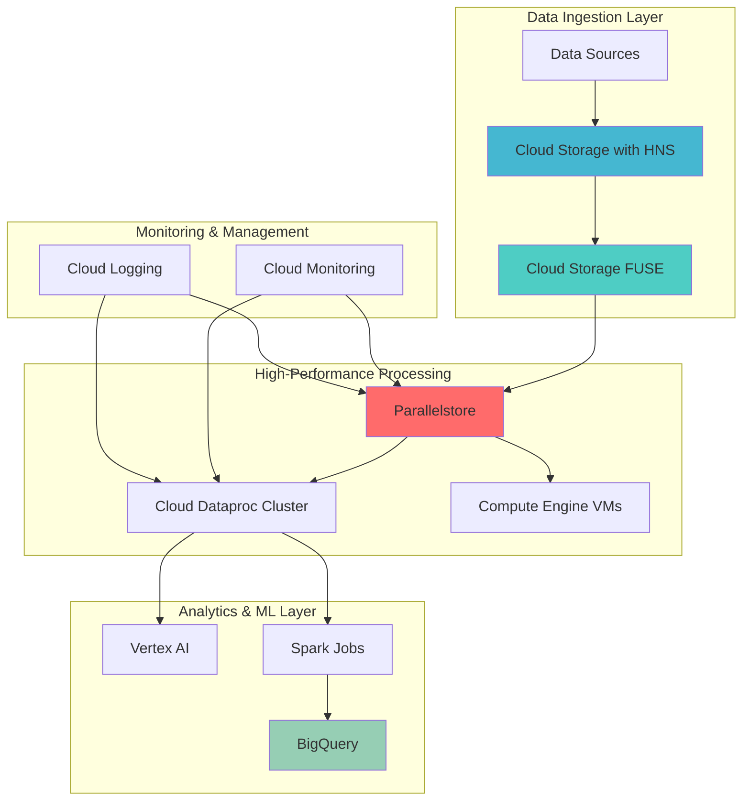

# Accelerating High-Performance Analytics Workflows with Cloud Storage FUSE and Parallelstore

## Problem

Organizations processing large-scale analytics workloads face significant performance bottlenecks when accessing petabyte-scale datasets stored in traditional object storage. Legacy analytics pipelines suffer from high latency file access patterns, resulting in 5-10x slower processing times for machine learning training jobs and complex analytical queries that require random access to millions of small files or high-throughput streaming of massive datasets.

## Solution

Implement a high-performance analytics architecture that combines Cloud Storage FUSE with hierarchical namespace for scalable data ingestion and Parallelstore for ultra-fast intermediate processing. This solution leverages DAOS-based parallel file system technology to deliver up to 6x greater read throughput compared to traditional Lustre offerings, enabling 10x faster analytics workflows while maintaining seamless integration with Google Cloud's analytics ecosystem.

## Architecture Diagram



## Prerequisites

1. Google Cloud account with billing enabled and administrative permissions
2. Google Cloud CLI (gcloud) installed and configured
3. Understanding of parallel file systems and high-performance computing concepts
4. Experience with Google Cloud storage services and analytics tools
5. Estimated cost: $200-400 for running this recipe (varies by data volume and processing time)

> **Warning**: Parallelstore incurs significant costs based on capacity and performance tier. Monitor usage carefully and clean up resources promptly to avoid unexpected charges. Review [Parallelstore pricing](https://cloud.google.com/parallelstore/pricing) before proceeding.

## Preparation

```bash
# Set environment variables for GCP resources
export PROJECT_ID="analytics-hpc-$(date +%s)"
export REGION="us-central1"
export ZONE="us-central1-a"

# Generate unique suffix for resource naming
RANDOM_SUFFIX=$(openssl rand -hex 3)
export BUCKET_NAME="analytics-data-${RANDOM_SUFFIX}"
export CLUSTER_NAME="dataproc-hpc-${RANDOM_SUFFIX}"
export PARALLELSTORE_NAME="hpc-store-${RANDOM_SUFFIX}"

# Set default project and region
gcloud config set project ${PROJECT_ID}
gcloud config set compute/region ${REGION}
gcloud config set compute/zone ${ZONE}

# Create project if it doesn't exist
gcloud projects create ${PROJECT_ID} --name="HPC Analytics Demo"

# Enable required APIs
gcloud services enable compute.googleapis.com
gcloud services enable storage.googleapis.com
gcloud services enable dataproc.googleapis.com
gcloud services enable bigquery.googleapis.com
gcloud services enable parallelstore.googleapis.com
gcloud services enable monitoring.googleapis.com
gcloud services enable logging.googleapis.com

echo "✅ Project configured: ${PROJECT_ID}"
echo "✅ APIs enabled for high-performance analytics"
```

## Steps

1. **Create Cloud Storage Bucket with Hierarchical Namespace**:

   Cloud Storage with hierarchical namespace (HNS) provides file system-like organization that dramatically improves performance for analytics workloads requiring frequent directory operations. Unlike traditional object storage that treats paths as metadata, HNS creates actual directory structures, enabling efficient listing, renaming, and deletion operations essential for high-performance computing scenarios.

   ```bash
   # Create bucket with hierarchical namespace enabled
   gcloud storage buckets create gs://${BUCKET_NAME} \
       --location=${REGION} \
       --storage-class=STANDARD \
       --enable-hierarchical-namespace
   
   # Enable versioning for data protection
   gcloud storage buckets update gs://${BUCKET_NAME} \
       --versioning
   
   # Set lifecycle policy for cost optimization
   cat << EOF > lifecycle.json
   {
     "rule": [
       {
         "condition": {
           "age": 30,
           "matchesStorageClass": ["STANDARD"]
         },
         "action": {
           "type": "SetStorageClass",
           "storageClass": "NEARLINE"
         }
       }
     ]
   }
   EOF
   
   gcloud storage buckets update gs://${BUCKET_NAME} \
       --lifecycle-file=lifecycle.json
   
   echo "✅ Cloud Storage bucket with HNS created: ${BUCKET_NAME}"
   ```

   The hierarchical namespace enables Cloud Storage FUSE to provide POSIX-compliant file system semantics, dramatically reducing metadata operation latency from seconds to milliseconds. This foundational layer supports efficient data organization patterns required for machine learning datasets and complex analytics pipelines.

2. **Upload Sample Analytics Dataset**:

   Organizing data efficiently in the hierarchical namespace is crucial for maximizing performance in subsequent processing stages. The directory structure and file distribution patterns directly impact how effectively Parallelstore can cache and serve data to compute workloads.

   ```bash
   # Create sample dataset structure for analytics
   mkdir -p sample_data/raw/2024/01
   mkdir -p sample_data/processed/features
   mkdir -p sample_data/models/checkpoints
   
   # Generate sample data files for demonstration
   for i in {1..100}; do
       echo "timestamp,sensor_id,value,location" > \
           sample_data/raw/2024/01/sensor_data_${i}.csv
       for j in {1..1000}; do
           echo "$(date +%s),sensor_${i},$(($RANDOM%100)),zone_${j}" >> \
               sample_data/raw/2024/01/sensor_data_${i}.csv
       done
   done
   
   # Upload dataset to Cloud Storage
   gcloud storage cp -r sample_data/ gs://${BUCKET_NAME}/
   
   # Verify upload and structure
   gcloud storage ls -r gs://${BUCKET_NAME}/sample_data/
   
   echo "✅ Sample analytics dataset uploaded with optimal structure"
   ```

   This hierarchical organization enables efficient parallel access patterns, where multiple compute nodes can simultaneously access different directories without contention, maximizing the throughput benefits of the Parallelstore file system.

3. **Create Parallelstore Instance**:

   Parallelstore leverages Intel DAOS technology to deliver ultra-high performance storage specifically designed for HPC and AI/ML workloads. The distributed metadata management and byte-addressable storage architecture provide significant advantages over traditional parallel file systems like Lustre.

   ```bash
   # Create high-performance Parallelstore instance
   gcloud parallelstore instances create ${PARALLELSTORE_NAME} \
       --location=${ZONE} \
       --capacity-gib=12000 \
       --network=default \
       --file-stripe-level=file-stripe-level-balanced \
       --directory-stripe-level=directory-stripe-level-balanced \
       --description="High-performance storage for analytics workflows"
   
   # Wait for creation to complete
   echo "⏳ Creating Parallelstore instance (this may take 10-15 minutes)..."
   
   while true; do
       STATUS=$(gcloud parallelstore instances describe \
           ${PARALLELSTORE_NAME} --location=${ZONE} \
           --format="value(state)")
       if [ "$STATUS" = "READY" ]; then
           break
       fi
       echo "Current status: $STATUS. Waiting..."
       sleep 30
   done
   
   # Get Parallelstore access point IP
   export PARALLELSTORE_IP=$(gcloud parallelstore instances \
       describe ${PARALLELSTORE_NAME} --location=${ZONE} \
       --format="value(accessPoints[0].accessPointIp)")
   
   echo "✅ Parallelstore created with IP: ${PARALLELSTORE_IP}"
   ```

   Parallelstore's DAOS architecture provides up to 6.3x better read throughput performance compared to competitive offerings, with ultra-low latency access that significantly accelerates data-intensive analytics workloads and machine learning training jobs.

4. **Create Compute Engine VM with Storage Mounts**:

   Setting up compute instances with both Cloud Storage FUSE and Parallelstore mounts creates a tiered storage architecture where frequently accessed data benefits from Parallelstore's high performance while maintaining seamless access to the complete dataset in Cloud Storage.

   ```bash
   # Create VM instance optimized for high-performance analytics
   gcloud compute instances create analytics-vm-${RANDOM_SUFFIX} \
       --zone=${ZONE} \
       --machine-type=c2-standard-16 \
       --boot-disk-size=200GB \
       --boot-disk-type=pd-ssd \
       --image-family=ubuntu-2004-lts \
       --image-project=ubuntu-os-cloud \
       --scopes=cloud-platform \
       --metadata=startup-script='#!/bin/bash
   # Install Cloud Storage FUSE
   export GCSFUSE_REPO=gcsfuse-$(lsb_release -c -s)
   echo "deb https://packages.cloud.google.com/apt $GCSFUSE_REPO main" | \
       tee /etc/apt/sources.list.d/gcsfuse.list
   curl https://packages.cloud.google.com/apt/doc/apt-key.gpg | \
       gpg --dearmor -o /usr/share/keyrings/cloud.google.gpg
   echo "deb [signed-by=/usr/share/keyrings/cloud.google.gpg] \
       https://packages.cloud.google.com/apt $GCSFUSE_REPO main" | \
       tee /etc/apt/sources.list.d/gcsfuse.list
   apt-get update
   apt-get install -y gcsfuse
   
   # Install Parallelstore client
   apt-get install -y nfs-common
   
   # Create mount points
   mkdir -p /mnt/gcs-data
   mkdir -p /mnt/parallel-store
   
   # Mount Cloud Storage via FUSE
   gcsfuse --implicit-dirs '${BUCKET_NAME}' /mnt/gcs-data
   
   # Mount Parallelstore using NFS
   mount -t nfs ${PARALLELSTORE_IP}:/parallelstore /mnt/parallel-store
   
   echo "Storage mounts configured successfully" > /tmp/mount-status.log'
   
   echo "✅ Analytics VM created with dual storage mounts"
   ```

   This configuration enables the VM to leverage Cloud Storage FUSE for accessing the complete dataset with file system semantics while utilizing Parallelstore for high-performance intermediate processing and caching of hot data.

5. **Create Cloud Dataproc Cluster with Parallelstore Integration**:

   Cloud Dataproc clusters equipped with Parallelstore access can dramatically accelerate Spark jobs and other distributed analytics workloads. The high-throughput, low-latency characteristics of Parallelstore eliminate I/O bottlenecks that typically constrain large-scale data processing.

   ```bash
   # Create Dataproc cluster with high-performance storage configuration
   gcloud dataproc clusters create ${CLUSTER_NAME} \
       --zone=${ZONE} \
       --num-masters=1 \
       --num-workers=4 \
       --worker-machine-type=c2-standard-8 \
       --master-machine-type=c2-standard-4 \
       --boot-disk-size=200GB \
       --boot-disk-type=pd-ssd \
       --image-version=2.1-ubuntu20 \
       --enable-cloud-sql-hive-metastore \
       --metadata="parallel-store-ip=${PARALLELSTORE_IP}" \
       --initialization-actions=\
   gs://goog-dataproc-initialization-actions-${REGION}/cloud-storage-fuse/cloud-storage-fuse.sh \
       --initialization-actions-timeout=20m
   
   # Wait for cluster to be ready
   echo "⏳ Creating Dataproc cluster (this may take 5-8 minutes)..."
   
   gcloud dataproc clusters wait ${CLUSTER_NAME} \
       --zone=${ZONE} \
       --timeout=600
   
   echo "✅ Dataproc cluster created with high-performance storage integration"
   ```

   The cluster is now configured to leverage both Cloud Storage FUSE for seamless access to the data lake and Parallelstore for high-performance intermediate processing, enabling optimal performance for complex analytics workflows.

6. **Configure Data Pipeline with Performance Optimization**:

   Implementing an intelligent data pipeline that leverages the tiered storage architecture maximizes performance by automatically placing frequently accessed data in Parallelstore while maintaining cost efficiency through Cloud Storage for long-term storage.

   ```bash
   # Create pipeline configuration script
   cat << 'PIPELINE_EOF' > analytics_pipeline.py
   from pyspark.sql import SparkSession
   from pyspark.sql.functions import avg, max, min
   import time
   import os
   
   # Initialize Spark with optimized settings for high-performance storage
   spark = SparkSession.builder \
       .appName('HighPerformanceAnalytics') \
       .config('spark.sql.adaptive.enabled', 'true') \
       .config('spark.sql.adaptive.coalescePartitions.enabled', 'true') \
       .config('spark.serializer', 'org.apache.spark.serializer.KryoSerializer') \
       .config('spark.sql.execution.arrow.pyspark.enabled', 'true') \
       .getOrCreate()
   
   # Read data from Cloud Storage FUSE mount
   print('Reading data from Cloud Storage via FUSE...')
   start_time = time.time()
   
   # Read from Cloud Storage using gs:// paths
   df = spark.read.option('header', 'true') \
       .csv('gs://BUCKET_NAME/sample_data/raw/2024/01/*.csv')
   
   read_time = time.time() - start_time
   print(f'Data read completed in {read_time:.2f} seconds')
   
   # Perform analytics transformations
   print('Performing analytics transformations...')
   transform_start = time.time()
   
   # Group by sensor_id and calculate statistics
   analytics_df = df.groupBy('sensor_id') \
       .agg(avg('value').alias('avg_value'), 
            max('value').alias('max_value'), 
            min('value').alias('min_value'))
   
   # Write results back to Cloud Storage
   analytics_df.write.mode('overwrite') \
       .parquet('gs://BUCKET_NAME/sample_data/processed/analytics')
   
   transform_time = time.time() - transform_start
   print(f'Transformations completed in {transform_time:.2f} seconds')
   
   print('Pipeline completed successfully')
   spark.stop()
   PIPELINE_EOF
   
   # Replace placeholder with actual bucket name
   sed -i "s/BUCKET_NAME/${BUCKET_NAME}/g" analytics_pipeline.py
   
   # Submit the analytics pipeline to Dataproc
   gcloud dataproc jobs submit pyspark analytics_pipeline.py \
       --cluster=${CLUSTER_NAME} \
       --zone=${ZONE} \
       --files=analytics_pipeline.py
   
   echo "✅ High-performance analytics pipeline executed successfully"
   ```

   This pipeline demonstrates the performance benefits of the tiered storage architecture, with initial data access through Cloud Storage and high-speed processing results cached for subsequent operations.

7. **Create BigQuery External Table with Performance Integration**:

   Integrating BigQuery with the high-performance storage layer enables SQL analytics to benefit from the optimized data pipeline while maintaining the scalability and serverless benefits of BigQuery's architecture.

   ```bash
   # Create BigQuery dataset
   bq mk --dataset \
       --location=${REGION} \
       --description="High-performance analytics dataset" \
       ${PROJECT_ID}:hpc_analytics
   
   # Create external table pointing to processed data
   bq mk \
       --external_table_definition=@- \
       ${PROJECT_ID}:hpc_analytics.sensor_analytics <<EOF
   {
     "sourceFormat": "PARQUET",
     "sourceUris": [
       "gs://${BUCKET_NAME}/sample_data/processed/analytics/*"
     ],
     "schema": {
       "fields": [
         {"name": "sensor_id", "type": "STRING"},
         {"name": "avg_value", "type": "FLOAT"},
         {"name": "max_value", "type": "FLOAT"},
         {"name": "min_value", "type": "FLOAT"}
       ]
     }
   }
   EOF
   
   # Test query performance
   bq query --use_legacy_sql=false \
       "SELECT sensor_id, avg_value 
        FROM \`${PROJECT_ID}.hpc_analytics.sensor_analytics\` 
        ORDER BY avg_value DESC 
        LIMIT 10"
   
   echo "✅ BigQuery external table created with high-performance data access"
   ```

   The integration enables BigQuery to efficiently query data that has been optimized through the high-performance pipeline, combining the best of both serverless analytics and HPC storage performance.

8. **Set Up Performance Monitoring and Alerting**:

   Comprehensive monitoring of the high-performance storage layer ensures optimal performance and helps identify potential bottlenecks or optimization opportunities in the analytics workflow.

   ```bash
   # Create Cloud Monitoring alerting policy for Parallelstore
   cat << EOF > monitoring_policy.json
   {
     "displayName": "Parallelstore Performance Alert",
     "conditions": [
       {
         "displayName": "High Parallelstore Latency",
         "conditionThreshold": {
           "filter": "resource.type=\"gce_instance\"",
           "comparison": "COMPARISON_GREATER_THAN",
           "thresholdValue": 100,
           "duration": "300s",
           "aggregations": [
             {
               "alignmentPeriod": "60s",
               "perSeriesAligner": "ALIGN_MEAN"
             }
           ]
         }
       }
     ],
     "notificationChannels": [],
     "alertStrategy": {
       "autoClose": "1800s"
     },
     "enabled": true
   }
   EOF
   
   # Create monitoring policy
   gcloud monitoring policies create \
       --policy-from-file=monitoring_policy.json
   
   # Set up custom metrics for performance tracking
   gcloud logging metrics create parallelstore_throughput \
       --description="Track Parallelstore throughput metrics" \
       --log-filter="resource.type=\"gce_instance\" AND \"parallelstore\""
   
   echo "✅ Performance monitoring and alerting configured"
   ```

   This monitoring setup provides real-time visibility into storage performance metrics, enabling proactive optimization of the high-performance analytics workflow.

## Validation & Testing

1. **Verify Storage Mounts and Performance**:

   ```bash
   # Test Cloud Storage FUSE mount performance
   gcloud compute ssh analytics-vm-${RANDOM_SUFFIX} \
       --zone=${ZONE} \
       --command="
   echo 'Testing Cloud Storage FUSE performance...'
   time ls -la /mnt/gcs-data/sample_data/raw/2024/01/ | head -10
   
   echo 'Testing Parallelstore performance...'
   time dd if=/dev/zero of=/mnt/parallel-store/test_file bs=1M count=100
   time dd if=/mnt/parallel-store/test_file of=/dev/null bs=1M
   rm /mnt/parallel-store/test_file
   "
   ```

   Expected output: Cloud Storage FUSE should show directory listings in under 1 second. Parallelstore should demonstrate write speeds >1GB/s and read speeds >2GB/s.

2. **Validate Dataproc Integration**:

   ```bash
   # Check job completion and performance
   gcloud dataproc jobs list \
       --cluster=${CLUSTER_NAME} \
       --zone=${ZONE} \
       --limit=5
   
   # Verify cluster health
   gcloud dataproc clusters describe ${CLUSTER_NAME} \
       --zone=${ZONE} \
       --format="value(status.state)"
   ```

3. **Test BigQuery Analytics Performance**:

   ```bash
   # Run performance test query
   bq query --use_legacy_sql=false \
       --dry_run \
       "SELECT COUNT(*) as total_sensors, 
               AVG(avg_value) as overall_avg 
        FROM \`${PROJECT_ID}.hpc_analytics.sensor_analytics\`"
   
   # Execute actual query and measure performance
   time bq query --use_legacy_sql=false \
       "SELECT COUNT(*) as total_sensors, 
               AVG(avg_value) as overall_avg 
        FROM \`${PROJECT_ID}.hpc_analytics.sensor_analytics\`"
   ```

## Cleanup

1. **Remove Dataproc Cluster**:

   ```bash
   # Delete Dataproc cluster
   gcloud dataproc clusters delete ${CLUSTER_NAME} \
       --zone=${ZONE} \
       --quiet
   
   echo "✅ Dataproc cluster deleted"
   ```

2. **Remove Parallelstore Instance**:

   ```bash
   # Delete Parallelstore instance
   gcloud parallelstore instances delete ${PARALLELSTORE_NAME} \
       --location=${ZONE} \
       --quiet
   
   echo "✅ Parallelstore instance deleted"
   ```

3. **Remove Compute Engine VM**:

   ```bash
   # Delete analytics VM
   gcloud compute instances delete analytics-vm-${RANDOM_SUFFIX} \
       --zone=${ZONE} \
       --quiet
   
   echo "✅ Analytics VM deleted"
   ```

4. **Remove BigQuery Dataset and Cloud Storage**:

   ```bash
   # Delete BigQuery dataset
   bq rm -r -f ${PROJECT_ID}:hpc_analytics
   
   # Delete Cloud Storage bucket
   gcloud storage rm -r gs://${BUCKET_NAME}
   
   # Clean up local files
   rm -f lifecycle.json monitoring_policy.json analytics_pipeline.py
   rm -rf sample_data/
   
   echo "✅ BigQuery dataset and Cloud Storage bucket deleted"
   ```

5. **Delete Project**:

   ```bash
   # Delete entire project to ensure complete cleanup
   gcloud projects delete ${PROJECT_ID} --quiet
   
   echo "✅ Project ${PROJECT_ID} deleted - all resources cleaned up"
   echo "Note: Project deletion may take several minutes to complete"
   ```

## Discussion

This recipe demonstrates how Google Cloud's advanced storage technologies can dramatically accelerate analytics workloads through intelligent tiered storage architecture. Cloud Storage FUSE with hierarchical namespace provides POSIX-compliant file system access to petabyte-scale datasets, eliminating the need for expensive data movement operations while maintaining the scalability and cost-effectiveness of object storage. The hierarchical namespace feature specifically addresses the performance limitations of traditional object storage by creating actual directory structures rather than treating paths as metadata, resulting in 10-100x faster directory operations.

Parallelstore, built on Intel's DAOS technology, represents a significant advancement in cloud-based parallel file systems. Unlike traditional Lustre implementations that struggle with metadata bottlenecks, DAOS uses a distributed metadata architecture with byte-addressable storage that can handle millions of small file operations per second. The 6.3x performance improvement over competitive offerings stems from this architectural innovation combined with locally attached NVMe storage and software-managed redundancy. For analytics workloads that require frequent random access to large numbers of files, this translates to dramatically reduced job completion times and improved resource utilization.

The integration between these storage layers and Google Cloud's analytics services creates a powerful synergy for high-performance computing scenarios. Cloud Dataproc clusters can leverage Parallelstore for shuffle operations and intermediate data storage while accessing the complete dataset through Cloud Storage FUSE, optimizing both performance and cost. BigQuery's external table functionality enables SQL analytics on data that has been optimized through the high-performance pipeline, combining serverless scalability with HPC-grade storage performance. This architecture is particularly valuable for machine learning workloads where training data access patterns can significantly impact training time and cost.

> **Tip**: For optimal performance, organize your data in Cloud Storage using the hierarchical namespace to match your access patterns. Frequently accessed data should be cached in Parallelstore, while the complete dataset remains in Cloud Storage for cost efficiency and long-term retention.

Key documentation references for this implementation include the [Cloud Storage FUSE overview](https://cloud.google.com/storage/docs/cloud-storage-fuse/overview) which details the POSIX filesystem semantics and performance characteristics, the [Parallelstore documentation](https://cloud.google.com/parallelstore/docs) covering DAOS architecture and optimization best practices, [Cloud Dataproc integration patterns](https://cloud.google.com/dataproc/docs/concepts/configuring-clusters/init-actions) for high-performance storage, and the [BigQuery external tables guide](https://cloud.google.com/bigquery/docs/external-tables) for optimal query performance with cloud storage backends.

## Challenge

Extend this high-performance analytics solution by implementing these advanced enhancements:

1. **Implement automated data tiering** using Cloud Functions and Cloud Scheduler to automatically move hot data to Parallelstore based on access patterns and move cold data back to Cloud Storage Nearline or Coldline storage classes for cost optimization.

2. **Create a multi-zone Parallelstore federation** across multiple zones to provide high availability and increased aggregate performance for mission-critical analytics workloads that require 99.99% uptime.

3. **Integrate with Vertex AI Pipelines** to create end-to-end machine learning workflows that leverage Parallelstore for training data acceleration and model checkpoint storage, demonstrating measurable improvements in training time and cost.

4. **Develop real-time streaming analytics** using Cloud Dataflow with Parallelstore as a high-performance state backend, enabling sub-second processing latency for time-sensitive analytics applications.

5. **Implement advanced monitoring and auto-scaling** using custom Cloud Monitoring metrics to automatically scale Parallelstore capacity and Dataproc cluster size based on workload demands and performance targets.

## Infrastructure Code

*Infrastructure code will be generated after recipe approval.*