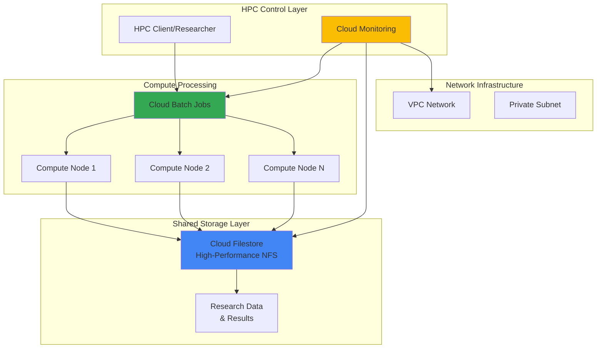

# Building High-Performance Computing Workloads with Cloud Filestore and Cloud Batch

## Problem

Research institutions and enterprise organizations running scientific computing, financial modeling, and data processing workloads face significant challenges in provisioning scalable compute infrastructure with high-performance shared storage. Traditional on-premises HPC clusters require substantial upfront investment, complex maintenance, and struggle to handle variable workload demands efficiently. Manual resource provisioning leads to underutilized infrastructure during low-demand periods and resource contention during peak computational requirements, resulting in delayed research outcomes and inefficient cost structures.

## Solution

Build a scalable HPC environment using Google Cloud Filestore for high-performance shared storage and Cloud Batch for automated compute resource provisioning. This solution automatically scales compute resources based on job queue demands while providing consistent, high-throughput access to shared datasets through NFS-compatible storage. Cloud Monitoring provides intelligent observability for cost optimization and performance tuning, creating a cost-effective HPC platform that adapts to varying computational workloads.

## Architecture Diagram



## Prerequisites

1. Google Cloud Platform account with compute and storage permissions (Compute Admin, Storage Admin, Filestore Admin)
2. Google Cloud CLI installed and configured (or Cloud Shell access)
3. Basic understanding of HPC workloads, NFS file systems, and batch processing concepts
4. Knowledge of Linux command line and shell scripting for job submission
5. Estimated cost: $50-150 for testing (varies by compute duration and storage capacity)

> **Note**: This configuration follows Google Cloud HPC best practices and architecture patterns. Ensure proper IAM permissions are configured before proceeding with resource provisioning.

## Preparation

```bash
# Set environment variables for GCP resources
export PROJECT_ID="hpc-project-$(date +%s)"
export REGION="us-central1"
export ZONE="us-central1-a"

# Generate unique suffix for resource names
RANDOM_SUFFIX=$(openssl rand -hex 3)
export FILESTORE_NAME="hpc-storage-${RANDOM_SUFFIX}"
export BATCH_JOB_NAME="hpc-simulation-${RANDOM_SUFFIX}"
export VPC_NAME="hpc-network-${RANDOM_SUFFIX}"
export SUBNET_NAME="hpc-subnet-${RANDOM_SUFFIX}"

# Set default project and region
gcloud config set project ${PROJECT_ID}
gcloud config set compute/region ${REGION}
gcloud config set compute/zone ${ZONE}

# Enable required APIs for HPC workloads
gcloud services enable compute.googleapis.com
gcloud services enable file.googleapis.com
gcloud services enable batch.googleapis.com
gcloud services enable monitoring.googleapis.com
gcloud services enable logging.googleapis.com

echo "✅ Project configured: ${PROJECT_ID}"
echo "✅ HPC environment variables set for region: ${REGION}"
```

## Steps

1. **Create VPC Network for HPC Infrastructure**:

   A dedicated VPC network provides the foundational networking layer for HPC workloads, enabling secure communication between compute nodes and storage systems. The private subnet configuration ensures optimal network performance while maintaining security isolation for sensitive computational data and research workloads.

   ```bash
   # Create VPC network for HPC cluster
   gcloud compute networks create ${VPC_NAME} \
       --subnet-mode regional \
       --bgp-routing-mode regional
   
   # Create subnet with sufficient IP range for scaling
   gcloud compute networks subnets create ${SUBNET_NAME} \
       --network ${VPC_NAME} \
       --range 10.0.0.0/16 \
       --region ${REGION}
   
   # Create firewall rule for internal communication
   gcloud compute firewall-rules create ${VPC_NAME}-allow-internal \
       --network ${VPC_NAME} \
       --allow tcp,udp,icmp \
       --source-ranges 10.0.0.0/16
   
   echo "✅ VPC network created: ${VPC_NAME}"
   echo "✅ Subnet configured with range: 10.0.0.0/16"
   ```

   The VPC network now provides a secure, scalable foundation for the HPC environment with internal communication enabled between compute nodes and storage systems.

2. **Deploy High-Performance Cloud Filestore Instance**:

   Cloud Filestore provides enterprise-grade NFS storage optimized for HPC workloads, delivering consistent low-latency access to shared datasets across compute nodes. The ENTERPRISE tier configuration ensures optimal throughput and IOPS performance for data-intensive scientific computations and parallel processing workflows.

   ```bash
   # Create high-performance Filestore instance
   gcloud filestore instances create ${FILESTORE_NAME} \
       --location ${ZONE} \
       --tier ENTERPRISE \
       --file-share name="hpc_data",capacity=2560GB \
       --network name=${VPC_NAME}
   
   # Wait for Filestore instance to become ready
   echo "Waiting for Filestore instance to be ready..."
   while true; do
       STATE=$(gcloud filestore instances describe ${FILESTORE_NAME} \
           --location ${ZONE} \
           --format="value(state)")
       echo "Current state: ${STATE}"
       if [ "$STATE" = "READY" ]; then
           break
       fi
       sleep 30
   done
   
   # Get Filestore IP address for mounting
   export FILESTORE_IP=$(gcloud filestore instances describe ${FILESTORE_NAME} \
       --location ${ZONE} \
       --format="value(networks[0].ipAddresses[0])")
   
   echo "✅ Filestore instance ready at IP: ${FILESTORE_IP}"
   echo "✅ Enterprise-tier storage with 2.56TB capacity configured"
   ```

   The Cloud Filestore instance now provides high-performance shared storage accessible via NFS, ready to support concurrent access from multiple compute nodes with enterprise-grade reliability and performance.

3. **Create Cloud Batch Job Template for HPC Workloads**:

   Cloud Batch provides fully managed job scheduling and resource provisioning for HPC workloads, automatically scaling compute resources based on queue demands. The job template defines compute specifications, storage mounting, and job execution parameters optimized for scientific computing and parallel processing tasks.

   ```bash
   # Create job configuration file for HPC simulation
   cat > hpc-job-config.json << EOF
   {
     "taskGroups": [
       {
         "taskSpec": {
           "runnables": [
             {
               "script": {
                 "text": "#!/bin/bash\necho 'Starting HPC simulation job'\nmkdir -p /mnt/hpc_data/results\necho 'Job ID: '\$BATCH_TASK_INDEX > /mnt/hpc_data/results/job_\$BATCH_TASK_INDEX.log\necho 'Running scientific computation simulation...'\nsleep 60\necho 'Simulation completed successfully' >> /mnt/hpc_data/results/job_\$BATCH_TASK_INDEX.log\necho 'HPC job finished'"
               }
             }
           ],
           "computeResource": {
             "cpuMilli": 2000,
             "memoryMib": 4096
           },
           "maxRetryCount": 2,
           "maxRunDuration": "600s",
           "volumes": [
             {
               "nfs": {
                 "server": "${FILESTORE_IP}",
                 "remotePath": "/hpc_data"
               },
               "mountPath": "/mnt/hpc_data"
             }
           ]
         },
         "taskCount": 4,
         "parallelism": 2
       }
     ],
     "allocationPolicy": {
       "instances": [
         {
           "instanceTemplate": {
             "machineType": "e2-standard-2"
           }
         }
       ],
       "location": {
         "allowedLocations": ["zones/${ZONE}"]
       },
       "network": {
         "networkInterfaces": [
           {
             "network": "projects/${PROJECT_ID}/global/networks/${VPC_NAME}",
             "subnetwork": "projects/${PROJECT_ID}/regions/${REGION}/subnetworks/${SUBNET_NAME}"
           }
         ]
       }
     },
     "logsPolicy": {
       "destination": "CLOUD_LOGGING"
     }
   }
   EOF
   
   echo "✅ Batch job configuration created for HPC workloads"
   echo "✅ Job template configured with Filestore mounting at /mnt/hpc_data"
   ```

   The job configuration template now defines the compute requirements, storage mounting, and execution parameters for HPC workloads, ready for submission to Cloud Batch for automated resource provisioning and job execution.

4. **Submit and Execute HPC Batch Job**:

   Submitting the HPC job to Cloud Batch initiates automatic resource provisioning and job execution across multiple compute nodes. The batch service handles VM creation, storage mounting, job distribution, and resource cleanup, providing a fully managed HPC execution environment with built-in retry logic and error handling.

   ```bash
   # Submit HPC job to Cloud Batch
   gcloud batch jobs submit ${BATCH_JOB_NAME} \
       --location ${REGION} \
       --config hpc-job-config.json
   
   # Monitor job status
   echo "Monitoring job execution status..."
   gcloud batch jobs describe ${BATCH_JOB_NAME} \
       --location ${REGION} \
       --format="value(status.state)"
   
   # Wait for job completion
   echo "Waiting for job completion..."
   while true; do
       JOB_STATE=$(gcloud batch jobs describe ${BATCH_JOB_NAME} \
           --location ${REGION} \
           --format="value(status.state)")
       echo "Current job state: ${JOB_STATE}"
       if [ "$JOB_STATE" = "SUCCEEDED" ] || [ "$JOB_STATE" = "FAILED" ]; then
           break
       fi
       sleep 30
   done
   
   echo "✅ HPC batch job submitted: ${BATCH_JOB_NAME}"
   echo "✅ Job execution initiated across multiple compute nodes"
   ```

   The batch job is now executing across provisioned compute nodes with shared access to Filestore storage, demonstrating the scalable HPC execution environment with automatic resource management and monitoring capabilities.

5. **Configure Cloud Monitoring for HPC Performance Tracking**:

   Cloud Monitoring provides comprehensive observability for HPC workloads, tracking compute utilization, storage performance, and job execution metrics. Setting up custom dashboards and alerts enables proactive optimization of resource allocation and early detection of performance bottlenecks in computational workflows.

   ```bash
   # Create alert policy for failed batch jobs
   cat > alert-policy.json << EOF
   {
     "displayName": "HPC Job Failure Alert",
     "documentation": {
       "content": "Alert when HPC batch jobs fail",
       "mimeType": "text/markdown"
     },
     "conditions": [
       {
         "displayName": "Batch job failure condition",
         "conditionThreshold": {
           "filter": "resource.type=\"batch_job\" AND metric.type=\"logging.googleapis.com/log_entry_count\"",
           "comparison": "COMPARISON_GREATER_THAN",
           "thresholdValue": 0
         }
       }
     ],
     "alertStrategy": {
       "autoClose": "86400s"
     },
     "enabled": true
   }
   EOF
   
   # Create alert policy for monitoring
   gcloud alpha monitoring policies create --policy-from-file=alert-policy.json
   
   echo "✅ Cloud Monitoring configured for HPC workloads"
   echo "✅ Alert policies set up for batch job failure detection"
   ```

   Cloud Monitoring is now configured to provide comprehensive observability for the HPC environment, enabling performance optimization and proactive issue detection across compute and storage resources.

6. **Set Up Automated Resource Scaling Configuration**:

   Configuring automated scaling policies ensures optimal resource utilization for varying HPC workload demands. The scaling configuration monitors job queue length and resource utilization to automatically provision additional compute capacity during peak demand periods while minimizing costs during low-utilization periods.

   ```bash
   # Create instance template for auto-scaling HPC nodes
   gcloud compute instance-templates create hpc-node-template \
       --machine-type e2-standard-4 \
       --image-family ubuntu-2004-lts \
       --image-project ubuntu-os-cloud \
       --subnet ${SUBNET_NAME} \
       --metadata startup-script='#!/bin/bash
   apt-get update
   apt-get install -y nfs-common
   mkdir -p /mnt/hpc_data
   mount -t nfs '${FILESTORE_IP}':/hpc_data /mnt/hpc_data
   echo "'${FILESTORE_IP}':/hpc_data /mnt/hpc_data nfs defaults 0 0" >> /etc/fstab'
   
   # Create managed instance group for scaling
   gcloud compute instance-groups managed create hpc-compute-group \
       --template hpc-node-template \
       --size 0 \
       --zone ${ZONE}
   
   # Configure autoscaling based on CPU utilization
   gcloud compute instance-groups managed set-autoscaling hpc-compute-group \
       --zone ${ZONE} \
       --max-num-replicas 10 \
       --min-num-replicas 0 \
       --target-cpu-utilization 0.7 \
       --cool-down-period 300
   
   echo "✅ Auto-scaling instance group configured"
   echo "✅ Scaling policy set for 0-10 instances based on CPU utilization"
   ```

   The auto-scaling configuration now provides dynamic resource provisioning capabilities, automatically adjusting compute capacity based on workload demands while maintaining cost efficiency through intelligent scaling policies.

## Validation & Testing

1. Verify Filestore instance and network connectivity:

   ```bash
   # Check Filestore instance status
   gcloud filestore instances describe ${FILESTORE_NAME} \
       --location ${ZONE} \
       --format="table(name,state,tier,networks.ipAddresses[0])"
   
   # Verify network configuration
   gcloud compute networks subnets describe ${SUBNET_NAME} \
       --region ${REGION} \
       --format="value(ipCidrRange,network)"
   ```

   Expected output: Filestore instance showing "READY" state with allocated IP address and subnet showing proper CIDR range configuration.

2. Test batch job execution and results:

   ```bash
   # Check batch job status and task completion
   gcloud batch jobs describe ${BATCH_JOB_NAME} \
       --location ${REGION} \
       --format="table(status.state,status.taskGroups[0].counts)"
   
   # View job logs for execution details
   gcloud logging read "resource.type=\"batch_job\" AND resource.labels.job_id=\"${BATCH_JOB_NAME}\"" \
       --limit=10 \
       --format="value(textPayload)"
   ```

   Expected output: Job status showing "SUCCEEDED" with completed task counts and logs displaying successful job execution and result file creation.

3. Validate storage performance and accessibility:

   ```bash
   # Create test VM to verify Filestore mounting
   gcloud compute instances create hpc-test-vm \
       --zone ${ZONE} \
       --machine-type e2-micro \
       --subnet ${SUBNET_NAME} \
       --metadata startup-script='#!/bin/bash
   apt-get update && apt-get install -y nfs-common
   mkdir -p /mnt/test_storage
   mount -t nfs '${FILESTORE_IP}':/hpc_data /mnt/test_storage
   ls -la /mnt/test_storage/results'
   
   # Wait and check mounting success
   sleep 60
   gcloud compute ssh hpc-test-vm \
       --zone ${ZONE} \
       --command "df -h | grep hpc_data"
   ```

   Expected output: Successful NFS mount showing available storage capacity and accessible result files from batch job execution.

4. Verify monitoring configuration:

   ```bash
   # Check alert policies
   gcloud alpha monitoring policies list \
       --format="table(displayName,enabled,conditions[0].displayName)"
   
   # Verify Cloud Logging for batch jobs
   gcloud logging sinks list \
       --format="table(name,destination,filter)"
   ```

   Expected output: Active alert policies and logging configuration for HPC job monitoring and failure detection.

## Cleanup

1. Remove batch jobs and compute resources:

   ```bash
   # Delete batch job
   gcloud batch jobs delete ${BATCH_JOB_NAME} \
       --location ${REGION} \
       --quiet
   
   # Delete test VM
   gcloud compute instances delete hpc-test-vm \
       --zone ${ZONE} \
       --quiet
   
   # Delete instance group and template
   gcloud compute instance-groups managed delete hpc-compute-group \
       --zone ${ZONE} \
       --quiet
   
   gcloud compute instance-templates delete hpc-node-template \
       --quiet
   
   echo "✅ Compute resources cleaned up"
   ```

2. Remove Filestore instance:

   ```bash
   # Delete Filestore instance
   gcloud filestore instances delete ${FILESTORE_NAME} \
       --location ${ZONE} \
       --quiet
   
   echo "✅ Filestore instance deleted"
   ```

3. Remove networking and monitoring resources:

   ```bash
   # Delete firewall rules
   gcloud compute firewall-rules delete ${VPC_NAME}-allow-internal \
       --quiet
   
   # Delete subnet and VPC
   gcloud compute networks subnets delete ${SUBNET_NAME} \
       --region ${REGION} \
       --quiet
   
   gcloud compute networks delete ${VPC_NAME} \
       --quiet
   
   # Clean up local configuration files
   rm -f hpc-job-config.json alert-policy.json
   
   echo "✅ Network and configuration resources cleaned up"
   echo "Note: Alert policies may need manual deletion from console"
   ```

## Discussion

This HPC solution demonstrates the power of combining Cloud Filestore's high-performance shared storage with Cloud Batch's automated compute provisioning to create a scalable, cost-effective scientific computing environment. The architecture leverages Google Cloud's managed services to eliminate traditional HPC infrastructure management overhead while providing enterprise-grade performance and reliability for demanding computational workloads.

The Cloud Filestore ENTERPRISE tier provides consistent, high-throughput NFS storage that scales seamlessly with compute demands, supporting concurrent access patterns typical in scientific computing, financial modeling, and data processing workflows. The NFS compatibility ensures existing HPC applications can migrate without modification, while the managed service eliminates storage administration complexity. Combined with Cloud Batch's automatic resource provisioning, this creates a truly elastic HPC environment that adapts to varying workload requirements.

The integration of Cloud Monitoring provides essential observability for optimizing HPC performance and costs. By tracking job completion rates, resource utilization patterns, and storage performance metrics, teams can identify bottlenecks, optimize resource allocation, and implement predictive scaling strategies. The automated alerting capabilities ensure rapid response to job failures or performance degradation, maintaining research productivity and computational efficiency.

This architecture particularly excels in scenarios requiring burst computing capabilities, where traditional on-premises clusters would be over-provisioned for peak demands. The pay-per-use model combined with automatic scaling enables organizations to access supercomputing-class resources without the capital expenditure and operational complexity of dedicated HPC infrastructure, democratizing access to high-performance computing capabilities across research institutions and enterprises.

> **Tip**: Use Cloud Monitoring dashboards to analyze job completion patterns and optimize batch job configurations for improved throughput and cost efficiency across different workload types.

For detailed implementation guidance, refer to the [Google Cloud HPC Solutions documentation](https://cloud.google.com/solutions/hpc), [Cloud Filestore best practices guide](https://cloud.google.com/filestore/docs/best-practices), [Cloud Batch optimization strategies](https://cloud.google.com/batch/docs/best-practices), [HPC Toolkit deployment patterns](https://cloud.google.com/cluster-toolkit/docs), and [Google Cloud Architecture Framework for HPC workloads](https://cloud.google.com/architecture/framework).

## Challenge

Extend this HPC solution by implementing these advanced capabilities:

1. **Implement multi-zone HPC cluster deployment** with regional persistent disks and cross-zone load balancing for improved fault tolerance and geographic distribution of computational workloads.

2. **Add GPU-accelerated computing support** using A2 or G2 machine types with NVIDIA drivers and CUDA libraries for machine learning and scientific simulation workloads requiring parallel processing acceleration.

3. **Deploy Slurm workload manager integration** using the HPC Toolkit to provide traditional HPC job scheduling, resource allocation, and user management capabilities familiar to scientific computing teams.

4. **Create automated cost optimization policies** using Cloud Functions and Scheduler to analyze usage patterns, implement intelligent preemptible instance usage, and automatically archive unused datasets to lower-cost storage tiers.

5. **Establish hybrid cloud connectivity** with Cloud VPN or Interconnect to enable burst computing scenarios where on-premises clusters can overflow computational workloads to Google Cloud during peak demand periods.

## Infrastructure Code

### Available Infrastructure as Code:

- [Infrastructure Code Overview](code/README.md) - Detailed description of all infrastructure components
- [Infrastructure Manager](code/infrastructure-manager/) - GCP Infrastructure Manager templates
- [Bash CLI Scripts](code/scripts/) - Example bash scripts using gcloud CLI commands to deploy infrastructure
- [Terraform](code/terraform/) - Terraform configuration files