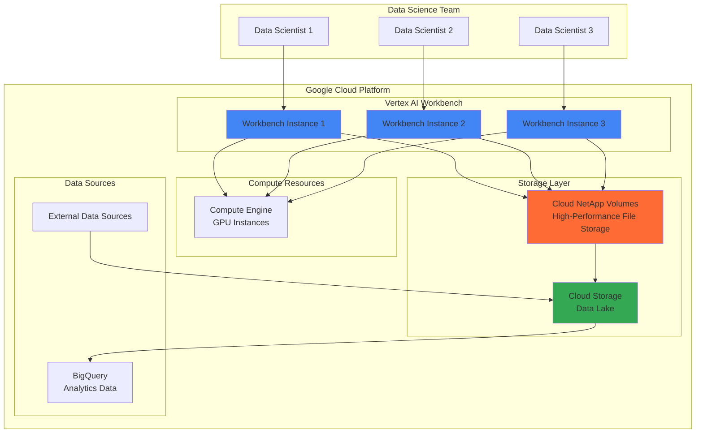

# High-Performance Data Science Workflows with Cloud NetApp Volumes and Vertex AI Workbench

## Problem

Data science teams struggle with performance bottlenecks when working with large datasets, often facing slow data loading times, limited collaborative capabilities, and complex storage management across multiple environments. Traditional cloud storage solutions can't provide the high-throughput, low-latency access needed for iterative machine learning workflows, especially when multiple team members need concurrent access to the same datasets for model training and experimentation.

## Solution

This solution combines Google Cloud NetApp Volumes with Vertex AI Workbench to create a high-performance, collaborative data science environment. Cloud NetApp Volumes provides enterprise-grade file storage with up to 4.5 GiB/sec throughput and sub-millisecond latency, while Vertex AI Workbench offers managed Jupyter notebooks with seamless integration to Google Cloud services, enabling teams to work efficiently on large-scale machine learning projects with shared access to datasets.

## Architecture Diagram



## Prerequisites

1. Google Cloud Platform account with billing enabled and appropriate permissions for Vertex AI, Compute Engine, and NetApp Volumes
2. Google Cloud CLI (gcloud) installed and configured, or access to Google Cloud Shell
3. Basic understanding of Jupyter notebooks and data science workflows
4. Familiarity with file system mounting and Linux commands
5. Estimated cost: $50-150 per day depending on instance types and storage usage (NetApp Volumes: ~$0.35/GB/month, Vertex AI Workbench: ~$0.50/hour for standard instances)

> **Note**: Cloud NetApp Volumes is currently available in select regions. Verify availability in your preferred region before proceeding. See the [Cloud NetApp Volumes documentation](https://cloud.google.com/netapp/volumes/docs) for current regional availability.

## Preparation

```bash
# Set environment variables for Google Cloud resources
export PROJECT_ID="ml-netapp-$(date +%s)"
export REGION="us-central1"
export ZONE="us-central1-a"
export NETWORK_NAME="netapp-ml-network"

# Generate unique suffix for resource names
RANDOM_SUFFIX=$(openssl rand -hex 3)
export STORAGE_POOL_NAME="ml-pool-${RANDOM_SUFFIX}"
export VOLUME_NAME="ml-datasets-${RANDOM_SUFFIX}"
export WORKBENCH_NAME="ml-workbench-${RANDOM_SUFFIX}"

# Set default project and region
gcloud config set project ${PROJECT_ID}
gcloud config set compute/region ${REGION}
gcloud config set compute/zone ${ZONE}

# Enable required Google Cloud APIs
gcloud services enable compute.googleapis.com
gcloud services enable notebooks.googleapis.com
gcloud services enable netapp.googleapis.com
gcloud services enable storage.googleapis.com
gcloud services enable aiplatform.googleapis.com

echo "✅ Project configured: ${PROJECT_ID}"
echo "✅ APIs enabled for NetApp Volumes and Vertex AI Workbench"
```

## Steps

1. **Create VPC Network and Subnet for High-Performance Storage**:

   A dedicated Virtual Private Cloud (VPC) network ensures optimal network performance and security isolation for your data science environment. Cloud NetApp Volumes requires specific network configurations to deliver its high-performance capabilities, including proper subnet sizing and regional placement for minimal latency.

   ```bash
   # Create custom VPC network for optimized performance
   gcloud compute networks create ${NETWORK_NAME} \
       --subnet-mode=custom \
       --description="Network for ML workflows with NetApp storage"
   
   # Create subnet with adequate IP range for scaling
   gcloud compute networks subnets create ${NETWORK_NAME}-subnet \
       --network=${NETWORK_NAME} \
       --range=10.0.0.0/24 \
       --region=${REGION} \
       --description="Subnet for ML instances and NetApp volumes"
   
   echo "✅ VPC network created for high-performance data science workflows"
   ```

   The custom VPC provides the network foundation for low-latency communication between your Vertex AI Workbench instances and Cloud NetApp Volumes. This dedicated network architecture ensures that data transfer doesn't compete with other workloads and maintains consistent performance for your machine learning operations.

2. **Create Cloud NetApp Volumes Storage Pool**:

   Cloud NetApp Volumes storage pools provide the high-performance, shared file storage foundation for your data science workflows. The storage pool acts as a resource container that manages capacity, performance, and security settings across multiple volumes, enabling enterprise-grade features like snapshots, cloning, and data protection.

   ```bash
   # Create NetApp storage pool with high-performance tier
   gcloud netapp storage-pools create ${STORAGE_POOL_NAME} \
       --location=${REGION} \
       --service-level=PREMIUM \
       --capacity-gib=1024 \
       --network=${NETWORK_NAME} \
       --description="High-performance storage pool for ML datasets"
   
   # Wait for storage pool creation to complete
   echo "Waiting for storage pool creation..."
   while [[ $(gcloud netapp storage-pools describe ${STORAGE_POOL_NAME} \
       --location=${REGION} \
       --format="value(state)") != "READY" ]]; do
       echo "Storage pool is provisioning..."
       sleep 30
   done
   
   echo "✅ NetApp storage pool created with premium performance tier"
   ```

   The Premium service level provides up to 64 MiB/s per TiB of throughput, ensuring that large dataset operations and model training workflows can access data without I/O bottlenecks. This performance tier is specifically designed for latency-sensitive applications like machine learning workloads.

3. **Create High-Performance Volume for Dataset Storage**:

   Individual volumes within the storage pool provide the actual file systems that your data science teams will use. Creating a dedicated volume for machine learning datasets ensures proper isolation, enables specific security policies, and allows for optimized performance tuning based on your data access patterns.

   ```bash
   # Create volume for ML datasets with NFS protocol
   gcloud netapp volumes create ${VOLUME_NAME} \
       --location=${REGION} \
       --storage-pool=${STORAGE_POOL_NAME} \
       --capacity-gib=500 \
       --share-name="ml-datasets" \
       --protocols=NFSV3 \
       --unix-permissions=0755 \
       --description="Shared volume for ML datasets and models"
   
   # Wait for volume creation to complete
   echo "Waiting for volume creation..."
   while [[ $(gcloud netapp volumes describe ${VOLUME_NAME} \
       --location=${REGION} \
       --format="value(state)") != "READY" ]]; do
       echo "Volume is provisioning..."
       sleep 30
   done
   
   # Get volume details for mounting
   export VOLUME_IP=$(gcloud netapp volumes describe ${VOLUME_NAME} \
       --location=${REGION} \
       --format="value(mountOptions[0].export)")
   
   export EXPORT_PATH=$(gcloud netapp volumes describe ${VOLUME_NAME} \
       --location=${REGION} \
       --format="value(mountOptions[0].exportFullPath)")
   
   echo "✅ NetApp volume created with IP: ${VOLUME_IP}"
   echo "✅ Export path: ${EXPORT_PATH}"
   ```

   The NFS protocol provides POSIX-compliant file system access, enabling seamless integration with Jupyter notebooks and machine learning frameworks. The shared nature of the volume allows multiple data scientists to collaborate on the same datasets while maintaining data consistency and version control through NetApp's advanced file system features.

4. **Create Vertex AI Workbench Instance with GPU Support**:

   Vertex AI Workbench provides managed Jupyter notebook environments optimized for machine learning workflows. Creating an instance with GPU support enables accelerated model training and data processing, while the managed service handles infrastructure maintenance, security updates, and integration with other Google Cloud services.

   ```bash
   # Create Vertex AI Workbench instance with GPU for ML acceleration
   gcloud notebooks instances create ${WORKBENCH_NAME} \
       --location=${ZONE} \
       --machine-type=n1-standard-4 \
       --accelerator-type=NVIDIA_TESLA_T4 \
       --accelerator-core-count=1 \
       --boot-disk-size=100 \
       --boot-disk-type=pd-ssd \
       --network=${NETWORK_NAME} \
       --subnet=${NETWORK_NAME}-subnet \
       --no-public-ip \
       --metadata="enable-oslogin=true" \
       --vm-image-family=tf-ent-2-11-cu113-notebooks \
       --vm-image-project=deeplearning-platform-release \
       --install-gpu-driver
   
   # Wait for instance to be ready
   echo "Waiting for Workbench instance to be ready..."
   while [[ $(gcloud notebooks instances describe ${WORKBENCH_NAME} \
       --location=${ZONE} \
       --format="value(state)") != "ACTIVE" ]]; do
       echo "Instance is provisioning..."
       sleep 30
   done
   
   echo "✅ Vertex AI Workbench instance created with GPU acceleration"
   ```

   The TensorFlow Enterprise image includes pre-installed machine learning frameworks, CUDA drivers for GPU acceleration, and optimized libraries for high-performance computing. This configuration provides the ideal environment for data science workflows that require both computational power and easy access to shared datasets.

5. **Mount NetApp Volume to Workbench Instance**:

   Mounting the Cloud NetApp Volume to your Vertex AI Workbench instance creates a high-performance shared file system accessible from your Jupyter notebooks. This direct mounting approach eliminates data movement overhead and provides native file system performance for large dataset operations and model artifact storage.

   ```bash
   # Create mount point and mount NetApp volume via SSH
   gcloud compute ssh ${WORKBENCH_NAME} \
       --zone=${ZONE} \
       --command="sudo mkdir -p /mnt/ml-datasets && \
                  sudo mount -t nfs ${VOLUME_IP}:${EXPORT_PATH} /mnt/ml-datasets && \
                  sudo chmod 755 /mnt/ml-datasets && \
                  echo '${VOLUME_IP}:${EXPORT_PATH} /mnt/ml-datasets nfs defaults 0 0' | sudo tee -a /etc/fstab"
   
   # Verify mount was successful
   gcloud compute ssh ${WORKBENCH_NAME} \
       --zone=${ZONE} \
       --command="df -h /mnt/ml-datasets"
   
   echo "✅ NetApp volume mounted to Workbench instance at /mnt/ml-datasets"
   ```

   The mounted volume now provides high-throughput access to shared datasets directly from your Jupyter notebooks. This configuration enables real-time collaboration, as multiple team members can access the same data files simultaneously while benefiting from NetApp's enterprise-grade performance and data protection features.

6. **Create Sample Dataset and Configure Jupyter Environment**:

   Setting up a sample dataset and configuring the Jupyter environment demonstrates the high-performance capabilities of the integrated solution. This step creates the foundation for data science workflows by establishing proper directory structures, sample data, and notebook configurations that leverage the shared storage architecture.

   ```bash
   # Create directory structure and sample dataset
   gcloud compute ssh ${WORKBENCH_NAME} \
       --zone=${ZONE} \
       --command="
           sudo mkdir -p /mnt/ml-datasets/{raw-data,processed-data,models,notebooks} && \
           sudo chown -R jupyter:jupyter /mnt/ml-datasets && \
           cd /mnt/ml-datasets/raw-data && \
           curl -o sample_data.csv 'https://storage.googleapis.com/cloud-samples-data/ai-platform/iris/iris_data.csv'
       "
   
   # Create Jupyter notebook for testing the setup
   gcloud compute ssh ${WORKBENCH_NAME} \
       --zone=${ZONE} \
       --command="
           cat > /mnt/ml-datasets/notebooks/netapp_performance_test.ipynb << 'EOF'
   {
    \"cells\": [
     {
      \"cell_type\": \"code\",
      \"metadata\": {},
      \"source\": [
       \"import pandas as pd\\n\",
       \"import numpy as np\\n\",
       \"import time\\n\",
       \"import os\\n\\n\",
       \"# Test NetApp volume performance\\n\",
       \"data_path = '/mnt/ml-datasets/raw-data/sample_data.csv'\\n\",
       \"print(f'Reading data from NetApp volume: {data_path}')\\n\\n\",
       \"start_time = time.time()\\n\",
       \"df = pd.read_csv(data_path)\\n\",
       \"load_time = time.time() - start_time\\n\\n\",
       \"print(f'Data loaded in {load_time:.4f} seconds')\\n\",
       \"print(f'Dataset shape: {df.shape}')\\n\",
       \"print(f'NetApp volume mount status:')\\n\",
       \"os.system('df -h /mnt/ml-datasets')\"
      ]
     }
    ],
    \"metadata\": {
     \"kernelspec\": {
      \"display_name\": \"Python 3\",
      \"language\": \"python\",
      \"name\": \"python3\"
     }
    },
    \"nbformat\": 4,
    \"nbformat_minor\": 4
   }
   EOF
       "
   
   echo "✅ Sample dataset and Jupyter notebook created on NetApp volume"
   ```

   The shared directory structure enables organized collaboration where data scientists can access raw data, share processed datasets, store trained models, and maintain notebooks in a centralized, high-performance file system. This organization follows data science best practices while leveraging NetApp's advanced storage features.

7. **Configure Cloud Storage Integration for Data Pipeline**:

   Integrating Cloud Storage with your NetApp Volumes creates a comprehensive data pipeline that combines the high-performance access of NetApp with the scalability and cost-effectiveness of object storage. This hybrid approach optimizes both performance and cost by using the right storage tier for different stages of your machine learning workflow.

   ```bash
   # Create Cloud Storage bucket for data lake integration
   export BUCKET_NAME="ml-datalake-${PROJECT_ID}-${RANDOM_SUFFIX}"
   gsutil mb -p ${PROJECT_ID} -c STANDARD -l ${REGION} gs://${BUCKET_NAME}
   
   # Set up data synchronization script
   gcloud compute ssh ${WORKBENCH_NAME} \
       --zone=${ZONE} \
       --command="
           cat > /mnt/ml-datasets/sync_to_storage.py << 'EOF'
   import subprocess
   import os
   
   def sync_models_to_storage():
       '''Sync trained models to Cloud Storage for versioning'''
       bucket_name = '${BUCKET_NAME}'
       local_path = '/mnt/ml-datasets/models/'
       
       if os.path.exists(local_path):
           cmd = f'gsutil -m rsync -r {local_path} gs://{bucket_name}/models/'
           subprocess.run(cmd, shell=True, check=True)
           print(f'Models synced to gs://{bucket_name}/models/')
       else:
           print(f'Local models directory not found: {local_path}')
   
   if __name__ == '__main__':
       sync_models_to_storage()
   EOF
           chmod +x /mnt/ml-datasets/sync_to_storage.py
       "
   
   # Test the integration
   gsutil cp gs://cloud-samples-data/ai-platform/iris/iris_training.csv \
       gs://${BUCKET_NAME}/raw-data/
   
   echo "✅ Cloud Storage integration configured for data pipeline"
   ```

   This integration enables an efficient data lifecycle where active datasets reside on high-performance NetApp volumes for fast access during experimentation and training, while completed models and archived data are stored in Cloud Storage for long-term retention and cost optimization.

8. **Set Up Collaborative Notebook Environment**:

   Configuring a collaborative environment enables multiple data scientists to work efficiently on shared projects while maintaining version control and reproducibility. This setup leverages the shared NetApp volume for data consistency and implements best practices for team-based machine learning development.

   ```bash
   # Create shared configuration for team collaboration
   gcloud compute ssh ${WORKBENCH_NAME} \
       --zone=${ZONE} \
       --command="
           # Create team configuration directory
           mkdir -p /mnt/ml-datasets/config
           
           # Create requirements file for consistent environments
           cat > /mnt/ml-datasets/config/requirements.txt << 'EOF'
   pandas>=1.5.0
   numpy>=1.21.0
   scikit-learn>=1.1.0
   tensorflow>=2.11.0
   matplotlib>=3.5.0
   seaborn>=0.11.0
   jupyter>=1.0.0
   plotly>=5.0.0
   EOF
           
           # Create team guidelines notebook
           cat > /mnt/ml-datasets/notebooks/team_guidelines.ipynb << 'EOF'
   {
    \"cells\": [
     {
      \"cell_type\": \"markdown\",
      \"metadata\": {},
      \"source\": [
       \"# Team Data Science Guidelines\\n\\n\",
       \"## Shared Directory Structure\\n\",
       \"- **raw-data/**: Original datasets (read-only)\\n\",
       \"- **processed-data/**: Cleaned and transformed datasets\\n\",
       \"- **models/**: Trained model artifacts\\n\",
       \"- **notebooks/**: Jupyter notebooks for experiments\\n\",
       \"- **config/**: Shared configuration files\\n\\n\",
       \"## NetApp Volume Benefits\\n\",
       \"- High-performance access (up to 4.5 GiB/sec)\\n\",
       \"- Instant snapshots for data protection\\n\",
       \"- Shared access for team collaboration\\n\",
       \"- POSIX-compliant file system\"
      ]
     }
    ],
    \"metadata\": {
     \"kernelspec\": {
      \"display_name\": \"Python 3\",
      \"language\": \"python\",
      \"name\": \"python3\"
     }
    },
    \"nbformat\": 4,
    \"nbformat_minor\": 4
   }
   EOF
       "
   
   echo "✅ Collaborative notebook environment configured"
   ```

   The shared environment ensures that all team members work with consistent package versions and follow established data organization patterns, while the high-performance NetApp volume enables seamless collaboration without the typical delays associated with large dataset operations.

## Validation & Testing

1. **Verify NetApp Volume Performance and Accessibility**:

   ```bash
   # Test volume mount and performance
   gcloud compute ssh ${WORKBENCH_NAME} \
       --zone=${ZONE} \
       --command="
           echo 'Testing NetApp volume performance...'
           cd /mnt/ml-datasets
           
           # Create test file and measure write performance
           time dd if=/dev/zero of=test_file bs=1M count=100
           
           # Measure read performance
           time dd if=test_file of=/dev/null bs=1M
           
           # Clean up test file
           rm test_file
           
           # Show volume statistics
           df -h /mnt/ml-datasets
       "
   ```

   Expected output: Write and read operations should complete in seconds, demonstrating high-throughput access to the NetApp volume.

2. **Test Jupyter Notebook Integration**:

   ```bash
   # Get Jupyter URL for browser access
   export JUPYTER_URL=$(gcloud notebooks instances describe ${WORKBENCH_NAME} \
       --location=${ZONE} \
       --format="value(proxyUri)")
   
   echo "Access Jupyter at: ${JUPYTER_URL}"
   echo "Navigate to /mnt/ml-datasets/notebooks/ to test the environment"
   ```

   Expected behavior: Jupyter interface should load successfully with access to the mounted NetApp volume directories.

3. **Validate Data Pipeline Integration**:

   ```bash
   # Test Cloud Storage sync functionality
   gcloud compute ssh ${WORKBENCH_NAME} \
       --zone=${ZONE} \
       --command="
           cd /mnt/ml-datasets
           echo 'test model artifact' > models/test_model.pkl
           python sync_to_storage.py
       "
   
   # Verify file was uploaded to Cloud Storage
   gsutil ls gs://${BUCKET_NAME}/models/
   ```

   Expected output: The test model file should appear in the Cloud Storage bucket, confirming the data pipeline integration.

## Cleanup

1. **Remove Vertex AI Workbench Instance**:

   ```bash
   # Delete Workbench instance
   gcloud notebooks instances delete ${WORKBENCH_NAME} \
       --location=${ZONE} \
       --quiet
   
   echo "✅ Vertex AI Workbench instance deleted"
   ```

2. **Delete Cloud NetApp Volumes Resources**:

   ```bash
   # Delete NetApp volume
   gcloud netapp volumes delete ${VOLUME_NAME} \
       --location=${REGION} \
       --quiet
   
   # Wait for volume deletion to complete
   echo "Waiting for volume deletion..."
   sleep 60
   
   # Delete storage pool
   gcloud netapp storage-pools delete ${STORAGE_POOL_NAME} \
       --location=${REGION} \
       --quiet
   
   echo "✅ NetApp volumes and storage pool deleted"
   ```

3. **Remove Cloud Storage and Network Resources**:

   ```bash
   # Delete Cloud Storage bucket and contents
   gsutil -m rm -r gs://${BUCKET_NAME}
   
   # Delete VPC network and subnet
   gcloud compute networks subnets delete ${NETWORK_NAME}-subnet \
       --region=${REGION} \
       --quiet
   
   gcloud compute networks delete ${NETWORK_NAME} \
       --quiet
   
   echo "✅ Storage and network resources cleaned up"
   ```

4. **Clean Up Environment Variables**:

   ```bash
   # Unset environment variables
   unset PROJECT_ID REGION ZONE NETWORK_NAME STORAGE_POOL_NAME
   unset VOLUME_NAME WORKBENCH_NAME RANDOM_SUFFIX BUCKET_NAME
   unset VOLUME_IP EXPORT_PATH JUPYTER_URL
   
   echo "✅ Environment variables cleared"
   ```

## Discussion

This solution demonstrates the powerful combination of Google Cloud NetApp Volumes and Vertex AI Workbench for high-performance data science workflows. Cloud NetApp Volumes provides enterprise-grade file storage with exceptional performance characteristics - up to 4.5 GiB/sec throughput and sub-millisecond latency - that eliminates traditional I/O bottlenecks common in machine learning workflows. The POSIX-compliant file system enables seamless integration with existing data science tools and frameworks while providing advanced features like instant snapshots, cloning, and cross-region replication for data protection and collaboration.

The integration with Vertex AI Workbench creates a comprehensive managed environment that combines the convenience of fully-managed Jupyter notebooks with the performance benefits of dedicated high-speed storage. This architecture is particularly valuable for organizations working with large datasets, complex model training workflows, or teams requiring real-time collaboration on shared data. The solution follows Google Cloud's best practices for data science environments by providing secure, scalable, and cost-effective infrastructure that can adapt to varying workload demands.

From a cost optimization perspective, the hybrid approach of using NetApp Volumes for active data and Cloud Storage for archival creates an efficient data lifecycle management strategy. Teams can benefit from high-performance access during active development and training phases while automatically transitioning completed artifacts to more cost-effective long-term storage. The solution also supports advanced data protection scenarios through NetApp's snapshot capabilities, enabling quick recovery from data corruption or accidental deletion scenarios that are common in experimental data science environments.

The architectural pattern established in this recipe scales effectively from individual data scientists to large enterprise teams. Organizations can extend this foundation by implementing additional governance layers, automated data pipelines, and integration with other Google Cloud AI/ML services like BigQuery ML, Dataflow, and Vertex AI Pipelines. For more information on scaling data science environments, see the [Google Cloud Architecture Center](https://cloud.google.com/architecture), [Vertex AI Workbench documentation](https://cloud.google.com/vertex-ai/docs/workbench), [Cloud NetApp Volumes best practices](https://cloud.google.com/netapp/volumes/docs/best-practices), and the [Google Cloud AI/ML solutions guide](https://cloud.google.com/solutions/ai-ml).

> **Tip**: Monitor your NetApp Volumes usage patterns using Cloud Monitoring to optimize performance tier selection and capacity planning. The Premium service level provides the highest performance but can be adjusted based on actual throughput requirements and cost considerations.

## Challenge

Extend this solution by implementing these enhancements:

1. **Implement automated data versioning** using NetApp snapshots triggered by model training completion, enabling easy rollback to previous dataset states for reproducibility and experiment tracking.

2. **Create multi-region collaboration** by setting up NetApp volume replication across regions and deploying Vertex AI Workbench instances in multiple zones for geographically distributed teams.

3. **Build automated model deployment pipelines** that sync trained models from NetApp volumes to Vertex AI Model Registry and deploy them using Cloud Run or GKE for production inference.

4. **Integrate advanced monitoring and alerting** using Cloud Monitoring to track NetApp volume performance metrics, Jupyter notebook resource usage, and data pipeline health with automated alerts for performance degradation.

5. **Implement data lineage and governance** using Cloud Data Catalog to track dataset transformations and model artifacts stored across NetApp volumes and Cloud Storage, ensuring compliance and reproducibility in enterprise environments.

## Infrastructure Code

*Infrastructure code will be generated after recipe approval.*