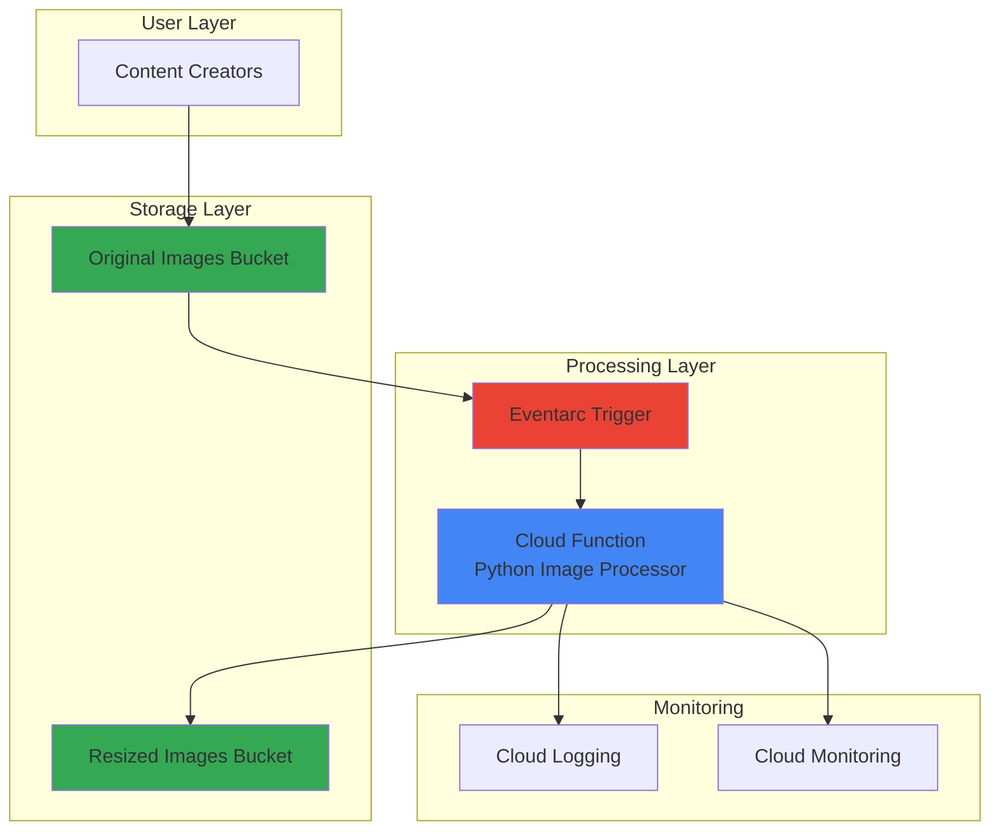

# Automatic Image Resizing with Cloud Functions and Storage

## Problem

Marketing teams and content creators upload high-resolution images to storage systems daily but need multiple sized versions for different use cases like thumbnails, social media previews, and responsive web displays. Manually creating these variations is time-consuming and error-prone, leading to inconsistent image formats, delayed content publishing, and increased operational overhead that impacts team productivity and user experience.

## Solution

Build an event-driven image resizing service using Cloud Functions triggered by Cloud Storage uploads that automatically generates thumbnail versions in multiple sizes. The serverless function processes images using Python's PIL library, creating resized variants and storing them back to Cloud Storage, enabling seamless automated image processing workflows with pay-per-use pricing and automatic scaling.

## Architecture Diagram



## Prerequisites

1. GCP account with billing enabled and appropriate permissions
2. Google Cloud CLI installed and configured (or Cloud Shell)
3. Basic understanding of Python and image processing concepts
4. Existing GCP project with Cloud Functions and Cloud Storage APIs enabled
5. Estimated cost: $0.10-$0.50 for testing (Cloud Functions free tier covers most usage)

> **Note**: This recipe uses Cloud Functions' generous free tier which includes 2 million invocations per month, making it cost-effective for moderate image processing workloads.

## Preparation

```bash
# Set environment variables for GCP resources
export PROJECT_ID="image-resize-$(date +%s)"
export REGION="us-central1"
export ZONE="us-central1-a"

# Generate unique suffix for resource names
RANDOM_SUFFIX=$(openssl rand -hex 3)

# Set bucket names
export ORIGINAL_BUCKET="original-images-${RANDOM_SUFFIX}"
export RESIZED_BUCKET="resized-images-${RANDOM_SUFFIX}"
export FUNCTION_NAME="resize-image-function"

# Set default project and region
gcloud config set project ${PROJECT_ID}
gcloud config set compute/region ${REGION}
gcloud config set functions/region ${REGION}

# Enable required APIs
gcloud services enable cloudfunctions.googleapis.com
gcloud services enable storage.googleapis.com
gcloud services enable eventarc.googleapis.com
gcloud services enable cloudbuild.googleapis.com
gcloud services enable run.googleapis.com

echo "✅ Project configured: ${PROJECT_ID}"
echo "✅ Buckets will be: ${ORIGINAL_BUCKET}, ${RESIZED_BUCKET}"
```

## Steps

1. **Create Cloud Storage Buckets for Images**:

   Cloud Storage provides globally distributed object storage with strong consistency guarantees and seamless integration with Cloud Functions. Creating separate buckets for original and resized images enables clear organization, different access patterns, and prevents recursive function triggers that could occur if processed images were stored in the same bucket as originals.

   ```bash
   # Create bucket for original images
   gsutil mb -p ${PROJECT_ID} \
       -c STANDARD \
       -l ${REGION} \
       gs://${ORIGINAL_BUCKET}
   
   # Create bucket for resized images
   gsutil mb -p ${PROJECT_ID} \
       -c STANDARD \
       -l ${REGION} \
       gs://${RESIZED_BUCKET}
   
   # Enable uniform bucket-level access for security
   gsutil uniformbucketlevelaccess set on gs://${ORIGINAL_BUCKET}
   gsutil uniformbucketlevelaccess set on gs://${RESIZED_BUCKET}
   
   echo "✅ Storage buckets created successfully"
   ```

   The storage buckets are now configured with uniform bucket-level access for consistent security policies and optimal performance for the image resizing workflow.

2. **Create Function Directory and Dependencies**:

   Python Cloud Functions require a specific project structure with a requirements.txt file listing dependencies and a main.py file containing the function code. The PIL (Pillow) library provides comprehensive image processing capabilities including format conversion, resizing algorithms, and quality optimization essential for thumbnail generation.

   ```bash
   # Create function directory
   mkdir -p cloud-function-resize
   cd cloud-function-resize
   
   # Create requirements.txt with image processing dependencies
   cat > requirements.txt << 'EOF'
   Pillow>=10.0.0
   google-cloud-storage>=2.10.0
   functions-framework>=3.4.0
   EOF
   
   echo "✅ Function directory and dependencies configured"
   ```

   The dependencies include the latest stable versions of Pillow for image processing, Google Cloud Storage client library for bucket operations, and the Functions Framework for local development and testing.

3. **Create Image Processing Function Code**:

   The Cloud Function implements efficient image resizing logic using PIL's high-quality resampling algorithms. The function handles multiple image formats, implements error handling for corrupted files, and generates multiple thumbnail sizes simultaneously to optimize processing efficiency and minimize cold start impacts.

   ```bash
   # Create main function file
   cat > main.py << 'EOF'
import os
import tempfile
from PIL import Image
from google.cloud import storage
import functions_framework

# Initialize Cloud Storage client
storage_client = storage.Client()

# Define thumbnail sizes (width, height)
THUMBNAIL_SIZES = [
    (150, 150),   # Small thumbnail
    (300, 300),   # Medium thumbnail
    (600, 600),   # Large thumbnail
]

@functions_framework.cloud_event
def resize_image(cloud_event):
    """
    Triggered by Cloud Storage object finalization.
    Resizes uploaded images and saves thumbnails.
    """
    # Parse event data
    data = cloud_event.data
    bucket_name = data['bucket']
    file_name = data['name']
    
    print(f"Processing image: {file_name} from bucket: {bucket_name}")
    
    # Skip if file is not an image
    if not file_name.lower().endswith(('.jpg', '.jpeg', '.png', '.bmp', '.tiff')):
        print(f"Skipping non-image file: {file_name}")
        return
    
    # Skip if already a resized image (prevent recursion)
    if 'resized' in file_name.lower():
        print(f"Skipping already resized image: {file_name}")
        return
    
    try:
        # Download image from source bucket
        source_bucket = storage_client.bucket(bucket_name)
        source_blob = source_bucket.blob(file_name)
        
        # Create temporary file
        with tempfile.NamedTemporaryFile() as temp_file:
            source_blob.download_to_filename(temp_file.name)
            
            # Open and process image
            with Image.open(temp_file.name) as image:
                # Convert to RGB if necessary (for PNG with transparency)
                if image.mode in ('RGBA', 'LA', 'P'):
                    image = image.convert('RGB')
                
                # Get resized images bucket
                resized_bucket_name = os.environ.get('RESIZED_BUCKET')
                if not resized_bucket_name:
                    print("RESIZED_BUCKET environment variable not set")
                    return
                
                resized_bucket = storage_client.bucket(resized_bucket_name)
                
                # Create thumbnails in different sizes
                for width, height in THUMBNAIL_SIZES:
                    # Calculate resize dimensions maintaining aspect ratio
                    image_ratio = image.width / image.height
                    target_ratio = width / height
                    
                    if image_ratio > target_ratio:
                        # Image is wider, fit to width
                        new_width = width
                        new_height = int(width / image_ratio)
                    else:
                        # Image is taller, fit to height
                        new_height = height
                        new_width = int(height * image_ratio)
                    
                    # Resize image with high-quality resampling
                    resized_image = image.resize(
                        (new_width, new_height), 
                        Image.Resampling.LANCZOS
                    )
                    
                    # Generate output filename
                    name_parts = os.path.splitext(file_name)
                    output_name = f"{name_parts[0]}_resized_{width}x{height}{name_parts[1]}"
                    
                    # Save to temporary file
                    with tempfile.NamedTemporaryFile(suffix='.jpg') as output_temp:
                        resized_image.save(
                            output_temp.name, 
                            'JPEG', 
                            quality=85, 
                            optimize=True
                        )
                        
                        # Upload to resized bucket
                        output_blob = resized_bucket.blob(output_name)
                        output_blob.upload_from_filename(
                            output_temp.name,
                            content_type='image/jpeg'
                        )
                        
                        print(f"Created thumbnail: {output_name} ({width}x{height})")
                
                print(f"Successfully processed {file_name}")
    
    except Exception as e:
        print(f"Error processing {file_name}: {str(e)}")
        raise
EOF
   
   echo "✅ Image processing function code created"
   ```

   The function implements intelligent aspect ratio preservation, high-quality LANCZOS resampling for optimal image quality, and comprehensive error handling for production reliability.

4. **Deploy Cloud Function with Storage Trigger**:

   Cloud Functions deployment with Eventarc integration enables automatic triggering when objects are uploaded to Cloud Storage. The function uses Python 3.11 runtime for optimal performance and includes sufficient memory allocation for image processing operations while maintaining cost efficiency through auto-scaling.

   ```bash
   # Set environment variable for the function
   export RESIZED_BUCKET_ENV="RESIZED_BUCKET=${RESIZED_BUCKET}"
   
   # Deploy Cloud Function with Cloud Storage trigger
   gcloud functions deploy ${FUNCTION_NAME} \
       --gen2 \
       --runtime=python311 \
       --region=${REGION} \
       --source=. \
       --entry-point=resize_image \
       --trigger-event-type="google.cloud.storage.object.v1.finalized" \
       --trigger-event-filters="bucket=${ORIGINAL_BUCKET}" \
       --set-env-vars=${RESIZED_BUCKET_ENV} \
       --memory=512MB \
       --timeout=120s \
       --max-instances=10
   
   echo "✅ Cloud Function deployed with storage trigger"
   ```

   The function is now configured with optimized memory settings, timeout values, and concurrency limits suitable for image processing workloads while preventing excessive resource consumption.

5. **Configure IAM Permissions for Function**:

   Cloud Functions require specific IAM permissions to read from the source bucket and write to the destination bucket. The Compute Engine default service account used by Cloud Functions needs Storage Object Admin permissions on both buckets to enable seamless image processing operations.

   ```bash
   # Get project number for service account
   PROJECT_NUMBER=$(gcloud projects describe ${PROJECT_ID} \
       --format='value(projectNumber)')
   
   # Set service account variable
   SERVICE_ACCOUNT="${PROJECT_NUMBER}-compute@developer.gserviceaccount.com"
   
   # Grant storage permissions for original bucket
   gsutil iam ch serviceAccount:${SERVICE_ACCOUNT}:objectViewer \
       gs://${ORIGINAL_BUCKET}
   
   # Grant storage permissions for resized bucket
   gsutil iam ch serviceAccount:${SERVICE_ACCOUNT}:objectAdmin \
       gs://${RESIZED_BUCKET}
   
   echo "✅ IAM permissions configured for function"
   ```

   The service account now has minimal required permissions following the principle of least privilege while enabling full functionality of the image resizing workflow.

6. **Test Image Upload and Processing**:

   Testing the complete workflow validates that the event-driven architecture functions correctly. Uploading a sample image triggers the Cloud Function automatically, demonstrating the serverless processing pipeline and enabling verification of thumbnail generation across multiple sizes.

   ```bash
   # Create a test image (simple colored rectangle)
   python3 -c "
   from PIL import Image
   import os
   
   # Create a test image
   img = Image.new('RGB', (1200, 800), color='red')
   img.save('test-image.jpg', 'JPEG')
   print('Test image created: test-image.jpg')
   "
   
   # Upload test image to trigger function
   gsutil cp test-image.jpg gs://${ORIGINAL_BUCKET}/
   
   echo "✅ Test image uploaded - function should trigger automatically"
   echo "Wait 30 seconds for processing to complete..."
   sleep 30
   ```

   The test image upload initiates the complete processing pipeline, providing immediate feedback on the system's functionality and performance characteristics.

## Validation & Testing

1. **Verify Function Execution and Logs**:

   ```bash
   # Check function logs
   gcloud functions logs read ${FUNCTION_NAME} \
       --gen2 \
       --region=${REGION} \
       --limit=20
   ```

   Expected output: Processing logs showing successful image resize operations for multiple thumbnail sizes.

2. **Verify Resized Images Were Created**:

   ```bash
   # List files in resized bucket
   gsutil ls -l gs://${RESIZED_BUCKET}/
   
   # Count resized images
   RESIZED_COUNT=$(gsutil ls gs://${RESIZED_BUCKET}/ | wc -l)
   echo "Number of resized images created: ${RESIZED_COUNT}"
   ```

   Expected output: Three resized versions of the test image (150x150, 300x300, 600x600 pixel thumbnails).

3. **Test with Different Image Formats**:

   ```bash
   # Test with PNG image
   python3 -c "
   from PIL import Image
   img = Image.new('RGBA', (800, 600), color=(0, 255, 0, 128))
   img.save('test-image.png', 'PNG')
   "
   
   gsutil cp test-image.png gs://${ORIGINAL_BUCKET}/
   
   # Wait and verify processing
   sleep 20
   gsutil ls gs://${RESIZED_BUCKET}/test-image_*
   ```

   Expected output: Additional resized images demonstrating support for multiple image formats and transparency handling.

## Cleanup

1. **Remove Cloud Function**:

   ```bash
   # Delete Cloud Function
   gcloud functions delete ${FUNCTION_NAME} \
       --gen2 \
       --region=${REGION} \
       --quiet
   
   echo "✅ Cloud Function deleted"
   ```

2. **Remove Storage Buckets and Contents**:

   ```bash
   # Remove all objects and buckets
   gsutil -m rm -r gs://${ORIGINAL_BUCKET}
   gsutil -m rm -r gs://${RESIZED_BUCKET}
   
   echo "✅ Storage buckets and contents deleted"
   ```

3. **Clean Up Local Files**:

   ```bash
   # Remove local function code and test images
   cd ..
   rm -rf cloud-function-resize
   rm -f test-image.jpg test-image.png
   
   echo "✅ Local files cleaned up"
   ```

## Discussion

This serverless image resizing solution demonstrates the power of event-driven architecture in Google Cloud Platform. Cloud Functions automatically scales from zero to handle any volume of image uploads, eliminating the need for always-on infrastructure while providing sub-second response times for image processing tasks. The integration between Cloud Storage and Cloud Functions through Eventarc creates a robust, decoupled system that can handle enterprise-scale image processing workloads.

The solution implements several best practices for production image processing: aspect ratio preservation prevents image distortion, high-quality LANCZOS resampling maintains visual fidelity, and format normalization to JPEG with optimized compression reduces storage costs while maintaining acceptable quality. The function's error handling and logging capabilities ensure reliable operation and facilitate troubleshooting in production environments.

From a cost perspective, this serverless approach provides significant advantages over traditional server-based image processing. Cloud Functions' pay-per-invocation pricing model means you only pay for actual image processing time, making it highly cost-effective for variable workloads. The generous free tier (2 million invocations monthly) covers substantial usage for small to medium applications, while automatic scaling ensures the system can handle traffic spikes without manual intervention.

> **Tip**: For high-volume production workloads, consider implementing batch processing by having the function trigger on multiple file uploads simultaneously, or use Cloud Run for more complex image processing workflows that require longer execution times or custom container environments.

The architecture can be extended to support additional image formats, implement content-aware cropping using AI services, or integrate with content delivery networks for optimized image delivery. Security enhancements could include image content scanning, watermarking, or integration with Google Cloud's Data Loss Prevention APIs for sensitive content detection.

**Documentation Sources:**
- [Cloud Functions Python Runtime](https://cloud.google.com/functions/docs/concepts/python-runtime)
- [Cloud Storage Triggers for Cloud Functions](https://cloud.google.com/functions/docs/calling/storage)
- [Eventarc Storage Triggers](https://cloud.google.com/eventarc/docs/run/quickstart-storage)
- [Google Cloud Architecture Framework](https://cloud.google.com/architecture/framework)
- [Pillow Image Processing Documentation](https://pillow.readthedocs.io/en/stable/)

## Challenge

Extend this solution by implementing these enhancements:

1. **Smart Cropping Integration**: Use Google Cloud Vision API to detect faces and important objects in images, then implement intelligent cropping that preserves key visual elements when creating square thumbnails.

2. **Multi-Format Output Support**: Modify the function to generate thumbnails in multiple formats (JPEG, WebP, AVIF) optimized for different use cases, with WebP for web delivery and AVIF for next-generation browsers.

3. **Metadata Preservation and EXIF Processing**: Extract and preserve important image metadata like GPS coordinates, camera settings, and copyright information while stripping sensitive EXIF data for privacy protection.

4. **Content-Aware Optimization**: Implement dynamic quality adjustment based on image content analysis, using higher compression for simple graphics and preserving quality for complex photographs with fine details.

5. **Integration with Cloud CDN**: Add automatic upload of processed thumbnails to Cloud CDN with appropriate cache headers and implement lazy loading patterns for optimal web performance.

## Infrastructure Code

*Infrastructure code will be generated after recipe approval.*