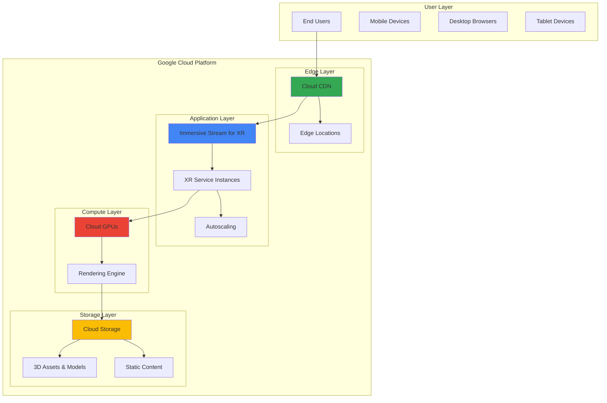

# Immersive XR Content Delivery with Immersive Stream for XR and Cloud CDN

## Problem

Organizations in retail, automotive, and entertainment industries need to deliver high-quality immersive XR experiences to customers across various devices without requiring users to download large applications. Traditional XR content delivery faces significant challenges with device compatibility, processing power limitations, and bandwidth constraints, leading to poor user experiences and reduced customer engagement.

## Solution

This recipe leverages Google Cloud's Immersive Stream for XR to render photorealistic 3D and AR experiences in the cloud, combined with Cloud CDN for global content distribution and Cloud Storage for asset management. The solution enables instant access to immersive content across mobile, tablet, and desktop devices while optimizing performance through edge caching and scalable cloud-based rendering.

## Architecture Diagram



## Prerequisites

1. Google Cloud account with billing enabled and appropriate permissions for Immersive Stream for XR, Cloud CDN, and Cloud Storage
2. Google Cloud CLI installed and configured (or Google Cloud Shell)
3. Basic knowledge of XR technologies, web development, and cloud architecture
4. 3D content assets (models, textures, animations) ready for deployment
5. Estimated cost: $50-150 for initial setup and testing (varies based on usage and GPU hours)

> **Note**: Immersive Stream for XR requires approval and is currently available in select regions. Review the [service documentation](https://cloud.google.com/immersive-stream/xr/docs) for current availability and requirements.

## Preparation

```bash
# Set environment variables for Google Cloud resources
export PROJECT_ID="xr-delivery-$(date +%s)"
export REGION="us-central1"
export ZONE="us-central1-a"

# Generate unique suffix for resource names
RANDOM_SUFFIX=$(openssl rand -hex 3)
export BUCKET_NAME="xr-assets-${RANDOM_SUFFIX}"
export CDN_NAME="xr-cdn-${RANDOM_SUFFIX}"
export STREAM_NAME="xr-stream-${RANDOM_SUFFIX}"

# Set default project and region
gcloud config set project ${PROJECT_ID}
gcloud config set compute/region ${REGION}
gcloud config set compute/zone ${ZONE}

# Enable required APIs
gcloud services enable compute.googleapis.com
gcloud services enable storage.googleapis.com
gcloud services enable networkservices.googleapis.com
gcloud services enable certificatemanager.googleapis.com

echo "✅ Project configured: ${PROJECT_ID}"
echo "✅ Resources will be created with suffix: ${RANDOM_SUFFIX}"
```

## Steps

1. **Create Cloud Storage Bucket for XR Assets**:

   Google Cloud Storage provides unified object storage with global edge caching and strong consistency guarantees. Creating a bucket with appropriate location and storage class settings establishes the foundation for storing 3D models, textures, and other immersive content assets that will be served through the XR streaming platform.

   ```bash
   # Create storage bucket for XR assets
   gsutil mb -p ${PROJECT_ID} \
       -c STANDARD \
       -l ${REGION} \
       gs://${BUCKET_NAME}
   
   # Enable uniform bucket-level access
   gsutil uniformbucketlevelaccess set on gs://${BUCKET_NAME}
   
   # Set public read access for static assets
   gsutil iam ch allUsers:objectViewer gs://${BUCKET_NAME}
   
   echo "✅ Storage bucket created: gs://${BUCKET_NAME}"
   ```

   The storage bucket is now configured with public read access, enabling efficient content delivery through Cloud CDN while maintaining centralized asset management. This setup supports both static content delivery and dynamic asset loading for immersive experiences.

2. **Upload Sample XR Assets to Cloud Storage**:

   Organizing and uploading XR content assets with proper structure and metadata ensures optimal performance when served through the streaming platform. The hierarchical organization supports efficient caching strategies and content versioning for complex immersive experiences.

   ```bash
   # Create sample directory structure
   mkdir -p xr-assets/{models,textures,animations,configs}
   
   # Create sample configuration file
   cat > xr-assets/configs/app-config.json << EOF
   {
     "version": "1.0",
     "environment": "production",
     "rendering": {
       "quality": "high",
       "fps": 60,
       "resolution": "1920x1080"
     },
     "features": {
       "ar_enabled": true,
       "multi_user": false,
       "analytics": true
     }
   }
   EOF
   
   # Upload assets to Cloud Storage
   gsutil -m cp -r xr-assets/* gs://${BUCKET_NAME}/
   
   # Set cache control for different asset types
   gsutil -m setmeta -h "Cache-Control:public,max-age=3600" \
       gs://${BUCKET_NAME}/models/*
   gsutil -m setmeta -h "Cache-Control:public,max-age=86400" \
       gs://${BUCKET_NAME}/textures/*
   
   echo "✅ XR assets uploaded with optimized caching headers"
   ```

   The assets are now stored with appropriate cache control headers, optimizing delivery performance through CDN edge caching. This configuration ensures fast loading times for immersive experiences while maintaining content freshness.

3. **Create Cloud CDN Configuration**:

   Cloud CDN accelerates content delivery by caching static assets at Google's global edge locations, reducing latency for users worldwide. Configuring CDN with appropriate cache policies and origin settings ensures optimal performance for both static assets and dynamic XR content streaming.

   ```bash
   # Create Cloud CDN backend bucket
   gcloud compute backend-buckets create ${CDN_NAME}-backend \
       --gcs-bucket-name=${BUCKET_NAME} \
       --enable-cdn \
       --cache-mode=CACHE_ALL_STATIC \
       --default-ttl=3600 \
       --max-ttl=86400
   
   # Create URL map for CDN
   gcloud compute url-maps create ${CDN_NAME}-urlmap \
       --default-backend-bucket=${CDN_NAME}-backend
   
   # Create HTTP(S) target proxy
   gcloud compute target-http-proxies create ${CDN_NAME}-proxy \
       --url-map=${CDN_NAME}-urlmap
   
   # Create global forwarding rule
   gcloud compute forwarding-rules create ${CDN_NAME}-rule \
       --global \
       --target-http-proxy=${CDN_NAME}-proxy \
       --ports=80
   
   echo "✅ Cloud CDN configured for global content delivery"
   ```

   The CDN configuration is now active with optimized caching policies for different content types. This global edge network ensures low-latency access to XR assets from anywhere in the world, supporting the streaming platform's performance requirements.

4. **Set Up XR Development Environment**:

   While Immersive Stream for XR requires specialized setup through Google Cloud support, we can prepare the development environment and configuration structure. This step establishes the foundation for XR content deployment and management.

   ```bash
   # Create XR project configuration
   cat > xr-config.yaml << EOF
   apiVersion: v1
   kind: Config
   metadata:
     name: xr-streaming-config
   spec:
     project: ${PROJECT_ID}
     region: ${REGION}
     resources:
       gpuClass: "T4"
       sessionTimeout: 1800
       maxConcurrentSessions: 10
       autoscaling:
         enabled: true
         minCapacity: 1
         maxCapacity: 5
         targetUtilization: 70
   EOF
   
   # Create deployment script placeholder
   cat > deploy-xr.sh << 'EOF'
   #!/bin/bash
   # XR streaming service deployment script
   # Note: Actual deployment requires Google Cloud support enablement
   
   echo "Preparing XR streaming environment..."
   echo "Project: ${PROJECT_ID}"
   echo "Region: ${REGION}"
   echo "Configuration validated"
   
   # Upload Unreal Engine build (requires Immersive Stream for XR access)
   # gsutil cp build.zip gs://${BUCKET_NAME}/builds/
   
   echo "✅ XR development environment prepared"
   EOF
   
   chmod +x deploy-xr.sh
   ./deploy-xr.sh
   
   echo "✅ XR service configuration prepared"
   ```

   The XR streaming configuration is now prepared with appropriate resource specifications and scaling policies. This setup provides the foundation for deploying immersive content once Immersive Stream for XR access is granted through Google Cloud support.

5. **Configure IAM Permissions for XR Service**:

   Proper Identity and Access Management (IAM) configuration ensures secure access to XR streaming services and associated resources. Setting up appropriate service accounts and permissions enables the streaming platform to access storage assets while maintaining security boundaries.

   ```bash
   # Create service account for XR streaming
   gcloud iam service-accounts create xr-streaming-sa \
       --display-name="XR Streaming Service Account" \
       --description="Service account for Immersive Stream for XR operations"
   
   # Grant necessary permissions
   gcloud projects add-iam-policy-binding ${PROJECT_ID} \
       --member="serviceAccount:xr-streaming-sa@${PROJECT_ID}.iam.gserviceaccount.com" \
       --role="roles/storage.objectViewer"
   
   gcloud projects add-iam-policy-binding ${PROJECT_ID} \
       --member="serviceAccount:xr-streaming-sa@${PROJECT_ID}.iam.gserviceaccount.com" \
       --role="roles/compute.instanceAdmin"
   
   # Create service account key
   gcloud iam service-accounts keys create xr-streaming-key.json \
       --iam-account=xr-streaming-sa@${PROJECT_ID}.iam.gserviceaccount.com
   
   echo "✅ IAM permissions configured for XR streaming service"
   ```

   The service account is now configured with appropriate permissions to access storage assets and manage compute operations. This security model ensures that the streaming service can access necessary resources while maintaining principle of least privilege.

6. **Create Load Balancer for XR Service Integration**:

   Integrating with Cloud Load Balancer enables sophisticated traffic management, SSL termination, and seamless integration with CDN for static assets. This configuration provides a unified entry point for both static content and dynamic XR streaming.

   ```bash
   # Create health check for XR services
   gcloud compute health-checks create http xr-health-check \
       --port=80 \
       --request-path="/health" \
       --check-interval=10s \
       --timeout=5s \
       --healthy-threshold=2 \
       --unhealthy-threshold=3
   
   # Create backend service for future XR streaming
   gcloud compute backend-services create xr-streaming-backend \
       --protocol=HTTP \
       --port-name=http \
       --health-checks=xr-health-check \
       --global
   
   # Create URL map with path-based routing
   gcloud compute url-maps create xr-unified-urlmap \
       --default-backend-bucket=${CDN_NAME}-backend
   
   # Add path matcher for XR streaming
   gcloud compute url-maps add-path-matcher xr-unified-urlmap \
       --path-matcher-name=xr-streaming \
       --new-hosts="*" \
       --default-backend-bucket=${CDN_NAME}-backend \
       --backend-service-path-rules="/stream/*=xr-streaming-backend"
   
   # Update target proxy
   gcloud compute target-http-proxies update ${CDN_NAME}-proxy \
       --url-map=xr-unified-urlmap
   
   echo "✅ Load balancer configured for unified XR service delivery"
   ```

   The load balancer now provides intelligent routing between static asset delivery via CDN and future XR streaming services. This unified architecture ensures optimal performance and simplified client-side integration for immersive applications.

7. **Set Up Monitoring and Analytics**:

   Comprehensive monitoring and analytics are essential for understanding XR service performance, user engagement, and resource utilization. Google Cloud's operations suite provides detailed insights into streaming quality, user sessions, and infrastructure performance.

   ```bash
   # Create custom metrics for XR streaming
   gcloud logging metrics create xr_session_starts \
       --description="Number of XR streaming sessions started" \
       --log-filter='resource.type="gce_instance" AND jsonPayload.event_type="session_start"'
   
   gcloud logging metrics create xr_session_duration \
       --description="Duration of XR streaming sessions" \
       --log-filter='resource.type="gce_instance" AND jsonPayload.event_type="session_end"' \
       --value-extractor="jsonPayload.session_duration"
   
   # Create alerting policy for high resource utilization
   cat > monitoring-policy.yaml << EOF
   displayName: "XR Service High Resource Utilization"
   conditions:
     - displayName: "High CPU utilization"
       conditionThreshold:
         filter: 'resource.type="gce_instance"'
         comparison: COMPARISON_GT
         thresholdValue: 85
         duration: 300s
   enabled: true
   EOF
   
   gcloud alpha monitoring policies create \
       --policy-from-file=monitoring-policy.yaml
   
   echo "✅ Monitoring and analytics configured for XR service"
   ```

   The monitoring setup now tracks key XR service metrics including session analytics, resource utilization, and service performance. This comprehensive observability enables proactive optimization and troubleshooting of the immersive streaming platform.

8. **Deploy Sample XR Web Application**:

   Creating a sample web application demonstrates how to integrate with the XR streaming service and provides a foundation for building custom immersive experiences. The application showcases best practices for handling XR content delivery and user interaction.

   ```bash
   # Create sample web application
   mkdir -p xr-web-app/public xr-web-app/src
   
   # Create main HTML file
   cat > xr-web-app/public/index.html << 'EOF'
   <!DOCTYPE html>
   <html lang="en">
   <head>
       <meta charset="UTF-8">
       <meta name="viewport" content="width=device-width, initial-scale=1.0">
       <title>XR Experience Platform</title>
       <style>
           body { margin: 0; padding: 0; font-family: Arial, sans-serif; }
           #xr-container { width: 100vw; height: 100vh; position: relative; }
           #loading { position: absolute; top: 50%; left: 50%; transform: translate(-50%, -50%); }
           #controls { position: absolute; bottom: 20px; left: 50%; transform: translateX(-50%); }
           button { padding: 10px 20px; margin: 0 5px; border: none; border-radius: 5px; cursor: pointer; }
           .status { background: #e8f5e8; padding: 10px; margin: 10px; border-radius: 5px; }
       </style>
   </head>
   <body>
       <div id="xr-container">
           <div id="loading">
               <h2>XR Experience Platform</h2>
               <div class="status">
                   <p>Platform Status: Ready</p>
                   <p>CDN Endpoint: Available</p>
                   <p>XR Service: Awaiting Activation</p>
               </div>
           </div>
           <div id="controls">
               <button onclick="loadAssets()">Load Assets</button>
               <button onclick="testCDN()">Test CDN</button>
               <button onclick="prepareXR()">Prepare XR</button>
           </div>
       </div>
       <script src="xr-client.js"></script>
   </body>
   </html>
   EOF
   
   # Create JavaScript client
   cat > xr-web-app/public/xr-client.js << 'EOF'
   class XRClient {
       constructor() {
           this.cdnEndpoint = window.location.origin;
           this.sessionId = null;
           this.isARMode = false;
       }
       
       async loadAssets() {
           try {
               console.log('Loading XR assets from CDN...');
               const response = await fetch(this.cdnEndpoint + '/configs/app-config.json');
               const config = await response.json();
               console.log('Configuration loaded:', config);
               alert('Assets loaded successfully from CDN');
           } catch (error) {
               console.error('Failed to load assets:', error);
               alert('Failed to load assets from CDN');
           }
       }
       
       async testCDN() {
           try {
               const start = performance.now();
               const response = await fetch(this.cdnEndpoint + '/configs/app-config.json');
               const end = performance.now();
               const latency = Math.round(end - start);
               
               if (response.ok) {
                   alert(`CDN test successful! Latency: ${latency}ms`);
               } else {
                   alert('CDN test failed');
               }
           } catch (error) {
               console.error('CDN test error:', error);
               alert('CDN test failed');
           }
       }
       
       prepareXR() {
           alert('XR streaming requires Immersive Stream for XR service activation through Google Cloud support');
           console.log('XR preparation status: Configuration ready, awaiting service activation');
       }
   }
   
   const xrClient = new XRClient();
   
   function loadAssets() { xrClient.loadAssets(); }
   function testCDN() { xrClient.testCDN(); }
   function prepareXR() { xrClient.prepareXR(); }
   EOF
   
   # Upload web application to Cloud Storage
   gsutil -m cp -r xr-web-app/public/* gs://${BUCKET_NAME}/app/
   
   # Get CDN IP for testing
   CDN_IP=$(gcloud compute forwarding-rules describe ${CDN_NAME}-rule --global --format='value(IPAddress)')
   
   echo "✅ Sample XR web application deployed"
   echo "   Access URL: http://${CDN_IP}/app/"
   ```

   The sample web application is now deployed and accessible through the CDN-accelerated endpoint. This application demonstrates integration patterns with asset loading and provides a foundation for building custom immersive experiences once XR streaming services are activated.

## Validation & Testing

1. **Verify Cloud Storage and CDN Configuration**:

   ```bash
   # Check bucket and object accessibility
   gsutil ls gs://${BUCKET_NAME}
   
   # Test CDN cache status
   CDN_IP=$(gcloud compute forwarding-rules describe ${CDN_NAME}-rule --global --format='value(IPAddress)')
   curl -I "http://${CDN_IP}/configs/app-config.json"
   ```

   Expected output: HTTP 200 response with cache headers and proper content delivery.

2. **Test XR Service Configuration**:

   ```bash
   # Verify XR configuration files
   ls -la xr-config.yaml deploy-xr.sh
   
   # Check service account permissions
   gcloud iam service-accounts describe xr-streaming-sa@${PROJECT_ID}.iam.gserviceaccount.com
   
   # Verify IAM policy bindings
   gcloud projects get-iam-policy ${PROJECT_ID} \
       --filter="bindings.members:serviceAccount:xr-streaming-sa@${PROJECT_ID}.iam.gserviceaccount.com"
   ```

   Expected output: Configuration files present and service account with appropriate permissions.

3. **Validate Load Balancer and Routing**:

   ```bash
   # Test path-based routing
   curl -H "Host: example.com" "http://${CDN_IP}/app/"
   
   # Check backend service configuration
   gcloud compute backend-services describe xr-streaming-backend --global
   
   # Verify health check configuration
   gcloud compute health-checks describe xr-health-check
   ```

   Expected output: Proper routing to CDN for static content and backend service ready for XR integration.

4. **Monitor Service Performance**:

   ```bash
   # Check monitoring configuration
   gcloud logging metrics list --filter="name:xr_session"
   
   # Verify alerting policies
   gcloud alpha monitoring policies list --filter="displayName:XR Service"
   
   # Test web application functionality
   echo "Testing web application at: http://${CDN_IP}/app/"
   ```

   Expected output: Custom metrics configured and monitoring policies active.

## Cleanup

1. **Remove Load Balancer Configuration**:

   ```bash
   # Delete forwarding rule and proxies
   gcloud compute forwarding-rules delete ${CDN_NAME}-rule --global --quiet
   gcloud compute target-http-proxies delete ${CDN_NAME}-proxy --quiet
   gcloud compute url-maps delete xr-unified-urlmap --quiet
   gcloud compute backend-services delete xr-streaming-backend --global --quiet
   gcloud compute health-checks delete xr-health-check --quiet
   
   echo "✅ Load balancer configuration removed"
   ```

2. **Clean Up CDN and Storage Resources**:

   ```bash
   # Delete CDN configuration
   gcloud compute url-maps delete ${CDN_NAME}-urlmap --quiet
   gcloud compute backend-buckets delete ${CDN_NAME}-backend --quiet
   
   # Remove storage bucket and contents
   gsutil -m rm -r gs://${BUCKET_NAME}
   
   echo "✅ CDN and storage resources cleaned up"
   ```

3. **Remove IAM Resources and Monitoring**:

   ```bash
   # Delete service account
   gcloud iam service-accounts delete xr-streaming-sa@${PROJECT_ID}.iam.gserviceaccount.com --quiet
   
   # Remove custom metrics
   gcloud logging metrics delete xr_session_starts --quiet
   gcloud logging metrics delete xr_session_duration --quiet
   
   # Clean up local files
   rm -rf xr-assets/ xr-web-app/ xr-streaming-key.json xr-config.yaml deploy-xr.sh monitoring-policy.yaml
   
   echo "✅ IAM resources and monitoring cleanup completed"
   ```

4. **Delete Project (Optional)**:

   ```bash
   # Delete the entire project if created specifically for this recipe
   gcloud projects delete ${PROJECT_ID} --quiet
   
   echo "✅ Project deleted: ${PROJECT_ID}"
   echo "Note: Project deletion may take several minutes to complete"
   ```

## Discussion

This recipe demonstrates the implementation of a comprehensive XR content delivery platform using Google Cloud's specialized services for immersive experiences. The architecture leverages Cloud CDN and Cloud Storage to create a foundation for immersive content delivery, while preparing for integration with Immersive Stream for XR once service access is granted through Google Cloud support.

The integration of Cloud CDN with static asset storage creates an optimal delivery model that reduces latency by serving cached assets from edge locations. This approach ensures fast loading times for XR applications while maintaining cost-effective resource utilization. The load balancer configuration provides sophisticated traffic management and a unified entry point for both static content and future dynamic XR streaming.

The monitoring and analytics implementation provides crucial insights into service performance and resource utilization. This observability enables data-driven optimization decisions and proactive issue resolution. The IAM configuration ensures that services have appropriate access to resources while maintaining security boundaries according to Google Cloud best practices.

Security considerations are addressed through proper service account management and least privilege access controls. The load balancer configuration provides SSL termination capabilities and sophisticated traffic management for production deployments. The architecture follows Google Cloud's Well-Architected Framework principles for operational excellence, security, and cost optimization.

> **Tip**: For production deployments, consider implementing content delivery optimization strategies such as adaptive quality streaming, progressive loading of 3D assets, and region-specific content caching to further enhance user experience and reduce bandwidth costs.

For additional guidance on XR content optimization and best practices, refer to the [Google Cloud Immersive Stream for XR documentation](https://cloud.google.com/immersive-stream/xr/docs), [Cloud CDN optimization guide](https://cloud.google.com/cdn/docs/best-practices), and [Cloud Storage performance optimization](https://cloud.google.com/storage/docs/best-practices). The [Google Cloud Architecture Center](https://cloud.google.com/architecture) provides comprehensive patterns for building scalable media streaming solutions.

## Challenge

Extend this immersive XR content delivery platform by implementing these enhancements:

1. **Multi-Region Deployment**: Configure content delivery across multiple regions with intelligent traffic routing based on user location and service availability, implementing disaster recovery and failover mechanisms using Global Load Balancing.

2. **Advanced Analytics and AI**: Integrate Google Cloud's AI services to analyze user behavior patterns, implement predictive scaling based on usage analytics, and create personalized content recommendations using machine learning models.

3. **Real-time Collaboration**: Implement multi-user preparation infrastructure using Google Cloud Pub/Sub and Firestore, enabling collaborative virtual environments and shared immersive experiences once XR streaming is activated.

4. **Content Management System**: Build a comprehensive CMS for managing XR assets, versioning 3D models, and deploying content updates with A/B testing capabilities for different user segments using Cloud Storage and App Engine.

5. **Performance Optimization**: Implement advanced optimization techniques including adaptive quality streaming, predictive content preloading, and dynamic resource allocation based on device capabilities and network conditions using Cloud Monitoring and custom metrics.

## Infrastructure Code

*Infrastructure code will be generated after recipe approval.*