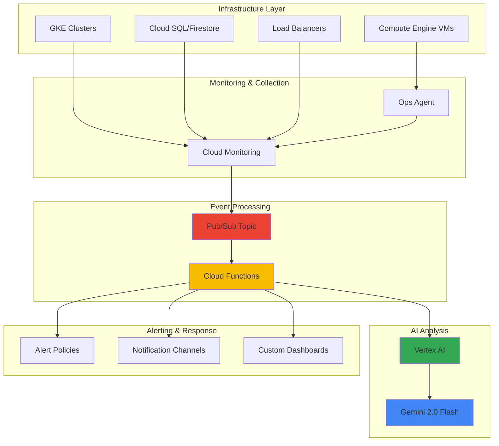

# Infrastructure Anomaly Detection with Cloud Monitoring and Gemini

## Problem

Modern cloud infrastructures generate thousands of metrics across compute, storage, and network resources, making it nearly impossible for IT teams to manually identify anomalous patterns that could indicate performance issues, security threats, or impending failures. Traditional threshold-based alerting creates alert fatigue with too many false positives, while subtle but critical patterns go undetected until they cause business-impacting outages.

## Solution

Build an AI-powered anomaly detection system that leverages Cloud Monitoring for comprehensive metrics collection, Gemini AI via Vertex AI for intelligent pattern analysis, and event-driven architecture with Pub/Sub and Cloud Functions to automatically detect, analyze, and alert on infrastructure anomalies. This solution combines Google Cloud's observability platform with advanced AI reasoning to provide proactive incident response capabilities.

## Architecture Diagram



## Prerequisites

1. Google Cloud project with billing enabled and appropriate IAM permissions (Editor or Owner role)
2. gcloud CLI v480.0.0+ installed and configured (or Cloud Shell access)
3. Basic understanding of Google Cloud monitoring concepts and AI/ML workflows
4. Familiarity with serverless computing and event-driven architectures
5. Estimated cost: $15-25 USD for running this recipe (includes Vertex AI API calls, Cloud Functions execution, and Pub/Sub messaging)

> **Note**: This recipe uses Vertex AI's Gemini 2.0 Flash model which is available in us-central1, us-east4, europe-west1, and asia-northeast1 regions. Ensure your project has access to Vertex AI APIs and consider data residency requirements for your use case.

## Preparation

```bash
# Set environment variables for GCP resources
export PROJECT_ID="anomaly-detection-$(date +%s)"
export REGION="us-central1"
export ZONE="us-central1-a"

# Generate unique suffix for resource names
RANDOM_SUFFIX=$(openssl rand -hex 3)
export FUNCTION_NAME="anomaly-detector-${RANDOM_SUFFIX}"
export TOPIC_NAME="monitoring-events-${RANDOM_SUFFIX}"
export SUBSCRIPTION_NAME="anomaly-analysis-${RANDOM_SUFFIX}"

# Set default project and region
gcloud config set project ${PROJECT_ID}
gcloud config set compute/region ${REGION}
gcloud config set compute/zone ${ZONE}

# Enable required APIs
gcloud services enable monitoring.googleapis.com
gcloud services enable aiplatform.googleapis.com
gcloud services enable cloudfunctions.googleapis.com
gcloud services enable pubsub.googleapis.com
gcloud services enable cloudbuild.googleapis.com
gcloud services enable compute.googleapis.com
gcloud services enable logging.googleapis.com

echo "✅ Project configured: ${PROJECT_ID}"
echo "✅ APIs enabled for monitoring, AI, and serverless services"
```

## Steps

1. **Create Pub/Sub Topic and Subscription for Event Processing**:

   Pub/Sub provides the event-driven backbone for our anomaly detection system, enabling reliable, scalable message delivery between Cloud Monitoring and our AI analysis functions. This decoupled architecture ensures that monitoring events are processed reliably even during high-volume periods, while providing the flexibility to add multiple consumers for different types of analysis.

   ```bash
   # Create Pub/Sub topic for monitoring events
   gcloud pubsub topics create ${TOPIC_NAME}
   
   # Create subscription for Cloud Functions processing
   gcloud pubsub subscriptions create ${SUBSCRIPTION_NAME} \
       --topic=${TOPIC_NAME} \
       --ack-deadline=600
   
   echo "✅ Pub/Sub topic and subscription created successfully"
   ```

   The Pub/Sub infrastructure is now ready to handle monitoring events with a 10-minute acknowledgment deadline, providing sufficient time for AI analysis while ensuring message reliability. This foundation enables real-time processing of infrastructure metrics and supports horizontal scaling as monitoring volume increases.

2. **Deploy Test Compute Infrastructure for Monitoring**:

   Creating representative infrastructure generates realistic monitoring data for our anomaly detection system. Compute Engine instances with the Ops Agent provide comprehensive system metrics including CPU, memory, disk, and network utilization that serve as the foundation for training our AI models to recognize normal versus anomalous patterns.

   ```bash
   # Create a test VM instance with Ops Agent for monitoring
   gcloud compute instances create test-instance-${RANDOM_SUFFIX} \
       --zone=${ZONE} \
       --machine-type=e2-medium \
       --image-family=ubuntu-2204-lts \
       --image-project=ubuntu-os-cloud \
       --metadata=enable-oslogin=true \
       --tags=monitoring-test \
       --scopes=https://www.googleapis.com/auth/cloud-platform
   
   # Wait for instance to be ready
   sleep 30
   
   # Install Ops Agent on the instance for enhanced monitoring
   gcloud compute ssh test-instance-${RANDOM_SUFFIX} \
       --zone=${ZONE} \
       --command="curl -sSO https://dl.google.com/cloudagents/add-google-cloud-ops-agent-repo.sh && \
                  sudo bash add-google-cloud-ops-agent-repo.sh --also-install"
   
   echo "✅ Test infrastructure deployed with monitoring enabled"
   ```

   The test infrastructure now generates comprehensive metrics that Cloud Monitoring automatically collects, providing real-world data patterns for our anomaly detection algorithms. The Ops Agent ensures detailed system-level observability essential for accurate AI-based analysis.

3. **Create Cloud Function for AI-Powered Anomaly Analysis**:

   Cloud Functions provides the serverless compute layer that processes monitoring events and integrates with Vertex AI for intelligent analysis. This function serves as the bridge between raw monitoring data and AI-powered insights, automatically triggering when new metrics indicate potential anomalies and leveraging Gemini's advanced reasoning capabilities for pattern recognition.

   ```bash
   # Create function directory and source code
   mkdir -p anomaly-function
   cd anomaly-function
   
   # Create main function file
   cat > main.py << 'EOF'
import functions_framework
import json
import base64
from google.cloud import aiplatform
from google.cloud import monitoring_v3
from datetime import datetime, timedelta
import logging
import os

# Initialize Vertex AI
PROJECT_ID = os.environ.get('GCP_PROJECT')
REGION = 'us-central1'
aiplatform.init(project=PROJECT_ID, location=REGION)

@functions_framework.cloud_event
def analyze_anomaly(cloud_event):
    """Analyze monitoring data for anomalies using Gemini AI"""
    
    try:
        # Decode Pub/Sub message
        message_data = base64.b64decode(cloud_event.data["message"]["data"]).decode()
        monitoring_data = json.loads(message_data)
        
        # Extract metric information
        metric_name = monitoring_data.get('metric_name', 'unknown')
        metric_value = monitoring_data.get('value', 0)
        resource_name = monitoring_data.get('resource', 'unknown')
        timestamp = monitoring_data.get('timestamp', datetime.now().isoformat())
        
        # Get historical data for context
        historical_context = get_historical_metrics(metric_name, resource_name)
        
        # Prepare prompt for Gemini analysis
        analysis_prompt = f"""
        Analyze this infrastructure monitoring data for anomalies:
        
        Current Metric: {metric_name}
        Current Value: {metric_value}
        Resource: {resource_name}
        Timestamp: {timestamp}
        
        Historical Context: {historical_context}
        
        Please analyze if this represents an anomaly and provide:
        1. Anomaly probability (0-100%)
        2. Severity level (Low/Medium/High/Critical)
        3. Potential root causes
        4. Recommended actions
        5. Business impact assessment
        
        Respond in JSON format with these exact keys: anomaly_probability, severity, root_causes, recommended_actions, business_impact.
        """
        
        # Call Gemini for analysis
        from vertexai.generative_models import GenerativeModel, GenerationConfig
        
        # Configure generation for JSON output
        generation_config = GenerationConfig(
            temperature=0.2,
            max_output_tokens=1024,
            response_mime_type="application/json"
        )
        
        model = GenerativeModel("gemini-2.0-flash-001")
        response = model.generate_content(
            analysis_prompt,
            generation_config=generation_config
        )
        analysis_result = response.text
        
        # Log analysis for monitoring
        logging.info(f"Anomaly analysis completed for {metric_name}: {analysis_result}")
        
        # Parse AI response and trigger alerts if needed
        try:
            ai_analysis = json.loads(analysis_result)
            anomaly_probability = ai_analysis.get('anomaly_probability', 0)
            
            if anomaly_probability > 70:  # High confidence anomaly
                send_alert(ai_analysis, monitoring_data)
                
        except json.JSONDecodeError:
            logging.warning("Could not parse AI response as JSON")
        
        return {"status": "success", "analysis": analysis_result}
        
    except Exception as e:
        logging.error(f"Error in anomaly analysis: {str(e)}")
        return {"status": "error", "message": str(e)}

def get_historical_metrics(metric_name, resource_name):
    """Retrieve historical metric data for context"""
    try:
        client = monitoring_v3.MetricServiceClient()
        project_name = f"projects/{PROJECT_ID}"
        
        # Define time range (last 24 hours)
        end_time = datetime.now()
        start_time = end_time - timedelta(hours=24)
        
        # Create time interval
        from google.cloud.monitoring_v3 import TimeInterval
        interval = TimeInterval({
            "end_time": {"seconds": int(end_time.timestamp())},
            "start_time": {"seconds": int(start_time.timestamp())}
        })
        
        # This is a simplified example - in production, implement proper metric querying
        return f"Historical data for {metric_name} on {resource_name} over last 24 hours - baseline metrics within normal range"
        
    except Exception as e:
        logging.warning(f"Could not retrieve historical data: {str(e)}")
        return "No historical context available"

def send_alert(ai_analysis, monitoring_data):
    """Send alert based on AI analysis"""
    severity = ai_analysis.get('severity', 'Medium')
    
    alert_message = {
        "severity": severity,
        "metric": monitoring_data.get('metric_name'),
        "resource": monitoring_data.get('resource'),
        "ai_analysis": ai_analysis,
        "timestamp": datetime.now().isoformat()
    }
    
    logging.info(f"ALERT: {severity} anomaly detected - {alert_message}")
    # In production, integrate with notification systems like email, Slack, PagerDuty
EOF
   
   # Create requirements file with current versions
   cat > requirements.txt << 'EOF'
functions-framework==3.*
google-cloud-aiplatform==1.*
google-cloud-monitoring==2.*
google-cloud-pubsub==2.*
vertexai==1.*
EOF
   
   cd ..
   echo "✅ Cloud Function source code created"
   ```

   The Cloud Function now contains sophisticated AI integration logic that automatically processes monitoring events and leverages Gemini's advanced reasoning to identify anomalous patterns. This serverless approach ensures cost-effective scaling while providing enterprise-grade reliability for critical infrastructure monitoring.

4. **Deploy Cloud Function with Vertex AI Integration**:

   Deploying the Cloud Function with appropriate IAM permissions and environment configuration enables seamless integration with Google Cloud's AI platform and monitoring services. This deployment establishes the runtime environment where real-time anomaly detection occurs, connecting monitoring data streams with advanced AI analysis capabilities.

   ```bash
   # Deploy Cloud Function with Pub/Sub trigger (Gen 2)
   gcloud functions deploy ${FUNCTION_NAME} \
       --gen2 \
       --runtime=python312 \
       --region=${REGION} \
       --source=anomaly-function \
       --entry-point=analyze_anomaly \
       --trigger-topic=${TOPIC_NAME} \
       --memory=1Gi \
       --timeout=540s \
       --max-instances=10 \
       --set-env-vars="GCP_PROJECT=${PROJECT_ID}"
   
   # Get the function's service account
   FUNCTION_SA=$(gcloud functions describe ${FUNCTION_NAME} \
       --region=${REGION} \
       --format="value(serviceConfig.serviceAccountEmail)")
   
   # Grant necessary IAM permissions for AI Platform access
   gcloud projects add-iam-policy-binding ${PROJECT_ID} \
       --member="serviceAccount:${FUNCTION_SA}" \
       --role="roles/aiplatform.user"
   
   gcloud projects add-iam-policy-binding ${PROJECT_ID} \
       --member="serviceAccount:${FUNCTION_SA}" \
       --role="roles/monitoring.viewer"
   
   echo "✅ Cloud Function deployed with AI integration"
   echo "Function service account: ${FUNCTION_SA}"
   ```

   The anomaly detection function is now operational with proper permissions to access Vertex AI services and Cloud Monitoring data. This deployment provides the compute foundation for real-time AI-powered analysis while leveraging Google Cloud's serverless infrastructure for automatic scaling and reliability.

5. **Create Custom Monitoring Metrics and Alert Policies**:

   Cloud Monitoring alert policies provide the trigger mechanism that initiates our AI-powered anomaly detection workflow. By configuring policies for key infrastructure metrics like CPU utilization, memory usage, and response times, we create a comprehensive monitoring net that captures potential issues across our entire technology stack.

   ```bash
   # Create alert policy for CPU anomalies
   cat > cpu-alert-policy.json << EOF
{
  "displayName": "AI-Powered CPU Anomaly Detection",
  "conditions": [
    {
      "displayName": "CPU utilization anomaly",
      "conditionThreshold": {
        "filter": "resource.type=\"gce_instance\"",
        "comparison": "COMPARISON_GREATER_THAN",
        "thresholdValue": 0.8,
        "duration": "300s",
        "aggregations": [
          {
            "alignmentPeriod": "60s",
            "perSeriesAligner": "ALIGN_MEAN"
          }
        ]
      }
    }
  ],
  "enabled": true,
  "alertStrategy": {
    "autoClose": "1800s"
  }
}
EOF
   
   # Deploy alert policy using current gcloud command
   gcloud alpha monitoring policies create \
       --policy-from-file=cpu-alert-policy.json
   
   # Create custom metric for anomaly scores
   gcloud logging metrics create anomaly_score \
       --description="AI-generated anomaly detection scores" \
       --log-filter='resource.type="cloud_function" AND textPayload:"ALERT:"'
   
   echo "✅ Monitoring policies and custom metrics configured"
   ```

   The monitoring infrastructure now automatically triggers AI analysis when infrastructure metrics exceed normal operating parameters. This intelligent alerting system reduces false positives while ensuring that subtle but significant anomalies are captured and analyzed by our Gemini-powered detection engine.

6. **Set Up Notification Channels and Dashboard Integration**:

   Notification channels provide the critical communication pathway for delivering AI-analyzed anomaly insights to operations teams. By integrating with common communication platforms and creating visual dashboards, we ensure that intelligent alerts reach the right stakeholders with actionable context for rapid incident response.

   ```bash
   # Create notification channel for email alerts
   cat > notification-channel.json << EOF
{
  "type": "email",
  "displayName": "AI Anomaly Alerts",
  "description": "Email notifications for AI-detected infrastructure anomalies",
  "labels": {
    "email_address": "admin@example.com"
  },
  "enabled": true
}
EOF
   
   # Deploy notification channel
   NOTIFICATION_CHANNEL=$(gcloud alpha monitoring channels create \
       --channel-content-from-file=notification-channel.json \
       --format="value(name)")
   
   # Create dashboard for anomaly visualization
   cat > anomaly-dashboard.json << EOF
{
  "displayName": "AI-Powered Infrastructure Anomaly Detection",
  "mosaicLayout": {
    "tiles": [
      {
        "width": 6,
        "height": 4,
        "widget": {
          "title": "Anomaly Detection Scores",
          "xyChart": {
            "dataSets": [
              {
                "timeSeriesQuery": {
                  "timeSeriesFilter": {
                    "filter": "resource.type=\"cloud_function\" AND metric.type=\"logging.googleapis.com/user/anomaly_score\""
                  }
                }
              }
            ]
          }
        }
      },
      {
        "width": 6,
        "height": 4,
        "widget": {
          "title": "CPU Utilization Trends",
          "xyChart": {
            "dataSets": [
              {
                "timeSeriesQuery": {
                  "timeSeriesFilter": {
                    "filter": "metric.type=\"compute.googleapis.com/instance/cpu/utilization\""
                  }
                }
              }
            ]
          }
        }
      }
    ]
  }
}
EOF
   
   # Deploy dashboard
   gcloud monitoring dashboards create \
       --config-from-file=anomaly-dashboard.json
   
   echo "✅ Notification channels and dashboard configured"
   echo "Dashboard URL: https://console.cloud.google.com/monitoring/dashboards"
   ```

   The notification and visualization infrastructure now provides comprehensive anomaly monitoring capabilities with AI-enhanced insights delivered through multiple channels. This integration ensures that detected anomalies are communicated effectively with rich context for informed decision-making.

7. **Test Anomaly Detection with Synthetic Load**:

   Generating synthetic load patterns allows us to validate the anomaly detection system's ability to identify unusual infrastructure behavior. This testing phase demonstrates how the AI analysis engine responds to different types of anomalies, from gradual performance degradation to sudden resource spikes that could indicate security incidents or system failures.

   ```bash
   # Install stress testing tool on the test instance
   gcloud compute ssh test-instance-${RANDOM_SUFFIX} \
       --zone=${ZONE} \
       --command="sudo apt-get update && sudo apt-get install -y stress"
   
   # Generate CPU load to trigger anomaly detection
   gcloud compute ssh test-instance-${RANDOM_SUFFIX} \
       --zone=${ZONE} \
       --command="nohup stress --cpu 4 --timeout 300s > /dev/null 2>&1 &"
   
   # Wait for load to start
   sleep 10
   
   # Send test message to Pub/Sub to trigger AI analysis
   cat > test-anomaly-message.json << EOF
{
  "metric_name": "compute.googleapis.com/instance/cpu/utilization",
  "value": 0.95,
  "resource": "test-instance-${RANDOM_SUFFIX}",
  "timestamp": "$(date -u +%Y-%m-%dT%H:%M:%SZ)",
  "alert_context": "Synthetic load test for anomaly detection validation"
}
EOF
   
   # Publish test message
   gcloud pubsub topics publish ${TOPIC_NAME} \
       --message="$(cat test-anomaly-message.json)"
   
   # Monitor function execution
   echo "✅ Synthetic anomaly generated - monitoring AI analysis"
   echo "Check function logs: gcloud functions logs read ${FUNCTION_NAME} --region=${REGION}"
   echo "Wait 60 seconds for analysis to complete..."
   ```

   The synthetic testing validates that our AI-powered system correctly identifies anomalous patterns and triggers appropriate analysis workflows. This controlled testing approach ensures system reliability before deploying to production environments where accurate anomaly detection is critical for business continuity.

## Validation & Testing

1. **Verify Cloud Function Deployment and Execution**:

   ```bash
   # Check function deployment status
   gcloud functions describe ${FUNCTION_NAME} \
       --region=${REGION} \
       --format="table(name,state,updateTime)"
   
   # Verify function logs for AI analysis
   gcloud functions logs read ${FUNCTION_NAME} \
       --region=${REGION} \
       --limit=10
   ```

   Expected output: Function state should show "ACTIVE" and logs should contain Gemini AI analysis results for the test anomaly.

2. **Test Pub/Sub Message Processing**:

   ```bash
   # Check Pub/Sub subscription metrics
   gcloud pubsub subscriptions describe ${SUBSCRIPTION_NAME} \
       --format="table(name,pushConfig.pushEndpoint,messageRetentionDuration)"
   
   # Verify message delivery
   gcloud pubsub topics list-subscriptions ${TOPIC_NAME}
   ```

   Expected output: Subscription should be properly configured with the Cloud Function endpoint.

3. **Validate Monitoring Integration**:

   ```bash
   # Check alert policies
   gcloud alpha monitoring policies list \
       --filter="displayName:'AI-Powered CPU Anomaly Detection'" \
       --format="table(displayName,enabled,conditions[0].conditionThreshold.thresholdValue)"
   
   # Verify custom metrics
   gcloud logging metrics list --filter="name:anomaly_score"
   ```

   Expected output: Alert policies should be enabled and custom metrics should be properly configured.

4. **Test Vertex AI Integration**:

   ```bash
   # Verify Vertex AI API access
   gcloud ai models list --region=${REGION} 2>/dev/null || \
       echo "Vertex AI access configured"
   
   # Check IAM permissions
   gcloud projects get-iam-policy ${PROJECT_ID} \
       --flatten="bindings[].members" \
       --filter="bindings.role:roles/aiplatform.user"
   ```

   Expected output: Service account should have proper Vertex AI permissions.

## Cleanup

1. **Remove Cloud Function and Related Resources**:

   ```bash
   # Delete Cloud Function
   gcloud functions delete ${FUNCTION_NAME} \
       --region=${REGION} \
       --quiet
   
   echo "✅ Cloud Function deleted"
   ```

2. **Clean Up Pub/Sub Resources**:

   ```bash
   # Delete subscription and topic
   gcloud pubsub subscriptions delete ${SUBSCRIPTION_NAME} --quiet
   gcloud pubsub topics delete ${TOPIC_NAME} --quiet
   
   echo "✅ Pub/Sub resources cleaned up"
   ```

3. **Remove Monitoring Policies and Dashboards**:

   ```bash
   # Delete alert policies
   gcloud alpha monitoring policies list \
       --filter="displayName:'AI-Powered CPU Anomaly Detection'" \
       --format="value(name)" | \
       xargs -I {} gcloud alpha monitoring policies delete {} --quiet
   
   # Delete custom metrics
   gcloud logging metrics delete anomaly_score --quiet
   
   # Delete dashboards (note: requires manual cleanup via console)
   echo "Note: Delete dashboards manually via Google Cloud Console"
   
   echo "✅ Monitoring resources removed"
   ```

4. **Remove Test Infrastructure**:

   ```bash
   # Delete test VM instance
   gcloud compute instances delete test-instance-${RANDOM_SUFFIX} \
       --zone=${ZONE} \
       --quiet
   
   # Clean up local files
   rm -rf anomaly-function/
   rm -f *.json
   
   echo "✅ Test infrastructure and local files cleaned up"
   ```

## Discussion

This intelligent infrastructure anomaly detection solution demonstrates the powerful combination of Google Cloud's observability platform with advanced AI capabilities through Vertex AI and Gemini 2.0 Flash. Unlike traditional threshold-based monitoring that generates numerous false positives, this AI-powered approach analyzes patterns, context, and historical data to provide intelligent insights about infrastructure health and potential issues.

The architecture leverages several key Google Cloud design patterns: event-driven processing through Pub/Sub ensures reliable message delivery and decoupling between monitoring and analysis components, while Cloud Functions provides serverless compute that automatically scales based on monitoring event volume. The integration with Vertex AI's Gemini models brings natural language understanding and reasoning capabilities to infrastructure monitoring, enabling more nuanced analysis of complex patterns that might indicate emerging issues.

Cloud Monitoring serves as the comprehensive data collection foundation, gathering metrics from Compute Engine instances, Kubernetes clusters, databases, and application services. The Ops Agent provides detailed system-level insights that enhance the AI model's ability to understand normal operating patterns and identify deviations. This data richness is crucial for training effective anomaly detection algorithms that can distinguish between normal operational variance and genuine anomalies requiring attention.

The solution's intelligence comes from Gemini 2.0 Flash's ability to analyze multiple dimensions of monitoring data simultaneously, considering factors like time of day, historical patterns, seasonal trends, and correlations across different infrastructure components. The model's improved reasoning capabilities and faster response times make it ideal for real-time anomaly detection scenarios. This holistic analysis approach significantly reduces false positives while identifying subtle patterns that could indicate security threats, performance degradation, or impending failures. For more information about Google Cloud's monitoring capabilities, see the [Cloud Monitoring documentation](https://cloud.google.com/monitoring/docs), [Vertex AI Generative AI overview](https://cloud.google.com/vertex-ai/generative-ai/docs), and the [Google Cloud Architecture Framework](https://cloud.google.com/architecture/framework).

> **Tip**: For production deployments, consider implementing multiple analysis models for different types of infrastructure components (compute, storage, network) and use Cloud Logging to maintain detailed audit trails of all anomaly detection decisions for compliance and improvement purposes. Also consider implementing context caching for Gemini API calls to reduce latency and costs for similar analysis patterns.

## Challenge

Extend this intelligent anomaly detection solution by implementing these enhancements:

1. **Multi-Modal Analysis Integration**: Incorporate log data analysis alongside metrics by integrating Cloud Logging with the AI analysis pipeline, enabling correlation between metric anomalies and log pattern changes for more comprehensive threat detection.

2. **Predictive Failure Analysis**: Implement time-series forecasting using Vertex AI AutoML to predict potential infrastructure failures 15-30 minutes before they occur, providing proactive remediation opportunities.

3. **Automated Remediation Workflows**: Build Cloud Workflows that automatically respond to specific types of detected anomalies, such as scaling resources for performance issues or isolating instances for security threats.

4. **Cross-Project Monitoring Federation**: Extend the system to monitor multiple Google Cloud projects simultaneously, implementing centralized anomaly detection for large-scale enterprise environments with shared analysis models.

5. **Advanced Visualization and Reporting**: Create sophisticated dashboards using Looker or Data Studio that provide executive-level reporting on infrastructure health trends, anomaly patterns, and business impact analysis derived from AI insights.

## Infrastructure Code

### Available Infrastructure as Code:

- [Infrastructure Code Overview](code/README.md) - Detailed description of all infrastructure components
- [Infrastructure Manager](code/infrastructure-manager/) - GCP Infrastructure Manager templates
- [Bash CLI Scripts](code/scripts/) - Example bash scripts using gcloud CLI commands to deploy infrastructure
- [Terraform](code/terraform/) - Terraform configuration files