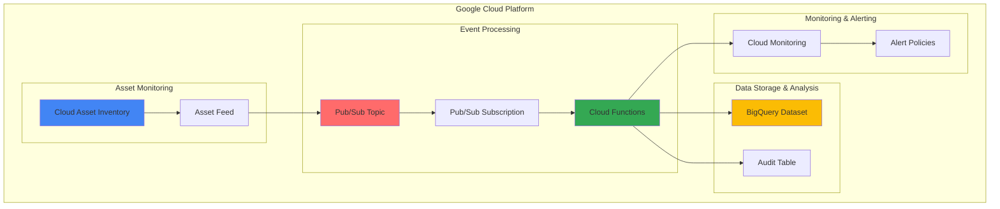

# Infrastructure Change Monitoring with Cloud Asset Inventory and Pub/Sub

## Problem

Organizations need real-time visibility into infrastructure changes to maintain security posture, ensure compliance with regulatory requirements, and track resource modifications across their Google Cloud environment. Manual monitoring of infrastructure changes is time-consuming, error-prone, and doesn't scale with growing cloud environments, leading to potential security vulnerabilities and compliance violations.

## Solution

Build an automated infrastructure change monitoring system that leverages Cloud Asset Inventory to track resource modifications in real-time, processes change events through Pub/Sub messaging, and stores audit data in BigQuery for compliance reporting and historical analysis.

## Architecture Diagram



## Prerequisites

1. Google Cloud project with billing enabled
2. gcloud CLI installed and configured (version 400.0.0 or later)
3. Project Editor or custom role with Asset Inventory and Pub/Sub permissions
4. Basic understanding of Google Cloud IAM and resource management
5. Estimated cost: $20-50/month for moderate infrastructure monitoring (varies by message volume and BigQuery usage)

> **Note**: Cloud Asset Inventory feeds can take up to 10 minutes to become active and begin publishing messages.

## Preparation

```bash
# Set environment variables for the project
export PROJECT_ID=$(gcloud config get-value project)
export REGION="us-central1"
export ZONE="us-central1-a"

# Generate unique suffix for resource names
RANDOM_SUFFIX=$(openssl rand -hex 3)
export TOPIC_NAME="infrastructure-changes-${RANDOM_SUFFIX}"
export SUBSCRIPTION_NAME="infrastructure-changes-sub-${RANDOM_SUFFIX}"
export FUNCTION_NAME="process-asset-changes-${RANDOM_SUFFIX}"
export DATASET_NAME="infrastructure_audit_${RANDOM_SUFFIX}"
export FEED_NAME="infrastructure-feed-${RANDOM_SUFFIX}"

# Set default project and region
gcloud config set project ${PROJECT_ID}
gcloud config set compute/region ${REGION}
gcloud config set functions/region ${REGION}

# Enable required APIs
gcloud services enable cloudasset.googleapis.com \
    pubsub.googleapis.com \
    cloudfunctions.googleapis.com \
    bigquery.googleapis.com \
    monitoring.googleapis.com

echo "✅ Project configured: ${PROJECT_ID}"
echo "✅ Required APIs enabled"
```

## Steps

1. **Create Pub/Sub Topic for Asset Change Events**:

   Pub/Sub provides a reliable messaging infrastructure that can handle high-volume event streams with guaranteed delivery. Creating a dedicated topic for infrastructure changes ensures proper isolation and allows for flexible subscription patterns that can scale as your monitoring needs grow.

   ```bash
   # Create the Pub/Sub topic for asset changes
   gcloud pubsub topics create ${TOPIC_NAME}
   
   # Create subscription for processing
   gcloud pubsub subscriptions create ${SUBSCRIPTION_NAME} \
       --topic=${TOPIC_NAME} \
       --ack-deadline=60
   
   echo "✅ Pub/Sub topic and subscription created"
   ```

   The topic is now ready to receive asset change notifications with a 60-second acknowledgment deadline, providing sufficient time for Cloud Functions to process complex change events while ensuring reliable message delivery.

2. **Create BigQuery Dataset and Table for Audit Data**:

   BigQuery serves as the analytical foundation for compliance reporting and historical trend analysis. The schema design captures essential asset change metadata including timestamps, resource types, and change details that auditors and security teams require for governance activities.

   ```bash
   # Create BigQuery dataset
   bq mk --location=${REGION} ${DATASET_NAME}
   
   # Create table for asset changes with compliance schema
   bq mk --table ${PROJECT_ID}:${DATASET_NAME}.asset_changes \
   timestamp:TIMESTAMP,asset_name:STRING,asset_type:STRING,change_type:STRING,prior_state:STRING,current_state:STRING,project_id:STRING,location:STRING,change_time:TIMESTAMP,ancestors:STRING
   
   echo "✅ BigQuery dataset and table created"
   ```

   The audit table structure supports comprehensive compliance reporting with fields that track resource lineage, geographical location, and detailed change states for regulatory requirements and security analysis.

3. **Create Cloud Function to Process Asset Changes**:

   Cloud Functions provides serverless event processing that automatically scales based on message volume. This function transforms raw asset change events into structured audit records while implementing business logic for filtering, enrichment, and alerting based on change significance.

   ```bash
   # Create deployment package directory
   mkdir -p /tmp/asset-processor
   cd /tmp/asset-processor
   
   # Create the function code
   cat > main.py << 'EOF'
import base64
import json
import logging
from datetime import datetime
from google.cloud import bigquery
from google.cloud import monitoring_v3

def process_asset_change(event, context):
    """Process asset change events from Cloud Asset Inventory."""
    
    # Initialize clients
    bq_client = bigquery.Client()
    monitoring_client = monitoring_v3.MetricServiceClient()
    
    # Decode Pub/Sub message
    pubsub_message = base64.b64decode(event['data']).decode('utf-8')
    
    # Skip welcome messages
    if pubsub_message.startswith('Welcome'):
        logging.info('Received welcome message, skipping processing')
        return
    
    try:
        # Parse JSON message
        change_data = json.loads(pubsub_message)
        
        # Extract asset information
        asset = change_data.get('asset', {})
        prior_asset = change_data.get('priorAsset', {})
        
        # Determine change type
        change_type = 'DELETED' if prior_asset and not asset else \
                     'CREATED' if asset and not prior_asset else \
                     'UPDATED'
        
        # Prepare BigQuery row
        row = {
            'timestamp': datetime.utcnow().isoformat(),
            'asset_name': asset.get('name', '') if asset else prior_asset.get('name', ''),
            'asset_type': asset.get('assetType', '') if asset else prior_asset.get('assetType', ''),
            'change_type': change_type,
            'prior_state': json.dumps(prior_asset.get('resource', {}).get('data', {})),
            'current_state': json.dumps(asset.get('resource', {}).get('data', {})),
            'project_id': context.resource.split('/')[-1] if hasattr(context, 'resource') else '',
            'location': asset.get('resource', {}).get('location', '') if asset else '',
            'change_time': change_data.get('window', {}).get('startTime', ''),
            'ancestors': ','.join(asset.get('ancestors', [])) if asset else ''
        }
        
        # Insert into BigQuery
        table_ref = bq_client.dataset(os.environ['DATASET_NAME']).table('asset_changes')
        errors = bq_client.insert_rows_json(table_ref, [row])
        
        if errors:
            logging.error(f'BigQuery insert errors: {errors}')
        else:
            logging.info(f'Successfully processed {change_type} for {row["asset_name"]}')
            
        # Send custom metric to Cloud Monitoring
        project_name = f"projects/{os.environ['PROJECT_ID']}"
        series = monitoring_v3.TimeSeries()
        series.metric.type = 'custom.googleapis.com/infrastructure/changes'
        series.metric.labels['change_type'] = change_type
        series.metric.labels['asset_type'] = row['asset_type']
        
        now = datetime.utcnow()
        interval = monitoring_v3.TimeInterval()
        interval.end_time.seconds = int(now.timestamp())
        interval.end_time.nanos = int((now.timestamp() % 1) * 10**9)
        
        point = monitoring_v3.Point()
        point.interval = interval
        point.value.int64_value = 1
        series.points = [point]
        
        series.resource.type = 'global'
        series.resource.labels['project_id'] = os.environ['PROJECT_ID']
        
        monitoring_client.create_time_series(
            name=project_name, 
            time_series=[series]
        )
        
    except Exception as e:
        logging.error(f'Error processing asset change: {str(e)}')
        raise

import os
EOF
   
   # Create requirements.txt
   cat > requirements.txt << 'EOF'
google-cloud-bigquery==3.13.0
google-cloud-monitoring==2.16.0
EOF
   
   echo "✅ Cloud Function code created"
   ```

   The function implements comprehensive error handling and logging while creating custom metrics that enable operational monitoring of the change detection system itself, ensuring visibility into both infrastructure changes and monitoring system health.

4. **Deploy Cloud Function with Proper IAM Permissions**:

   Deploying the Cloud Function with appropriate IAM roles ensures secure access to BigQuery and Cloud Monitoring while maintaining the principle of least privilege. The function runtime configuration optimizes for reliability and performance under varying event loads.

   ```bash
   # Deploy the Cloud Function
   gcloud functions deploy ${FUNCTION_NAME} \
       --runtime python39 \
       --trigger-topic ${TOPIC_NAME} \
       --entry-point process_asset_change \
       --memory 256MB \
       --timeout 60s \
       --set-env-vars PROJECT_ID=${PROJECT_ID},DATASET_NAME=${DATASET_NAME}
   
   # Get the function's service account
   FUNCTION_SA=$(gcloud functions describe ${FUNCTION_NAME} \
       --format="value(serviceAccountEmail)")
   
   # Grant necessary permissions
   gcloud projects add-iam-policy-binding ${PROJECT_ID} \
       --member="serviceAccount:${FUNCTION_SA}" \
       --role="roles/bigquery.dataEditor"
   
   gcloud projects add-iam-policy-binding ${PROJECT_ID} \
       --member="serviceAccount:${FUNCTION_SA}" \
       --role="roles/monitoring.metricWriter"
   
   echo "✅ Cloud Function deployed with IAM permissions"
   ```

   The function is now deployed with optimized resource allocation and proper security permissions, ready to process asset change events at scale while maintaining data integrity and operational observability.

5. **Create Cloud Asset Inventory Feed**:

   The Asset Inventory feed establishes real-time monitoring of all resource types across the project, ensuring comprehensive coverage of infrastructure changes. Feed configuration includes filtering options and content types that determine the granularity of change detection and notification frequency.

   ```bash
   # Create the asset feed for real-time monitoring
   gcloud asset feeds create ${FEED_NAME} \
       --project=${PROJECT_ID} \
       --pubsub-topic=projects/${PROJECT_ID}/topics/${TOPIC_NAME} \
       --content-type=RESOURCE \
       --asset-types=".*"
   
   echo "✅ Asset feed created for comprehensive monitoring"
   ```

   The feed now monitors all asset types with resource content, providing detailed change information that includes both current and previous states for comprehensive audit trails and compliance reporting.

6. **Create Cloud Monitoring Alert Policies**:

   Alert policies provide proactive notification of critical infrastructure changes, enabling rapid response to security incidents or compliance violations. The alerting system combines threshold-based detection with intelligent notification routing for operational teams.

   ```bash
   # Create alert policy for critical asset changes
   cat > alert-policy.json << EOF
{
  "displayName": "Critical Infrastructure Changes",
  "conditions": [
    {
      "displayName": "High Change Rate",
      "conditionThreshold": {
        "filter": "resource.type=\"global\" AND metric.type=\"custom.googleapis.com/infrastructure/changes\"",
        "comparison": "COMPARISON_GREATER_THAN",
        "thresholdValue": "10",
        "duration": "300s",
        "aggregations": [
          {
            "alignmentPeriod": "60s",
            "perSeriesAligner": "ALIGN_RATE",
            "crossSeriesReducer": "REDUCE_SUM"
          }
        ]
      }
    }
  ],
  "alertStrategy": {
    "autoClose": "1800s"
  },
  "combiner": "OR",
  "enabled": true
}
EOF
   
   # Create the alert policy
   gcloud alpha monitoring policies create --policy-from-file=alert-policy.json
   
   echo "✅ Alert policy created for change rate monitoring"
   ```

   The alert policy monitors for unusual change patterns that could indicate security incidents, automated deployment issues, or compliance violations, enabling rapid response to infrastructure anomalies.

## Validation & Testing

1. **Verify Asset Feed is Active**:

   ```bash
   # Check feed status
   gcloud asset feeds list --project=${PROJECT_ID}
   
   # Verify Pub/Sub topic has the feed subscription
   gcloud pubsub topics list-subscriptions ${TOPIC_NAME}
   ```

   Expected output: Feed should show as active with the correct Pub/Sub topic configuration.

2. **Test Infrastructure Change Detection**:

   ```bash
   # Create a test resource to trigger change detection
   gcloud compute addresses create test-address-${RANDOM_SUFFIX} \
       --region=${REGION}
   
   # Wait for change event processing
   sleep 30
   
   # Check BigQuery for the recorded change
   bq query --use_legacy_sql=false \
   "SELECT timestamp, asset_name, change_type, asset_type 
    FROM \`${PROJECT_ID}.${DATASET_NAME}.asset_changes\` 
    WHERE asset_name LIKE '%test-address%' 
    ORDER BY timestamp DESC LIMIT 5"
   
   # Clean up test resource
   gcloud compute addresses delete test-address-${RANDOM_SUFFIX} \
       --region=${REGION} --quiet
   ```

   Expected output: Query should return records showing the creation and deletion of the test address.

3. **Verify Cloud Function Processing**:

   ```bash
   # Check function logs
   gcloud functions logs read ${FUNCTION_NAME} --limit=10
   
   # Verify custom metrics in Cloud Monitoring
   gcloud logging read "resource.type=cloud_function AND \
   resource.labels.function_name=${FUNCTION_NAME}" --limit=5
   ```

   Expected output: Logs should show successful processing of asset change events.

## Cleanup

1. **Remove Asset Feed**:

   ```bash
   # Delete the asset feed
   gcloud asset feeds delete ${FEED_NAME} --project=${PROJECT_ID}
   
   echo "✅ Asset feed deleted"
   ```

2. **Remove Cloud Function and Pub/Sub Resources**:

   ```bash
   # Delete Cloud Function
   gcloud functions delete ${FUNCTION_NAME} --quiet
   
   # Delete Pub/Sub subscription and topic
   gcloud pubsub subscriptions delete ${SUBSCRIPTION_NAME}
   gcloud pubsub topics delete ${TOPIC_NAME}
   
   echo "✅ Function and messaging resources deleted"
   ```

3. **Remove BigQuery Dataset**:

   ```bash
   # Delete BigQuery dataset and all tables
   bq rm -r -f ${PROJECT_ID}:${DATASET_NAME}
   
   echo "✅ BigQuery dataset deleted"
   ```

4. **Clean up Alert Policies**:

   ```bash
   # List and delete alert policies (manual cleanup)
   gcloud alpha monitoring policies list \
       --filter="displayName:'Critical Infrastructure Changes'"
   
   # Note: Delete specific policies manually using their IDs
   
   echo "✅ Alert policies require manual cleanup"
   ```

## Discussion

This infrastructure change monitoring solution addresses critical operational and compliance requirements by providing real-time visibility into Google Cloud resource modifications. The architecture leverages Cloud Asset Inventory's comprehensive tracking capabilities, which monitor all supported resource types across projects, folders, and organizations with minimal latency.

The integration pattern between Cloud Asset Inventory, Pub/Sub, and Cloud Functions creates a scalable event-driven architecture that can handle enterprise-scale infrastructure changes. Pub/Sub's guaranteed delivery and automatic scaling ensure that no change events are lost, even during high-volume periods such as automated deployments or disaster recovery scenarios. The serverless Cloud Functions component automatically scales based on message volume, providing cost-effective processing that adapts to varying operational loads.

BigQuery serves as the analytical foundation for compliance reporting and forensic analysis. The structured audit trail enables organizations to meet regulatory requirements such as SOX, GDPR, and industry-specific compliance frameworks. The schema design supports complex queries for identifying access pattern changes, resource sprawl, and potential security violations. Historical data retention in BigQuery enables trend analysis that can inform capacity planning and security posture improvements.

The monitoring and alerting layer provides proactive detection of anomalous change patterns that could indicate security incidents, misconfigurations, or unauthorized access. Custom metrics integration with Cloud Monitoring enables the creation of sophisticated alert policies that can distinguish between normal operational changes and potentially problematic modifications based on velocity, scope, and resource criticality.

> **Tip**: Consider implementing additional filtering logic in the Cloud Function to exclude routine operational changes and focus alerting on security-relevant modifications such as IAM policy changes, firewall rule modifications, and data access configuration updates.

For more information, see the [Cloud Asset Inventory documentation](https://cloud.google.com/asset-inventory/docs), [Pub/Sub best practices](https://cloud.google.com/pubsub/docs/best-practices), [Cloud Functions event-driven patterns](https://cloud.google.com/functions/docs/concepts/events-triggers), [BigQuery compliance features](https://cloud.google.com/bigquery/docs/information-security), and [Cloud Monitoring alerting strategies](https://cloud.google.com/monitoring/alerts/concepts-indepth).

## Challenge

Extend this solution by implementing these enhancements:

1. **Multi-Project Federation**: Configure asset feeds across multiple projects and organizations to create a centralized monitoring hub with project-specific filtering and routing.

2. **Intelligent Change Classification**: Implement machine learning-based change classification using Vertex AI to automatically categorize changes as routine, significant, or critical based on historical patterns.

3. **Integration with Security Command Center**: Connect the monitoring system with Security Command Center to automatically generate security findings for high-risk infrastructure changes.

4. **Automated Remediation Workflows**: Build Cloud Workflows that automatically respond to specific change types, such as reverting unauthorized firewall modifications or notifying resource owners of policy violations.

5. **Advanced Analytics Dashboard**: Create a Looker or Data Studio dashboard with real-time visualizations of change patterns, compliance metrics, and security posture trends for executive reporting.

## Infrastructure Code

*Infrastructure code will be generated after recipe approval.*