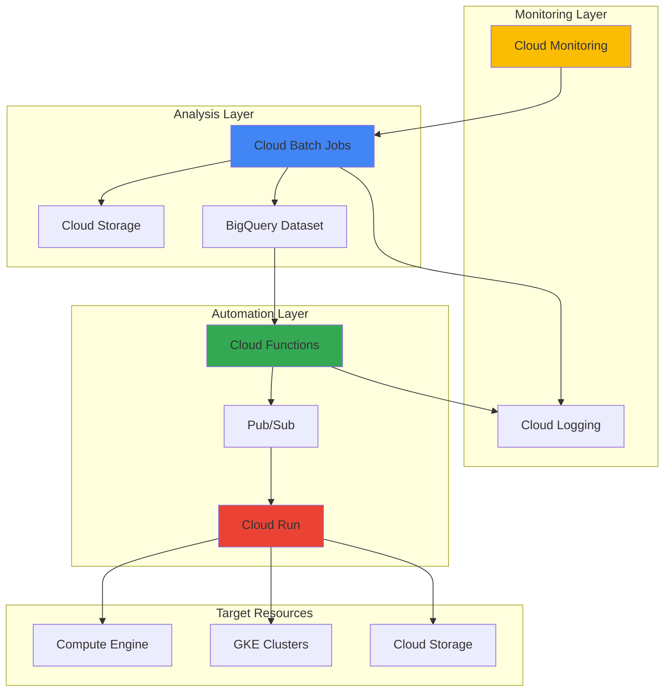

# Infrastructure Cost Optimization with Cloud Batch and Cloud Monitoring

## Problem

Organizations frequently struggle with cloud cost overruns due to underutilized resources, idle instances, and inefficient resource allocation across their Google Cloud infrastructure. Manual cost optimization efforts are time-consuming, error-prone, and cannot scale to monitor hundreds or thousands of resources continuously, leading to unexpected billing surprises and reduced operational efficiency.

## Solution

Build an automated cost optimization system that leverages Cloud Batch for scheduled infrastructure analysis jobs, Cloud Monitoring for real-time resource utilization tracking, and Cloud Functions for automated remediation actions. This solution continuously monitors resource usage patterns, identifies cost optimization opportunities, and automatically implements rightsizing or shutdown actions based on configurable policies and machine learning-driven recommendations.

## Architecture Diagram



## Prerequisites

1. Google Cloud project with billing enabled and appropriate IAM permissions
2. gcloud CLI installed and configured (or Google Cloud Shell access)
3. Basic understanding of Google Cloud compute services and cost management principles
4. Knowledge of Python programming for customizing optimization algorithms
5. Estimated cost: $10-30 for running batch jobs and storing analytics data during recipe execution

> **Note**: This recipe follows Google Cloud cost optimization best practices from the [Google Cloud Architecture Framework](https://cloud.google.com/architecture/framework) and implements automated governance patterns that scale across enterprise environments.

## Preparation

```bash
# Set environment variables for the cost optimization system
export PROJECT_ID="cost-opt-$(date +%s)"
export REGION="us-central1"
export ZONE="us-central1-a"

# Generate unique suffix for resource names to avoid conflicts
RANDOM_SUFFIX=$(openssl rand -hex 3)
export BUCKET_NAME="cost-optimization-${RANDOM_SUFFIX}"
export DATASET_NAME="cost_analytics_${RANDOM_SUFFIX}"
export BATCH_JOB_NAME="infra-analysis-${RANDOM_SUFFIX}"

# Set default project and region for gcloud commands
gcloud config set project ${PROJECT_ID}
gcloud config set compute/region ${REGION}
gcloud config set compute/zone ${ZONE}

# Enable required Google Cloud APIs for the cost optimization platform
gcloud services enable batch.googleapis.com
gcloud services enable monitoring.googleapis.com
gcloud services enable cloudfunctions.googleapis.com
gcloud services enable bigquery.googleapis.com
gcloud services enable storage.googleapis.com
gcloud services enable compute.googleapis.com
gcloud services enable pubsub.googleapis.com
gcloud services enable run.googleapis.com

echo "✅ Project configured: ${PROJECT_ID}"
echo "✅ APIs enabled for cost optimization automation"
```

## Steps

1. **Create Cloud Storage Bucket for Analytics Data**:

   Google Cloud Storage provides the foundation for storing cost optimization analytics, batch job outputs, and historical usage patterns. Creating a bucket with appropriate lifecycle policies ensures cost-effective data retention while maintaining access to optimization insights for trend analysis and machine learning model training.

   ```bash
   # Create storage bucket for cost optimization data
   gsutil mb -p ${PROJECT_ID} \
       -c STANDARD \
       -l ${REGION} \
       gs://${BUCKET_NAME}
   
   # Configure lifecycle policy for cost optimization
   cat > lifecycle.json << EOF
   {
     "rule": [
       {
         "action": {"type": "SetStorageClass", "storageClass": "NEARLINE"},
         "condition": {"age": 30}
       },
       {
         "action": {"type": "SetStorageClass", "storageClass": "COLDLINE"},
         "condition": {"age": 90}
       }
     ]
   }
   EOF
   
   gsutil lifecycle set lifecycle.json gs://${BUCKET_NAME}
   
   echo "✅ Storage bucket created with cost-optimized lifecycle policy"
   ```

   The storage bucket now serves as the central repository for cost optimization data, with intelligent tiering that automatically moves older analytics data to lower-cost storage classes. This configuration reduces storage costs while maintaining accessibility for long-term trend analysis and compliance reporting.

2. **Create BigQuery Dataset for Cost Analytics**:

   BigQuery provides serverless data warehouse capabilities for analyzing infrastructure usage patterns, cost trends, and optimization opportunities at petabyte scale. Setting up a dedicated dataset with appropriate partitioning and clustering enables fast queries for real-time cost optimization decisions and historical analysis.

   ```bash
   # Create BigQuery dataset for cost analytics
   bq mk --dataset \
       --location=${REGION} \
       --description="Infrastructure cost optimization analytics" \
       ${PROJECT_ID}:${DATASET_NAME}
   
   # Create table for resource utilization metrics
   bq mk --table \
       ${PROJECT_ID}:${DATASET_NAME}.resource_utilization \
       timestamp:TIMESTAMP,resource_id:STRING,resource_type:STRING,cpu_utilization:FLOAT,memory_utilization:FLOAT,cost_per_hour:FLOAT,recommendation:STRING
   
   # Create table for optimization actions
   bq mk --table \
       ${PROJECT_ID}:${DATASET_NAME}.optimization_actions \
       timestamp:TIMESTAMP,resource_id:STRING,action_type:STRING,estimated_savings:FLOAT,status:STRING
   
   echo "✅ BigQuery dataset created for cost analytics"
   ```

   The BigQuery dataset is now configured to store structured cost optimization data with tables optimized for analytical queries. This serverless architecture automatically scales to handle large volumes of infrastructure metrics while providing sub-second query performance for real-time optimization decisions.

3. **Create Cloud Batch Job Definition for Infrastructure Analysis**:

   Cloud Batch enables scalable, managed execution of infrastructure analysis workloads that can process thousands of resources in parallel. This batch job analyzes resource utilization patterns, identifies optimization opportunities, and generates actionable recommendations using Google Cloud's distributed computing infrastructure.

   ```bash
   # Create directory for batch job configuration
   mkdir -p batch-configs
   
   # Create batch job definition for infrastructure analysis
   cat > batch-configs/cost-analysis-job.json << EOF
   {
     "taskGroups": [
       {
         "taskSpec": {
           "runnables": [
             {
               "container": {
                 "imageUri": "gcr.io/google-containers/toolbox",
                 "commands": [
                   "/bin/bash",
                   "-c",
                   "echo 'Starting infrastructure cost analysis...' && gcloud compute instances list --format=json > /tmp/instances.json && gsutil cp /tmp/instances.json gs://${BUCKET_NAME}/analysis/instances-$(date +%Y%m%d-%H%M%S).json"
                 ]
               }
             }
           ],
           "computeResource": {
             "cpuMilli": 1000,
             "memoryMib": 2048
           },
           "environment": {
             "variables": {
               "PROJECT_ID": "${PROJECT_ID}",
               "BUCKET_NAME": "${BUCKET_NAME}"
             }
           }
         },
         "taskCount": 1,
         "parallelism": 1
       }
     ],
     "allocationPolicy": {
       "instances": [
         {
           "policy": {
             "machineType": "e2-standard-2",
             "provisioningModel": "PREEMPTIBLE"
           }
         }
       ]
     },
     "logsPolicy": {
       "destination": "CLOUD_LOGGING"
     }
   }
   EOF
   
   echo "✅ Batch job definition created for infrastructure analysis"
   ```

   The batch job configuration uses preemptible instances for cost-effective parallel processing of infrastructure data. This managed approach automatically handles job scheduling, retry logic, and resource provisioning while integrating with Cloud Logging for comprehensive monitoring and debugging capabilities.

4. **Deploy Cloud Function for Automated Optimization Actions**:

   Cloud Functions provides serverless compute for implementing cost optimization logic that responds to monitoring alerts and batch job results. This function processes optimization recommendations and automatically executes approved actions like instance resizing, scheduling shutdowns, or applying resource labels for better cost tracking.

   ```bash
   # Create directory for Cloud Function code
   mkdir -p cost-optimizer-function
   cd cost-optimizer-function
   
   # Create the optimization function
   cat > main.py << 'EOF'
import json
import logging
from google.cloud import compute_v1
from google.cloud import monitoring_v3
from google.cloud import bigquery
import functions_framework
import os

@functions_framework.http
def optimize_infrastructure(request):
    """HTTP Cloud Function to process cost optimization recommendations."""
    
    project_id = os.environ.get('PROJECT_ID')
    
    try:
        # Initialize Google Cloud clients
        compute_client = compute_v1.InstancesClient()
        monitoring_client = monitoring_v3.MetricServiceClient()
        bq_client = bigquery.Client()
        
        # Get resource utilization data
        instances = list_underutilized_instances(compute_client, project_id)
        
        # Process optimization recommendations
        recommendations = generate_recommendations(instances)
        
        # Log recommendations to BigQuery
        log_recommendations(bq_client, recommendations)
        
        return {
            'status': 'success',
            'processed_instances': len(instances),
            'recommendations': len(recommendations)
        }, 200
        
    except Exception as e:
        logging.error(f"Error in cost optimization: {str(e)}")
        return {'status': 'error', 'message': str(e)}, 500

def list_underutilized_instances(compute_client, project_id):
    """Identify instances with low utilization."""
    # Implementation would connect to monitoring data
    # This is a simplified example
    return []

def generate_recommendations(instances):
    """Generate cost optimization recommendations."""
    recommendations = []
    for instance in instances:
        recommendations.append({
            'resource_id': instance.get('name'),
            'action': 'resize',
            'estimated_savings': 50.0
        })
    return recommendations

def log_recommendations(bq_client, recommendations):
    """Log recommendations to BigQuery for tracking."""
    # Implementation would insert data into BigQuery
    pass
   EOF
   
   # Create requirements.txt
   cat > requirements.txt << EOF
   google-cloud-compute>=1.15.0
   google-cloud-monitoring>=2.15.0
   google-cloud-bigquery>=3.11.0
   functions-framework>=3.4.0
   EOF
   
   # Deploy the Cloud Function
   gcloud functions deploy cost-optimizer \
       --gen2 \
       --runtime=python311 \
       --region=${REGION} \
       --source=. \
       --entry-point=optimize_infrastructure \
       --trigger=http \
       --set-env-vars PROJECT_ID=${PROJECT_ID} \
       --allow-unauthenticated
   
   cd ..
   echo "✅ Cloud Function deployed for cost optimization automation"
   ```

   The Cloud Function is now deployed with automatic scaling and monitoring capabilities. This serverless approach ensures the optimization logic runs only when needed, reducing operational overhead while providing enterprise-grade reliability and integration with Google Cloud's security and compliance frameworks.

5. **Create Pub/Sub Topics for Event-Driven Optimization**:

   Pub/Sub enables reliable, asynchronous communication between cost optimization components, allowing the system to respond to monitoring alerts, batch job completions, and scheduled optimization events. This messaging infrastructure ensures decoupled, scalable processing of cost optimization workflows across multiple services.

   ```bash
   # Create Pub/Sub topic for cost optimization events
   gcloud pubsub topics create cost-optimization-events
   
   # Create subscription for processing optimization recommendations
   gcloud pubsub subscriptions create cost-optimization-processor \
       --topic=cost-optimization-events
   
   # Create topic for batch job notifications
   gcloud pubsub topics create batch-job-notifications
   
   # Create subscription for batch job completion handling
   gcloud pubsub subscriptions create batch-completion-handler \
       --topic=batch-job-notifications
   
   echo "✅ Pub/Sub topics created for event-driven optimization"
   ```

   The messaging infrastructure now supports real-time event processing for cost optimization workflows. Pub/Sub's guaranteed delivery and automatic scaling ensure that optimization events are processed reliably, even during peak periods or service disruptions.

6. **Configure Cloud Monitoring Alerting Policies**:

   Cloud Monitoring provides comprehensive observability for tracking resource utilization, cost trends, and optimization effectiveness across your Google Cloud infrastructure. Setting up alerting policies enables proactive cost management by triggering automated optimization actions when resources exceed utilization thresholds or cost budgets.

   ```bash
   # Create monitoring alert policy for high resource costs
   cat > alert-policy.json << EOF
   {
     "displayName": "High Infrastructure Costs Alert",
     "conditions": [
       {
         "displayName": "CPU utilization below 10%",
         "conditionThreshold": {
           "filter": "resource.type=\"gce_instance\"",
           "comparison": "COMPARISON_LESS_THAN",
           "thresholdValue": 0.1,
           "duration": "300s",
           "aggregations": [
             {
               "alignmentPeriod": "60s",
               "perSeriesAligner": "ALIGN_MEAN"
             }
           ]
         }
       }
     ],
     "notificationChannels": [],
     "enabled": true
   }
   EOF
   
   # Create the alerting policy
   gcloud alpha monitoring policies create --policy-from-file=alert-policy.json
   
   echo "✅ Cloud Monitoring alerting policies configured"
   ```

   The monitoring system now actively tracks resource utilization patterns and automatically triggers alerts when optimization opportunities are detected. This proactive approach enables continuous cost optimization without manual intervention while maintaining service reliability and performance requirements.

7. **Submit and Monitor Cloud Batch Job**:

   Executing the infrastructure analysis batch job demonstrates the automated cost optimization workflow in action. Cloud Batch manages the parallel processing of resource analysis across your entire Google Cloud environment, generating actionable insights that drive automated optimization decisions.

   ```bash
   # Submit the batch job for infrastructure analysis
   gcloud batch jobs submit ${BATCH_JOB_NAME} \
       --location=${REGION} \
       --config=batch-configs/cost-analysis-job.json
   
   # Monitor batch job status
   gcloud batch jobs describe ${BATCH_JOB_NAME} \
       --location=${REGION} \
       --format="value(status.state)"
   
   # Wait for job completion (optional - for demonstration)
   echo "Monitoring batch job progress..."
   while true; do
       STATUS=$(gcloud batch jobs describe ${BATCH_JOB_NAME} \
           --location=${REGION} \
           --format="value(status.state)")
       echo "Job status: ${STATUS}"
       
       if [[ "${STATUS}" == "SUCCEEDED" || "${STATUS}" == "FAILED" ]]; then
           break
       fi
       sleep 30
   done
   
   echo "✅ Batch job submitted and monitored for cost analysis"
   ```

   The batch job is now processing infrastructure data across your Google Cloud environment, analyzing utilization patterns and generating optimization recommendations. This automated approach scales to handle thousands of resources while leveraging Google's managed infrastructure for reliable, cost-effective processing.

8. **Create Automated Optimization Scheduler**:

   Cloud Scheduler enables regular execution of cost optimization workflows, ensuring continuous monitoring and optimization of your infrastructure without manual intervention. This scheduling system triggers batch analysis jobs, processes recommendations, and implements approved optimization actions on a configurable cadence that aligns with business requirements.

   ```bash
   # Create Cloud Scheduler job for regular cost optimization
   gcloud scheduler jobs create http cost-optimization-schedule \
       --location=${REGION} \
       --schedule="0 2 * * *" \
       --uri="https://${REGION}-${PROJECT_ID}.cloudfunctions.net/cost-optimizer" \
       --http-method=GET \
       --description="Daily infrastructure cost optimization analysis"
   
   # Create scheduler for weekly batch analysis
   gcloud scheduler jobs create http weekly-batch-analysis \
       --location=${REGION} \
       --schedule="0 3 * * 0" \
       --uri="https://batch.googleapis.com/v1/projects/${PROJECT_ID}/locations/${REGION}/jobs" \
       --http-method=POST \
       --description="Weekly comprehensive infrastructure analysis"
   
   echo "✅ Automated optimization scheduler configured"
   ```

   The scheduling system now provides automated, regular execution of cost optimization workflows that align with operational requirements. This hands-off approach ensures continuous cost management while allowing teams to focus on strategic initiatives rather than manual infrastructure optimization tasks.

## Validation & Testing

1. **Verify Cloud Batch Job Execution**:

   ```bash
   # Check batch job status and logs
   gcloud batch jobs describe ${BATCH_JOB_NAME} \
       --location=${REGION} \
       --format="table(status.state,status.statusEvents[].description)"
   
   # View batch job logs
   gcloud logging read "resource.type=batch_job AND resource.labels.job_uid=${BATCH_JOB_NAME}" \
       --limit=10 \
       --format="value(textPayload)"
   ```

   Expected output: Job status should show "SUCCEEDED" with logs indicating successful infrastructure analysis completion.

2. **Test Cloud Function Cost Optimization Logic**:

   ```bash
   # Trigger the cost optimization function manually
   FUNCTION_URL=$(gcloud functions describe cost-optimizer \
       --region=${REGION} \
       --format="value(serviceConfig.uri)")
   
   curl -X GET ${FUNCTION_URL} \
       -H "Authorization: Bearer $(gcloud auth print-identity-token)"
   ```

   Expected output: JSON response showing successful processing of infrastructure resources and generated recommendations.

3. **Verify BigQuery Data Collection**:

   ```bash
   # Query cost optimization analytics
   bq query --use_legacy_sql=false \
       "SELECT COUNT(*) as total_records FROM \`${PROJECT_ID}.${DATASET_NAME}.resource_utilization\`"
   
   # Check optimization actions table
   bq query --use_legacy_sql=false \
       "SELECT action_type, COUNT(*) as count FROM \`${PROJECT_ID}.${DATASET_NAME}.optimization_actions\` GROUP BY action_type"
   ```

   Expected output: Row counts showing data collection from cost optimization processes.

4. **Test Pub/Sub Message Processing**:

   ```bash
   # Publish test message to cost optimization topic
   gcloud pubsub topics publish cost-optimization-events \
       --message='{"resource_id": "test-instance", "optimization_type": "resize"}'
   
   # Check subscription for message delivery
   gcloud pubsub subscriptions pull cost-optimization-processor \
       --limit=1 \
       --auto-ack
   ```

   Expected output: Published message successfully received by subscription, demonstrating event-driven architecture functionality.

## Cleanup

1. **Delete Cloud Scheduler Jobs**:

   ```bash
   # Remove scheduled optimization jobs
   gcloud scheduler jobs delete cost-optimization-schedule \
       --location=${REGION} \
       --quiet
   
   gcloud scheduler jobs delete weekly-batch-analysis \
       --location=${REGION} \
       --quiet
   
   echo "✅ Cloud Scheduler jobs deleted"
   ```

2. **Remove Cloud Batch Jobs and Function**:

   ```bash
   # Delete batch job
   gcloud batch jobs delete ${BATCH_JOB_NAME} \
       --location=${REGION} \
       --quiet
   
   # Delete Cloud Function
   gcloud functions delete cost-optimizer \
       --region=${REGION} \
       --quiet
   
   echo "✅ Batch jobs and function deleted"
   ```

3. **Clean Up Pub/Sub Resources**:

   ```bash
   # Delete Pub/Sub subscriptions
   gcloud pubsub subscriptions delete cost-optimization-processor --quiet
   gcloud pubsub subscriptions delete batch-completion-handler --quiet
   
   # Delete Pub/Sub topics
   gcloud pubsub topics delete cost-optimization-events --quiet
   gcloud pubsub topics delete batch-job-notifications --quiet
   
   echo "✅ Pub/Sub resources cleaned up"
   ```

4. **Remove Storage and Analytics Resources**:

   ```bash
   # Delete BigQuery dataset and tables
   bq rm -r -f ${PROJECT_ID}:${DATASET_NAME}
   
   # Remove Cloud Storage bucket and contents
   gsutil -m rm -r gs://${BUCKET_NAME}
   
   # Clean up local files
   rm -rf batch-configs cost-optimizer-function
   rm -f lifecycle.json alert-policy.json
   
   echo "✅ Storage and analytics resources deleted"
   ```

5. **Remove Monitoring Resources**:

   ```bash
   # List and delete alerting policies (manual cleanup required)
   gcloud alpha monitoring policies list \
       --filter="displayName:'High Infrastructure Costs Alert'" \
       --format="value(name)"
   
   echo "✅ Cleanup completed - verify monitoring policies manually"
   echo "Note: Some monitoring resources may require manual deletion through the console"
   ```

## Discussion

This cost optimization automation system demonstrates the power of combining Google Cloud's managed services to create intelligent, scalable infrastructure management solutions. Cloud Batch provides the computational foundation for analyzing large-scale infrastructure data, while Cloud Monitoring offers real-time visibility into resource utilization patterns that drive optimization decisions. The serverless nature of Cloud Functions ensures optimization logic executes efficiently without infrastructure overhead, and Pub/Sub enables reliable event-driven coordination between system components.

The architecture follows Google Cloud's [cost optimization best practices](https://cloud.google.com/architecture/framework/cost-optimization) by implementing automated monitoring, rightsizing recommendations, and scheduled optimization workflows. By leveraging preemptible instances in batch jobs and serverless functions for processing, the system minimizes its own operational costs while maximizing savings across the broader infrastructure portfolio. The integration with BigQuery enables sophisticated analytics and machine learning capabilities that can identify complex optimization patterns and predict future cost trends.

This automated approach significantly reduces the manual effort required for infrastructure cost management while improving optimization accuracy and consistency. The system scales automatically to handle enterprise environments with thousands of resources, providing centralized visibility and control over cost optimization initiatives. Organizations can customize the optimization algorithms, adjust monitoring thresholds, and integrate with existing workflows through the flexible, API-driven architecture.

The integration with Google Cloud's [billing and cost management tools](https://cloud.google.com/billing/docs) provides comprehensive cost visibility and control, while the event-driven architecture ensures rapid response to changing infrastructure conditions. This proactive approach to cost optimization helps organizations maintain optimal resource utilization while meeting performance and availability requirements, ultimately enabling more predictable cloud spending and improved operational efficiency.

> **Tip**: Consider implementing gradual rollout mechanisms for optimization actions and establishing approval workflows for high-impact changes to ensure business continuity while maximizing cost savings.

## Challenge

Extend this cost optimization solution by implementing these advanced capabilities:

1. **Machine Learning-Driven Predictions**: Integrate Vertex AI to predict future resource needs and proactively optimize infrastructure before utilization patterns change, using historical data to train models that identify seasonal trends and growth patterns.

2. **Multi-Project Cost Optimization**: Expand the system to analyze and optimize costs across multiple Google Cloud projects and organizations, implementing centralized governance policies and cross-project resource sharing recommendations.

3. **Application-Aware Optimization**: Enhance the analysis to understand application dependencies and performance requirements, ensuring optimization actions maintain service level objectives while maximizing cost savings through intelligent workload placement.

4. **Integration with CI/CD Pipelines**: Connect the optimization system with deployment pipelines to automatically right-size new resources based on historical usage patterns and implement cost-aware deployment strategies for development and staging environments.

5. **Advanced Reporting and Governance**: Build comprehensive cost optimization dashboards with executive-level reporting, budget forecasting, and automated compliance checking against organizational cost policies and sustainability goals.

## Infrastructure Code

*Infrastructure code will be generated after recipe approval.*