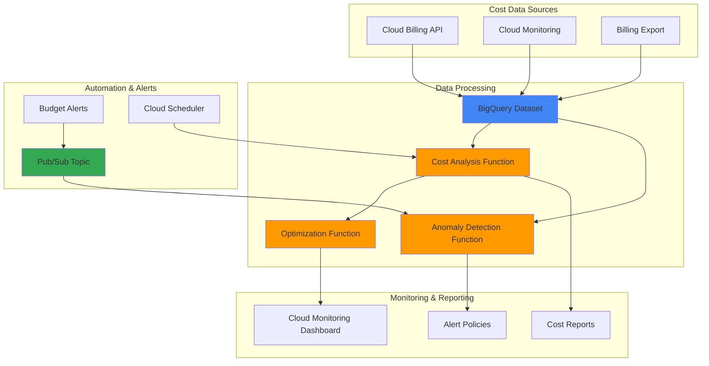

# Infrastructure Cost Optimization with Cloud Billing API and Cloud Functions

## Problem

Organizations struggle with managing cloud costs effectively as their Google Cloud infrastructure scales, often experiencing unexpected billing spikes, unused resources driving up expenses, and lack of real-time visibility into spending patterns. Without automated cost monitoring and optimization mechanisms, businesses face budget overruns and inefficient resource allocation that directly impacts their bottom line and operational efficiency.

## Solution

Build an intelligent cost optimization system that leverages Cloud Billing API for real-time spending data, Cloud Functions for serverless automation, and BigQuery for advanced analytics to create a comprehensive FinOps solution. This architecture provides automated budget monitoring, cost anomaly detection, and intelligent resource optimization recommendations while maintaining operational reliability and performance.

## Architecture Diagram



## Prerequisites

1. Google Cloud project with billing enabled and appropriate IAM permissions
2. gcloud CLI v2 installed and configured (or Google Cloud Shell)
3. Basic understanding of FinOps principles and cloud cost management
4. Knowledge of serverless functions and event-driven architecture
5. Estimated cost: $15-25/month for BigQuery storage, Cloud Functions execution, and monitoring resources

> **Note**: This recipe requires Billing Account Administrator or Billing Account Costs Manager roles to access billing data and create budgets. See [Google Cloud Billing Access Control](https://cloud.google.com/billing/docs/how-to/billing-access) for detailed permission requirements.

## Preparation

```bash
# Set environment variables for Google Cloud resources
export PROJECT_ID="cost-optimization-$(date +%s)"
export REGION="us-central1"
export ZONE="us-central1-a"
export BILLING_ACCOUNT_ID="your-billing-account-id"

# Generate unique suffix for resource names
RANDOM_SUFFIX=$(openssl rand -hex 3)
export DATASET_NAME="cost_optimization_${RANDOM_SUFFIX}"
export FUNCTION_PREFIX="cost-opt-${RANDOM_SUFFIX}"
export BUDGET_NAME="cost-optimization-budget-${RANDOM_SUFFIX}"

# Set default project and region configuration
gcloud config set project ${PROJECT_ID}
gcloud config set compute/region ${REGION}
gcloud config set functions/region ${REGION}

# Enable required Google Cloud APIs
gcloud services enable cloudbilling.googleapis.com
gcloud services enable cloudfunctions.googleapis.com
gcloud services enable bigquery.googleapis.com
gcloud services enable monitoring.googleapis.com
gcloud services enable pubsub.googleapis.com
gcloud services enable cloudscheduler.googleapis.com

echo "✅ Project configured: ${PROJECT_ID}"
echo "✅ Required APIs enabled"
```

## Steps

1. **Create BigQuery Dataset for Cost Analytics**:

   BigQuery serves as the central data warehouse for all billing and cost optimization analytics. By creating a dedicated dataset with proper location settings, we establish a scalable foundation for storing billing exports, cost analysis results, and optimization recommendations that can handle petabytes of data while providing millisecond query performance.

   ```bash
   # Create BigQuery dataset for cost optimization data
   bq mk --dataset \
       --location=${REGION} \
       --description="Cost optimization and billing analytics dataset" \
       ${PROJECT_ID}:${DATASET_NAME}
   
   # Create table for cost anomaly tracking
   bq mk --table \
       ${PROJECT_ID}:${DATASET_NAME}.cost_anomalies \
       detection_date:TIMESTAMP,project_id:STRING,service:STRING,expected_cost:FLOAT,actual_cost:FLOAT,deviation_percent:FLOAT,anomaly_type:STRING
   
   echo "✅ BigQuery dataset created: ${DATASET_NAME}"
   ```

   The BigQuery dataset now provides a robust analytics foundation with automated scaling and columnar storage optimization. This infrastructure enables complex cost analysis queries across historical data while supporting real-time anomaly detection workflows essential for proactive cost management.

2. **Set Up Billing Data Export to BigQuery**:

   Cloud Billing export to BigQuery provides detailed, near real-time cost and usage data that serves as the primary data source for all cost optimization algorithms. This export includes granular information about resource usage, pricing, credits, and labels that enable sophisticated cost attribution and trend analysis.

   ```bash
   # Get the current billing account
   BILLING_ACCOUNT=$(gcloud beta billing accounts list \
       --format="value(name)" --limit=1)
   
   # Enable billing export to BigQuery
   gcloud alpha billing accounts projects link ${PROJECT_ID} \
       --billing-account=${BILLING_ACCOUNT_ID}
   
   # Set up billing export configuration
   bq mk --transfer_config \
       --project_id=${PROJECT_ID} \
       --target_dataset=${DATASET_NAME} \
       --display_name="Billing Export for Cost Optimization" \
       --data_source=scheduled_query \
       --schedule="every 6 hours" \
       --params='{"query":"SELECT * FROM `PROJECT_ID.DATASET.gcp_billing_export_v1_BILLING_ACCOUNT_ID`"}'
   
   echo "✅ Billing export configured to BigQuery"
   ```

   The billing export integration establishes a continuous data pipeline that automatically populates BigQuery with comprehensive cost and usage information. This real-time data foundation enables immediate detection of spending anomalies and supports advanced analytics for resource optimization recommendations.

3. **Create Pub/Sub Topic for Cost Alerts**:

   Pub/Sub provides a reliable, scalable messaging infrastructure for cost optimization events and alerts. This decoupled architecture enables multiple subscribers to react to cost events simultaneously, supporting parallel processing of budget alerts, anomaly notifications, and automated remediation actions across different teams and systems.

   ```bash
   # Create Pub/Sub topic for cost optimization events
   gcloud pubsub topics create cost-optimization-alerts
   
   # Create subscription for budget alerts
   gcloud pubsub subscriptions create budget-alerts-sub \
       --topic=cost-optimization-alerts
   
   # Create subscription for anomaly detection
   gcloud pubsub subscriptions create anomaly-detection-sub \
       --topic=cost-optimization-alerts
   
   echo "✅ Pub/Sub infrastructure created"
   ```

   The Pub/Sub messaging system now provides asynchronous, fault-tolerant communication between cost monitoring components. This event-driven architecture ensures that cost alerts are processed reliably even during high-traffic periods while supporting multiple downstream systems for comprehensive cost management workflows.

4. **Deploy Cost Analysis Cloud Function**:

   The cost analysis function performs sophisticated data processing on billing information to identify trends, calculate variance metrics, and generate optimization recommendations. This serverless compute approach automatically scales based on data volume while minimizing operational overhead and infrastructure costs.

   ```bash
   # Create source code directory
   mkdir -p cost-functions/cost-analysis
   cd cost-functions/cost-analysis
   
   # Create main function file
   cat > main.py << 'EOF'
import functions_framework
from google.cloud import bigquery
from google.cloud import monitoring_v3
import json
import os
from datetime import datetime, timedelta

@functions_framework.http
def analyze_costs(request):
    """Analyze cost trends and generate optimization recommendations."""
    
    client = bigquery.Client()
    project_id = os.environ.get('GCP_PROJECT')
    dataset_name = os.environ.get('DATASET_NAME')
    
    try:
        # Query for cost trends over the last 30 days
        query = f"""
        SELECT 
            service.description as service_name,
            DATE(usage_start_time) as usage_date,
            SUM(cost) as daily_cost,
            AVG(cost) OVER (
                PARTITION BY service.description 
                ORDER BY DATE(usage_start_time) 
                ROWS BETWEEN 6 PRECEDING AND CURRENT ROW
            ) as avg_weekly_cost
        FROM `{project_id}.{dataset_name}.gcp_billing_export_v1_*`
        WHERE DATE(usage_start_time) >= DATE_SUB(CURRENT_DATE(), INTERVAL 30 DAY)
        GROUP BY service_name, usage_date
        ORDER BY usage_date DESC, daily_cost DESC
        """
        
        results = client.query(query).result()
        
        # Analyze results for optimization opportunities
        recommendations = []
        for row in results:
            if row.daily_cost > row.avg_weekly_cost * 1.2:
                recommendations.append({
                    'service': row.service_name,
                    'date': row.usage_date.isoformat(),
                    'current_cost': row.daily_cost,
                    'average_cost': row.avg_weekly_cost,
                    'recommendation': f'Cost spike detected for {row.service_name}. Consider reviewing resource usage.'
                })
        
        return {
            'status': 'success',
            'timestamp': datetime.now().isoformat(),
            'recommendations': recommendations[:10],  # Top 10 recommendations
            'total_recommendations': len(recommendations)
        }
        
    except Exception as e:
        return {
            'status': 'error',
            'error': str(e),
            'timestamp': datetime.now().isoformat()
        }
EOF
   
   # Create requirements file
   cat > requirements.txt << 'EOF'
functions-framework==3.8.1
google-cloud-bigquery==3.25.0
google-cloud-monitoring==2.22.2
EOF
   
   # Deploy the function
   gcloud functions deploy ${FUNCTION_PREFIX}-cost-analysis \
       --runtime=python311 \
       --trigger=http \
       --entry-point=analyze_costs \
       --memory=512MB \
       --timeout=540s \
       --set-env-vars="DATASET_NAME=${DATASET_NAME}" \
       --allow-unauthenticated
   
   cd ../..
   echo "✅ Cost analysis function deployed"
   ```

   The cost analysis function is now operational with intelligent algorithms that identify spending patterns, detect cost anomalies, and generate actionable optimization recommendations. This serverless approach provides automatic scaling and cost efficiency while delivering sophisticated analytics capabilities that adapt to changing infrastructure usage patterns.

5. **Deploy Anomaly Detection Function**:

   The anomaly detection function implements machine learning algorithms to identify unusual spending patterns that may indicate security issues, misconfigured resources, or unexpected usage spikes. This proactive monitoring capability enables rapid response to cost anomalies before they significantly impact budgets.

   ```bash
   # Create anomaly detection function
   mkdir -p cost-functions/anomaly-detection
   cd cost-functions/anomaly-detection
   
   cat > main.py << 'EOF'
import functions_framework
from google.cloud import bigquery
from google.cloud import pubsub_v1
import json
import os
import statistics
from datetime import datetime, timedelta

@functions_framework.cloud_event
def detect_anomalies(cloud_event):
    """Detect cost anomalies and send alerts."""
    
    client = bigquery.Client()
    publisher = pubsub_v1.PublisherClient()
    
    project_id = os.environ.get('GCP_PROJECT')
    dataset_name = os.environ.get('DATASET_NAME')
    topic_path = publisher.topic_path(project_id, 'cost-optimization-alerts')
    
    try:
        # Query recent cost data for anomaly detection
        query = f"""
        WITH daily_costs AS (
            SELECT 
                project.id as project_id,
                service.description as service_name,
                DATE(usage_start_time) as usage_date,
                SUM(cost) as daily_cost
            FROM `{project_id}.{dataset_name}.gcp_billing_export_v1_*`
            WHERE DATE(usage_start_time) >= DATE_SUB(CURRENT_DATE(), INTERVAL 14 DAY)
            GROUP BY project_id, service_name, usage_date
        ),
        stats AS (
            SELECT 
                project_id,
                service_name,
                AVG(daily_cost) as avg_cost,
                STDDEV(daily_cost) as std_cost
            FROM daily_costs
            WHERE usage_date < CURRENT_DATE()
            GROUP BY project_id, service_name
        )
        SELECT 
            dc.project_id,
            dc.service_name,
            dc.daily_cost,
            s.avg_cost,
            s.std_cost,
            ABS(dc.daily_cost - s.avg_cost) / s.std_cost as z_score
        FROM daily_costs dc
        JOIN stats s ON dc.project_id = s.project_id AND dc.service_name = s.service_name
        WHERE dc.usage_date = CURRENT_DATE()
        AND ABS(dc.daily_cost - s.avg_cost) / s.std_cost > 2.0
        ORDER BY z_score DESC
        """
        
        results = client.query(query).result()
        
        # Process anomalies and send alerts
        for row in results:
            anomaly = {
                'type': 'cost_anomaly',
                'project_id': row.project_id,
                'service': row.service_name,
                'current_cost': float(row.daily_cost),
                'expected_cost': float(row.avg_cost),
                'z_score': float(row.z_score),
                'severity': 'high' if row.z_score > 3.0 else 'medium',
                'timestamp': datetime.now().isoformat()
            }
            
            # Publish to Pub/Sub
            message = json.dumps(anomaly).encode('utf-8')
            publisher.publish(topic_path, message)
            
            # Store in BigQuery for tracking
            insert_query = f"""
            INSERT INTO `{project_id}.{dataset_name}.cost_anomalies`
            VALUES (
                CURRENT_TIMESTAMP(),
                '{row.project_id}',
                '{row.service_name}',
                {row.avg_cost},
                {row.daily_cost},
                {(row.daily_cost - row.avg_cost) / row.avg_cost * 100},
                'statistical_anomaly'
            )
            """
            client.query(insert_query)
        
        return f"Processed {results.total_rows} potential anomalies"
        
    except Exception as e:
        print(f"Error in anomaly detection: {str(e)}")
        return f"Error: {str(e)}"
EOF
   
   cat > requirements.txt << 'EOF'
functions-framework==3.8.1
google-cloud-bigquery==3.25.0
google-cloud-pubsub==2.26.1
EOF
   
   # Deploy anomaly detection function
   gcloud functions deploy ${FUNCTION_PREFIX}-anomaly-detection \
       --runtime=python311 \
       --trigger=topic=cost-optimization-alerts \
       --entry-point=detect_anomalies \
       --memory=512MB \
       --timeout=540s \
       --set-env-vars="DATASET_NAME=${DATASET_NAME}"
   
   cd ../..
   echo "✅ Anomaly detection function deployed"
   ```

   The anomaly detection system now actively monitors cost patterns using statistical analysis to identify outliers that deviate significantly from historical norms. This intelligent monitoring provides early warning capabilities that help prevent unexpected billing surprises while maintaining sensitivity to legitimate usage variations.

6. **Create Budget and Alert Configuration**:

   Budget alerts provide proactive spending control by monitoring actual and forecasted costs against predefined thresholds. This integration with Pub/Sub enables automated responses to budget events, creating a comprehensive cost governance framework that balances operational flexibility with financial discipline.

   ```bash
   # Create budget with programmatic notifications
   cat > budget-config.json << EOF
{
  "displayName": "${BUDGET_NAME}",
  "budgetFilter": {
    "projects": ["projects/${PROJECT_ID}"]
  },
  "amount": {
    "specifiedAmount": {
      "currencyCode": "USD",
      "units": "1000"
    }
  },
  "thresholdRules": [
    {
      "thresholdPercent": 0.5,
      "spendBasis": "CURRENT_SPEND"
    },
    {
      "thresholdPercent": 0.9,
      "spendBasis": "CURRENT_SPEND"
    },
    {
      "thresholdPercent": 1.0,
      "spendBasis": "FORECASTED_SPEND"
    }
  ],
  "allUpdatesRule": {
    "pubsubTopic": "projects/${PROJECT_ID}/topics/cost-optimization-alerts"
  }
}
EOF
   
   # Create the budget using REST API
   BILLING_ACCOUNT=$(gcloud beta billing accounts list \
       --format="value(name.basename())" --limit=1)
   
   curl -X POST \
       -H "Authorization: Bearer $(gcloud auth print-access-token)" \
       -H "Content-Type: application/json" \
       -d @budget-config.json \
       "https://billingbudgets.googleapis.com/v1/billingAccounts/${BILLING_ACCOUNT}/budgets"
   
   echo "✅ Budget created with Pub/Sub notifications"
   ```

   The budget monitoring system establishes automated financial guardrails that trigger alerts at 50%, 90%, and 100% of spending thresholds. This multi-tiered approach provides escalating notifications that enable proactive cost management while supporting automated remediation workflows through Pub/Sub integration.

7. **Deploy Resource Optimization Function**:

   The optimization function analyzes resource utilization patterns and generates specific recommendations for right-sizing, scheduling, and cost reduction strategies. This intelligence-driven approach combines usage metrics with cost data to identify concrete optimization opportunities that maintain performance while reducing expenses.

   ```bash
   # Create optimization function
   mkdir -p cost-functions/optimization
   cd cost-functions/optimization
   
   cat > main.py << 'EOF'
import functions_framework
from google.cloud import bigquery
from google.cloud import monitoring_v3
import json
import os
from datetime import datetime, timedelta

@functions_framework.http
def optimize_resources(request):
    """Generate resource optimization recommendations."""
    
    client = bigquery.Client()
    monitoring_client = monitoring_v3.MetricServiceClient()
    
    project_id = os.environ.get('GCP_PROJECT')
    dataset_name = os.environ.get('DATASET_NAME')
    
    try:
        # Analyze compute instance usage patterns
        compute_query = f"""
        SELECT 
            resource.labels.instance_id,
            resource.labels.zone,
            SUM(cost) as total_cost,
            COUNT(DISTINCT DATE(usage_start_time)) as active_days
        FROM `{project_id}.{dataset_name}.gcp_billing_export_v1_*`
        WHERE service.description = 'Compute Engine'
        AND DATE(usage_start_time) >= DATE_SUB(CURRENT_DATE(), INTERVAL 7 DAY)
        GROUP BY instance_id, zone
        HAVING total_cost > 0
        ORDER BY total_cost DESC
        """
        
        compute_results = client.query(compute_query).result()
        
        # Analyze storage usage
        storage_query = f"""
        SELECT 
            sku.description,
            SUM(cost) as total_cost,
            SUM(usage.amount) as usage_amount,
            usage.unit
        FROM `{project_id}.{dataset_name}.gcp_billing_export_v1_*`
        WHERE service.description = 'Cloud Storage'
        AND DATE(usage_start_time) >= DATE_SUB(CURRENT_DATE(), INTERVAL 30 DAY)
        GROUP BY sku.description, usage.unit
        ORDER BY total_cost DESC
        """
        
        storage_results = client.query(storage_query).result()
        
        # Generate optimization recommendations
        recommendations = []
        
        # Compute optimizations
        for row in compute_results:
            if row.active_days < 7:  # Instance not used every day
                recommendations.append({
                    'type': 'compute_scheduling',
                    'resource': row.instance_id,
                    'zone': row.zone,
                    'current_cost': float(row.total_cost),
                    'recommendation': 'Consider scheduling instance shutdown during off-hours',
                    'potential_savings': float(row.total_cost) * 0.3
                })
        
        # Storage optimizations
        for row in storage_results:
            if 'Standard' in row.sku_description and row.total_cost > 50:
                recommendations.append({
                    'type': 'storage_lifecycle',
                    'resource': row.sku_description,
                    'current_cost': float(row.total_cost),
                    'recommendation': 'Implement lifecycle policies for long-term storage',
                    'potential_savings': float(row.total_cost) * 0.4
                })
        
        # Calculate total potential savings
        total_savings = sum(r.get('potential_savings', 0) for r in recommendations)
        
        return {
            'status': 'success',
            'timestamp': datetime.now().isoformat(),
            'recommendations': recommendations[:15],
            'total_potential_savings': total_savings,
            'summary': {
                'compute_recommendations': len([r for r in recommendations if r['type'] == 'compute_scheduling']),
                'storage_recommendations': len([r for r in recommendations if r['type'] == 'storage_lifecycle'])
            }
        }
        
    except Exception as e:
        return {
            'status': 'error',
            'error': str(e),
            'timestamp': datetime.now().isoformat()
        }
EOF
   
   cat > requirements.txt << 'EOF'
functions-framework==3.8.1
google-cloud-bigquery==3.25.0
google-cloud-monitoring==2.22.2
EOF
   
   # Deploy optimization function
   gcloud functions deploy ${FUNCTION_PREFIX}-optimization \
       --runtime=python311 \
       --trigger=http \
       --entry-point=optimize_resources \
       --memory=512MB \
       --timeout=540s \
       --set-env-vars="DATASET_NAME=${DATASET_NAME}" \
       --allow-unauthenticated
   
   cd ../..
   echo "✅ Resource optimization function deployed"
   ```

   The optimization engine now provides intelligent analysis of resource utilization patterns, generating specific recommendations for cost reduction opportunities. This automated approach identifies concrete savings potential across compute, storage, and networking resources while maintaining service quality and performance requirements.

8. **Set Up Automated Scheduling**:

   Cloud Scheduler enables regular execution of cost analysis functions, ensuring continuous monitoring and optimization without manual intervention. This automation creates a self-managing cost optimization system that adapts to changing usage patterns and maintains ongoing financial discipline.

   ```bash
   # Create scheduled job for cost analysis
   gcloud scheduler jobs create http cost-analysis-scheduler \
       --schedule="0 9 * * *" \
       --uri="https://${REGION}-${PROJECT_ID}.cloudfunctions.net/${FUNCTION_PREFIX}-cost-analysis" \
       --http-method=GET \
       --description="Daily cost analysis and optimization recommendations"
   
   # Create weekly optimization review
   gcloud scheduler jobs create http optimization-scheduler \
       --schedule="0 9 * * 1" \
       --uri="https://${REGION}-${PROJECT_ID}.cloudfunctions.net/${FUNCTION_PREFIX}-optimization" \
       --http-method=GET \
       --description="Weekly resource optimization analysis"
   
   echo "✅ Automated scheduling configured"
   ```

   The scheduling infrastructure now ensures consistent, automated execution of cost optimization workflows. This approach provides reliable, hands-off operation that maintains continuous cost visibility and optimization recommendations while minimizing operational overhead and human intervention requirements.

## Validation & Testing

1. **Verify BigQuery Dataset and Tables**:

   ```bash
   # Check dataset creation
   bq ls ${PROJECT_ID}:${DATASET_NAME}
   
   # Verify table schema
   bq show ${PROJECT_ID}:${DATASET_NAME}.cost_anomalies
   ```

   Expected output: Dataset listing with cost_anomalies table and proper schema configuration.

2. **Test Cost Analysis Function**:

   ```bash
   # Trigger cost analysis function manually
   FUNCTION_URL="https://${REGION}-${PROJECT_ID}.cloudfunctions.net/${FUNCTION_PREFIX}-cost-analysis"
   
   curl -X GET ${FUNCTION_URL}
   ```

   Expected output: JSON response with status, recommendations, and analysis results.

3. **Verify Pub/Sub Configuration**:

   ```bash
   # List topics and subscriptions
   gcloud pubsub topics list
   gcloud pubsub subscriptions list
   
   # Test message publishing
   gcloud pubsub topics publish cost-optimization-alerts \
       --message='{"test": "cost optimization system"}'
   ```

   Expected output: Confirmation of topic and subscription creation with successful message publishing.

4. **Check Scheduled Jobs Status**:

   ```bash
   # Verify scheduler jobs
   gcloud scheduler jobs list
   
   # Check recent job execution
   gcloud scheduler jobs describe cost-analysis-scheduler
   ```

   Expected output: Active scheduler jobs with proper configuration and execution history.

## Cleanup

1. **Remove Cloud Functions**:

   ```bash
   # Delete all deployed functions
   gcloud functions delete ${FUNCTION_PREFIX}-cost-analysis --quiet
   gcloud functions delete ${FUNCTION_PREFIX}-anomaly-detection --quiet
   gcloud functions delete ${FUNCTION_PREFIX}-optimization --quiet
   
   echo "✅ Cloud Functions deleted"
   ```

2. **Remove Scheduler Jobs**:

   ```bash
   # Delete scheduled jobs
   gcloud scheduler jobs delete cost-analysis-scheduler --quiet
   gcloud scheduler jobs delete optimization-scheduler --quiet
   
   echo "✅ Scheduler jobs deleted"
   ```

3. **Clean Up BigQuery Resources**:

   ```bash
   # Delete BigQuery dataset and all tables
   bq rm -r -f ${PROJECT_ID}:${DATASET_NAME}
   
   echo "✅ BigQuery dataset deleted"
   ```

4. **Remove Pub/Sub Resources**:

   ```bash
   # Delete subscriptions first
   gcloud pubsub subscriptions delete budget-alerts-sub --quiet
   gcloud pubsub subscriptions delete anomaly-detection-sub --quiet
   
   # Delete topics
   gcloud pubsub topics delete cost-optimization-alerts --quiet
   
   echo "✅ Pub/Sub resources deleted"
   ```

5. **Remove Budget Configuration**:

   ```bash
   # List and delete budgets (requires manual deletion via Console or API)
   echo "Note: Budget deletion requires manual action via Google Cloud Console"
   echo "Navigate to Billing > Budgets & alerts to remove created budgets"
   
   # Clean up local files
   rm -rf cost-functions budget-config.json
   
   echo "✅ Local resources cleaned up"
   ```

## Discussion

This cost optimization solution leverages Google Cloud's native FinOps capabilities to create an intelligent, automated system for managing cloud expenses. The architecture combines real-time billing data from the [Cloud Billing API](https://cloud.google.com/billing/docs/reference/rest) with serverless processing through [Cloud Functions](https://cloud.google.com/functions/docs), creating a comprehensive cost governance framework that scales automatically with infrastructure growth.

The system's strength lies in its event-driven architecture, where budget thresholds trigger automatic anomaly detection through [Pub/Sub messaging](https://cloud.google.com/pubsub/docs), enabling real-time responses to cost events. BigQuery serves as the analytical engine, providing the data warehouse capabilities necessary for complex cost trend analysis and machine learning-based optimization recommendations. This approach follows the [Google Cloud Well-Architected Framework cost optimization principles](https://cloud.google.com/architecture/framework/cost-optimization), ensuring both immediate cost control and long-term financial efficiency.

The integration of multiple Google Cloud services creates a robust feedback loop where billing data informs optimization decisions, which in turn reduce costs and improve resource utilization. The serverless architecture minimizes operational overhead while providing automatic scaling and cost efficiency. By implementing statistical anomaly detection algorithms, the system can identify unusual spending patterns that may indicate security issues, misconfigured resources, or unexpected usage spikes before they significantly impact budgets.

Advanced features include machine learning capabilities for predictive cost modeling, automated resource optimization recommendations based on usage patterns, and integration with [Cloud Monitoring](https://cloud.google.com/monitoring/docs) for comprehensive observability. The solution supports multiple cost optimization strategies including rightsizing recommendations, scheduling automation, and lifecycle management policies that adapt to changing business requirements while maintaining operational performance.

> **Tip**: Enable [detailed usage reports](https://cloud.google.com/billing/docs/how-to/export-data-bigquery) in your billing export to capture resource-level metadata that enables more granular cost attribution and optimization recommendations.

## Challenge

Extend this cost optimization solution by implementing these advanced enhancements:

1. **Machine Learning Cost Forecasting**: Implement [Vertex AI](https://cloud.google.com/vertex-ai) models to predict future costs based on historical usage patterns, seasonal trends, and business metrics for more accurate budget planning.

2. **Multi-Cloud Cost Management**: Integrate AWS and Azure billing data using [Cloud Data Fusion](https://cloud.google.com/data-fusion) to create a unified cost optimization dashboard across multiple cloud providers.

3. **Automated Resource Remediation**: Build Cloud Functions that automatically implement optimization recommendations, such as stopping idle instances, implementing storage lifecycle policies, and adjusting autoscaling configurations based on cost thresholds.

4. **FinOps Dashboard Integration**: Create custom [Looker Studio](https://cloud.google.com/looker-studio) dashboards with real-time cost visualizations, trend analysis, and executive reporting capabilities for comprehensive FinOps governance.

5. **Cost Allocation and Chargeback**: Implement sophisticated cost allocation algorithms using resource labels and organizational hierarchy to enable accurate chargeback and showback reporting across different business units and projects.

## Infrastructure Code

*Infrastructure code will be generated after recipe approval.*