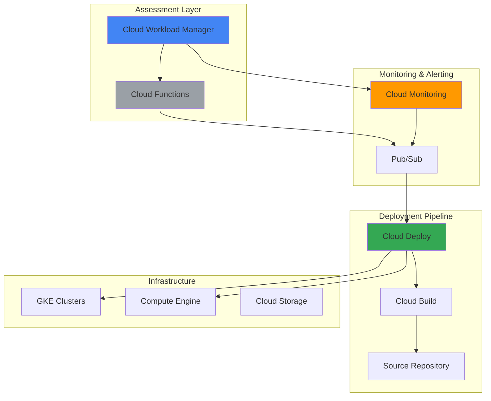

# Infrastructure Health Assessment with Cloud Workload Manager and Cloud Deploy

## Problem

Organizations struggle to maintain consistent infrastructure health across their Google Cloud environments as workloads scale and complexity increases. Manual infrastructure assessments are time-consuming, error-prone, and fail to catch configuration drift in real-time. Without automated evaluation and remediation capabilities, teams face increasing operational overhead, security vulnerabilities, and compliance risks that can impact business continuity and regulatory adherence.

## Solution

This solution creates an automated infrastructure health assessment pipeline using Cloud Workload Manager for continuous evaluation, Cloud Deploy for automated remediation deployment, and Cloud Monitoring for alerting. The system automatically scans workloads against best practices, identifies deviations, generates remediation recommendations, and deploys fixes through CI/CD pipelines, providing continuous infrastructure governance with minimal manual intervention.

## Architecture Diagram



## Prerequisites

1. Google Cloud project with billing enabled and appropriate permissions
2. gcloud CLI v450.0.0+ installed and configured (or Cloud Shell)
3. Basic understanding of Google Cloud infrastructure services and CI/CD concepts
4. Familiarity with YAML configuration files and infrastructure as code principles
5. Estimated cost: $50-100 for resources created during this recipe (varies by usage)

> **Note**: This recipe uses Cloud Workload Manager's evaluation features and Cloud Deploy's deployment automation. Ensure you have the necessary IAM permissions for infrastructure management and deployment pipeline creation.

## Preparation

```bash
# Set environment variables for project configuration
export PROJECT_ID="infrastructure-health-$(date +%s)"
export REGION="us-central1"
export ZONE="us-central1-a"

# Generate unique suffix for resource naming
RANDOM_SUFFIX=$(openssl rand -hex 3)
export CLUSTER_NAME="health-cluster-${RANDOM_SUFFIX}"
export DEPLOYMENT_PIPELINE="health-pipeline-${RANDOM_SUFFIX}"
export FUNCTION_NAME="health-assessor-${RANDOM_SUFFIX}"
export EVALUATION_NAME="infrastructure-health-${RANDOM_SUFFIX}"

# Set default project and region configuration
gcloud config set project ${PROJECT_ID}
gcloud config set compute/region ${REGION}
gcloud config set compute/zone ${ZONE}

# Enable required Google Cloud APIs
gcloud services enable workloadmanager.googleapis.com
gcloud services enable clouddeploy.googleapis.com
gcloud services enable monitoring.googleapis.com
gcloud services enable cloudfunctions.googleapis.com
gcloud services enable cloudbuild.googleapis.com
gcloud services enable container.googleapis.com
gcloud services enable pubsub.googleapis.com

echo "✅ Project configured: ${PROJECT_ID}"
echo "✅ APIs enabled for infrastructure health assessment"
```

## Steps

1. **Create Cloud Storage Bucket for Assessment Reports**:

   Google Cloud Storage provides scalable object storage for assessment reports and deployment artifacts. Creating a properly configured bucket establishes the foundation for storing Workload Manager evaluation results, deployment configurations, and audit trails that support the entire automated health assessment pipeline.

   ```bash
   # Create storage bucket for assessment data
   gsutil mb -p ${PROJECT_ID} \
       -c STANDARD \
       -l ${REGION} \
       gs://${PROJECT_ID}-health-assessments
   
   # Enable versioning for audit trail
   gsutil versioning set on gs://${PROJECT_ID}-health-assessments
   
   # Set lifecycle policy to manage costs
   cat > lifecycle.json << EOF
   {
     "lifecycle": {
       "rule": [
         {
           "action": {"type": "Delete"},
           "condition": {"age": 90}
         }
       ]
     }
   }
   EOF
   
   gsutil lifecycle set lifecycle.json gs://${PROJECT_ID}-health-assessments
   
   echo "✅ Storage bucket created for assessment reports"
   ```

   The storage bucket is now configured with versioning and lifecycle management, providing secure storage for assessment data while automatically managing costs through automated cleanup of older reports.

2. **Create GKE Cluster for Infrastructure Assessment**:

   Google Kubernetes Engine provides managed Kubernetes infrastructure that will serve as our target workload for health assessment. Creating a properly configured cluster with monitoring enabled establishes a realistic environment for demonstrating infrastructure evaluation and automated remediation capabilities.

   ```bash
   # Create GKE cluster with monitoring enabled
   gcloud container clusters create ${CLUSTER_NAME} \
       --zone=${ZONE} \
       --num-nodes=3 \
       --enable-cloud-monitoring \
       --enable-cloud-logging \
       --enable-autorepair \
       --enable-autoupgrade \
       --machine-type=e2-medium \
       --disk-size=50GB
   
   # Get cluster credentials for kubectl access
   gcloud container clusters get-credentials ${CLUSTER_NAME} \
       --zone=${ZONE}
   
   echo "✅ GKE cluster created: ${CLUSTER_NAME}"
   ```

   The GKE cluster is now running with comprehensive monitoring and logging enabled, providing a realistic infrastructure target for Workload Manager assessment and demonstrating best practices for cluster configuration.

3. **Create Pub/Sub Topic for Health Assessment Events**:

   Cloud Pub/Sub enables asynchronous communication between assessment services and deployment pipelines. Creating dedicated topics establishes the event-driven architecture that allows assessment results to trigger automated remediation workflows while maintaining loose coupling between system components.

   ```bash
   # Create Pub/Sub topic for assessment events
   gcloud pubsub topics create health-assessment-events
   
   # Create subscription for deployment pipeline
   gcloud pubsub subscriptions create health-deployment-trigger \
       --topic=health-assessment-events
   
   # Create topic for monitoring alerts
   gcloud pubsub topics create health-monitoring-alerts
   
   echo "✅ Pub/Sub topics created for event-driven architecture"
   ```

   The messaging infrastructure is now established, enabling real-time communication between assessment services and deployment automation while supporting scalable event processing.

4. **Configure Cloud Workload Manager Assessment**:

   Cloud Workload Manager provides automated workload evaluation against Google Cloud best practices and custom rules. The evaluation configuration establishes systematic assessment of your infrastructure, enabling detection of misconfigurations, security issues, and performance optimization opportunities.

   ```bash
   # Create Workload Manager evaluation
   gcloud workload-manager evaluations create ${EVALUATION_NAME} \
       --location=${REGION} \
       --description="Infrastructure health assessment" \
       --workload-type="CUSTOM" \
       --schedule="0 */6 * * *" \
       --project-scopes=${PROJECT_ID}
   
   # Verify evaluation was created
   gcloud workload-manager evaluations describe ${EVALUATION_NAME} \
       --location=${REGION}
   
   echo "✅ Workload Manager evaluation configured: ${EVALUATION_NAME}"
   ```

   The evaluation configuration enables automated assessment scheduling with comprehensive monitoring of infrastructure health, providing the foundation for continuous governance and compliance monitoring.

5. **Deploy Cloud Function for Assessment Processing**:

   Cloud Functions provides serverless compute for processing assessment results and triggering remediation workflows. Deploying the assessment processor establishes the intelligent layer that analyzes Workload Manager outputs, determines remediation priorities, and initiates appropriate deployment actions through Cloud Deploy.

   ```bash
   # Create Cloud Function source code directory
   mkdir -p health-function
   cd health-function
   
   # Create function source code
   cat > main.py << EOF
   import json
   import logging
   from google.cloud import pubsub_v1
   from google.cloud import storage
   import functions_framework
   
   @functions_framework.cloud_event
   def process_health_assessment(cloud_event):
       """Process Workload Manager assessment results"""
       
       # Initialize clients
       publisher = pubsub_v1.PublisherClient()
       storage_client = storage.Client()
       
       # Parse assessment data
       data = cloud_event.data
       bucket_name = data.get('bucketId')
       object_name = data.get('objectId')
       
       if not bucket_name or not object_name:
           logging.error("Missing bucket or object information")
           return
       
       try:
           # Download assessment report
           bucket = storage_client.bucket(bucket_name)
           blob = bucket.blob(object_name)
           assessment_data = json.loads(blob.download_as_text())
           
           # Analyze assessment results
           critical_issues = []
           recommendations = []
           
           for result in assessment_data.get('results', []):
               if result.get('severity') == 'HIGH':
                   critical_issues.append(result)
               if result.get('hasRecommendation', False):
                   recommendations.append(result)
           
           # Trigger deployment if critical issues found
           if critical_issues:
               topic_path = publisher.topic_path('${PROJECT_ID}', 'health-assessment-events')
               
               message_data = {
                   'assessment_id': assessment_data.get('id'),
                   'critical_issues': len(critical_issues),
                   'recommendations': len(recommendations),
                   'trigger_deployment': True
               }
               
               publisher.publish(topic_path, json.dumps(message_data).encode('utf-8'))
               logging.info(f"Published assessment results: {len(critical_issues)} critical issues")
       
       except Exception as e:
           logging.error(f"Error processing assessment: {str(e)}")
           raise
   EOF
   
   # Create requirements file
   cat > requirements.txt << EOF
   functions-framework==3.8.0
   google-cloud-pubsub==2.24.0
   google-cloud-storage==2.14.0
   EOF
   
   # Deploy Cloud Function
   gcloud functions deploy ${FUNCTION_NAME} \
       --gen2 \
       --runtime=python311 \
       --trigger-bucket=${PROJECT_ID}-health-assessments \
       --entry-point=process_health_assessment \
       --memory=256MB \
       --timeout=60s \
       --set-env-vars=PROJECT_ID=${PROJECT_ID} \
       --region=${REGION}
   
   cd ..
   echo "✅ Cloud Function deployed for assessment processing"
   ```

   The assessment processing function is now deployed using the 2nd generation Cloud Functions runtime and will automatically trigger when new evaluation reports are uploaded to Cloud Storage, providing intelligent analysis and workflow orchestration for infrastructure health management.

6. **Create Cloud Deploy Delivery Pipeline**:

   Cloud Deploy provides managed continuous delivery for Google Cloud workloads with progressive deployment strategies. Creating the delivery pipeline establishes automated deployment capabilities that can apply infrastructure remediation configurations based on assessment results while maintaining safety through staged rollouts.

   ```bash
   # Create deployment targets configuration
   cat > clouddeploy.yaml << EOF
   apiVersion: deploy.cloud.google.com/v1
   kind: DeliveryPipeline
   metadata:
     name: ${DEPLOYMENT_PIPELINE}
   description: Infrastructure health remediation pipeline
   serialPipeline:
     stages:
     - targetId: staging-target
     - targetId: production-target
   ---
   apiVersion: deploy.cloud.google.com/v1
   kind: Target
   metadata:
     name: staging-target
   description: Staging environment for health remediation
   gke:
     cluster: projects/${PROJECT_ID}/locations/${ZONE}/clusters/${CLUSTER_NAME}
   ---
   apiVersion: deploy.cloud.google.com/v1
   kind: Target
   metadata:
     name: production-target
   description: Production environment for health remediation
   gke:
     cluster: projects/${PROJECT_ID}/locations/${ZONE}/clusters/${CLUSTER_NAME}
   requireApproval: true
   EOF
   
   # Register delivery pipeline and targets
   gcloud deploy apply \
       --file=clouddeploy.yaml \
       --region=${REGION}
   
   echo "✅ Cloud Deploy pipeline created: ${DEPLOYMENT_PIPELINE}"
   ```

   The delivery pipeline is now configured with staging and production targets, enabling safe and controlled deployment of infrastructure remediation actions with approval gates for production changes.

7. **Create Remediation Configuration Templates**:

   Infrastructure remediation requires standardized configuration templates that address common health assessment findings. Creating these templates establishes the automated fix library that Cloud Deploy can apply when assessment results indicate specific infrastructure improvements are needed.

   ```bash
   # Create remediation templates directory
   mkdir -p remediation-templates
   
   # Create security remediation template
   cat > remediation-templates/security-fixes.yaml << EOF
   apiVersion: apps/v1
   kind: Deployment
   metadata:
     name: security-policy-enforcer
     labels:
       app: security-enforcer
   spec:
     replicas: 1
     selector:
       matchLabels:
         app: security-enforcer
     template:
       metadata:
         labels:
           app: security-enforcer
       spec:
         securityContext:
           runAsNonRoot: true
           runAsUser: 1000
           fsGroup: 2000
         containers:
         - name: policy-enforcer
           image: gcr.io/google-containers/pause:3.9
           securityContext:
             allowPrivilegeEscalation: false
             readOnlyRootFilesystem: true
             capabilities:
               drop:
               - ALL
           resources:
             requests:
               memory: "64Mi"
               cpu: "50m"
             limits:
               memory: "128Mi"
               cpu: "100m"
   EOF
   
   # Create performance optimization template
   cat > remediation-templates/performance-fixes.yaml << EOF
   apiVersion: v1
   kind: ConfigMap
   metadata:
     name: performance-tuning
   data:
     cpu-limits: "enabled"
     memory-limits: "enabled"
     auto-scaling: "enabled"
   ---
   apiVersion: autoscaling/v2
   kind: HorizontalPodAutoscaler
   metadata:
     name: workload-hpa
   spec:
     scaleTargetRef:
       apiVersion: apps/v1
       kind: Deployment
       name: target-workload
     minReplicas: 2
     maxReplicas: 10
     metrics:
     - type: Resource
       resource:
         name: cpu
         target:
           type: Utilization
           averageUtilization: 70
   EOF
   
   echo "✅ Remediation templates created for automated fixes"
   ```

   The remediation templates provide standardized solutions for common infrastructure health issues, enabling automated deployment of security enhancements and performance optimizations through the Cloud Deploy pipeline.

8. **Configure Cloud Monitoring for Health Alerts**:

   Cloud Monitoring provides comprehensive observability for infrastructure health assessment workflows and deployment pipeline status. Configuring monitoring and alerting ensures proactive notification of assessment findings, deployment failures, and system health degradation while maintaining operational visibility.

   ```bash
   # Create monitoring alert policy for critical health issues
   cat > health-alert-policy.json << EOF
   {
     "displayName": "Infrastructure Health Critical Issues",
     "conditions": [
       {
         "displayName": "Critical assessment findings",
         "conditionThreshold": {
           "filter": "resource.type=\"pubsub_topic\" AND resource.labels.topic_id=\"health-assessment-events\"",
           "comparison": "COMPARISON_GREATER_THAN",
           "thresholdValue": 0,
           "duration": "60s",
           "aggregations": [
             {
               "alignmentPeriod": "300s",
               "perSeriesAligner": "ALIGN_RATE"
             }
           ]
         }
       }
     ],
     "combiner": "OR",
     "enabled": true,
     "notificationChannels": [],
     "alertStrategy": {
       "autoClose": "1800s"
     }
   }
   EOF
   
   # Create alert policy
   gcloud alpha monitoring policies create \
       --policy-from-file=health-alert-policy.json
   
   # Create custom metrics for deployment success
   gcloud logging metrics create deployment_success \
       --description="Track successful health remediation deployments" \
       --log-filter='resource.type="cloud_function" AND "deployment successful"'
   
   echo "✅ Cloud Monitoring configured for health assessment alerts"
   ```

   The monitoring configuration provides comprehensive observability with automated alerting for critical infrastructure health issues and deployment tracking, ensuring proactive operations management and rapid response to infrastructure problems.

## Validation & Testing

1. **Verify Workload Manager Evaluation Configuration**:

   ```bash
   # Check Workload Manager evaluation status
   gcloud workload-manager evaluations list \
       --location=${REGION}
   
   # Verify evaluation details
   gcloud workload-manager evaluations describe ${EVALUATION_NAME} \
       --location=${REGION}
   ```

   Expected output: List of evaluations and detailed configuration showing schedule and target projects

2. **Test Cloud Function Assessment Processing**:

   ```bash
   # Upload test assessment report to trigger function
   echo '{"id":"test-001","results":[{"severity":"HIGH","hasRecommendation":true}]}' > test-assessment.json
   gsutil cp test-assessment.json gs://${PROJECT_ID}-health-assessments/
   
   # Check function logs
   gcloud functions logs read ${FUNCTION_NAME} \
       --region=${REGION} \
       --limit=10
   ```

   Expected output: Function execution logs showing assessment processing and Pub/Sub message publishing

3. **Validate Cloud Deploy Pipeline Configuration**:

   ```bash
   # List delivery pipelines
   gcloud deploy delivery-pipelines list --region=${REGION}
   
   # Check pipeline targets
   gcloud deploy targets list --region=${REGION}
   
   # Describe pipeline details
   gcloud deploy delivery-pipelines describe ${DEPLOYMENT_PIPELINE} \
       --region=${REGION}
   ```

   Expected output: Configured pipeline and target information with staging and production environments

4. **Test End-to-End Assessment Workflow**:

   ```bash
   # Run evaluation manually for testing
   gcloud workload-manager evaluations run ${EVALUATION_NAME} \
       --location=${REGION}
   
   # Check evaluation execution
   gcloud workload-manager evaluations list \
       --location=${REGION} \
       --filter="name:${EVALUATION_NAME}"
   ```

   Expected output: Successful evaluation execution with status updates

## Cleanup

1. **Delete Cloud Deploy Resources**:

   ```bash
   # Delete delivery pipeline
   gcloud deploy delivery-pipelines delete ${DEPLOYMENT_PIPELINE} \
       --region=${REGION} \
       --quiet
   
   echo "✅ Cloud Deploy pipeline deleted"
   ```

2. **Remove Cloud Function and Dependencies**:

   ```bash
   # Delete Cloud Function
   gcloud functions delete ${FUNCTION_NAME} \
       --region=${REGION} \
       --quiet
   
   # Delete Pub/Sub topics and subscriptions
   gcloud pubsub subscriptions delete health-deployment-trigger --quiet
   gcloud pubsub topics delete health-assessment-events --quiet
   gcloud pubsub topics delete health-monitoring-alerts --quiet
   
   echo "✅ Serverless components cleaned up"
   ```

3. **Delete Workload Manager Evaluation**:

   ```bash
   # Delete Workload Manager evaluation
   gcloud workload-manager evaluations delete ${EVALUATION_NAME} \
       --location=${REGION} \
       --quiet
   
   echo "✅ Workload Manager evaluation deleted"
   ```

4. **Delete GKE Cluster and Storage Resources**:

   ```bash
   # Delete GKE cluster
   gcloud container clusters delete ${CLUSTER_NAME} \
       --zone=${ZONE} \
       --quiet
   
   # Remove storage bucket and contents
   gsutil -m rm -r gs://${PROJECT_ID}-health-assessments
   
   echo "✅ Infrastructure resources deleted"
   ```

5. **Clean Up Configuration Files**:

   ```bash
   # Remove local configuration files
   rm -f clouddeploy.yaml
   rm -f health-alert-policy.json
   rm -f lifecycle.json
   rm -f test-assessment.json
   rm -rf health-function/
   rm -rf remediation-templates/
   
   echo "✅ Local files cleaned up"
   ```

## Discussion

This automated infrastructure health assessment pipeline demonstrates the power of combining Google Cloud's native DevOps and monitoring services to create a comprehensive infrastructure governance solution. [Cloud Workload Manager](https://cloud.google.com/workload-manager/docs/overview) serves as the assessment engine, continuously evaluating workloads against Google Cloud best practices and custom organizational policies. The service's rule-based validation capabilities enable systematic detection of security misconfigurations, performance bottlenecks, and cost optimization opportunities across your entire infrastructure landscape.

The integration with [Cloud Deploy](https://cloud.google.com/deploy/docs) creates a powerful remediation capability that transforms assessment findings into actionable infrastructure improvements. Cloud Deploy's progressive delivery features ensure that remediation changes are applied safely through staged deployments with appropriate approval gates, reducing the risk of infrastructure disruption while maintaining rapid response to critical security issues. The combination of event-driven architecture through Pub/Sub and serverless processing via Cloud Functions creates a highly scalable and cost-effective solution that responds to assessment findings in real-time.

The monitoring and alerting layer built on [Cloud Monitoring](https://cloud.google.com/monitoring/docs) provides essential observability for both the assessment process and remediation deployments. Custom metrics and alert policies ensure that infrastructure teams are immediately notified of critical findings while maintaining visibility into the effectiveness of automated remediation actions. This comprehensive approach to infrastructure health management represents a shift from reactive maintenance to proactive governance, significantly reducing operational overhead while improving security posture and compliance adherence.

The architectural pattern demonstrated here follows Google Cloud's [Well-Architected Framework](https://cloud.google.com/architecture/framework) principles, emphasizing operational excellence through automation, security through continuous assessment, and reliability through progressive deployment strategies. Organizations can extend this foundation by integrating custom assessment rules, implementing additional remediation templates, and connecting to existing ITSM systems for enterprise-scale infrastructure governance.

> **Tip**: Consider implementing custom Workload Manager rules specific to your organization's compliance requirements and operational standards. This enables assessment of internal policies beyond Google Cloud best practices, creating a comprehensive governance framework tailored to your business needs.

## Challenge

Extend this infrastructure health assessment solution with these enhancements:

1. **Multi-Cloud Assessment Integration**: Integrate with third-party assessment tools or custom evaluation scripts to extend health monitoring beyond Google Cloud native resources, creating a unified governance framework for hybrid and multi-cloud environments.

2. **Advanced Remediation Workflows**: Implement sophisticated remediation logic using Cloud Workflows or Cloud Composer to orchestrate complex multi-step remediation processes that may require coordination across multiple services, approval workflows, and rollback capabilities.

3. **Compliance Reporting Dashboard**: Build a comprehensive dashboard using Looker Studio or Cloud Monitoring dashboards that provides executive-level visibility into infrastructure health trends, compliance status, and remediation effectiveness with automated report generation for audit purposes.

4. **Intelligent Assessment Scheduling**: Enhance the assessment trigger mechanism using Cloud Scheduler and Cloud Functions to dynamically adjust evaluation frequency based on infrastructure change velocity, deployment patterns, and previous assessment findings to optimize cost and responsiveness.

5. **Integration with GitOps Workflows**: Connect the remediation pipeline to Git repositories and implement GitOps practices for infrastructure changes, ensuring all remediation actions are version-controlled, peer-reviewed, and traceable through standard development workflows.

## Infrastructure Code

### Available Infrastructure as Code:

- [Infrastructure Code Overview](code/README.md) - Detailed description of all infrastructure components
- [Infrastructure Manager](code/infrastructure-manager/) - GCP Infrastructure Manager templates
- [Bash CLI Scripts](code/scripts/) - Example bash scripts using gcloud CLI commands to deploy infrastructure
- [Terraform](code/terraform/) - Terraform configuration files