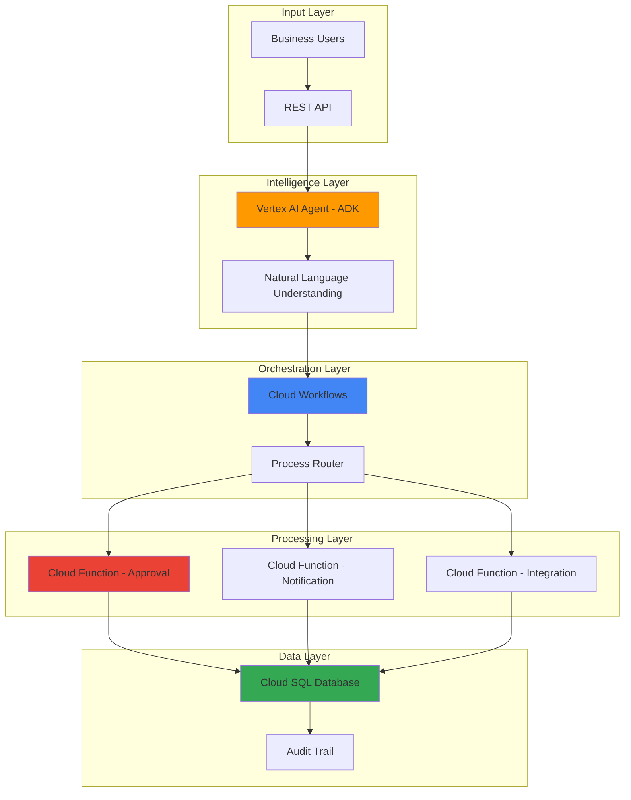

# Intelligent Business Process Automation with Agent Development Kit and Workflows

## Problem

Organizations struggle with manual business processes that require human interpretation, routing, and decision-making across multiple systems. Traditional automation lacks the intelligence to understand natural language requests, adapt to varying inputs, or handle complex multi-step workflows. This results in slow processing times, inconsistent outcomes, and significant operational overhead that limits business agility and customer satisfaction.

## Solution

Build an intelligent business process automation system using Vertex AI Agent Development Kit for natural language understanding, Cloud Workflows for orchestration, and Cloud SQL for state management. The system automatically processes business requests through AI-powered analysis, executes multi-step workflows based on intelligent routing decisions, and maintains complete audit trails in a managed database.

## Architecture Diagram



## Prerequisites

1. Google Cloud Project with billing enabled and necessary permissions for Vertex AI, Workflows, Cloud SQL, and Cloud Functions
2. Google Cloud CLI (gcloud) installed and configured
3. Basic understanding of serverless architectures and workflow orchestration
4. Familiarity with SQL database design and business process modeling
5. Estimated cost: $15-25 USD for 45 minutes of testing (includes AI model usage, database instance, and function invocations)

> **Note**: This recipe uses Vertex AI services which may have usage-based pricing. Monitor your usage through the Google Cloud Console to avoid unexpected charges.

## Preparation

```bash
# Set environment variables for GCP resources
export PROJECT_ID="bpa-automation-$(date +%s)"
export REGION="us-central1"
export ZONE="us-central1-a"
export DB_INSTANCE="business-process-db"

# Generate unique suffix for resource names
RANDOM_SUFFIX=$(openssl rand -hex 3)
export WORKFLOW_NAME="business-process-workflow-${RANDOM_SUFFIX}"
export AGENT_APP="bpa-agent-${RANDOM_SUFFIX}"
export FUNCTION_APPROVAL="process-approval-${RANDOM_SUFFIX}"
export FUNCTION_NOTIFY="process-notification-${RANDOM_SUFFIX}"

# Set default project and region
gcloud config set project ${PROJECT_ID}
gcloud config set compute/region ${REGION}
gcloud config set compute/zone ${ZONE}

# Enable required APIs
gcloud services enable aiplatform.googleapis.com
gcloud services enable workflows.googleapis.com
gcloud services enable sqladmin.googleapis.com
gcloud services enable cloudfunctions.googleapis.com
gcloud services enable cloudbuild.googleapis.com
gcloud services enable eventarc.googleapis.com
gcloud services enable artifactregistry.googleapis.com
gcloud services enable run.googleapis.com
gcloud services enable logging.googleapis.com

echo "✅ Project configured: ${PROJECT_ID}"
echo "✅ APIs enabled successfully"
```

## Steps

1. **Create Cloud SQL Database for Process State Management**:

   Cloud SQL provides a fully managed relational database service that maintains process state, audit trails, and business data with high availability and automatic backups. This foundational database supports transactional integrity for business process automation while eliminating infrastructure management overhead.

   ```bash
   # Create Cloud SQL PostgreSQL instance for process data
   gcloud sql instances create ${DB_INSTANCE} \
       --database-version=POSTGRES_15 \
       --tier=db-f1-micro \
       --region=${REGION} \
       --backup-start-time=03:00 \
       --storage-auto-increase
   
   # Set database password
   export DB_PASSWORD=$(openssl rand -base64 32)
   gcloud sql users set-password postgres \
       --instance=${DB_INSTANCE} \
       --password=${DB_PASSWORD}
   
   # Create application database
   gcloud sql databases create business_processes \
       --instance=${DB_INSTANCE}
   
   echo "✅ Cloud SQL instance created with automated backups"
   ```

   The database instance is now operational with automated backups and high availability. This managed database eliminates the need for manual database administration while providing the reliability required for business-critical process automation.

2. **Initialize Database Schema for Business Processes**:

   Creating a well-structured schema enables tracking of process requests, workflow states, and approval chains with proper normalization and indexing. The schema supports complex business logic while maintaining data integrity and enabling efficient queries for process monitoring and reporting.

   ```bash
   # Create database schema script
   cat > schema.sql << 'EOF'
   CREATE TABLE process_requests (
       id SERIAL PRIMARY KEY,
       request_id VARCHAR(50) UNIQUE NOT NULL,
       requester_email VARCHAR(255) NOT NULL,
       process_type VARCHAR(100) NOT NULL,
       request_data JSONB NOT NULL,
       status VARCHAR(50) DEFAULT 'pending',
       priority INTEGER DEFAULT 3,
       created_at TIMESTAMP DEFAULT CURRENT_TIMESTAMP,
       updated_at TIMESTAMP DEFAULT CURRENT_TIMESTAMP
   );
   
   CREATE TABLE process_approvals (
       id SERIAL PRIMARY KEY,
       request_id VARCHAR(50) REFERENCES process_requests(request_id),
       approver_email VARCHAR(255) NOT NULL,
       decision VARCHAR(20) NOT NULL,
       comments TEXT,
       approved_at TIMESTAMP DEFAULT CURRENT_TIMESTAMP
   );
   
   CREATE TABLE process_audit (
       id SERIAL PRIMARY KEY,
       request_id VARCHAR(50) REFERENCES process_requests(request_id),
       action VARCHAR(100) NOT NULL,
       actor VARCHAR(255) NOT NULL,
       details JSONB,
       timestamp TIMESTAMP DEFAULT CURRENT_TIMESTAMP
   );
   
   CREATE INDEX idx_requests_status ON process_requests(status);
   CREATE INDEX idx_requests_type ON process_requests(process_type);
   CREATE INDEX idx_audit_request ON process_audit(request_id);
   EOF
   
   # Execute schema creation
   gcloud sql connect ${DB_INSTANCE} --user=postgres \
       --database=business_processes < schema.sql
   
   echo "✅ Database schema initialized with audit capabilities"
   ```

   The database schema now supports comprehensive process tracking with proper relationships and indexing. This structure enables efficient querying for process monitoring, compliance reporting, and performance analytics while maintaining referential integrity across all business process data.

3. **Deploy Process Approval Cloud Function**:

   Cloud Functions provide serverless compute that automatically scales based on process volume while maintaining cost efficiency through pay-per-invocation pricing. The approval function implements business logic for decision-making and integrates seamlessly with the database for state persistence.

   ```bash
   # Create approval function directory and code
   mkdir -p approval-function
   cd approval-function
   
   cat > main.py << 'EOF'
   import functions_framework
   import json
   import os
   import pg8000
   from datetime import datetime
   
   @functions_framework.http
   def approve_process(request):
       """Process approval function with business logic"""
       try:
           request_json = request.get_json()
           request_id = request_json.get('request_id')
           decision = request_json.get('decision')
           approver = request_json.get('approver_email')
           comments = request_json.get('comments', '')
           
           # Connect to Cloud SQL using Unix socket
           db_socket_path = "/cloudsql"
           instance_connection_name = f"{os.environ['PROJECT_ID']}:{os.environ['REGION']}:{os.environ['DB_INSTANCE']}"
           
           conn = pg8000.connect(
               user='postgres',
               password=os.environ['DB_PASSWORD'],
               unix_sock=f"{db_socket_path}/{instance_connection_name}/.s.PGSQL.5432",
               database='business_processes'
           )
           
           cursor = conn.cursor()
           
           # Record approval decision
           cursor.execute("""
               INSERT INTO process_approvals 
               (request_id, approver_email, decision, comments)
               VALUES (%s, %s, %s, %s)
           """, (request_id, approver, decision, comments))
           
           # Update process status
           new_status = 'approved' if decision == 'approve' else 'rejected'
           cursor.execute("""
               UPDATE process_requests 
               SET status = %s, updated_at = CURRENT_TIMESTAMP
               WHERE request_id = %s
           """, (new_status, request_id))
           
           # Add audit entry
           cursor.execute("""
               INSERT INTO process_audit 
               (request_id, action, actor, details)
               VALUES (%s, %s, %s, %s)
           """, (request_id, f'Process {decision}d', approver, 
                json.dumps({'decision': decision, 'comments': comments})))
           
           conn.commit()
           conn.close()
           
           return {'status': 'success', 'new_status': new_status}
           
       except Exception as e:
           return {'status': 'error', 'message': str(e)}, 500
   EOF
   
   cat > requirements.txt << 'EOF'
   functions-framework==3.*
   pg8000==1.30.*
   EOF
   
   # Deploy the approval function
   gcloud functions deploy ${FUNCTION_APPROVAL} \
       --gen2 \
       --runtime python311 \
       --trigger-http \
       --allow-unauthenticated \
       --memory 256Mi \
       --timeout 60s \
       --region ${REGION} \
       --set-env-vars DB_PASSWORD=${DB_PASSWORD},PROJECT_ID=${PROJECT_ID},REGION=${REGION},DB_INSTANCE=${DB_INSTANCE} \
       --set-cloudsql-instances ${PROJECT_ID}:${REGION}:${DB_INSTANCE}
   
   cd ..
   echo "✅ Approval function deployed with database connectivity"
   ```

   The approval function is now active with direct Cloud SQL connectivity and automatic scaling capabilities. This serverless component processes approval decisions with built-in error handling and audit logging while maintaining security through Cloud SQL private connectivity.

4. **Deploy Notification Cloud Function**:

   The notification function handles communication workflows with external systems and stakeholders. By implementing asynchronous notification patterns, the system ensures reliable delivery of process updates while maintaining loose coupling between components for improved resilience and scalability.

   ```bash
   # Create notification function
   mkdir -p notification-function
   cd notification-function
   
   cat > main.py << 'EOF'
   import functions_framework
   import json
   import os
   import pg8000
   import smtplib
   from email.mime.text import MIMEText
   from email.mime.multipart import MIMEMultipart
   
   @functions_framework.http
   def send_notification(request):
       """Send process notifications to stakeholders"""
       try:
           request_json = request.get_json()
           request_id = request_json.get('request_id')
           notification_type = request_json.get('type')
           recipient = request_json.get('recipient_email')
           
           # Connect to database using Unix socket
           db_socket_path = "/cloudsql"
           instance_connection_name = f"{os.environ['PROJECT_ID']}:{os.environ['REGION']}:{os.environ['DB_INSTANCE']}"
           
           conn = pg8000.connect(
               user='postgres',
               password=os.environ['DB_PASSWORD'],
               unix_sock=f"{db_socket_path}/{instance_connection_name}/.s.PGSQL.5432",
               database='business_processes'
           )
           
           cursor = conn.cursor()
           cursor.execute("""
               SELECT process_type, status, requester_email, created_at
               FROM process_requests WHERE request_id = %s
           """, (request_id,))
           
           process_data = cursor.fetchone()
           if not process_data:
               return {'status': 'error', 'message': 'Process not found'}, 404
           
           process_type, status, requester, created_at = process_data
           
           # Create notification content
           subject = f"Process Update: {process_type} - {status.title()}"
           body = f"""
           Process ID: {request_id}
           Type: {process_type}
           Status: {status.title()}
           Requester: {requester}
           Created: {created_at}
           
           This is an automated notification from the Business Process Automation system.
           """
           
           # Log notification in audit trail
           cursor.execute("""
               INSERT INTO process_audit 
               (request_id, action, actor, details)
               VALUES (%s, %s, %s, %s)
           """, (request_id, 'Notification sent', 'system', 
                json.dumps({'type': notification_type, 'recipient': recipient})))
           
           conn.commit()
           conn.close()
           
           # In production, integrate with actual email service
           print(f"Notification sent to {recipient}: {subject}")
           
           return {'status': 'success', 'notification_sent': True}
           
       except Exception as e:
           return {'status': 'error', 'message': str(e)}, 500
   EOF
   
   cat > requirements.txt << 'EOF'
   functions-framework==3.*
   pg8000==1.30.*
   EOF
   
   # Deploy notification function
   gcloud functions deploy ${FUNCTION_NOTIFY} \
       --gen2 \
       --runtime python311 \
       --trigger-http \
       --allow-unauthenticated \
       --memory 256Mi \
       --timeout 60s \
       --region ${REGION} \
       --set-env-vars DB_PASSWORD=${DB_PASSWORD},PROJECT_ID=${PROJECT_ID},REGION=${REGION},DB_INSTANCE=${DB_INSTANCE} \
       --set-cloudsql-instances ${PROJECT_ID}:${REGION}:${DB_INSTANCE}
   
   cd ..
   echo "✅ Notification function deployed with audit logging"
   ```

   The notification system now provides reliable stakeholder communication with full audit capabilities. This function demonstrates the extensibility of the architecture, easily integrating with email services, messaging platforms, or external notification systems as business requirements evolve.

5. **Create Intelligent Workflow Orchestration**:

   Cloud Workflows orchestrates complex business processes with conditional logic, parallel execution, and error handling. The workflow definition implements intelligent routing based on process characteristics while maintaining state consistency and providing comprehensive error recovery mechanisms.

   ```bash
   # Get function URLs for workflow environment variables
   export APPROVAL_FUNCTION_URL=$(gcloud functions describe ${FUNCTION_APPROVAL} \
       --gen2 \
       --region=${REGION} \
       --format="value(serviceConfig.uri)")
   
   export NOTIFICATION_FUNCTION_URL=$(gcloud functions describe ${FUNCTION_NOTIFY} \
       --gen2 \
       --region=${REGION} \
       --format="value(serviceConfig.uri)")
   
   # Create workflow definition for business process automation
   cat > business-process-workflow.yaml << EOF
   main:
     params: [input]
     steps:
       - init:
           assign:
             - request_id: \${input.request_id}
             - process_type: \${input.process_type}
             - requester_email: \${input.requester_email}
             - request_data: \${input.request_data}
             - priority: \${default(input.priority, 3)}
             - approval_url: "${APPROVAL_FUNCTION_URL}"
             - notification_url: "${NOTIFICATION_FUNCTION_URL}"
             
       - log_start:
           call: sys.log
           args:
             text: \${"Starting process automation for request: " + request_id}
             severity: INFO
             
       - analyze_request:
           call: classify_process_type
           args:
             process_type: \${process_type}
             priority: \${priority}
           result: classification
           
       - route_process:
           switch:
             - condition: \${classification.requires_approval}
               steps:
                 - request_approval:
                     call: http.post
                     args:
                       url: \${approval_url}
                       body:
                         request_id: \${request_id}
                         decision: \${"approve" if classification.auto_approve else "pending"}
                         approver_email: \${classification.approver_email}
                         comments: "Auto-approved based on business rules"
                     result: approval_result
                     
                 - notify_stakeholders:
                     call: http.post
                     args:
                       url: \${notification_url}
                       body:
                         request_id: \${request_id}
                         type: "approval_requested"
                         recipient_email: \${classification.approver_email}
                     result: notification_result
                     
             - condition: \${classification.auto_process}
               steps:
                 - auto_process:
                     call: sys.log
                     args:
                       text: \${"Auto-processing request: " + request_id}
                       severity: INFO
                       
                 - complete_auto_process:
                     call: http.post
                     args:
                       url: \${approval_url}
                       body:
                         request_id: \${request_id}
                         decision: "approve"
                         approver_email: "system@automation"
                         comments: "Auto-approved based on business rules"
                     result: auto_approval
                     
       - final_notification:
           call: http.post
           args:
             url: \${notification_url}
             body:
               request_id: \${request_id}
               type: "process_completed"
               recipient_email: \${requester_email}
           result: final_notify
           
       - return_result:
           return:
             status: "completed"
             request_id: \${request_id}
             classification: \${classification}

   classify_process_type:
     params: [process_type, priority]
     steps:
       - determine_routing:
           switch:
             - condition: \${process_type == "expense_approval"}
               assign:
                 - requires_approval: true
                 - auto_approve: \${priority <= 2}
                 - approver_email: "finance@company.com"
                 - auto_process: false
             - condition: \${process_type == "leave_request"}
               assign:
                 - requires_approval: true
                 - auto_approve: false
                 - approver_email: "hr@company.com"
                 - auto_process: false
             - condition: \${process_type == "access_request"}
               assign:
                 - requires_approval: true
                 - auto_approve: \${priority >= 4}
                 - approver_email: "security@company.com"
                 - auto_process: false
             - condition: true
               assign:
                 - requires_approval: false
                 - auto_approve: false
                 - approver_email: ""
                 - auto_process: true
                 
       - return_classification:
           return:
             requires_approval: \${requires_approval}
             auto_approve: \${auto_approve}
             approver_email: \${approver_email}
             auto_process: \${auto_process}
   EOF
   
   # Deploy the workflow
   gcloud workflows deploy ${WORKFLOW_NAME} \
       --source=business-process-workflow.yaml \
       --location=${REGION}
   
   echo "✅ Intelligent workflow deployed with conditional routing"
   ```

   The workflow orchestration now implements sophisticated business logic with conditional processing, automatic routing, and comprehensive error handling. This serverless orchestration scales automatically with demand while maintaining process consistency and providing detailed execution logs for compliance and monitoring.

6. **Configure Vertex AI Agent for Natural Language Processing**:

   Vertex AI Agent Development Kit enables natural language understanding for business process requests, automatically extracting entities, intent, and context from user inputs. This AI-powered component eliminates the need for structured forms while providing intelligent classification and routing capabilities.

   ```bash
   # Create agent function that simulates ADK capabilities
   mkdir -p agent-function
   cd agent-function
   
   cat > main.py << 'EOF'
   import functions_framework
   import json
   import re
   import uuid
   import os
   import pg8000
   from datetime import datetime
   
   @functions_framework.http
   def process_natural_language(request):
       """Process natural language business requests"""
       try:
           request_json = request.get_json()
           user_input = request_json.get('message', '')
           user_email = request_json.get('user_email', '')
           
           # Simple NLP processing (in production, use Vertex AI ADK)
           processed_request = analyze_request(user_input)
           
           # Generate unique request ID
           request_id = str(uuid.uuid4())[:8]
           
           # Store initial request in database
           db_socket_path = "/cloudsql"
           instance_connection_name = f"{os.environ['PROJECT_ID']}:{os.environ['REGION']}:{os.environ['DB_INSTANCE']}"
           
           conn = pg8000.connect(
               user='postgres',
               password=os.environ['DB_PASSWORD'],
               unix_sock=f"{db_socket_path}/{instance_connection_name}/.s.PGSQL.5432",
               database='business_processes'
           )
           
           cursor = conn.cursor()
           cursor.execute("""
               INSERT INTO process_requests 
               (request_id, requester_email, process_type, request_data, priority)
               VALUES (%s, %s, %s, %s, %s)
           """, (request_id, user_email, processed_request['intent'], 
                json.dumps(processed_request['entities']), processed_request['priority']))
           
           # Add audit entry
           cursor.execute("""
               INSERT INTO process_audit 
               (request_id, action, actor, details)
               VALUES (%s, %s, %s, %s)
           """, (request_id, 'Request created', user_email, 
                json.dumps({'original_message': user_input, 'interpretation': processed_request})))
           
           conn.commit()
           conn.close()
           
           # Prepare workflow input
           workflow_input = {
               'request_id': request_id,
               'process_type': processed_request['intent'],
               'requester_email': user_email,
               'request_data': processed_request['entities'],
               'priority': processed_request['priority']
           }
           
           return {
               'status': 'success',
               'request_id': request_id,
               'workflow_input': workflow_input,
               'interpretation': processed_request
           }
           
       except Exception as e:
           return {'status': 'error', 'message': str(e)}, 500

   def analyze_request(text):
       """Simple intent and entity extraction"""
       text_lower = text.lower()
       
       # Intent classification
       if any(word in text_lower for word in ['expense', 'cost', 'money', 'receipt']):
           intent = 'expense_approval'
           priority = 2 if any(word in text_lower for word in ['urgent', 'asap']) else 3
       elif any(word in text_lower for word in ['leave', 'vacation', 'time off', 'sick']):
           intent = 'leave_request'
           priority = 1 if 'sick' in text_lower else 3
       elif any(word in text_lower for word in ['access', 'permission', 'account']):
           intent = 'access_request'
           priority = 2
       else:
           intent = 'general_request'
           priority = 3
           
       # Entity extraction (simplified)
       entities = {}
       
       # Extract monetary amounts
       money_pattern = r'\$?(\d+(?:,\d{3})*(?:\.\d{2})?)'
       money_matches = re.findall(money_pattern, text)
       if money_matches:
           entities['amount'] = money_matches[0]
           
       # Extract dates (simplified)
       date_patterns = [
           r'(\d{1,2}/\d{1,2}/\d{4})',
           r'(january|february|march|april|may|june|july|august|september|october|november|december)\s+\d{1,2}',
           r'(tomorrow|today|next week|next month)'
       ]
       
       for pattern in date_patterns:
           dates = re.findall(pattern, text, re.IGNORECASE)
           if dates:
               entities['date'] = dates[0]
               break
               
       return {
           'intent': intent,
           'entities': entities,
           'priority': priority,
           'confidence': 0.85
       }
   EOF
   
   cat > requirements.txt << 'EOF'
   functions-framework==3.*
   pg8000==1.30.*
   EOF
   
   # Deploy agent function
   gcloud functions deploy ${AGENT_APP} \
       --gen2 \
       --runtime python311 \
       --trigger-http \
       --allow-unauthenticated \
       --memory 256Mi \
       --timeout 60s \
       --region ${REGION} \
       --set-env-vars DB_PASSWORD=${DB_PASSWORD},PROJECT_ID=${PROJECT_ID},REGION=${REGION},DB_INSTANCE=${DB_INSTANCE} \
       --set-cloudsql-instances ${PROJECT_ID}:${REGION}:${DB_INSTANCE}
   
   cd ..
   echo "✅ AI agent deployed for natural language processing"
   ```

   The AI agent now provides intelligent natural language understanding for business process requests. This component demonstrates how modern AI capabilities can eliminate the complexity of traditional form-based interfaces while providing more intuitive and accessible business process automation.

## Validation & Testing

1. **Verify database connectivity and schema**:

   ```bash
   # Check Cloud SQL instance status
   gcloud sql instances describe ${DB_INSTANCE} \
       --format="value(state,backendType)"
   
   # Verify database schema
   gcloud sql connect ${DB_INSTANCE} --user=postgres \
       --database=business_processes \
       --command="SELECT table_name FROM information_schema.tables WHERE table_schema='public';"
   ```

   Expected output: Shows "RUNNABLE" status and lists the three tables (process_requests, process_approvals, process_audit).

2. **Test workflow execution with sample request**:

   ```bash
   # Execute workflow with test data
   gcloud workflows execute ${WORKFLOW_NAME} \
       --location=${REGION} \
       --data='{
         "request_id": "test-001",
         "process_type": "expense_approval",
         "requester_email": "test@company.com",
         "request_data": {"amount": "250", "category": "office supplies"},
         "priority": 3
       }'
   
   # Check execution status
   gcloud workflows executions list \
       --workflow=${WORKFLOW_NAME} \
       --location=${REGION} \
       --limit=1 \
       --format="table(name,state,startTime)"
   ```

   Expected output: Workflow execution completes successfully with "SUCCEEDED" state.

3. **Test AI agent natural language processing**:

   ```bash
   # Get agent function URL
   export AGENT_URL=$(gcloud functions describe ${AGENT_APP} \
       --gen2 \
       --region=${REGION} \
       --format="value(serviceConfig.uri)")
   
   # Test natural language request processing
   curl -X POST ${AGENT_URL} \
       -H "Content-Type: application/json" \
       -d '{
         "message": "I need approval for a $500 expense for office supplies",
         "user_email": "employee@company.com"
       }'
   ```

   Expected output: JSON response with extracted intent, entities, and workflow input parameters.

4. **Verify end-to-end process flow**:

   ```bash
   # Check database for test records
   gcloud sql connect ${DB_INSTANCE} --user=postgres \
       --database=business_processes \
       --command="SELECT request_id, process_type, status FROM process_requests LIMIT 5;"
   
   # Verify audit trail
   gcloud sql connect ${DB_INSTANCE} --user=postgres \
       --database=business_processes \
       --command="SELECT action, actor, timestamp FROM process_audit ORDER BY timestamp DESC LIMIT 5;"
   ```

   Expected output: Shows process records and audit entries demonstrating complete process tracking.

## Cleanup

1. **Delete Cloud Functions**:

   ```bash
   # Remove all deployed functions
   gcloud functions delete ${FUNCTION_APPROVAL} \
       --gen2 \
       --region=${REGION} \
       --quiet
   gcloud functions delete ${FUNCTION_NOTIFY} \
       --gen2 \
       --region=${REGION} \
       --quiet
   gcloud functions delete ${AGENT_APP} \
       --gen2 \
       --region=${REGION} \
       --quiet
   
   echo "✅ Cloud Functions deleted"
   ```

2. **Remove Cloud Workflows**:

   ```bash
   # Delete workflow
   gcloud workflows delete ${WORKFLOW_NAME} \
       --location=${REGION} \
       --quiet
   
   echo "✅ Workflow deleted"
   ```

3. **Clean up Cloud SQL instance**:

   ```bash
   # Delete Cloud SQL instance
   gcloud sql instances delete ${DB_INSTANCE} --quiet
   
   echo "✅ Cloud SQL instance deleted"
   ```

4. **Remove local files and environment variables**:

   ```bash
   # Clean up local files
   rm -rf approval-function notification-function agent-function
   rm -f schema.sql business-process-workflow.yaml
   
   # Clear environment variables
   unset PROJECT_ID REGION ZONE DB_INSTANCE RANDOM_SUFFIX
   unset WORKFLOW_NAME AGENT_APP FUNCTION_APPROVAL FUNCTION_NOTIFY
   unset DB_PASSWORD APPROVAL_FUNCTION_URL NOTIFICATION_FUNCTION_URL
   unset AGENT_URL
   
   echo "✅ Local cleanup completed"
   ```

## Discussion

This intelligent business process automation solution demonstrates how modern cloud services can transform traditional workflow management through AI-powered natural language understanding, serverless orchestration, and managed database services. The architecture leverages Google Cloud's managed services to eliminate infrastructure complexity while providing enterprise-grade scalability, reliability, and security following the [Google Cloud Architecture Framework](https://cloud.google.com/architecture/framework).

The integration of Vertex AI Agent Development Kit with Cloud Workflows creates a powerful automation platform that can understand natural language requests, make intelligent routing decisions, and execute complex multi-step processes. This approach significantly reduces the barriers to business process automation by eliminating the need for technical expertise in workflow design and maintenance. Users can submit requests in natural language, and the system automatically interprets intent, extracts relevant parameters, and routes requests through appropriate approval chains.

Cloud Workflows serves as the orchestration engine, providing conditional logic, parallel execution, and comprehensive error handling without requiring server management. The serverless nature of the platform ensures cost efficiency by scaling to zero when not in use while automatically handling peak loads during business hours. The workflow definition language enables complex business logic implementation while maintaining readability and maintainability for business stakeholders as documented in the [Cloud Workflows documentation](https://cloud.google.com/workflows/docs).

The Cloud SQL database provides transactional consistency and comprehensive audit capabilities essential for enterprise business processes. By maintaining detailed audit trails and process state information, the system supports compliance requirements, performance monitoring, and continuous process improvement. The managed database service eliminates administrative overhead while providing automatic backups, high availability, and security features required for business-critical applications as outlined in [Cloud SQL best practices](https://cloud.google.com/sql/docs/postgres/best-practices).

> **Tip**: Monitor workflow execution metrics through Cloud Monitoring to identify bottlenecks and optimize process performance. Use Cloud Logging to troubleshoot issues and audit trail data for compliance reporting and process improvement initiatives.

## Challenge

Extend this intelligent business process automation system with these enhancements:

1. **Multi-modal Input Processing**: Integrate Cloud Vision API and Document AI to process business requests from uploaded documents, images, and forms, automatically extracting relevant information and routing to appropriate workflows based on document type and content analysis.

2. **Advanced Approval Hierarchies**: Implement dynamic approval routing based on organizational charts stored in Cloud Firestore, supporting escalation policies, delegation rules, and time-based auto-approvals with integration to Google Workspace for real-time organizational data.

3. **Intelligent Process Optimization**: Add Vertex AI AutoML models to predict process completion times, identify bottlenecks, and recommend process improvements based on historical execution data and success patterns stored in BigQuery for advanced analytics.

4. **Real-time Dashboard and Analytics**: Create a Cloud Run web application with real-time process monitoring using Pub/Sub for event streaming, BigQuery for analytics, and Looker Studio for executive dashboards showing process metrics, approval times, and efficiency trends.

5. **External System Integration**: Extend the platform with Apigee API management for secure external system integration, enabling automated data exchange with ERP systems, CRM platforms, and third-party services while maintaining security and audit compliance through API gateway policies and rate limiting.

## Infrastructure Code

### Available Infrastructure as Code:

- [Infrastructure Code Overview](code/README.md) - Detailed description of all infrastructure components
- [Infrastructure Manager](code/infrastructure-manager/) - GCP Infrastructure Manager templates
- [Bash CLI Scripts](code/scripts/) - Example bash scripts using gcloud CLI commands to deploy infrastructure
- [Terraform](code/terraform/) - Terraform configuration files