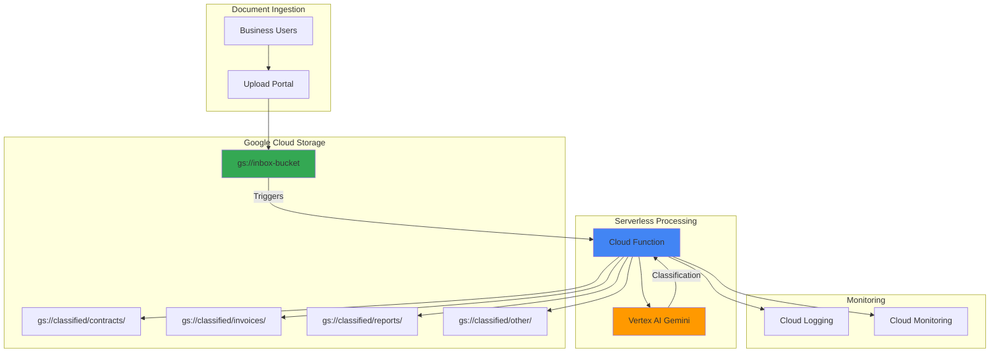

# Intelligent Document Classification with Cloud Functions and Vertex AI

## Problem

Organizations receive hundreds of business documents daily through various channels, requiring manual sorting and routing to appropriate teams or workflows. This manual classification process creates bottlenecks, increases processing time, and introduces human error when categorizing contracts, invoices, reports, and correspondence. Without automated document classification, businesses struggle to maintain efficient document workflows and timely processing of critical business documents.

## Solution

Build a serverless document classification system using Cloud Functions to automatically process uploaded documents, Vertex AI's Gemini models to analyze content and classify document types, and Cloud Storage to organize documents into appropriate folders. This solution provides real-time document processing with AI-powered classification that scales automatically based on document volume while maintaining cost efficiency through serverless architecture.

## Architecture Diagram



## Prerequisites

1. Google Cloud account with Vertex AI API and Cloud Functions API enabled
2. gcloud CLI installed and configured (or use Cloud Shell)
3. Basic understanding of serverless computing and AI/ML concepts
4. Text editor for Python code development
5. Estimated cost: $8-15 for testing (Vertex AI API calls, Cloud Functions execution, Cloud Storage)

> **Note**: This recipe uses Vertex AI's Gemini models which provide powerful document analysis capabilities with pay-per-use pricing.

## Preparation

```bash
# Set environment variables for GCP resources
export PROJECT_ID="doc-classifier-$(date +%s)"
export REGION="us-central1"
export ZONE="us-central1-a"

# Generate unique suffix for resource names
RANDOM_SUFFIX=$(openssl rand -hex 3)

# Set bucket names
export INBOX_BUCKET="doc-inbox-${RANDOM_SUFFIX}"
export CLASSIFIED_BUCKET="doc-classified-${RANDOM_SUFFIX}"

# Set default project and region
gcloud config set project ${PROJECT_ID}
gcloud config set compute/region ${REGION}
gcloud config set compute/zone ${ZONE}

# Enable required APIs
gcloud services enable cloudfunctions.googleapis.com
gcloud services enable aiplatform.googleapis.com
gcloud services enable storage.googleapis.com
gcloud services enable logging.googleapis.com
gcloud services enable monitoring.googleapis.com

echo "✅ Project configured: ${PROJECT_ID}"
echo "✅ Inbox bucket: ${INBOX_BUCKET}"
echo "✅ Classified bucket: ${CLASSIFIED_BUCKET}"
```

## Steps

1. **Create Cloud Storage Buckets for Document Processing**:

   Cloud Storage provides the foundation for our document classification pipeline, offering durable object storage with global accessibility and event-driven triggers. We'll create separate buckets for document ingestion and classified document storage to maintain clear data organization and support different access patterns.

   ```bash
   # Create inbox bucket for document uploads
   gsutil mb -p ${PROJECT_ID} \
       -c STANDARD \
       -l ${REGION} \
       gs://${INBOX_BUCKET}
   
   # Create classified bucket with folder structure
   gsutil mb -p ${PROJECT_ID} \
       -c STANDARD \
       -l ${REGION} \
       gs://${CLASSIFIED_BUCKET}
   
   # Create folder structure for classified documents
   echo "" | gsutil cp - gs://${CLASSIFIED_BUCKET}/contracts/.keep
   echo "" | gsutil cp - gs://${CLASSIFIED_BUCKET}/invoices/.keep
   echo "" | gsutil cp - gs://${CLASSIFIED_BUCKET}/reports/.keep
   echo "" | gsutil cp - gs://${CLASSIFIED_BUCKET}/other/.keep
   
   echo "✅ Storage buckets created with classification folders"
   ```

   The bucket structure now supports automatic document organization with dedicated folders for each document type. This hierarchical structure enables efficient document retrieval and supports downstream business processes that depend on document categorization.

2. **Create Service Account for Cloud Function Authentication**:

   Google Cloud Functions require proper authentication to access Vertex AI and Cloud Storage services. Creating a dedicated service account with minimal required permissions follows the principle of least privilege and ensures secure access to Google Cloud services.

   ```bash
   # Create service account for Cloud Function
   gcloud iam service-accounts create doc-classifier-sa \
       --display-name "Document Classifier Service Account" \
       --description "Service account for document classification function"
   
   # Grant necessary permissions
   gcloud projects add-iam-policy-binding ${PROJECT_ID} \
       --member="serviceAccount:doc-classifier-sa@${PROJECT_ID}.iam.gserviceaccount.com" \
       --role="roles/aiplatform.user"
   
   gcloud projects add-iam-policy-binding ${PROJECT_ID} \
       --member="serviceAccount:doc-classifier-sa@${PROJECT_ID}.iam.gserviceaccount.com" \
       --role="roles/storage.objectAdmin"
   
   echo "✅ Service account created with required permissions"
   ```

   The service account now has the minimum permissions necessary for Vertex AI model access and Cloud Storage operations. This security configuration enables the Cloud Function to perform document classification while maintaining proper access controls.

3. **Create Python Function Code for Document Classification**:

   The Cloud Function serves as the orchestration layer, handling document processing events, extracting text content, and coordinating with Vertex AI for classification. This serverless approach provides automatic scaling and cost efficiency while maintaining high availability for document processing.

   ```bash
   # Create function directory
   mkdir -p doc-classifier-function
   cd doc-classifier-function
   
   # Create main function file
   cat > main.py << 'EOF'
import os
import json
from google.cloud import storage
import vertexai
from vertexai.generative_models import GenerativeModel
from google.cloud import logging
import functions_framework

# Initialize clients
storage_client = storage.Client()
logging_client = logging.Client()
logger = logging_client.logger("document-classifier")

# Initialize Vertex AI
project_id = os.environ.get('GCP_PROJECT', os.environ.get('GOOGLE_CLOUD_PROJECT'))
vertexai.init(project=project_id, location='us-central1')

@functions_framework.cloud_event
def classify_document(cloud_event):
    """Cloud Function triggered by Cloud Storage uploads."""
    
    try:
        # Extract file information from event
        bucket_name = cloud_event.data["bucket"]
        file_name = cloud_event.data["name"]
        
        logger.log_text(f"Processing document: {file_name}")
        
        # Skip if already processed or is a .keep file
        if file_name.endswith('.keep') or 'classified/' in file_name:
            return
        
        # Download and read document content
        bucket = storage_client.bucket(bucket_name)
        blob = bucket.blob(file_name)
        
        # Read text content (assuming text files for demo)
        try:
            document_content = blob.download_as_text()
        except Exception as e:
            logger.log_text(f"Error reading file {file_name}: {str(e)}")
            return
        
        # Classify document using Vertex AI Gemini
        classification = classify_with_gemini(document_content, file_name)
        
        # Move document to appropriate folder
        move_to_classified_folder(file_name, classification)
        
        logger.log_text(f"Successfully classified {file_name} as {classification}")
        
    except Exception as e:
        logger.log_text(f"Error processing document: {str(e)}")
        raise

def classify_with_gemini(content, filename):
    """Use Vertex AI Gemini to classify document content."""
    
    try:
        model = GenerativeModel("gemini-1.5-flash")
        
        prompt = f"""
        Analyze the following document content and classify it into one of these categories:
        - contracts: Legal agreements, terms of service, contracts
        - invoices: Bills, invoices, payment requests, receipts
        - reports: Business reports, analytics, summaries, presentations
        - other: Any other document type
        
        Document filename: {filename}
        Document content: {content[:2000]}
        
        Respond with only the category name (contracts, invoices, reports, or other).
        """
        
        response = model.generate_content(prompt)
        classification = response.text.strip().lower()
        
        # Validate classification
        valid_categories = ['contracts', 'invoices', 'reports', 'other']
        if classification not in valid_categories:
            classification = 'other'
            
        return classification
        
    except Exception as e:
        logger.log_text(f"Error with Gemini classification: {str(e)}")
        return 'other'

def move_to_classified_folder(filename, classification):
    """Move document to appropriate classified folder."""
    
    classified_bucket_name = os.environ.get('CLASSIFIED_BUCKET')
    inbox_bucket_name = os.environ.get('INBOX_BUCKET')
    
    # Source and destination
    source_bucket = storage_client.bucket(inbox_bucket_name)
    dest_bucket = storage_client.bucket(classified_bucket_name)
    
    source_blob = source_bucket.blob(filename)
    dest_blob_name = f"{classification}/{filename}"
    
    # Copy to classified bucket
    dest_bucket.copy_blob(source_blob, dest_bucket, dest_blob_name)
    
    # Delete from inbox
    source_blob.delete()
    
    logger.log_text(f"Moved {filename} to {classification} folder")
EOF
   
   echo "✅ Cloud Function code created"
   ```

   The function code implements a complete document classification workflow with error handling, logging, and proper Vertex AI integration. The Gemini model analyzes document content and provides reliable classification results based on business document patterns.

4. **Create Requirements File for Python Dependencies**:

   Python Cloud Functions require explicit dependency management through requirements.txt files. This ensures consistent package versions and reliable deployments while minimizing cold start times through optimized dependency selection.

   ```bash
   # Create requirements file with necessary dependencies
   cat > requirements.txt << 'EOF'
google-cloud-storage==2.17.0
google-cloud-aiplatform==1.60.0
google-cloud-logging==3.11.0
functions-framework==3.8.0
EOF
   
   echo "✅ Requirements file created"
   ```

   The requirements file specifies current stable versions of Google Cloud client libraries, ensuring compatibility and reproducible deployments. These dependencies provide the necessary APIs for Cloud Storage operations, Vertex AI model access, and Cloud Functions framework integration.

5. **Deploy Cloud Function with Storage Trigger**:

   Deploying the Cloud Function with a Cloud Storage trigger creates an event-driven architecture that automatically processes documents as they arrive. The trigger configuration enables real-time document classification without polling or manual intervention.

   ```bash
   # Deploy Cloud Function with Cloud Storage trigger
   gcloud functions deploy classify-documents \
       --gen2 \
       --runtime python312 \
       --trigger-bucket ${INBOX_BUCKET} \
       --source . \
       --entry-point classify_document \
       --memory 512MiB \
       --timeout 540s \
       --service-account "doc-classifier-sa@${PROJECT_ID}.iam.gserviceaccount.com" \
       --set-env-vars "CLASSIFIED_BUCKET=${CLASSIFIED_BUCKET},INBOX_BUCKET=${INBOX_BUCKET}" \
       --region ${REGION}
   
   echo "✅ Cloud Function deployed with storage trigger"
   ```

   The Cloud Function is now active and monitoring the inbox bucket for new document uploads. The configuration provides adequate memory and timeout for document processing while maintaining cost efficiency through serverless scaling.

6. **Create Sample Documents for Testing**:

   Testing the document classification system requires representative sample documents that demonstrate different business document types. These samples validate the AI model's classification accuracy and the overall system functionality.

   ```bash
   # Create sample contract document
   cat > sample_contract.txt << 'EOF'
SERVICE AGREEMENT

This Service Agreement ("Agreement") is entered into on January 15, 2025, between TechCorp Inc. ("Provider") and BusinessCo LLC ("Client").

1. SCOPE OF SERVICES
Provider agrees to deliver software development services including application design, development, and maintenance as specified in Statement of Work documents.

2. TERM AND TERMINATION
This Agreement shall commence on February 1, 2025, and continue for a period of twelve (12) months unless terminated earlier in accordance with the terms herein.

3. COMPENSATION
Client agrees to pay Provider a monthly fee of $10,000 for services rendered under this Agreement.

4. CONFIDENTIALITY
Both parties acknowledge that they may have access to confidential information and agree to maintain strict confidentiality.

This Agreement constitutes the entire agreement between the parties.
EOF
   
   # Create sample invoice document
   cat > sample_invoice.txt << 'EOF'
INVOICE #INV-2025-0142

Date: January 12, 2025
Due Date: February 11, 2025

Bill To:
BusinessCo LLC
123 Main Street
Business City, BC 12345

From:
TechCorp Inc.
456 Tech Avenue
Tech City, TC 67890

Description of Services:
- Software Development Services (January 2025)
- Monthly Retainer Fee
- Additional Feature Development (15 hours @ $150/hour)

Subtotal: $10,000.00
Additional Development: $2,250.00
Tax (8.5%): $1,041.25
TOTAL AMOUNT DUE: $13,291.25

Payment Terms: Net 30 days
Please remit payment to: accounts@techcorp.com
EOF
   
   # Create sample report document
   cat > sample_report.txt << 'EOF'
QUARTERLY BUSINESS REPORT - Q4 2024

Executive Summary:
This report presents the business performance metrics and key achievements for Q4 2024. Overall performance exceeded expectations with significant growth in customer acquisition and revenue.

Key Metrics:
- Revenue: $2.5M (15% increase from Q3)
- New Customers: 1,250 (22% increase)
- Customer Satisfaction: 94% (up from 91%)
- Employee Retention: 96%

Notable Achievements:
1. Launched new product line generating $400K in first month
2. Expanded to three new geographic markets
3. Implemented AI-powered customer service reducing response time by 40%

Challenges and Mitigation:
- Supply chain delays addressed through diversified vendor strategy
- Increased competition managed through enhanced product differentiation

Outlook for Q1 2025:
Projected continued growth with focus on international expansion and product innovation.
EOF
   
   echo "✅ Sample documents created for testing"
   ```

   The sample documents represent realistic business content with distinct characteristics that enable accurate classification testing. Each document type contains domain-specific terminology and structure that the AI model can analyze for classification.

7. **Upload Documents and Test Classification**:

   Testing the document classification system validates the entire pipeline from upload trigger through AI analysis to final document organization. This end-to-end testing ensures proper system integration and classification accuracy.

   ```bash
   # Upload sample documents to trigger classification
   gsutil cp sample_contract.txt gs://${INBOX_BUCKET}/
   gsutil cp sample_invoice.txt gs://${INBOX_BUCKET}/
   gsutil cp sample_report.txt gs://${INBOX_BUCKET}/
   
   echo "✅ Documents uploaded to inbox bucket"
   echo "Waiting for classification processing..."
   sleep 60
   
   # Check if documents were classified and moved
   echo "Checking classified document organization:"
   gsutil ls -r gs://${CLASSIFIED_BUCKET}/
   ```

   The document upload triggers the Cloud Function, which processes each document through Vertex AI classification and moves them to appropriate folders. This automated workflow demonstrates the complete document classification system in action.

8. **Monitor Function Execution and Logs**:

   Cloud Functions provide comprehensive monitoring and logging capabilities that enable real-time visibility into document processing activities. Monitoring function execution ensures proper system operation and enables quick troubleshooting of any issues.

   ```bash
   # View Cloud Function logs
   gcloud functions logs read classify-documents \
       --gen2 \
       --region=${REGION} \
       --limit=50
   
   # Check function execution metrics
   gcloud functions describe classify-documents \
       --gen2 \
       --region=${REGION} \
       --format="value(state,updateTime)"
   
   echo "✅ Function monitoring configured"
   ```

   The monitoring output shows successful document processing events, classification results, and any error conditions. This visibility enables proactive system management and performance optimization.

## Validation & Testing

1. Verify document classification results:

   ```bash
   # Check that documents were properly classified
   echo "=== Classification Results ==="
   echo "Contracts folder:"
   gsutil ls gs://${CLASSIFIED_BUCKET}/contracts/
   
   echo "Invoices folder:"
   gsutil ls gs://${CLASSIFIED_BUCKET}/invoices/
   
   echo "Reports folder:"
   gsutil ls gs://${CLASSIFIED_BUCKET}/reports/
   
   echo "Other folder:"
   gsutil ls gs://${CLASSIFIED_BUCKET}/other/
   ```

   Expected output: Documents should be organized in appropriate folders based on their content type.

2. Test function performance and error handling:

   ```bash
   # Create an invalid document to test error handling
   echo "Invalid content #$%^&*" > invalid_doc.txt
   gsutil cp invalid_doc.txt gs://${INBOX_BUCKET}/
   
   # Wait and check logs for error handling
   sleep 30
   gcloud functions logs read classify-documents \
       --gen2 \
       --region=${REGION} \
       --limit=10 \
       --format="value(timestamp,severity,textPayload)"
   ```

3. Verify Vertex AI integration:

   ```bash
   # Check if Vertex AI API is being called correctly
   gcloud logging read 'resource.type="cloud_function" 
       resource.labels.function_name="classify-documents"
       severity>=INFO' \
       --limit=20 \
       --format="value(timestamp,textPayload)"
   ```

## Cleanup

1. Remove Cloud Function:

   ```bash
   # Delete Cloud Function
   gcloud functions delete classify-documents \
       --gen2 \
       --region=${REGION} \
       --quiet
   
   echo "✅ Cloud Function deleted"
   ```

2. Remove Cloud Storage resources:

   ```bash
   # Delete buckets and all contents
   gsutil -m rm -r gs://${INBOX_BUCKET}
   gsutil -m rm -r gs://${CLASSIFIED_BUCKET}
   
   echo "✅ Storage buckets deleted"
   ```

3. Remove service account and cleanup:

   ```bash
   # Delete service account
   gcloud iam service-accounts delete \
       "doc-classifier-sa@${PROJECT_ID}.iam.gserviceaccount.com" \
       --quiet
   
   # Clean up local files
   cd ..
   rm -rf doc-classifier-function
   rm -f sample_*.txt invalid_doc.txt
   
   echo "✅ Service account and local files cleaned up"
   echo "Note: Vertex AI API usage will be billed based on actual consumption"
   ```

## Discussion

This intelligent document classification system demonstrates the power of combining Google Cloud's serverless computing with advanced AI capabilities. Cloud Functions provide the orchestration layer that automatically responds to document uploads, while Vertex AI's Gemini models deliver sophisticated content analysis without requiring custom model training or infrastructure management. The event-driven architecture ensures real-time processing and automatic scaling based on document volume.

The solution follows Google Cloud's Well-Architected Framework principles by implementing proper security through service accounts and IAM roles, operational excellence through comprehensive logging and monitoring, and cost optimization through serverless pay-per-use pricing. The architecture supports business continuity by automatically organizing documents for downstream processes while reducing manual classification overhead.

Vertex AI's Gemini models provide robust document understanding capabilities with built-in multimodal processing, making this solution adaptable to various document types including PDFs, images, and complex formatted documents. The classification accuracy improves over time as the model processes more diverse business documents, and the system can be extended to support custom document categories specific to organizational needs. The use of the latest Vertex AI Python SDK ensures compatibility with current Google Cloud services and leverages the most recent performance improvements.

For production deployments, consider implementing additional features such as confidence scoring for classification results, human review workflows for uncertain classifications, and integration with document management systems. The solution can be enhanced with batch processing capabilities for large document volumes and advanced security features like data loss prevention for sensitive document content. Additionally, implementing dead letter queues and retry mechanisms would improve system reliability for high-volume environments.

> **Tip**: Monitor Vertex AI API usage costs and consider implementing request throttling for high-volume document processing scenarios to optimize expenses while maintaining processing quality.

**Documentation References:**
- [Cloud Functions Overview](https://cloud.google.com/functions/docs/concepts/overview)
- [Vertex AI Generative AI Documentation](https://cloud.google.com/vertex-ai/generative-ai/docs/overview)
- [Cloud Storage Event-driven Functions](https://cloud.google.com/functions/docs/calling/storage)
- [Google Cloud Well-Architected Framework](https://cloud.google.com/architecture/framework)
- [Vertex AI Gemini Models](https://cloud.google.com/vertex-ai/generative-ai/docs/model-reference/gemini)

## Challenge

Extend this solution by implementing these enhancements:

1. **Multi-format Document Support**: Integrate Document AI to handle PDF, image, and scanned document processing before classification
2. **Confidence-based Routing**: Implement confidence scoring with human review workflows for uncertain classifications using Cloud Workflows
3. **Custom Classification Models**: Train domain-specific classification models using AutoML for industry-specific document types
4. **Real-time Notifications**: Add Pub/Sub integration to notify stakeholders when high-priority documents are classified
5. **Advanced Analytics Dashboard**: Create BigQuery integration with Looker Studio dashboards for document processing analytics and trends

## Infrastructure Code

### Available Infrastructure as Code:

- [Infrastructure Code Overview](code/README.md) - Detailed description of all infrastructure components
- [Infrastructure Manager](code/infrastructure-manager/) - GCP Infrastructure Manager templates
- [Bash CLI Scripts](code/scripts/) - Example bash scripts using gcloud CLI commands to deploy infrastructure
- [Terraform](code/terraform/) - Terraform configuration files