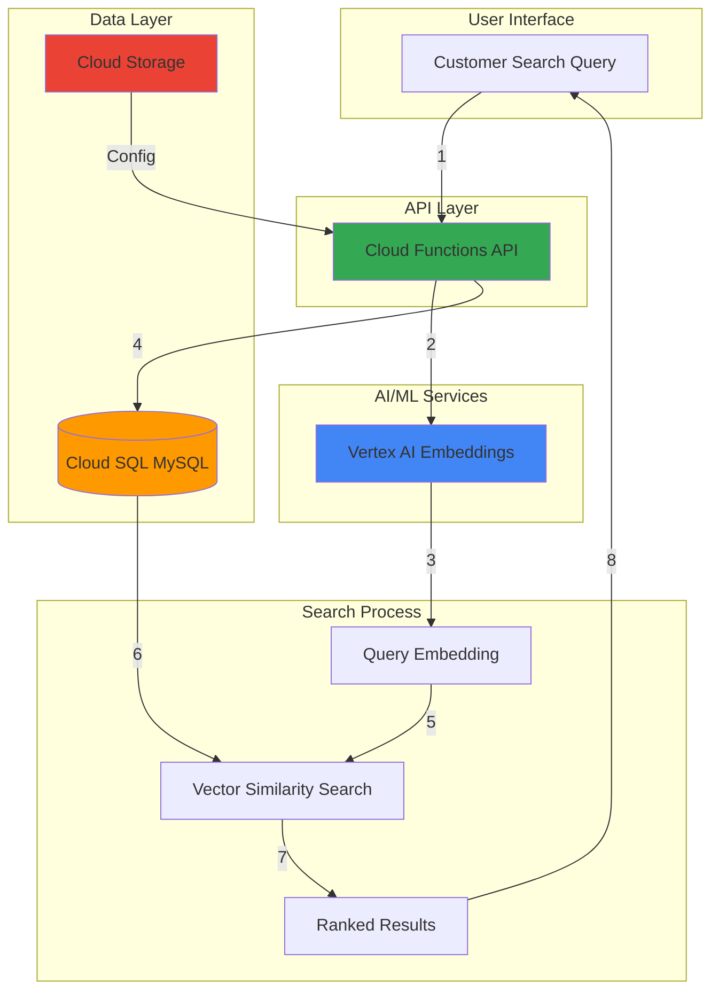

# Intelligent Product Search with Cloud SQL and Vertex AI

## Problem

E-commerce platforms struggle with traditional keyword-based search that fails to understand customer intent, leading to poor search results when customers use different terminology than product descriptions. Customers searching for "comfortable running shoes" might miss products described as "athletic footwear with cushioned soles," resulting in lost sales and frustrated users who can't find relevant products due to semantic gaps between query language and product descriptions.

## Solution

Build an intelligent semantic search system using Cloud SQL for MySQL to store product data with vector embeddings generated by Vertex AI's text embedding models. Cloud Functions processes search queries in real-time, generating embeddings and performing vector similarity searches to return semantically relevant products regardless of exact keyword matches, dramatically improving search relevance and customer experience through semantic understanding.

## Architecture Diagram



## Prerequisites

1. Google Cloud account with billing enabled and Vertex AI API access
2. gcloud CLI installed and configured (or Cloud Shell)
3. Basic knowledge of SQL, serverless functions, and vector embeddings
4. Understanding of semantic search concepts and e-commerce requirements
5. Estimated cost: $10-25 for Cloud SQL instance, Cloud Functions, and Vertex AI API calls during testing

> **Note**: This recipe creates production-ready infrastructure but can be scaled down using Cloud SQL's smallest instance size and Cloud Functions' generous free tier to minimize costs during development.

## Preparation

```bash
# Set environment variables for GCP resources
export PROJECT_ID="product-search-$(date +%s)"
export REGION="us-central1"
export ZONE="us-central1-a"

# Generate unique suffix for resource names
RANDOM_SUFFIX=$(openssl rand -hex 3)
export INSTANCE_NAME="product-db-${RANDOM_SUFFIX}"
export BUCKET_NAME="${PROJECT_ID}-products"
export FUNCTION_NAME="product-search-${RANDOM_SUFFIX}"

# Set default project and region
gcloud config set project ${PROJECT_ID}
gcloud config set compute/region ${REGION}
gcloud config set compute/zone ${ZONE}

# Enable required APIs
gcloud services enable sqladmin.googleapis.com
gcloud services enable aiplatform.googleapis.com
gcloud services enable cloudfunctions.googleapis.com
gcloud services enable storage.googleapis.com
gcloud services enable cloudbuild.googleapis.com

# Create Cloud Storage bucket for product data
gsutil mb -p ${PROJECT_ID} \
    -c STANDARD \
    -l ${REGION} \
    gs://${BUCKET_NAME}

echo "✅ Project configured: ${PROJECT_ID}"
echo "✅ Storage bucket created: ${BUCKET_NAME}"
```

## Steps

1. **Create Cloud SQL MySQL Instance with Vector Support**:

   Cloud SQL for MySQL provides a fully managed database service that can store both traditional relational data and vector embeddings. Modern MySQL 8.0 versions support JSON data types and improved indexing that can efficiently store and query high-dimensional vectors for semantic search applications while maintaining ACID compliance.

   ```bash
   # Create Cloud SQL instance optimized for vector operations
   gcloud sql instances create ${INSTANCE_NAME} \
       --database-version=MYSQL_8_0 \
       --tier=db-n1-standard-2 \
       --region=${REGION} \
       --storage-size=20GB \
       --storage-type=SSD \
       --backup-start-time=03:00 \
       --enable-bin-log \
       --maintenance-window-day=SUN \
       --maintenance-window-hour=04

   # Set root password
   export DB_PASSWORD="SecurePass$(openssl rand -hex 4)"
   gcloud sql users set-password root \
       --host=% \
       --instance=${INSTANCE_NAME} \
       --password=${DB_PASSWORD}

   echo "✅ Cloud SQL instance created with vector capabilities"
   ```

   The Cloud SQL instance is now running with SSD storage and sufficient memory to handle vector operations efficiently. The configuration includes automated backups and maintenance windows for production reliability.

2. **Create Database Schema for Product Catalog**:

   The database schema stores product information alongside vector embeddings generated from product descriptions. Using JSON columns for vectors provides flexibility while maintaining query performance through proper indexing strategies and MySQL 8.0's enhanced JSON capabilities.

   ```bash
   # Get the Cloud SQL instance IP
   export DB_IP=$(gcloud sql instances describe ${INSTANCE_NAME} \
       --format="value(ipAddresses[0].ipAddress)")

   # Create database
   gcloud sql databases create products \
       --instance=${INSTANCE_NAME}

   # Create temporary SQL file for schema
   cat > schema.sql << 'EOF'
CREATE TABLE product_catalog (
    id INT AUTO_INCREMENT PRIMARY KEY,
    name VARCHAR(255) NOT NULL,
    description TEXT NOT NULL,
    category VARCHAR(100),
    price DECIMAL(10,2),
    image_url VARCHAR(500),
    embedding JSON,
    created_at TIMESTAMP DEFAULT CURRENT_TIMESTAMP,
    INDEX idx_category (category),
    INDEX idx_price (price)
);

CREATE TABLE search_queries (
    id INT AUTO_INCREMENT PRIMARY KEY,
    query_text TEXT NOT NULL,
    query_embedding JSON,
    results_count INT,
    created_at TIMESTAMP DEFAULT CURRENT_TIMESTAMP
);
EOF

   # Execute schema creation
   gcloud sql connect ${INSTANCE_NAME} \
       --user=root \
       --database=products < schema.sql

   echo "✅ Database schema created for product catalog and search tracking"
   ```

   The schema supports both traditional product attributes and vector embeddings, enabling hybrid search capabilities that combine semantic similarity with traditional filters like category and price ranges.

3. **Create Cloud Function for Embedding Generation**:

   Cloud Functions provides serverless compute that automatically scales based on demand. This function integrates with Vertex AI to generate embeddings for both product descriptions during ingestion and search queries during runtime, using the latest text-embedding-005 model for optimal performance.

   ```bash
   # Create function directory and dependencies
   mkdir -p product-search-function
   cd product-search-function

   # Create requirements.txt
   cat > requirements.txt << 'EOF'
google-cloud-aiplatform==1.56.0
google-cloud-sql-connector==1.0.0
PyMySQL==1.1.0
functions-framework==3.5.0
numpy==1.24.3
vertexai==1.56.0
EOF

   # Create main function file
   cat > main.py << 'EOF'
import json
import os
import numpy as np
from google.cloud import aiplatform
from google.cloud.sql.connector import Connector
import pymysql
import functions_framework
import vertexai
from vertexai.language_models import TextEmbeddingModel

# Initialize Vertex AI
PROJECT_ID = os.environ.get('PROJECT_ID')
REGION = os.environ.get('REGION')
vertexai.init(project=PROJECT_ID, location=REGION)

def get_embedding(text):
    """Generate embedding using Vertex AI text-embedding-005 model."""
    model = TextEmbeddingModel.from_pretrained("text-embedding-005")
    embeddings = model.get_embeddings([text])
    return embeddings[0].values

def get_db_connection():
    """Create database connection using Cloud SQL Connector."""
    connector = Connector()
    
    def getconn():
        conn = connector.connect(
            f"{PROJECT_ID}:{os.environ.get('REGION')}:{os.environ.get('INSTANCE_NAME')}",
            "pymysql",
            user="root",
            password=os.environ.get('DB_PASSWORD'),
            db="products"
        )
        return conn
    
    return getconn()

@functions_framework.http
def search_products(request):
    """Handle product search requests."""
    if request.method == 'OPTIONS':
        headers = {
            'Access-Control-Allow-Origin': '*',
            'Access-Control-Allow-Methods': 'POST',
            'Access-Control-Allow-Headers': 'Content-Type',
        }
        return ('', 204, headers)
    
    try:
        request_json = request.get_json()
        query = request_json.get('query', '')
        limit = request_json.get('limit', 10)
        
        # Generate embedding for search query
        query_embedding = get_embedding(query)
        
        # Connect to database
        conn = get_db_connection()
        cursor = conn.cursor()
        
        # Store search query for analytics
        cursor.execute(
            "INSERT INTO search_queries (query_text, query_embedding) VALUES (%s, %s)",
            (query, json.dumps(query_embedding))
        )
        
        # Get all products with embeddings for similarity calculation
        cursor.execute("""
            SELECT id, name, description, category, price, image_url, embedding
            FROM product_catalog 
            WHERE embedding IS NOT NULL
        """)
        
        products = cursor.fetchall()
        results = []
        
        for product in products:
            product_embedding = json.loads(product[6])
            
            # Calculate cosine similarity
            similarity = np.dot(query_embedding, product_embedding) / (
                np.linalg.norm(query_embedding) * np.linalg.norm(product_embedding)
            )
            
            results.append({
                'id': product[0],
                'name': product[1],
                'description': product[2],
                'category': product[3],
                'price': float(product[4]) if product[4] else None,
                'image_url': product[5],
                'similarity': float(similarity)
            })
        
        # Sort by similarity and limit results
        results.sort(key=lambda x: x['similarity'], reverse=True)
        results = results[:limit]
        
        # Update results count
        cursor.execute(
            "UPDATE search_queries SET results_count = %s WHERE id = LAST_INSERT_ID()",
            (len(results),)
        )
        
        conn.commit()
        cursor.close()
        conn.close()
        
        headers = {'Access-Control-Allow-Origin': '*'}
        return (json.dumps({'results': results}), 200, headers)
        
    except Exception as e:
        return (json.dumps({'error': str(e)}), 500, {'Access-Control-Allow-Origin': '*'})

@functions_framework.http
def add_product(request):
    """Add new product with embedding generation."""
    if request.method == 'OPTIONS':
        headers = {
            'Access-Control-Allow-Origin': '*',
            'Access-Control-Allow-Methods': 'POST',
            'Access-Control-Allow-Headers': 'Content-Type',
        }
        return ('', 204, headers)
    
    try:
        request_json = request.get_json()
        
        # Generate embedding for product description
        description = request_json.get('description', '')
        embedding = get_embedding(description)
        
        # Connect to database
        conn = get_db_connection()
        cursor = conn.cursor()
        
        # Insert product with embedding
        cursor.execute("""
            INSERT INTO product_catalog (name, description, category, price, image_url, embedding)
            VALUES (%s, %s, %s, %s, %s, %s)
        """, (
            request_json.get('name'),
            description,
            request_json.get('category'),
            request_json.get('price'),
            request_json.get('image_url'),
            json.dumps(embedding)
        ))
        
        product_id = cursor.lastrowid
        conn.commit()
        cursor.close()
        conn.close()
        
        headers = {'Access-Control-Allow-Origin': '*'}
        return (json.dumps({'id': product_id, 'status': 'success'}), 200, headers)
        
    except Exception as e:
        return (json.dumps({'error': str(e)}), 500, {'Access-Control-Allow-Origin': '*'})
EOF

   echo "✅ Cloud Function code created with Vertex AI integration"
   ```

   The Cloud Function implements both product ingestion with automatic embedding generation and real-time search with vector similarity calculations, providing a complete API for semantic search operations using the current Vertex AI text embedding model.

4. **Deploy Cloud Function with Environment Variables**:

   Deploying the Cloud Function with proper environment variables and permissions enables secure access to Cloud SQL and Vertex AI services while maintaining scalability and cost efficiency through serverless architecture and Google Cloud's managed runtime.

   ```bash
   # Deploy search function
   gcloud functions deploy ${FUNCTION_NAME} \
       --gen2 \
       --runtime python311 \
       --trigger-http \
       --source . \
       --entry-point search_products \
       --memory 512MB \
       --timeout 60s \
       --region ${REGION} \
       --set-env-vars PROJECT_ID=${PROJECT_ID},REGION=${REGION},INSTANCE_NAME=${INSTANCE_NAME},DB_PASSWORD=${DB_PASSWORD} \
       --allow-unauthenticated

   # Deploy product addition function
   gcloud functions deploy "${FUNCTION_NAME}-add" \
       --gen2 \
       --runtime python311 \
       --trigger-http \
       --source . \
       --entry-point add_product \
       --memory 512MB \
       --timeout 60s \
       --region ${REGION} \
       --set-env-vars PROJECT_ID=${PROJECT_ID},REGION=${REGION},INSTANCE_NAME=${INSTANCE_NAME},DB_PASSWORD=${DB_PASSWORD} \
       --allow-unauthenticated

   # Get function URLs
   export SEARCH_URL=$(gcloud functions describe ${FUNCTION_NAME} \
       --region=${REGION} \
       --format="value(serviceConfig.uri)")
   export ADD_URL=$(gcloud functions describe "${FUNCTION_NAME}-add" \
       --region=${REGION} \
       --format="value(serviceConfig.uri)")

   cd ..
   echo "✅ Cloud Functions deployed successfully"
   echo "Search URL: ${SEARCH_URL}"
   echo "Add Product URL: ${ADD_URL}"
   ```

   The Cloud Functions are now deployed with automatic scaling and secure environment variable configuration, ready to handle product ingestion and search requests with integrated Vertex AI embedding generation using the latest Gen2 runtime.

5. **Load Sample Product Data**:

   Loading diverse sample product data demonstrates the semantic search capabilities across different categories and description styles, showcasing how the system understands product relationships beyond exact keyword matches through contextual understanding.

   ```bash
   # Create sample product data
   cat > sample_products.json << 'EOF'
[
  {
    "name": "UltraComfort Running Shoes",
    "description": "Lightweight athletic footwear with advanced cushioning technology and breathable mesh upper for long-distance running comfort",
    "category": "footwear",
    "price": 129.99,
    "image_url": "https://example.com/shoes1.jpg"
  },
  {
    "name": "Professional Chef Knife Set",
    "description": "High-carbon stainless steel culinary knives with ergonomic handles for precision cutting and food preparation",
    "category": "kitchen",
    "price": 89.99,
    "image_url": "https://example.com/knives1.jpg"
  },
  {
    "name": "Wireless Noise-Canceling Headphones",
    "description": "Premium audio device with active noise cancellation and wireless bluetooth connectivity for immersive music experience",
    "category": "electronics",
    "price": 199.99,
    "image_url": "https://example.com/headphones1.jpg"
  },
  {
    "name": "Ergonomic Office Chair",
    "description": "Adjustable desk chair with lumbar support and memory foam cushioning for comfortable workspace seating",
    "category": "furniture",
    "price": 299.99,
    "image_url": "https://example.com/chair1.jpg"
  },
  {
    "name": "Organic Green Tea Collection",
    "description": "Premium loose leaf tea blend with natural antioxidants and calming herbal ingredients for wellness and relaxation",
    "category": "beverages",
    "price": 24.99,
    "image_url": "https://example.com/tea1.jpg"
  }
]
EOF

   # Load products using the API
   for product in $(cat sample_products.json | jq -c '.[]'); do
     curl -X POST "${ADD_URL}" \
       -H "Content-Type: application/json" \
       -d "$product"
     echo " - Product added"
     sleep 2
   done

   echo "✅ Sample product data loaded with vector embeddings"
   ```

   The sample products cover diverse categories and use varied language styles, demonstrating how semantic search can find relevant items even when search terms don't exactly match product descriptions.

6. **Create Search Interface Script**:

   A command-line search interface demonstrates the semantic search capabilities and allows testing of various query types to validate that the system understands intent rather than just matching keywords, providing measurable similarity scores.

   ```bash
   # Create search testing script
   cat > test_search.sh << 'EOF'
#!/bin/bash

SEARCH_URL="$1"
QUERY="$2"

if [ -z "$SEARCH_URL" ] || [ -z "$QUERY" ]; then
    echo "Usage: $0 <search_url> <query>"
    echo "Example: $0 https://... 'comfortable shoes for running'"
    exit 1
fi

echo "Searching for: $QUERY"
echo "================================"

curl -X POST "$SEARCH_URL" \
    -H "Content-Type: application/json" \
    -d "{\"query\": \"$QUERY\", \"limit\": 5}" \
    | jq -r '.results[] | "\(.name) (Similarity: \(.similarity | . * 100 | floor)%)\n  \(.description)\n  Price: $\(.price)\n"'
EOF

   chmod +x test_search.sh

   echo "✅ Search interface created for testing semantic capabilities"
   ```

   The search script provides a simple way to test semantic search queries and observe how the system ranks products based on semantic similarity rather than exact keyword matches.

## Validation & Testing

1. **Test Semantic Search Capabilities**:

   ```bash
   # Test semantic understanding with different phrasings
   echo "Testing: 'comfortable shoes for jogging'"
   ./test_search.sh "${SEARCH_URL}" "comfortable shoes for jogging"
   
   echo -e "\nTesting: 'kitchen tools for cooking'"
   ./test_search.sh "${SEARCH_URL}" "kitchen tools for cooking"
   
   echo -e "\nTesting: 'audio equipment for music'"
   ./test_search.sh "${SEARCH_URL}" "audio equipment for music"
   ```

   Expected output: Products ranked by semantic relevance, with running shoes appearing first for "jogging" queries and kitchen knives for "cooking" queries.

2. **Verify Database Integration**:

   ```bash
   # Check that embeddings are stored in the database
   gcloud sql connect ${INSTANCE_NAME} \
       --user=root \
       --database=products
   
   # Run this SQL in the connection:
   # SELECT name, JSON_LENGTH(embedding) as embedding_dimension FROM product_catalog LIMIT 5;
   ```

   Expected output: Product names with embedding dimensions (768 for text-embedding-005 model).

3. **Test Search Analytics**:

   ```bash
   # Verify search queries are being tracked
   gcloud sql connect ${INSTANCE_NAME} \
       --user=root \
       --database=products
   
   # Run this SQL:
   # SELECT query_text, results_count, created_at FROM search_queries ORDER BY created_at DESC LIMIT 10;
   ```

   Expected output: Recent search queries with result counts and timestamps for analytics.

## Cleanup

1. **Remove Cloud Functions**:

   ```bash
   # Delete Cloud Functions
   gcloud functions delete ${FUNCTION_NAME} \
       --region=${REGION} \
       --quiet
   gcloud functions delete "${FUNCTION_NAME}-add" \
       --region=${REGION} \
       --quiet
   
   echo "✅ Cloud Functions deleted"
   ```

2. **Remove Cloud SQL Instance**:

   ```bash
   # Delete Cloud SQL instance
   gcloud sql instances delete ${INSTANCE_NAME} --quiet
   
   echo "✅ Cloud SQL instance deleted"
   ```

3. **Remove Cloud Storage Bucket**:

   ```bash
   # Remove storage bucket and contents
   gsutil -m rm -r gs://${BUCKET_NAME}
   
   echo "✅ Storage bucket removed"
   ```

4. **Clean Up Local Files**:

   ```bash
   # Remove local files and directories
   rm -rf product-search-function
   rm -f schema.sql sample_products.json test_search.sh
   
   # Clear environment variables
   unset PROJECT_ID REGION ZONE INSTANCE_NAME BUCKET_NAME FUNCTION_NAME
   unset DB_PASSWORD DB_IP SEARCH_URL ADD_URL RANDOM_SUFFIX
   
   echo "✅ Local cleanup completed"
   ```

## Discussion

This intelligent product search solution demonstrates the power of combining Google Cloud's managed database services with advanced AI capabilities to create semantic search experiences that understand customer intent. The architecture leverages Cloud SQL for MySQL to store both traditional product data and high-dimensional vector embeddings, while Cloud Functions provides serverless compute that automatically scales based on search demand. Vertex AI's text-embedding-005 model transforms product descriptions and search queries into dense 768-dimensional vector representations that capture semantic meaning beyond simple keyword matching.

The key architectural decision to store embeddings directly in Cloud SQL alongside product data enables efficient querying and maintains data consistency while supporting hybrid search capabilities. This approach allows combining semantic similarity with traditional filters like price ranges and categories, providing comprehensive search functionality. The Cloud Functions integration provides a RESTful API that can be easily consumed by web applications, mobile apps, or other services while maintaining security through Google Cloud's IAM and VPC controls. For additional guidance, see the [Google Cloud Architecture Framework](https://cloud.google.com/architecture/framework) and [best practices for AI/ML workloads](https://cloud.google.com/architecture/ai-ml).

Vector embeddings generated by Vertex AI's text-embedding-005 model create 768-dimensional representations that capture semantic relationships between products and search queries. This enables the system to understand that "running shoes" and "athletic footwear" refer to similar products, or that "kitchen knives" and "culinary tools" are related concepts. The cosine similarity calculation provides a robust method for ranking search results based on semantic relevance rather than exact text matches, significantly improving search accuracy for e-commerce applications.

Performance considerations include optimizing Cloud SQL instance sizing based on vector computation requirements and implementing caching strategies for frequently accessed embeddings. The serverless Cloud Functions automatically handle scaling during peak traffic while maintaining cost efficiency during low usage periods. For production deployments, consider implementing connection pooling for Cloud SQL and adding Memorystore for Redis caching for frequent search patterns. Additionally, explore using [Vertex AI Vector Search](https://cloud.google.com/vertex-ai/docs/vector-search/overview) for large-scale deployments requiring sub-millisecond response times.

> **Tip**: Monitor Cloud Functions execution time and memory usage to optimize instance configurations. Consider implementing batch embedding generation for large product catalogs to reduce API costs and improve ingestion performance using Vertex AI batch prediction features.

## Challenge

Extend this intelligent search solution by implementing these enhancements:

1. **Advanced Hybrid Search**: Implement weighted scoring that combines semantic similarity with traditional ranking factors like product popularity, ratings, and purchase history for more relevant results using Cloud SQL analytics functions.

2. **Multi-Modal Search**: Integrate Cloud Vision API to generate embeddings from product images, enabling visual similarity search where customers can find products similar to uploaded photos using multimodal embedding models.

3. **Real-Time Personalization**: Use Vertex AI Recommendations to create personalized embedding spaces based on user behavior and preferences, improving search relevance for individual customers through machine learning pipelines.

4. **Performance Optimization**: Implement approximate nearest neighbor search using Vertex AI Vector Search for sub-millisecond query response times at scale, supporting millions of products with efficient indexing.

5. **Advanced Analytics**: Build real-time dashboards using BigQuery and Looker Studio to analyze search patterns, identify trending products, and optimize inventory based on semantic search insights and customer behavior analysis.

## Infrastructure Code

*Infrastructure code will be generated after recipe approval.*