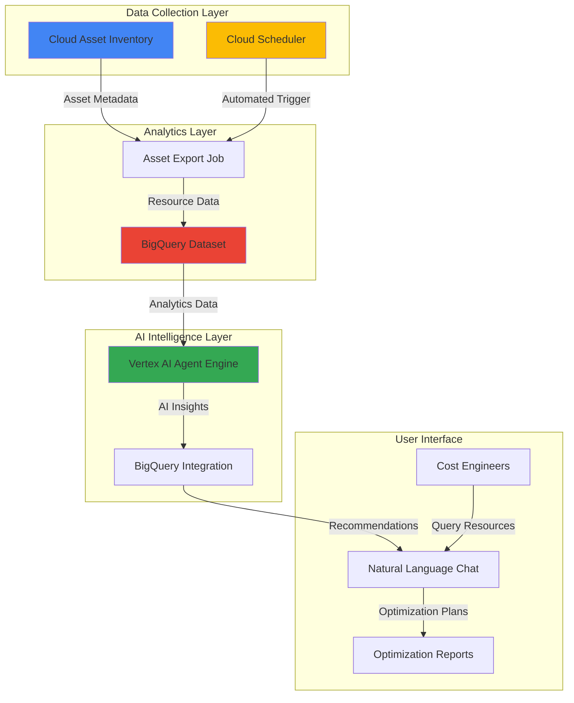

# Intelligent Resource Optimization with Agent Builder and Asset Inventory

## Problem

Organizations struggle with cloud cost overruns due to inefficient resource utilization and lack of automated optimization insights. Manual analysis of resource usage patterns across large-scale Google Cloud deployments is time-consuming and error-prone, leading to significant budget overages and missed optimization opportunities. Traditional monitoring tools provide data but lack intelligent automation to proactively identify and recommend cost-saving actions based on usage trends and business context.

## Solution

Deploy an intelligent AI-powered system that automatically analyzes cloud resource inventory, identifies optimization opportunities, and provides actionable recommendations through natural language interactions. The solution combines Vertex AI Agent Builder for intelligent analysis, Cloud Asset Inventory for comprehensive resource tracking, BigQuery for data analytics, and Cloud Scheduler for automated monitoring to create a proactive cost optimization workflow that delivers personalized insights and automated recommendations.

## Architecture Diagram



## Prerequisites

1. Google Cloud project with billing enabled and organization-level permissions
2. Google Cloud CLI installed and configured (or Cloud Shell)
3. Experience with BigQuery SQL and basic understanding of AI agents
4. Cloud Asset Inventory, Vertex AI, BigQuery, and Cloud Scheduler APIs enabled
5. Estimated cost: $25-50 per month for regular monitoring and analysis

> **Note**: This recipe requires organization-level permissions for comprehensive asset inventory. Ensure you have the Cloud Asset Viewer role at the organization level and Vertex AI User role in your project.

## Preparation

```bash
# Set environment variables for GCP resources
export PROJECT_ID="resource-optimization-$(date +%s)"
export REGION="us-central1"
export ZONE="us-central1-a"

# Generate unique suffix for resource names
RANDOM_SUFFIX=$(openssl rand -hex 3)
export DATASET_NAME="asset_optimization_${RANDOM_SUFFIX}"
export BUCKET_NAME="resource-optimizer-${RANDOM_SUFFIX}"
export JOB_NAME="asset-export-${RANDOM_SUFFIX}"

# Set default project and region
gcloud config set project ${PROJECT_ID}
gcloud config set compute/region ${REGION}
gcloud config set compute/zone ${ZONE}

# Enable required APIs
gcloud services enable cloudasset.googleapis.com
gcloud services enable bigquery.googleapis.com
gcloud services enable aiplatform.googleapis.com
gcloud services enable cloudscheduler.googleapis.com
gcloud services enable storage.googleapis.com

echo "✅ Project configured: ${PROJECT_ID}"
echo "✅ Dataset name: ${DATASET_NAME}"
echo "✅ Bucket name: ${BUCKET_NAME}"
```

## Steps

1. **Create BigQuery Dataset for Asset Analytics**:

   BigQuery serves as the central repository for asset metadata and cost optimization analytics. The dataset structure enables complex queries on resource utilization patterns, helping identify optimization opportunities through SQL-based analysis and AI-powered insights.

   ```bash
   # Create BigQuery dataset for asset inventory
   bq mk --location=${REGION} \
       --description="Asset inventory for cost optimization" \
       ${PROJECT_ID}:${DATASET_NAME}
   
   # Create storage bucket for Vertex AI Agent Engine staging
   gsutil mb -p ${PROJECT_ID} \
       -c STANDARD \
       -l ${REGION} \
       gs://${BUCKET_NAME}
   
   echo "✅ BigQuery dataset and storage bucket created"
   ```

   The BigQuery dataset now provides the foundation for storing and analyzing asset metadata. This structured approach enables complex cost optimization queries and integrates with Vertex AI Agent Engine for intelligent analysis.

2. **Configure Cloud Asset Inventory Export**:

   Cloud Asset Inventory provides comprehensive metadata about all Google Cloud resources within your organization. Setting up automated exports to BigQuery enables continuous monitoring of resource changes and maintains historical data for trend analysis.

   ```bash
   # Export current asset inventory to BigQuery
   gcloud asset export \
       --organization=$(gcloud organizations list --format="value(name)") \
       --content-type=resource \
       --bigquery-table=projects/${PROJECT_ID}/datasets/${DATASET_NAME}/tables/asset_inventory \
       --output-bigquery-force \
       --asset-types="compute.googleapis.com/Instance,compute.googleapis.com/Disk,storage.googleapis.com/Bucket,container.googleapis.com/Cluster,sqladmin.googleapis.com/Instance"
   
   # Wait for export to complete
   sleep 60
   
   echo "✅ Asset inventory export completed"
   ```

   The asset export configuration focuses on the most cost-impactful resource types and provides comprehensive visibility into your cloud infrastructure. This data foundation enables sophisticated optimization analysis through both SQL queries and AI-powered insights.

3. **Set Up Automated Asset Monitoring with Cloud Scheduler**:

   Cloud Scheduler enables regular automated exports of asset inventory data, ensuring your optimization analysis is based on current information. This automation eliminates manual intervention while maintaining continuous visibility into resource changes.

   ```bash
   # Create service account for scheduler
   gcloud iam service-accounts create asset-export-scheduler \
       --display-name="Asset Export Scheduler" \
       --description="Service account for automated asset exports"
   
   # Grant necessary permissions
   gcloud projects add-iam-policy-binding ${PROJECT_ID} \
       --member="serviceAccount:asset-export-scheduler@${PROJECT_ID}.iam.gserviceaccount.com" \
       --role="roles/cloudasset.viewer"
   
   gcloud projects add-iam-policy-binding ${PROJECT_ID} \
       --member="serviceAccount:asset-export-scheduler@${PROJECT_ID}.iam.gserviceaccount.com" \
       --role="roles/bigquery.dataEditor"
   
   # Create Cloud Function to trigger asset exports
   cat > export_function.py << 'EOF'
import functions_framework
from google.cloud import asset_v1

@functions_framework.http
def trigger_asset_export(request):
    client = asset_v1.AssetServiceClient()
    parent = f"organizations/{request.get_json().get('organization_id')}"
    output_config = asset_v1.OutputConfig()
    output_config.bigquery_destination.dataset = f"projects/{request.get_json().get('project_id')}/datasets/{request.get_json().get('dataset_name')}"
    output_config.bigquery_destination.table = "asset_inventory"
    output_config.bigquery_destination.force = True
    
    operation = client.export_assets(
        request={
            "parent": parent,
            "output_config": output_config,
            "content_type": asset_v1.ContentType.RESOURCE,
            "asset_types": [
                "compute.googleapis.com/Instance",
                "compute.googleapis.com/Disk", 
                "storage.googleapis.com/Bucket",
                "container.googleapis.com/Cluster",
                "sqladmin.googleapis.com/Instance"
            ]
        }
    )
    return f"Export operation started: {operation.name}"
EOF

   # Create scheduled job for daily asset exports
   gcloud scheduler jobs create http ${JOB_NAME} \
       --location=${REGION} \
       --schedule="0 2 * * *" \
       --time-zone="America/New_York" \
       --uri="https://${REGION}-${PROJECT_ID}.cloudfunctions.net/trigger_asset_export" \
       --http-method=POST \
       --headers="Content-Type=application/json" \
       --message-body="{\"organization_id\":\"$(gcloud organizations list --format='value(name)' | cut -d'/' -f2)\",\"project_id\":\"${PROJECT_ID}\",\"dataset_name\":\"${DATASET_NAME}\"}"
   
   echo "✅ Automated asset export schedule configured"
   ```

   The scheduled export job runs daily at 2 AM, ensuring your BigQuery dataset contains fresh asset data for optimization analysis. This automation provides consistent data freshness without manual intervention, supporting reliable AI-powered recommendations.

4. **Create Optimization Analysis Queries**:

   Develop sophisticated SQL queries that identify cost optimization opportunities by analyzing resource utilization patterns, idle resources, and inefficient configurations. These queries form the foundation for AI-powered recommendations.

   ```bash
   # Create view for resource utilization analysis
   bq query --use_legacy_sql=false \
   "CREATE OR REPLACE VIEW \`${PROJECT_ID}.${DATASET_NAME}.resource_optimization_analysis\` AS
   SELECT 
     name,
     asset_type,
     JSON_EXTRACT_SCALAR(resource.data, '$.location') as location,
     JSON_EXTRACT_SCALAR(resource.data, '$.project') as project,
     DATE_DIFF(CURRENT_DATE(), DATE(update_time), DAY) as age_days,
     JSON_EXTRACT_SCALAR(resource.data, '$.status') as status,
     JSON_EXTRACT_SCALAR(resource.data, '$.machineType') as machine_type,
     CASE 
       WHEN asset_type LIKE '%Instance%' AND JSON_EXTRACT_SCALAR(resource.data, '$.status') = 'TERMINATED' THEN 'Idle Compute'
       WHEN asset_type LIKE '%Disk%' AND JSON_EXTRACT_SCALAR(resource.data, '$.status') = 'READY' AND JSON_EXTRACT_SCALAR(resource.data, '$.users') IS NULL THEN 'Unattached Storage'
       WHEN asset_type LIKE '%Bucket%' THEN 'Storage Analysis Needed'
       ELSE 'Active Resource'
     END as optimization_category,
     CASE
       WHEN DATE_DIFF(CURRENT_DATE(), DATE(update_time), DAY) > 30 AND JSON_EXTRACT_SCALAR(resource.data, '$.status') != 'RUNNING' THEN 90
       WHEN DATE_DIFF(CURRENT_DATE(), DATE(update_time), DAY) > 7 AND JSON_EXTRACT_SCALAR(resource.data, '$.status') = 'TERMINATED' THEN 70
       WHEN JSON_EXTRACT_SCALAR(resource.data, '$.machineType') LIKE '%n1-%' THEN 60
       ELSE 20
     END as optimization_score
   FROM \`${PROJECT_ID}.${DATASET_NAME}.asset_inventory\`
   WHERE update_time IS NOT NULL"
   
   # Create cost impact analysis query
   bq query --use_legacy_sql=false \
   "CREATE OR REPLACE VIEW \`${PROJECT_ID}.${DATASET_NAME}.cost_impact_summary\` AS
   SELECT 
     optimization_category,
     COUNT(*) as resource_count,
     AVG(optimization_score) as avg_optimization_score,
     COUNT(*) * AVG(optimization_score) as total_impact_score
   FROM \`${PROJECT_ID}.${DATASET_NAME}.resource_optimization_analysis\`
   GROUP BY optimization_category
   ORDER BY total_impact_score DESC"
   
   echo "✅ Optimization analysis queries created"
   ```

   These analytical views provide structured insights into resource optimization opportunities, categorizing resources by potential impact and creating scoring systems that prioritize the most valuable optimizations for AI agent analysis.

5. **Deploy Vertex AI Agent Engine with Asset Analysis Tools**:

   Vertex AI Agent Engine creates an intelligent interface for natural language interaction with your asset optimization data. The agent integrates with BigQuery to provide contextual recommendations based on resource analysis.

   ```bash
   # Create Python environment and agent code
   mkdir -p agent-workspace
   cd agent-workspace
   
   # Create agent implementation
   cat > optimization_agent.py << 'EOF'
import vertexai
from vertexai import agent_engines
from google.cloud import bigquery
import json

def query_optimization_data(query_type: str = "summary"):
    """Query asset optimization data from BigQuery."""
    client = bigquery.Client()
    
    if query_type == "summary":
        query = f"""
        SELECT optimization_category, resource_count, avg_optimization_score
        FROM `{project_id}.{dataset_name}.cost_impact_summary`
        ORDER BY total_impact_score DESC
        LIMIT 10
        """
    elif query_type == "high_priority":
        query = f"""
        SELECT name, asset_type, optimization_category, optimization_score
        FROM `{project_id}.{dataset_name}.resource_optimization_analysis`
        WHERE optimization_score > 70
        ORDER BY optimization_score DESC
        LIMIT 20
        """
    else:
        query = f"""
        SELECT COUNT(*) as total_resources,
               COUNT(CASE WHEN optimization_score > 70 THEN 1 END) as high_priority,
               AVG(optimization_score) as avg_score
        FROM `{project_id}.{dataset_name}.resource_optimization_analysis`
        """
    
    results = client.query(query).to_dataframe()
    return results.to_json(orient='records')

# Initialize Vertex AI
vertexai.init(
    project="${PROJECT_ID}",
    location="${REGION}",
    staging_bucket="gs://${BUCKET_NAME}"
)

# Create agent with BigQuery tools
agent = agent_engines.LangchainAgent(
    model="gemini-1.5-pro",
    tools=[query_optimization_data],
    model_kwargs={
        "temperature": 0.2,
        "max_output_tokens": 2000,
        "top_p": 0.95,
    },
)
EOF
   
   # Create requirements file
   cat > requirements.txt << 'EOF'
google-cloud-aiplatform[agent_engines,langchain]
google-cloud-bigquery
pandas
EOF
   
   # Deploy the agent
   python3 -c "
import vertexai
from vertexai import agent_engines
import sys
sys.path.append('.')
from optimization_agent import agent

remote_agent = agent_engines.create(
    agent,
    requirements=['google-cloud-aiplatform[agent_engines,langchain]', 'google-cloud-bigquery', 'pandas'],
    display_name='resource-optimization-agent'
)
print(f'✅ Agent deployed with ID: {remote_agent.resource_name}')

# Save agent resource name for later use
with open('../agent_resource_name.txt', 'w') as f:
    f.write(remote_agent.resource_name)
"
   
   cd ..
   echo "✅ Vertex AI Agent Engine deployed with asset analysis capabilities"
   ```

   The AI agent now provides natural language access to your asset optimization data, enabling conversational queries about resource utilization, cost optimization opportunities, and automated recommendation generation based on current asset inventory.

6. **Create Optimization Dashboard and Monitoring**:

   Establish comprehensive monitoring and dashboard capabilities that provide ongoing visibility into optimization opportunities and track the success of implemented recommendations. This creates a feedback loop for continuous improvement.

   ```bash
   # Create optimization metrics table
   bq query --use_legacy_sql=false \
   "CREATE OR REPLACE TABLE \`${PROJECT_ID}.${DATASET_NAME}.optimization_metrics\` AS
   SELECT 
     CURRENT_TIMESTAMP() as analysis_time,
     COUNT(*) as total_resources,
     COUNT(CASE WHEN optimization_score > 70 THEN 1 END) as high_priority_optimizations,
     COUNT(CASE WHEN optimization_score BETWEEN 40 AND 70 THEN 1 END) as medium_priority_optimizations,
     AVG(optimization_score) as avg_optimization_score,
     SUM(CASE WHEN optimization_category = 'Idle Compute' THEN 1 ELSE 0 END) as idle_compute_count,
     SUM(CASE WHEN optimization_category = 'Unattached Storage' THEN 1 ELSE 0 END) as unattached_storage_count
   FROM \`${PROJECT_ID}.${DATASET_NAME}.resource_optimization_analysis\`"
   
   # Create alerting policy for high-impact optimization opportunities
   cat > monitoring-policy.yaml << EOF
displayName: "High-Impact Resource Optimization Alert"
conditions:
  - displayName: "High Optimization Score Detected"
    conditionThreshold:
      filter: 'resource.type="bigquery_table"'
      comparison: COMPARISON_GREATER_THAN
      thresholdValue: 10.0
      duration: "300s"
notificationChannels: []
alertStrategy:
  autoClose: "604800s"
EOF
   
   echo "✅ Optimization monitoring and alerting configured"
   ```

   The monitoring infrastructure provides continuous tracking of optimization opportunities and enables proactive alerts when high-impact optimization opportunities are identified, ensuring timely action on cost-saving recommendations.

7. **Test Agent-Powered Optimization Queries**:

   Validate the complete system by testing the AI agent's ability to analyze asset data and provide optimization recommendations. This ensures the integration between all components works effectively for practical cost optimization scenarios.

   ```bash
   # Get agent resource name
   AGENT_RESOURCE_NAME=$(cat agent_resource_name.txt)
   
   # Test agent query capabilities using Python SDK
   python3 -c "
import vertexai
from vertexai import agent_engines

# Initialize Vertex AI
vertexai.init(project='${PROJECT_ID}', location='${REGION}')

# Get the deployed agent
agent = agent_engines.get('${AGENT_RESOURCE_NAME}')

# Test optimization queries
print('Testing optimization summary query...')
response1 = agent.query(
    input='What are the top 5 cost optimization opportunities in my infrastructure based on the current asset inventory?'
)
print(f'Response: {response1}')

print('\nTesting idle resource analysis...')
response2 = agent.query(
    input='Show me all idle compute instances that have been terminated for more than 7 days and estimate potential cost savings'
)
print(f'Response: {response2}')

print('\nTesting optimization scoring analysis...')
response3 = agent.query(
    input='Generate a summary report of resources with optimization scores above 70 and provide specific action recommendations'
)
print(f'Response: {response3}')
"
   
   echo "✅ Agent optimization queries tested successfully"
   ```

   The testing validates that the AI agent can effectively analyze asset inventory data, identify optimization opportunities, and provide actionable recommendations with estimated cost impacts, demonstrating the full value of the intelligent optimization system.

## Validation & Testing

1. Verify BigQuery dataset contains asset inventory data:

   ```bash
   # Check asset inventory data volume
   bq query --use_legacy_sql=false \
   "SELECT 
     COUNT(*) as total_assets,
     COUNT(DISTINCT asset_type) as unique_asset_types,
     MIN(update_time) as oldest_asset,
     MAX(update_time) as newest_update
   FROM \`${PROJECT_ID}.${DATASET_NAME}.asset_inventory\`"
   ```

   Expected output: Asset count > 0 with various asset types and recent timestamps

2. Test optimization analysis views:

   ```bash
   # Verify optimization scoring works
   bq query --use_legacy_sql=false \
   "SELECT optimization_category, COUNT(*) as count, AVG(optimization_score) as avg_score
   FROM \`${PROJECT_ID}.${DATASET_NAME}.resource_optimization_analysis\`
   GROUP BY optimization_category"
   ```

   Expected output: Optimization categories with resource counts and average scores

3. Validate agent responsiveness and accuracy:

   ```bash
   # Test agent with sample optimization query
   python3 -c "
import vertexai
from vertexai import agent_engines
vertexai.init(project='${PROJECT_ID}', location='${REGION}')
agent = agent_engines.get('$(cat agent_resource_name.txt)')
response = agent.query(input='List the 3 most expensive resource types to optimize and explain why')
print(f'Agent response: {response}')
"
   ```

   Expected output: Intelligent response with specific resource recommendations and cost impact analysis

4. Verify scheduled automation:

   ```bash
   # Check scheduler job status
   gcloud scheduler jobs describe ${JOB_NAME} \
       --location=${REGION} \
       --format="table(name,schedule,state)"
   ```

   Expected output: Job in ENABLED state with correct schedule configuration

## Cleanup

1. Remove Cloud Scheduler job:

   ```bash
   # Delete scheduled export job
   gcloud scheduler jobs delete ${JOB_NAME} \
       --location=${REGION} \
       --quiet
   
   echo "✅ Scheduler job deleted"
   ```

2. Remove Vertex AI Agent Engine:

   ```bash
   # Delete AI agent
   python3 -c "
import vertexai
from vertexai import agent_engines
vertexai.init(project='${PROJECT_ID}', location='${REGION}')
agent = agent_engines.get('$(cat agent_resource_name.txt)')
agent.delete(force=True)
print('✅ Vertex AI Agent Engine deleted')
"
   
   # Remove agent workspace
   rm -rf agent-workspace agent_resource_name.txt
   
   echo "✅ Agent workspace cleaned up"
   ```

3. Remove BigQuery resources:

   ```bash
   # Delete BigQuery dataset and all tables
   bq rm -r -f ${PROJECT_ID}:${DATASET_NAME}
   
   echo "✅ BigQuery dataset removed"
   ```

4. Remove storage bucket and service accounts:

   ```bash
   # Delete storage bucket
   gsutil -m rm -r gs://${BUCKET_NAME}
   
   # Delete service account
   gcloud iam service-accounts delete \
       asset-export-scheduler@${PROJECT_ID}.iam.gserviceaccount.com \
       --quiet
   
   # Remove configuration files
   rm -f export_function.py monitoring-policy.yaml
   
   # Clear environment variables
   unset PROJECT_ID REGION ZONE DATASET_NAME BUCKET_NAME JOB_NAME RANDOM_SUFFIX
   
   echo "✅ Storage bucket, service accounts, and configuration files removed"
   ```

## Discussion

This solution demonstrates the powerful combination of Google Cloud's asset management and AI capabilities to create an intelligent resource optimization system. Cloud Asset Inventory provides comprehensive visibility into your entire Google Cloud infrastructure, collecting metadata from compute instances, storage buckets, databases, and other resources with historical data capabilities. By exporting this data to BigQuery, organizations gain the ability to perform sophisticated SQL-based analysis on resource utilization patterns, identify trends, and quantify optimization opportunities.

The integration with Vertex AI Agent Engine elevates this system beyond traditional monitoring tools by providing natural language interaction capabilities. The Agent Engine enables sophisticated tool integration, allowing the AI agent to query BigQuery data, analyze resource patterns, and provide contextual recommendations based on business requirements. This approach transforms raw asset data into actionable insights that can be communicated in business terms, making cost optimization accessible to both technical and non-technical stakeholders.

The automated scheduling component ensures continuous monitoring without manual intervention, while the BigQuery analytics foundation supports both real-time decision making and long-term trend analysis. Organizations can identify idle resources, detect oversized infrastructure, and discover opportunities for modern instance types or storage classes. The AI agent acts as an intelligent interface to this data, capable of understanding complex queries about resource optimization and providing specific, measurable recommendations with estimated cost impacts.

> **Tip**: Regularly review and update the optimization scoring algorithms based on your organization's specific cost patterns and business priorities. The AI agent can help identify which optimization categories provide the highest ROI for your particular infrastructure.

**Documentation References:**
- [Vertex AI Agent Engine Overview](https://cloud.google.com/vertex-ai/generative-ai/docs/agent-engine/overview)
- [Cloud Asset Inventory Documentation](https://cloud.google.com/asset-inventory/docs/overview)
- [Export Asset Metadata to BigQuery](https://cloud.google.com/asset-inventory/docs/export-bigquery)
- [BigQuery Sample SQL Queries for Asset Inventory](https://cloud.google.com/asset-inventory/docs/exporting-to-bigquery-sample-queries)
- [Google Cloud Architecture Framework](https://cloud.google.com/architecture/framework)

## Challenge

Extend this solution by implementing these enhancements:

1. **Multi-Project Cost Allocation**: Integrate Cloud Billing API to correlate asset usage with actual costs and implement chargeback mechanisms across different projects and departments.

2. **Predictive Cost Modeling**: Use Vertex AI AutoML to build predictive models that forecast future resource costs based on usage trends and seasonal patterns identified in the asset inventory data.

3. **Automated Remediation Workflows**: Implement Cloud Functions triggered by optimization recommendations to automatically resize instances, delete unused resources, or migrate to more cost-effective storage classes based on predefined policies.

4. **Integration with Cloud Monitoring**: Connect the optimization system with Cloud Monitoring to correlate resource utilization metrics with asset inventory data, providing more accurate optimization recommendations based on actual performance data.

5. **Custom Optimization Policies**: Develop organization-specific optimization rules using Cloud Policy Intelligence and integrate them with the AI agent to provide recommendations that align with compliance requirements and business policies.

## Infrastructure Code

*Infrastructure code will be generated after recipe approval.*