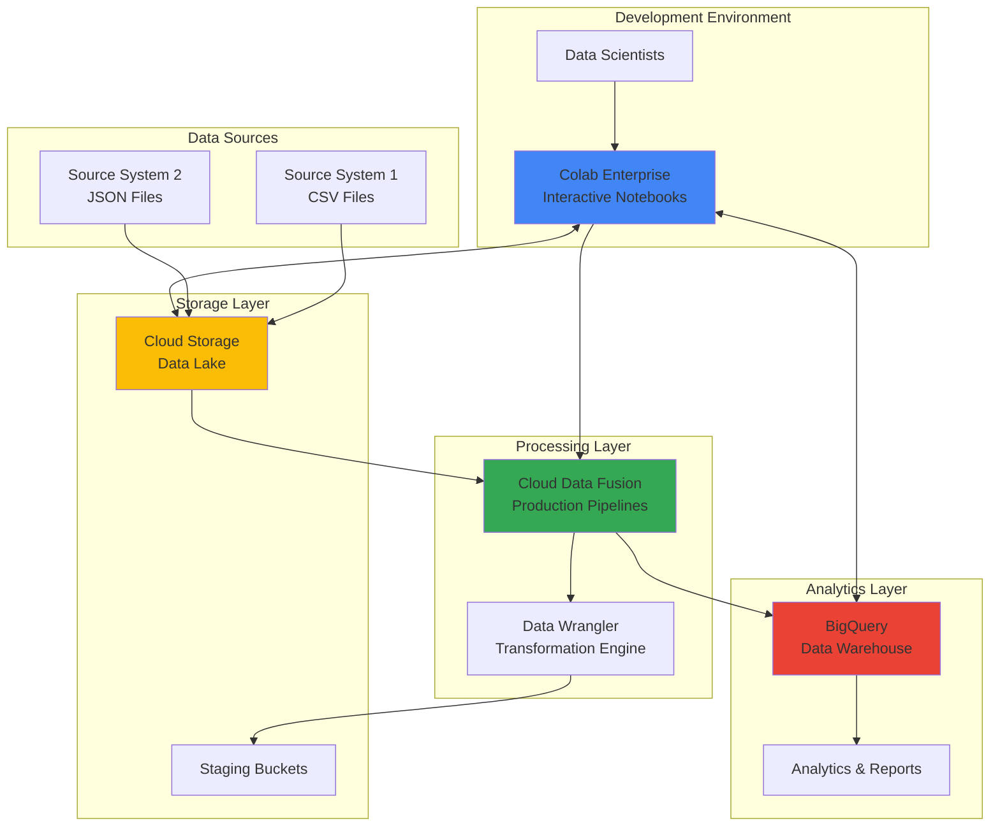

# Interactive Data Pipeline Prototypes with Cloud Data Fusion and Colab Enterprise

## Problem

Data scientists and engineers often face challenges when developing complex ETL transformations, struggling with the disconnect between exploratory data analysis in notebooks and production pipeline development. Traditional approaches require extensive context switching between development environments, leading to inefficient prototyping cycles and increased time-to-production for data pipelines. Teams frequently encounter issues with data quality validation, transformation logic testing, and performance optimization before deploying to production systems.

## Solution

Build an integrated workflow that leverages Colab Enterprise for interactive data exploration and transformation prototyping, seamlessly connected to Cloud Data Fusion for production pipeline deployment. This approach enables data scientists to develop and test transformation logic in a familiar notebook environment, validate data quality interactively, and export pipeline configurations directly to Cloud Data Fusion for scalable production deployment. The solution includes BigQuery integration for analytics and Cloud Storage for staging data.

## Architecture Diagram



## Prerequisites

1. Google Cloud project with billing enabled and Data Fusion, Notebooks, BigQuery, and Cloud Storage APIs enabled
2. Cloud SDK (gcloud) installed and configured or Cloud Shell access
3. Basic knowledge of data pipelines, ETL concepts, and Python programming
4. Understanding of BigQuery SQL and data transformation patterns
5. Estimated cost: $50-75 per day for moderate usage (includes Data Fusion instance, Colab Enterprise runtime, BigQuery processing, and Cloud Storage)

> **Note**: Cloud Data Fusion instances incur charges while running. Consider using the Developer edition for prototyping to minimize costs during development phases.

## Preparation

```bash
# Set environment variables for GCP resources
export PROJECT_ID="data-pipeline-$(date +%s)"
export REGION="us-central1"
export ZONE="us-central1-a"

# Generate unique suffix for resource names
RANDOM_SUFFIX=$(openssl rand -hex 3)
export INSTANCE_NAME="data-fusion-${RANDOM_SUFFIX}"
export BUCKET_NAME="pipeline-data-${RANDOM_SUFFIX}"
export DATASET_NAME="pipeline_analytics_${RANDOM_SUFFIX}"

# Set default project and region
gcloud config set project ${PROJECT_ID}
gcloud config set compute/region ${REGION}
gcloud config set compute/zone ${ZONE}

# Enable required APIs
gcloud services enable datafusion.googleapis.com
gcloud services enable notebooks.googleapis.com
gcloud services enable bigquery.googleapis.com
gcloud services enable storage.googleapis.com
gcloud services enable compute.googleapis.com

echo "✅ Project configured: ${PROJECT_ID}"
echo "✅ Instance name: ${INSTANCE_NAME}"
echo "✅ Bucket name: ${BUCKET_NAME}"
```

## Steps

1. **Create Cloud Storage Bucket for Data Lake**:

   Cloud Storage provides the foundational data lake infrastructure for our pipeline development workflow. Creating appropriately configured buckets with regional placement ensures optimal performance for data processing while maintaining cost efficiency. The multi-regional setup supports both interactive development and production pipeline requirements.

   ```bash
   # Create primary data bucket for raw and processed data
   gsutil mb -p ${PROJECT_ID} \
       -c STANDARD \
       -l ${REGION} \
       gs://${BUCKET_NAME}
   
   # Create staging bucket for pipeline artifacts
   gsutil mb -p ${PROJECT_ID} \
       -c STANDARD \
       -l ${REGION} \
       gs://${BUCKET_NAME}-staging
   
   # Enable versioning for data protection
   gsutil versioning set on gs://${BUCKET_NAME}
   gsutil versioning set on gs://${BUCKET_NAME}-staging
   
   echo "✅ Cloud Storage buckets created successfully"
   ```

   The storage infrastructure now provides reliable, scalable data hosting with versioning enabled for data lineage and recovery. This foundation supports both the interactive development workflow in Colab Enterprise and the production data processing requirements of Cloud Data Fusion.

2. **Create BigQuery Dataset for Analytics**:

   BigQuery serves as the analytics engine and destination for our processed data. Creating a properly configured dataset with appropriate location settings ensures optimal query performance and seamless integration with both Colab Enterprise notebooks and Cloud Data Fusion pipelines.

   ```bash
   # Create BigQuery dataset for analytics
   bq mk \
       --project_id=${PROJECT_ID} \
       --location=${REGION} \
       --dataset \
       ${DATASET_NAME}
   
   # Set dataset description
   bq update \
       --description "Analytics dataset for pipeline prototyping" \
       ${PROJECT_ID}:${DATASET_NAME}
   
   echo "✅ BigQuery dataset created: ${DATASET_NAME}"
   ```

   The BigQuery dataset provides a serverless, highly scalable analytics platform that automatically optimizes query performance. This integration enables real-time validation of transformation results and supports advanced analytics workflows directly from Colab Enterprise notebooks.

3. **Deploy Cloud Data Fusion Instance**:

   Cloud Data Fusion provides the enterprise-grade pipeline orchestration and management capabilities. The Developer edition offers cost-effective prototyping while maintaining access to the full feature set including visual pipeline design, data wrangling, and monitoring capabilities.

   ```bash
   # Create Cloud Data Fusion Developer instance
   gcloud data-fusion instances create ${INSTANCE_NAME} \
       --location=${REGION} \
       --edition=developer \
       --enable-stackdriver-logging \
       --enable-stackdriver-monitoring
   
   # Wait for instance to become ready (this may take 15-20 minutes)
   echo "⏳ Waiting for Data Fusion instance to become ready..."
   gcloud data-fusion instances wait ${INSTANCE_NAME} \
       --location=${REGION} \
       --condition=ready
   
   echo "✅ Cloud Data Fusion instance deployed successfully"
   ```

   The Cloud Data Fusion instance now provides a fully managed, visual pipeline development environment with built-in data quality validation, monitoring, and scaling capabilities. This platform enables seamless transition from notebook prototypes to production-ready data pipelines.

4. **Create Sample Data for Pipeline Development**:

   Sample datasets provide realistic data for testing transformation logic and validating pipeline behavior. Creating representative data with various formats and structures enables comprehensive testing of data quality rules and transformation patterns.

   ```bash
   # Create sample customer data (CSV format)
   cat > customer_data.csv << 'EOF'
   customer_id,name,email,signup_date,region
   1001,John Smith,john.smith@email.com,2023-01-15,US-East
   1002,Jane Doe,jane.doe@email.com,2023-02-20,US-West
   1003,Bob Johnson,bob.johnson@email.com,2023-03-10,EU-Central
   1004,Alice Brown,alice.brown@email.com,2023-04-05,US-East
   1005,Charlie Davis,charlie.davis@email.com,2023-05-12,APAC
   EOF
   
   # Create sample transaction data (JSON format)
   cat > transaction_data.json << 'EOF'
   {"transaction_id": "tx001", "customer_id": 1001, "amount": 125.50, "timestamp": "2023-06-01T10:30:00Z", "product": "Widget A"}
   {"transaction_id": "tx002", "customer_id": 1002, "amount": 75.25, "timestamp": "2023-06-01T11:15:00Z", "product": "Widget B"}
   {"transaction_id": "tx003", "customer_id": 1003, "amount": 200.00, "timestamp": "2023-06-01T14:20:00Z", "product": "Widget C"}
   {"transaction_id": "tx004", "customer_id": 1001, "amount": 89.99, "timestamp": "2023-06-02T09:45:00Z", "product": "Widget A"}
   {"transaction_id": "tx005", "customer_id": 1004, "amount": 150.75, "timestamp": "2023-06-02T16:30:00Z", "product": "Widget B"}
   EOF
   
   # Upload sample data to Cloud Storage
   gsutil cp customer_data.csv gs://${BUCKET_NAME}/raw/customer_data.csv
   gsutil cp transaction_data.json gs://${BUCKET_NAME}/raw/transaction_data.json
   
   echo "✅ Sample data uploaded to Cloud Storage"
   ```

   The sample datasets now provide realistic data structures for testing various transformation scenarios, data quality validation rules, and join operations. This foundation enables comprehensive pipeline development and testing in both interactive and production environments.

5. **Set Up Colab Enterprise Environment**:

   Colab Enterprise provides the collaborative notebook environment with enterprise security and BigQuery integration. Creating a properly configured runtime with appropriate machine type and permissions enables seamless data exploration and pipeline prototyping.

   ```bash
   # Get the Data Fusion instance endpoint for notebook integration
   FUSION_ENDPOINT=$(gcloud data-fusion instances describe ${INSTANCE_NAME} \
       --location=${REGION} \
       --format="value(apiEndpoint)")
   
   # Create runtime template for Colab Enterprise
   cat > runtime_config.yaml << EOF
   acceleratorConfig:
     coreCount: '0'
     type: NVIDIA_TESLA_T4
   dataDiskSizeGb: '100'
   dataDiskType: PD_STANDARD
   machineType: n1-standard-4
   metadata:
     framework: TensorFlow
     install-nvidia-driver: 'True'
   networks:
   - subnet: default
   serviceAccount: ${PROJECT_ID}@appspot.gserviceaccount.com
   tags:
   - colab-enterprise
   EOF
   
   echo "✅ Colab Enterprise configuration ready"
   echo "📝 Data Fusion endpoint: ${FUSION_ENDPOINT}"
   echo "📝 Access Colab Enterprise via Google Cloud Console > Vertex AI > Colab Enterprise"
   ```

   The Colab Enterprise environment is now configured with appropriate compute resources and service account permissions for seamless integration with Cloud Data Fusion, BigQuery, and Cloud Storage. This setup enables interactive data exploration and transformation development with enterprise-grade security.

6. **Create Pipeline Prototype in Notebook**:

   Interactive pipeline prototyping in Colab Enterprise enables rapid iteration on transformation logic while maintaining full access to Google Cloud services. This approach allows data scientists to validate transformation rules, test data quality checks, and optimize performance before productionizing pipelines.

   ```bash
   # Create sample notebook content for pipeline prototyping
   cat > pipeline_prototype.ipynb << 'EOF'
   {
     "cells": [
       {
         "cell_type": "markdown",
         "metadata": {},
         "source": [
           "# Pipeline Prototype: Customer Transaction Analysis\n",
           "This notebook demonstrates interactive pipeline development for Cloud Data Fusion"
         ]
       },
       {
         "cell_type": "code",
         "execution_count": null,
         "metadata": {},
         "source": [
           "import pandas as pd\n",
           "import json\n",
           "from google.cloud import bigquery, storage\n",
           "from datetime import datetime\n",
           "\n",
           "# Initialize clients\n",
           "bq_client = bigquery.Client()\n",
           "storage_client = storage.Client()\n",
           "\n",
           "PROJECT_ID = '", "${PROJECT_ID}", "'\n",
           "BUCKET_NAME = '", "${BUCKET_NAME}", "'\n",
           "DATASET_NAME = '", "${DATASET_NAME}", "'"
         ]
       }
     ]
   }
   EOF
   
   # Upload notebook template to Cloud Storage
   gsutil cp pipeline_prototype.ipynb gs://${BUCKET_NAME}/notebooks/
   
   echo "✅ Pipeline prototype notebook template created"
   ```

   The notebook template provides a starting point for interactive pipeline development with pre-configured client libraries and project variables. This foundation enables immediate exploration of data transformation patterns and validation of pipeline logic before deployment to Cloud Data Fusion.

7. **Configure Data Fusion Pipeline Template**:

   Cloud Data Fusion pipeline templates provide reusable configurations that can be parameterized and deployed across environments. Creating templates from successful notebook prototypes enables consistent deployment patterns and reduces configuration errors in production pipelines.

   ```bash
   # Create pipeline configuration template
   cat > pipeline_template.json << EOF
   {
     "name": "customer-transaction-pipeline",
     "description": "ETL pipeline for customer transaction analysis",
     "artifact": {
       "name": "cdap-data-pipeline",
       "version": "6.7.0",
       "scope": "SYSTEM"
     },
     "config": {
       "stages": [
         {
           "name": "CustomerSource",
           "plugin": {
             "name": "GCSFile",
             "type": "batchsource",
             "properties": {
               "path": "gs://${BUCKET_NAME}/raw/customer_data.csv",
               "format": "csv",
               "schema": "{\"type\":\"record\",\"name\":\"etlSchemaBody\",\"fields\":[{\"name\":\"customer_id\",\"type\":\"long\"},{\"name\":\"name\",\"type\":\"string\"},{\"name\":\"email\",\"type\":\"string\"},{\"name\":\"signup_date\",\"type\":\"string\"},{\"name\":\"region\",\"type\":\"string\"}]}"
             }
           }
         },
         {
           "name": "TransactionSource",
           "plugin": {
             "name": "GCSFile",
             "type": "batchsource",
             "properties": {
               "path": "gs://${BUCKET_NAME}/raw/transaction_data.json",
               "format": "json"
             }
           }
         },
         {
           "name": "JoinCustomerTransaction",
           "plugin": {
             "name": "Joiner",
             "type": "batchjoiner",
             "properties": {
               "joinKeys": "CustomerSource.customer_id=TransactionSource.customer_id",
               "requiredInputs": "CustomerSource,TransactionSource"
             }
           }
         },
         {
           "name": "BigQuerySink",
           "plugin": {
             "name": "BigQueryTable",
             "type": "batchsink",
             "properties": {
               "project": "${PROJECT_ID}",
               "dataset": "${DATASET_NAME}",
               "table": "customer_transactions"
             }
           }
         }
       ],
       "connections": [
         {"from": "CustomerSource", "to": "JoinCustomerTransaction"},
         {"from": "TransactionSource", "to": "JoinCustomerTransaction"},
         {"from": "JoinCustomerTransaction", "to": "BigQuerySink"}
       ]
     }
   }
   EOF
   
   # Upload pipeline template to Cloud Storage
   gsutil cp pipeline_template.json gs://${BUCKET_NAME}/pipelines/
   
   echo "✅ Data Fusion pipeline template created"
   ```

   The pipeline template now provides a production-ready configuration that implements the transformation logic validated in the notebook environment. This template can be imported into Cloud Data Fusion for deployment, testing, and scheduling, ensuring consistency between development and production environments.

8. **Deploy and Test Production Pipeline**:

   Deploying the validated pipeline template to Cloud Data Fusion enables production-scale data processing with monitoring, scheduling, and error handling capabilities. The deployment process includes validation checks and performance optimization to ensure reliable operation at scale.

   ```bash
   # Get Data Fusion instance access token for API calls
   ACCESS_TOKEN=$(gcloud auth print-access-token)
   
   # Deploy pipeline to Data Fusion instance
   curl -X PUT \
       -H "Authorization: Bearer ${ACCESS_TOKEN}" \
       -H "Content-Type: application/json" \
       -d @pipeline_template.json \
       "${FUSION_ENDPOINT}/v3/namespaces/default/apps/customer-transaction-pipeline"
   
   # Create BigQuery table for pipeline output
   bq mk \
       --project_id=${PROJECT_ID} \
       --table \
       ${DATASET_NAME}.customer_transactions \
       customer_id:INTEGER,name:STRING,email:STRING,signup_date:STRING,region:STRING,transaction_id:STRING,amount:FLOAT,timestamp:STRING,product:STRING
   
   echo "✅ Production pipeline deployed to Data Fusion"
   echo "📝 Access Data Fusion UI: ${FUSION_ENDPOINT}"
   ```

   The production pipeline is now deployed and ready for execution with full monitoring and error handling capabilities. This configuration enables reliable, scalable data processing while maintaining the transformation logic validated in the interactive notebook environment.

## Validation & Testing

1. **Verify Cloud Data Fusion Instance Status**:

   ```bash
   # Check Data Fusion instance status
   gcloud data-fusion instances describe ${INSTANCE_NAME} \
       --location=${REGION} \
       --format="table(name,state,version,type)"
   ```

   Expected output: Instance should show `RUNNING` state with Developer edition type.

2. **Test Notebook Environment Setup**:

   ```bash
   # Verify notebook template upload
   gsutil ls gs://${BUCKET_NAME}/notebooks/
   
   # Check sample data availability
   gsutil ls gs://${BUCKET_NAME}/raw/
   ```

   Expected output: Should list pipeline_prototype.ipynb and both sample data files.

3. **Validate BigQuery Integration**:

   ```bash
   # Verify BigQuery dataset and table creation
   bq ls ${PROJECT_ID}:${DATASET_NAME}
   
   # Test BigQuery connectivity from Cloud Storage
   bq query --use_legacy_sql=false \
       "SELECT COUNT(*) as record_count FROM \`${PROJECT_ID}.${DATASET_NAME}.customer_transactions\`"
   ```

   Expected output: Should show the created table and return a count (may be 0 if pipeline hasn't run).

4. **Test Pipeline Template Deployment**:

   ```bash
   # Verify pipeline template upload
   gsutil cat gs://${BUCKET_NAME}/pipelines/pipeline_template.json | head -10
   
   # Check Data Fusion endpoint accessibility
   curl -s -o /dev/null -w "%{http_code}" \
       -H "Authorization: Bearer $(gcloud auth print-access-token)" \
       "${FUSION_ENDPOINT}/v3/namespaces/default/apps"
   ```

   Expected output: Should display pipeline template content and return HTTP 200 for API access.

## Cleanup

1. **Delete Cloud Data Fusion Instance**:

   ```bash
   # Delete Data Fusion instance (this may take 10-15 minutes)
   gcloud data-fusion instances delete ${INSTANCE_NAME} \
       --location=${REGION} \
       --quiet
   
   echo "✅ Data Fusion instance deletion initiated"
   ```

2. **Remove BigQuery Resources**:

   ```bash
   # Delete BigQuery dataset and all tables
   bq rm -r -f ${PROJECT_ID}:${DATASET_NAME}
   
   echo "✅ BigQuery dataset deleted"
   ```

3. **Clean Up Cloud Storage**:

   ```bash
   # Remove all data from buckets
   gsutil -m rm -r gs://${BUCKET_NAME}
   gsutil -m rm -r gs://${BUCKET_NAME}-staging
   
   echo "✅ Cloud Storage buckets deleted"
   ```

4. **Remove Local Files**:

   ```bash
   # Clean up local configuration files
   rm -f customer_data.csv transaction_data.json
   rm -f pipeline_prototype.ipynb pipeline_template.json runtime_config.yaml
   
   echo "✅ Local files cleaned up"
   echo "Note: Data Fusion instance deletion may take additional time to complete"
   ```

## Discussion

This solution demonstrates the power of combining interactive notebook development with enterprise-grade pipeline orchestration for data pipeline prototyping and deployment. Colab Enterprise provides data scientists with a familiar, collaborative environment for exploring data transformations, while Cloud Data Fusion offers the scalability and reliability required for production data processing. The integration between these services enables a seamless workflow from experimentation to production deployment.

The architectural pattern follows Google Cloud's recommended approach for modern data platform development, emphasizing the separation of concerns between data exploration, transformation logic development, and production pipeline orchestration. By leveraging BigQuery as the analytics engine and Cloud Storage as the data lake foundation, organizations can build comprehensive data platforms that support both ad-hoc analysis and scheduled data processing workflows. This approach reduces the traditional friction between data science teams and data engineering teams by providing shared tools and consistent deployment patterns.

The interactive development workflow significantly accelerates pipeline development cycles by enabling immediate feedback on transformation logic, data quality validation, and performance characteristics. Data scientists can iterate rapidly on complex transformations using familiar Python libraries and pandas operations, then translate successful patterns into production pipeline configurations. This approach reduces development time and improves the reliability of production deployments by thoroughly validating transformation logic before scaling to large datasets.

> **Tip**: Use Colab Enterprise's integration with Vertex AI for advanced ML model development alongside your data pipeline prototyping. This enables end-to-end ML workflows from data preparation through model deployment, all within the same collaborative environment.

The monitoring and observability capabilities provided by Cloud Data Fusion, combined with Google Cloud's operations suite, enable comprehensive visibility into pipeline performance, data quality, and system health. Organizations can implement sophisticated alerting and automated remediation patterns to ensure reliable data delivery for downstream analytics and machine learning applications. For additional guidance on data pipeline best practices, see [Google Cloud Architecture Framework for Analytics](https://cloud.google.com/architecture/framework/analytics), [Cloud Data Fusion Best Practices](https://cloud.google.com/data-fusion/docs/concepts/best-practices), [Colab Enterprise Security Guide](https://cloud.google.com/colab/docs/security), [BigQuery Performance Optimization](https://cloud.google.com/bigquery/docs/best-practices-performance-overview), and [Cloud Storage Data Lake Patterns](https://cloud.google.com/storage/docs/data-lakes).

## Challenge

Extend this solution by implementing these enhancements:

1. **Advanced Data Quality Monitoring**: Implement automated data quality checks using Cloud Data Quality and integrate alerts into your pipeline workflow, including statistical profiling and anomaly detection for incoming data streams.

2. **ML-Powered Transformation Suggestions**: Use Vertex AI to analyze transformation patterns in your notebooks and suggest optimizations for Cloud Data Fusion pipeline configurations, including automatic schema evolution and data lineage tracking.

3. **Multi-Environment Pipeline Promotion**: Create automated promotion workflows that deploy validated pipelines from development through staging to production environments with appropriate configuration management and approval processes.

4. **Real-Time Streaming Integration**: Extend the batch pipeline to support real-time data processing using Dataflow and Pub/Sub, enabling hybrid batch and streaming analytics workflows with consistent transformation logic.

5. **Advanced Analytics Integration**: Connect the pipeline outputs to Looker for business intelligence dashboards and integrate with Vertex AI Workbench for advanced machine learning model development and deployment workflows.

## Infrastructure Code

*Infrastructure code will be generated after recipe approval.*