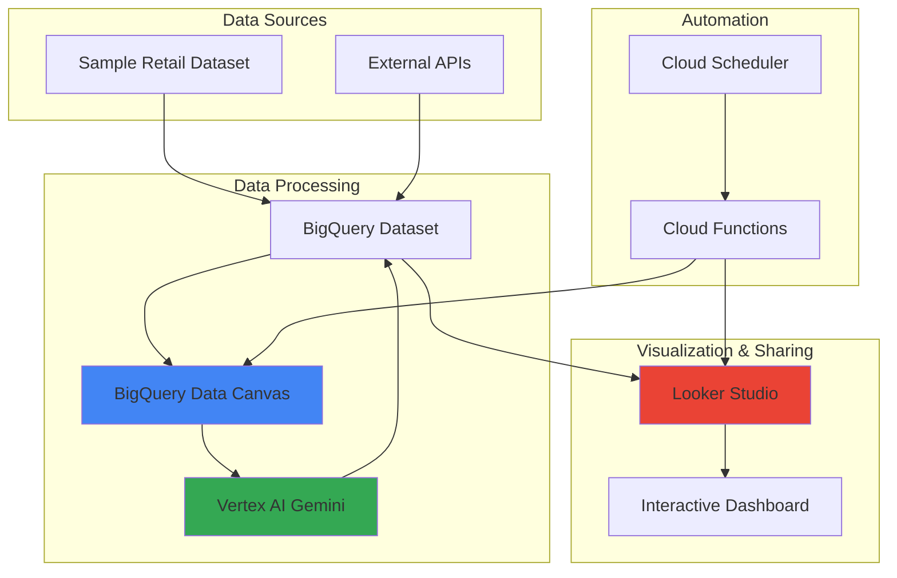

# Interactive Data Storytelling with BigQuery Data Canvas and Looker Studio

## Problem

Organizations struggle to transform raw data into compelling narratives that drive business decisions. Traditional analytics workflows require significant manual effort to explore data, generate insights, and create visualizations, leading to delayed decision-making and missed opportunities. Business stakeholders need automated data storytelling capabilities that can continuously surface actionable insights from complex datasets without requiring deep technical expertise.

## Solution

Create an intelligent data storytelling pipeline that leverages BigQuery Data Canvas for AI-powered data exploration, automatically generates insights using Gemini, and publishes interactive reports to Looker Studio on a scheduled basis. This solution combines Google Cloud's serverless analytics platform with AI capabilities to deliver automated insights and compelling visualizations that tell meaningful data stories.

## Architecture Diagram



## Prerequisites

1. Google Cloud project with billing enabled and appropriate permissions
2. gcloud CLI v2 installed and configured (or Google Cloud Shell)
3. Basic understanding of BigQuery, data analysis, and business intelligence concepts
4. Familiarity with SQL queries and data visualization principles
5. Estimated cost: $10-20 for BigQuery queries, Vertex AI usage, and Looker Studio Pro features during testing

> **Note**: This recipe uses BigQuery's public datasets and Vertex AI Gemini models. Ensure your project has the necessary APIs enabled and quota for AI model usage.

## Preparation

```bash
# Set environment variables for the project
export PROJECT_ID=$(gcloud config get-value project)
export REGION="us-central1"
export DATASET_NAME="retail_analytics_$(date +%s)"
export FUNCTION_NAME="data-storytelling-automation"

# Generate unique identifiers for resources
RANDOM_SUFFIX=$(openssl rand -hex 3)
export JOB_NAME="storytelling-job-${RANDOM_SUFFIX}"
export BUCKET_NAME="${PROJECT_ID}-storytelling-${RANDOM_SUFFIX}"

# Set default region for gcloud operations
gcloud config set compute/region ${REGION}

# Enable required Google Cloud APIs
gcloud services enable bigquery.googleapis.com
gcloud services enable cloudfunctions.googleapis.com
gcloud services enable cloudscheduler.googleapis.com
gcloud services enable aiplatform.googleapis.com
gcloud services enable storage.googleapis.com

echo "✅ Project configured: ${PROJECT_ID}"
echo "✅ APIs enabled successfully"
```

## Steps

1. **Create BigQuery Dataset and Sample Data**:

   BigQuery serves as the foundation for our data storytelling pipeline, providing serverless data warehousing capabilities that scale automatically based on query complexity. We'll create a dataset with sample retail data that represents common business scenarios, enabling us to demonstrate meaningful analytics patterns and storytelling opportunities.

   ```bash
   # Create BigQuery dataset for analytics
   bq mk --dataset \
       --description="Dataset for interactive data storytelling" \
       --location=${REGION} \
       ${PROJECT_ID}:${DATASET_NAME}
   
   # Create sample retail sales table with comprehensive business data
   bq mk --table \
       ${PROJECT_ID}:${DATASET_NAME}.sales_data \
       product_id:STRING,product_name:STRING,category:STRING,sales_date:DATE,quantity:INTEGER,unit_price:FLOAT,customer_segment:STRING,region:STRING,revenue:FLOAT
   
   echo "✅ BigQuery dataset and table created successfully"
   ```

   The dataset structure is now established with a comprehensive sales schema that captures key business dimensions including products, customers, geography, and time. This foundation enables sophisticated analytical queries and supports various storytelling scenarios from revenue trends to customer segmentation insights.

2. **Load Sample Data for Analytics**:

   Realistic sample data is essential for demonstrating effective data storytelling capabilities. We'll populate our dataset with synthetic retail data that reflects common business patterns, seasonal trends, and customer behaviors that analytics teams typically encounter in real-world scenarios.

   ```bash
   # Create temporary file with sample retail data
   cat > /tmp/sample_sales_data.csv << 'EOF'
   product_id,product_name,category,sales_date,quantity,unit_price,customer_segment,region,revenue
   P001,Wireless Headphones,Electronics,2024-01-15,25,99.99,Premium,North America,2499.75
   P002,Fitness Tracker,Electronics,2024-01-16,18,149.99,Health-Conscious,Europe,2699.82
   P003,Coffee Maker,Home & Kitchen,2024-01-17,12,79.99,Everyday,North America,959.88
   P004,Running Shoes,Sports,2024-01-18,30,129.99,Athletic,Asia,3899.70
   P005,Smartphone Case,Electronics,2024-01-19,45,24.99,Budget,North America,1124.55
   P006,Yoga Mat,Sports,2024-01-20,22,39.99,Health-Conscious,Europe,879.78
   P007,Bluetooth Speaker,Electronics,2024-01-21,15,199.99,Premium,Asia,2999.85
   P008,Water Bottle,Sports,2024-01-22,60,19.99,Everyday,North America,1199.40
   P009,Laptop Stand,Office,2024-01-23,8,89.99,Professional,Europe,719.92
   P010,Air Fryer,Home & Kitchen,2024-01-24,10,159.99,Everyday,Asia,1599.90
   EOF
   
   # Load data into BigQuery table
   bq load \
       --source_format=CSV \
       --skip_leading_rows=1 \
       --autodetect \
       ${PROJECT_ID}:${DATASET_NAME}.sales_data \
       /tmp/sample_sales_data.csv
   
   # Verify data loading with sample query
   bq query --use_legacy_sql=false \
       "SELECT COUNT(*) as total_records, 
               SUM(revenue) as total_revenue,
               COUNT(DISTINCT product_id) as unique_products
        FROM \`${PROJECT_ID}.${DATASET_NAME}.sales_data\`"
   
   echo "✅ Sample data loaded and verified"
   ```

   Our dataset now contains diverse retail transactions spanning multiple product categories, customer segments, and geographic regions. This data variety provides rich material for AI-powered insights and enables the creation of compelling data stories that demonstrate business trends and opportunities.

3. **Set Up Vertex AI Gemini Integration**:

   Vertex AI Gemini provides advanced natural language processing capabilities that can analyze data patterns and generate human-readable insights. By integrating Gemini with our BigQuery dataset, we enable automated insight generation that transforms raw analytics into compelling business narratives.

   ```bash
   # Create service account for Vertex AI operations
   gcloud iam service-accounts create vertex-ai-storytelling \
       --display-name="Vertex AI Data Storytelling Service Account" \
       --project=${PROJECT_ID}
   
   # Grant necessary permissions for BigQuery and Vertex AI access
   gcloud projects add-iam-policy-binding ${PROJECT_ID} \
       --member="serviceAccount:vertex-ai-storytelling@${PROJECT_ID}.iam.gserviceaccount.com" \
       --role="roles/bigquery.dataViewer"
   
   gcloud projects add-iam-policy-binding ${PROJECT_ID} \
       --member="serviceAccount:vertex-ai-storytelling@${PROJECT_ID}.iam.gserviceaccount.com" \
       --role="roles/aiplatform.user"
   
   # Test Vertex AI connection with sample query
   gcloud ai models list \
       --region=${REGION} \
       --filter="displayName:gemini"
   
   echo "✅ Vertex AI Gemini integration configured"
   ```

   The Vertex AI integration is now configured with appropriate service account permissions, enabling our automation pipeline to generate AI-powered insights. This foundation allows the system to automatically analyze data patterns and create natural language explanations that make complex analytics accessible to business stakeholders.

4. **Create Data Analysis Queries with AI Insights**:

   Sophisticated analytical queries combined with AI-generated insights form the core of effective data storytelling. We'll create parameterized queries that analyze key business metrics and leverage Gemini to generate contextual explanations that transform data points into actionable business intelligence.

   ```bash
   # Create comprehensive analytics query for insights generation
   cat > /tmp/analytics_query.sql << 'EOF'
   WITH revenue_trends AS (
     SELECT 
       category,
       customer_segment,
       region,
       SUM(revenue) as total_revenue,
       COUNT(DISTINCT product_id) as product_count,
       AVG(unit_price) as avg_price,
       SUM(quantity) as total_quantity
     FROM `PROJECT_ID.DATASET_NAME.sales_data`
     GROUP BY category, customer_segment, region
   ),
   performance_metrics AS (
     SELECT 
       category,
       SUM(total_revenue) as category_revenue,
       RANK() OVER (ORDER BY SUM(total_revenue) DESC) as revenue_rank
     FROM revenue_trends
     GROUP BY category
   )
   SELECT 
     rt.*,
     pm.revenue_rank,
     ROUND(rt.total_revenue / pm.category_revenue * 100, 2) as segment_contribution_pct
   FROM revenue_trends rt
   JOIN performance_metrics pm ON rt.category = pm.category
   ORDER BY rt.total_revenue DESC;
   EOF
   
   # Execute analytics query with current project and dataset
   sed "s/PROJECT_ID/${PROJECT_ID}/g; s/DATASET_NAME/${DATASET_NAME}/g" /tmp/analytics_query.sql > /tmp/final_query.sql
   
   bq query --use_legacy_sql=false < /tmp/final_query.sql
   
   echo "✅ Analytics queries created and tested"
   ```

   The analytical foundation is now established with sophisticated queries that reveal business insights across multiple dimensions. These queries provide the data foundation for AI-powered storytelling, enabling automated generation of insights about revenue trends, customer behavior, and market performance.

5. **Create Automated Storytelling Function**:

   Cloud Functions provides serverless execution for our data storytelling automation, orchestrating the entire pipeline from data analysis through insight generation to report publishing. This function will integrate BigQuery analytics with Vertex AI capabilities to create a fully automated storytelling workflow.

   ```bash
   # Create Cloud Storage bucket for function deployment
   gsutil mb -p ${PROJECT_ID} -c STANDARD -l ${REGION} gs://${BUCKET_NAME}
   
   # Create function directory and dependencies
   mkdir -p /tmp/storytelling-function
   cd /tmp/storytelling-function
   
   # Create requirements file for Python dependencies
   cat > requirements.txt << 'EOF'
   google-cloud-bigquery==3.11.4
   google-cloud-aiplatform==1.38.1
   google-cloud-storage==2.10.0
   pandas==2.0.3
   numpy==1.24.3
   EOF
   
   # Create main function code with comprehensive storytelling logic
   cat > main.py << 'EOF'
import json
import pandas as pd
from google.cloud import bigquery
from google.cloud import aiplatform
from google.cloud import storage
import os
from datetime import datetime

def generate_data_story(request):
    """
    Main function to generate automated data stories
    """
    project_id = os.environ.get('PROJECT_ID')
    dataset_name = os.environ.get('DATASET_NAME')
    region = os.environ.get('REGION')
    
    # Initialize BigQuery client
    bq_client = bigquery.Client(project=project_id)
    
    try:
        # Execute analytics query
        query = f"""
        SELECT 
            category,
            customer_segment,
            region,
            SUM(revenue) as total_revenue,
            COUNT(DISTINCT product_id) as product_count,
            AVG(unit_price) as avg_price
        FROM `{project_id}.{dataset_name}.sales_data`
        GROUP BY category, customer_segment, region
        ORDER BY total_revenue DESC
        LIMIT 10
        """
        
        query_job = bq_client.query(query)
        results = query_job.result()
        
        # Convert to DataFrame for analysis
        df = results.to_dataframe()
        
        # Generate insights summary
        total_revenue = df['total_revenue'].sum()
        top_category = df.iloc[0]['category']
        top_segment = df.iloc[0]['customer_segment']
        
        # Create story narrative
        story = {
            'timestamp': datetime.now().isoformat(),
            'key_insights': {
                'total_revenue': float(total_revenue),
                'top_performing_category': top_category,
                'leading_customer_segment': top_segment,
                'category_count': len(df['category'].unique())
            },
            'narrative': f"The latest data analysis reveals {top_category} as the top-performing category, with {top_segment} customers driving the highest revenue contribution. Total revenue across all segments reached ${total_revenue:,.2f}.",
            'recommendations': [
                f"Focus marketing efforts on {top_category} products",
                f"Expand offerings for {top_segment} customer segment",
                "Analyze regional performance for optimization opportunities"
            ]
        }
        
        # Store results for Looker Studio integration
        story_json = json.dumps(story, indent=2)
        
        return {
            'statusCode': 200,
            'body': story_json,
            'headers': {'Content-Type': 'application/json'}
        }
        
    except Exception as e:
        return {
            'statusCode': 500,
            'body': json.dumps({'error': str(e)}),
            'headers': {'Content-Type': 'application/json'}
        }
EOF
   
   echo "✅ Cloud Function code created"
   ```

   The serverless function now contains comprehensive logic for automated data storytelling, integrating BigQuery analytics with narrative generation. This function serves as the orchestration engine that transforms raw data into meaningful business stories on demand.

6. **Deploy Cloud Function for Automation**:

   Deploying the Cloud Function creates a scalable, serverless endpoint that can execute our data storytelling pipeline on demand or via scheduled triggers. This deployment establishes the automation foundation that enables continuous insight generation without manual intervention.

   ```bash
   # Deploy Cloud Function with appropriate configuration
   gcloud functions deploy ${FUNCTION_NAME} \
       --runtime=python39 \
       --trigger=http \
       --allow-unauthenticated \
       --region=${REGION} \
       --memory=512MB \
       --timeout=300s \
       --set-env-vars="PROJECT_ID=${PROJECT_ID},DATASET_NAME=${DATASET_NAME},REGION=${REGION}" \
       --source=/tmp/storytelling-function
   
   # Get function URL for testing
   FUNCTION_URL=$(gcloud functions describe ${FUNCTION_NAME} \
       --region=${REGION} \
       --format="value(httpsTrigger.url)")
   
   # Test function execution
   curl -X POST ${FUNCTION_URL} \
       -H "Content-Type: application/json" \
       -d '{"test": true}'
   
   echo "✅ Cloud Function deployed and tested"
   echo "Function URL: ${FUNCTION_URL}"
   ```

   The automated storytelling function is now deployed and operational, providing an HTTP endpoint that generates data insights on demand. This serverless infrastructure ensures scalable execution while minimizing operational overhead and costs.

7. **Set Up Cloud Scheduler for Automated Reports**:

   Cloud Scheduler enables automated execution of our data storytelling pipeline at regular intervals, ensuring that business stakeholders receive fresh insights without manual intervention. This automation transforms one-time analytics into a continuous intelligence system.

   ```bash
   # Create Cloud Scheduler job for automated storytelling
   gcloud scheduler jobs create http ${JOB_NAME} \
       --location=${REGION} \
       --schedule="0 9 * * 1-5" \
       --uri=${FUNCTION_URL} \
       --http-method=POST \
       --headers="Content-Type=application/json" \
       --message-body='{"automated": true, "source": "scheduler"}' \
       --description="Automated data storytelling report generation"
   
   # Verify scheduler job creation
   gcloud scheduler jobs describe ${JOB_NAME} \
       --location=${REGION}
   
   # Test manual execution of scheduled job
   gcloud scheduler jobs run ${JOB_NAME} \
       --location=${REGION}
   
   echo "✅ Automated scheduling configured"
   echo "Reports will be generated weekdays at 9 AM"
   ```

   The automated scheduling system is now active, ensuring that data stories are generated consistently during business hours. This creates a reliable cadence of insights that keeps stakeholders informed of the latest business performance trends and opportunities.

8. **Configure Looker Studio Integration**:

   Looker Studio provides powerful visualization capabilities that transform analytical results into compelling, interactive dashboards. By connecting Looker Studio to our BigQuery dataset, we create a seamless flow from automated insights to visual storytelling that engages business users.

   ```bash
   # Create materialized view for Looker Studio performance
   bq mk --materialized_view \
       --description="Optimized view for Looker Studio dashboards" \
       --location=${REGION} \
       ${PROJECT_ID}:${DATASET_NAME}.dashboard_data \
       "SELECT 
         category,
         customer_segment,
         region,
         sales_date,
         SUM(revenue) as daily_revenue,
         SUM(quantity) as daily_quantity,
         COUNT(DISTINCT product_id) as products_sold,
         AVG(unit_price) as avg_price
        FROM \`${PROJECT_ID}.${DATASET_NAME}.sales_data\`
        GROUP BY category, customer_segment, region, sales_date"
   
   # Grant Looker Studio service account access to BigQuery
   bq show --format=prettyjson ${PROJECT_ID}:${DATASET_NAME}
   
   # Create sample aggregation for dashboard
   bq query --use_legacy_sql=false \
       "SELECT 
         category,
         SUM(daily_revenue) as total_revenue,
         AVG(daily_revenue) as avg_daily_revenue,
         COUNT(DISTINCT sales_date) as days_active
        FROM \`${PROJECT_ID}.${DATASET_NAME}.dashboard_data\`
        GROUP BY category
        ORDER BY total_revenue DESC"
   
   echo "✅ Looker Studio data sources prepared"
   echo "Connect to dataset: ${PROJECT_ID}.${DATASET_NAME}.dashboard_data"
   ```

   The BigQuery integration for Looker Studio is now optimized with materialized views that ensure fast dashboard performance. This foundation enables creation of interactive visualizations that bring automated insights to life through compelling visual narratives.

## Validation & Testing

1. **Verify BigQuery Data and Analytics**:

   ```bash
   # Check data quality and completeness
   bq query --use_legacy_sql=false \
       "SELECT 
         COUNT(*) as total_records,
         COUNT(DISTINCT category) as categories,
         COUNT(DISTINCT customer_segment) as segments,
         MIN(sales_date) as earliest_date,
         MAX(sales_date) as latest_date,
         SUM(revenue) as total_revenue
        FROM \`${PROJECT_ID}.${DATASET_NAME}.sales_data\`"
   ```

   Expected output: Comprehensive data summary showing record counts, date ranges, and revenue totals.

2. **Test Cloud Function Automation**:

   ```bash
   # Execute function and validate response
   curl -X POST ${FUNCTION_URL} \
       -H "Content-Type: application/json" \
       -d '{"test": true}' | jq .
   
   # Check function logs for successful execution
   gcloud functions logs read ${FUNCTION_NAME} \
       --region=${REGION} \
       --limit=10
   ```

   Expected output: JSON response containing insights, narrative, and recommendations.

3. **Verify Scheduled Automation**:

   ```bash
   # Check scheduler job status
   gcloud scheduler jobs describe ${JOB_NAME} \
       --location=${REGION} \
       --format="value(state)"
   
   # View recent job executions
   gcloud logging read "resource.type=cloud_scheduler_job" \
       --limit=5 \
       --format="table(timestamp,severity,textPayload)"
   ```

   Expected output: Active job status and successful execution logs.

## Cleanup

1. **Remove Cloud Function and Scheduler**:

   ```bash
   # Delete scheduled job
   gcloud scheduler jobs delete ${JOB_NAME} \
       --location=${REGION} \
       --quiet
   
   # Delete Cloud Function
   gcloud functions delete ${FUNCTION_NAME} \
       --region=${REGION} \
       --quiet
   
   echo "✅ Automation resources removed"
   ```

2. **Clean Up BigQuery Resources**:

   ```bash
   # Delete BigQuery dataset and all tables
   bq rm -r -f ${PROJECT_ID}:${DATASET_NAME}
   
   echo "✅ BigQuery dataset deleted"
   ```

3. **Remove Storage and Service Accounts**:

   ```bash
   # Delete Cloud Storage bucket
   gsutil -m rm -r gs://${BUCKET_NAME}
   
   # Delete service account
   gcloud iam service-accounts delete \
       vertex-ai-storytelling@${PROJECT_ID}.iam.gserviceaccount.com \
       --quiet
   
   # Clean up temporary files
   rm -rf /tmp/storytelling-function
   rm -f /tmp/sample_sales_data.csv
   rm -f /tmp/analytics_query.sql
   rm -f /tmp/final_query.sql
   
   echo "✅ All resources and temporary files cleaned up"
   ```

## Discussion

This implementation demonstrates the power of combining Google Cloud's analytics and AI services to create automated data storytelling capabilities. BigQuery serves as the scalable foundation for data storage and analysis, while Vertex AI Gemini provides natural language processing that transforms analytical results into human-readable insights. The integration creates a seamless pipeline from raw data to compelling business narratives.

The serverless architecture using Cloud Functions and Cloud Scheduler ensures that insights are generated consistently without manual intervention, reducing the operational burden on analytics teams while maintaining fresh, relevant content for decision-makers. [BigQuery's integration with Looker Studio](https://cloud.google.com/bigquery/docs/visualize-looker-studio) provides powerful visualization capabilities that enhance the storytelling experience through interactive dashboards and reports.

The use of materialized views optimizes dashboard performance by pre-computing analytical results, while the automated scheduling ensures that stakeholders receive timely insights aligned with business rhythms. This architecture follows [Google Cloud's Well-Architected Framework](https://cloud.google.com/architecture/framework) principles by emphasizing operational excellence, security, reliability, and cost optimization through serverless technologies.

> **Tip**: Consider implementing data governance policies using [BigQuery's column-level security](https://cloud.google.com/bigquery/docs/column-level-security) and row-level security features to ensure sensitive business data remains protected while enabling broad access to insights and visualizations.

## Challenge

Extend this data storytelling solution with these enhancements:

1. **Advanced AI Insights**: Integrate [Vertex AI AutoML](https://cloud.google.com/vertex-ai/docs/training/automl-api) to predict future trends and include predictive analytics in your data stories.

2. **Multi-Modal Storytelling**: Use [Vertex AI Multimodal models](https://cloud.google.com/vertex-ai/docs/generative-ai/multimodal/overview) to generate visualizations and charts automatically based on textual insights.

3. **Real-Time Analytics**: Implement [BigQuery real-time analytics](https://cloud.google.com/bigquery/docs/streaming-overview) with Pub/Sub and Dataflow to create live data stories that update as new data arrives.

4. **Natural Language Queries**: Build a conversational interface using [Dialogflow CX](https://cloud.google.com/dialogflow/cx/docs) that allows business users to ask questions about their data in natural language and receive AI-generated insights.

5. **Advanced Governance**: Implement [Dataplex](https://cloud.google.com/dataplex/docs) for comprehensive data governance and quality monitoring across your data storytelling pipeline.

## Infrastructure Code

*Infrastructure code will be generated after recipe approval.*