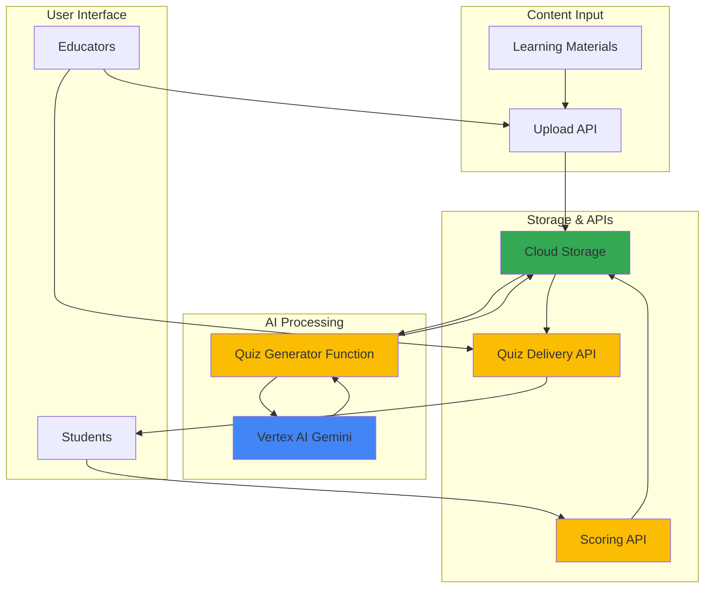

# Interactive Quiz Generation with Vertex AI and Functions

## Problem

Educational institutions and training organizations struggle to create engaging, interactive quizzes from their learning materials at scale. Manual quiz creation is time-consuming, lacks consistency in difficulty levels, and fails to adapt to diverse content types including text documents, videos, and presentations. Existing solutions often produce generic questions that don't capture the nuanced understanding required for effective learning assessment.

## Solution

Build an automated quiz generation system using Vertex AI's Gemini models to analyze educational content and generate contextually relevant questions with multiple formats (multiple choice, true/false, short answer). Cloud Functions provide serverless API endpoints for content processing, quiz delivery, and automated scoring, while Cloud Storage manages learning materials and generated quizzes with secure access controls.

## Architecture Diagram



## Prerequisites

1. Google Cloud account with billing enabled and Vertex AI API access
2. gcloud CLI installed and configured with appropriate permissions
3. Basic understanding of serverless functions and REST APIs
4. Python 3.12+ development environment for local testing
5. Estimated cost: $10-20 for tutorial completion (Vertex AI token usage ~$2-5, Cloud Functions invocations ~$1-3, Cloud Storage ~$0.50)

> **Note**: Vertex AI charges based on model usage tokens (approximately $0.075 per 1K input tokens and $0.30 per 1K output tokens for Gemini 1.5 Flash), while Cloud Functions charges per invocation and execution time.

## Preparation

```bash
# Set environment variables for GCP resources
export PROJECT_ID="quiz-generation-$(date +%s)"
export REGION="us-central1"
export ZONE="us-central1-a"

# Generate unique suffix for resource names
RANDOM_SUFFIX=$(openssl rand -hex 3)
export BUCKET_NAME="quiz-materials-${RANDOM_SUFFIX}"
export FUNCTION_NAME="quiz-generator-${RANDOM_SUFFIX}"

# Create new project for this tutorial
gcloud projects create ${PROJECT_ID} \
    --name="Quiz Generation Demo"

# Set default project and region
gcloud config set project ${PROJECT_ID}
gcloud config set compute/region ${REGION}
gcloud config set compute/zone ${ZONE}

# Enable required APIs
gcloud services enable aiplatform.googleapis.com
gcloud services enable cloudfunctions.googleapis.com
gcloud services enable storage.googleapis.com
gcloud services enable cloudbuild.googleapis.com
gcloud services enable artifactregistry.googleapis.com

echo "✅ Project configured: ${PROJECT_ID}"
echo "✅ Required APIs enabled for quiz generation system"
```

## Steps

1. **Create Cloud Storage Bucket for Learning Materials**:

   Cloud Storage provides the foundation for our quiz generation system, offering scalable object storage with global accessibility and strong consistency. We'll configure the bucket with appropriate lifecycle policies and access controls to manage learning materials efficiently while maintaining security for educational content.

   ```bash
   # Create storage bucket for learning materials
   gsutil mb -p ${PROJECT_ID} \
       -c STANDARD \
       -l ${REGION} \
       gs://${BUCKET_NAME}
   
   # Enable versioning for content tracking
   gsutil versioning set on gs://${BUCKET_NAME}
   
   # Set up bucket structure for organized content management
   echo "Creating bucket structure for organized data management..."
   gsutil -m cp /dev/null gs://${BUCKET_NAME}/uploads/.keep
   gsutil -m cp /dev/null gs://${BUCKET_NAME}/quizzes/.keep
   gsutil -m cp /dev/null gs://${BUCKET_NAME}/results/.keep
   
   # Set bucket lifecycle for cost optimization
   cat > lifecycle.json << 'EOF'
{
  "lifecycle": {
    "rule": [
      {
        "action": {"type": "SetStorageClass", "storageClass": "NEARLINE"},
        "condition": {"age": 30}
      },
      {
        "action": {"type": "SetStorageClass", "storageClass": "COLDLINE"}, 
        "condition": {"age": 90}
      }
    ]
  }
}
EOF
   
   gsutil lifecycle set lifecycle.json gs://${BUCKET_NAME}
   rm lifecycle.json
   
   echo "✅ Cloud Storage bucket created with organized structure"
   ```

   The storage bucket now provides a secure, scalable repository for learning materials with version control and automated lifecycle management for cost optimization. This foundation supports the entire quiz generation pipeline from content ingestion through result storage, with automatic data archiving to reduce storage costs over time.

> **Note**: The lifecycle policy automatically transitions data to more cost-effective storage classes (Nearline after 30 days, Coldline after 90 days) to optimize costs for educational institutions managing large volumes of content.

2. **Set Up Vertex AI Model Access and Configuration**:

   Vertex AI provides access to Google's advanced Gemini models with multimodal capabilities, enabling our system to process various content types including text, images, and structured documents. Proper configuration ensures optimal performance and cost management for educational content processing.

   ```bash
   # Create service account for Vertex AI access
   gcloud iam service-accounts create quiz-ai-service \
       --display-name="Quiz Generation AI Service" \
       --description="Service account for Vertex AI quiz generation"
   
   # Grant necessary permissions for AI model access
   gcloud projects add-iam-policy-binding ${PROJECT_ID} \
       --member="serviceAccount:quiz-ai-service@${PROJECT_ID}.iam.gserviceaccount.com" \
       --role="roles/aiplatform.user"
   
   # Grant storage permissions for content access (using objectAdmin for least privilege)
   gcloud projects add-iam-policy-binding ${PROJECT_ID} \
       --member="serviceAccount:quiz-ai-service@${PROJECT_ID}.iam.gserviceaccount.com" \
       --role="roles/storage.objectAdmin"
   
   # Test Vertex AI access (list available models)
   gcloud ai models list --region=${REGION} --limit=1 2>/dev/null || \
       echo "Note: No custom models found, will use Gemini foundation models"
   
   echo "✅ Vertex AI configured with proper service account permissions"
   ```

   The Vertex AI configuration now enables secure access to Gemini models with appropriate permissions for processing educational content while maintaining data security and access controls.

3. **Create Quiz Generation Cloud Function**:

   Cloud Functions provides serverless compute that automatically scales based on demand, perfect for processing educational content and generating quizzes. The function will integrate with Vertex AI to analyze content and create contextually appropriate questions using advanced natural language processing.

   ```bash
   # Create function directory and dependencies
   mkdir -p quiz-functions/quiz-generator
   cd quiz-functions/quiz-generator
   
   # Create requirements.txt for Python dependencies
   cat > requirements.txt << 'EOF'
google-cloud-aiplatform==1.75.0
google-cloud-storage==2.18.0
functions-framework==3.8.1
Flask==3.0.3
PyPDF2==3.0.1
python-docx==1.1.2
EOF
   
   # Create main function code
   cat > main.py << 'EOF'
import json
import os
from typing import Dict, List, Any
from google.cloud import aiplatform
from google.cloud import storage
import vertexai
from vertexai.generative_models import GenerativeModel
import functions_framework
from flask import Request, jsonify

# Initialize Vertex AI
PROJECT_ID = os.environ.get('GCP_PROJECT', os.environ.get('GOOGLE_CLOUD_PROJECT'))
REGION = os.environ.get('REGION', 'us-central1')

vertexai.init(project=PROJECT_ID, location=REGION)
model = GenerativeModel("gemini-1.5-flash-002")

@functions_framework.http
def generate_quiz(request: Request) -> Any:
    """Generate quiz from uploaded content using Vertex AI."""
    
    if request.method == 'OPTIONS':
        return _handle_cors()
    
    try:
        # Parse request data
        request_json = request.get_json(silent=True)
        if not request_json:
            return jsonify({'error': 'No JSON data provided'}), 400
        
        content_text = request_json.get('content', '')
        question_count = request_json.get('question_count', 5)
        difficulty = request_json.get('difficulty', 'medium')
        
        if not content_text:
            return jsonify({'error': 'Content text is required'}), 400
        
        # Generate quiz using Vertex AI
        quiz = _generate_quiz_with_ai(content_text, question_count, difficulty)
        
        # Store quiz in Cloud Storage
        quiz_id = _store_quiz(quiz)
        
        response = jsonify({
            'quiz_id': quiz_id,
            'quiz': quiz,
            'status': 'success'
        })
        response.headers.add('Access-Control-Allow-Origin', '*')
        return response
        
    except Exception as e:
        error_response = jsonify({'error': str(e), 'status': 'error'})
        error_response.headers.add('Access-Control-Allow-Origin', '*')
        return error_response, 500

def _generate_quiz_with_ai(content: str, count: int, difficulty: str) -> Dict:
    """Use Vertex AI to generate quiz questions from content."""
    
    prompt = f"""
    Based on the following educational content, generate {count} quiz questions at {difficulty} difficulty level.
    
    Create a mix of question types:
    - Multiple choice (4 options each)
    - True/False
    - Short answer
    
    Content:
    {content[:4000]}  # Limit content to stay within token limits
    
    Return the response as valid JSON with this structure:
    {{
        "title": "Quiz Title",
        "questions": [
            {{
                "type": "multiple_choice",
                "question": "Question text",
                "options": ["A", "B", "C", "D"],
                "correct_answer": 0,
                "explanation": "Why this answer is correct"
            }},
            {{
                "type": "true_false",
                "question": "Question text",
                "correct_answer": true,
                "explanation": "Explanation"
            }},
            {{
                "type": "short_answer",
                "question": "Question text",
                "sample_answer": "Expected answer",
                "explanation": "Explanation"
            }}
        ]
    }}
    """
    
    response = model.generate_content(prompt)
    
    try:
        # Clean response text and parse as JSON
        response_text = response.text.strip()
        if response_text.startswith('```json'):
            response_text = response_text[7:-3].strip()
        elif response_text.startswith('```'):
            response_text = response_text[3:-3].strip()
        
        quiz_data = json.loads(response_text)
        
        # Validate quiz structure
        if 'questions' not in quiz_data or not quiz_data['questions']:
            raise ValueError("Invalid quiz structure")
            
        return quiz_data
        
    except (json.JSONDecodeError, ValueError) as e:
        print(f"Error parsing AI response: {e}. Using fallback quiz.")
        # Fallback if AI doesn't return valid JSON
        return {
            "title": "Generated Quiz",
            "questions": [{
                "type": "multiple_choice",
                "question": "What is the main topic of the provided content?",
                "options": ["Topic A", "Topic B", "Topic C", "Topic D"],
                "correct_answer": 0,
                "explanation": "Based on content analysis"
            }]
        }

def _store_quiz(quiz_data: Dict) -> str:
    """Store generated quiz in Cloud Storage."""
    
    storage_client = storage.Client()
    bucket_name = os.environ.get('BUCKET_NAME')
    bucket = storage_client.bucket(bucket_name)
    
    # Generate unique quiz ID
    quiz_id = f"quiz_{os.urandom(8).hex()}"
    blob_name = f"quizzes/{quiz_id}.json"
    
    blob = bucket.blob(blob_name)
    blob.upload_from_string(
        json.dumps(quiz_data, indent=2),
        content_type='application/json'
    )
    
    return quiz_id

def _handle_cors():
    """Handle CORS preflight requests."""
    response = jsonify({'status': 'ok'})
    response.headers.add('Access-Control-Allow-Origin', '*')
    response.headers.add('Access-Control-Allow-Methods', 'POST, OPTIONS')
    response.headers.add('Access-Control-Allow-Headers', 'Content-Type')
    return response
EOF
   
   echo "✅ Quiz generation function code created with AI integration"
   ```

   The Cloud Function now integrates Vertex AI's Gemini model with comprehensive quiz generation capabilities, supporting multiple question types and difficulty levels while maintaining proper error handling and CORS support for web applications.

4. **Deploy Quiz Generation Function**:

   Deploying the Cloud Function creates a serverless endpoint that automatically scales to handle quiz generation requests. The deployment includes environment configuration, service account binding, and proper resource allocation for optimal performance with educational content processing.

   ```bash
   # Deploy the quiz generation function
   gcloud functions deploy ${FUNCTION_NAME} \
       --runtime python312 \
       --trigger-http \
       --allow-unauthenticated \
       --source . \
       --entry-point generate_quiz \
       --memory 512MB \
       --timeout 300s \
       --set-env-vars BUCKET_NAME=${BUCKET_NAME},REGION=${REGION} \
       --service-account quiz-ai-service@${PROJECT_ID}.iam.gserviceaccount.com
   
   # Get function URL for testing
   FUNCTION_URL=$(gcloud functions describe ${FUNCTION_NAME} \
       --format="value(httpsTrigger.url)")
   
   echo "✅ Quiz generation function deployed successfully"
   echo "Function URL: ${FUNCTION_URL}"
   ```

   The Cloud Function is now live and accessible via HTTPS, providing a scalable API endpoint for quiz generation with proper authentication and environment configuration for seamless AI model integration.

5. **Create Quiz Delivery API Function**:

   A dedicated delivery function provides secure access to generated quizzes with proper access controls and response formatting. This separation of concerns enables efficient quiz distribution while maintaining performance optimization and proper caching strategies.

   ```bash
   # Create quiz delivery function
   mkdir -p ../quiz-delivery
   cd ../quiz-delivery
   
   # Create requirements.txt
   cat > requirements.txt << 'EOF'
google-cloud-storage==2.18.0
functions-framework==3.8.1
Flask==3.0.3
EOF
   
   # Create delivery function code
   cat > main.py << 'EOF'
import json
import os
from google.cloud import storage
import functions_framework
from flask import Request, jsonify

@functions_framework.http
def deliver_quiz(request: Request):
    """Deliver quiz to students with proper formatting."""
    
    if request.method == 'OPTIONS':
        return _handle_cors()
    
    try:
        # Get quiz ID from request
        quiz_id = request.args.get('quiz_id')
        if not quiz_id:
            return jsonify({'error': 'Quiz ID required'}), 400
        
        # Retrieve quiz from storage
        quiz_data = _get_quiz_from_storage(quiz_id)
        if not quiz_data:
            return jsonify({'error': 'Quiz not found'}), 404
        
        # Format quiz for delivery (remove answers for student view)
        student_quiz = _format_for_students(quiz_data)
        
        response = jsonify({
            'quiz_id': quiz_id,
            'quiz': student_quiz,
            'status': 'success'
        })
        response.headers.add('Access-Control-Allow-Origin', '*')
        return response
        
    except Exception as e:
        error_response = jsonify({'error': str(e)})
        error_response.headers.add('Access-Control-Allow-Origin', '*')
        return error_response, 500

def _get_quiz_from_storage(quiz_id: str):
    """Retrieve quiz from Cloud Storage."""
    
    storage_client = storage.Client()
    bucket_name = os.environ.get('BUCKET_NAME')
    bucket = storage_client.bucket(bucket_name)
    
    blob_name = f"quizzes/{quiz_id}.json"
    blob = bucket.blob(blob_name)
    
    if not blob.exists():
        return None
    
    quiz_content = blob.download_as_text()
    return json.loads(quiz_content)

def _format_for_students(quiz_data):
    """Remove correct answers for student delivery."""
    
    formatted_quiz = {
        'title': quiz_data.get('title', 'Quiz'),
        'questions': []
    }
    
    for i, question in enumerate(quiz_data.get('questions', [])):
        student_question = {
            'id': i,
            'type': question['type'],
            'question': question['question']
        }
        
        if question['type'] == 'multiple_choice':
            student_question['options'] = question['options']
        
        formatted_quiz['questions'].append(student_question)
    
    return formatted_quiz

def _handle_cors():
    """Handle CORS preflight requests."""
    response = jsonify({'status': 'ok'})
    response.headers.add('Access-Control-Allow-Origin', '*')
    response.headers.add('Access-Control-Allow-Methods', 'GET, OPTIONS')
    response.headers.add('Access-Control-Allow-Headers', 'Content-Type')
    return response
EOF
   
   echo "✅ Quiz delivery function code created"
   ```

   The delivery function ensures secure quiz access while properly formatting content for student interaction, removing answer keys and maintaining question integrity for valid assessment.

6. **Deploy Quiz Delivery Function**:

   ```bash
   # Deploy quiz delivery function
   DELIVERY_FUNCTION_NAME="quiz-delivery-${RANDOM_SUFFIX}"
   
   gcloud functions deploy ${DELIVERY_FUNCTION_NAME} \
       --runtime python312 \
       --trigger-http \
       --allow-unauthenticated \
       --source . \
       --entry-point deliver_quiz \
       --memory 256MB \
       --timeout 60s \
       --set-env-vars BUCKET_NAME=${BUCKET_NAME}
   
   # Get delivery function URL
   DELIVERY_URL=$(gcloud functions describe ${DELIVERY_FUNCTION_NAME} \
       --format="value(httpsTrigger.url)")
   
   echo "✅ Quiz delivery function deployed successfully"
   echo "Delivery URL: ${DELIVERY_URL}"
   ```

   The delivery function provides a secure, scalable endpoint for quiz access with optimized performance and proper content formatting for educational environments.

7. **Create Scoring API Function**:

   Automated scoring capabilities enable immediate feedback for students while providing analytics for educators. The scoring function handles multiple question types with configurable grading rules and detailed performance metrics.

   ```bash
   # Create scoring function
   mkdir -p ../quiz-scoring
   cd ../quiz-scoring
   
   # Create requirements.txt
   cat > requirements.txt << 'EOF'
google-cloud-storage==2.18.0
functions-framework==3.8.1
Flask==3.0.3
EOF
   
   # Create scoring function code
   cat > main.py << 'EOF'
import json
import os
from datetime import datetime
from google.cloud import storage
import functions_framework
from flask import Request, jsonify

@functions_framework.http
def score_quiz(request: Request):
    """Score submitted quiz and provide feedback."""
    
    if request.method == 'OPTIONS':
        return _handle_cors()
    
    try:
        # Parse submission data
        request_json = request.get_json(silent=True)
        if not request_json:
            return jsonify({'error': 'No submission data'}), 400
        
        quiz_id = request_json.get('quiz_id')
        student_answers = request_json.get('answers', {})
        student_id = request_json.get('student_id', 'anonymous')
        
        # Get original quiz with answers
        quiz_data = _get_quiz_from_storage(quiz_id)
        if not quiz_data:
            return jsonify({'error': 'Quiz not found'}), 404
        
        # Calculate score and feedback
        results = _calculate_score(quiz_data, student_answers)
        
        # Store results
        result_id = _store_results(quiz_id, student_id, student_answers, results)
        
        response = jsonify({
            'result_id': result_id,
            'score': results['score'],
            'total_questions': results['total_questions'],
            'percentage': results['percentage'],
            'feedback': results['feedback'],
            'status': 'success'
        })
        response.headers.add('Access-Control-Allow-Origin', '*')
        return response
        
    except Exception as e:
        error_response = jsonify({'error': str(e)})
        error_response.headers.add('Access-Control-Allow-Origin', '*')
        return error_response, 500

def _get_quiz_from_storage(quiz_id: str):
    """Retrieve quiz from Cloud Storage."""
    
    storage_client = storage.Client()
    bucket_name = os.environ.get('BUCKET_NAME')
    bucket = storage_client.bucket(bucket_name)
    
    blob_name = f"quizzes/{quiz_id}.json"
    blob = bucket.blob(blob_name)
    
    if not blob.exists():
        return None
    
    quiz_content = blob.download_as_text()
    return json.loads(quiz_content)

def _calculate_score(quiz_data, student_answers):
    """Calculate score and provide detailed feedback."""
    
    questions = quiz_data.get('questions', [])
    correct_count = 0
    total_questions = len(questions)
    feedback = []
    
    for i, question in enumerate(questions):
        question_id = str(i)
        student_answer = student_answers.get(question_id)
        
        is_correct = False
        explanation = question.get('explanation', 'No explanation available')
        
        if question['type'] == 'multiple_choice':
            correct_answer = question['correct_answer']
            is_correct = student_answer == correct_answer
            
        elif question['type'] == 'true_false':
            correct_answer = question['correct_answer']
            is_correct = student_answer == correct_answer
            
        elif question['type'] == 'short_answer':
            # Simple text matching for short answers
            correct_answer = question.get('sample_answer', '').lower()
            student_text = str(student_answer).lower() if student_answer else ''
            is_correct = correct_answer in student_text or student_text in correct_answer
        
        if is_correct:
            correct_count += 1
        
        feedback.append({
            'question_id': i,
            'question': question['question'],
            'correct': is_correct,
            'explanation': explanation
        })
    
    percentage = (correct_count / total_questions * 100) if total_questions > 0 else 0
    
    return {
        'score': correct_count,
        'total_questions': total_questions,
        'percentage': round(percentage, 2),
        'feedback': feedback
    }

def _store_results(quiz_id, student_id, answers, results):
    """Store quiz results in Cloud Storage."""
    
    storage_client = storage.Client()
    bucket_name = os.environ.get('BUCKET_NAME')
    bucket = storage_client.bucket(bucket_name)
    
    result_id = f"result_{os.urandom(8).hex()}"
    blob_name = f"results/{result_id}.json"
    
    result_data = {
        'result_id': result_id,
        'quiz_id': quiz_id,
        'student_id': student_id,
        'timestamp': datetime.utcnow().isoformat(),
        'answers': answers,
        'results': results
    }
    
    blob = bucket.blob(blob_name)
    blob.upload_from_string(
        json.dumps(result_data, indent=2),
        content_type='application/json'
    )
    
    return result_id

def _handle_cors():
    """Handle CORS preflight requests."""
    response = jsonify({'status': 'ok'})
    response.headers.add('Access-Control-Allow-Origin', '*')
    response.headers.add('Access-Control-Allow-Methods', 'POST, OPTIONS')
    response.headers.add('Access-Control-Allow-Headers', 'Content-Type')
    return response
EOF
   
   echo "✅ Quiz scoring function code created with comprehensive feedback"
   ```

   The scoring function provides intelligent assessment capabilities with detailed feedback and analytics, supporting various question types while maintaining educational value through comprehensive explanations.

8. **Deploy Scoring Function and Test Complete System**:

   ```bash
   # Deploy scoring function
   SCORING_FUNCTION_NAME="quiz-scoring-${RANDOM_SUFFIX}"
   
   gcloud functions deploy ${SCORING_FUNCTION_NAME} \
       --runtime python312 \
       --trigger-http \
       --allow-unauthenticated \
       --source . \
       --entry-point score_quiz \
       --memory 256MB \
       --timeout 60s \
       --set-env-vars BUCKET_NAME=${BUCKET_NAME}
   
   # Get scoring function URL
   SCORING_URL=$(gcloud functions describe ${SCORING_FUNCTION_NAME} \
       --format="value(httpsTrigger.url)")
   
   echo "✅ Complete quiz generation system deployed"
   echo "Generation URL: ${FUNCTION_URL}"
   echo "Delivery URL: ${DELIVERY_URL}"
   echo "Scoring URL: ${SCORING_URL}"
   
   # Create sample content for testing
   cd ../../
   cat > sample_content.json << 'EOF'
{
  "content": "Cloud computing is a technology that enables on-demand access to computing resources over the internet. Key benefits include scalability, cost-effectiveness, and flexibility. Major cloud service models include Infrastructure as a Service (IaaS), Platform as a Service (PaaS), and Software as a Service (SaaS). Cloud deployment models include public, private, hybrid, and multi-cloud approaches.",
  "question_count": 3,
  "difficulty": "medium"
}
EOF
   
   echo "✅ Sample content created for system testing"
   ```

   The complete quiz generation system is now operational with three integrated functions providing content processing, quiz delivery, and automated scoring capabilities, ready for educational deployment.

## Validation & Testing

1. **Test Quiz Generation**:

   ```bash
   # Test the quiz generation function
   echo "Testing quiz generation with sample content..."
   curl -X POST ${FUNCTION_URL} \
       -H "Content-Type: application/json" \
       -d @sample_content.json \
       -o quiz_response.json \
       --fail --silent --show-error
   
   # Check if request was successful
   if [ $? -eq 0 ]; then
       echo "✅ Quiz generation request successful"
       # Display generated quiz structure
       cat quiz_response.json | jq '.quiz.title, .quiz.questions | length'
       
       # Extract quiz ID for testing
       QUIZ_ID=$(cat quiz_response.json | jq -r '.quiz_id')
       echo "Generated Quiz ID: ${QUIZ_ID}"
   else
       echo "❌ Quiz generation failed"
       cat quiz_response.json 2>/dev/null || echo "No response received"
       exit 1
   fi
   ```

   Expected output: JSON response with generated quiz containing multiple question types, quiz title, and proper structure.

2. **Test Quiz Delivery**:

   ```bash
   # Test quiz delivery function
   echo "Testing quiz delivery for student view..."
   curl "${DELIVERY_URL}?quiz_id=${QUIZ_ID}" \
       -o delivered_quiz.json \
       --fail --silent --show-error
   
   if [ $? -eq 0 ]; then
       echo "✅ Quiz delivery successful"
       # Verify quiz delivery format (should not contain answers)
       echo "Quiz title and question count:"
       cat delivered_quiz.json | jq '.quiz.title, .quiz.questions | length'
       
       # Verify answers are removed
       echo "Checking if answers are properly hidden..."
       if cat delivered_quiz.json | jq -e '.quiz.questions[0].correct_answer' >/dev/null 2>&1; then
           echo "⚠️  Warning: Answers not properly hidden"
       else
           echo "✅ Answers properly hidden from student view"
       fi
   else
       echo "❌ Quiz delivery failed"
       cat delivered_quiz.json 2>/dev/null || echo "No response received"
   fi
   ```

   Expected output: Student-formatted quiz without answer keys, ready for assessment.

3. **Test Quiz Scoring**:

   ```bash
   # Create sample student submission
   echo "Creating sample student submission..."
   cat > student_submission.json << EOF
{
  "quiz_id": "${QUIZ_ID}",
  "student_id": "test_student_001",
  "answers": {
    "0": 1,
    "1": true,
    "2": "cloud services"
  }
}
EOF
   
   # Test scoring function
   echo "Testing quiz scoring..."
   curl -X POST ${SCORING_URL} \
       -H "Content-Type: application/json" \
       -d @student_submission.json \
       -o scoring_results.json \
       --fail --silent --show-error
   
   if [ $? -eq 0 ]; then
       echo "✅ Quiz scoring successful"
       # Display scoring summary
       echo "Scoring results:"
       cat scoring_results.json | jq '{score, total_questions, percentage}'
       
       # Check if feedback is provided
       feedback_count=$(cat scoring_results.json | jq '.feedback | length')
       echo "Feedback provided for ${feedback_count} questions"
   else
       echo "❌ Quiz scoring failed"
       cat scoring_results.json 2>/dev/null || echo "No response received"
   fi
   ```

   Expected output: Detailed scoring results with percentage, feedback, and explanations.

4. **Verify Cloud Storage Integration**:

   ```bash
   # Check stored quizzes and results
   gsutil ls gs://${BUCKET_NAME}/quizzes/
   gsutil ls gs://${BUCKET_NAME}/results/
   
   # Verify quiz storage
   gsutil cat gs://${BUCKET_NAME}/quizzes/${QUIZ_ID}.json | jq '.title'
   ```

   Expected output: Lists of stored quiz and result files with proper JSON structure.

## Cleanup

1. **Remove Cloud Functions**:

   ```bash
   # Delete all deployed functions
   gcloud functions delete ${FUNCTION_NAME} --quiet
   gcloud functions delete ${DELIVERY_FUNCTION_NAME} --quiet
   gcloud functions delete ${SCORING_FUNCTION_NAME} --quiet
   
   echo "✅ Cloud Functions removed"
   ```

2. **Clean Up Cloud Storage**:

   ```bash
   # Remove all bucket contents
   gsutil -m rm -r gs://${BUCKET_NAME}
   
   echo "✅ Cloud Storage bucket and contents deleted"
   ```

3. **Remove Service Accounts and Project**:

   ```bash
   # Delete service account
   gcloud iam service-accounts delete \
       quiz-ai-service@${PROJECT_ID}.iam.gserviceaccount.com \
       --quiet
   
   # Clean up local files
   rm -rf quiz-functions/
   rm -f sample_content.json quiz_response.json
   rm -f delivered_quiz.json student_submission.json scoring_results.json
   
   # Clear environment variables
   unset PROJECT_ID REGION ZONE RANDOM_SUFFIX BUCKET_NAME FUNCTION_NAME
   unset DELIVERY_FUNCTION_NAME SCORING_FUNCTION_NAME FUNCTION_URL DELIVERY_URL SCORING_URL QUIZ_ID
   
   # Delete project (optional but recommended for tutorial)
   gcloud projects delete ${PROJECT_ID} --quiet
   
   echo "✅ Complete cleanup finished"
   echo "Note: Project deletion may take several minutes to complete"
   ```

## Discussion

This quiz generation system demonstrates the power of combining Google Cloud's managed AI services with serverless computing to create educational technology solutions. Vertex AI's Gemini 1.5 Flash model provides advanced natural language understanding with a large context window (up to 1 million tokens) that can analyze educational content and generate contextually appropriate questions across multiple formats. The multimodal capabilities enable processing of various content types including text documents, presentations, and multimedia materials, making the system adaptable to diverse educational environments.

The serverless architecture using Cloud Functions provides automatic scaling and cost optimization, charging only for actual usage while maintaining high availability for educational institutions. This approach eliminates the need for infrastructure management while providing enterprise-grade security and compliance features essential for educational data protection. The separation of concerns across three distinct functions (generation, delivery, scoring) enables independent scaling and maintenance while supporting different access patterns and performance requirements.

Cloud Storage integration provides durable, consistent storage for educational materials and quiz results with global accessibility and strong security controls. The bucket organization strategy supports efficient content management and analytics while maintaining proper data isolation between different educational contexts. Version control capabilities ensure content integrity and enable audit trails for educational compliance requirements.

The system's design follows Google Cloud best practices for AI/ML workloads, implementing proper error handling, CORS support for web applications, and comprehensive logging for operational visibility. Security considerations include service account isolation, least privilege access controls, and proper API authentication patterns suitable for educational environments with varying access requirements.

> **Tip**: Monitor Vertex AI usage through Cloud Monitoring to optimize costs and performance. Consider implementing caching strategies for frequently accessed quizzes to reduce API calls and improve response times.

**Documentation References:**
- [Vertex AI Generative AI Documentation](https://cloud.google.com/vertex-ai/generative-ai/docs)
- [Gemini Model Documentation](https://cloud.google.com/vertex-ai/generative-ai/docs/model-reference/gemini)
- [Cloud Functions Python Runtime](https://cloud.google.com/functions/docs/concepts/python-runtime)
- [Cloud Storage Lifecycle Management](https://cloud.google.com/storage/docs/lifecycle)
- [Cloud Storage Security Best Practices](https://cloud.google.com/storage/docs/best-practices)
- [Google Cloud AI/ML Architecture Patterns](https://cloud.google.com/architecture/ai-ml)
- [IAM Best Practices for Educational Applications](https://cloud.google.com/iam/docs/using-iam-securely)
- [Cost Optimization for AI Workloads](https://cloud.google.com/architecture/cost-optimization-for-ai-workloads)

## Challenge

Extend this quiz generation system by implementing these enhancements:

1. **Multi-format Content Processing**: Add support for PDF, DOCX, and PowerPoint files by integrating Document AI for text extraction and content analysis, enabling automatic quiz generation from diverse educational materials.

2. **Advanced Analytics Dashboard**: Build a comprehensive analytics system using BigQuery and Looker to track student performance, identify knowledge gaps, and provide insights for curriculum improvement with real-time dashboards.

3. **Adaptive Difficulty Engine**: Implement machine learning models to analyze student responses and automatically adjust question difficulty, creating personalized learning paths that adapt to individual student capabilities and learning progress.

4. **Real-time Collaborative Quizzes**: Integrate Pub/Sub and WebSocket connections through Cloud Run to enable live, multiplayer quiz sessions with real-time leaderboards and collaborative problem-solving features.

5. **Multi-language Support**: Extend the system with Cloud Translation API to generate quizzes in multiple languages, supporting global educational initiatives and multilingual learning environments with automatic content localization.

## Infrastructure Code

*Infrastructure code will be generated after recipe approval.*