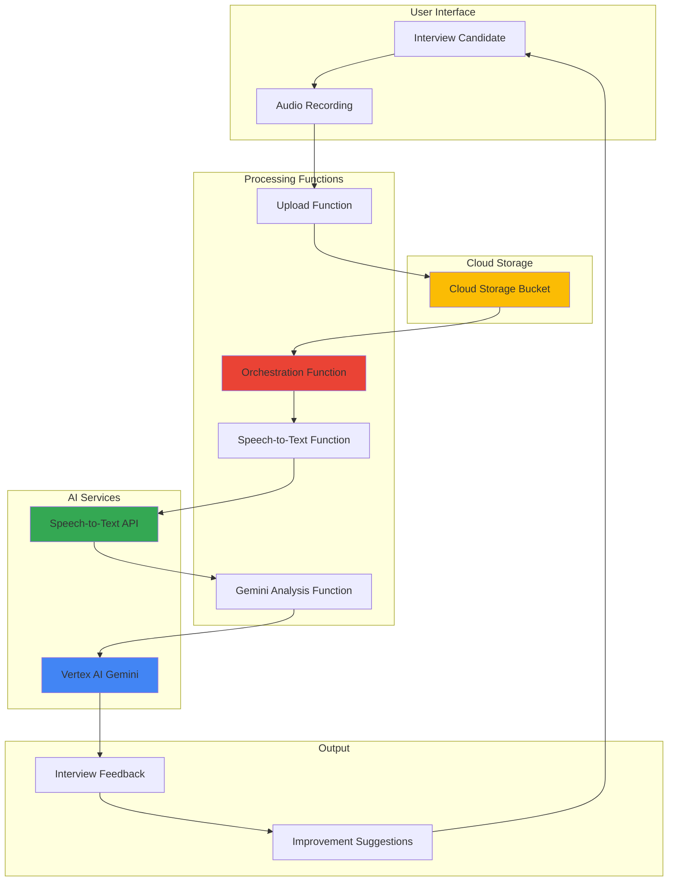

# Interview Practice Assistant using Gemini and Speech-to-Text

## Problem

Job seekers struggle with interview preparation, lacking access to realistic practice sessions and personalized feedback on their responses. Traditional mock interviews require human interviewers, making them expensive and scheduling-dependent, while most candidates receive generic advice that doesn't address their specific weaknesses or communication patterns.

## Solution

Build an intelligent interview practice platform using Google Cloud's AI services that conducts realistic mock interviews, transcribes spoken responses using Speech-to-Text, and provides detailed analysis and improvement recommendations through Vertex AI's Gemini model. This serverless solution scales automatically and provides 24/7 availability for interview practice.

## Architecture Diagram



## Prerequisites

1. Google Cloud account with billing enabled and appropriate permissions for Vertex AI, Speech-to-Text, Cloud Functions, and Cloud Storage
2. Google Cloud CLI (gcloud) installed and configured
3. Basic understanding of serverless functions and AI APIs
4. Audio recording capability for testing (microphone or audio files)
5. Estimated cost: $8-15 for initial testing and development

> **Note**: This solution uses pay-per-use pricing for AI APIs and serverless functions, making it cost-effective for individual practice sessions.

## Preparation

```bash
# Set environment variables for GCP resources
export PROJECT_ID="interview-practice-$(date +%s)"
export REGION="us-central1"
export ZONE="us-central1-a"

# Generate unique suffix for resource names
RANDOM_SUFFIX=$(openssl rand -hex 3)
export BUCKET_NAME="interview-audio-${RANDOM_SUFFIX}"
export FUNCTION_PREFIX="interview-assistant"

# Set default project and region
gcloud config set project ${PROJECT_ID}
gcloud config set compute/region ${REGION}
gcloud config set functions/region ${REGION}

# Enable required APIs
gcloud services enable cloudfunctions.googleapis.com
gcloud services enable speech.googleapis.com
gcloud services enable aiplatform.googleapis.com
gcloud services enable storage.googleapis.com
gcloud services enable run.googleapis.com

echo "✅ Project configured: ${PROJECT_ID}"
echo "✅ Resources will use suffix: ${RANDOM_SUFFIX}"
```

## Steps

1. **Create Cloud Storage Bucket for Audio Files**:

   Cloud Storage provides secure, scalable object storage for interview audio recordings with built-in versioning and lifecycle management. The bucket will store both uploaded audio files and processed transcription results, enabling the serverless functions to access audio data reliably across processing stages while maintaining cost efficiency through automated cleanup policies.

   ```bash
   # Create bucket for audio storage
   gsutil mb -p ${PROJECT_ID} \
       -c STANDARD \
       -l ${REGION} \
       gs://${BUCKET_NAME}
   
   # Set appropriate lifecycle policy for cost optimization
   cat > lifecycle.json << EOF
   {
     "rule": [
       {
         "condition": {"age": 30},
         "action": {"type": "Delete"}
       }
     ]
   }
   EOF
   
   gsutil lifecycle set lifecycle.json gs://${BUCKET_NAME}
   
   echo "✅ Storage bucket created: gs://${BUCKET_NAME}"
   ```

   The storage bucket is now configured with automatic cleanup after 30 days to manage costs while providing reliable storage for the interview practice workflow with Google Cloud's 99.95% availability SLA.

2. **Create Speech-to-Text Processing Function**:

   Cloud Functions provides serverless execution for speech processing with automatic scaling based on demand. This function receives audio files from Cloud Storage and uses the Speech-to-Text API to generate accurate transcriptions with confidence scores and timing information, supporting multiple audio formats and optimized for conversation analysis.

   ```bash
   # Create directory for speech function
   mkdir -p speech-function
   cd speech-function
   
   # Create requirements.txt for dependencies
   cat > requirements.txt << EOF
   google-cloud-speech==2.23.0
   google-cloud-storage==2.12.0
   functions-framework==3.5.0
   EOF
   
   # Create the speech processing function
   cat > main.py << 'EOF'
   import json
   from google.cloud import speech
   from google.cloud import storage
   import functions_framework
   
   @functions_framework.http
   def transcribe_audio(request):
       """Transcribe audio file using Speech-to-Text API."""
       try:
           request_json = request.get_json()
           bucket_name = request_json['bucket']
           file_name = request_json['file']
           
           # Initialize clients
           speech_client = speech.SpeechClient()
           storage_client = storage.Client()
           
           # Get audio file from Cloud Storage
           bucket = storage_client.bucket(bucket_name)
           blob = bucket.blob(file_name)
           audio_content = blob.download_as_bytes()
           
           # Configure speech recognition with optimized settings
           audio = speech.RecognitionAudio(content=audio_content)
           config = speech.RecognitionConfig(
               encoding=speech.RecognitionConfig.AudioEncoding.WEBM_OPUS,
               sample_rate_hertz=48000,
               language_code="en-US",
               enable_automatic_punctuation=True,
               enable_spoken_punctuation=True,
               enable_word_confidence=True,
               enable_word_time_offsets=True,
               model="latest_long",
               use_enhanced=True
           )
           
           # Perform transcription
           response = speech_client.recognize(config=config, audio=audio)
           
           # Process results with detailed confidence tracking
           transcription = ""
           confidence_scores = []
           word_details = []
           
           for result in response.results:
               transcription += result.alternatives[0].transcript + " "
               confidence_scores.append(result.alternatives[0].confidence)
               
               # Extract word-level details for analysis
               for word in result.alternatives[0].words:
                   word_details.append({
                       'word': word.word,
                       'confidence': word.confidence,
                       'start_time': word.start_time.total_seconds(),
                       'end_time': word.end_time.total_seconds()
                   })
           
           return {
               'transcription': transcription.strip(),
               'confidence': sum(confidence_scores) / len(confidence_scores) if confidence_scores else 0,
               'word_details': word_details,
               'status': 'success'
           }
           
       except Exception as e:
           return {'error': str(e), 'status': 'error'}
   EOF
   
   # Deploy the speech function
   gcloud functions deploy ${FUNCTION_PREFIX}-speech \
       --runtime python311 \
       --trigger-http \
       --allow-unauthenticated \
       --source . \
       --entry-point transcribe_audio \
       --memory 512MB \
       --timeout 120s
   
   cd ..
   echo "✅ Speech-to-Text function deployed"
   ```

   The Speech-to-Text function is now deployed with the latest enhanced model for improved accuracy and word-level timing analysis, providing detailed transcription data for comprehensive interview feedback.

3. **Create Gemini Analysis Function**:

   Vertex AI's Gemini 1.5 Pro model provides advanced natural language understanding with multimodal capabilities. This function evaluates transcribed answers for content quality, communication skills, and provides personalized improvement recommendations based on professional interview best practices and industry standards.

   ```bash
   # Create directory for analysis function
   mkdir -p analysis-function
   cd analysis-function
   
   # Create requirements.txt with latest versions
   cat > requirements.txt << EOF
   google-cloud-aiplatform==1.42.0
   functions-framework==3.5.0
   EOF
   
   # Create the Gemini analysis function
   cat > main.py << 'EOF'
   import json
   import vertexai
   from vertexai.generative_models import GenerativeModel
   import functions_framework
   import os
   
   @functions_framework.http
   def analyze_interview_response(request):
       """Analyze interview response using Gemini."""
       try:
           request_json = request.get_json()
           transcription = request_json['transcription']
           question = request_json.get('question', 'Tell me about yourself')
           confidence = request_json.get('confidence', 0.0)
           
           # Initialize Vertex AI with project context
           project_id = os.environ.get('GCP_PROJECT')
           location = os.environ.get('REGION', 'us-central1')
           vertexai.init(project=project_id, location=location)
           
           # Configure Gemini model with safety settings
           model = GenerativeModel("gemini-1.5-pro")
           
           # Create comprehensive analysis prompt
           prompt = f"""
           You are an expert interview coach with 15+ years of experience. 
           Analyze this interview response and provide detailed, actionable feedback.
           
           Interview Question: {question}
           
           Candidate Response: {transcription}
           Speech Confidence Score: {confidence:.2f}/1.0
           
           Please provide analysis in this structured format:
           
           **Content Analysis (Weight: 40%)**
           - Content Quality Score: X/10
           - Key Strengths: [List 2-3 specific strengths]
           - Areas for Improvement: [List 2-3 specific areas]
           - Relevance to Question: [How well the response addressed the question]
           
           **Communication Skills (Weight: 30%)**
           - Clarity and Articulation: [Based on confidence score and content]
           - Structure and Organization: [Logical flow assessment]
           - Professional Language: [Word choice and tone evaluation]
           - Confidence Indicators: [Verbal confidence markers]
           
           **Interview Best Practices (Weight: 30%)**
           - STAR Method Usage: [Situation, Task, Action, Result framework]
           - Quantifiable Results: [Use of metrics and specific examples]
           - Company/Role Alignment: [Relevance to typical job requirements]
           - Follow-up Potential: [Opens discussion for next questions]
           
           **Specific Recommendations**
           1. [Most important improvement with example]
           2. [Communication enhancement with technique]
           3. [Content strengthening with framework]
           
           **Sample Improved Response**
           [Provide a 2-3 sentence example of how to enhance the response]
           
           **Overall Interview Score: X/10**
           
           Keep feedback constructive, specific, and encouraging. Focus on actionable improvements.
           """
           
           # Generate analysis with safety settings
           response = model.generate_content(
               prompt,
               generation_config={
                   "temperature": 0.3,
                   "top_p": 0.8,
                   "max_output_tokens": 2048
               }
           )
           
           return {
               'analysis': response.text,
               'question': question,
               'transcription': transcription,
               'confidence_score': confidence,
               'status': 'success'
           }
           
       except Exception as e:
           return {'error': str(e), 'status': 'error'}
   EOF
   
   # Deploy the analysis function with environment variables
   gcloud functions deploy ${FUNCTION_PREFIX}-analysis \
       --runtime python311 \
       --trigger-http \
       --allow-unauthenticated \
       --source . \
       --entry-point analyze_interview_response \
       --memory 1GB \
       --timeout 120s \
       --set-env-vars GCP_PROJECT=${PROJECT_ID},REGION=${REGION}
   
   cd ..
   echo "✅ Gemini analysis function deployed"
   ```

   The Gemini analysis function is configured with optimized parameters for interview assessment, providing comprehensive feedback using industry-standard evaluation frameworks and professional coaching methodologies.

4. **Create Orchestration Function**:

   The orchestration function coordinates the entire interview practice workflow using Cloud Functions' built-in integration capabilities. This serverless coordinator manages the sequence from audio upload through transcription to final analysis, ensuring proper error handling, retry logic, and maintaining the user experience flow with appropriate timeouts and status tracking.

   ```bash
   # Create directory for orchestration function
   mkdir -p orchestration-function
   cd orchestration-function
   
   # Create requirements.txt
   cat > requirements.txt << EOF
   google-cloud-storage==2.12.0
   requests==2.31.0
   functions-framework==3.5.0
   EOF
   
   # Create the orchestration function
   cat > main.py << 'EOF'
   import json
   import requests
   from google.cloud import storage
   import functions_framework
   import os
   import time
   
   @functions_framework.http
   def orchestrate_interview_analysis(request):
       """Orchestrate the complete interview analysis workflow."""
       try:
           request_json = request.get_json()
           bucket_name = request_json['bucket']
           file_name = request_json['file']
           question = request_json.get('question', 'Tell me about yourself')
           
           # Validate inputs
           if not bucket_name or not file_name:
               return {'error': 'Missing required fields: bucket and file', 'status': 'error'}
           
           # Get function URLs dynamically
           region = os.environ.get('GCLOUD_REGION', 'us-central1')
           project = os.environ.get('GCLOUD_PROJECT')
           
           speech_url = f"https://{region}-{project}.cloudfunctions.net/interview-assistant-speech"
           analysis_url = f"https://{region}-{project}.cloudfunctions.net/interview-assistant-analysis"
           
           # Step 1: Transcribe audio with retry logic
           speech_payload = {
               'bucket': bucket_name,
               'file': file_name
           }
           
           max_retries = 3
           for attempt in range(max_retries):
               try:
                   speech_response = requests.post(
                       speech_url, 
                       json=speech_payload,
                       timeout=120
                   )
                   speech_result = speech_response.json()
                   
                   if speech_result.get('status') == 'success':
                       break
                   elif attempt == max_retries - 1:
                       return {
                           'error': 'Transcription failed after retries', 
                           'details': speech_result
                       }
                   time.sleep(2 ** attempt)  # Exponential backoff
                   
               except requests.exceptions.RequestException as e:
                   if attempt == max_retries - 1:
                       return {'error': f'Network error in transcription: {str(e)}'}
                   time.sleep(2 ** attempt)
           
           # Step 2: Analyze with Gemini
           analysis_payload = {
               'transcription': speech_result['transcription'],
               'question': question,
               'confidence': speech_result.get('confidence', 0.0)
           }
           
           try:
               analysis_response = requests.post(
                   analysis_url, 
                   json=analysis_payload,
                   timeout=120
               )
               analysis_result = analysis_response.json()
               
               if analysis_result.get('status') != 'success':
                   return {
                       'error': 'Analysis failed', 
                       'details': analysis_result
                   }
               
           except requests.exceptions.RequestException as e:
               return {'error': f'Network error in analysis: {str(e)}'}
           
           # Return complete results with metadata
           return {
               'transcription': speech_result['transcription'],
               'confidence': speech_result['confidence'],
               'analysis': analysis_result['analysis'],
               'question': question,
               'processing_time': time.time(),
               'status': 'complete'
           }
           
       except Exception as e:
           return {'error': f'Orchestration error: {str(e)}', 'status': 'error'}
   EOF
   
   # Deploy the orchestration function
   gcloud functions deploy ${FUNCTION_PREFIX}-orchestrate \
       --runtime python311 \
       --trigger-http \
       --allow-unauthenticated \
       --source . \
       --entry-point orchestrate_interview_analysis \
       --memory 256MB \
       --timeout 300s \
       --set-env-vars GCLOUD_REGION=${REGION},GCLOUD_PROJECT=${PROJECT_ID}
   
   cd ..
   echo "✅ Orchestration function deployed"
   ```

   The orchestration function provides a single endpoint for the complete interview analysis workflow, with robust error handling, retry logic, and extended timeout for comprehensive processing.

5. **Configure IAM Permissions**:

   Proper Identity and Access Management ensures secure communication between services while following Google Cloud's principle of least privilege. These granular permissions enable the functions to access only the required Google Cloud services for their specific roles, maintaining security boundaries while enabling seamless service-to-service communication.

   ```bash
   # Get the project number for service account identification
   PROJECT_NUMBER=$(gcloud projects describe ${PROJECT_ID} \
       --format="value(projectNumber)")
   
   # Create custom service account for functions
   gcloud iam service-accounts create interview-assistant \
       --display-name="Interview Assistant Service Account" \
       --description="Service account for interview practice functions"
   
   SERVICE_ACCOUNT="interview-assistant@${PROJECT_ID}.iam.gserviceaccount.com"
   
   # Grant necessary permissions with least privilege principle
   gcloud projects add-iam-policy-binding ${PROJECT_ID} \
       --member="serviceAccount:${SERVICE_ACCOUNT}" \
       --role="roles/speech.client"
   
   gcloud projects add-iam-policy-binding ${PROJECT_ID} \
       --member="serviceAccount:${SERVICE_ACCOUNT}" \
       --role="roles/aiplatform.user"
   
   gcloud projects add-iam-policy-binding ${PROJECT_ID} \
       --member="serviceAccount:${SERVICE_ACCOUNT}" \
       --role="roles/storage.objectAdmin"
   
   # Update functions to use the service account
   gcloud functions deploy ${FUNCTION_PREFIX}-speech \
       --service-account=${SERVICE_ACCOUNT} \
       --update-env-vars GOOGLE_APPLICATION_CREDENTIALS=""
   
   gcloud functions deploy ${FUNCTION_PREFIX}-analysis \
       --service-account=${SERVICE_ACCOUNT} \
       --update-env-vars GOOGLE_APPLICATION_CREDENTIALS=""
   
   gcloud functions deploy ${FUNCTION_PREFIX}-orchestrate \
       --service-account=${SERVICE_ACCOUNT} \
       --update-env-vars GOOGLE_APPLICATION_CREDENTIALS=""
   
   echo "✅ IAM permissions configured with custom service account"
   ```

   The service account configuration follows Google Cloud security best practices, providing granular permissions for each AI service while maintaining secure access control and audit trails.

6. **Create Sample Interview Questions Dataset**:

   A curated question dataset enhances the interview practice experience by providing realistic scenarios across different interview categories and difficulty levels. This structured data supports various industries and can be dynamically expanded based on user preferences and job market trends.

   ```bash
   # Create comprehensive questions file
   cat > interview_questions.json << 'EOF'
   {
     "behavioral": [
       "Tell me about a time when you faced a significant challenge at work. How did you handle it?",
       "Describe a situation where you had to work with a difficult team member.",
       "Give me an example of when you went above and beyond in your role.",
       "Tell me about a time when you made a mistake. How did you handle it?",
       "Describe a situation where you had to learn something quickly.",
       "Tell me about a time when you had to convince someone to see your point of view."
     ],
     "technical": [
       "Walk me through your approach to solving a complex technical problem.",
       "How do you stay current with new technologies in your field?",
       "Describe your experience with [relevant technology/framework].",
       "What's your process for debugging a challenging issue?",
       "How do you handle code reviews and feedback?",
       "Explain a technical concept to someone without a technical background."
     ],
     "general": [
       "Tell me about yourself.",
       "Why are you interested in this position?",
       "What are your greatest strengths and weaknesses?",
       "Where do you see yourself in five years?",
       "Why are you leaving your current position?",
       "What motivates you in your work?"
     ],
     "leadership": [
       "Describe your leadership style.",
       "Tell me about a time when you had to lead a project.",
       "How do you handle conflict within your team?",
       "Describe a time when you had to make a difficult decision.",
       "How do you motivate team members?",
       "Tell me about a time when you received criticism from your manager."
     ]
   }
   EOF
   
   # Upload questions to Cloud Storage
   gsutil cp interview_questions.json gs://${BUCKET_NAME}/
   
   echo "✅ Sample interview questions uploaded"
   ```

   The question dataset provides structured interview scenarios across multiple categories, enabling comprehensive practice sessions tailored to different interview types and professional levels.

7. **Create Test Audio File and Validation Setup**:

   Testing with sample audio ensures the complete workflow functions correctly before user interaction. This validation framework verifies Speech-to-Text accuracy and Gemini analysis quality using controlled test cases while providing tools for ongoing system health monitoring.

   ```bash
   # Create a comprehensive test script
   cat > test_interview.py << 'EOF'
   import json
   import requests
   import os
   import time
   
   # Configuration from environment
   project_id = os.environ.get('PROJECT_ID')
   region = os.environ.get('REGION', 'us-central1')
   bucket_name = os.environ.get('BUCKET_NAME')
   
   # Function URLs
   orchestrate_url = f"https://{region}-{project_id}.cloudfunctions.net/interview-assistant-orchestrate"
   speech_url = f"https://{region}-{project_id}.cloudfunctions.net/interview-assistant-speech"
   analysis_url = f"https://{region}-{project_id}.cloudfunctions.net/interview-assistant-analysis"
   
   def test_analysis_only():
       """Test analysis function with sample text."""
       test_payload = {
           "transcription": "I am a software engineer with five years of experience in full-stack development. I have worked on various projects including web applications, mobile apps, and cloud infrastructure. I'm passionate about solving complex problems and collaborating with teams to deliver high-quality software solutions.",
           "question": "Tell me about yourself",
           "confidence": 0.95
       }
       
       print("Testing Gemini analysis function...")
       try:
           response = requests.post(analysis_url, json=test_payload, timeout=60)
           result = response.json()
           
           if result.get('status') == 'success':
               print("✅ Analysis function test passed")
               print(f"Analysis preview: {result['analysis'][:200]}...")
               return True
           else:
               print(f"❌ Analysis function test failed: {result}")
               return False
               
       except Exception as e:
           print(f"❌ Analysis function test error: {e}")
           return False
   
   def test_orchestration_simulation():
       """Test orchestration with simulation payload."""
       test_payload = {
           "bucket": bucket_name,
           "file": "test_audio.wav",  # This would be an actual uploaded file
           "question": "Tell me about your professional background and key achievements."
       }
       
       print("\nTesting orchestration workflow (simulation)...")
       print(f"Orchestration URL: {orchestrate_url}")
       print(f"Test payload: {json.dumps(test_payload, indent=2)}")
       print("\n⚠️  Note: Upload an actual audio file to test the complete workflow")
       print(f"Example: gsutil cp your_audio.wav gs://{bucket_name}/test_audio.wav")
       
       return True
   
   def main():
       print("=== Interview Practice Assistant Test Suite ===\n")
       print("Function URLs:")
       print(f"Speech Function: {speech_url}")
       print(f"Analysis Function: {analysis_url}")
       print(f"Orchestration Function: {orchestrate_url}\n")
       
       # Run tests
       analysis_success = test_analysis_only()
       orchestration_setup = test_orchestration_simulation()
       
       print(f"\n=== Test Results ===")
       print(f"Analysis Function: {'✅ PASS' if analysis_success else '❌ FAIL'}")
       print(f"Orchestration Setup: {'✅ READY' if orchestration_setup else '❌ FAIL'}")
       
       if analysis_success and orchestration_setup:
           print("\n🎉 System is ready for interview practice!")
           print("Next steps:")
           print("1. Record or upload an audio file for testing")
           print("2. Use the orchestration endpoint to process complete interviews")
           print("3. Review the detailed feedback and analysis")
       else:
           print("\n⚠️  Some components need attention before full deployment")
   
   if __name__ == "__main__":
       main()
   EOF
   
   # Make test script executable
   chmod +x test_interview.py
   
   # Store function URLs for easy access
   echo "✅ Test framework created"
   echo ""
   echo "Function URLs:"
   echo "Speech Function: https://${REGION}-${PROJECT_ID}.cloudfunctions.net/${FUNCTION_PREFIX}-speech"
   echo "Analysis Function: https://${REGION}-${PROJECT_ID}.cloudfunctions.net/${FUNCTION_PREFIX}-analysis"
   echo "Orchestration Function: https://${REGION}-${PROJECT_ID}.cloudfunctions.net/${FUNCTION_PREFIX}-orchestrate"
   echo ""
   echo "Run tests: python test_interview.py"
   ```

   The test framework provides comprehensive validation tools for each function individually and the complete workflow integration, enabling ongoing quality assurance and performance monitoring.

## Validation & Testing

1. **Verify Function Deployments**:

   ```bash
   # Check all functions are deployed and active
   gcloud functions list --filter="name:${FUNCTION_PREFIX}"
   
   # Test function connectivity and status
   ORCHESTRATE_URL="https://${REGION}-${PROJECT_ID}.cloudfunctions.net/${FUNCTION_PREFIX}-orchestrate"
   
   echo "Function deployment verification:"
   echo "Orchestration URL: ${ORCHESTRATE_URL}"
   echo "Expected: Three functions with ACTIVE status"
   ```

   Expected output: Three functions listed with ACTIVE status and proper URLs displayed.

2. **Test Speech-to-Text Function**:

   ```bash
   # Test the speech function directly (requires actual audio file)
   SPEECH_URL="https://${REGION}-${PROJECT_ID}.cloudfunctions.net/${FUNCTION_PREFIX}-speech"
   
   curl -X POST ${SPEECH_URL} \
       -H "Content-Type: application/json" \
       -d '{"bucket":"'${BUCKET_NAME}'","file":"test_audio.wav"}' \
       || echo "Upload actual audio file to test transcription"
   ```

   Expected behavior: Function responds with JSON containing transcription status (success with audio file, error without).

3. **Test Gemini Analysis Function**:

   ```bash
   # Test analysis function with sample text
   ANALYSIS_URL="https://${REGION}-${PROJECT_ID}.cloudfunctions.net/${FUNCTION_PREFIX}-analysis"
   
   curl -X POST ${ANALYSIS_URL} \
       -H "Content-Type: application/json" \
       -d '{
         "transcription": "I am a software engineer with five years of experience in full-stack development. I have worked on various projects including web applications and mobile apps.",
         "question": "Tell me about yourself",
         "confidence": 0.95
       }'
   ```

   Expected output: Detailed JSON response with Gemini analysis including content evaluation and improvement recommendations.

4. **Run Comprehensive Test Suite**:

   ```bash
   # Execute the test framework
   python test_interview.py
   ```

   Expected output: Test results showing analysis function success and orchestration readiness confirmation.

5. **Verify Cloud Storage Access**:

   ```bash
   # Verify bucket accessibility and lifecycle policy
   gsutil ls -L gs://${BUCKET_NAME}
   gsutil lifecycle get gs://${BUCKET_NAME}
   ```

   Expected output: Bucket details with lifecycle policy showing 30-day deletion rule.

## Cleanup

1. **Delete Cloud Functions**:

   ```bash
   # Remove all deployed functions
   gcloud functions delete ${FUNCTION_PREFIX}-speech \
       --region=${REGION} \
       --quiet
   
   gcloud functions delete ${FUNCTION_PREFIX}-analysis \
       --region=${REGION} \
       --quiet
   
   gcloud functions delete ${FUNCTION_PREFIX}-orchestrate \
       --region=${REGION} \
       --quiet
   
   echo "✅ Cloud Functions deleted"
   ```

2. **Remove Storage Resources**:

   ```bash
   # Delete bucket and all contents
   gsutil -m rm -r gs://${BUCKET_NAME}
   
   echo "✅ Storage bucket deleted"
   ```

3. **Clean up IAM and Local Files**:

   ```bash
   # Remove service account
   gcloud iam service-accounts delete ${SERVICE_ACCOUNT} --quiet
   
   # Remove local files and directories
   rm -rf speech-function analysis-function orchestration-function
   rm -f lifecycle.json interview_questions.json test_interview.py
   
   # Delete project (if created specifically for this recipe)
   gcloud projects delete ${PROJECT_ID} --quiet
   
   echo "✅ All resources cleaned up"
   echo "Note: Project deletion may take several minutes to complete"
   ```

## Discussion

This interview practice assistant demonstrates the sophisticated capabilities of Google Cloud's AI platform for creating user-facing applications that provide real value to job seekers and professionals. The architecture leverages **Vertex AI's Gemini 1.5 Pro model** for advanced natural language understanding, providing nuanced feedback that evaluates not just content accuracy but communication effectiveness, professional presentation skills, and interview best practices alignment.

The **Speech-to-Text API integration** with enhanced models showcases Google Cloud's commitment to multimodal AI experiences. By configuring the service with word-level confidence scores, timing information, and the latest enhanced models, the solution provides detailed feedback about speech patterns, pacing, and clarity—critical factors in interview success that traditional text-based practice tools cannot address. The confidence scoring enables the system to identify areas where candidates may need to speak more clearly or confidently.

The **serverless architecture using Cloud Functions** ensures cost-effectiveness and automatic scalability. Each function serves a specific purpose (transcription, analysis, orchestration), following microservices principles while maintaining loose coupling. This design allows for independent scaling based on demand, makes the system resilient to failures in individual components, and enables easy maintenance and updates to specific functionality without affecting the entire system.

**Security considerations** are fundamental to this implementation. The custom service account follows Google Cloud's principle of least privilege, granting only the minimum permissions required for each service to function. The IAM configuration ensures that sensitive interview data remains protected while enabling seamless service-to-service communication. For production deployments, additional security measures such as VPC Service Controls, Cloud KMS encryption for data at rest, and Cloud Armor for DDoS protection should be considered.

The solution's **cost optimization** through Cloud Storage lifecycle policies and pay-per-use pricing models makes it accessible for individual users while remaining economically viable for larger organizations. The 30-day deletion policy balances data retention needs with storage costs, and the serverless functions only incur charges during actual usage, making this solution particularly cost-effective for sporadic interview practice sessions.

> **Tip**: Consider implementing caching strategies for frequently used interview questions and common analysis patterns to reduce API calls and improve response times during peak usage periods.

**Documentation Sources:**
- [Vertex AI Gemini Model Reference](https://cloud.google.com/vertex-ai/docs/generative-ai/model-reference/gemini)
- [Speech-to-Text API Enhanced Models](https://cloud.google.com/speech-to-text/docs/enhanced-models)
- [Cloud Functions 2nd Generation Guide](https://cloud.google.com/functions/docs/2nd-gen)
- [Google Cloud IAM Best Practices](https://cloud.google.com/iam/docs/using-iam-securely)
- [Cloud Storage Lifecycle Management](https://cloud.google.com/storage/docs/lifecycle)

## Challenge

Extend this interview practice assistant by implementing these progressive enhancements:

1. **Multi-language Support**: Integrate Google Translate API to support interview practice in multiple languages, expanding accessibility for global users and multilingual interview scenarios with automatic language detection and cultural context adaptation.

2. **Video Analysis Integration**: Add Cloud Video Intelligence API to analyze non-verbal communication, facial expressions, and body language during video-based interview practice sessions, providing comprehensive feedback on professional presence and confidence indicators.

3. **Industry-Specific Customization**: Implement dynamic question generation using Gemini to create tailored interview scenarios based on specific job roles, industries, and experience levels, integrating with job description APIs and industry trend data for relevant practice sessions.

4. **Real-time Feedback Dashboard**: Build a responsive web interface using Cloud Run and React, integrating with Cloud Monitoring to provide real-time performance analytics, progress tracking, and comparative benchmarking against industry standards and peer performance.

5. **Advanced AI Coaching**: Develop a conversational AI interviewer using Gemini's multi-turn conversation capabilities that can ask contextual follow-up questions, simulate realistic interview dynamics, and adapt questioning based on previous responses and identified improvement areas.

## Infrastructure Code

*Infrastructure code will be generated after recipe approval.*