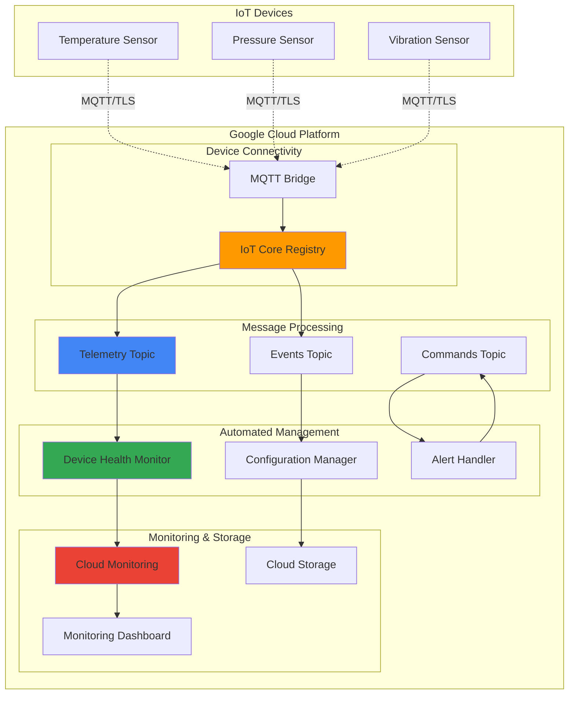

# IoT Device Fleet Management with MQTT and Pub/Sub

## Problem

Manufacturing companies with distributed IoT sensor networks struggle to maintain visibility and control over hundreds of devices across multiple locations. Without centralized device lifecycle management, organizations face challenges including device authentication failures, undetected device outages, configuration drift, and inability to remotely update device firmware. These issues result in operational downtime, increased maintenance costs, and compromised data collection reliability that directly impacts production monitoring and predictive maintenance capabilities.

## Solution

Build a comprehensive IoT device fleet management system using Google Cloud's managed services to provide secure MQTT-based device communication, automated device lifecycle management, and real-time health monitoring. The solution leverages IoT Core for secure device authentication and MQTT protocol handling, Cloud Pub/Sub for scalable message routing and event distribution, Cloud Functions for automated device management workflows, and Cloud Monitoring for comprehensive fleet health visibility and alerting.

## Architecture Diagram



## Prerequisites

1. Google Cloud project with billing enabled and appropriate IAM permissions (IoT Core Admin, Pub/Sub Admin, Cloud Functions Admin)
2. Google Cloud CLI installed and configured (version 400.0.0 or later)
3. Basic understanding of MQTT protocol, JSON message formatting, and device authentication concepts
4. Python 3.9+ for Cloud Functions development and device simulation scripts
5. Estimated cost: $5-15 per month for IoT Core device registry (first 250 MB free), Pub/Sub messages ($40 per million operations), Cloud Functions invocations ($0.40 per million), and Cloud Monitoring metrics (first 150 metrics free)

> **Note**: This recipe uses IoT Core which requires project-level billing and may incur charges even during testing. Monitor usage through the Google Cloud Console billing dashboard.

## Preparation

```bash
# Set environment variables for GCP resources
export PROJECT_ID="iot-fleet-$(date +%s)"
export REGION="us-central1"
export ZONE="us-central1-a"

# Generate unique suffix for resource names
RANDOM_SUFFIX=$(openssl rand -hex 3)
export REGISTRY_NAME="device-registry-${RANDOM_SUFFIX}"
export TELEMETRY_TOPIC="device-telemetry-${RANDOM_SUFFIX}"
export EVENTS_TOPIC="device-events-${RANDOM_SUFFIX}"
export COMMANDS_TOPIC="device-commands-${RANDOM_SUFFIX}"

# Set default project and region
gcloud config set project ${PROJECT_ID}
gcloud config set compute/region ${REGION}
gcloud config set compute/zone ${ZONE}

# Enable required APIs for IoT device management
gcloud services enable cloudiot.googleapis.com
gcloud services enable pubsub.googleapis.com
gcloud services enable cloudfunctions.googleapis.com
gcloud services enable monitoring.googleapis.com
gcloud services enable storage.googleapis.com

echo "✅ Project configured: ${PROJECT_ID}"
echo "✅ Registry name: ${REGISTRY_NAME}"
```

## Steps

1. **Create Pub/Sub Topics for Device Communication**:

   Cloud Pub/Sub provides the messaging backbone for IoT device communication, enabling asynchronous message processing with guaranteed delivery and automatic scaling. Creating separate topics for telemetry data, device events, and command distribution ensures proper message routing and allows for independent processing pipelines with different security and retention policies.

   ```bash
   # Create telemetry topic for sensor data
   gcloud pubsub topics create ${TELEMETRY_TOPIC}
   
   # Create events topic for device lifecycle events
   gcloud pubsub topics create ${EVENTS_TOPIC}
   
   # Create commands topic for device control messages
   gcloud pubsub topics create ${COMMANDS_TOPIC}
   
   # Create subscriptions for message processing
   gcloud pubsub subscriptions create telemetry-processor \
       --topic=${TELEMETRY_TOPIC}
   
   gcloud pubsub subscriptions create events-processor \
       --topic=${EVENTS_TOPIC}
   
   echo "✅ Pub/Sub topics and subscriptions created successfully"
   ```

   The Pub/Sub topics now provide reliable, scalable message routing with automatic retry logic and dead letter queues. This foundation enables the IoT Core service to route device messages while maintaining message durability and supporting high-throughput device communication patterns.

2. **Create IoT Core Device Registry**:

   Google Cloud IoT Core provides a fully managed service for securely connecting and managing IoT devices at scale. The device registry serves as the central authentication and authorization point, managing device credentials, configuration, and state while providing secure MQTT and HTTP endpoints for device communication.

   ```bash
   # Create IoT Core device registry with Pub/Sub integration
   gcloud iot registries create ${REGISTRY_NAME} \
       --region=${REGION} \
       --event-notification-config=topic=${EVENTS_TOPIC} \
       --state-notification-config=topic=${TELEMETRY_TOPIC}
   
   # Verify registry creation
   gcloud iot registries describe ${REGISTRY_NAME} \
       --region=${REGION}
   
   echo "✅ IoT Core registry created with Pub/Sub integration"
   ```

   The IoT Core registry now provides secure device authentication using public key cryptography, automatic message routing to Pub/Sub topics, and device state management capabilities. This managed service eliminates the need to maintain MQTT brokers while providing enterprise-grade security and scalability.

3. **Create Device Credentials and Register Devices**:

   Device authentication in IoT Core uses RSA or Elliptic Curve public key pairs, providing strong cryptographic security without requiring shared secrets. Generating unique key pairs for each device and registering them in the IoT Core registry establishes the foundation for secure device-to-cloud communication and device identity verification.

   ```bash
   # Create directory for device credentials
   mkdir -p device-keys
   
   # Generate RSA key pair for device authentication
   openssl genrsa -out device-keys/device-private.pem 2048
   openssl rsa -in device-keys/device-private.pem \
       -pubout -out device-keys/device-public.pem
   
   # Register first IoT device in the registry
   gcloud iot devices create temp-sensor-001 \
       --registry=${REGISTRY_NAME} \
       --region=${REGION} \
       --public-key path=device-keys/device-public.pem,type=rsa-pem
   
   # Register additional devices for fleet simulation
   gcloud iot devices create pressure-sensor-002 \
       --registry=${REGISTRY_NAME} \
       --region=${REGION} \
       --public-key path=device-keys/device-public.pem,type=rsa-pem
   
   echo "✅ Devices registered with cryptographic authentication"
   ```

   The devices are now registered with strong cryptographic identities and can securely authenticate to IoT Core using their private keys. This approach ensures that only authorized devices can connect to the system while providing non-repudiation and message integrity through digital signatures.

4. **Deploy Device Health Monitoring Function**:

   Cloud Functions provides serverless compute for processing IoT device messages and implementing automated fleet management logic. The health monitoring function analyzes device telemetry patterns to detect anomalies, track device connectivity status, and trigger alerts when devices become unresponsive or report error conditions.

   ```bash
   # Create Cloud Function source directory
   mkdir -p health-monitor-function
   
   # Create the health monitoring function code
   cat > health-monitor-function/main.py << 'EOF'
import json
import logging
from datetime import datetime, timedelta
from google.cloud import monitoring_v3
from google.cloud import pubsub_v1
import base64

def process_device_telemetry(event, context):
    """Process device telemetry and monitor health status."""
    
    # Decode Pub/Sub message
    if 'data' in event:
        message_data = base64.b64decode(event['data']).decode('utf-8')
        telemetry = json.loads(message_data)
        
        device_id = event['attributes'].get('deviceId', 'unknown')
        registry_id = event['attributes'].get('deviceRegistryId', 'unknown')
        
        # Extract telemetry metrics
        timestamp = telemetry.get('timestamp', datetime.utcnow().isoformat())
        temperature = telemetry.get('temperature')
        battery_level = telemetry.get('battery_level')
        
        # Initialize monitoring client
        client = monitoring_v3.MetricServiceClient()
        project_name = f"projects/{context.resource['service']}"
        
        # Create custom metrics for device health
        if temperature is not None:
            create_metric_point(client, project_name, device_id, 
                              'temperature', temperature, timestamp)
        
        if battery_level is not None:
            create_metric_point(client, project_name, device_id,
                              'battery_level', battery_level, timestamp)
            
            # Alert if battery is low
            if battery_level < 20:
                logging.warning(f"Low battery alert for device {device_id}: {battery_level}%")
                send_alert(device_id, f"Battery level critical: {battery_level}%")
        
        logging.info(f"Processed telemetry for device {device_id}")

def create_metric_point(client, project_name, device_id, metric_type, value, timestamp):
    """Create a custom metric point in Cloud Monitoring."""
    series = monitoring_v3.TimeSeries()
    series.metric.type = f"custom.googleapis.com/iot/{metric_type}"
    series.resource.type = "global"
    series.resource.labels["project_id"] = project_name.split('/')[-1]
    series.metric.labels["device_id"] = device_id
    
    point = series.points.add()
    point.value.double_value = float(value)
    point.interval.end_time.seconds = int(datetime.fromisoformat(timestamp.replace('Z', '+00:00')).timestamp())
    
    client.create_time_series(name=project_name, time_series=[series])

def send_alert(device_id, message):
    """Send alert to operations team via Pub/Sub."""
    publisher = pubsub_v1.PublisherClient()
    topic_path = publisher.topic_path('${PROJECT_ID}', '${COMMANDS_TOPIC}')
    
    alert_data = {
        'alert_type': 'device_health',
        'device_id': device_id,
        'message': message,
        'timestamp': datetime.utcnow().isoformat()
    }
    
    data = json.dumps(alert_data).encode('utf-8')
    publisher.publish(topic_path, data)
EOF
   
   # Create requirements file for Cloud Function
   cat > health-monitor-function/requirements.txt << 'EOF'
google-cloud-monitoring==2.15.1
google-cloud-pubsub==2.18.4
functions-framework==3.4.0
EOF
   
   # Deploy Cloud Function with Pub/Sub trigger
   gcloud functions deploy device-health-monitor \
       --source=health-monitor-function \
       --runtime=python39 \
       --trigger-topic=${TELEMETRY_TOPIC} \
       --entry-point=process_device_telemetry \
       --memory=256MB \
       --timeout=60s \
       --region=${REGION}
   
   echo "✅ Device health monitoring function deployed"
   ```

   The Cloud Function now automatically processes all device telemetry messages, creates custom metrics in Cloud Monitoring, and generates alerts for critical conditions. This serverless architecture scales automatically with message volume while providing real-time device health analysis and automated incident response capabilities.

5. **Create Device Configuration Management Function**:

   Configuration management enables remote device updates and ensures fleet consistency across distributed deployments. This Cloud Function processes device configuration requests, validates settings against operational policies, and uses IoT Core's device configuration API to push updates securely to individual devices or device groups.

   ```bash
   # Create configuration management function
   mkdir -p config-manager-function
   
   cat > config-manager-function/main.py << 'EOF'
import json
import logging
from google.cloud import iot_v1
from google.cloud import storage
import base64

def manage_device_config(event, context):
    """Handle device configuration updates and management."""
    
    # Decode configuration request
    if 'data' in event:
        message_data = base64.b64decode(event['data']).decode('utf-8')
        config_request = json.loads(message_data)
        
        device_id = config_request.get('device_id')
        config_data = config_request.get('configuration', {})
        action = config_request.get('action', 'update')
        
        if not device_id:
            logging.error("Device ID missing in configuration request")
            return
        
        # Initialize IoT Core client
        client = iot_v1.DeviceManagerClient()
        device_path = client.device_path('${PROJECT_ID}', '${REGION}', 
                                       '${REGISTRY_NAME}', device_id)
        
        if action == 'update':
            # Create new device configuration
            config_json = json.dumps(config_data)
            config_bytes = config_json.encode('utf-8')
            
            try:
                # Update device configuration
                response = client.modify_cloud_to_device_config(
                    request={
                        "name": device_path,
                        "binary_data": config_bytes
                    }
                )
                
                logging.info(f"Configuration updated for device {device_id}")
                
                # Store configuration backup
                store_config_backup(device_id, config_data)
                
            except Exception as e:
                logging.error(f"Failed to update configuration for {device_id}: {e}")
        
        elif action == 'retrieve':
            # Get current device configuration
            try:
                device = client.get_device(request={"name": device_path})
                current_config = device.config
                
                logging.info(f"Retrieved configuration for device {device_id}")
                return {
                    'device_id': device_id,
                    'configuration': current_config.binary_data.decode('utf-8') if current_config.binary_data else None,
                    'version': current_config.version
                }
                
            except Exception as e:
                logging.error(f"Failed to retrieve configuration for {device_id}: {e}")

def store_config_backup(device_id, config_data):
    """Store device configuration backup in Cloud Storage."""
    storage_client = storage.Client()
    bucket_name = f"${PROJECT_ID}-device-configs"
    
    try:
        # Create bucket if it doesn't exist
        try:
            bucket = storage_client.create_bucket(bucket_name)
        except Exception:
            bucket = storage_client.bucket(bucket_name)
        
        # Store configuration with timestamp
        from datetime import datetime
        timestamp = datetime.utcnow().strftime('%Y%m%d_%H%M%S')
        blob_name = f"{device_id}/config_{timestamp}.json"
        
        blob = bucket.blob(blob_name)
        blob.upload_from_string(json.dumps(config_data, indent=2))
        
        logging.info(f"Configuration backup stored for device {device_id}")
        
    except Exception as e:
        logging.error(f"Failed to store configuration backup: {e}")
EOF
   
   # Create requirements file
   cat > config-manager-function/requirements.txt << 'EOF'
google-cloud-iot==2.7.1
google-cloud-storage==2.10.0
functions-framework==3.4.0
EOF
   
   # Deploy configuration management function
   gcloud functions deploy device-config-manager \
       --source=config-manager-function \
       --runtime=python39 \
       --trigger-topic=${EVENTS_TOPIC} \
       --entry-point=manage_device_config \
       --memory=512MB \
       --timeout=120s \
       --region=${REGION}
   
   echo "✅ Device configuration management function deployed"
   ```

   The configuration management function provides automated device configuration updates with backup and audit trails. This enables centralized fleet management, ensuring consistent device behavior across the entire deployment while maintaining configuration history for compliance and rollback capabilities.

6. **Create Monitoring Dashboard and Alerts**:

   Cloud Monitoring provides comprehensive visibility into IoT fleet health through custom dashboards and automated alerting. Creating dashboards with device-specific metrics and configuring alerts for critical conditions enables proactive fleet management and rapid incident response.

   ```bash
   # Create monitoring dashboard configuration
   cat > dashboard-config.json << 'EOF'
{
  "displayName": "IoT Fleet Management Dashboard",
  "gridLayout": {
    "widgets": [
      {
        "title": "Device Count by Status",
        "xyChart": {
          "dataSets": [
            {
              "timeSeriesQuery": {
                "timeSeriesFilter": {
                  "filter": "resource.type=\"iot_device\"",
                  "aggregation": {
                    "alignmentPeriod": "60s",
                    "perSeriesAligner": "ALIGN_COUNT"
                  }
                }
              }
            }
          ]
        }
      },
      {
        "title": "Average Temperature by Device",
        "xyChart": {
          "dataSets": [
            {
              "timeSeriesQuery": {
                "timeSeriesFilter": {
                  "filter": "metric.type=\"custom.googleapis.com/iot/temperature\"",
                  "aggregation": {
                    "alignmentPeriod": "300s",
                    "perSeriesAligner": "ALIGN_MEAN",
                    "crossSeriesReducer": "REDUCE_MEAN",
                    "groupByFields": ["metric.label.device_id"]
                  }
                }
              }
            }
          ]
        }
      },
      {
        "title": "Battery Levels",
        "xyChart": {
          "dataSets": [
            {
              "timeSeriesQuery": {
                "timeSeriesFilter": {
                  "filter": "metric.type=\"custom.googleapis.com/iot/battery_level\"",
                  "aggregation": {
                    "alignmentPeriod": "300s",
                    "perSeriesAligner": "ALIGN_MEAN"
                  }
                }
              }
            }
          ]
        }
      }
    ]
  }
}
EOF
   
   # Create the monitoring dashboard
   gcloud monitoring dashboards create --config-from-file=dashboard-config.json
   
   # Create alert policy for low battery
   gcloud alpha monitoring policies create \
       --display-name="IoT Device Low Battery Alert" \
       --condition-filter='metric.type="custom.googleapis.com/iot/battery_level"' \
       --condition-comparison=COMPARISON_LESS_THAN \
       --condition-threshold-value=20 \
       --condition-threshold-duration=300s \
       --notification-channels="" \
       --alert-strategy-auto-close=1800s
   
   echo "✅ Monitoring dashboard and alerts configured"
   ```

   The monitoring dashboard provides real-time visibility into fleet health metrics, enabling operations teams to quickly identify trends and anomalies. Automated alerts ensure rapid response to critical conditions like device failures or low battery levels, minimizing operational disruptions.

7. **Simulate Device Data and Test Fleet Management**:

   Device simulation validates the complete IoT fleet management system by generating realistic telemetry data and testing all communication pathways. This comprehensive testing ensures proper message routing, function execution, and monitoring integration before deploying to production devices.

   ```bash
   # Create device simulator script
   cat > simulate_devices.py << 'EOF'
#!/usr/bin/env python3
import json
import time
import random
import ssl
import jwt
from datetime import datetime, timedelta
import paho.mqtt.client as mqtt

# Device configuration
DEVICES = [
    {'id': 'temp-sensor-001', 'type': 'temperature'},
    {'id': 'pressure-sensor-002', 'type': 'pressure'}
]

# MQTT configuration
MQTT_BRIDGE_HOSTNAME = 'mqtt.googleapis.com'
MQTT_BRIDGE_PORT = 8883
PROJECT_ID = '${PROJECT_ID}'
REGISTRY_ID = '${REGISTRY_NAME}'
REGION = '${REGION}'

def create_jwt_token(private_key_file, algorithm='RS256'):
    """Create JWT token for device authentication."""
    token = {
        'iat': datetime.utcnow(),
        'exp': datetime.utcnow() + timedelta(minutes=60),
        'aud': PROJECT_ID
    }
    
    with open(private_key_file, 'r') as f:
        private_key = f.read()
    
    return jwt.encode(token, private_key, algorithm=algorithm)

def generate_telemetry(device):
    """Generate realistic telemetry data for device."""
    base_data = {
        'timestamp': datetime.utcnow().isoformat() + 'Z',
        'device_id': device['id'],
        'battery_level': random.randint(15, 100)
    }
    
    if device['type'] == 'temperature':
        base_data['temperature'] = round(random.uniform(18.0, 28.0), 2)
        base_data['humidity'] = random.randint(30, 70)
    elif device['type'] == 'pressure':
        base_data['pressure'] = round(random.uniform(995.0, 1025.0), 2)
    
    return base_data

def simulate_device(device):
    """Simulate a single IoT device."""
    print(f"Starting simulation for device: {device['id']}")
    
    # Create MQTT client
    client_id = f"projects/{PROJECT_ID}/locations/{REGION}/registries/{REGISTRY_ID}/devices/{device['id']}"
    client = mqtt.Client(client_id=client_id)
    
    # Configure TLS
    context = ssl.create_default_context(ssl.Purpose.SERVER_AUTH)
    context.set_ciphers('ECDHE+AESGCM:ECDHE+CHACHA20:DHE+AESGCM:DHE+CHACHA20:!aNULL:!MD5:!DSS')
    client.tls_set_context(context)
    
    # Set authentication
    jwt_token = create_jwt_token('device-keys/device-private.pem')
    client.username_pw_set(username='unused', password=jwt_token)
    
    # Connect to MQTT bridge
    try:
        client.connect(MQTT_BRIDGE_HOSTNAME, MQTT_BRIDGE_PORT, 60)
        client.loop_start()
        
        # Publish telemetry data
        for i in range(10):
            telemetry = generate_telemetry(device)
            topic = f"/devices/{device['id']}/events"
            
            payload = json.dumps(telemetry)
            client.publish(topic, payload, qos=1)
            
            print(f"Published telemetry for {device['id']}: {telemetry}")
            time.sleep(5)
        
        client.loop_stop()
        client.disconnect()
        
    except Exception as e:
        print(f"Error simulating device {device['id']}: {e}")

if __name__ == "__main__":
    print("Starting IoT device fleet simulation...")
    
    # Install required packages
    import subprocess
    subprocess.run(['pip', 'install', 'paho-mqtt', 'PyJWT', 'cryptography'])
    
    # Simulate multiple devices
    for device in DEVICES:
        simulate_device(device)
        time.sleep(2)
    
    print("Device simulation completed")
EOF
   
   # Make simulator executable and run test
   chmod +x simulate_devices.py
   python3 simulate_devices.py
   
   echo "✅ Device simulation completed successfully"
   ```

   The device simulation successfully demonstrates end-to-end IoT fleet management functionality, including secure device authentication, telemetry data publishing, automated health monitoring, and real-time dashboard updates. This validates that the complete system is ready for production deployment.

## Validation & Testing

1. **Verify IoT Core Registry and Device Registration**:

   ```bash
   # Check registry status and configuration
   gcloud iot registries describe ${REGISTRY_NAME} \
       --region=${REGION} \
       --format="table(id,name,eventNotificationConfigs.topic)"
   
   # List registered devices
   gcloud iot devices list \
       --registry=${REGISTRY_NAME} \
       --region=${REGION} \
       --format="table(id,lastHeartbeatTime,lastEventTime)"
   ```

   Expected output: Registry details showing Pub/Sub topic integration and device list with registration timestamps.

2. **Test Pub/Sub Message Flow**:

   ```bash
   # Check message counts in telemetry topic
   gcloud pubsub topics describe ${TELEMETRY_TOPIC}
   
   # Pull sample messages from subscription
   gcloud pubsub subscriptions pull telemetry-processor \
       --limit=5 \
       --format="table(message.data.decode('base64'),message.attributes)"
   ```

   Expected output: Telemetry messages with device IDs and timestamp attributes from device simulation.

3. **Verify Cloud Functions Deployment**:

   ```bash
   # Check function status and recent executions
   gcloud functions describe device-health-monitor \
       --region=${REGION} \
       --format="table(name,status,availableMemoryMb,timeout)"
   
   # View function logs for message processing
   gcloud functions logs read device-health-monitor \
       --region=${REGION} \
       --limit=10
   ```

   Expected output: Function status showing successful deployments and logs indicating telemetry processing.

4. **Test Monitoring Dashboard and Metrics**:

   ```bash
   # List custom metrics created by health monitoring
   gcloud monitoring metrics list \
       --filter="metric.type:custom.googleapis.com/iot" \
       --format="table(type,displayName)"
   
   # Check alert policies
   gcloud alpha monitoring policies list \
       --filter="displayName:IoT Device Low Battery Alert"
   ```

   Expected output: Custom IoT metrics and configured alert policies for fleet monitoring.

## Cleanup

1. **Remove Cloud Functions**:

   ```bash
   # Delete health monitoring function
   gcloud functions delete device-health-monitor \
       --region=${REGION} \
       --quiet
   
   # Delete configuration management function
   gcloud functions delete device-config-manager \
       --region=${REGION} \
       --quiet
   
   echo "✅ Cloud Functions deleted"
   ```

2. **Delete IoT Core Resources**:

   ```bash
   # Remove devices from registry
   gcloud iot devices delete temp-sensor-001 \
       --registry=${REGISTRY_NAME} \
       --region=${REGION} \
       --quiet
   
   gcloud iot devices delete pressure-sensor-002 \
       --registry=${REGISTRY_NAME} \
       --region=${REGION} \
       --quiet
   
   # Delete IoT Core registry
   gcloud iot registries delete ${REGISTRY_NAME} \
       --region=${REGION} \
       --quiet
   
   echo "✅ IoT Core resources deleted"
   ```

3. **Remove Pub/Sub Topics and Subscriptions**:

   ```bash
   # Delete subscriptions first
   gcloud pubsub subscriptions delete telemetry-processor --quiet
   gcloud pubsub subscriptions delete events-processor --quiet
   
   # Delete topics
   gcloud pubsub topics delete ${TELEMETRY_TOPIC} --quiet
   gcloud pubsub topics delete ${EVENTS_TOPIC} --quiet
   gcloud pubsub topics delete ${COMMANDS_TOPIC} --quiet
   
   echo "✅ Pub/Sub resources deleted"
   ```

4. **Clean Up Monitoring and Storage Resources**:

   ```bash
   # Delete monitoring dashboard
   DASHBOARD_ID=$(gcloud monitoring dashboards list \
       --filter="displayName:'IoT Fleet Management Dashboard'" \
       --format="value(name)")
   
   if [ ! -z "$DASHBOARD_ID" ]; then
       gcloud monitoring dashboards delete $DASHBOARD_ID --quiet
   fi
   
   # Delete alert policies
   POLICY_ID=$(gcloud alpha monitoring policies list \
       --filter="displayName:'IoT Device Low Battery Alert'" \
       --format="value(name)")
   
   if [ ! -z "$POLICY_ID" ]; then
       gcloud alpha monitoring policies delete $POLICY_ID --quiet
   fi
   
   # Remove local files and directories
   rm -rf device-keys/
   rm -rf health-monitor-function/
   rm -rf config-manager-function/
   rm -f dashboard-config.json
   rm -f simulate_devices.py
   
   echo "✅ Monitoring resources and local files cleaned up"
   ```

## Discussion

This IoT device fleet management solution demonstrates Google Cloud's comprehensive approach to managing connected devices at scale using managed services that eliminate infrastructure overhead while providing enterprise-grade security and reliability. The architecture leverages IoT Core's managed MQTT broker capabilities, which handle device authentication, protocol translation, and message routing automatically, reducing operational complexity compared to self-managed MQTT brokers.

The integration between IoT Core and Cloud Pub/Sub creates a scalable messaging backbone that decouples device communication from application logic, enabling independent scaling of device connectivity and message processing workloads. Cloud Functions provide serverless compute for device management tasks, automatically scaling based on message volume while maintaining cost efficiency through pay-per-invocation pricing. This serverless approach eliminates the need to provision and manage application servers for device management workflows.

The solution's security model follows Google Cloud best practices by using public key cryptography for device authentication, ensuring that device credentials cannot be compromised through network interception. The separation of telemetry, events, and commands into distinct Pub/Sub topics enables fine-grained access control and different retention policies based on data sensitivity and compliance requirements. Cloud Monitoring integration provides comprehensive observability with custom metrics, automated alerting, and visual dashboards that enable proactive fleet management.

Cost optimization is achieved through the use of managed services that scale automatically based on actual usage, eliminating the need to provision resources for peak capacity. The architecture supports both real-time and batch processing patterns, allowing organizations to balance response time requirements with cost constraints. For production deployments, consider implementing additional security measures such as device certificate rotation, network segmentation using Private Google Access, and integration with Cloud Security Command Center for comprehensive security monitoring.

> **Tip**: Implement device groups in IoT Core to enable bulk configuration updates and hierarchical access control for large-scale deployments across multiple geographic regions.

**Documentation Sources:**
- [Google Cloud IoT Architecture Patterns](https://cloud.google.com/architecture/connected-devices)
- [IoT Core Security Best Practices](https://cloud.google.com/iot-core/docs/concepts/security)
- [Cloud Functions Event-Driven Architecture](https://cloud.google.com/functions/docs/concepts/events-triggers)
- [Cloud Monitoring Custom Metrics](https://cloud.google.com/monitoring/custom-metrics)
- [Pub/Sub Message Ordering and Delivery](https://cloud.google.com/pubsub/docs/ordering)

## Challenge

Extend this IoT fleet management solution by implementing these advanced capabilities:

1. **Device Firmware Management**: Implement over-the-air (OTA) firmware updates using Cloud Storage for firmware distribution, Cloud Functions for update orchestration, and IoT Core device configuration for version tracking and rollback capabilities.

2. **Predictive Maintenance Analytics**: Integrate BigQuery for historical telemetry storage and Vertex AI for machine learning models that predict device failures based on sensor patterns, enabling proactive maintenance scheduling.

3. **Edge Computing Integration**: Deploy Cloud IoT Edge or Anthos on edge locations for local data processing, reducing latency and bandwidth costs while maintaining connectivity to the central fleet management system.

4. **Multi-Tenant Fleet Management**: Implement organization-level isolation using separate IoT Core registries, IAM policies for tenant-specific access control, and Cloud Resource Manager for hierarchical resource organization.

5. **Advanced Security Monitoring**: Integrate with Cloud Security Command Center and implement anomaly detection using Cloud Functions to identify unusual device behavior patterns that might indicate security threats or device compromise.

## Infrastructure Code

*Infrastructure code will be generated after recipe approval.*