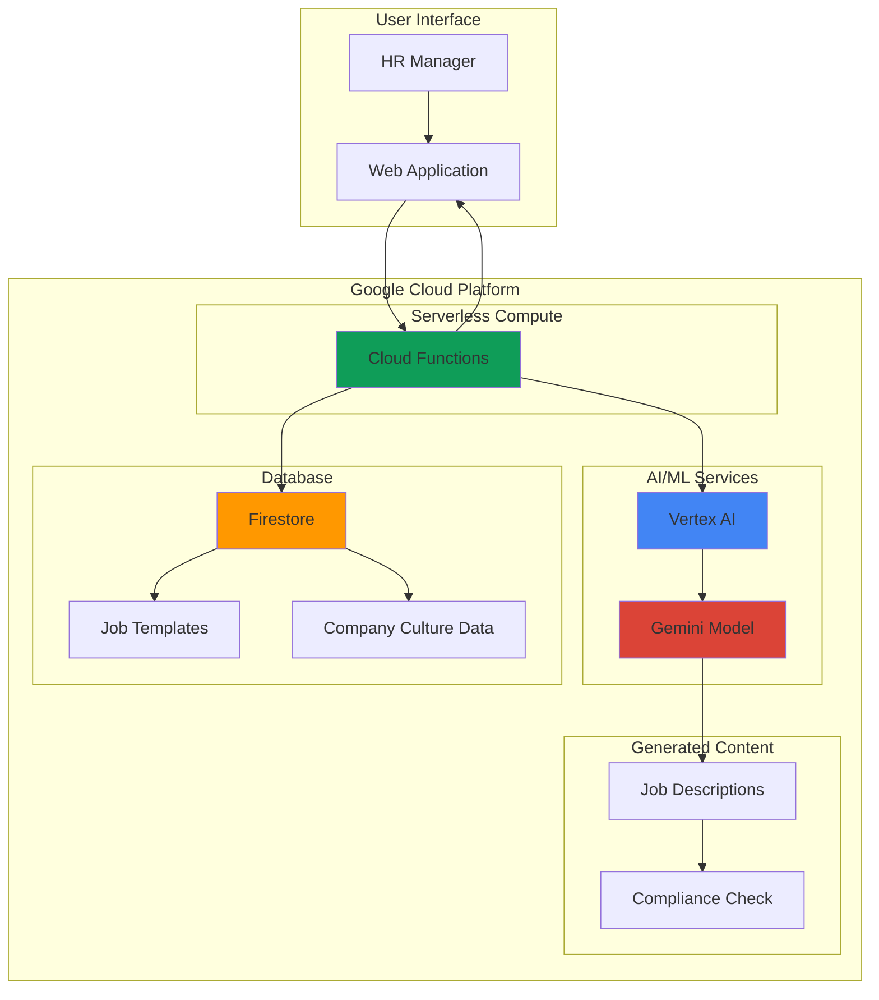

# Automated Job Description Generation with Gemini and Firestore

## Problem

Human Resources departments spend countless hours manually crafting job descriptions, often resulting in inconsistent language, missing compliance requirements, and lengthy approval processes. Traditional job posting creation involves multiple stakeholders, extensive reviews, and frequent revisions, creating bottlenecks that slow critical hiring initiatives. Organizations struggle to maintain brand consistency across job postings while ensuring legal compliance and competitive positioning in talent markets.

## Solution

Build an intelligent HR automation system using Google Cloud's Vertex AI Gemini models to generate comprehensive, compliant job descriptions automatically. The solution leverages Firestore for storing company culture data and role templates, while Cloud Functions orchestrates the generation workflow. Gemini's advanced language capabilities analyze role requirements and organizational context to create personalized, legally compliant job postings that maintain brand consistency and attract qualified candidates.

## Architecture Diagram



## Prerequisites

1. Google Cloud account with billing enabled and Vertex AI API access
2. Google Cloud CLI installed and configured (or Cloud Shell access)
3. Basic understanding of serverless functions and NoSQL databases
4. Familiarity with Python programming and AI prompt engineering
5. Estimated cost: $10-15 for testing (Vertex AI usage, Firestore operations, Cloud Functions invocations)

> **Note**: This recipe uses Vertex AI Gemini models which require billing to be enabled. Monitor usage through Cloud Billing console to control costs.

## Preparation

```bash
# Set environment variables for GCP resources
export PROJECT_ID="hr-automation-$(date +%s)"
export REGION="us-central1"
export ZONE="us-central1-a"

# Generate unique suffix for resource names
RANDOM_SUFFIX=$(openssl rand -hex 3)

# Set default project and region
gcloud config set project ${PROJECT_ID}
gcloud config set compute/region ${REGION}
gcloud config set compute/zone ${ZONE}

# Enable required APIs
gcloud services enable aiplatform.googleapis.com
gcloud services enable firestore.googleapis.com
gcloud services enable cloudfunctions.googleapis.com
gcloud services enable cloudbuild.googleapis.com

# Create project and initialize Firestore in Native mode
gcloud firestore databases create --region=${REGION}

echo "✅ Project configured: ${PROJECT_ID}"
echo "✅ Firestore database initialized in ${REGION}"
```

## Steps

1. **Create Firestore Collections for HR Data**:

   Firestore provides the scalable NoSQL foundation for storing company culture data, job role templates, and organizational standards. This structured approach enables the AI system to access consistent, up-to-date information for generating contextually appropriate job descriptions.

   ```bash
   # Create sample company culture document using Python client
   cat > setup_firestore.py << 'EOF'
   from google.cloud import firestore
   import os
   
   # Initialize Firestore client
   project_id = os.environ.get('PROJECT_ID')
   db = firestore.Client(project=project_id)
   
   # Create company culture document
   culture_data = {
       "company_name": "TechInnovate Solutions",
       "mission": "Empowering businesses through innovative technology solutions",
       "values": ["Innovation", "Collaboration", "Integrity", "Excellence"],
       "culture_description": "Fast-paced, collaborative environment with focus on continuous learning and growth",
       "benefits": ["Competitive salary", "Health insurance", "Remote work options", "Professional development budget"],
       "work_environment": "Hybrid office model with flexible hours"
   }
   
   db.collection('company_culture').document('default').set(culture_data)
   print("✅ Company culture data stored in Firestore")
   EOF
   
   # Run the setup script
   python3 setup_firestore.py
   ```

   The company culture collection now contains essential organizational context that Gemini will use to personalize job descriptions. This data-driven approach ensures consistency across all generated content while maintaining the company's unique voice and brand identity.

2. **Create Job Role Templates Collection**:

   Job role templates provide structured frameworks that guide Gemini's content generation process. These templates include industry-standard requirements, skill hierarchies, and compliance guidelines that ensure generated job descriptions meet professional standards and legal requirements.

   ```bash
   # Create job templates using Python client
   cat > create_templates.py << 'EOF'
   from google.cloud import firestore
   import os
   
   # Initialize Firestore client
   project_id = os.environ.get('PROJECT_ID')
   db = firestore.Client(project=project_id)
   
   # Create software engineer template
   software_engineer_template = {
       "title": "Software Engineer",
       "department": "Engineering",
       "level": "mid",
       "required_skills": ["JavaScript", "Python", "React", "Node.js"],
       "nice_to_have": ["Google Cloud", "Docker", "GraphQL"],
       "education": "Bachelor degree in Computer Science or equivalent experience",
       "experience_years": "2-4 years",
       "responsibilities": [
           "Develop and maintain web applications",
           "Collaborate with cross-functional teams",
           "Write clean, maintainable code",
           "Participate in code reviews"
       ],
       "compliance_notes": "Equal opportunity employer statement required"
   }
   
   # Create marketing manager template
   marketing_manager_template = {
       "title": "Marketing Manager",
       "department": "Marketing",
       "level": "senior",
       "required_skills": ["Digital Marketing", "Campaign Management", "Analytics", "Content Strategy"],
       "nice_to_have": ["Adobe Creative Suite", "Marketing Automation", "SQL"],
       "education": "Bachelor degree in Marketing, Business, or related field",
       "experience_years": "5-7 years",
       "responsibilities": [
           "Develop marketing strategies and campaigns",
           "Manage marketing budget and ROI",
           "Lead marketing team and initiatives",
           "Analyze market trends and competitor activities"
       ],
       "compliance_notes": "Equal opportunity employer statement required"
   }
   
   # Store templates in Firestore
   db.collection('job_templates').document('software_engineer').set(software_engineer_template)
   db.collection('job_templates').document('marketing_manager').set(marketing_manager_template)
   
   print("✅ Job role templates created successfully")
   EOF
   
   # Run the template creation script
   python3 create_templates.py
   ```

   The job templates collection provides structured data that ensures generated descriptions include all necessary components while maintaining role-specific accuracy. This template-driven approach accelerates the generation process and improves content quality consistency.

3. **Create Cloud Function for Job Description Generation**:

   Cloud Functions provides the serverless orchestration layer that coordinates between Firestore data retrieval and Vertex AI content generation. This event-driven architecture ensures cost-effective processing with automatic scaling based on demand.

   ```bash
   # Create function directory and files
   mkdir job-description-generator
   cd job-description-generator
   
   # Create requirements.txt for Python dependencies
   cat > requirements.txt << 'EOF'
   google-cloud-firestore>=2.14.0
   google-cloud-aiplatform>=1.42.0
   functions-framework>=3.5.0
   flask>=3.0.0
   EOF
   
   echo "✅ Function dependencies configured"
   ```

   The requirements file specifies the essential libraries for integrating with Google Cloud services, ensuring compatibility and optimal performance for the serverless function environment.

4. **Implement Job Description Generation Logic**:

   The core function logic combines Firestore data retrieval with Vertex AI Gemini model invocation to create intelligent, context-aware job descriptions. This implementation demonstrates advanced prompt engineering techniques for consistent, high-quality content generation.

   ```bash
   # Create main function file
   cat > main.py << 'EOF'
   import json
   import vertexai
   from vertexai.generative_models import GenerativeModel
   from google.cloud import firestore
   from flask import Flask, request, jsonify
   import functions_framework
   import os
   
   # Initialize Vertex AI
   PROJECT_ID = os.environ.get('GCP_PROJECT', 'your-project-id')
   REGION = os.environ.get('FUNCTION_REGION', 'us-central1')
   vertexai.init(project=PROJECT_ID, location=REGION)
   
   # Initialize Firestore client
   db = firestore.Client()
   
   def generate_job_description(role_id, custom_requirements=None):
       """Generate job description using Gemini AI model."""
       try:
           # Retrieve company culture data
           culture_ref = db.collection('company_culture').document('default')
           culture_doc = culture_ref.get()
           
           if not culture_doc.exists:
               return {"error": "Company culture data not found"}
           
           culture_data = culture_doc.to_dict()
           
           # Retrieve job template
           template_ref = db.collection('job_templates').document(role_id)
           template_doc = template_ref.get()
           
           if not template_doc.exists:
               return {"error": f"Job template '{role_id}' not found"}
           
           template_data = template_doc.to_dict()
           
           # Initialize Gemini model
           model = GenerativeModel("gemini-1.5-flash")
           
           # Construct comprehensive prompt
           prompt = f"""
           Create a comprehensive, professional job description for {template_data['title']} at {culture_data['company_name']}.
           
           Company Information:
           - Mission: {culture_data['mission']}
           - Values: {', '.join(culture_data['values'])}
           - Culture: {culture_data['culture_description']}
           - Work Environment: {culture_data['work_environment']}
           
           Role Details:
           - Department: {template_data['department']}
           - Level: {template_data['level']}
           - Experience Required: {template_data['experience_years']}
           - Education: {template_data['education']}
           - Required Skills: {', '.join(template_data['required_skills'])}
           - Nice to Have: {', '.join(template_data['nice_to_have'])}
           - Key Responsibilities: {'; '.join(template_data['responsibilities'])}
           
           Benefits to Include:
           {'; '.join(culture_data['benefits'])}
           
           Custom Requirements: {custom_requirements or 'None specified'}
           
           Please generate a complete job description that includes:
           1. Engaging job title and company overview
           2. Role summary and key responsibilities
           3. Required qualifications and preferred skills
           4. Benefits and compensation philosophy
           5. Equal opportunity employer statement
           6. Application instructions
           
           Use professional, inclusive language that attracts diverse candidates while clearly communicating expectations.
           """
           
           # Generate content with Gemini
           response = model.generate_content(prompt)
           
           # Store generated job description
           job_doc = {
               'role_id': role_id,
               'title': template_data['title'],
               'generated_description': response.text,
               'custom_requirements': custom_requirements,
               'created_at': firestore.SERVER_TIMESTAMP,
               'company_name': culture_data['company_name']
           }
           
           # Save to Firestore
           job_ref = db.collection('generated_jobs').add(job_doc)
           
           return {
               'success': True,
               'job_id': job_ref[1].id,
               'description': response.text,
               'role': template_data['title']
           }
           
       except Exception as e:
           return {'error': str(e)}
   
   @functions_framework.http
   def generate_job_description_http(request):
       """HTTP Cloud Function entry point."""
       if request.method == 'OPTIONS':
           headers = {
               'Access-Control-Allow-Origin': '*',
               'Access-Control-Allow-Methods': 'POST',
               'Access-Control-Allow-Headers': 'Content-Type',
               'Access-Control-Max-Age': '3600'
           }
           return ('', 204, headers)
       
       headers = {'Access-Control-Allow-Origin': '*'}
       
       try:
           request_json = request.get_json(silent=True)
           if not request_json or 'role_id' not in request_json:
               return jsonify({'error': 'Missing role_id parameter'}), 400, headers
           
           role_id = request_json['role_id']
           custom_requirements = request_json.get('custom_requirements')
           
           result = generate_job_description(role_id, custom_requirements)
           
           if 'error' in result:
               return jsonify(result), 400, headers
           
           return jsonify(result), 200, headers
           
       except Exception as e:
           return jsonify({'error': str(e)}), 500, headers
   EOF
   
   echo "✅ Job description generation logic implemented"
   ```

   The function implements sophisticated AI prompt engineering that combines organizational context with role-specific requirements to generate high-quality, personalized job descriptions. The integration with Firestore ensures generated content is stored for review and approval workflows.

5. **Deploy Cloud Function with Vertex AI Integration**:

   Deploying the Cloud Function establishes the serverless endpoint that orchestrates the entire job description generation workflow. The function configuration ensures optimal performance and security for production HR automation use cases.

   ```bash
   # Deploy Cloud Function with appropriate memory and timeout
   gcloud functions deploy generate-job-description \
       --gen2 \
       --runtime python311 \
       --trigger-http \
       --allow-unauthenticated \
       --source . \
       --entry-point generate_job_description_http \
       --memory 512MB \
       --timeout 300s \
       --set-env-vars GCP_PROJECT=${PROJECT_ID},FUNCTION_REGION=${REGION}
   
   # Get function URL
   FUNCTION_URL=$(gcloud functions describe generate-job-description \
       --gen2 \
       --region=${REGION} \
       --format="value(serviceConfig.uri)")
   
   echo "✅ Cloud Function deployed successfully"
   echo "Function URL: ${FUNCTION_URL}"
   ```

   The deployed function now provides a scalable, secure endpoint for generating job descriptions on demand. The configuration supports high-concurrency workloads while maintaining cost efficiency through serverless pricing models.

6. **Create Compliance Validation Function**:

   A dedicated compliance validation function ensures all generated job descriptions meet legal requirements and organizational standards. This additional layer of AI-powered review helps maintain quality and reduces legal risks in hiring processes.

   ```bash
   # Create compliance validation function
   cat > compliance_validator.py << 'EOF'
   import functions_framework
   from vertexai.generative_models import GenerativeModel
   from google.cloud import firestore
   from flask import jsonify
   import vertexai
   import os
   
   # Initialize services
   PROJECT_ID = os.environ.get('GCP_PROJECT')
   REGION = os.environ.get('FUNCTION_REGION', 'us-central1')
   vertexai.init(project=PROJECT_ID, location=REGION)
   db = firestore.Client()
   
   @functions_framework.http
   def validate_compliance(request):
       """Validate job description for compliance issues."""
       headers = {'Access-Control-Allow-Origin': '*'}
       
       try:
           request_json = request.get_json(silent=True)
           if not request_json or 'job_description' not in request_json:
               return jsonify({'error': 'Missing job_description'}), 400, headers
           
           job_description = request_json['job_description']
           
           model = GenerativeModel("gemini-1.5-flash")
           
           compliance_prompt = f"""
           Review this job description for compliance with employment law and best practices:
           
           {job_description}
           
           Check for:
           1. Discriminatory language or requirements
           2. Age, gender, or other protected class bias
           3. Missing equal opportunity statement
           4. Unreasonable or illegal requirements
           5. Accessibility and inclusive language
           
           Provide a compliance score (1-10) and specific recommendations for improvement.
           Format response as JSON with 'score', 'issues', and 'recommendations' fields.
           """
           
           response = model.generate_content(compliance_prompt)
           
           return jsonify({
               'success': True,
               'compliance_review': response.text
           }), 200, headers
           
       except Exception as e:
           return jsonify({'error': str(e)}), 500, headers
   EOF
   
   # Deploy compliance validation function
   gcloud functions deploy validate-compliance \
       --gen2 \
       --runtime python311 \
       --trigger-http \
       --allow-unauthenticated \
       --source . \
       --entry-point validate_compliance \
       --memory 256MB \
       --timeout 60s \
       --set-env-vars GCP_PROJECT=${PROJECT_ID},FUNCTION_REGION=${REGION}
   
   echo "✅ Compliance validation function deployed"
   ```

   The compliance validation function provides an additional layer of AI-powered review to ensure generated job descriptions meet legal and ethical standards, reducing risk and improving hiring process quality.

## Validation & Testing

1. **Test Job Description Generation**:

   ```bash
   # Test software engineer job description generation
   curl -X POST ${FUNCTION_URL} \
       -H "Content-Type: application/json" \
       -d '{
         "role_id": "software_engineer",
         "custom_requirements": "Experience with microservices architecture"
       }' | jq '.'
   ```

   Expected output: JSON response with generated job description including role details, company information, and custom requirements integration.

2. **Test Marketing Manager Generation**:

   ```bash
   # Test marketing manager job description
   curl -X POST ${FUNCTION_URL} \
       -H "Content-Type: application/json" \
       -d '{
         "role_id": "marketing_manager",
         "custom_requirements": "B2B SaaS experience preferred"
       }' | jq '.'
   ```

3. **Verify Firestore Data Storage**:

   ```bash
   # Check generated jobs collection
   python3 -c "
   from google.cloud import firestore
   import os
   
   db = firestore.Client(project=os.environ.get('PROJECT_ID'))
   docs = db.collection('generated_jobs').stream()
   
   print('Generated Jobs:')
   for doc in docs:
       print(f'ID: {doc.id}, Title: {doc.to_dict().get(\"title\", \"N/A\")}')
   "
   ```

4. **Test Compliance Validation**:

   ```bash
   # Get compliance validation function URL
   COMPLIANCE_URL=$(gcloud functions describe validate-compliance \
       --gen2 \
       --region=${REGION} \
       --format="value(serviceConfig.uri)")
   
   # Test compliance validation
   curl -X POST ${COMPLIANCE_URL} \
       -H "Content-Type: application/json" \
       -d '{
         "job_description": "Software Engineer position requiring 10+ years experience and must be under 35 years old"
       }' | jq '.'
   ```

## Cleanup

1. **Remove Cloud Functions**:

   ```bash
   # Delete Cloud Functions
   gcloud functions delete generate-job-description \
       --gen2 \
       --region=${REGION} \
       --quiet
   
   gcloud functions delete validate-compliance \
       --gen2 \
       --region=${REGION} \
       --quiet
   
   echo "✅ Cloud Functions deleted"
   ```

2. **Clear Firestore Collections**:

   ```bash
   # Clear Firestore data using Python script
   cat > cleanup_firestore.py << 'EOF'
   from google.cloud import firestore
   import os
   
   # Initialize Firestore client
   project_id = os.environ.get('PROJECT_ID')
   db = firestore.Client(project=project_id)
   
   # Delete collections
   collections = ['company_culture', 'job_templates', 'generated_jobs']
   
   for collection_name in collections:
       collection_ref = db.collection(collection_name)
       docs = collection_ref.stream()
       
       for doc in docs:
           doc.reference.delete()
           print(f"Deleted document: {doc.id} from {collection_name}")
   
   print("✅ Firestore data cleared")
   EOF
   
   python3 cleanup_firestore.py
   ```

3. **Remove Project Resources**:

   ```bash
   # Delete the entire project (if created specifically for this recipe)
   gcloud projects delete ${PROJECT_ID} --quiet
   
   echo "✅ Project and all resources deleted"
   echo "Note: Project deletion may take several minutes to complete"
   ```

## Discussion

This recipe demonstrates the power of combining Google Cloud's AI and serverless technologies to automate complex content generation workflows. The integration of Vertex AI's Gemini models with Firestore provides a scalable foundation for intelligent HR automation that can significantly reduce time-to-hire while improving job description quality and consistency.

The architecture leverages several key Google Cloud best practices including serverless-first design, managed AI services, and NoSQL document storage. Vertex AI's Gemini models provide advanced language understanding capabilities that enable context-aware content generation, while Firestore's real-time synchronization supports collaborative HR workflows. Cloud Functions orchestrate the entire process with automatic scaling and cost-effective pay-per-use pricing.

The compliance validation component addresses critical HR concerns by using AI to review generated content for potential legal issues and bias. This dual-AI approach ensures both creativity and compliance, reducing legal risks while maintaining engaging, inclusive job descriptions. The system's template-driven approach allows organizations to maintain consistency across different roles while adapting to specific requirements and company culture.

The solution scales naturally with organizational growth, supporting everything from startup hiring bursts to enterprise-level recruitment campaigns. Integration possibilities include ATS systems, HRIS platforms, and recruitment marketing tools through the HTTP API endpoints. Organizations can extend the system with additional validation rules, multilingual support, and industry-specific compliance requirements as needed.

> **Tip**: Monitor Vertex AI usage costs through Cloud Billing and implement request caching for frequently generated job descriptions to optimize expenses while maintaining performance.

**Documentation References:**
- [Vertex AI Generative AI Documentation](https://cloud.google.com/vertex-ai/generative-ai/docs)
- [Firestore NoSQL Database Guide](https://cloud.google.com/firestore/docs)
- [Cloud Functions Serverless Computing](https://cloud.google.com/functions/docs)
- [Google Cloud AI Best Practices](https://cloud.google.com/architecture/ai-ml)
- [Cloud Security and Compliance Framework](https://cloud.google.com/security/compliance)

## Challenge

Extend this solution by implementing these enhancements:

1. **Multi-language Support**: Add internationalization capabilities using Cloud Translation API to generate job descriptions in multiple languages for global organizations.

2. **Salary Range Optimization**: Integrate with BigQuery and external compensation data APIs to automatically suggest competitive salary ranges based on role, location, and market conditions.

3. **ATS Integration**: Build connectors for popular Applicant Tracking Systems (Greenhouse, Lever, Workday) to automatically publish generated job descriptions and track application metrics.

4. **A/B Testing Framework**: Implement Pub/Sub-based analytics to track job posting performance and use ML to optimize description elements for better candidate attraction and quality.

5. **Advanced Bias Detection**: Develop custom ML models using AutoML Text to detect subtle bias patterns specific to your industry and organizational context, going beyond general compliance checking.

## Infrastructure Code

*Infrastructure code will be generated after recipe approval.*