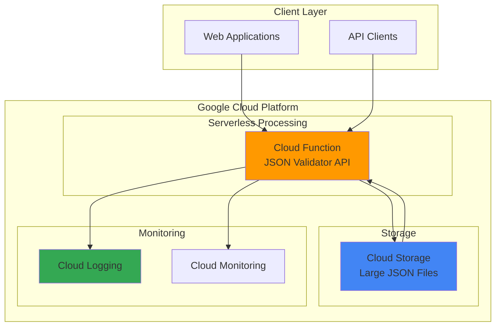

# JSON Validator API with Cloud Functions

## Problem

Modern web applications frequently receive JSON data from various sources that need validation and formatting before processing. Developers struggle with implementing robust JSON validation that handles syntax errors gracefully, formats JSON with proper indentation for debugging, and scales automatically with varying request volumes. Traditional server-based solutions require infrastructure management and don't scale efficiently for intermittent validation workloads.

## Solution

Deploy a serverless JSON validation and formatting API using Google Cloud Functions that automatically validates JSON syntax, formats JSON with proper indentation, and integrates with Cloud Storage for handling large JSON files. This solution provides instant scaling, pay-per-request pricing, and zero infrastructure management while offering both HTTP endpoints and storage-triggered processing capabilities.

## Architecture Diagram



## Prerequisites

1. Google Cloud Platform account with billing enabled and appropriate permissions for Cloud Functions and Cloud Storage
2. Google Cloud CLI (`gcloud`) installed and configured, or access to Cloud Shell
3. Basic knowledge of Python programming and HTTP APIs
4. Understanding of JSON syntax and structure
5. Estimated cost: $0.05-$0.20 for testing (within free tier limits for new accounts)

> **Note**: Google Cloud Functions provides 2 million invocations per month in the free tier, making this recipe cost-effective for development and testing.

## Preparation

```bash
# Set environment variables for GCP resources
export PROJECT_ID="json-validator-$(date +%s)"
export REGION="us-central1"
export ZONE="us-central1-a"

# Generate unique suffix for resource names
RANDOM_SUFFIX=$(openssl rand -hex 3)
export FUNCTION_NAME="json-validator-${RANDOM_SUFFIX}"
export BUCKET_NAME="json-files-${PROJECT_ID}-${RANDOM_SUFFIX}"

# Create and configure the project
gcloud projects create ${PROJECT_ID} \
    --name="JSON Validator API"
gcloud config set project ${PROJECT_ID}
gcloud config set compute/region ${REGION}
gcloud config set compute/zone ${ZONE}

# Enable required APIs
gcloud services enable cloudfunctions.googleapis.com
gcloud services enable cloudbuild.googleapis.com
gcloud services enable storage.googleapis.com

echo "✅ Project configured: ${PROJECT_ID}"
echo "✅ Function name: ${FUNCTION_NAME}"
echo "✅ Storage bucket: ${BUCKET_NAME}"
```

## Steps

1. **Create Cloud Storage Bucket for Large JSON Files**:

   Cloud Storage provides unlimited scalability for handling large JSON files that exceed Cloud Functions' request size limits. The bucket serves as both input storage for batch processing and temporary storage for large validation results, enabling the serverless architecture to handle files of any size while maintaining the simplicity of the API interface.

   ```bash
   # Create the storage bucket with versioning enabled
   gsutil mb -p ${PROJECT_ID} \
       -c STANDARD \
       -l ${REGION} \
       gs://${BUCKET_NAME}

   # Enable versioning for data protection
   gsutil versioning set on gs://${BUCKET_NAME}

   # Set bucket permissions for function access
   gsutil iam ch allUsers:objectViewer gs://${BUCKET_NAME}

   echo "✅ Cloud Storage bucket created: gs://${BUCKET_NAME}"
   ```

   The storage bucket now provides scalable file handling with versioning protection, enabling the JSON validator to process files beyond the standard HTTP request limits while maintaining data integrity and access control.

2. **Create the Function Directory and Dependencies**:

   Setting up the proper project structure with dependencies ensures the Cloud Function has access to all required libraries for JSON processing and Cloud Storage integration. The requirements.txt file specifies the exact versions needed for reliable JSON validation and Google Cloud SDK integration.

   ```bash
   # Create function directory structure
   mkdir -p json-validator-function
   cd json-validator-function

   # Create requirements.txt with necessary dependencies
   cat > requirements.txt << 'EOF'
   functions-framework==3.8.1
   google-cloud-storage==2.18.0
   google-cloud-logging==3.11.2
   EOF

   echo "✅ Function directory and dependencies configured"
   ```

   The function environment is now prepared with the Flask-based Functions Framework for HTTP handling, Cloud Storage client library for file operations, and Cloud Logging for comprehensive monitoring and debugging capabilities.

3. **Implement the JSON Validator Function Code**:

   The core validation logic implements comprehensive JSON processing with error handling, formatting capabilities, and Cloud Storage integration. This Python implementation uses the standard JSON library for parsing, custom error handling for meaningful responses, and the Google Cloud Storage client for seamless file operations.

   ```bash
   # Create the main function file
   cat > main.py << 'EOF'
import json
import logging
from flask import Request, jsonify
from google.cloud import storage
from google.cloud import logging as cloud_logging
import functions_framework
import traceback
from typing import Dict, Any, Union

# Configure logging
cloud_logging.Client().setup_logging()
logging.basicConfig(level=logging.INFO)
logger = logging.getLogger(__name__)

# Initialize Cloud Storage client
storage_client = storage.Client()

def validate_json_content(content: str) -> Dict[str, Any]:
    """
    Validate and format JSON content.
    
    Args:
        content: String containing JSON data
        
    Returns:
        Dictionary with validation results
    """
    try:
        # Parse JSON to validate syntax
        parsed_json = json.loads(content)
        
        # Format with proper indentation
        formatted_json = json.dumps(parsed_json, indent=2, sort_keys=True)
        
        # Calculate basic statistics
        stats = {
            'size_bytes': len(content),
            'formatted_size_bytes': len(formatted_json),
            'keys_count': len(parsed_json) if isinstance(parsed_json, dict) else 0,
            'type': type(parsed_json).__name__
        }
        
        return {
            'valid': True,
            'formatted_json': formatted_json,
            'original_json': parsed_json,
            'statistics': stats,
            'message': 'JSON is valid and properly formatted'
        }
        
    except json.JSONDecodeError as e:
        return {
            'valid': False,
            'error': str(e),
            'error_type': 'JSONDecodeError',
            'line': getattr(e, 'lineno', None),
            'column': getattr(e, 'colno', None),
            'message': f'Invalid JSON syntax: {str(e)}'
        }
    except Exception as e:
        logger.error(f"Unexpected error during JSON validation: {str(e)}")
        return {
            'valid': False,
            'error': str(e),
            'error_type': type(e).__name__,
            'message': 'Unexpected error occurred during validation'
        }

def process_storage_file(bucket_name: str, file_name: str) -> Dict[str, Any]:
    """
    Process JSON file from Cloud Storage.
    
    Args:
        bucket_name: Name of the storage bucket
        file_name: Name of the file to process
        
    Returns:
        Dictionary with validation results
    """
    try:
        bucket = storage_client.bucket(bucket_name)
        blob = bucket.blob(file_name)
        
        if not blob.exists():
            return {
                'valid': False,
                'error': f'File {file_name} not found in bucket {bucket_name}',
                'message': 'File not found in storage'
            }
        
        # Download and validate the file content
        content = blob.download_as_text()
        result = validate_json_content(content)
        
        # Add storage metadata
        result['storage_info'] = {
            'bucket': bucket_name,
            'file': file_name,
            'size': blob.size,
            'content_type': blob.content_type,
            'updated': blob.updated.isoformat() if blob.updated else None
        }
        
        return result
        
    except Exception as e:
        logger.error(f"Error processing storage file: {str(e)}")
        return {
            'valid': False,
            'error': str(e),
            'message': 'Error accessing or processing storage file'
        }

@functions_framework.http
def json_validator_api(request: Request) -> Union[str, tuple]:
    """
    HTTP Cloud Function for JSON validation and formatting.
    
    Accepts JSON data via POST request body or processes files from Cloud Storage
    via query parameters.
    """
    try:
        # Set CORS headers for web applications
        headers = {
            'Access-Control-Allow-Origin': '*',
            'Access-Control-Allow-Methods': 'GET, POST, OPTIONS',
            'Access-Control-Allow-Headers': 'Content-Type',
            'Content-Type': 'application/json'
        }
        
        # Handle preflight OPTIONS request
        if request.method == 'OPTIONS':
            return ('', 200, headers)
        
        # Handle GET request for health check
        if request.method == 'GET':
            return jsonify({
                'status': 'healthy',
                'service': 'JSON Validator API',
                'version': '1.0',
                'endpoints': {
                    'POST /': 'Validate JSON in request body',
                    'GET /?bucket=BUCKET&file=FILE': 'Validate JSON file from storage'
                }
            }), 200, headers
        
        # Handle storage file processing
        bucket_name = request.args.get('bucket')
        file_name = request.args.get('file')
        
        if bucket_name and file_name:
            logger.info(f"Processing file {file_name} from bucket {bucket_name}")
            result = process_storage_file(bucket_name, file_name)
            return jsonify(result), 200, headers
        
        # Handle POST request with JSON in body
        if request.method == 'POST':
            if not request.data:
                return jsonify({
                    'valid': False,
                    'error': 'No data provided',
                    'message': 'Please provide JSON data in the request body'
                }), 400, headers
            
            # Get content as string for validation
            content = request.get_data(as_text=True)
            logger.info(f"Validating JSON content, size: {len(content)} bytes")
            
            result = validate_json_content(content)
            
            # Return appropriate HTTP status code
            status_code = 200 if result['valid'] else 400
            return jsonify(result), status_code, headers
        
        # Method not allowed
        return jsonify({
            'valid': False,
            'error': 'Method not allowed',
            'message': 'Only GET and POST methods are supported'
        }), 405, headers
        
    except Exception as e:
        logger.error(f"Unexpected error in function: {str(e)}")
        logger.error(traceback.format_exc())
        
        return jsonify({
            'valid': False,
            'error': str(e),
            'message': 'Internal server error occurred'
        }), 500, {'Content-Type': 'application/json'}

EOF

   echo "✅ JSON validator function code created"
   ```

   The function now provides comprehensive JSON validation with multiple input methods, detailed error reporting, formatting capabilities, and seamless Cloud Storage integration. The implementation includes proper logging, CORS support for web applications, and robust error handling for production use.

4. **Deploy the Cloud Function**:

   Deploying the function to Google Cloud Functions creates a fully managed, auto-scaling serverless endpoint that handles all infrastructure concerns. The deployment configures memory allocation, timeout settings, and trigger mechanisms while enabling automatic HTTPS endpoint creation and integrated monitoring through Google Cloud's observability stack.

   ```bash
   # Deploy the function with optimized settings
   gcloud functions deploy ${FUNCTION_NAME} \
       --runtime python311 \
       --trigger-http \
       --allow-unauthenticated \
       --source . \
       --entry-point json_validator_api \
       --memory 256MB \
       --timeout 60s \
       --max-instances 10 \
       --region ${REGION}

   # Get the function URL
   FUNCTION_URL=$(gcloud functions describe ${FUNCTION_NAME} \
       --region=${REGION} \
       --format="value(httpsTrigger.url)")

   echo "✅ Function deployed successfully"
   echo "📡 Function URL: ${FUNCTION_URL}"
   ```

   The Cloud Function is now live with automatic scaling, integrated security, and monitoring. The serverless deployment provides instant availability worldwide through Google's global infrastructure while maintaining cost efficiency through pay-per-invocation pricing.

5. **Create Sample JSON Files for Testing**:

   Creating comprehensive test cases ensures the JSON validator handles various scenarios including valid JSON, syntax errors, and different data structures. These test files demonstrate the API's capabilities and provide a foundation for automated testing and validation workflows.

   ```bash
   # Create sample valid JSON file
   cat > sample-valid.json << 'EOF'
{
  "users": [
    {
      "id": 1,
      "name": "John Doe",
      "email": "john@example.com",
      "active": true,
      "roles": ["admin", "user"]
    },
    {
      "id": 2,
      "name": "Jane Smith",
      "email": "jane@example.com",
      "active": false,
      "roles": ["user"]
    }
  ],
  "metadata": {
    "total": 2,
    "created": "2025-01-15T10:00:00Z"
  }
}
EOF

   # Create sample invalid JSON file
   cat > sample-invalid.json << 'EOF'
{
  "users": [
    {
      "id": 1,
      "name": "John Doe",
      "email": "john@example.com",
      "active": true,
      "roles": ["admin", "user"]
    },
    {
      "id": 2,
      "name": "Jane Smith",
      "email": "jane@example.com",
      "active": false,
      "roles": ["user"]
    }
  ],
  "metadata": {
    "total": 2,
    "created": "2025-01-15T10:00:00Z"
  }
  // Missing closing brace and invalid comment
EOF

   # Upload test files to Cloud Storage
   gsutil cp sample-valid.json gs://${BUCKET_NAME}/
   gsutil cp sample-invalid.json gs://${BUCKET_NAME}/

   echo "✅ Test files created and uploaded to storage"
   ```

   The test files provide comprehensive validation scenarios including properly formatted JSON, syntax errors, and various data types. These samples enable thorough testing of both HTTP endpoint validation and Cloud Storage file processing capabilities.

## Validation & Testing

1. **Test the function health check endpoint**:

   ```bash
   # Test the health check endpoint
   curl -X GET "${FUNCTION_URL}" | jq '.'
   ```

   Expected output: JSON response with service status, version information, and available endpoints documentation.

2. **Validate JSON via HTTP POST request**:

   ```bash
   # Test valid JSON validation
   curl -X POST "${FUNCTION_URL}" \
        -H "Content-Type: application/json" \
        -d '{"name": "test", "value": 123}' | jq '.'

   # Test invalid JSON validation
   curl -X POST "${FUNCTION_URL}" \
        -H "Content-Type: application/json" \
        -d '{"name": "test", "value": 123' | jq '.'
   ```

   Expected output: Valid JSON returns formatted output with statistics; invalid JSON returns error details with line/column information.

3. **Test Cloud Storage file processing**:

   ```bash
   # Test valid JSON file from storage
   curl -X GET "${FUNCTION_URL}?bucket=${BUCKET_NAME}&file=sample-valid.json" | jq '.'

   # Test invalid JSON file from storage
   curl -X GET "${FUNCTION_URL}?bucket=${BUCKET_NAME}&file=sample-invalid.json" | jq '.'
   ```

   Expected output: Storage files return validation results with additional metadata including file size, content type, and last updated timestamp.

4. **Verify function logs and metrics**:

   ```bash
   # View function logs
   gcloud functions logs read ${FUNCTION_NAME} \
       --region=${REGION} \
       --limit=10

   # Check function metrics
   gcloud functions describe ${FUNCTION_NAME} \
       --region=${REGION} \
       --format="table(status,updateTime)"
   ```

   Expected output: Logs show request processing details; metrics confirm function deployment status and recent activity.

## Cleanup

1. **Delete the Cloud Function**:

   ```bash
   # Delete the deployed function
   gcloud functions delete ${FUNCTION_NAME} \
       --region=${REGION} \
       --quiet

   echo "✅ Cloud Function deleted"
   ```

2. **Remove Cloud Storage bucket and contents**:

   ```bash
   # Remove all objects from bucket
   gsutil -m rm -r gs://${BUCKET_NAME}

   echo "✅ Storage bucket and contents removed"
   ```

3. **Delete the entire project (optional)**:

   ```bash
   # Delete the project to remove all resources
   gcloud projects delete ${PROJECT_ID} --quiet

   echo "✅ Project deleted (may take several minutes)"
   echo "Note: Billing for deleted resources stops immediately"
   ```

## Discussion

This serverless JSON validation API demonstrates the power of Google Cloud Functions for creating scalable, cost-effective APIs that require zero infrastructure management. The solution leverages Cloud Functions' automatic scaling capabilities to handle varying request volumes while integrating seamlessly with Cloud Storage for processing large files that exceed typical HTTP request limits.

The architecture follows serverless best practices by implementing stateless processing, comprehensive error handling, and proper logging integration. The function uses Python's built-in JSON library for reliable parsing combined with Google Cloud client libraries for storage operations, ensuring both performance and reliability. The implementation includes CORS headers for web application integration and multiple input methods (HTTP POST and Cloud Storage) to accommodate different use cases.

From a cost optimization perspective, this solution benefits from Google Cloud Functions' pay-per-invocation model, where costs scale directly with usage. The function's 256MB memory allocation and 60-second timeout provide sufficient resources for most JSON processing tasks while maintaining cost efficiency. The integration with Cloud Storage enables handling of large files without increasing function memory requirements, as files are streamed and processed incrementally.

Security considerations include the allow-unauthenticated deployment for public API access, which is appropriate for a validation service but can be modified to require authentication for production use. The function implements input validation and error handling to prevent security vulnerabilities, while Cloud Storage integration respects IAM permissions for file access control. For production deployments, consider implementing API keys, rate limiting, and request size validation through Google Cloud API Gateway or similar services as outlined in the [Google Cloud security best practices documentation](https://cloud.google.com/security/best-practices).

> **Tip**: Use Cloud Monitoring to set up alerts for function errors, execution duration, and invocation counts to maintain optimal performance and catch issues early.

The solution can be extended with additional features such as JSON schema validation, data transformation capabilities, or integration with other Google Cloud services like Pub/Sub for asynchronous processing workflows. The serverless architecture makes it easy to add new endpoints or modify existing functionality without infrastructure changes, following the principles outlined in the [Google Cloud Architecture Framework](https://cloud.google.com/architecture/framework).

**Documentation Sources:**
- [Google Cloud Functions Documentation](https://cloud.google.com/functions/docs)
- [Cloud Storage Client Libraries](https://cloud.google.com/storage/docs/reference/libraries)
- [Functions Framework for Python](https://cloud.google.com/functions/docs/functions-framework)
- [Cloud Logging Best Practices](https://cloud.google.com/logging/docs/best-practices)
- [Google Cloud Security Best Practices](https://cloud.google.com/security/best-practices)

## Challenge

Extend this JSON validator API by implementing these enhancements:

1. **Add JSON Schema Validation**: Implement schema validation using the `jsonschema` library to validate JSON against predefined schemas stored in Cloud Storage, enabling structured data validation beyond syntax checking.

2. **Implement Batch Processing**: Create a Pub/Sub triggered function that processes multiple JSON files from Cloud Storage directories, providing batch validation results and summary reports for large-scale data processing workflows.

3. **Add Data Transformation**: Extend the API to support JSON-to-JSON transformations using configurable rules, enabling data format conversions, field mapping, and data enrichment operations through a declarative transformation engine.

4. **Create Webhook Integration**: Implement webhook capabilities that automatically validate JSON payloads from external systems and forward valid data to downstream services, creating an event-driven validation gateway for microservices architectures.

5. **Build Analytics Dashboard**: Integrate with BigQuery and Looker Studio to create analytics dashboards showing validation metrics, error patterns, and usage statistics, providing insights into data quality trends and API performance.

## Infrastructure Code

### Available Infrastructure as Code:

- [Infrastructure Code Overview](code/README.md) - Detailed description of all infrastructure components
- [Infrastructure Manager](code/infrastructure-manager/) - GCP Infrastructure Manager templates
- [Bash CLI Scripts](code/scripts/) - Example bash scripts using gcloud CLI commands to deploy infrastructure
- [Terraform](code/terraform/) - Terraform configuration files