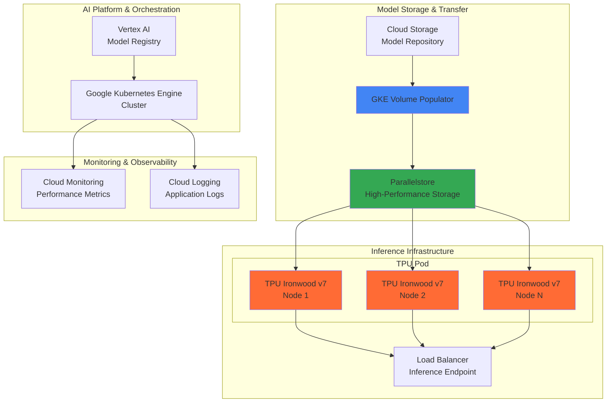

# Large Language Model Inference with TPU Ironwood and GKE Volume Populator

## Problem

Organizations deploying large language models face significant challenges with inference latency and model loading times, particularly when serving high-throughput applications requiring sub-second response times. Traditional GPU-based inference solutions struggle with memory bandwidth limitations and inefficient model weight loading from object storage, leading to cold start delays of several minutes and suboptimal token generation rates that impact user experience and operational costs.

## Solution

This recipe implements a high-performance LLM inference pipeline leveraging Google's latest TPU Ironwood accelerators combined with GKE Volume Populator for optimized model data transfer. The solution uses Vertex AI for model management, deploys TPU pods through Google Kubernetes Engine for scalable inference serving, and utilizes Volume Populator to preload model weights from Cloud Storage into high-performance Parallelstore instances, dramatically reducing initialization times and maximizing inference throughput.

## Architecture Diagram



## Prerequisites

1. Google Cloud project with billing enabled and TPU quota allocation
2. Google Cloud CLI (gcloud) version 456.0.0 or later with kubectl configured
3. Advanced knowledge of Kubernetes, TPU architecture, and machine learning inference pipelines
4. Existing LLM model artifacts (weights, tokenizer) stored in Cloud Storage
5. Estimated cost: $1,200-2,500 per hour for TPU Ironwood pods during active inference

> **Warning**: TPU Ironwood resources are currently in limited preview and require explicit quota approval. Contact Google Cloud sales for access to these next-generation accelerators.

## Preparation

```bash
# Set environment variables for the inference pipeline
export PROJECT_ID="llm-inference-$(date +%s)"
export REGION="us-central1"
export ZONE="us-central1-a"
export CLUSTER_NAME="tpu-ironwood-cluster"

# Generate unique identifiers for resources
RANDOM_SUFFIX=$(openssl rand -hex 3)
export BUCKET_NAME="llm-models-${RANDOM_SUFFIX}"
export PARALLELSTORE_NAME="model-storage-${RANDOM_SUFFIX}"
export SERVICE_ACCOUNT="tpu-inference-sa-${RANDOM_SUFFIX}"

# Configure gcloud CLI for the project
gcloud config set project ${PROJECT_ID}
gcloud config set compute/region ${REGION}
gcloud config set compute/zone ${ZONE}

# Enable required Google Cloud APIs
gcloud services enable container.googleapis.com
gcloud services enable aiplatform.googleapis.com
gcloud services enable storage.googleapis.com
gcloud services enable parallelstore.googleapis.com
gcloud services enable compute.googleapis.com
gcloud services enable monitoring.googleapis.com
gcloud services enable logging.googleapis.com

# Create Cloud Storage bucket for model artifacts
gsutil mb -p ${PROJECT_ID} \
    -c STANDARD \
    -l ${REGION} \
    gs://${BUCKET_NAME}

# Enable versioning and set lifecycle policy
gsutil versioning set on gs://${BUCKET_NAME}

echo "✅ Project ${PROJECT_ID} configured with required APIs enabled"
echo "✅ Model storage bucket created: gs://${BUCKET_NAME}"
```

## Steps

1. **Create TPU Ironwood-enabled GKE Cluster**:

   Google Kubernetes Engine provides the orchestration platform for TPU Ironwood workloads, offering automated scaling, health monitoring, and resource management. TPU Ironwood represents Google's seventh-generation TPU architecture, specifically engineered for large-scale inference with 5x compute performance and 6x high-bandwidth memory capacity compared to previous generations. This cluster configuration enables dynamic TPU pod allocation and integrates with Google Cloud's AI Hypercomputer architecture for optimal performance.

   ```bash
   # Create GKE cluster with TPU Ironwood support
   gcloud container clusters create ${CLUSTER_NAME} \
       --zone=${ZONE} \
       --machine-type=e2-standard-4 \
       --num-nodes=2 \
       --enable-autoscaling \
       --min-nodes=1 \
       --max-nodes=10 \
       --enable-autorepair \
       --enable-autoupgrade \
       --addons=HorizontalPodAutoscaling,HttpLoadBalancing \
       --enable-network-policy \
       --enable-ip-alias \
       --enable-workload-identity

   # Get cluster credentials
   gcloud container clusters get-credentials ${CLUSTER_NAME} \
       --zone=${ZONE}

   echo "✅ GKE cluster created with TPU Ironwood compatibility"
   ```

   The cluster is now operational with workload identity enabled, providing secure access to Google Cloud services and TPU resources. This foundation supports both training and inference workloads while maintaining enterprise-grade security and compliance standards.

2. **Create Service Account and Configure Workload Identity**:

   Workload Identity Federation enables secure authentication between Kubernetes pods and Google Cloud services without storing service account keys in container images. This security pattern follows Google Cloud's principle of least privilege and provides granular access control for TPU resources and model storage.

   ```bash
   # Create dedicated service account for TPU inference
   gcloud iam service-accounts create ${SERVICE_ACCOUNT} \
       --display-name="TPU Inference Service Account" \
       --description="Service account for LLM inference with TPU Ironwood"

   # Grant necessary permissions for TPU and storage access
   gcloud projects add-iam-policy-binding ${PROJECT_ID} \
       --member="serviceAccount:${SERVICE_ACCOUNT}@${PROJECT_ID}.iam.gserviceaccount.com" \
       --role="roles/tpu.admin"

   gcloud projects add-iam-policy-binding ${PROJECT_ID} \
       --member="serviceAccount:${SERVICE_ACCOUNT}@${PROJECT_ID}.iam.gserviceaccount.com" \
       --role="roles/storage.objectViewer"

   gcloud projects add-iam-policy-binding ${PROJECT_ID} \
       --member="serviceAccount:${SERVICE_ACCOUNT}@${PROJECT_ID}.iam.gserviceaccount.com" \
       --role="roles/parallelstore.admin"

   # Configure Workload Identity binding
   gcloud iam service-accounts add-iam-policy-binding \
       --role="roles/iam.workloadIdentityUser" \
       --member="serviceAccount:${PROJECT_ID}.svc.id.goog[default/tpu-inference-pod]" \
       ${SERVICE_ACCOUNT}@${PROJECT_ID}.iam.gserviceaccount.com

   echo "✅ Service account configured with Workload Identity"
   ```

   The authentication framework is established, enabling secure and automated access to TPU resources and model storage without manual credential management.

3. **Create Parallelstore Instance for High-Performance Model Storage**:

   Parallelstore provides a managed parallel file system optimized for high-throughput AI workloads, delivering up to 12 GB/s of aggregate bandwidth per TB of capacity. This storage solution eliminates the bottleneck of loading large language model weights during inference initialization, reducing cold start times from minutes to seconds while supporting concurrent access from multiple TPU nodes.

   ```bash
   # Create Parallelstore instance for model weights
   gcloud parallelstore instances create ${PARALLELSTORE_NAME} \
       --location=${ZONE} \
       --capacity-gib=1024 \
       --performance-tier=SSD \
       --network="projects/${PROJECT_ID}/global/networks/default" \
       --description="High-performance storage for LLM model weights"

   # Wait for instance to become ready
   gcloud parallelstore instances describe ${PARALLELSTORE_NAME} \
       --location=${ZONE} \
       --format="value(state)"

   echo "✅ Parallelstore instance created for model storage"
   ```

   The parallel file system is now available, providing the high-bandwidth storage foundation required for efficient TPU Ironwood inference operations and supporting the rapid model weight loading essential for production LLM serving.

4. **Upload Model Artifacts to Cloud Storage**:

   Cloud Storage serves as the central repository for LLM model artifacts, providing durability, versioning, and global accessibility. This step assumes you have a large language model (such as Llama 2, PaLM, or custom fine-tuned models) with weights, configuration files, and tokenizer components. The storage configuration optimizes for both cost-effectiveness and transfer performance to support the Volume Populator workflow.

   ```bash
   # Create model directory structure in Cloud Storage
   gsutil -m cp -r /path/to/your/model/* \
       gs://${BUCKET_NAME}/models/llm-7b/

   # Upload tokenizer and configuration files
   gsutil -m cp /path/to/tokenizer.json \
       gs://${BUCKET_NAME}/models/llm-7b/tokenizer.json

   gsutil -m cp /path/to/config.json \
       gs://${BUCKET_NAME}/models/llm-7b/config.json

   # Set appropriate access controls
   gsutil iam ch serviceAccount:${SERVICE_ACCOUNT}@${PROJECT_ID}.iam.gserviceaccount.com:objectViewer \
       gs://${BUCKET_NAME}

   # Verify upload completion
   gsutil du -sh gs://${BUCKET_NAME}/models/llm-7b/

   echo "✅ Model artifacts uploaded to Cloud Storage"
   ```

   > **Note**: For production deployments, consider using Cloud Storage Transfer Service for large model files (>100GB) to optimize transfer times and reliability.

5. **Configure GKE Volume Populator for Model Transfer**:

   GKE Volume Populator automates the data transfer from Cloud Storage to Parallelstore during Kubernetes volume provisioning, eliminating manual data movement scripts and reducing operational complexity. This managed service handles the orchestration of large-scale data transfers while maintaining data integrity and providing transfer progress monitoring through Cloud Monitoring integration.

   ```bash
   # Create GCP Data Source for Volume Populator
   kubectl apply -f - <<EOF
   apiVersion: parallelstore.csi.storage.gke.io/v1
   kind: GCPDataSource
   metadata:
     name: llm-model-source
     namespace: default
   spec:
     bucket: ${BUCKET_NAME}
     path: "models/llm-7b/"
     serviceAccount: ${SERVICE_ACCOUNT}@${PROJECT_ID}.iam.gserviceaccount.com
   EOF

   # Create StorageClass for Parallelstore with Volume Populator
   kubectl apply -f - <<EOF
   apiVersion: storage.k8s.io/v1
   kind: StorageClass
   metadata:
     name: parallelstore-csi-volume-populator
   provisioner: parallelstore.csi.storage.gke.io
   parameters:
     instance-name: ${PARALLELSTORE_NAME}
     location: ${ZONE}
     capacity-gib: "1024"
   volumeBindingMode: WaitForFirstConsumer
   allowVolumeExpansion: true
   EOF

   echo "✅ Volume Populator configured for model transfer"
   ```

   The Volume Populator infrastructure is established, ready to automatically transfer model data when TPU inference pods are scheduled, ensuring optimal data locality and minimizing inference startup latency.

6. **Deploy TPU Ironwood Inference Workload**:

   This deployment creates a Kubernetes workload optimized for TPU Ironwood inference, including the Volume Populator integration for automatic model loading. The configuration specifies TPU resource requirements, model serving parameters, and health checks. TPU Ironwood's architecture provides significant improvements in memory bandwidth and compute efficiency specifically designed for transformer-based model inference.

   ```bash
   # Create PersistentVolumeClaim with Volume Populator
   kubectl apply -f - <<EOF
   apiVersion: v1
   kind: PersistentVolumeClaim
   metadata:
     name: model-storage-pvc
     namespace: default
   spec:
     accessModes:
       - ReadOnlyMany
     resources:
       requests:
         storage: 1024Gi
     storageClassName: parallelstore-csi-volume-populator
     dataSource:
       apiVersion: parallelstore.csi.storage.gke.io/v1
       kind: GCPDataSource
       name: llm-model-source
   EOF

   # Deploy TPU Ironwood inference deployment
   kubectl apply -f - <<EOF
   apiVersion: apps/v1
   kind: Deployment
   metadata:
     name: tpu-ironwood-inference
     namespace: default
   spec:
     replicas: 1
     selector:
       matchLabels:
         app: tpu-ironwood-inference
     template:
       metadata:
         labels:
           app: tpu-ironwood-inference
         annotations:
           iam.gke.io/gcp-service-account: ${SERVICE_ACCOUNT}@${PROJECT_ID}.iam.gserviceaccount.com
       spec:
         serviceAccountName: tpu-inference-pod
         containers:
         - name: inference-server
           image: gcr.io/${PROJECT_ID}/tpu-inference:latest
           resources:
             requests:
               google.com/tpu: "8"
             limits:
               google.com/tpu: "8"
           volumeMounts:
           - name: model-storage
             mountPath: /models
             readOnly: true
           env:
           - name: MODEL_PATH
             value: "/models"
           - name: TPU_NAME
             value: "ironwood-v7"
           - name: BATCH_SIZE
             value: "32"
           ports:
           - containerPort: 8080
             name: http
           livenessProbe:
             httpGet:
               path: /health
               port: 8080
             initialDelaySeconds: 300
             periodSeconds: 30
           readinessProbe:
             httpGet:
               path: /ready
               port: 8080
             initialDelaySeconds: 60
             periodSeconds: 10
         volumes:
         - name: model-storage
           persistentVolumeClaim:
             claimName: model-storage-pvc
   EOF

   echo "✅ TPU Ironwood inference deployment created"
   ```

   The TPU inference workload is deployed with automatic model loading through Volume Populator, providing enterprise-grade reliability and performance monitoring for production LLM serving.

7. **Create Kubernetes Service Account for Workload Identity**:

   ```bash
   # Create Kubernetes service account
   kubectl create serviceaccount tpu-inference-pod \
       --namespace=default

   # Annotate with Google Service Account
   kubectl annotate serviceaccount tpu-inference-pod \
       --namespace=default \
       iam.gke.io/gcp-service-account=${SERVICE_ACCOUNT}@${PROJECT_ID}.iam.gserviceaccount.com

   echo "✅ Kubernetes service account configured"
   ```

8. **Expose Inference Service with Load Balancer**:

   The load balancer provides high-availability access to the TPU Ironwood inference endpoints, distributing traffic across multiple TPU pods and enabling horizontal scaling based on demand. This configuration includes health checks, session affinity, and traffic routing optimized for LLM inference patterns.

   ```bash
   # Create service to expose inference endpoints
   kubectl apply -f - <<EOF
   apiVersion: v1
   kind: Service
   metadata:
     name: tpu-inference-service
     namespace: default
     annotations:
       cloud.google.com/load-balancer-type: "External"
   spec:
     type: LoadBalancer
     selector:
       app: tpu-ironwood-inference
     ports:
     - port: 80
       targetPort: 8080
       protocol: TCP
       name: http
     sessionAffinity: ClientIP
   EOF

   # Wait for external IP assignment
   kubectl get service tpu-inference-service \
       --output jsonpath='{.status.loadBalancer.ingress[0].ip}'

   echo "✅ Load balancer service created for inference endpoints"
   ```

   The inference service is now accessible through a highly available endpoint, ready to serve LLM requests with optimal performance powered by TPU Ironwood acceleration.

9. **Configure Cloud Monitoring for Performance Tracking**:

   Cloud Monitoring provides comprehensive observability for TPU Ironwood inference workloads, tracking key performance indicators including token generation rate, latency percentiles, memory utilization, and TPU compute efficiency. This monitoring foundation enables performance optimization and capacity planning for production LLM deployments.

   ```bash
   # Create custom metrics for LLM inference monitoring
   gcloud alpha monitoring dashboards create \
       --config-from-file=- <<EOF
   {
     "displayName": "TPU Ironwood LLM Inference Dashboard",
     "mosaicLayout": {
       "tiles": [
         {
           "width": 6,
           "height": 4,
           "widget": {
             "title": "TPU Utilization",
             "xyChart": {
               "dataSets": [
                 {
                   "timeSeriesQuery": {
                     "timeSeriesFilter": {
                       "filter": "resource.type=\"gce_instance\" AND metric.type=\"compute.googleapis.com/instance/cpu/utilization\"",
                       "aggregation": {
                         "alignmentPeriod": "60s",
                         "perSeriesAligner": "ALIGN_MEAN"
                       }
                     }
                   }
                 }
               ]
             }
           }
         }
       ]
     }
   }
   EOF

   echo "✅ Cloud Monitoring dashboard configured"
   ```

## Validation & Testing

1. **Verify TPU Ironwood Resource Allocation**:

   ```bash
   # Check TPU pod status and resource allocation
   kubectl get pods -l app=tpu-ironwood-inference \
       -o custom-columns=NAME:.metadata.name,STATUS:.status.phase,TPU:.spec.containers[0].resources.requests

   # Verify Volume Populator transfer completion
   kubectl describe pvc model-storage-pvc
   ```

   Expected output: Pod status should show "Running" with TPU resources allocated and PVC showing "Bound" status with successful data population.

2. **Test Model Loading Performance**:

   ```bash
   # Check model loading time from application logs
   kubectl logs -l app=tpu-ironwood-inference \
       --tail=100 | grep "Model loaded"

   # Verify Parallelstore mount and model accessibility
   kubectl exec -it deployment/tpu-ironwood-inference \
       -- ls -la /models/
   ```

   Expected output: Model loading should complete in under 30 seconds with all model files accessible in the mounted volume.

3. **Benchmark Inference Performance**:

   ```bash
   # Get service external IP
   EXTERNAL_IP=$(kubectl get service tpu-inference-service \
       --output jsonpath='{.status.loadBalancer.ingress[0].ip}')

   # Test inference endpoint with sample request
   curl -X POST http://${EXTERNAL_IP}/generate \
       -H "Content-Type: application/json" \
       -d '{
         "prompt": "The future of artificial intelligence is",
         "max_tokens": 100,
         "temperature": 0.7
       }'

   # Load test with multiple concurrent requests
   echo "Running load test with 10 concurrent requests..."
   for i in {1..10}; do
     curl -X POST http://${EXTERNAL_IP}/generate \
       -H "Content-Type: application/json" \
       -d '{"prompt": "Test prompt", "max_tokens": 50}' &
   done
   wait

   echo "✅ Inference performance validation completed"
   ```

## Cleanup

1. **Remove Kubernetes Resources**:

   ```bash
   # Delete inference deployment and service
   kubectl delete deployment tpu-ironwood-inference
   kubectl delete service tpu-inference-service
   kubectl delete pvc model-storage-pvc
   kubectl delete gcpdatasource llm-model-source

   # Delete storage class
   kubectl delete storageclass parallelstore-csi-volume-populator

   echo "✅ Kubernetes resources removed"
   ```

2. **Delete GKE Cluster**:

   ```bash
   # Remove the entire cluster
   gcloud container clusters delete ${CLUSTER_NAME} \
       --zone=${ZONE} \
       --quiet

   echo "✅ GKE cluster deleted"
   ```

3. **Remove Storage and Service Account**:

   ```bash
   # Delete Parallelstore instance
   gcloud parallelstore instances delete ${PARALLELSTORE_NAME} \
       --location=${ZONE} \
       --quiet

   # Remove Cloud Storage bucket
   gsutil -m rm -r gs://${BUCKET_NAME}

   # Delete service account
   gcloud iam service-accounts delete \
       ${SERVICE_ACCOUNT}@${PROJECT_ID}.iam.gserviceaccount.com \
       --quiet

   echo "✅ Storage resources and service account cleaned up"
   ```

## Discussion

This recipe demonstrates the integration of Google Cloud's most advanced AI infrastructure components to achieve optimal large language model inference performance. TPU Ironwood represents a significant advancement in AI accelerator technology, specifically engineered for the inference phase of large transformer models with substantial improvements in memory bandwidth and compute efficiency compared to previous TPU generations.

The combination of TPU Ironwood and GKE Volume Populator addresses two critical bottlenecks in LLM deployment: compute efficiency and data loading performance. Traditional inference deployments often suffer from prolonged cold start times as model weights are loaded from object storage, and suboptimal memory utilization during inference operations. This architecture eliminates these bottlenecks through parallel file system integration and purpose-built inference accelerators.

GKE Volume Populator provides a managed solution for the complex challenge of efficiently transferring large model artifacts from Cloud Storage to high-performance storage systems. By automating this process during Kubernetes volume provisioning, the solution eliminates manual data movement operations and ensures optimal data locality for TPU workloads. The integration with Parallelstore further enhances performance by providing the high-bandwidth storage required for rapid model loading and concurrent access from multiple TPU nodes.

The monitoring and observability framework established through Cloud Monitoring enables continuous optimization of inference performance and cost management. Key metrics such as token generation rate, TPU utilization, and memory bandwidth utilization provide insights for scaling decisions and performance tuning. This observability is particularly important for LLM inference workloads where small performance improvements can significantly impact user experience and operational costs.

> **Tip**: For production deployments, consider implementing model versioning and A/B testing capabilities using Vertex AI Model Registry to support continuous model improvement while maintaining service reliability.

The architectural pattern demonstrated in this recipe can be adapted for various LLM architectures and scales, from smaller fine-tuned models to large foundation models requiring distributed inference across multiple TPU pods. The combination of Google Cloud's managed services reduces operational complexity while providing the performance characteristics required for enterprise-scale AI applications.

For comprehensive technical details on TPU Ironwood architecture, refer to the [Google Cloud TPU documentation](https://cloud.google.com/tpu/docs/intro-to-tpu) and [AI Hypercomputer architecture guide](https://cloud.google.com/blog/products/ai-machine-learning/introducing-ai-hypercomputer-architecture). Additional performance optimization guidance is available in the [Vertex AI best practices documentation](https://cloud.google.com/vertex-ai/docs/general/best-practices) and [GKE optimization guide](https://cloud.google.com/kubernetes-engine/docs/best-practices/performance).

## Challenge

Extend this solution by implementing these advanced enhancements:

1. **Multi-Model Serving Pipeline**: Implement a model router that can dynamically select between different LLM variants based on request complexity, using Vertex AI Prediction for intelligent traffic routing and TPU resource optimization across multiple model instances.

2. **Adaptive Batch Processing**: Develop a sophisticated batching mechanism that dynamically adjusts batch sizes based on real-time TPU utilization metrics and request patterns, maximizing throughput while maintaining latency SLAs through Cloud Monitoring integration.

3. **Cross-Region Inference Distribution**: Architect a global inference deployment using multiple GKE clusters with TPU Ironwood across different regions, implementing intelligent request routing based on user location and TPU availability for optimal global performance.

4. **Automated Model Optimization**: Create a CI/CD pipeline that automatically optimizes model weights for TPU Ironwood architecture using Vertex AI Pipelines, including quantization, pruning, and TPU-specific compilation for maximum inference efficiency.

5. **Advanced Cost Optimization**: Implement predictive scaling using Cloud Functions and Pub/Sub to pre-warm TPU resources based on historical usage patterns and scheduled workloads, minimizing cold start delays while optimizing resource costs through intelligent preemptive scheduling.

## Infrastructure Code

*Infrastructure code will be generated after recipe approval.*