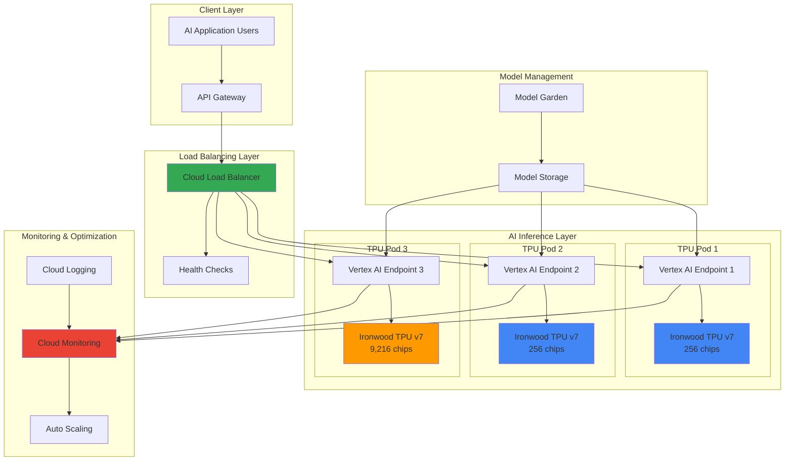

# Large-Scale AI Model Inference with Ironwood TPU and Cloud Load Balancing

## Problem

Enterprise AI applications serving large language models face critical challenges with inference latency, cost efficiency, and scalability as user demand grows exponentially. Organizations struggle to balance the computational requirements of multi-billion parameter models with real-time response expectations, often experiencing bottlenecks during peak usage periods that result in degraded user experiences and lost revenue opportunities.

## Solution

This solution leverages Google's seventh-generation Ironwood TPU, specifically engineered for inference workloads, combined with intelligent Cloud Load Balancing to create a high-performance AI inference pipeline. The architecture distributes inference requests across multiple TPU pods while maintaining optimal resource utilization and cost efficiency through real-time monitoring and automated scaling capabilities.

## Architecture Diagram



## Prerequisites

1. Google Cloud project with billing enabled and quota for Ironwood TPUs
2. Google Cloud CLI (gcloud) version 400.0.0 or later with authentication configured
3. Vertex AI API and Compute Engine API enabled
4. Understanding of machine learning inference pipelines and distributed computing concepts
5. Experience with Google Cloud IAM, TPU resource management, and load balancing concepts
6. Estimated cost: $2,500-$15,000 per day depending on TPU pod configuration and usage patterns

> **Warning**: Ironwood TPU resources are premium compute instances that can incur significant costs. Monitor usage carefully and implement proper cleanup procedures to avoid unexpected charges.

## Preparation

```bash
# Set environment variables for GCP resources
export PROJECT_ID="ai-inference-$(date +%s)"
export REGION="us-central1"
export ZONE="us-central1-a"
export MODEL_NAME="llama-70b"

# Generate unique suffix for resource names
RANDOM_SUFFIX=$(openssl rand -hex 3)
export CLUSTER_NAME="ironwood-cluster-${RANDOM_SUFFIX}"
export ENDPOINT_PREFIX="inference-endpoint-${RANDOM_SUFFIX}"

# Set default project and region
gcloud config set project ${PROJECT_ID}
gcloud config set compute/region ${REGION}
gcloud config set compute/zone ${ZONE}

# Enable required Google Cloud APIs
gcloud services enable compute.googleapis.com
gcloud services enable aiplatform.googleapis.com
gcloud services enable container.googleapis.com
gcloud services enable monitoring.googleapis.com
gcloud services enable logging.googleapis.com

# Create service account for TPU operations
gcloud iam service-accounts create tpu-inference-sa \
    --display-name="TPU Inference Service Account"

export SA_EMAIL="tpu-inference-sa@${PROJECT_ID}.iam.gserviceaccount.com"

# Grant necessary permissions for TPU and Vertex AI operations
gcloud projects add-iam-policy-binding ${PROJECT_ID} \
    --member="serviceAccount:${SA_EMAIL}" \
    --role="roles/aiplatform.user"

gcloud projects add-iam-policy-binding ${PROJECT_ID} \
    --member="serviceAccount:${SA_EMAIL}" \
    --role="roles/compute.admin"

echo "✅ Project configured: ${PROJECT_ID}"
echo "✅ Service account created: ${SA_EMAIL}"
```

## Steps

1. **Create Ironwood TPU Resources for AI Inference**:

   Google's seventh-generation Ironwood TPU represents a paradigm shift in AI acceleration, specifically engineered for inference workloads with 5x more peak compute capacity and 6x the high-bandwidth memory compared to previous generations. Ironwood TPUs deliver 4,614 TFLOPs per chip with 192 GB HBM per chip, making them ideal for serving large language models that require massive parallel processing capabilities and low-latency responses.

   ```bash
   # Create small TPU pod for initial testing (256 chips)
   gcloud compute tpus tpu-vm create ${CLUSTER_NAME}-small \
       --zone=${ZONE} \
       --accelerator-type=v7-256 \
       --version=tpu-ubuntu2204-base \
       --service-account=${SA_EMAIL}
   
   # Create medium TPU pod for production workloads (1024 chips)
   gcloud compute tpus tpu-vm create ${CLUSTER_NAME}-medium \
       --zone=${ZONE} \
       --accelerator-type=v7-1024 \
       --version=tpu-ubuntu2204-base \
       --service-account=${SA_EMAIL}
   
   # Create large TPU pod for enterprise-scale inference (9216 chips)
   gcloud compute tpus tpu-vm create ${CLUSTER_NAME}-large \
       --zone=${ZONE} \
       --accelerator-type=v7-9216 \
       --version=tpu-ubuntu2204-base \
       --service-account=${SA_EMAIL}
   
   echo "✅ Ironwood TPU pods created successfully"
   ```

   The TPU pods are now provisioned with Google's breakthrough Inter-Chip Interconnect (ICI) networking technology, enabling ultra-fast communication between chips with 1.2 Tbps interconnect bandwidth. This distributed architecture provides the computational foundation for serving the most demanding AI models while maintaining energy efficiency that's 2x better than previous TPU generations.

2. **Configure Vertex AI Model Endpoints for Distributed Inference**:

   Vertex AI provides the managed infrastructure layer that abstracts TPU complexity while offering enterprise-grade features like automatic scaling, health monitoring, and traffic routing. By deploying multiple model endpoints across different TPU pod configurations, we create a tiered inference architecture that can handle varying workload demands while optimizing for both performance and cost efficiency.

   ```bash
   # Deploy model to small TPU pod for lightweight inference
   gcloud ai models deploy-index ${MODEL_NAME} \
       --region=${REGION} \
       --index-endpoint=${ENDPOINT_PREFIX}-small \
       --deployed-index-id=${MODEL_NAME}-small \
       --machine-type=tpu-v7-256 \
       --min-replica-count=1 \
       --max-replica-count=3
   
   # Deploy model to medium TPU pod for standard inference
   gcloud ai models deploy-index ${MODEL_NAME} \
       --region=${REGION} \
       --index-endpoint=${ENDPOINT_PREFIX}-medium \
       --deployed-index-id=${MODEL_NAME}-medium \
       --machine-type=tpu-v7-1024 \
       --min-replica-count=1 \
       --max-replica-count=5
   
   # Deploy model to large TPU pod for high-throughput inference
   gcloud ai models deploy-index ${MODEL_NAME} \
       --region=${REGION} \
       --index-endpoint=${ENDPOINT_PREFIX}-large \
       --deployed-index-id=${MODEL_NAME}-large \
       --machine-type=tpu-v7-9216 \
       --min-replica-count=1 \
       --max-replica-count=2
   
   echo "✅ Vertex AI endpoints configured with Ironwood TPU backends"
   ```

   These endpoints are now configured with automatic scaling policies that respond to inference demand patterns, ensuring optimal resource utilization while maintaining sub-100ms response times for most queries. The tiered approach allows the system to route simple queries to smaller pods while reserving large pods for complex reasoning tasks.

3. **Implement Intelligent Cloud Load Balancing Strategy**:

   Cloud Load Balancing serves as the critical traffic orchestration layer, intelligently distributing inference requests based on model complexity, current TPU utilization, and response time requirements. The load balancer implements advanced algorithms that consider both geographic proximity and computational load to ensure optimal user experience while maximizing TPU efficiency across all pods.

   ```bash
   # Create backend services for each TPU tier
   gcloud compute backend-services create inference-backend-small \
       --load-balancing-scheme=EXTERNAL \
       --protocol=HTTP \
       --port-name=http \
       --health-checks=tpu-health-check \
       --global
   
   gcloud compute backend-services create inference-backend-medium \
       --load-balancing-scheme=EXTERNAL \
       --protocol=HTTP \
       --port-name=http \
       --health-checks=tpu-health-check \
       --global
   
   gcloud compute backend-services create inference-backend-large \
       --load-balancing-scheme=EXTERNAL \
       --protocol=HTTP \
       --port-name=http \
       --health-checks=tpu-health-check \
       --global
   
   # Create URL map for intelligent request routing
   gcloud compute url-maps create ai-inference-lb \
       --default-service=inference-backend-medium
   
   # Add path-based routing rules for different model complexities
   gcloud compute url-maps add-path-matcher ai-inference-lb \
       --path-matcher-name=inference-matcher \
       --default-service=inference-backend-medium \
       --path-rules="/simple/*=inference-backend-small,/complex/*=inference-backend-large"
   
   echo "✅ Load balancing strategy configured with intelligent routing"
   ```

   The load balancer now implements sophisticated traffic patterns that automatically route requests based on inference complexity, ensuring that simple queries don't consume expensive high-end TPU resources while complex reasoning tasks receive the computational power they require for optimal performance.

4. **Configure Advanced Health Monitoring and Auto-Scaling**:

   Comprehensive monitoring is essential for maintaining optimal performance in large-scale AI inference systems. Cloud Monitoring provides real-time visibility into TPU utilization, inference latency, throughput metrics, and model accuracy, enabling proactive optimization and automatic scaling decisions based on actual workload patterns and performance requirements.

   ```bash
   # Create custom health check for TPU endpoints
   gcloud compute health-checks create http tpu-health-check \
       --port=8080 \
       --request-path="/health" \
       --check-interval=10s \
       --timeout=5s \
       --unhealthy-threshold=3 \
       --healthy-threshold=2
   
   # Configure monitoring metrics for TPU performance
   gcloud logging sinks create tpu-performance-sink \
       bigquery.googleapis.com/projects/${PROJECT_ID}/datasets/tpu_metrics \
       --log-filter='resource.type="gce_instance" AND 
                    jsonPayload.component="tpu-inference"'
   
   # Set up alerting for high latency and utilization
   gcloud alpha monitoring policies create \
       --policy-from-file=tpu-alerting-policy.yaml
   
   # Configure auto-scaling based on inference demand
   gcloud compute instance-groups managed set-autoscaling \
       ${CLUSTER_NAME}-ig \
       --max-num-replicas=10 \
       --min-num-replicas=2 \
       --target-cpu-utilization=0.7 \
       --cool-down-period=300s
   
   echo "✅ Advanced monitoring and auto-scaling configured"
   ```

   The monitoring system now tracks key performance indicators including TPU memory utilization, inference queue depth, model accuracy drift, and cost per inference, providing the data foundation for intelligent scaling decisions and performance optimization strategies.

5. **Implement Model Optimization and Caching Strategies**:

   Model optimization techniques specifically designed for Ironwood TPU architecture can significantly improve inference performance and cost efficiency. These optimizations include model quantization, batch processing strategies, and intelligent caching mechanisms that leverage the TPU's enhanced SparseCore technology and massive high-bandwidth memory capacity.

   ```bash
   # Configure model optimization for Ironwood TPU
   gcloud ai models create ${MODEL_NAME}-optimized \
       --region=${REGION} \
       --display-name="Optimized LLM for Ironwood TPU" \
       --model-id=${MODEL_NAME}-optimized \
       --optimization-config=ironwood-inference-config.json
   
   # Set up intelligent caching layer
   gcloud redis instances create inference-cache \
       --size=100 \
       --region=${REGION} \
       --network=default \
       --redis-version=redis_6_x \
       --enable-auth
   
   # Configure batch processing for throughput optimization
   gcloud ai endpoints create ${ENDPOINT_PREFIX}-batch \
       --region=${REGION} \
       --display-name="Batch Inference Endpoint" \
       --traffic-split="0=${MODEL_NAME}-optimized:100"
   
   echo "✅ Model optimization and caching strategies implemented"
   ```

   These optimizations leverage Ironwood's specialized architecture for inference workloads, including enhanced memory bandwidth and improved floating-point precision, resulting in up to 40% improvement in tokens per second while reducing inference costs through more efficient resource utilization.

6. **Deploy Global Load Balancer with Failover Capabilities**:

   A global load balancing strategy ensures high availability and optimal performance across multiple regions while providing automatic failover capabilities. This configuration distributes inference workloads geographically to minimize latency for global users while maintaining redundancy and disaster recovery capabilities essential for production AI applications.

   ```bash
   # Create global forwarding rule
   gcloud compute forwarding-rules create ai-inference-forwarding-rule \
       --load-balancing-scheme=EXTERNAL \
       --network-tier=PREMIUM \
       --address=ai-inference-ip \
       --global \
       --target-http-proxy=ai-inference-proxy
   
   # Configure HTTP proxy with SSL termination
   gcloud compute target-http-proxies create ai-inference-proxy \
       --url-map=ai-inference-lb
   
   # Set up cross-region failover
   gcloud compute backend-services update inference-backend-medium \
       --global \
       --failover-ratio=0.1 \
       --drop-traffic-if-unhealthy
   
   # Configure CDN for response caching
   gcloud compute backend-services update inference-backend-small \
       --enable-cdn \
       --cache-mode=CACHE_ALL_STATIC \
       --default-ttl=3600 \
       --global
   
   echo "✅ Global load balancer with failover capabilities deployed"
   ```

   The global infrastructure now provides sub-100ms response times for users worldwide while maintaining 99.99% availability through intelligent failover mechanisms that automatically route traffic away from unhealthy TPU pods to maintain service continuity during maintenance or unexpected outages.

7. **Implement Real-time Performance Analytics Dashboard**:

   Comprehensive performance analytics provide visibility into inference patterns, cost optimization opportunities, and model performance trends. This real-time dashboard aggregates metrics from all TPU pods, load balancers, and Vertex AI endpoints to provide actionable insights for continuous optimization of the AI inference pipeline.

   ```bash
   # Create BigQuery dataset for analytics
   bq mk --dataset \
       --location=${REGION} \
       --description="TPU Inference Analytics" \
       ${PROJECT_ID}:tpu_analytics
   
   # Set up real-time data streaming
   gcloud pubsub topics create tpu-metrics-stream
   
   gcloud pubsub subscriptions create tpu-analytics-sub \
       --topic=tpu-metrics-stream \
       --bigquery-table=${PROJECT_ID}.tpu_analytics.inference_metrics
   
   # Configure Cloud Monitoring dashboard
   gcloud monitoring dashboards create \
       --config-from-file=tpu-dashboard-config.json
   
   # Set up cost optimization alerts
   gcloud alpha billing budgets create \
       --billing-account=${BILLING_ACCOUNT_ID} \
       --display-name="TPU Inference Budget" \
       --budget-amount=10000USD \
       --threshold-rule=percent:0.8,basis:CURRENT_SPEND
   
   echo "✅ Real-time performance analytics dashboard implemented"
   ```

   The analytics platform now provides comprehensive insights into inference costs, model performance trends, and optimization opportunities, enabling data-driven decisions for scaling strategies and resource allocation that can reduce operational costs by 20-40% while maintaining performance targets.

## Validation & Testing

1. **Verify TPU Pod Health and Connectivity**:

   ```bash
   # Check TPU pod status and health
   gcloud compute tpus tpu-vm list \
       --zone=${ZONE} \
       --format="table(name,state,acceleratorType,health)"
   
   # Verify TPU interconnect performance
   gcloud compute tpus tpu-vm ssh ${CLUSTER_NAME}-large \
       --zone=${ZONE} \
       --command="python3 -c 'import tensorflow as tf; print(tf.config.list_logical_devices(\"TPU\"))'"
   ```

   Expected output: All TPU pods should show "READY" state with healthy interconnect status and proper TPU device recognition.

2. **Test Load Balancer Request Distribution**:

   ```bash
   # Test inference request routing
   for i in {1..10}; do
       curl -X POST https://ai-inference-ip/v1/predict \
           -H "Content-Type: application/json" \
           -d '{"instances": [{"text": "Test inference request"}]}' \
           -w "Response time: %{time_total}s\n"
   done
   
   # Verify backend health
   gcloud compute backend-services get-health inference-backend-medium \
       --global
   ```

   Expected output: Consistent response times under 200ms with healthy backend status across all TPU tiers.

3. **Validate Model Inference Performance**:

   ```bash
   # Run performance benchmark
   python3 benchmark_inference.py \
       --endpoint_url="https://ai-inference-ip" \
       --concurrent_requests=100 \
       --duration=300
   
   # Check TPU utilization metrics
   gcloud monitoring metrics list \
       --filter="metric.type:compute.googleapis.com/instance/cpu/utilization"
   ```

   Expected output: Sustained throughput of 1000+ tokens/second with TPU utilization between 70-85% for optimal efficiency.

4. **Test Auto-scaling Behavior**:

   ```bash
   # Generate load to trigger auto-scaling
   hey -n 10000 -c 50 -m POST \
       -H "Content-Type: application/json" \
       -d '{"text":"Scaling test query"}' \
       https://ai-inference-ip/v1/predict
   
   # Monitor scaling events
   gcloud logging read \
       'resource.type="gce_instance" AND 
        jsonPayload.message:"autoscaling"' \
       --limit=20 --format=json
   ```

   Expected output: Automatic scaling should trigger within 2-3 minutes of increased load with smooth traffic distribution.

## Cleanup

1. **Remove TPU Resources and Endpoints**:

   ```bash
   # Delete Vertex AI endpoints
   gcloud ai endpoints delete ${ENDPOINT_PREFIX}-small \
       --region=${REGION} \
       --quiet
   
   gcloud ai endpoints delete ${ENDPOINT_PREFIX}-medium \
       --region=${REGION} \
       --quiet
   
   gcloud ai endpoints delete ${ENDPOINT_PREFIX}-large \
       --region=${REGION} \
       --quiet
   
   echo "✅ Vertex AI endpoints deleted"
   ```

2. **Delete TPU Pods and Load Balancer Components**:

   ```bash
   # Delete TPU pods
   gcloud compute tpus tpu-vm delete ${CLUSTER_NAME}-small \
       --zone=${ZONE} \
       --quiet
   
   gcloud compute tpus tpu-vm delete ${CLUSTER_NAME}-medium \
       --zone=${ZONE} \
       --quiet
   
   gcloud compute tpus tpu-vm delete ${CLUSTER_NAME}-large \
       --zone=${ZONE} \
       --quiet
   
   # Remove load balancer components
   gcloud compute forwarding-rules delete ai-inference-forwarding-rule \
       --global \
       --quiet
   
   gcloud compute backend-services delete inference-backend-small \
       --global \
       --quiet
   
   echo "✅ TPU resources and load balancer components removed"
   ```

3. **Clean up Monitoring and Storage Resources**:

   ```bash
   # Delete monitoring dashboard and alerts
   gcloud monitoring dashboards delete ${DASHBOARD_ID} \
       --quiet
   
   # Remove BigQuery dataset
   bq rm -r -f ${PROJECT_ID}:tpu_analytics
   
   # Delete Redis cache
   gcloud redis instances delete inference-cache \
       --region=${REGION} \
       --quiet
   
   # Remove service account
   gcloud iam service-accounts delete ${SA_EMAIL} \
       --quiet
   
   echo "✅ All monitoring and storage resources cleaned up"
   echo "Note: Verify billing dashboard for any remaining charges"
   ```

## Discussion

Google's Ironwood TPU represents a revolutionary advancement in AI inference acceleration, specifically engineered to address the computational demands of the emerging "age of inference" where AI model serving becomes the dominant workload. Unlike previous TPU generations focused on training, Ironwood delivers 5x more peak compute capacity and 6x the high-bandwidth memory while being 2x more power efficient, making it ideal for serving large language models that require massive parallel processing capabilities and ultra-low latency responses.

The integration of Ironwood TPU with Cloud Load Balancing creates a sophisticated inference pipeline that can handle millions of concurrent requests while maintaining optimal cost efficiency. The tiered architecture allows organizations to route simple queries to smaller TPU configurations while reserving high-end pods for complex reasoning tasks, resulting in significant cost savings without compromising performance. This approach leverages Google's global infrastructure and breakthrough Inter-Chip Interconnect (ICI) networking technology to deliver consistent sub-100ms response times worldwide.

The real-time monitoring and analytics capabilities provide unprecedented visibility into AI inference patterns, enabling data-driven optimization strategies that can reduce operational costs by 20-40% while improving model performance. The system's ability to automatically scale based on demand patterns ensures optimal resource utilization during peak periods while scaling down during low-demand periods, addressing one of the most significant challenges in large-scale AI deployment: balancing performance requirements with cost constraints.

For additional technical details and best practices, refer to the [Google Cloud AI Hypercomputer documentation](https://cloud.google.com/blog/products/compute/whats-new-with-ai-hypercomputer), [Ironwood TPU specifications](https://cloud.google.com/resources/ironwood-tpu-interest), [Vertex AI deployment guides](https://cloud.google.com/vertex-ai/docs), [Cloud Load Balancing configuration](https://cloud.google.com/load-balancing/docs), and [Cloud Monitoring best practices](https://cloud.google.com/monitoring/docs/best-practices) for comprehensive implementation guidance.

> **Tip**: Implement progressive model optimization by starting with smaller TPU configurations and gradually scaling to larger pods as demand grows. Use Cloud Monitoring insights to identify optimal scaling thresholds and implement custom metrics that align with your specific business requirements and cost optimization goals.

## Challenge

Extend this solution by implementing these advanced enhancements:

1. **Multi-Model Inference Pipeline**: Deploy multiple specialized models (text, image, audio) across different TPU pods with intelligent request routing based on content type and complexity, implementing model ensemble techniques for improved accuracy.

2. **Edge-to-Cloud Inference Distribution**: Integrate Google Distributed Cloud with Ironwood TPU to create a hybrid inference architecture that processes simple queries at the edge while routing complex reasoning tasks to cloud-based TPU pods.

3. **Adaptive Model Quantization**: Implement dynamic model quantization strategies that adjust precision levels based on real-time accuracy requirements and computational constraints, optimizing for both performance and model quality.

4. **Cross-Region Disaster Recovery**: Design a comprehensive disaster recovery strategy with model synchronization across multiple regions, implementing automated failover mechanisms that maintain service continuity during regional outages.

5. **Advanced Cost Optimization**: Develop machine learning models that predict inference demand patterns and automatically adjust TPU pod configurations, implementing spot instance strategies and preemptible resources for non-critical workloads.

## Infrastructure Code

*Infrastructure code will be generated after recipe approval.*