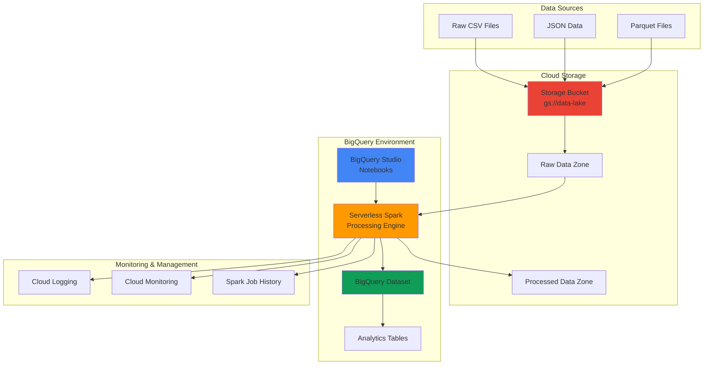

# Large-Scale Data Processing with BigQuery Serverless Spark

## Problem

Organizations struggle to process massive datasets efficiently while maintaining cost control and avoiding infrastructure management overhead. Traditional big data processing requires complex cluster management, manual scaling, and significant operational expertise. Data engineering teams often face challenges with unpredictable workloads that waste resources during low-demand periods and struggle to scale during peak processing times, resulting in delayed insights and increased operational costs.

## Solution

Build a scalable data processing pipeline using BigQuery's Serverless Spark engine to transform large datasets stored in Cloud Storage without managing any infrastructure. This approach combines the power of Apache Spark's distributed processing capabilities with BigQuery's serverless model, automatically scaling compute resources based on workload demands while providing seamless integration with Google Cloud's data ecosystem for cost-effective, enterprise-grade analytics.

## Architecture Diagram



## Prerequisites

1. Google Cloud Project with BigQuery, Cloud Storage, and Serverless Spark APIs enabled
2. Google Cloud CLI installed and configured (or Cloud Shell access)
3. IAM permissions for BigQuery Admin, Storage Admin, and Dataproc Serverless Admin roles
4. Understanding of Apache Spark concepts and data processing workflows
5. Basic knowledge of SQL and Python for data transformation logic
6. Estimated cost: $10-50 depending on data volume and processing complexity

> **Note**: BigQuery Serverless Spark pricing follows a pay-per-use model with automatic resource optimization to minimize costs while maximizing performance.

## Preparation

```bash
# Set environment variables for GCP resources
export PROJECT_ID="spark-data-processing-$(date +%s)"
export REGION="us-central1"
export ZONE="us-central1-a"

# Generate unique suffix for resource names
RANDOM_SUFFIX=$(openssl rand -hex 3)
export BUCKET_NAME="data-lake-spark-${RANDOM_SUFFIX}"
export DATASET_NAME="analytics_dataset_${RANDOM_SUFFIX}"

# Set default project and region
gcloud config set project ${PROJECT_ID}
gcloud config set compute/region ${REGION}
gcloud config set compute/zone ${ZONE}

# Enable required APIs
gcloud services enable bigquery.googleapis.com
gcloud services enable storage.googleapis.com
gcloud services enable dataproc.googleapis.com
gcloud services enable notebooks.googleapis.com

echo "✅ Project configured: ${PROJECT_ID}"
echo "✅ Bucket name: ${BUCKET_NAME}"
echo "✅ Dataset name: ${DATASET_NAME}"
```

## Steps

1. **Create Cloud Storage Bucket for Data Lake**:

   Google Cloud Storage provides the foundation for a modern data lake architecture, offering unlimited scale with strong consistency guarantees. Creating a properly configured bucket with lifecycle policies and access controls establishes the staging area for raw data ingestion and processed output storage.

   ```bash
   # Create storage bucket with appropriate configuration
   gsutil mb -p ${PROJECT_ID} \
       -c STANDARD \
       -l ${REGION} \
       gs://${BUCKET_NAME}
   
   # Enable versioning for data protection
   gsutil versioning set on gs://${BUCKET_NAME}
   
   # Create folder structure for data organization
   gsutil -m cp /dev/null gs://${BUCKET_NAME}/raw-data/.gitkeep
   gsutil -m cp /dev/null gs://${BUCKET_NAME}/processed-data/.gitkeep
   gsutil -m cp /dev/null gs://${BUCKET_NAME}/scripts/.gitkeep
   
   echo "✅ Storage bucket created: gs://${BUCKET_NAME}"
   ```

   The storage bucket now provides a scalable foundation for the data pipeline, with versioning enabled for data protection and organized folder structure for efficient data management.

2. **Upload Sample Dataset to Cloud Storage**:

   For demonstration purposes, we'll create a realistic sample dataset that simulates e-commerce transaction data. This dataset will showcase the power of Serverless Spark for processing structured data at scale with complex transformations.

   ```bash
   # Create sample e-commerce transaction data
   cat > sample_transactions.csv << 'EOF'
transaction_id,customer_id,product_id,product_category,quantity,unit_price,transaction_date,store_location
TXN001,CUST001,PROD001,Electronics,2,299.99,2024-01-15,New York
TXN002,CUST002,PROD002,Clothing,1,89.50,2024-01-15,Los Angeles
TXN003,CUST001,PROD003,Electronics,1,1299.99,2024-01-16,New York
TXN004,CUST003,PROD004,Home,3,45.00,2024-01-16,Chicago
TXN005,CUST002,PROD001,Electronics,1,299.99,2024-01-17,Los Angeles
TXN006,CUST004,PROD005,Clothing,2,125.00,2024-01-17,Miami
TXN007,CUST003,PROD002,Clothing,4,89.50,2024-01-18,Chicago
TXN008,CUST005,PROD006,Electronics,1,899.99,2024-01-18,Seattle
TXN009,CUST001,PROD007,Home,2,67.50,2024-01-19,New York
TXN010,CUST004,PROD003,Electronics,1,1299.99,2024-01-19,Miami
EOF
   
   # Upload sample data to Cloud Storage
   gsutil cp sample_transactions.csv gs://${BUCKET_NAME}/raw-data/
   
   # Verify upload
   gsutil ls -la gs://${BUCKET_NAME}/raw-data/
   
   echo "✅ Sample dataset uploaded to Cloud Storage"
   ```

   The sample dataset represents typical e-commerce transaction data with multiple dimensions for analysis, providing a realistic foundation for demonstrating Spark's analytical capabilities.

3. **Create BigQuery Dataset for Analytics**:

   BigQuery datasets provide logical containers for organizing tables and controlling access. Creating a properly configured dataset with appropriate location settings ensures optimal performance and compliance with data residency requirements.

   ```bash
   # Create BigQuery dataset for analytics
   bq mk --location=${REGION} \
       --description="Analytics dataset for Serverless Spark processing" \
       ${PROJECT_ID}:${DATASET_NAME}
   
   # Verify dataset creation
   bq ls --project_id=${PROJECT_ID}
   
   echo "✅ BigQuery dataset created: ${DATASET_NAME}"
   ```

   The analytics dataset is now ready to receive processed data from Spark jobs, with proper location configuration for optimal query performance and data governance.

4. **Configure Serverless Spark Session in BigQuery Studio**:

   BigQuery Studio provides an integrated development environment for Serverless Spark, offering notebook-based development with seamless access to BigQuery datasets and Cloud Storage. The Spark session configuration optimizes resource allocation and performance for the specific workload requirements.

   ```bash
   # Create Spark session configuration file
   cat > spark_session_config.json << EOF
   {
     "sessionTemplate": {
       "name": "data-processing-session",
       "description": "Serverless Spark session for large-scale data processing",
       "runtimeConfig": {
         "version": "2.2",
         "properties": {
           "spark.executor.instances": "auto",
           "spark.executor.memory": "4g",
           "spark.executor.cores": "2",
           "spark.sql.adaptive.enabled": "true",
           "spark.sql.adaptive.coalescePartitions.enabled": "true"
         }
       },
       "environmentConfig": {
         "executionConfig": {
           "serviceAccount": "${PROJECT_ID}@appspot.gserviceaccount.com",
           "subnetworkUri": "default"
         }
       }
     }
   }
   EOF
   
   echo "✅ Spark session configuration prepared"
   echo "Note: Open BigQuery Studio to create interactive Spark session"
   echo "URL: https://console.cloud.google.com/bigquery/studio"
   ```

   The Spark session configuration optimizes performance with adaptive query execution and automatic resource scaling, providing the foundation for efficient large-scale data processing.

5. **Create PySpark Data Processing Script**:

   This PySpark script demonstrates advanced data processing capabilities including data cleaning, aggregations, and enrichment. The script showcases best practices for distributed data processing with proper error handling and performance optimization.

   ```bash
   # Create comprehensive PySpark processing script
   cat > data_processing_spark.py << 'EOF'
   from pyspark.sql import SparkSession
   from pyspark.sql.functions import *
   from pyspark.sql.types import *
   import sys
   
   def create_spark_session():
       """Create optimized Spark session for BigQuery integration"""
       return SparkSession.builder \
           .appName("E-commerce Data Processing Pipeline") \
           .config("spark.sql.adaptive.enabled", "true") \
           .config("spark.sql.adaptive.coalescePartitions.enabled", "true") \
           .getOrCreate()
   
   def process_transaction_data(spark, input_path, output_dataset):
       """Process e-commerce transaction data with advanced analytics"""
       
       # Read CSV data from Cloud Storage
       df = spark.read \
           .option("header", "true") \
           .option("inferSchema", "true") \
           .csv(input_path)
       
       print(f"Loaded {df.count()} transactions for processing")
       
       # Data cleaning and transformation
       cleaned_df = df \
           .withColumn("transaction_date", to_date(col("transaction_date"))) \
           .withColumn("total_amount", col("quantity") * col("unit_price")) \
           .withColumn("year_month", date_format(col("transaction_date"), "yyyy-MM")) \
           .filter(col("quantity") > 0) \
           .filter(col("unit_price") > 0)
       
       # Customer analytics aggregation
       customer_analytics = cleaned_df \
           .groupBy("customer_id", "year_month") \
           .agg(
               count("transaction_id").alias("transaction_count"),
               sum("total_amount").alias("total_spent"),
               avg("total_amount").alias("avg_transaction_value"),
               countDistinct("product_category").alias("unique_categories")
           ) \
           .withColumn("customer_segment", 
               when(col("total_spent") > 1000, "Premium")
               .when(col("total_spent") > 500, "Standard")
               .otherwise("Basic"))
       
       # Product performance analytics
       product_analytics = cleaned_df \
           .groupBy("product_category", "year_month") \
           .agg(
               sum("quantity").alias("total_quantity_sold"),
               sum("total_amount").alias("category_revenue"),
               countDistinct("customer_id").alias("unique_customers"),
               avg("unit_price").alias("avg_unit_price")
           ) \
           .withColumn("revenue_per_customer", 
               col("category_revenue") / col("unique_customers"))
       
       # Location-based analytics
       location_analytics = cleaned_df \
           .groupBy("store_location", "product_category", "year_month") \
           .agg(
               sum("total_amount").alias("location_category_revenue"),
               count("transaction_id").alias("transaction_volume")
           )
       
       # Write results to BigQuery
       customer_analytics.write \
           .format("bigquery") \
           .option("table", f"{output_dataset}.customer_analytics") \
           .option("writeMethod", "direct") \
           .mode("overwrite") \
           .save()
       
       product_analytics.write \
           .format("bigquery") \
           .option("table", f"{output_dataset}.product_analytics") \
           .option("writeMethod", "direct") \
           .mode("overwrite") \
           .save()
       
       location_analytics.write \
           .format("bigquery") \
           .option("table", f"{output_dataset}.location_analytics") \
           .option("writeMethod", "direct") \
           .mode("overwrite") \
           .save()
       
       print("✅ All analytics tables successfully written to BigQuery")
       
       return customer_analytics, product_analytics, location_analytics
   
   if __name__ == "__main__":
       # Configuration
       input_path = "gs://BUCKET_NAME/raw-data/sample_transactions.csv"
       output_dataset = "PROJECT_ID.DATASET_NAME"
       
       # Process data
       spark = create_spark_session()
       customer_df, product_df, location_df = process_transaction_data(
           spark, input_path, output_dataset)
       
       # Display sample results
       print("\n=== Customer Analytics Sample ===")
       customer_df.show(10, truncate=False)
       
       print("\n=== Product Analytics Sample ===")
       product_df.show(10, truncate=False)
       
       spark.stop()
   EOF
   
   # Customize script with actual values
   sed -i "s/BUCKET_NAME/${BUCKET_NAME}/g" data_processing_spark.py
   sed -i "s/PROJECT_ID/${PROJECT_ID}/g" data_processing_spark.py
   sed -i "s/DATASET_NAME/${DATASET_NAME}/g" data_processing_spark.py
   
   echo "✅ PySpark data processing script created"
   ```

   The PySpark script implements a comprehensive analytics pipeline with customer segmentation, product performance analysis, and location-based insights using distributed computing capabilities.

6. **Execute Serverless Spark Job via Dataproc**:

   Dataproc Serverless provides a command-line interface for executing Spark jobs without cluster management. This approach offers full programmatic control over job execution with detailed monitoring and logging capabilities.

   ```bash
   # Upload Spark script to Cloud Storage
   gsutil cp data_processing_spark.py gs://${BUCKET_NAME}/scripts/
   
   # Submit Serverless Spark batch job
   gcloud dataproc batches submit pyspark \
       gs://${BUCKET_NAME}/scripts/data_processing_spark.py \
       --batch=${DATASET_NAME}-processing-job \
       --region=${REGION} \
       --project=${PROJECT_ID} \
       --jars=gs://spark-lib/bigquery/spark-bigquery-latest.jar \
       --properties="spark.executor.instances=2,spark.executor.memory=4g,spark.executor.cores=2" \
       --ttl=30m \
       --service-account=${PROJECT_ID}@appspot.gserviceaccount.com
   
   echo "✅ Serverless Spark job submitted for execution"
   echo "Monitor progress: https://console.cloud.google.com/dataproc/batches"
   ```

   The Serverless Spark job is now processing the dataset with optimized resource allocation, automatically scaling based on workload demands while maintaining cost efficiency.

7. **Monitor Job Execution and Performance**:

   Comprehensive monitoring ensures job success and provides insights for performance optimization. Google Cloud's integrated monitoring tools offer real-time visibility into resource utilization and job progress.

   ```bash
   # Check job status
   gcloud dataproc batches describe ${DATASET_NAME}-processing-job \
       --region=${REGION} \
       --format="value(state)"
   
   # Monitor job logs
   gcloud dataproc batches describe ${DATASET_NAME}-processing-job \
       --region=${REGION} \
       --format="value(runtimeInfo.outputUri)"
   
   # Wait for job completion (if needed)
   echo "Waiting for job completion..."
   while true; do
       STATUS=$(gcloud dataproc batches describe ${DATASET_NAME}-processing-job \
           --region=${REGION} --format="value(state)")
       echo "Current status: $STATUS"
       if [[ "$STATUS" == "SUCCEEDED" ]]; then
           echo "✅ Spark job completed successfully"
           break
       elif [[ "$STATUS" == "FAILED" ]]; then
           echo "❌ Spark job failed"
           break
       fi
       sleep 30
   done
   ```

   Real-time monitoring provides immediate feedback on job progress and performance metrics, enabling proactive optimization and troubleshooting.

8. **Validate Results in BigQuery**:

   Validation confirms successful data processing and enables quality assurance through data profiling and analytical queries. This step demonstrates the seamless integration between Serverless Spark and BigQuery analytics.

   ```bash
   # Query customer analytics results
   bq query --use_legacy_sql=false \
   "SELECT 
       customer_id,
       customer_segment,
       transaction_count,
       ROUND(total_spent, 2) as total_spent,
       ROUND(avg_transaction_value, 2) as avg_transaction_value
    FROM \`${PROJECT_ID}.${DATASET_NAME}.customer_analytics\`
    ORDER BY total_spent DESC
    LIMIT 10"
   
   # Query product performance analytics
   bq query --use_legacy_sql=false \
   "SELECT 
       product_category,
       year_month,
       total_quantity_sold,
       ROUND(category_revenue, 2) as category_revenue,
       unique_customers,
       ROUND(revenue_per_customer, 2) as revenue_per_customer
    FROM \`${PROJECT_ID}.${DATASET_NAME}.product_analytics\`
    ORDER BY category_revenue DESC"
   
   # Verify table schemas and row counts
   bq show ${PROJECT_ID}:${DATASET_NAME}.customer_analytics
   bq show ${PROJECT_ID}:${DATASET_NAME}.product_analytics
   bq show ${PROJECT_ID}:${DATASET_NAME}.location_analytics
   
   echo "✅ Data processing validation completed successfully"
   ```

## Validation & Testing

1. **Verify Serverless Spark Job Completion**:

   ```bash
   # Check final job status
   JOB_STATUS=$(gcloud dataproc batches describe ${DATASET_NAME}-processing-job \
       --region=${REGION} --format="value(state)")
   
   echo "Final job status: $JOB_STATUS"
   
   # Get job execution metrics
   gcloud dataproc batches describe ${DATASET_NAME}-processing-job \
       --region=${REGION} \
       --format="table(createTime,runtimeInfo.approximateUsage)"
   ```

   Expected output: Job status should show "SUCCEEDED" with execution metrics displaying resource usage and duration.

2. **Test BigQuery Analytics Tables**:

   ```bash
   # Validate data quality and completeness
   bq query --use_legacy_sql=false \
   "SELECT 
       'customer_analytics' as table_name,
       COUNT(*) as row_count,
       COUNT(DISTINCT customer_id) as unique_customers
    FROM \`${PROJECT_ID}.${DATASET_NAME}.customer_analytics\`
    
    UNION ALL
    
    SELECT 
       'product_analytics' as table_name,
       COUNT(*) as row_count,
       COUNT(DISTINCT product_category) as unique_categories
    FROM \`${PROJECT_ID}.${DATASET_NAME}.product_analytics\`"
   ```

   Expected output: Each analytics table should contain processed data with appropriate row counts and unique value distributions.

3. **Performance and Cost Analysis**:

   ```bash
   # Review Spark job resource utilization
   gcloud dataproc batches describe ${DATASET_NAME}-processing-job \
       --region=${REGION} \
       --format="yaml" | grep -A 10 "approximateUsage"
   
   # Check BigQuery slot usage
   bq query --use_legacy_sql=false \
   "SELECT 
       job_id,
       creation_time,
       total_slot_ms,
       total_bytes_processed
    FROM \`${PROJECT_ID}\`.INFORMATION_SCHEMA.JOBS
    WHERE job_type = 'LOAD'
    ORDER BY creation_time DESC
    LIMIT 5"
   ```

## Cleanup

1. **Remove BigQuery Resources**:

   ```bash
   # Delete BigQuery dataset and all tables
   bq rm -r -f ${PROJECT_ID}:${DATASET_NAME}
   
   echo "✅ BigQuery dataset deleted: ${DATASET_NAME}"
   ```

2. **Remove Cloud Storage Resources**:

   ```bash
   # Delete storage bucket and all contents
   gsutil -m rm -r gs://${BUCKET_NAME}
   
   echo "✅ Storage bucket deleted: gs://${BUCKET_NAME}"
   ```

3. **Clean Up Local Files**:

   ```bash
   # Remove local script files
   rm -f sample_transactions.csv
   rm -f data_processing_spark.py
   rm -f spark_session_config.json
   
   # Clear environment variables
   unset PROJECT_ID REGION BUCKET_NAME DATASET_NAME RANDOM_SUFFIX
   
   echo "✅ Local files and environment variables cleaned up"
   ```

4. **Remove Project (Optional)**:

   ```bash
   # Delete entire project if created specifically for this recipe
   # gcloud projects delete ${PROJECT_ID} --quiet
   
   echo "Note: Project deletion commented out for safety"
   echo "Run the above command manually if project was created for this recipe only"
   ```

## Discussion

BigQuery Serverless Spark represents a significant evolution in cloud data processing, combining the distributed computing power of Apache Spark with Google Cloud's serverless infrastructure model. This integration eliminates the traditional complexity of cluster management while providing enterprise-grade performance and scalability. The serverless approach automatically optimizes resource allocation based on workload characteristics, ensuring cost efficiency while maintaining the ability to process datasets ranging from gigabytes to petabytes. As of 2025, the service runs on Spark 3.5.1 with runtime version 2.2, offering the latest performance improvements and features.

The architecture demonstrated in this recipe showcases several key advantages of the BigQuery Serverless Spark approach. First, the seamless integration between Cloud Storage, Serverless Spark, and BigQuery creates a unified data platform that eliminates the need for complex data movement operations. Data can be processed directly from Cloud Storage and written to BigQuery tables without intermediate staging, reducing both latency and storage costs. Second, the automatic scaling capabilities ensure optimal resource utilization, scaling up during intensive processing phases and scaling down to zero when idle, following a true pay-per-use model with Enterprise edition pricing that includes organizational discounts where applicable.

Performance optimization is built into the platform through features like adaptive query execution, which automatically optimizes join strategies, partition sizes, and resource allocation based on actual data characteristics. The platform supports GPU acceleration with NVIDIA Spark Rapids for compute-intensive workloads, and includes the latest BigQuery connector (version 0.36.4) for efficient data transfer. The integrated monitoring and logging capabilities provide comprehensive visibility into job execution through Cloud Logging and Cloud Monitoring, enabling data engineers to quickly identify and resolve performance bottlenecks. Google Cloud's Security Command Center integration ensures compliance with enterprise security requirements.

From an enterprise perspective, BigQuery Serverless Spark addresses critical concerns around governance, security, and compliance following the [Google Cloud Architecture Framework](https://cloud.google.com/architecture). The platform provides built-in encryption for data at rest and in transit, integration with Google Cloud IAM for fine-grained access control, and comprehensive audit logging for regulatory compliance. The service account model ensures secure, traceable access to data resources, while custom organization policies enable enforcement of corporate governance standards across all Spark workloads. VPC Service Controls and Customer-Managed Encryption Keys (CMEK) support ensure data residency and encryption requirements are met.

> **Tip**: Leverage BigQuery Studio's integrated development environment for iterative development and testing of Spark jobs. The notebook interface provides immediate feedback and visualization capabilities that accelerate the development process while maintaining version control and collaboration features.

## Challenge

Extend this solution by implementing these enhancements:

1. **Real-time Streaming Analytics**: Integrate Pub/Sub and Dataflow to create a real-time data ingestion pipeline that feeds into the Serverless Spark processing workflow, enabling near real-time analytics on streaming e-commerce data with automatic batch processing triggers based on data volume thresholds.

2. **Advanced ML Feature Engineering**: Implement machine learning feature engineering pipelines using Spark MLlib within the Serverless Spark environment, creating customer churn prediction models and product recommendation features that can be served through Vertex AI endpoints with automated model retraining based on new transaction patterns.

3. **Multi-Region Data Processing**: Extend the architecture to process data across multiple Google Cloud regions, implementing cross-region data replication strategies and location-aware processing logic that complies with data residency requirements while optimizing for performance and cost using regional Serverless Spark deployments.

4. **Data Quality and Lineage Tracking**: Implement comprehensive data quality checks using Apache Spark's built-in data validation capabilities, integrate with Cloud Data Catalog for automated metadata discovery, and establish data lineage tracking throughout the processing pipeline for regulatory compliance and debugging using Apache Atlas integration.

5. **Cost Optimization and Auto-Scaling**: Develop intelligent workload scheduling that analyzes historical usage patterns to predict optimal resource allocation, implement custom container images for specialized workloads, and create automated cost reporting dashboards that provide insights into processing costs per data pipeline and business unit using Cloud Billing APIs.

## Infrastructure Code

*Infrastructure code will be generated after recipe approval.*