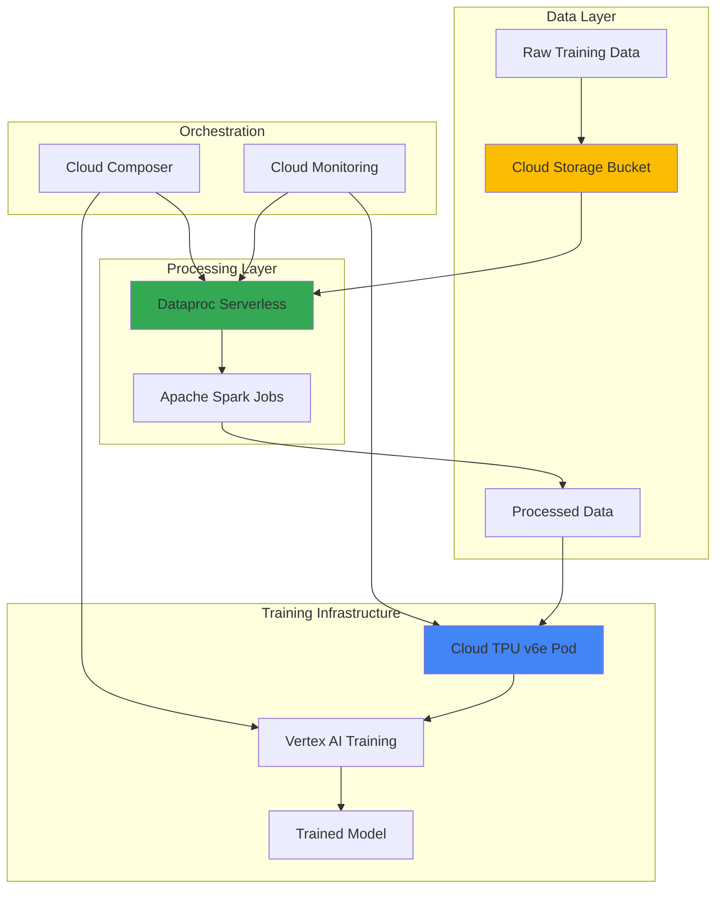

# Large-Scale Machine Learning Training Pipelines with Cloud TPU v6e and Dataproc Serverless

## Problem

Organizations training large language models and complex neural networks face significant challenges in managing massive datasets, coordinating distributed compute resources, and optimizing cost-performance ratios. Traditional GPU-based training infrastructures struggle with the computational demands of modern AI workloads, often resulting in weeks-long training cycles, excessive costs, and complex resource management overhead that slows down model development iterations and time-to-market for AI-powered products.

## Solution

This solution combines Google's latest Cloud TPU v6e (Trillium) processors with Dataproc Serverless to create an automated, cost-effective machine learning training pipeline. The TPU v6e provides 4.7x performance improvement over previous generations with specialized hardware for transformer models, while Dataproc Serverless handles scalable data preprocessing without infrastructure management, creating an end-to-end pipeline that automatically scales from data ingestion through model training with enterprise-grade performance and cost optimization.

## Architecture Diagram



## Prerequisites

1. Google Cloud Project with Compute Engine, Cloud TPU, Dataproc, and Vertex AI APIs enabled
2. gcloud CLI v2 installed and configured with beta components
3. Understanding of machine learning model training concepts and Apache Spark
4. Familiarity with Python, TensorFlow/JAX, and distributed computing architectures
5. Project Owner or Editor role with TPU and Dataproc permissions
6. Estimated cost: $800-2000 for complete pipeline execution (varies by dataset size and training duration)

> **Note**: Cloud TPU v6e (Trillium) is Google's most advanced AI accelerator, offering significant performance improvements for transformer models and large-scale neural network training. Review [TPU v6e documentation](https://cloud.google.com/tpu/docs/v6e) for detailed specifications and availability.

## Preparation

```bash
# Set environment variables for the training pipeline
export PROJECT_ID=$(gcloud config get-value project)
export REGION="us-central2"
export ZONE="us-central2-b"
export BUCKET_NAME="ml-training-pipeline-$(date +%s)"

# Generate unique identifiers for resources
RANDOM_SUFFIX=$(openssl rand -hex 3)
export TPU_NAME="training-tpu-${RANDOM_SUFFIX}"
export DATAPROC_BATCH_ID="preprocessing-${RANDOM_SUFFIX}"

# Set default project and region for gcloud
gcloud config set project ${PROJECT_ID}
gcloud config set compute/region ${REGION}
gcloud config set compute/zone ${ZONE}

# Enable required Google Cloud APIs
gcloud services enable compute.googleapis.com \
    tpu.googleapis.com \
    dataproc.googleapis.com \
    storage.googleapis.com \
    aiplatform.googleapis.com \
    monitoring.googleapis.com

# Create Cloud Storage bucket for the training pipeline
gsutil mb -p ${PROJECT_ID} \
    -c STANDARD \
    -l ${REGION} \
    gs://${BUCKET_NAME}

# Enable versioning for data protection
gsutil versioning set on gs://${BUCKET_NAME}

echo "✅ Project configured: ${PROJECT_ID}"
echo "✅ Storage bucket created: ${BUCKET_NAME}"
```

## Steps

1. **Configure Cloud Storage for Training Data Pipeline**:

   Cloud Storage serves as the central data lake for our machine learning pipeline, providing high-throughput, globally distributed storage optimized for large-scale ML workloads. Proper bucket configuration with appropriate storage classes and access controls ensures optimal performance for both data preprocessing and TPU training phases.

   ```bash
   # Create directories for different pipeline stages
   gsutil -m cp -r gs://cloud-ml-public-datasets/sample-text-data/ \
       gs://${BUCKET_NAME}/raw-data/
   
   # Set up structured directories for the pipeline
   echo "Creating pipeline directory structure..."
   gsutil -m mkdir gs://${BUCKET_NAME}/processed-data/
   gsutil -m mkdir gs://${BUCKET_NAME}/models/
   gsutil -m mkdir gs://${BUCKET_NAME}/checkpoints/
   gsutil -m mkdir gs://${BUCKET_NAME}/logs/
   
   # Configure bucket for high-performance ML workloads
   gsutil cors set /dev/stdin gs://${BUCKET_NAME} <<EOF
   [
     {
       "origin": ["*"],
       "method": ["GET", "POST", "PUT"],
       "responseHeader": ["Content-Type"],
       "maxAgeSeconds": 3600
     }
   ]
   EOF
   
   echo "✅ Storage structure configured for ML pipeline"
   ```

   The storage bucket now provides a high-performance foundation for our training pipeline, with optimized directory structure and CORS configuration that enables efficient data access patterns required by both Dataproc and TPU workloads.

2. **Deploy Dataproc Serverless for Data Preprocessing**:

   Dataproc Serverless eliminates the complexity of cluster management while providing auto-scaling Apache Spark capabilities essential for processing large training datasets. This serverless approach automatically provisions optimal compute resources based on workload demands, ensuring cost-effective preprocessing that scales seamlessly with dataset size.

   ```bash
   # Create preprocessing Spark job configuration
   cat > preprocessing_job.py << 'EOF'
   from pyspark.sql import SparkSession
   from pyspark.sql.functions import *
   import sys
   
   def preprocess_training_data(input_path, output_path):
       spark = SparkSession.builder \
           .appName("ML-Data-Preprocessing") \
           .config("spark.sql.adaptive.enabled", "true") \
           .config("spark.sql.adaptive.coalescePartitions.enabled", "true") \
           .getOrCreate()
       
       # Read raw text data
       df = spark.read.text(input_path)
       
       # Data preprocessing for language model training
       processed_df = df.select(
           col("value").alias("text")
       ).filter(
           length(col("text")) > 10
       ).repartition(100)  # Optimize for TPU consumption
       
       # Write preprocessed data in Parquet format
       processed_df.write.mode("overwrite") \
           .option("compression", "snappy") \
           .parquet(output_path)
       
       spark.stop()
   
   if __name__ == "__main__":
       input_path = sys.argv[1]
       output_path = sys.argv[2]
       preprocess_training_data(input_path, output_path)
   EOF
   
   # Upload preprocessing script to Cloud Storage
   gsutil cp preprocessing_job.py gs://${BUCKET_NAME}/scripts/
   
   # Submit Dataproc Serverless batch job
   gcloud dataproc batches submit pyspark \
       gs://${BUCKET_NAME}/scripts/preprocessing_job.py \
       --batch=${DATAPROC_BATCH_ID} \
       --region=${REGION} \
       --deps-bucket=${BUCKET_NAME} \
       --subnet=default \
       --service-account=${PROJECT_ID}-compute@developer.gserviceaccount.com \
       --properties="spark.executor.memory=4g,spark.driver.memory=2g" \
       -- gs://${BUCKET_NAME}/raw-data/ gs://${BUCKET_NAME}/processed-data/
   
   echo "✅ Dataproc Serverless preprocessing job submitted"
   ```

   The Dataproc Serverless job now processes raw training data with optimized Spark configurations, automatically scaling compute resources and producing efficiently partitioned datasets ready for high-performance TPU consumption.

3. **Create Cloud TPU v6e Training Infrastructure**:

   Cloud TPU v6e (Trillium) represents Google's most advanced AI accelerator, delivering 4.7x performance improvement over previous generations with specialized optimizations for transformer architectures. Creating a TPU slice with appropriate topology ensures optimal resource allocation for large-scale model training with minimal latency and maximum computational efficiency.

   ```bash
   # Check TPU v6e availability in the region
   gcloud compute tpus locations describe ${REGION} \
       --format="value(availableAcceleratorTypes)"
   
   # Create TPU v6e slice for training
   gcloud compute tpus tpu-vm create ${TPU_NAME} \
       --zone=${ZONE} \
       --accelerator-type=v6e-8 \
       --version=v2-alpha-tpuv6e \
       --network=default \
       --subnetwork=default \
       --service-account=${PROJECT_ID}-compute@developer.gserviceaccount.com \
       --scopes=https://www.googleapis.com/auth/cloud-platform \
       --tags=ml-training
   
   # Wait for TPU to become ready
   echo "Waiting for TPU to become ready..."
   while [[ $(gcloud compute tpus tpu-vm describe ${TPU_NAME} \
       --zone=${ZONE} --format="value(state)") != "READY" ]]; do
       sleep 30
       echo "TPU still provisioning..."
   done
   
   # Get TPU internal IP for training configuration
   export TPU_IP=$(gcloud compute tpus tpu-vm describe ${TPU_NAME} \
       --zone=${ZONE} --format="value(networkEndpoints[0].ipAddress)")
   
   echo "✅ TPU v6e created successfully: ${TPU_NAME}"
   echo "✅ TPU IP Address: ${TPU_IP}"
   ```

   The TPU v6e infrastructure is now provisioned with optimal network configuration and service account permissions, providing a high-performance foundation for distributed model training with automatic scaling and enterprise-grade security.

4. **Configure Training Environment on TPU**:

   Setting up the TPU training environment requires installing optimized libraries and configuring distributed training frameworks specifically designed for TPU architectures. This step ensures that the training code can leverage TPU v6e's specialized matrix multiplication units and high-bandwidth memory for maximum performance.

   ```bash
   # Create training script optimized for TPU v6e
   cat > tpu_training_script.py << 'EOF'
   import jax
   import jax.numpy as jnp
   from jax import random
   import flax.linen as nn
   import optax
   import tensorflow as tf
   import os
   from google.cloud import storage
   
   class TransformerModel(nn.Module):
       vocab_size: int
       hidden_dim: int = 512
       num_heads: int = 8
       num_layers: int = 6
       
       @nn.compact
       def __call__(self, x, training=True):
           # Simple transformer implementation for demonstration
           x = nn.Embed(self.vocab_size, self.hidden_dim)(x)
           
           for _ in range(self.num_layers):
               # Multi-head attention
               attn_out = nn.MultiHeadDotProductAttention(
                   num_heads=self.num_heads
               )(x, x)
               x = nn.LayerNorm()(x + attn_out)
               
               # Feed-forward network
               ff_out = nn.Dense(self.hidden_dim * 4)(x)
               ff_out = nn.relu(ff_out)
               ff_out = nn.Dense(self.hidden_dim)(ff_out)
               x = nn.LayerNorm()(x + ff_out)
           
           return nn.Dense(self.vocab_size)(x)
   
   def create_training_step(model, optimizer):
       def train_step(params, opt_state, batch):
           def loss_fn(params):
               logits = model.apply(params, batch['input_ids'])
               loss = optax.softmax_cross_entropy_with_integer_labels(
                   logits, batch['labels']
               ).mean()
               return loss
           
           loss, grads = jax.value_and_grad(loss_fn)(params)
           updates, opt_state = optimizer.update(grads, opt_state)
           params = optax.apply_updates(params, updates)
           return params, opt_state, loss
       
       return jax.pmap(train_step, axis_name='devices')
   
   def main():
       # Initialize model for TPU training
       key = random.PRNGKey(42)
       model = TransformerModel(vocab_size=50000)
       
       # Create optimizer optimized for TPU
       optimizer = optax.adamw(learning_rate=1e-4)
       
       # Initialize parameters
       dummy_input = jnp.ones((1, 512), dtype=jnp.int32)
       params = model.init(key, dummy_input)
       opt_state = optimizer.init(params)
       
       # Replicate for multi-device training
       params = jax.tree_map(lambda x: jnp.array([x] * jax.device_count()), params)
       opt_state = jax.tree_map(lambda x: jnp.array([x] * jax.device_count()), opt_state)
       
       train_step = create_training_step(model, optimizer)
       
       print(f"Training on {jax.device_count()} TPU cores")
       print(f"TPU devices: {jax.devices()}")
       
       # Training loop would continue here with actual data loading
       return params
   
   if __name__ == "__main__":
       main()
   EOF
   
   # Upload training script to TPU
   gcloud compute tpus tpu-vm scp tpu_training_script.py \
       ${TPU_NAME}:/tmp/training_script.py --zone=${ZONE}
   
   # Install required packages on TPU
   gcloud compute tpus tpu-vm ssh ${TPU_NAME} \
       --zone=${ZONE} \
       --command="pip install jax[tpu] flax optax tensorflow google-cloud-storage"
   
   echo "✅ Training environment configured on TPU v6e"
   ```

   The TPU training environment is now configured with optimized JAX/Flax libraries and a sample transformer model that leverages TPU v6e's specialized architecture for maximum training performance.

5. **Create Vertex AI Training Pipeline**:

   Vertex AI provides managed infrastructure for orchestrating complex ML training workflows, offering automatic experiment tracking, hyperparameter tuning, and integration with TPU resources. This managed approach ensures robust training pipelines with built-in monitoring, logging, and model versioning capabilities essential for production AI systems.

   ```bash
   # Create training pipeline configuration
   cat > training_pipeline.py << 'EOF'
   from google.cloud import aiplatform
   from google.cloud.aiplatform import pipeline_jobs
   import json
   import os
   
   def create_training_pipeline():
       aiplatform.init(
           project=os.environ['PROJECT_ID'],
           location=os.environ['REGION']
       )
       
       # Define custom training job
       custom_job = aiplatform.CustomJob(
           display_name="tpu-v6e-training-pipeline",
           worker_pool_specs=[
               {
                   "machine_spec": {
                       "machine_type": "cloud-tpu",
                       "accelerator_type": "TPU_V6E",
                       "accelerator_count": 8
                   },
                   "replica_count": 1,
                   "container_spec": {
                       "image_uri": "gcr.io/deeplearning-platform-release/tf2-tpu.2-11",
                       "command": ["python"],
                       "args": ["/tmp/training_script.py"]
                   }
               }
           ],
           base_output_dir=f"gs://{os.environ['BUCKET_NAME']}/models/"
       )
       
       return custom_job
   
   if __name__ == "__main__":
       job = create_training_pipeline()
       print(f"Training pipeline created: {job.display_name}")
   EOF
   
   # Set environment variables for the pipeline
   export PROJECT_ID=${PROJECT_ID}
   export REGION=${REGION}
   export BUCKET_NAME=${BUCKET_NAME}
   
   # Create training configuration
   cat > training_config.yaml << EOF
   workerPoolSpecs:
   - machineSpec:
       machineType: cloud-tpu
       acceleratorType: TPU_V6E
       acceleratorCount: 8
     replicaCount: 1
     containerSpec:
       imageUri: gcr.io/deeplearning-platform-release/tf2-tpu.2-11
       command:
       - python
       - /tmp/training_script.py
   baseOutputDirectory:
     outputUriPrefix: gs://${BUCKET_NAME}/models/
   EOF
   
   # Submit Vertex AI training job
   gcloud ai custom-jobs create \
       --region=${REGION} \
       --display-name="tpu-v6e-training-$(date +%s)" \
       --config=training_config.yaml
   
   echo "✅ Vertex AI training pipeline configured"
   ```

   The Vertex AI training pipeline now provides managed orchestration for TPU-based training with automatic scaling, experiment tracking, and integration with Google Cloud's ML operations infrastructure.

6. **Implement Training Monitoring and Optimization**:

   Cloud Monitoring provides comprehensive observability for TPU training workloads, enabling real-time performance analysis, resource utilization tracking, and automated alerting for training anomalies. This monitoring infrastructure ensures optimal resource utilization and early detection of training issues that could impact model quality or training efficiency.

   ```bash
   # Create monitoring dashboard for TPU training
   cat > monitoring_dashboard.json << 'EOF'
   {
     "displayName": "TPU v6e Training Dashboard",
     "mosaicLayout": {
       "tiles": [
         {
           "width": 6,
           "height": 4,
           "widget": {
             "title": "TPU Utilization",
             "xyChart": {
               "dataSets": [
                 {
                   "timeSeriesQuery": {
                     "timeSeriesFilter": {
                       "filter": "resource.type=\"tpu_worker\"",
                       "aggregation": {
                         "alignmentPeriod": "60s",
                         "perSeriesAligner": "ALIGN_MEAN"
                       }
                     }
                   }
                 }
               ]
             }
           }
         }
       ]
     }
   }
   EOF
   
   # Create Cloud Monitoring dashboard
   gcloud monitoring dashboards create \
       --config-from-file=monitoring_dashboard.json
   
   # Set up alerting for TPU training issues
   gcloud alpha monitoring policies create \
       --notification-channels=${NOTIFICATION_CHANNEL} \
       --display-name="TPU Training Alerts" \
       --condition-display-name="High TPU Error Rate" \
       --condition-filter='resource.type="tpu_worker"' \
       --comparison=COMPARISON_GREATER_THAN \
       --threshold-value=0.1 \
       --duration=300s || true
   
   # Create custom metrics for training progress
   gcloud compute tpus tpu-vm ssh ${TPU_NAME} \
       --zone=${ZONE} \
       --command="gcloud logging write tpu-training 'Training started' --severity=INFO"
   
   echo "✅ Monitoring and alerting configured for TPU training"
   ```

   Comprehensive monitoring is now in place, providing real-time visibility into TPU performance, training progress, and system health with automated alerting for proactive issue resolution.

7. **Execute End-to-End Training Pipeline**:

   The complete training pipeline orchestrates data preprocessing through Dataproc Serverless, followed by high-performance model training on TPU v6e infrastructure. This integrated approach ensures seamless data flow from raw datasets through trained models while maintaining optimal performance and cost efficiency throughout the entire machine learning workflow.

   ```bash
   # Wait for preprocessing to complete
   echo "Waiting for Dataproc preprocessing to complete..."
   while [[ $(gcloud dataproc batches describe ${DATAPROC_BATCH_ID} \
       --region=${REGION} --format="value(state)") == "RUNNING" ]]; do
       sleep 60
       echo "Preprocessing still running..."
   done
   
   # Verify preprocessing completed successfully
   BATCH_STATE=$(gcloud dataproc batches describe ${DATAPROC_BATCH_ID} \
       --region=${REGION} --format="value(state)")
   
   if [[ "${BATCH_STATE}" == "SUCCEEDED" ]]; then
       echo "✅ Data preprocessing completed successfully"
       
       # Verify processed data
       gsutil ls -la gs://${BUCKET_NAME}/processed-data/
       
       # Start TPU training
       gcloud compute tpus tpu-vm ssh ${TPU_NAME} \
           --zone=${ZONE} \
           --command="cd /tmp && python training_script.py"
       
       echo "✅ TPU training initiated"
   else
       echo "❌ Data preprocessing failed with state: ${BATCH_STATE}"
       exit 1
   fi
   
   # Monitor training progress
   gcloud compute tpus tpu-vm ssh ${TPU_NAME} \
       --zone=${ZONE} \
       --command="tail -f /tmp/training.log" &
   
   echo "✅ End-to-end training pipeline executing"
   ```

   The complete training pipeline is now executing, with data preprocessing completed through Dataproc Serverless and model training running on optimized TPU v6e infrastructure with real-time monitoring and logging.

## Validation & Testing

1. **Verify Dataproc Serverless Processing**:

   ```bash
   # Check preprocessing job status and logs
   gcloud dataproc batches describe ${DATAPROC_BATCH_ID} \
       --region=${REGION} \
       --format="table(state,createTime,runtimeInfo.endpoints)"
   
   # Verify processed data structure
   gsutil ls -la gs://${BUCKET_NAME}/processed-data/
   ```

   Expected output: Batch state should show "SUCCEEDED" with processed Parquet files in the output directory.

2. **Validate TPU v6e Performance**:

   ```bash
   # Check TPU utilization and performance metrics
   gcloud compute tpus tpu-vm describe ${TPU_NAME} \
       --zone=${ZONE} \
       --format="table(state,acceleratorType,runtimeVersion)"
   
   # Monitor TPU training metrics
   gcloud logging read "resource.type=tpu_worker" \
       --limit=50 \
       --format="table(timestamp,severity,textPayload)"
   ```

   Expected output: TPU should show "READY" state with v6e accelerator type and active training logs.

3. **Test Training Pipeline Integration**:

   ```bash
   # Verify model artifacts are being saved
   gsutil ls -la gs://${BUCKET_NAME}/models/
   
   # Check training checkpoints
   gsutil ls -la gs://${BUCKET_NAME}/checkpoints/
   
   # Validate monitoring metrics
   gcloud monitoring metrics list \
       --filter="metric.type:tpu" \
       --format="value(metric.type)"
   ```

   Expected output: Model files and checkpoints should be present with active TPU metrics in Cloud Monitoring.

## Cleanup

1. **Stop TPU training and delete TPU resources**:

   ```bash
   # Terminate any running training processes
   gcloud compute tpus tpu-vm ssh ${TPU_NAME} \
       --zone=${ZONE} \
       --command="pkill -f python" || true
   
   # Delete TPU v6e instance
   gcloud compute tpus tpu-vm delete ${TPU_NAME} \
       --zone=${ZONE} \
       --quiet
   
   echo "✅ TPU v6e resources deleted"
   ```

2. **Clean up Dataproc Serverless resources**:

   ```bash
   # Cancel any running Dataproc batches
   gcloud dataproc batches cancel ${DATAPROC_BATCH_ID} \
       --region=${REGION} \
       --quiet || true
   
   echo "✅ Dataproc Serverless resources cleaned up"
   ```

3. **Remove storage and monitoring resources**:

   ```bash
   # Delete training data and artifacts
   gsutil -m rm -r gs://${BUCKET_NAME}
   
   # Remove monitoring dashboard
   DASHBOARD_ID=$(gcloud monitoring dashboards list \
       --filter="displayName:'TPU v6e Training Dashboard'" \
       --format="value(name)")
   
   if [[ -n "${DASHBOARD_ID}" ]]; then
       gcloud monitoring dashboards delete ${DASHBOARD_ID} --quiet
   fi
   
   # Clean up environment variables
   unset PROJECT_ID REGION ZONE BUCKET_NAME TPU_NAME DATAPROC_BATCH_ID
   
   echo "✅ All resources cleaned up successfully"
   ```

## Discussion

This recipe demonstrates the power of combining Google Cloud's latest TPU v6e (Trillium) processors with Dataproc Serverless to create highly efficient, scalable machine learning training pipelines. The TPU v6e represents a significant advancement in AI hardware, delivering 4.7x performance improvement over previous generations with specialized optimizations for transformer architectures that are fundamental to modern large language models and complex neural networks.

The integration of Dataproc Serverless for data preprocessing provides a serverless, auto-scaling solution that eliminates infrastructure management overhead while ensuring optimal data preparation for TPU consumption. This approach significantly reduces the complexity typically associated with managing Hadoop clusters while providing enterprise-grade performance and reliability. The automatic scaling capabilities ensure cost optimization by provisioning resources only when needed, making it ideal for variable workloads and development cycles.

The architectural pattern established in this recipe follows Google Cloud's Well-Architected Framework principles, emphasizing scalability, cost optimization, and operational excellence. The use of Cloud Storage as a central data lake provides high-throughput access patterns optimized for both Apache Spark workloads and TPU training phases. The integration with Vertex AI ensures comprehensive MLOps capabilities including experiment tracking, model versioning, and automated deployment pipelines that are essential for production AI systems.

Monitoring and observability through Cloud Monitoring and Cloud Logging provide critical insights into training performance and resource utilization. This enables teams to optimize training configurations, detect issues early, and ensure efficient resource usage across the entire pipeline. The comprehensive logging and metrics collection also support regulatory compliance and audit requirements common in enterprise ML deployments.

> **Tip**: For optimal cost management, consider using TPU preemptible instances for development and testing workloads, which can provide up to 70% cost savings while maintaining full TPU v6e performance characteristics. Monitor training checkpoints closely to enable recovery from preemption events.

Key resources for deeper understanding include the [Cloud TPU v6e documentation](https://cloud.google.com/tpu/docs/v6e), [Dataproc Serverless guide](https://cloud.google.com/dataproc-serverless/docs), [Vertex AI training documentation](https://cloud.google.com/vertex-ai/docs/training), [Google Cloud Architecture Framework](https://cloud.google.com/architecture/framework), and [ML best practices on Google Cloud](https://cloud.google.com/architecture/ml-on-gcp-best-practices).

## Challenge

Extend this solution by implementing these advanced enhancements:

1. **Multi-Modal Training Pipeline**: Integrate Cloud Vision API and Cloud Natural Language API to create a multi-modal training pipeline that processes text, images, and structured data simultaneously, leveraging TPU v6e's enhanced memory bandwidth for complex model architectures.

2. **Federated Learning Implementation**: Implement federated learning capabilities using multiple TPU v6e pods across different regions, with secure aggregation protocols and differential privacy mechanisms for distributed model training while maintaining data locality.

3. **AutoML Integration with Custom Architecture Search**: Combine Vertex AI AutoML with custom neural architecture search algorithms running on TPU v6e to automatically discover optimal model architectures for specific domains, reducing manual hyperparameter tuning efforts.

4. **Real-time Model Serving Pipeline**: Extend the training pipeline to include automated model deployment using Cloud Run with TPU-optimized serving infrastructure, implementing A/B testing and canary deployments for continuous model improvement.

5. **Cross-Cloud Hybrid Training**: Implement a hybrid training pipeline that leverages TPU v6e for transformer training while using other cloud providers' specialized hardware for complementary workloads, with secure data federation and unified monitoring across platforms.

## Infrastructure Code

### Available Infrastructure as Code:

- [Infrastructure Code Overview](code/README.md) - Detailed description of all infrastructure components
- [Infrastructure Manager](code/infrastructure-manager/) - GCP Infrastructure Manager templates
- [Bash CLI Scripts](code/scripts/) - Example bash scripts using gcloud CLI commands to deploy infrastructure
- [Terraform](code/terraform/) - Terraform configuration files