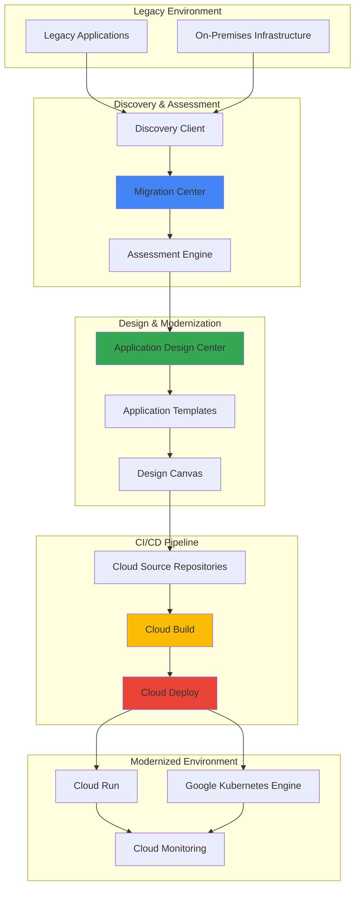

# Legacy Application Architectures with Application Design Center and Migration Center

## Problem

Enterprise organizations struggle with legacy applications that are difficult to scale, maintain, and integrate with modern cloud-native services. These monolithic applications often lack proper documentation, have unclear dependencies, and require significant manual effort to assess migration feasibility. Traditional migration approaches are time-consuming, error-prone, and fail to leverage cloud-native architectural patterns that could improve performance, reduce costs, and enhance developer productivity.

## Solution

Google Cloud's Application Design Center and Migration Center provide a comprehensive framework for discovering, assessing, and modernizing legacy applications. Migration Center automatically discovers existing infrastructure and applications, performs technical assessments, and provides cost estimates for cloud migration. Application Design Center enables visual redesign of applications using cloud-native patterns, while Cloud Build and Cloud Deploy create automated CI/CD pipelines for the modernized applications. This integrated approach reduces migration time, ensures architectural best practices, and establishes modern deployment workflows.

## Architecture Diagram



## Prerequisites

1. Google Cloud project with billing enabled and appropriate permissions
2. gcloud CLI installed and configured
3. Docker installed for containerization
4. Access to legacy application environments for discovery
5. Basic knowledge of containerization and cloud-native architecture patterns
6. Estimated cost: $50-100 for resources during development and testing

> **Note**: Migration Center and Application Design Center are available in specific regions. Check the [Google Cloud documentation](https://cloud.google.com/migration-center/docs/locations) for current availability.

## Preparation

```bash
# Set environment variables for the project
export PROJECT_ID="legacy-modernization-$(date +%s)"
export REGION="us-central1"
export ZONE="us-central1-a"

# Generate unique suffix for resource names
RANDOM_SUFFIX=$(openssl rand -hex 3)
export APP_NAME="legacy-app-${RANDOM_SUFFIX}"
export REPOSITORY_NAME="modernized-apps"
export SERVICE_NAME="modernized-service"

# Set default project and region
gcloud config set project ${PROJECT_ID}
gcloud config set compute/region ${REGION}
gcloud config set compute/zone ${ZONE}

# Enable required APIs
gcloud services enable migrationcenter.googleapis.com \
    applicationdesigncenter.googleapis.com \
    cloudbuild.googleapis.com \
    clouddeploy.googleapis.com \
    run.googleapis.com \
    container.googleapis.com \
    sourcerepo.googleapis.com \
    cloudresourcemanager.googleapis.com

echo "✅ Project configured: ${PROJECT_ID}"
echo "✅ Required APIs enabled"
```

## Steps

1. **Set up Migration Center for Discovery**:

   Migration Center serves as the central hub for discovering and assessing your legacy infrastructure. It uses automated discovery clients to scan your on-premises or cloud environments, collecting detailed information about servers, applications, and dependencies. This comprehensive inventory becomes the foundation for making informed migration decisions and understanding the scope of modernization efforts.

   ```bash
   # Create Migration Center source for discovery
   gcloud migration-center sources create legacy-discovery \
       --location=${REGION} \
       --display-name="Legacy Application Discovery" \
       --description="Automated discovery of legacy applications"
   
   # Get source details
   gcloud migration-center sources describe legacy-discovery \
       --location=${REGION}
   
   echo "✅ Migration Center source created for discovery"
   ```

   The discovery source is now configured to collect information about your legacy environment. This creates a centralized repository for all discovered assets, enabling comprehensive assessment and migration planning with automated dependency mapping.

2. **Deploy Discovery Client for Infrastructure Scanning**:

   The Discovery Client is a lightweight agent that runs in your legacy environment to collect detailed information about servers, applications, and network configurations. It performs non-intrusive scanning, gathering metrics about resource utilization, installed software, and application dependencies. This automated approach ensures comprehensive coverage and reduces manual effort in the assessment process.

   ```bash
   # Download discovery client for your environment
   # Note: This would typically be deployed in your legacy environment
   gcloud migration-center discovery-clients create legacy-client \
       --location=${REGION} \
       --source=legacy-discovery \
       --display-name="Legacy Environment Client"
   
   # Create sample assessment data for demonstration
   cat > sample-assessment.json << EOF
   {
     "servers": [
       {
         "name": "web-server-01",
         "os": "CentOS 7",
         "cpu": 4,
         "memory": "8GB",
         "applications": ["Apache", "PHP", "MySQL"]
       },
       {
         "name": "db-server-01",
         "os": "Ubuntu 18.04",
         "cpu": 8,
         "memory": "16GB",
         "applications": ["PostgreSQL", "Redis"]
       }
     ]
   }
   EOF
   
   echo "✅ Discovery client configured with sample data"
   ```

   The discovery client has been configured to scan your legacy environment. In a real-world scenario, this would be deployed on-premises to continuously monitor and assess your infrastructure, providing real-time insights into application performance and migration readiness.

3. **Create Application Design Center Space**:

   Application Design Center provides a collaborative workspace where teams can design and architect modernized applications using cloud-native patterns. Spaces organize resources by team or project, ensuring proper access control and collaboration. The design canvas enables visual architecture planning with suggested components and connection patterns based on Google Cloud best practices.

   ```bash
   # Create a space for application modernization
   gcloud application-design-center spaces create modernization-space \
       --location=${REGION} \
       --display-name="Legacy App Modernization" \
       --description="Space for modernizing legacy applications"
   
   # List available application templates
   gcloud application-design-center templates list \
       --location=${REGION}
   
   # Create a custom template for modernized applications
   cat > modernized-app-template.yaml << EOF
   apiVersion: applicationdesigncenter.googleapis.com/v1
   kind: ApplicationTemplate
   metadata:
     name: modernized-web-app
   spec:
     description: "Template for modernizing legacy web applications"
     components:
       - type: "cloud-run-service"
         name: "web-service"
       - type: "cloud-sql"
         name: "database"
       - type: "cloud-storage"
         name: "file-storage"
     connections:
       - from: "web-service"
         to: "database"
       - from: "web-service"
         to: "file-storage"
   EOF
   
   echo "✅ Application Design Center space created"
   ```

   The design space is now ready for collaborative application architecture planning. Teams can use the visual canvas to design cloud-native replacements for legacy components, with built-in suggestions for optimal service connections and security configurations.

4. **Design Modernized Application Architecture**:

   Using Application Design Center's visual canvas, you can drag and drop components to create modern, scalable architectures. The platform provides intelligent suggestions for component connections, security configurations, and best practices. This visual approach helps teams understand the new architecture and facilitates communication between technical and business stakeholders.

   ```bash
   # Create application draft from template
   gcloud application-design-center applications create ${APP_NAME} \
       --location=${REGION} \
       --space=modernization-space \
       --template=modernized-web-app \
       --display-name="Modernized Legacy Application"
   
   # Configure application components
   gcloud application-design-center applications update ${APP_NAME} \
       --location=${REGION} \
       --space=modernization-space \
       --update-mask="components" \
       --components='[
         {
           "name": "web-service",
           "type": "cloud-run-service",
           "properties": {
             "cpu": "1",
             "memory": "2Gi",
             "max-instances": "10"
           }
         },
         {
           "name": "database",
           "type": "cloud-sql",
           "properties": {
             "database-version": "POSTGRES_13",
             "tier": "db-f1-micro"
           }
         }
       ]'
   
   echo "✅ Application architecture designed and configured"
   ```

   The modernized application architecture is now defined with cloud-native components that provide scalability, reliability, and cost efficiency. The visual design can be shared with stakeholders and iteratively refined based on requirements and feedback.

5. **Set up Source Repository for Code Management**:

   Cloud Source Repositories provides secure, scalable Git repositories that integrate seamlessly with Google Cloud CI/CD tools. This centralized code management enables version control, collaboration, and automated triggering of build and deployment processes. The repository serves as the foundation for implementing modern DevOps practices and maintaining code quality.

   ```bash
   # Create Cloud Source Repository
   gcloud source repos create ${REPOSITORY_NAME} \
       --project=${PROJECT_ID}
   
   # Clone repository locally
   gcloud source repos clone ${REPOSITORY_NAME} \
       --project=${PROJECT_ID}
   
   # Navigate to repository directory
   cd ${REPOSITORY_NAME}
   
   # Create sample application structure
   mkdir -p src/main/java/com/example
   cat > src/main/java/com/example/Application.java << 'EOF'
   package com.example;
   
   import org.springframework.boot.SpringApplication;
   import org.springframework.boot.autoconfigure.SpringBootApplication;
   import org.springframework.web.bind.annotation.GetMapping;
   import org.springframework.web.bind.annotation.RestController;
   
   @SpringBootApplication
   @RestController
   public class Application {
       public static void main(String[] args) {
           SpringApplication.run(Application.class, args);
       }
       
       @GetMapping("/health")
       public String health() {
           return "Modernized application is running!";
       }
   }
   EOF
   
   # Create Dockerfile for containerization
   cat > Dockerfile << 'EOF'
   FROM openjdk:11-jre-slim
   COPY target/app.jar app.jar
   EXPOSE 8080
   ENTRYPOINT ["java", "-jar", "/app.jar"]
   EOF
   
   # Create build configuration
   cat > pom.xml << 'EOF'
   <?xml version="1.0" encoding="UTF-8"?>
   <project xmlns="http://maven.apache.org/POM/4.0.0">
       <modelVersion>4.0.0</modelVersion>
       <groupId>com.example</groupId>
       <artifactId>modernized-app</artifactId>
       <version>1.0.0</version>
       <packaging>jar</packaging>
       
       <properties>
           <maven.compiler.source>11</maven.compiler.source>
           <maven.compiler.target>11</maven.compiler.target>
       </properties>
       
       <dependencies>
           <dependency>
               <groupId>org.springframework.boot</groupId>
               <artifactId>spring-boot-starter-web</artifactId>
               <version>2.7.0</version>
           </dependency>
       </dependencies>
       
       <build>
           <finalName>app</finalName>
           <plugins>
               <plugin>
                   <groupId>org.springframework.boot</groupId>
                   <artifactId>spring-boot-maven-plugin</artifactId>
               </plugin>
           </plugins>
       </build>
   </project>
   EOF
   
   # Commit initial code
   git add .
   git commit -m "Initial modernized application code"
   git push origin main
   
   echo "✅ Source repository created with sample application"
   ```

   The source repository now contains the modernized application code with proper containerization and build configuration. This establishes the foundation for automated CI/CD processes and enables collaborative development practices.

6. **Configure Cloud Build for Automated CI/CD**:

   Cloud Build provides fully managed continuous integration and continuous deployment capabilities. It automatically builds, tests, and deploys applications based on triggers from source code changes. The build process includes containerization, security scanning, and artifact management, ensuring consistent and reliable deployments while maintaining high security standards.

   ```bash
   # Create Cloud Build configuration
   cat > cloudbuild.yaml << 'EOF'
   steps:
     # Build the application
     - name: 'maven:3.8.1-openjdk-11'
       entrypoint: 'mvn'
       args: ['clean', 'package', '-DskipTests']
       
     # Build Docker image
     - name: 'gcr.io/cloud-builders/docker'
       args: ['build', '-t', 'gcr.io/$PROJECT_ID/modernized-app:$BUILD_ID', '.']
       
     # Push to Container Registry
     - name: 'gcr.io/cloud-builders/docker'
       args: ['push', 'gcr.io/$PROJECT_ID/modernized-app:$BUILD_ID']
       
     # Deploy to Cloud Run
     - name: 'gcr.io/cloud-builders/gcloud'
       args: [
         'run', 'deploy', 'modernized-service',
         '--image', 'gcr.io/$PROJECT_ID/modernized-app:$BUILD_ID',
         '--region', 'us-central1',
         '--platform', 'managed',
         '--allow-unauthenticated'
       ]
       
   images:
     - 'gcr.io/$PROJECT_ID/modernized-app:$BUILD_ID'
     
   options:
     logging: CLOUD_LOGGING_ONLY
   EOF
   
   # Create build trigger
   gcloud builds triggers create cloud-source-repositories \
       --repo=${REPOSITORY_NAME} \
       --branch-pattern="main" \
       --build-config=cloudbuild.yaml \
       --description="Automated build for modernized application"
   
   # Commit build configuration
   git add cloudbuild.yaml
   git commit -m "Add Cloud Build configuration"
   git push origin main
   
   echo "✅ Cloud Build trigger created and configured"
   ```

   The automated CI/CD pipeline is now active and will trigger builds whenever code changes are pushed to the main branch. This enables rapid iteration and deployment of modernized applications with consistent quality and security checks.

7. **Set up Cloud Deploy for Multi-Environment Deployment**:

   Cloud Deploy provides advanced deployment capabilities with progressive rollouts, canary deployments, and multi-environment management. It integrates with Cloud Build to create comprehensive CI/CD pipelines that support modern deployment strategies. This ensures reliable, low-risk deployments across development, staging, and production environments.

   ```bash
   # Create deployment configuration
   cat > skaffold.yaml << 'EOF'
   apiVersion: skaffold/v3
   kind: Config
   build:
     artifacts:
       - image: modernized-app
         docker:
           dockerfile: Dockerfile
   deploy:
     cloudrun:
       projectid: PROJECT_ID
       region: us-central1
   EOF
   
   # Create Cloud Deploy configuration
   cat > clouddeploy.yaml << 'EOF'
   apiVersion: deploy.cloud.google.com/v1
   kind: DeliveryPipeline
   metadata:
     name: modernized-app-pipeline
   description: Deployment pipeline for modernized application
   serialPipeline:
     stages:
       - targetId: development
         profiles: []
       - targetId: staging
         profiles: []
       - targetId: production
         profiles: []
   ---
   apiVersion: deploy.cloud.google.com/v1
   kind: Target
   metadata:
     name: development
   description: Development environment
   run:
     location: projects/PROJECT_ID/locations/us-central1
   ---
   apiVersion: deploy.cloud.google.com/v1
   kind: Target
   metadata:
     name: staging
   description: Staging environment
   run:
     location: projects/PROJECT_ID/locations/us-central1
   ---
   apiVersion: deploy.cloud.google.com/v1
   kind: Target
   metadata:
     name: production
   description: Production environment
   run:
     location: projects/PROJECT_ID/locations/us-central1
   EOF
   
   # Replace PROJECT_ID placeholder
   sed -i "s/PROJECT_ID/${PROJECT_ID}/g" skaffold.yaml clouddeploy.yaml
   
   # Apply Cloud Deploy configuration
   gcloud deploy apply --file=clouddeploy.yaml --region=${REGION}
   
   # Commit deployment configuration
   git add skaffold.yaml clouddeploy.yaml
   git commit -m "Add Cloud Deploy configuration"
   git push origin main
   
   echo "✅ Cloud Deploy pipeline configured for multi-environment deployment"
   ```

   The multi-environment deployment pipeline is now ready to support progressive rollouts across development, staging, and production environments. This enables safe, automated deployments with rollback capabilities and advanced monitoring.

8. **Deploy Application to Cloud Run**:

   Cloud Run provides serverless container hosting with automatic scaling, built-in security, and pay-per-use pricing. It represents the modernized target for legacy applications, offering improved performance, cost efficiency, and operational simplicity. The deployment process includes health checks, traffic allocation, and monitoring configuration.

   ```bash
   # Manually trigger initial build
   gcloud builds submit --config=cloudbuild.yaml .
   
   # Verify Cloud Run service deployment
   gcloud run services describe ${SERVICE_NAME} \
       --region=${REGION} \
       --format="get(status.url)"
   
   # Set up service configuration
   gcloud run services update ${SERVICE_NAME} \
       --region=${REGION} \
       --memory=1Gi \
       --cpu=1 \
       --max-instances=10 \
       --concurrency=80 \
       --timeout=300
   
   # Configure custom domain (optional)
   # gcloud run domain-mappings create \
   #     --service=${SERVICE_NAME} \
   #     --domain=your-domain.com \
   #     --region=${REGION}
   
   echo "✅ Application deployed to Cloud Run"
   ```

   The modernized application is now running on Cloud Run with automatic scaling and built-in security features. The serverless deployment model provides cost efficiency and operational simplicity compared to traditional infrastructure.

9. **Configure Monitoring and Observability**:

   Cloud Monitoring and Cloud Logging provide comprehensive observability for modernized applications. This includes application performance monitoring, error tracking, and custom metrics collection. Proper observability ensures operational excellence and enables proactive issue resolution in the modernized environment.

   ```bash
   # Create custom monitoring dashboard
   cat > monitoring-dashboard.json << EOF
   {
     "displayName": "Modernized Application Dashboard",
     "mosaicLayout": {
       "tiles": [
         {
           "width": 6,
           "height": 4,
           "widget": {
             "title": "Request Count",
             "xyChart": {
               "dataSets": [
                 {
                   "timeSeriesQuery": {
                     "timeSeriesFilter": {
                       "filter": "resource.type=\"cloud_run_revision\" AND resource.labels.service_name=\"${SERVICE_NAME}\""
                     }
                   }
                 }
               ]
             }
           }
         }
       ]
     }
   }
   EOF
   
   # Create monitoring dashboard
   gcloud monitoring dashboards create --config-from-file=monitoring-dashboard.json
   
   # Set up alerting policy
   gcloud alpha monitoring policies create \
       --policy-from-file=<(cat <<EOF
   {
     "displayName": "High Error Rate Alert",
     "conditions": [
       {
         "displayName": "Error rate too high",
         "conditionThreshold": {
           "filter": "resource.type=\"cloud_run_revision\" AND resource.labels.service_name=\"${SERVICE_NAME}\"",
           "comparison": "COMPARISON_GREATER_THAN",
           "thresholdValue": 0.05
         }
       }
     ],
     "alertStrategy": {
       "autoClose": "1800s"
     }
   }
   EOF
   )
   
   echo "✅ Monitoring and alerting configured"
   ```

   Comprehensive monitoring and alerting are now in place to ensure the modernized application maintains high availability and performance. This provides visibility into application behavior and enables rapid response to operational issues.

10. **Create Release Pipeline with Cloud Deploy**:

    Cloud Deploy enables sophisticated release management with progressive deployment strategies, automated rollbacks, and approval workflows. This final step establishes a complete CI/CD pipeline that supports safe, reliable deployments across multiple environments with proper governance and control.

    ```bash
    # Create release from current build
    gcloud deploy releases create release-$(date +%Y%m%d-%H%M%S) \
        --delivery-pipeline=modernized-app-pipeline \
        --region=${REGION} \
        --images=modernized-app=gcr.io/${PROJECT_ID}/modernized-app:latest
    
    # Promote to staging after development validation
    gcloud deploy rollouts advance latest \
        --delivery-pipeline=modernized-app-pipeline \
        --region=${REGION} \
        --release=release-$(date +%Y%m%d-%H%M%S)
    
    # View deployment history
    gcloud deploy releases list \
        --delivery-pipeline=modernized-app-pipeline \
        --region=${REGION}
    
    # Set up automated promotion policies
    cat > promotion-policy.yaml << 'EOF'
    apiVersion: deploy.cloud.google.com/v1
    kind: DeliveryPipeline
    metadata:
      name: modernized-app-pipeline
    description: Automated deployment pipeline with approval gates
    serialPipeline:
      stages:
        - targetId: development
          profiles: []
        - targetId: staging
          profiles: []
          strategy:
            canary:
              canaryDeployment:
                percentages: [25, 50, 100]
              runtimeConfig:
                cloudRun:
                  automaticTrafficControl: true
        - targetId: production
          profiles: []
          strategy:
            canary:
              canaryDeployment:
                percentages: [10, 25, 50, 100]
              runtimeConfig:
                cloudRun:
                  automaticTrafficControl: true
    EOF
    
    gcloud deploy apply --file=promotion-policy.yaml --region=${REGION}
    
    echo "✅ Release pipeline created with automated promotion policies"
    ```

    The comprehensive release pipeline now supports progressive deployments with canary strategies, automated traffic control, and approval workflows. This ensures safe, reliable deployments of modernized applications with minimal risk and maximum control.

## Validation & Testing

1. **Verify Migration Center Discovery**:

   ```bash
   # Check discovery source status
   gcloud migration-center sources describe legacy-discovery \
       --location=${REGION} \
       --format="table(name,displayName,state)"
   
   # List discovered assets
   gcloud migration-center assets list \
       --location=${REGION} \
       --source=legacy-discovery
   ```

   Expected output: Discovery source should be in "ACTIVE" state with discovered assets listed.

2. **Validate Application Design Center Configuration**:

   ```bash
   # Verify space creation
   gcloud application-design-center spaces describe modernization-space \
       --location=${REGION}
   
   # Check application template
   gcloud application-design-center applications describe ${APP_NAME} \
       --location=${REGION} \
       --space=modernization-space
   ```

   Expected output: Space and application should be configured with defined components and connections.

3. **Test CI/CD Pipeline Functionality**:

   ```bash
   # Check build triggers
   gcloud builds triggers list --format="table(name,status,github.name)"
   
   # Verify latest build status
   gcloud builds list --limit=5 --format="table(id,status,source.repoSource.repoName)"
   
   # Test application endpoint
   SERVICE_URL=$(gcloud run services describe ${SERVICE_NAME} \
       --region=${REGION} --format="value(status.url)")
   
   curl -s ${SERVICE_URL}/health
   ```

   Expected output: Build trigger should be enabled, recent builds should be successful, and health endpoint should return "Modernized application is running!"

4. **Validate Cloud Deploy Pipeline**:

   ```bash
   # Check delivery pipeline status
   gcloud deploy delivery-pipelines describe modernized-app-pipeline \
       --region=${REGION} --format="table(name,state)"
   
   # List recent releases
   gcloud deploy releases list \
       --delivery-pipeline=modernized-app-pipeline \
       --region=${REGION} --limit=3
   ```

   Expected output: Pipeline should be in "ACTIVE" state with successful releases listed.

5. **Test Monitoring and Alerting**:

   ```bash
   # Check monitoring dashboard
   gcloud monitoring dashboards list --format="table(name,displayName)"
   
   # Verify Cloud Run metrics
   gcloud monitoring metrics list \
       --filter="resource.type:cloud_run_revision" \
       --format="table(type,displayName)" | head -10
   ```

   Expected output: Dashboard should be created and Cloud Run metrics should be available.

## Cleanup

1. **Remove Cloud Deploy resources**:

   ```bash
   # Delete delivery pipeline
   gcloud deploy delivery-pipelines delete modernized-app-pipeline \
       --region=${REGION} \
       --quiet
   
   echo "✅ Cloud Deploy pipeline deleted"
   ```

2. **Clean up Cloud Build resources**:

   ```bash
   # Delete build triggers
   gcloud builds triggers delete \
       $(gcloud builds triggers list --format="value(id)") \
       --quiet
   
   echo "✅ Build triggers deleted"
   ```

3. **Remove Cloud Run service**:

   ```bash
   # Delete Cloud Run service
   gcloud run services delete ${SERVICE_NAME} \
       --region=${REGION} \
       --quiet
   
   echo "✅ Cloud Run service deleted"
   ```

4. **Delete source repository**:

   ```bash
   # Delete source repository
   gcloud source repos delete ${REPOSITORY_NAME} \
       --quiet
   
   echo "✅ Source repository deleted"
   ```

5. **Clean up Application Design Center resources**:

   ```bash
   # Delete application
   gcloud application-design-center applications delete ${APP_NAME} \
       --location=${REGION} \
       --space=modernization-space \
       --quiet
   
   # Delete space
   gcloud application-design-center spaces delete modernization-space \
       --location=${REGION} \
       --quiet
   
   echo "✅ Application Design Center resources deleted"
   ```

6. **Remove Migration Center resources**:

   ```bash
   # Delete discovery client
   gcloud migration-center discovery-clients delete legacy-client \
       --location=${REGION} \
       --quiet
   
   # Delete source
   gcloud migration-center sources delete legacy-discovery \
       --location=${REGION} \
       --quiet
   
   echo "✅ Migration Center resources deleted"
   ```

7. **Clean up monitoring resources**:

   ```bash
   # Delete monitoring dashboard
   DASHBOARD_ID=$(gcloud monitoring dashboards list \
       --filter="displayName:Modernized Application Dashboard" \
       --format="value(name)")
   
   if [ ! -z "$DASHBOARD_ID" ]; then
       gcloud monitoring dashboards delete $DASHBOARD_ID --quiet
   fi
   
   echo "✅ Monitoring resources cleaned up"
   ```

8. **Remove local repository**:

   ```bash
   # Clean up local repository
   cd ..
   rm -rf ${REPOSITORY_NAME}
   
   echo "✅ Local repository cleaned up"
   ```

## Discussion

This comprehensive approach to legacy application modernization demonstrates the power of Google Cloud's integrated tools for assessment, design, and deployment. Migration Center provides automated discovery and assessment capabilities that significantly reduce the time and effort required to understand complex legacy environments. The platform's ability to analyze dependencies, performance metrics, and migration feasibility helps organizations make informed decisions about which applications to modernize and how to approach the transformation.

Application Design Center represents a paradigm shift in how organizations approach application architecture. By providing a visual, collaborative platform for designing cloud-native applications, it enables both technical and business stakeholders to participate in the modernization process. The template-based approach ensures consistency and adherence to best practices while allowing for customization based on specific requirements. The integration with Google Cloud services through intelligent suggestions and automated configuration reduces the complexity of adopting cloud-native patterns.

The CI/CD pipeline implementation using Cloud Build and Cloud Deploy establishes modern software delivery practices that are essential for maintaining modernized applications. The automated build, test, and deployment processes ensure consistent quality while reducing manual effort and human error. The progressive deployment strategies provided by Cloud Deploy enable safe rollouts with minimal risk, supporting both rapid iteration and production stability. This combination of tools creates a robust foundation for ongoing application development and maintenance.

The monitoring and observability configuration ensures that modernized applications maintain high availability and performance standards. Google Cloud's integrated monitoring capabilities provide comprehensive visibility into application behavior, resource utilization, and user experience. This observability is crucial for identifying issues early, optimizing performance, and ensuring that modernized applications deliver improved business value compared to their legacy predecessors.

> **Tip**: Use Migration Center's cost estimation features to build a business case for modernization initiatives. The platform provides detailed cost comparisons between on-premises and cloud deployments, helping justify investment in modernization projects.

For detailed information about Google Cloud's modernization capabilities, refer to the official documentation:
- [Migration Center Overview](https://cloud.google.com/migration-center/docs/overview)
- [Application Design Center Documentation](https://cloud.google.com/application-design-center/docs/overview)
- [Cloud Build CI/CD Best Practices](https://cloud.google.com/build/docs/ci-cd-overview)
- [Cloud Deploy Progressive Delivery](https://cloud.google.com/deploy/docs/delivery-pipelines)
- [Google Cloud Architecture Framework](https://cloud.google.com/architecture/framework)

## Challenge

Extend this modernization solution by implementing these advanced capabilities:

1. **Implement Multi-Cloud Assessment**: Configure Migration Center to discover and assess workloads across multiple cloud providers, creating a comprehensive view of your hybrid and multi-cloud environment for strategic planning.

2. **Advanced Security Integration**: Integrate Binary Authorization and Container Analysis with the CI/CD pipeline to ensure only verified, secure container images are deployed, implementing policy-based security controls throughout the deployment process.

3. **Automated Performance Testing**: Extend the Cloud Build pipeline to include automated performance testing using tools like Artillery or JMeter, with automatic deployment rollback if performance thresholds are not met.

4. **Cost Optimization Automation**: Implement automated cost analysis and optimization recommendations using Cloud Billing APIs and Cloud Functions, with automatic scaling adjustments based on usage patterns and cost thresholds.

5. **Advanced Monitoring and AIOps**: Configure Google Cloud's AIOps capabilities with custom machine learning models for predictive maintenance, anomaly detection, and automated incident response in the modernized environment.

## Infrastructure Code

*Infrastructure code will be generated after recipe approval.*