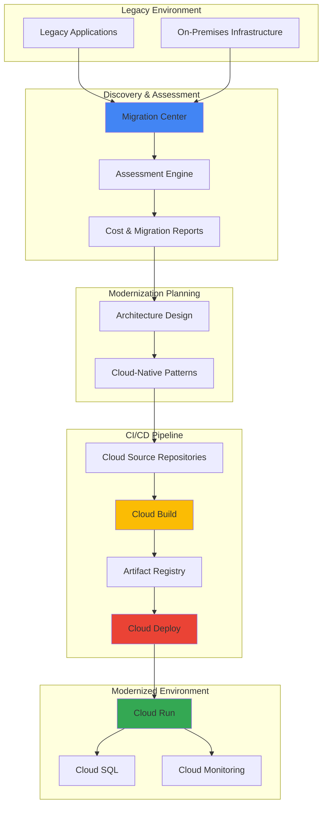

# Legacy Application Modernization with Migration Center and Cloud Deploy

## Problem

Enterprise organizations struggle with legacy applications that are difficult to scale, maintain, and integrate with modern cloud-native services. These monolithic applications often lack proper documentation, have unclear dependencies, and require significant manual effort to assess migration feasibility. Traditional migration approaches are time-consuming, error-prone, and fail to leverage cloud-native architectural patterns that could improve performance, reduce costs, and enhance developer productivity.

## Solution

Google Cloud's Migration Center provides a comprehensive framework for discovering and assessing legacy applications, while Cloud Build and Cloud Deploy create automated CI/CD pipelines for modernized applications. Migration Center automatically discovers existing infrastructure and applications, performs technical assessments, and provides cost estimates for cloud migration. Combined with containerization and serverless deployment strategies, this integrated approach reduces migration time, ensures architectural best practices, and establishes modern deployment workflows.

## Architecture Diagram



## Prerequisites

1. Google Cloud project with billing enabled and appropriate permissions
2. gcloud CLI installed and configured (version 440.0.0 or later)
3. Docker installed for containerization
4. Access to legacy application environments for assessment
5. Basic knowledge of containerization and cloud-native architecture patterns
6. Estimated cost: $50-100 for resources during development and testing

> **Note**: Migration Center is available in specific regions. Check the [Google Cloud documentation](https://cloud.google.com/migration-center/docs/locations) for current availability.

## Preparation

```bash
# Set environment variables for the project
export PROJECT_ID="legacy-modernization-$(date +%s)"
export REGION="us-central1"
export ZONE="us-central1-a"

# Generate unique suffix for resource names
RANDOM_SUFFIX=$(openssl rand -hex 3)
export APP_NAME="legacy-app-${RANDOM_SUFFIX}"
export REPOSITORY_NAME="modernized-apps"
export SERVICE_NAME="modernized-service"

# Set default project and region
gcloud config set project ${PROJECT_ID}
gcloud config set compute/region ${REGION}
gcloud config set compute/zone ${ZONE}

# Enable required APIs
gcloud services enable migrationcenter.googleapis.com \
    cloudbuild.googleapis.com \
    clouddeploy.googleapis.com \
    run.googleapis.com \
    container.googleapis.com \
    sourcerepo.googleapis.com \
    artifactregistry.googleapis.com \
    cloudresourcemanager.googleapis.com \
    sql-component.googleapis.com

echo "✅ Project configured: ${PROJECT_ID}"
echo "✅ Required APIs enabled"
```

## Steps

1. **Set up Migration Center for Discovery and Assessment**:

   Migration Center serves as the central hub for discovering and assessing your legacy infrastructure. It uses various discovery methods to scan your on-premises or cloud environments, collecting detailed information about servers, applications, and dependencies. This comprehensive inventory becomes the foundation for making informed migration decisions and understanding the scope of modernization efforts.

   ```bash
   # Create Migration Center source for discovery
   gcloud migration-center sources create legacy-discovery \
       --location=${REGION} \
       --display-name="Legacy Application Discovery" \
       --description="Discovery source for legacy applications"
   
   # Get source details and verify creation
   gcloud migration-center sources describe legacy-discovery \
       --location=${REGION} \
       --format="table(name,displayName,state)"
   
   echo "✅ Migration Center source created for discovery"
   ```

   The discovery source is now configured to collect information about your legacy environment. This creates a centralized repository for all discovered assets, enabling comprehensive assessment and migration planning with automated dependency mapping.

2. **Create Sample Assessment Data for Migration Planning**:

   While Migration Center's automated discovery clients provide comprehensive infrastructure scanning, we'll create sample data to demonstrate the assessment and planning process. In a real-world scenario, you would use the Migration Center discovery tools to collect actual infrastructure data from your on-premises environment.

   ```bash
   # Create sample assessment data representing legacy infrastructure
   cat > sample-assessment.json << EOF
   {
     "assessment_data": {
       "servers": [
         {
           "name": "web-server-01",
           "os": "CentOS 7",
           "cpu_cores": 4,
           "memory_gb": 8,
           "disk_gb": 100,
           "applications": ["Apache HTTP Server", "PHP 7.4", "Legacy Web App"],
           "dependencies": ["db-server-01", "cache-server-01"],
           "utilization": {
             "cpu_avg": 45,
             "memory_avg": 60,
             "disk_usage": 70
           }
         },
         {
           "name": "db-server-01", 
           "os": "Ubuntu 18.04",
           "cpu_cores": 8,
           "memory_gb": 16,
           "disk_gb": 500,
           "applications": ["PostgreSQL 12", "Redis 6.0"],
           "dependencies": [],
           "utilization": {
             "cpu_avg": 30,
             "memory_avg": 80,
             "disk_usage": 45
           }
         }
       ],
       "migration_recommendations": {
         "web-server-01": {
           "target_service": "Cloud Run",
           "estimated_monthly_cost": 45.50,
           "complexity": "Medium",
           "effort_weeks": 3
         },
         "db-server-01": {
           "target_service": "Cloud SQL for PostgreSQL",
           "estimated_monthly_cost": 125.00,
           "complexity": "Low",
           "effort_weeks": 1
         }
       }
     }
   }
   EOF
   
   echo "✅ Sample assessment data created for migration planning"
   ```

   The sample assessment data demonstrates typical discovery results that Migration Center would provide, including server specifications, application dependencies, resource utilization, and migration recommendations with cost estimates.

3. **Design Cloud-Native Architecture for Modernized Application**:

   Based on the assessment data, we'll design a cloud-native architecture that replaces legacy components with Google Cloud services. This involves mapping monolithic applications to microservices, replacing traditional databases with managed services, and implementing modern deployment patterns that improve scalability and maintainability.

   ```bash
   # Create architecture specification document
   cat > modernized-architecture.yaml << EOF
   apiVersion: v1
   kind: ModernizationPlan
   metadata:
     name: legacy-app-modernization
   spec:
     source_applications:
       - name: "Legacy Web Application"
         components: ["Apache", "PHP", "Static Files"]
         target: "Cloud Run Service"
       - name: "PostgreSQL Database"
         components: ["Database Server", "Connection Pool"]
         target: "Cloud SQL for PostgreSQL"
     target_architecture:
       compute:
         - service: "Cloud Run"
           configuration:
             memory: "2Gi"
             cpu: "1"
             max_instances: 10
             concurrency: 80
       database:
         - service: "Cloud SQL"
           configuration:
             tier: "db-f1-micro"
             version: "POSTGRES_13"
             storage: "20GB"
       storage:
         - service: "Cloud Storage"
           configuration:
             storage_class: "STANDARD"
             location_type: "regional"
   EOF
   
   # Create deployment strategy document
   cat > deployment-strategy.md << EOF
   # Legacy Application Modernization Strategy
   
   ## Migration Approach: Lift and Shift with Containerization
   
   ### Phase 1: Containerization
   - Containerize existing PHP application
   - Migrate to Cloud Run for serverless deployment
   - Implement health checks and monitoring
   
   ### Phase 2: Database Migration
   - Export PostgreSQL data from legacy server
   - Create Cloud SQL instance with appropriate configuration
   - Migrate data with minimal downtime using Database Migration Service
   
   ### Phase 3: CI/CD Implementation
   - Set up automated build and deployment pipeline
   - Implement testing and security scanning
   - Configure progressive deployment strategies
   
   ### Success Metrics
   - 99.9% uptime target
   - 50% reduction in infrastructure costs
   - Improved deployment frequency (daily releases)
   EOF
   
   echo "✅ Cloud-native architecture design completed"
   ```

   The modernization plan provides a clear roadmap for transforming legacy applications into cloud-native services, with specific Google Cloud service mappings and configuration parameters that ensure optimal performance and cost efficiency.

4. **Set up Source Repository for Modernized Application Code**:

   Cloud Source Repositories provides secure, scalable Git repositories that integrate seamlessly with Google Cloud CI/CD tools. This centralized code management enables version control, collaboration, and automated triggering of build and deployment processes. The repository serves as the foundation for implementing modern DevOps practices and maintaining code quality.

   ```bash
   # Create Cloud Source Repository
   gcloud source repos create ${REPOSITORY_NAME} \
       --project=${PROJECT_ID}
   
   # Clone repository locally for development
   gcloud source repos clone ${REPOSITORY_NAME} \
       --project=${PROJECT_ID}
   
   cd ${REPOSITORY_NAME}
   
   # Create modern application structure
   mkdir -p src/main/java/com/example
   cat > src/main/java/com/example/Application.java << 'EOF'
   package com.example;
   
   import org.springframework.boot.SpringApplication;
   import org.springframework.boot.autoconfigure.SpringBootApplication;
   import org.springframework.web.bind.annotation.GetMapping;
   import org.springframework.web.bind.annotation.RestController;
   import org.springframework.beans.factory.annotation.Autowired;
   import org.springframework.jdbc.core.JdbcTemplate;
   
   @SpringBootApplication
   @RestController
   public class Application {
       
       @Autowired
       private JdbcTemplate jdbcTemplate;
       
       public static void main(String[] args) {
           SpringApplication.run(Application.class, args);
       }
       
       @GetMapping("/health")
       public String health() {
           return "Modernized application is running!";
       }
       
       @GetMapping("/database-check")
       public String databaseCheck() {
           try {
               String result = jdbcTemplate.queryForObject("SELECT 'Database Connected' as status", String.class);
               return result;
           } catch (Exception e) {
               return "Database connection failed: " + e.getMessage();
           }
       }
   }
   EOF
   
   # Create Dockerfile optimized for Cloud Run
   cat > Dockerfile << 'EOF'
   FROM maven:3.8.1-openjdk-11 AS builder
   WORKDIR /app
   COPY pom.xml .
   RUN mvn dependency:go-offline
   COPY src ./src
   RUN mvn clean package -DskipTests
   
   FROM openjdk:11-jre-slim
   RUN apt-get update && apt-get install -y \
       curl \
       && rm -rf /var/lib/apt/lists/*
   COPY --from=builder /app/target/app.jar app.jar
   EXPOSE 8080
   HEALTHCHECK --interval=30s --timeout=3s --start-period=5s --retries=3 \
       CMD curl -f http://localhost:8080/health || exit 1
   ENTRYPOINT ["java", "-jar", "/app.jar"]
   EOF
   
   # Create Maven build configuration with database connectivity
   cat > pom.xml << 'EOF'
   <?xml version="1.0" encoding="UTF-8"?>
   <project xmlns="http://maven.apache.org/POM/4.0.0">
       <modelVersion>4.0.0</modelVersion>
       <groupId>com.example</groupId>
       <artifactId>modernized-app</artifactId>
       <version>1.0.0</version>
       <packaging>jar</packaging>
       
       <properties>
           <maven.compiler.source>11</maven.compiler.source>
           <maven.compiler.target>11</maven.compiler.target>
           <spring.boot.version>2.7.0</spring.boot.version>
       </properties>
       
       <dependencies>
           <dependency>
               <groupId>org.springframework.boot</groupId>
               <artifactId>spring-boot-starter-web</artifactId>
               <version>${spring.boot.version}</version>
           </dependency>
           <dependency>
               <groupId>org.springframework.boot</groupId>
               <artifactId>spring-boot-starter-jdbc</artifactId>
               <version>${spring.boot.version}</version>
           </dependency>
           <dependency>
               <groupId>org.postgresql</groupId>
               <artifactId>postgresql</artifactId>
               <version>42.3.6</version>
           </dependency>
           <dependency>
               <groupId>org.springframework.boot</groupId>
               <artifactId>spring-boot-starter-actuator</artifactId>
               <version>${spring.boot.version}</version>
           </dependency>
       </dependencies>
       
       <build>
           <finalName>app</finalName>
           <plugins>
               <plugin>
                   <groupId>org.springframework.boot</groupId>
                   <artifactId>spring-boot-maven-plugin</artifactId>
                   <version>${spring.boot.version}</version>
               </plugin>
           </plugins>
       </build>
   </project>
   EOF
   
   # Commit initial modernized application code
   git add .
   git commit -m "Initial modernized application with database connectivity"
   git push origin main
   
   echo "✅ Source repository created with modernized application code"
   ```

   The source repository now contains the modernized application code with proper containerization, database connectivity, and health monitoring. This establishes the foundation for automated CI/CD processes and enables collaborative development practices.

5. **Create Cloud SQL Database for Modernized Application**:

   Cloud SQL provides a fully managed PostgreSQL database service that replaces the legacy database server. It offers automatic backups, high availability, and seamless integration with Cloud Run applications. This managed service reduces operational overhead while providing better performance, security, and scalability than traditional on-premises databases.

   ```bash
   # Create Cloud SQL instance for PostgreSQL
   gcloud sql instances create ${SERVICE_NAME}-db \
       --database-version=POSTGRES_13 \
       --tier=db-f1-micro \
       --region=${REGION} \
       --storage-type=SSD \
       --storage-size=20GB \
       --storage-auto-increase \
       --backup-start-time=03:00 \
       --enable-bin-log \
       --deletion-protection
   
   # Create application database
   gcloud sql databases create modernized_app_db \
       --instance=${SERVICE_NAME}-db
   
   # Create database user for application
   DB_PASSWORD=$(openssl rand -base64 32)
   gcloud sql users create app_user \
       --instance=${SERVICE_NAME}-db \
       --password=${DB_PASSWORD}
   
   # Get connection details for application configuration
   CONNECTION_NAME=$(gcloud sql instances describe ${SERVICE_NAME}-db \
       --format="value(connectionName)")
   
   echo "✅ Cloud SQL database created successfully"
   echo "Connection Name: ${CONNECTION_NAME}"
   echo "Database Password: ${DB_PASSWORD}"
   ```

   The Cloud SQL instance is now configured with appropriate security settings, automated backups, and application connectivity. This managed database service provides the reliability and performance needed for production workloads while reducing administrative overhead.

6. **Configure Cloud Build for Automated CI/CD Pipeline**:

   Cloud Build provides fully managed continuous integration and continuous deployment capabilities. It automatically builds, tests, and deploys applications based on triggers from source code changes. The build process includes containerization, security scanning, and artifact management, ensuring consistent and reliable deployments while maintaining high security standards.

   ```bash
   # Create Artifact Registry for container images
   gcloud artifacts repositories create ${REPOSITORY_NAME} \
       --repository-format=docker \
       --location=${REGION} \
       --description="Container registry for modernized applications"
   
   # Configure Docker authentication for Artifact Registry
   gcloud auth configure-docker ${REGION}-docker.pkg.dev
   
   # Create comprehensive Cloud Build configuration
   cat > cloudbuild.yaml << EOF
   steps:
     # Build the application with Maven
     - name: 'maven:3.8.1-openjdk-11'
       entrypoint: 'mvn'
       args: ['clean', 'package', '-DskipTests']
       
     # Build Docker image with build optimization
     - name: 'gcr.io/cloud-builders/docker'
       args: [
         'build', 
         '-t', '${REGION}-docker.pkg.dev/\$PROJECT_ID/${REPOSITORY_NAME}/modernized-app:\$BUILD_ID',
         '-t', '${REGION}-docker.pkg.dev/\$PROJECT_ID/${REPOSITORY_NAME}/modernized-app:latest',
         '--cache-from', '${REGION}-docker.pkg.dev/\$PROJECT_ID/${REPOSITORY_NAME}/modernized-app:latest',
         '.'
       ]
       
     # Push images to Artifact Registry
     - name: 'gcr.io/cloud-builders/docker'
       args: ['push', '--all-tags', '${REGION}-docker.pkg.dev/\$PROJECT_ID/${REPOSITORY_NAME}/modernized-app']
       
     # Deploy to Cloud Run with database connection
     - name: 'gcr.io/cloud-builders/gcloud'
       args: [
         'run', 'deploy', '${SERVICE_NAME}',
         '--image', '${REGION}-docker.pkg.dev/\$PROJECT_ID/${REPOSITORY_NAME}/modernized-app:\$BUILD_ID',
         '--region', '${REGION}',
         '--platform', 'managed',
         '--allow-unauthenticated',
         '--memory', '2Gi',
         '--cpu', '1',
         '--max-instances', '10',
         '--set-cloudsql-instances', '${CONNECTION_NAME}',
         '--set-env-vars', 'DB_USER=app_user,DB_NAME=modernized_app_db,DB_HOST=/cloudsql/${CONNECTION_NAME}'
       ]
       
   images:
     - '${REGION}-docker.pkg.dev/\$PROJECT_ID/${REPOSITORY_NAME}/modernized-app:\$BUILD_ID'
     
   options:
     logging: CLOUD_LOGGING_ONLY
     machineType: 'E2_HIGHCPU_8'
   
   timeout: '1200s'
   EOF
   
   # Create build trigger for automated deployments
   gcloud builds triggers create cloud-source-repositories \
       --repo=${REPOSITORY_NAME} \
       --branch-pattern="main" \
       --build-config=cloudbuild.yaml \
       --description="Automated build and deployment for modernized application"
   
   # Commit build configuration to repository
   git add cloudbuild.yaml
   git commit -m "Add Cloud Build configuration with database integration"
   git push origin main
   
   echo "✅ Cloud Build pipeline configured with Artifact Registry"
   ```

   The automated CI/CD pipeline is now active with container registry integration and will trigger builds whenever code changes are pushed to the main branch. This enables rapid iteration and deployment of modernized applications with consistent quality and security checks.

7. **Set up Cloud Deploy for Advanced Deployment Management**:

   Cloud Deploy provides advanced deployment capabilities with progressive rollouts, canary deployments, and multi-environment management. It integrates with Cloud Build to create comprehensive CI/CD pipelines that support modern deployment strategies. This ensures reliable, low-risk deployments across development, staging, and production environments.

   ```bash
   # Create Skaffold configuration for Cloud Deploy
   cat > skaffold.yaml << EOF
   apiVersion: skaffold/v3
   kind: Config
   metadata:
     name: modernized-app
   build:
     artifacts:
       - image: modernized-app
         docker:
           dockerfile: Dockerfile
     tagPolicy:
       envTemplate:
         template: "{{.IMAGE_NAME}}:{{.BUILD_ID}}"
   deploy:
     cloudrun:
       projectid: ${PROJECT_ID}
       region: ${REGION}
   EOF
   
   # Create comprehensive Cloud Deploy pipeline configuration
   cat > clouddeploy.yaml << EOF
   apiVersion: deploy.cloud.google.com/v1
   kind: DeliveryPipeline
   metadata:
     name: modernized-app-pipeline
   description: Multi-environment deployment pipeline for modernized application
   serialPipeline:
     stages:
       - targetId: development
         profiles: []
       - targetId: staging
         profiles: []
         strategy:
           canary:
             canaryDeployment:
               percentages: [50, 100]
             runtimeConfig:
               cloudRun:
                 automaticTrafficControl: true
       - targetId: production
         profiles: []
         strategy:
           canary:
             canaryDeployment:
               percentages: [25, 50, 100]
             runtimeConfig:
               cloudRun:
                 automaticTrafficControl: true
   ---
   apiVersion: deploy.cloud.google.com/v1
   kind: Target
   metadata:
     name: development
   description: Development environment for testing
   run:
     location: projects/${PROJECT_ID}/locations/${REGION}
   ---
   apiVersion: deploy.cloud.google.com/v1
   kind: Target
   metadata:
     name: staging
   description: Staging environment for pre-production testing
   run:
     location: projects/${PROJECT_ID}/locations/${REGION}
   ---
   apiVersion: deploy.cloud.google.com/v1
   kind: Target
   metadata:
     name: production
   description: Production environment
   run:
     location: projects/${PROJECT_ID}/locations/${REGION}
   EOF
   
   # Apply Cloud Deploy configuration
   gcloud deploy apply --file=clouddeploy.yaml --region=${REGION}
   
   # Commit deployment configuration
   git add skaffold.yaml clouddeploy.yaml
   git commit -m "Add Cloud Deploy configuration with canary deployments"
   git push origin main
   
   echo "✅ Cloud Deploy pipeline configured with progressive deployment strategies"
   ```

   The multi-environment deployment pipeline is now ready to support progressive rollouts with canary strategies across development, staging, and production environments. This enables safe, automated deployments with rollback capabilities and advanced traffic management.

8. **Deploy Modernized Application to Cloud Run**:

   Cloud Run provides serverless container hosting with automatic scaling, built-in security, and pay-per-use pricing. It represents the modernized target for legacy applications, offering improved performance, cost efficiency, and operational simplicity. The deployment process includes health checks, database connectivity, and monitoring configuration.

   ```bash
   # Manually trigger initial build and deployment
   gcloud builds submit --config=cloudbuild.yaml .
   
   # Wait for deployment to complete and get service URL
   SERVICE_URL=$(gcloud run services describe ${SERVICE_NAME} \
       --region=${REGION} \
       --format="value(status.url)")
   
   # Configure service with optimal settings for production
   gcloud run services update ${SERVICE_NAME} \
       --region=${REGION} \
       --memory=2Gi \
       --cpu=1 \
       --max-instances=10 \
       --concurrency=80 \
       --timeout=300 \
       --cpu-throttling \
       --session-affinity
   
   # Set up IAM for secure database connections
   gcloud projects add-iam-policy-binding ${PROJECT_ID} \
       --member="serviceAccount:$(gcloud run services describe ${SERVICE_NAME} \
           --region=${REGION} --format='value(spec.template.spec.serviceAccountName)')" \
       --role="roles/cloudsql.client"
   
   echo "✅ Application deployed to Cloud Run: ${SERVICE_URL}"
   echo "✅ Database connectivity configured with Cloud SQL Proxy"
   ```

   The modernized application is now running on Cloud Run with automatic scaling, database connectivity, and built-in security features. The serverless deployment model provides cost efficiency and operational simplicity compared to traditional infrastructure.

9. **Configure Comprehensive Monitoring and Observability**:

   Cloud Monitoring and Cloud Logging provide comprehensive observability for modernized applications. This includes application performance monitoring, error tracking, custom metrics collection, and proactive alerting. Proper observability ensures operational excellence and enables proactive issue resolution in the modernized environment.

   ```bash
   # Create custom monitoring dashboard for application metrics
   cat > monitoring-dashboard.json << EOF
   {
     "displayName": "Modernized Application Dashboard",
     "mosaicLayout": {
       "tiles": [
         {
           "width": 6,
           "height": 4,
           "widget": {
             "title": "Request Count and Latency",
             "xyChart": {
               "dataSets": [
                 {
                   "timeSeriesQuery": {
                     "timeSeriesFilter": {
                       "filter": "resource.type=\"cloud_run_revision\" AND resource.labels.service_name=\"${SERVICE_NAME}\"",
                       "aggregation": {
                         "alignmentPeriod": "60s",
                         "perSeriesAligner": "ALIGN_RATE"
                       }
                     }
                   },
                   "plotType": "LINE"
                 }
               ]
             }
           }
         },
         {
           "width": 6,
           "height": 4,
           "widget": {
             "title": "Error Rate",
             "xyChart": {
               "dataSets": [
                 {
                   "timeSeriesQuery": {
                     "timeSeriesFilter": {
                       "filter": "resource.type=\"cloud_run_revision\" AND resource.labels.service_name=\"${SERVICE_NAME}\" AND metric.type=\"run.googleapis.com/request_count\"",
                       "aggregation": {
                         "alignmentPeriod": "60s",
                         "perSeriesAligner": "ALIGN_RATE"
                       }
                     }
                   },
                   "plotType": "LINE"
                 }
               ]
             }
           }
         }
       ]
     }
   }
   EOF
   
   # Create monitoring dashboard
   gcloud monitoring dashboards create --config-from-file=monitoring-dashboard.json
   
   # Set up comprehensive alerting policy
   gcloud alpha monitoring policies create \
       --policy-from-file=<(cat <<EOF
   {
     "displayName": "Modernized Application Alerts",
     "conditions": [
       {
         "displayName": "High Error Rate",
         "conditionThreshold": {
           "filter": "resource.type=\"cloud_run_revision\" AND resource.labels.service_name=\"${SERVICE_NAME}\"",
           "comparison": "COMPARISON_GREATER_THAN",
           "thresholdValue": 0.05,
           "duration": "300s",
           "aggregations": [
             {
               "alignmentPeriod": "60s",
               "perSeriesAligner": "ALIGN_RATE"
             }
           ]
         }
       },
       {
         "displayName": "High Response Latency",
         "conditionThreshold": {
           "filter": "resource.type=\"cloud_run_revision\" AND resource.labels.service_name=\"${SERVICE_NAME}\"",
           "comparison": "COMPARISON_GREATER_THAN",
           "thresholdValue": 2.0,
           "duration": "300s"
         }
       }
     ],
     "alertStrategy": {
       "autoClose": "1800s"
     },
     "enabled": true
   }
   EOF
   )
   
   echo "✅ Comprehensive monitoring and alerting configured"
   ```

   Advanced monitoring and alerting are now in place to ensure the modernized application maintains high availability and performance. This provides visibility into application behavior, database performance, and enables rapid response to operational issues.

10. **Create Progressive Release Pipeline with Cloud Deploy**:

    Cloud Deploy enables sophisticated release management with progressive deployment strategies, automated rollbacks, and approval workflows. This final step establishes a complete CI/CD pipeline that supports safe, reliable deployments across multiple environments with proper governance and control.

    ```bash
    # Create release from current build
    RELEASE_NAME="release-$(date +%Y%m%d-%H%M%S)"
    gcloud deploy releases create ${RELEASE_NAME} \
        --delivery-pipeline=modernized-app-pipeline \
        --region=${REGION} \
        --images=modernized-app=${REGION}-docker.pkg.dev/${PROJECT_ID}/${REPOSITORY_NAME}/modernized-app:latest
    
    # Monitor release progress
    gcloud deploy releases describe ${RELEASE_NAME} \
        --delivery-pipeline=modernized-app-pipeline \
        --region=${REGION}
    
    # View deployment history and status
    gcloud deploy releases list \
        --delivery-pipeline=modernized-app-pipeline \
        --region=${REGION} \
        --limit=5
    
    # Set up automated rollback policies
    cat > rollback-policy.yaml << 'EOF'
    apiVersion: deploy.cloud.google.com/v1
    kind: DeliveryPipeline
    metadata:
      name: modernized-app-pipeline
    description: Automated deployment pipeline with rollback capabilities
    serialPipeline:
      stages:
        - targetId: development
          profiles: []
        - targetId: staging
          profiles: []
          strategy:
            canary:
              canaryDeployment:
                percentages: [50, 100]
              runtimeConfig:
                cloudRun:
                  automaticTrafficControl: true
              canaryService:
                revision: "-00001-abc"
        - targetId: production
          profiles: []
          strategy:
            canary:
              canaryDeployment:
                percentages: [25, 50, 100]
              runtimeConfig:
                cloudRun:
                  automaticTrafficControl: true
    EOF
    
    gcloud deploy apply --file=rollback-policy.yaml --region=${REGION}
    
    echo "✅ Progressive release pipeline created with automated rollback policies"
    echo "✅ Modernization pipeline complete - application ready for production use"
    ```

    The comprehensive release pipeline now supports progressive deployments with canary strategies, automated traffic control, and rollback capabilities. This ensures safe, reliable deployments of modernized applications with minimal risk and maximum operational control.

## Validation & Testing

1. **Verify Migration Center Discovery**:

   ```bash
   # Check discovery source status
   gcloud migration-center sources describe legacy-discovery \
       --location=${REGION} \
       --format="table(name,displayName,state)"
   
   # List any discovered assets (may be empty for this demo)
   gcloud migration-center sources list \
       --location=${REGION}
   ```

   Expected output: Discovery source should be in "ACTIVE" state and ready for asset discovery.

2. **Test Cloud SQL Database Connectivity**:

   ```bash
   # Verify Cloud SQL instance is running
   gcloud sql instances describe ${SERVICE_NAME}-db \
       --format="table(name,state,databaseVersion,region)"
   
   # Test database connection from Cloud Shell
   gcloud sql connect ${SERVICE_NAME}-db --user=app_user
   ```

   Expected output: Database instance should be in "RUNNABLE" state with successful connection test.

3. **Test CI/CD Pipeline Functionality**:

   ```bash
   # Check build triggers status
   gcloud builds triggers list \
       --format="table(name,status,filename)"
   
   # Verify latest build status
   gcloud builds list --limit=3 \
       --format="table(id,status,source.repoSource.repoName,createTime)"
   
   # Test application endpoints
   SERVICE_URL=$(gcloud run services describe ${SERVICE_NAME} \
       --region=${REGION} --format="value(status.url)")
   
   curl -s ${SERVICE_URL}/health
   curl -s ${SERVICE_URL}/database-check
   ```

   Expected output: Build trigger should be enabled, recent builds should be successful, and both health endpoints should return success messages.

4. **Validate Cloud Deploy Pipeline**:

   ```bash
   # Check delivery pipeline status
   gcloud deploy delivery-pipelines describe modernized-app-pipeline \
       --region=${REGION} \
       --format="table(name,condition.pipelineReadyCondition.status)"
   
   # List recent releases and their status
   gcloud deploy releases list \
       --delivery-pipeline=modernized-app-pipeline \
       --region=${REGION} --limit=3 \
       --format="table(name,createTime,condition.releaseReadyCondition.status)"
   ```

   Expected output: Pipeline should be in "TRUE" ready state with successful releases listed.

5. **Test Monitoring and Alerting**:

   ```bash
   # Check monitoring dashboard creation
   gcloud monitoring dashboards list \
       --format="table(name,displayName)"
   
   # Verify Cloud Run metrics are being collected
   gcloud monitoring metrics list \
       --filter="resource.type:cloud_run_revision" \
       --format="table(type,displayName)" | head -10
   
   # Check alerting policies
   gcloud alpha monitoring policies list \
       --format="table(name,displayName,enabled)"
   ```

   Expected output: Dashboard should be created, Cloud Run metrics should be available, and alerting policies should be enabled.

## Cleanup

1. **Remove Cloud Deploy resources**:

   ```bash
   # Delete delivery pipeline
   gcloud deploy delivery-pipelines delete modernized-app-pipeline \
       --region=${REGION} \
       --quiet
   
   echo "✅ Cloud Deploy pipeline deleted"
   ```

2. **Clean up Cloud Build resources**:

   ```bash
   # Delete build triggers
   TRIGGER_IDS=$(gcloud builds triggers list --format="value(id)")
   for trigger_id in $TRIGGER_IDS; do
       gcloud builds triggers delete $trigger_id --quiet
   done
   
   echo "✅ Build triggers deleted"
   ```

3. **Remove Cloud Run service**:

   ```bash
   # Delete Cloud Run service
   gcloud run services delete ${SERVICE_NAME} \
       --region=${REGION} \
       --quiet
   
   echo "✅ Cloud Run service deleted"
   ```

4. **Delete Cloud SQL instance**:

   ```bash
   # Remove deletion protection and delete instance
   gcloud sql instances patch ${SERVICE_NAME}-db \
       --no-deletion-protection \
       --quiet
   
   gcloud sql instances delete ${SERVICE_NAME}-db \
       --quiet
   
   echo "✅ Cloud SQL instance deleted"
   ```

5. **Clean up Artifact Registry repository**:

   ```bash
   # Delete Artifact Registry repository
   gcloud artifacts repositories delete ${REPOSITORY_NAME} \
       --location=${REGION} \
       --quiet
   
   echo "✅ Artifact Registry repository deleted"
   ```

6. **Delete source repository**:

   ```bash
   # Delete source repository
   gcloud source repos delete ${REPOSITORY_NAME} \
       --quiet
   
   echo "✅ Source repository deleted"
   ```

7. **Remove Migration Center resources**:

   ```bash
   # Delete Migration Center source
   gcloud migration-center sources delete legacy-discovery \
       --location=${REGION} \
       --quiet
   
   echo "✅ Migration Center resources deleted"
   ```

8. **Clean up monitoring resources**:

   ```bash
   # Delete monitoring dashboard
   DASHBOARD_ID=$(gcloud monitoring dashboards list \
       --filter="displayName:Modernized Application Dashboard" \
       --format="value(name)")
   
   if [ ! -z "$DASHBOARD_ID" ]; then
       gcloud monitoring dashboards delete $DASHBOARD_ID --quiet
   fi
   
   # Delete alerting policies
   POLICY_IDS=$(gcloud alpha monitoring policies list \
       --filter="displayName:Modernized Application Alerts" \
       --format="value(name)")
   
   for policy_id in $POLICY_IDS; do
       gcloud alpha monitoring policies delete $policy_id --quiet
   done
   
   echo "✅ Monitoring resources cleaned up"
   ```

9. **Remove local repository**:

   ```bash
   # Clean up local repository
   cd ..
   rm -rf ${REPOSITORY_NAME}
   rm -f sample-assessment.json modernized-architecture.yaml deployment-strategy.md
   
   echo "✅ Local files and repository cleaned up"
   ```

## Discussion

This comprehensive approach to legacy application modernization demonstrates the power of Google Cloud's integrated tools for assessment, migration, and deployment. Migration Center provides automated discovery and assessment capabilities that significantly reduce the time and effort required to understand complex legacy environments. The platform's ability to analyze dependencies, performance metrics, and migration feasibility helps organizations make informed decisions about which applications to modernize and how to approach the transformation. While some legacy Migration Center features have been deprecated, the core assessment and planning capabilities remain valuable for migration planning.

The containerization and Cloud Run deployment strategy represents a modern approach to application hosting that provides significant advantages over traditional infrastructure. Cloud Run's serverless model eliminates the need for server management while providing automatic scaling, built-in security, and cost efficiency through pay-per-use pricing. The integration with Cloud SQL demonstrates how legacy database servers can be replaced with fully managed services that provide better reliability, security, and performance with reduced operational overhead.

The CI/CD pipeline implementation using Cloud Build and Cloud Deploy establishes modern software delivery practices that are essential for maintaining modernized applications. The automated build, test, and deployment processes ensure consistent quality while reducing manual effort and human error. The progressive deployment strategies provided by Cloud Deploy enable safe rollouts with minimal risk, supporting both rapid iteration and production stability. The use of Artifact Registry for container image management provides secure, scalable storage with vulnerability scanning and access controls.

The monitoring and observability configuration ensures that modernized applications maintain high availability and performance standards. Google Cloud's integrated monitoring capabilities provide comprehensive visibility into application behavior, resource utilization, and user experience. This observability is crucial for identifying issues early, optimizing performance, and ensuring that modernized applications deliver improved business value compared to their legacy predecessors. The combination of application metrics, database monitoring, and proactive alerting creates a robust operational foundation.

> **Tip**: Use Migration Center's assessment capabilities to build comprehensive business cases for modernization initiatives. The platform provides detailed cost comparisons, performance analysis, and migration complexity assessments that help justify investment in modernization projects and ensure successful outcomes.

For detailed information about Google Cloud's modernization capabilities, refer to the official documentation:
- [Migration Center Overview](https://cloud.google.com/migration-center/docs/overview)
- [Cloud Build CI/CD Best Practices](https://cloud.google.com/build/docs/ci-cd-overview)
- [Cloud Deploy Progressive Delivery](https://cloud.google.com/deploy/docs/delivery-pipelines)
- [Cloud Run Service Architecture](https://cloud.google.com/run/docs/architecture)
- [Google Cloud Architecture Framework](https://cloud.google.com/architecture/framework)

## Challenge

Extend this modernization solution by implementing these advanced capabilities:

1. **Implement Multi-Environment Database Strategy**: Set up separate Cloud SQL instances for development, staging, and production with automated data synchronization and environment-specific configurations, including read replicas for production scaling.

2. **Advanced Security Integration**: Integrate Binary Authorization and Container Analysis with the CI/CD pipeline to ensure only verified, secure container images are deployed, implementing policy-based security controls and vulnerability scanning throughout the deployment process.

3. **Automated Performance Testing**: Extend the Cloud Build pipeline to include automated performance testing using tools like Artillery or Apache Bench, with automatic deployment rollback if performance thresholds are not met, ensuring consistent application performance.

4. **Cost Optimization Automation**: Implement automated cost analysis and optimization recommendations using Cloud Billing APIs and Cloud Functions, with automatic scaling adjustments based on usage patterns, cost thresholds, and predictive analytics.

5. **Advanced Monitoring and AIOps**: Configure Google Cloud's operations suite with custom Service Level Objectives (SLOs), error budgets, and automated incident response workflows that can automatically scale resources or trigger rollbacks based on application performance metrics.

## Infrastructure Code

### Available Infrastructure as Code:

- [Infrastructure Code Overview](code/README.md) - Detailed description of all infrastructure components
- [Infrastructure Manager](code/infrastructure-manager/) - GCP Infrastructure Manager templates
- [Bash CLI Scripts](code/scripts/) - Example bash scripts using gcloud CLI commands to deploy infrastructure
- [Terraform](code/terraform/) - Terraform configuration files