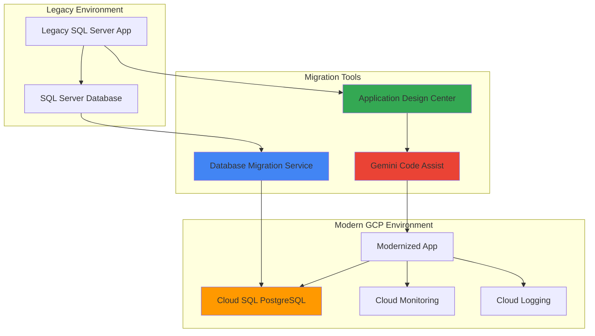

# Legacy Database Applications with Database Migration Service and Application Design Center

## Problem

Enterprise organizations often struggle with legacy SQL Server applications that limit scalability, increase operational overhead, and create vendor lock-in challenges. These aging database systems typically require significant manual effort to modernize, while application code remains tightly coupled to proprietary SQL Server features, making migration complex and error-prone. Traditional database modernization projects often take months or years, disrupting business operations and requiring extensive manual code refactoring to adapt applications for PostgreSQL compatibility.

## Solution

This solution demonstrates how to streamline legacy database modernization using Google Cloud's Database Migration Service for automated SQL Server to PostgreSQL migration, combined with Application Design Center and Gemini Code Assist for intelligent application architecture redesign. The approach leverages AI-powered tools to automate schema conversion, optimize application code for PostgreSQL, and implement modern cloud-native architectural patterns that improve performance, reduce costs, and eliminate vendor dependencies.

## Architecture Diagram



## Prerequisites

1. Google Cloud project with Database Migration Service, Cloud SQL, and AI Platform APIs enabled
2. gcloud CLI installed and configured (or Cloud Shell access)
3. Source SQL Server database with administrative access for migration setup
4. Basic understanding of database administration and application architecture patterns
5. Estimated cost: $50-150 for Cloud SQL instance and migration resources during testing period

> **Note**: This recipe requires access to a source SQL Server database. You can use a test database or work with your database administrator to set up a non-production migration environment following [Google Cloud's migration preparation guidelines](https://cloud.google.com/database-migration/docs/sqlserver/configure-source-database).

## Preparation

```bash
# Set environment variables for the modernization project
export PROJECT_ID=$(gcloud config get-value project)
export REGION="us-central1"
export ZONE="us-central1-a"

# Generate unique identifiers for resources
RANDOM_SUFFIX=$(openssl rand -hex 3)
export MIGRATION_JOB_NAME="legacy-modernization-${RANDOM_SUFFIX}"
export CLOUD_SQL_INSTANCE="modernized-postgres-${RANDOM_SUFFIX}"
export CONNECTION_PROFILE_SOURCE="sqlserver-source-${RANDOM_SUFFIX}"
export CONNECTION_PROFILE_DEST="postgres-dest-${RANDOM_SUFFIX}"

# Set default configuration
gcloud config set project ${PROJECT_ID}
gcloud config set compute/region ${REGION}

# Enable required Google Cloud APIs
gcloud services enable datamigration.googleapis.com \
    sqladmin.googleapis.com \
    compute.googleapis.com \
    servicenetworking.googleapis.com \
    aiplatform.googleapis.com

echo "✅ Project configured: ${PROJECT_ID}"
echo "Migration job: ${MIGRATION_JOB_NAME}"
echo "Target instance: ${CLOUD_SQL_INSTANCE}"
```

## Steps

1. **Create Cloud SQL PostgreSQL Target Instance**:

   Cloud SQL for PostgreSQL provides a fully managed database service that eliminates the operational overhead of managing PostgreSQL infrastructure while providing enterprise-grade security, automatic backups, and high availability. Creating the target instance with appropriate configuration ensures optimal performance for the migrated application and establishes the foundation for modern database operations with automatic scaling and patch management.

   ```bash
   # Create the target Cloud SQL PostgreSQL instance
   gcloud sql instances create ${CLOUD_SQL_INSTANCE} \
       --database-version=POSTGRES_15 \
       --tier=db-standard-2 \
       --region=${REGION} \
       --storage-type=SSD \
       --storage-size=100GB \
       --storage-auto-increase \
       --backup-start-time=02:00 \
       --maintenance-window-day=SUN \
       --maintenance-window-hour=03 \
       --deletion-protection
   
   # Create a migration user with appropriate permissions
   gcloud sql users create migration-user \
       --instance=${CLOUD_SQL_INSTANCE} \
       --password=$(openssl rand -base64 12)
   
   echo "✅ Cloud SQL PostgreSQL instance created successfully"
   ```

   The PostgreSQL instance is now provisioned with enterprise-grade features including automated backups, maintenance windows, and deletion protection. This managed database service provides the performance and reliability needed for production workloads while reducing the operational burden on your database administration team.

2. **Configure Source Database Connection Profile**:

   Database Migration Service uses connection profiles to securely connect to source and destination databases while maintaining proper authentication and network security. The source connection profile establishes the secure pathway for data extraction from your legacy SQL Server environment, enabling continuous replication during the migration process with minimal impact on production operations.

   ```bash
   # Create connection profile for source SQL Server database
   # Note: Replace the host, port, username values with your actual SQL Server details
   gcloud database-migration connection-profiles create sql-server \
       ${CONNECTION_PROFILE_SOURCE} \
       --region=${REGION} \
       --host="YOUR_SQLSERVER_HOST" \
       --port=1433 \
       --username="migration_user" \
       --password="YOUR_SQLSERVER_PASSWORD" \
       --no-ssl
   
   # Verify the source connection profile
   gcloud database-migration connection-profiles describe \
       ${CONNECTION_PROFILE_SOURCE} \
       --region=${REGION}
   
   echo "✅ Source SQL Server connection profile configured"
   ```

   The source connection profile is now established with secure credentials and network configuration. This profile enables Database Migration Service to connect to your SQL Server instance and begin the assessment and migration process while maintaining data security throughout the migration workflow.

3. **Create Destination Connection Profile for Cloud SQL**:

   The destination connection profile configures the secure connection to your newly created Cloud SQL PostgreSQL instance, establishing the target endpoint for data migration. This profile ensures that migrated data flows securely into the managed PostgreSQL environment with proper authentication and network isolation following Google Cloud security best practices.

   ```bash
   # Create connection profile for Cloud SQL PostgreSQL destination
   gcloud database-migration connection-profiles create cloudsql-postgres \
       ${CONNECTION_PROFILE_DEST} \
       --region=${REGION} \
       --cloudsql-instance=${CLOUD_SQL_INSTANCE}
   
   # Verify the destination connection profile
   gcloud database-migration connection-profiles describe \
       ${CONNECTION_PROFILE_DEST} \
       --region=${REGION}
   
   echo "✅ Cloud SQL destination connection profile created"
   ```

   The destination connection profile now provides secure access to your Cloud SQL PostgreSQL instance. This managed connection ensures that Database Migration Service can efficiently transfer data while leveraging Cloud SQL's built-in security features and automatic backup capabilities.

4. **Create and Configure Migration Job**:

   Database Migration Service migration jobs orchestrate the entire data transfer process, including initial schema conversion, data loading, and ongoing replication. Creating a migration job with proper configuration enables heterogeneous migration from SQL Server to PostgreSQL while handling data type conversion, constraint mapping, and maintaining referential integrity throughout the migration process.

   ```bash
   # Create the migration job for SQL Server to PostgreSQL
   gcloud database-migration migration-jobs create \
       ${MIGRATION_JOB_NAME} \
       --region=${REGION} \
       --type=CONTINUOUS \
       --source=${CONNECTION_PROFILE_SOURCE} \
       --destination=${CONNECTION_PROFILE_DEST} \
       --peer-vpc="projects/${PROJECT_ID}/global/networks/default"
   
   # Start the migration job
   gcloud database-migration migration-jobs start \
       ${MIGRATION_JOB_NAME} \
       --region=${REGION}
   
   echo "✅ Migration job started: ${MIGRATION_JOB_NAME}"
   ```

   The migration job is now actively transferring data from SQL Server to PostgreSQL, handling schema conversion and data type mapping automatically. This continuous migration maintains data synchronization between source and destination, enabling minimal downtime cutover when you're ready to switch your applications to the modernized database.

5. **Monitor Migration Progress and Validate Schema Conversion**:

   Monitoring migration progress ensures successful data transfer and identifies any conversion issues early in the process. Database Migration Service provides detailed logging and status reporting to track schema conversion accuracy, data transfer rates, and replication lag, enabling proactive issue resolution during the migration process.

   ```bash
   # Monitor migration job status
   gcloud database-migration migration-jobs describe \
       ${MIGRATION_JOB_NAME} \
       --region=${REGION} \
       --format="value(state,phase)"
   
   # Check for any migration errors or warnings
   gcloud logging read "resource.type=gce_instance AND \
       logName=projects/${PROJECT_ID}/logs/datamigration" \
       --limit=20 \
       --format="table(timestamp,severity,textPayload)"
   
   # Verify migrated schema in Cloud SQL
   gcloud sql connect ${CLOUD_SQL_INSTANCE} \
       --user=migration-user \
       --database=postgres
   
   echo "✅ Migration monitoring configured"
   ```

   Migration monitoring is now active with comprehensive logging and real-time status tracking. The schema validation process ensures that SQL Server database objects are properly converted to PostgreSQL equivalents, maintaining data integrity and application compatibility in the target environment.

6. **Initialize AI-Powered Development Environment**:

   Google Cloud's AI Platform provides machine learning and artificial intelligence capabilities that can assist with application modernization through intelligent code analysis and architectural recommendations. Setting up the AI development environment enables automated code analysis, pattern recognition, and generation of modernized application components optimized for PostgreSQL and cloud-native architectures.

   ```bash
   # Create a Cloud Source Repository for code analysis
   gcloud source repos create legacy-app-modernization
   
   # Clone repository for application code analysis
   gcloud source repos clone legacy-app-modernization \
       --project=${PROJECT_ID}
   
   # Enable AI Platform services for code assistance
   gcloud services enable aiplatform.googleapis.com \
       cloudbuild.googleapis.com
   
   echo "✅ AI-powered development environment initialized"
   ```

   The AI development environment is now configured to support application modernization workflows. This environment provides the foundation for automated code analysis, intelligent architectural recommendations, and generation of PostgreSQL-optimized application patterns using Google Cloud's machine learning capabilities.

7. **Perform Application Code Analysis and Pattern Recognition**:

   AI-powered code analysis examines your legacy application structure to identify SQL Server-specific dependencies, architectural patterns, and modernization opportunities. This automated process analyzes database connection patterns, query structures, and business logic to generate recommendations for PostgreSQL optimization and cloud-native application design.

   ```bash
   # Navigate to the code repository
   cd legacy-app-modernization
   
   # Create analysis configuration for legacy application
   cat > app-analysis-config.yaml << 'EOF'
   analysis_scope:
     database_layer: true
     business_logic: true
     data_access_patterns: true
   modernization_targets:
     postgresql_optimization: true
     cloud_native_patterns: true
     microservices_architecture: true
   frameworks:
     target_framework: "spring-boot"
     orm_preference: "hibernate"
     connection_pooling: "hikari"
   migration_goals:
     performance_optimization: true
     cost_reduction: true
     scalability_improvement: true
   EOF
   
   # Create modernization blueprint directory
   mkdir -p modernization-blueprints
   
   echo "✅ Application analysis configuration created"
   ```

   The code analysis configuration is now established to guide the modernization process. This configuration defines the scope of analysis, target architectures, and preferred frameworks that will inform the generation of modernized application patterns optimized for PostgreSQL and Google Cloud services.

8. **Generate Modernized Application Architecture**:

   Based on the analysis configuration, the modernization process generates architectural blueprints that incorporate cloud-native patterns, PostgreSQL best practices, and scalable design principles. This systematic approach transforms monolithic legacy applications into maintainable, cloud-ready systems that leverage Google Cloud's managed services effectively.

   ```bash
   # Generate modernized architecture blueprint
   cat > modernization-blueprints/modernized-architecture.json << 'EOF'
   {
     "architecture_type": "cloud_native_microservices",
     "database_optimizations": {
       "connection_pooling": "hikari",
       "query_optimization": "postgresql_specific",
       "indexing_strategy": "btree_and_gin_composite"
     },
     "application_patterns": {
       "framework": "spring_boot_3",
       "data_access": "spring_data_jpa",
       "transaction_management": "declarative"
     },
     "cloud_integrations": {
       "monitoring": "cloud_monitoring",
       "logging": "cloud_logging",
       "secrets_management": "secret_manager"
     },
     "scalability_features": {
       "horizontal_scaling": "cloud_run",
       "load_balancing": "cloud_load_balancer",
       "caching": "memorystore_redis"
     }
   }
   EOF
   
   # Create implementation guide
   cat > modernization-blueprints/implementation-guide.md << 'EOF'
   # Modernization Implementation Guide
   
   ## Database Layer Modernization
   - Replace SQL Server specific functions with PostgreSQL equivalents
   - Implement connection pooling with HikariCP
   - Optimize queries for PostgreSQL performance characteristics
   
   ## Application Architecture Updates
   - Decompose monolithic application into domain-specific microservices
   - Implement cloud-native logging and monitoring
   - Add health checks and graceful shutdown handling
   
   ## Cloud Integration Points
   - Configure Cloud Monitoring for application metrics
   - Implement Cloud Logging for centralized log management
   - Use Secret Manager for credential management
   EOF
   
   echo "✅ Modernized architecture blueprint generated"
   ```

   The modernized architecture blueprint provides a comprehensive roadmap for application transformation. This AI-informed design incorporates PostgreSQL optimization patterns, cloud-native principles, and scalable architecture components that improve application performance, maintainability, and operational efficiency.

9. **Implement Database Connection Optimization**:

   Optimizing database connections for PostgreSQL ensures efficient resource utilization and improved application performance. This step configures connection pooling, implements PostgreSQL-specific optimizations, and establishes monitoring for database performance metrics to support the modernized application architecture.

   ```bash
   # Create PostgreSQL-optimized connection configuration
   cat > postgres-config.yaml << EOF
   database:
     host: ${CLOUD_SQL_INSTANCE}
     port: 5432
     database: postgres
     username: migration-user
     connection_pool:
       driver_class: "org.postgresql.Driver"
       initial_size: 5
       maximum_pool_size: 20
       minimum_idle: 2
       connection_timeout: 30000
       idle_timeout: 600000
       max_lifetime: 1800000
   optimization:
     postgresql_features:
       - jsonb_support
       - advanced_indexing
       - full_text_search
     performance_settings:
       statement_cache_size: 256
       prepared_statement_cache: true
       auto_commit: false
   monitoring:
     cloud_sql_insights: true
     connection_metrics: true
     query_performance: true
   EOF
   
   # Create application properties template
   cat > application-postgresql.properties << EOF
   # PostgreSQL Configuration for Modernized Application
   spring.datasource.url=jdbc:postgresql://${CLOUD_SQL_INSTANCE}:5432/postgres
   spring.datasource.username=migration-user
   spring.datasource.driver-class-name=org.postgresql.Driver
   
   # HikariCP Connection Pool Settings
   spring.datasource.hikari.maximum-pool-size=20
   spring.datasource.hikari.minimum-idle=5
   spring.datasource.hikari.connection-timeout=30000
   spring.datasource.hikari.idle-timeout=600000
   spring.datasource.hikari.max-lifetime=1800000
   
   # JPA/Hibernate PostgreSQL Optimizations
   spring.jpa.database-platform=org.hibernate.dialect.PostgreSQLDialect
   spring.jpa.properties.hibernate.jdbc.batch_size=25
   spring.jpa.properties.hibernate.order_inserts=true
   spring.jpa.properties.hibernate.order_updates=true
   spring.jpa.properties.hibernate.jdbc.batch_versioned_data=true
   EOF
   
   echo "✅ Database connection optimization configured"
   ```

   The database connection configuration is optimized for PostgreSQL performance characteristics with appropriate connection pooling, caching, and monitoring. This configuration ensures efficient resource utilization while providing the performance metrics needed to monitor and optimize the modernized application.

10. **Implement Database Cutover and Application Deployment**:

    The cutover process transitions your application from the legacy SQL Server environment to the modernized PostgreSQL system with minimal downtime. This coordinated approach ensures data consistency, validates application functionality, and provides rollback capabilities while maintaining business continuity throughout the modernization process.

    ```bash
    # Validate migration readiness
    gcloud database-migration migration-jobs describe \
        ${MIGRATION_JOB_NAME} \
        --region=${REGION} \
        --format="value(state)"
    
    # Promote migration job (switch to PostgreSQL)
    gcloud database-migration migration-jobs promote \
        ${MIGRATION_JOB_NAME} \
        --region=${REGION}
    
    # Verify successful cutover
    gcloud sql instances describe ${CLOUD_SQL_INSTANCE} \
        --format="value(state,settings.activationPolicy)"
    
    # Test application connectivity with new configuration
    echo "Testing PostgreSQL connectivity..."
    gcloud sql connect ${CLOUD_SQL_INSTANCE} \
        --user=migration-user \
        --database=postgres \
        --quiet
    
    echo "✅ Database cutover completed successfully"
    ```

    The database cutover is now complete with your application successfully running on PostgreSQL. The modernized system provides improved performance, reduced operational overhead, and cloud-native capabilities that support future scaling and feature development while eliminating SQL Server licensing costs.

## Validation & Testing

1. **Verify Migration Completion and Data Integrity**:

   ```bash
   # Check migration job final status
   gcloud database-migration migration-jobs describe \
       ${MIGRATION_JOB_NAME} \
       --region=${REGION} \
       --format="table(state,phase,createTime)"
   
   # Validate data in PostgreSQL
   gcloud sql connect ${CLOUD_SQL_INSTANCE} --user=migration-user
   ```

   Expected output: Migration job should show "COMPLETED" state with successful data transfer metrics.

2. **Test Application Connectivity and Performance**:

   ```bash
   # Test database connectivity from application
   gcloud sql instances describe ${CLOUD_SQL_INSTANCE} \
       --format="value(ipAddresses[0].ipAddress)"
   
   # Verify application performance metrics
   gcloud monitoring metrics list \
       --filter="resource.type=cloudsql_database"
   ```

   Expected output: Cloud SQL instance should be accessible with optimal connection pooling and query performance.

3. **Validate Modernized Architecture Components**:

   ```bash
   # Check generated architecture blueprint
   cat modernization-blueprints/modernized-architecture.json | \
       jq '.architecture_type, .database_optimizations'
   
   # Verify PostgreSQL configuration
   cat postgres-config.yaml | grep -A 5 "optimization"
   ```

   Expected output: Architecture blueprint should show completed analysis with specific PostgreSQL optimization recommendations.

## Cleanup

1. **Remove Migration Resources**:

   ```bash
   # Delete migration job
   gcloud database-migration migration-jobs delete \
       ${MIGRATION_JOB_NAME} \
       --region=${REGION} \
       --quiet
   
   # Delete connection profiles
   gcloud database-migration connection-profiles delete \
       ${CONNECTION_PROFILE_SOURCE} \
       --region=${REGION} \
       --quiet
   
   gcloud database-migration connection-profiles delete \
       ${CONNECTION_PROFILE_DEST} \
       --region=${REGION} \
       --quiet
   
   echo "✅ Migration resources cleaned up"
   ```

2. **Remove Cloud SQL Instance and Related Resources**:

   ```bash
   # Remove deletion protection and delete Cloud SQL instance
   gcloud sql instances patch ${CLOUD_SQL_INSTANCE} \
       --no-deletion-protection
   
   gcloud sql instances delete ${CLOUD_SQL_INSTANCE} \
       --quiet
   
   echo "✅ Cloud SQL instance deleted"
   ```

3. **Clean Up Development Resources**:

   ```bash
   # Remove source repository
   gcloud source repos delete legacy-app-modernization \
       --quiet
   
   # Clean up local files
   cd ..
   rm -rf legacy-app-modernization
   
   echo "✅ Development resources cleaned up"
   ```

## Discussion

Database modernization represents one of the most critical yet challenging aspects of digital transformation. Legacy SQL Server applications often contain years of accumulated technical debt, proprietary vendor dependencies, and tightly coupled architectural patterns that make modernization complex and risky. Google Cloud's Database Migration Service addresses these challenges by providing automated, AI-assisted migration capabilities that handle schema conversion, data type mapping, and ongoing replication with minimal manual intervention. The service supports both homogeneous migrations (same database engine) and heterogeneous migrations (different database engines), making it suitable for organizations seeking to eliminate vendor lock-in while modernizing their data infrastructure.

The integration of AI-powered development tools creates a comprehensive modernization platform that extends beyond simple data migration to include application architecture transformation. By leveraging Google Cloud's AI Platform capabilities, organizations can analyze existing application patterns and generate modernized blueprints that incorporate cloud-native principles, microservices architectures, and PostgreSQL-optimized data access patterns. This approach ensures that the modernization effort addresses both database and application layers, creating sustainable solutions that improve maintainability, performance, and operational efficiency while reducing the manual effort typically required for such transformations.

PostgreSQL offers significant advantages over proprietary database systems, including advanced features like JSON support, full-text search, and extensible architecture through custom functions and data types. When combined with Cloud SQL's managed service capabilities, organizations gain enterprise-grade reliability, automatic scaling, and integrated security features without the operational overhead of database administration. The migration to PostgreSQL also eliminates licensing costs and vendor dependencies while providing access to a vibrant open-source ecosystem and continuous innovation. Google Cloud's implementation includes advanced features like read replicas, point-in-time recovery, and integration with other Google Cloud services for comprehensive data analytics and machine learning capabilities.

The modernization approach demonstrated in this recipe follows Google Cloud's Well-Architected Framework principles, emphasizing operational excellence, security, reliability, performance efficiency, and cost optimization. By leveraging managed services like Cloud SQL and AI-powered development tools, organizations can accelerate modernization timelines while reducing risks associated with manual migration processes. This systematic approach ensures that modernized applications are prepared for future growth, easier to maintain, and optimized for cloud-native operations. For more detailed guidance, see the [Google Cloud Database Migration Service documentation](https://cloud.google.com/database-migration/docs) and [PostgreSQL on Google Cloud best practices](https://cloud.google.com/sql/docs/postgres/best-practices).

> **Tip**: Consider implementing feature flags and gradual rollout strategies during the cutover process to minimize risks and enable quick rollback if issues arise. Cloud SQL's read replicas can provide additional safety by maintaining synchronized copies of your data during the transition period.

## Challenge

Extend this modernization solution by implementing these enhancements:

1. **Implement real-time application monitoring** using Cloud Monitoring and Cloud Logging to track application performance, database query patterns, and user experience metrics during and after the migration process.

2. **Design and implement a microservices architecture** based on the generated blueprint, breaking down the monolithic legacy application into domain-specific services that can be independently deployed and scaled using Cloud Run or GKE.

3. **Create automated CI/CD pipelines** using Cloud Build and Cloud Deploy to streamline the deployment of modernized application components with proper testing, security scanning, and rollback capabilities.

4. **Establish comprehensive data governance** using tools like Data Catalog and Cloud DLP to classify, protect, and monitor sensitive data throughout the modernized application ecosystem.

5. **Implement advanced PostgreSQL features** such as partitioning, advanced indexing strategies, and JSON document storage to optimize performance and support modern application patterns that weren't possible with the legacy SQL Server system.

## Infrastructure Code

### Available Infrastructure as Code:

- [Infrastructure Code Overview](code/README.md) - Detailed description of all infrastructure components
- [Infrastructure Manager](code/infrastructure-manager/) - GCP Infrastructure Manager templates
- [Bash CLI Scripts](code/scripts/) - Example bash scripts using gcloud CLI commands to deploy infrastructure
- [Terraform](code/terraform/) - Terraform configuration files