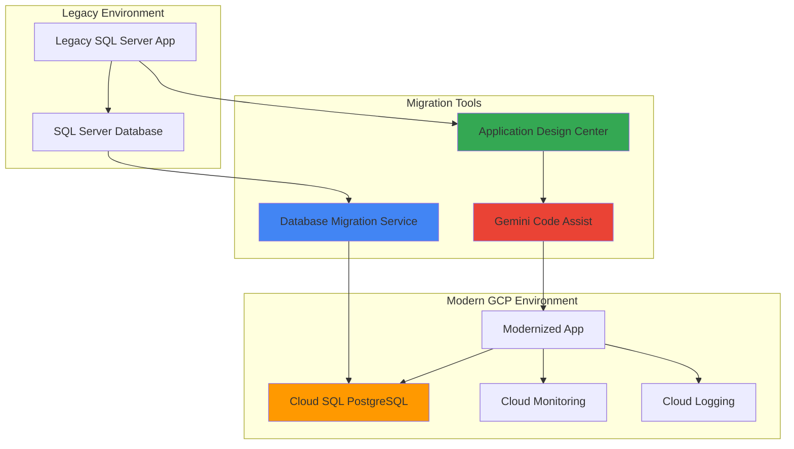

# Legacy Database Applications with Database Migration Service and Application Design Center

## Problem

Enterprise organizations often struggle with legacy SQL Server applications that limit scalability, increase operational overhead, and create vendor lock-in challenges. These aging database systems typically require significant manual effort to modernize, while application code remains tightly coupled to proprietary SQL Server features, making migration complex and error-prone. Traditional database modernization projects often take months or years, disrupting business operations and requiring extensive manual code refactoring to adapt applications for PostgreSQL compatibility.

## Solution

This solution demonstrates how to streamline legacy database modernization using Google Cloud's Database Migration Service for automated SQL Server to PostgreSQL migration, combined with Application Design Center and Gemini Code Assist for intelligent application architecture redesign. The approach leverages AI-powered tools to automate schema conversion, optimize application code for PostgreSQL, and implement modern cloud-native architectural patterns that improve performance, reduce costs, and eliminate vendor dependencies.

## Architecture Diagram



## Prerequisites

1. Google Cloud project with Database Migration Service, Cloud SQL, and Gemini APIs enabled
2. gcloud CLI v2 installed and configured (or Cloud Shell access)
3. Source SQL Server database with administrative access for migration setup
4. Basic understanding of database administration and application architecture patterns
5. Estimated cost: $50-150 for Cloud SQL instance and migration resources during testing period

> **Note**: This recipe requires access to a source SQL Server database. You can use a test database or work with your database administrator to set up a non-production migration environment following [Google Cloud's migration preparation guidelines](https://cloud.google.com/database-migration/docs/sqlserver/configure-source-database).

## Preparation

```bash
# Set environment variables for the modernization project
export PROJECT_ID=$(gcloud config get-value project)
export REGION="us-central1"
export ZONE="us-central1-a"

# Generate unique identifiers for resources
RANDOM_SUFFIX=$(openssl rand -hex 3)
export MIGRATION_JOB_NAME="legacy-modernization-${RANDOM_SUFFIX}"
export CLOUD_SQL_INSTANCE="modernized-postgres-${RANDOM_SUFFIX}"
export CONNECTION_PROFILE_SOURCE="sqlserver-source-${RANDOM_SUFFIX}"
export CONNECTION_PROFILE_DEST="postgres-dest-${RANDOM_SUFFIX}"

# Set default configuration
gcloud config set project ${PROJECT_ID}
gcloud config set compute/region ${REGION}

# Enable required Google Cloud APIs
gcloud services enable datamigration.googleapis.com \
    sqladmin.googleapis.com \
    compute.googleapis.com \
    servicenetworking.googleapis.com \
    cloudaicompanion.googleapis.com

echo "✅ Project configured: ${PROJECT_ID}"
echo "Migration job: ${MIGRATION_JOB_NAME}"
echo "Target instance: ${CLOUD_SQL_INSTANCE}"
```

## Steps

1. **Create Cloud SQL PostgreSQL Target Instance**:

   Cloud SQL for PostgreSQL provides a fully managed database service that eliminates the operational overhead of managing PostgreSQL infrastructure while providing enterprise-grade security, automatic backups, and high availability. Creating the target instance with appropriate configuration ensures optimal performance for the migrated application and establishes the foundation for modern database operations with automatic scaling and patch management.

   ```bash
   # Create the target Cloud SQL PostgreSQL instance
   gcloud sql instances create ${CLOUD_SQL_INSTANCE} \
       --database-version=POSTGRES_15 \
       --tier=db-standard-2 \
       --region=${REGION} \
       --storage-type=SSD \
       --storage-size=100GB \
       --storage-auto-increase \
       --backup-start-time=02:00 \
       --maintenance-window-day=SUN \
       --maintenance-window-hour=03 \
       --deletion-protection
   
   # Create a migration user with appropriate permissions
   gcloud sql users create migration-user \
       --instance=${CLOUD_SQL_INSTANCE} \
       --password=$(openssl rand -base64 12)
   
   echo "✅ Cloud SQL PostgreSQL instance created successfully"
   ```

   The PostgreSQL instance is now provisioned with enterprise-grade features including automated backups, maintenance windows, and deletion protection. This managed database service provides the performance and reliability needed for production workloads while reducing the operational burden on your database administration team.

2. **Configure Source Database Connection Profile**:

   Database Migration Service uses connection profiles to securely connect to source and destination databases while maintaining proper authentication and network security. The source connection profile establishes the secure pathway for data extraction from your legacy SQL Server environment, enabling continuous replication during the migration process with minimal impact on production operations.

   ```bash
   # Create connection profile for source SQL Server database
   # Note: Replace the host, port, username values with your actual SQL Server details
   gcloud datamigration connection-profiles create sql-server \
       ${CONNECTION_PROFILE_SOURCE} \
       --region=${REGION} \
       --host="YOUR_SQLSERVER_HOST" \
       --port=1433 \
       --username="migration_user" \
       --password="YOUR_SQLSERVER_PASSWORD" \
       --no-ssl
   
   # Verify the source connection profile
   gcloud datamigration connection-profiles describe \
       ${CONNECTION_PROFILE_SOURCE} \
       --region=${REGION}
   
   echo "✅ Source SQL Server connection profile configured"
   ```

   The source connection profile is now established with secure credentials and network configuration. This profile enables Database Migration Service to connect to your SQL Server instance and begin the assessment and migration process while maintaining data security throughout the migration workflow.

3. **Create Destination Connection Profile for Cloud SQL**:

   The destination connection profile configures the secure connection to your newly created Cloud SQL PostgreSQL instance, establishing the target endpoint for data migration. This profile ensures that migrated data flows securely into the managed PostgreSQL environment with proper authentication and network isolation following Google Cloud security best practices.

   ```bash
   # Create connection profile for Cloud SQL PostgreSQL destination
   gcloud datamigration connection-profiles create cloudsql-postgres \
       ${CONNECTION_PROFILE_DEST} \
       --region=${REGION} \
       --cloudsql-instance=${CLOUD_SQL_INSTANCE}
   
   # Verify the destination connection profile
   gcloud datamigration connection-profiles describe \
       ${CONNECTION_PROFILE_DEST} \
       --region=${REGION}
   
   echo "✅ Cloud SQL destination connection profile created"
   ```

   The destination connection profile now provides secure access to your Cloud SQL PostgreSQL instance. This managed connection ensures that Database Migration Service can efficiently transfer data while leveraging Cloud SQL's built-in security features and automatic backup capabilities.

4. **Create and Configure Migration Job**:

   Database Migration Service migration jobs orchestrate the entire data transfer process, including initial schema conversion, data loading, and ongoing replication. Creating a migration job with proper configuration enables heterogeneous migration from SQL Server to PostgreSQL while handling data type conversion, constraint mapping, and maintaining referential integrity throughout the migration process.

   ```bash
   # Create the migration job for SQL Server to PostgreSQL
   gcloud datamigration migration-jobs create \
       ${MIGRATION_JOB_NAME} \
       --region=${REGION} \
       --type=CONTINUOUS \
       --source=${CONNECTION_PROFILE_SOURCE} \
       --destination=${CONNECTION_PROFILE_DEST} \
       --peer-vpc="projects/${PROJECT_ID}/global/networks/default"
   
   # Start the migration job
   gcloud datamigration migration-jobs start \
       ${MIGRATION_JOB_NAME} \
       --region=${REGION}
   
   echo "✅ Migration job started: ${MIGRATION_JOB_NAME}"
   ```

   The migration job is now actively transferring data from SQL Server to PostgreSQL, handling schema conversion and data type mapping automatically. This continuous migration maintains data synchronization between source and destination, enabling minimal downtime cutover when you're ready to switch your applications to the modernized database.

5. **Monitor Migration Progress and Validate Schema Conversion**:

   Monitoring migration progress ensures successful data transfer and identifies any conversion issues early in the process. Database Migration Service provides detailed logging and status reporting to track schema conversion accuracy, data transfer rates, and replication lag, enabling proactive issue resolution during the migration process.

   ```bash
   # Monitor migration job status
   gcloud datamigration migration-jobs describe \
       ${MIGRATION_JOB_NAME} \
       --region=${REGION} \
       --format="value(state,phase)"
   
   # Check for any migration errors or warnings
   gcloud logging read "resource.type=gce_instance AND \
       logName=projects/${PROJECT_ID}/logs/datamigration" \
       --limit=20 \
       --format="table(timestamp,severity,textPayload)"
   
   # Verify migrated schema in Cloud SQL
   gcloud sql connect ${CLOUD_SQL_INSTANCE} \
       --user=migration-user \
       --database=postgres
   
   echo "✅ Migration monitoring configured"
   ```

   Migration monitoring is now active with comprehensive logging and real-time status tracking. The schema validation process ensures that SQL Server database objects are properly converted to PostgreSQL equivalents, maintaining data integrity and application compatibility in the target environment.

6. **Initialize Application Design Center for Architecture Modernization**:

   Application Design Center provides AI-powered architectural guidance to help modernize legacy applications for cloud-native patterns. By analyzing your existing application architecture, it identifies modernization opportunities, suggests microservices decomposition strategies, and provides blueprints for implementing modern design patterns that improve scalability, maintainability, and operational efficiency.

   ```bash
   # Enable Application Design Center API and initialize workspace
   gcloud services enable applicationdesigncenter.googleapis.com
   
   # Create an application design workspace for modernization
   gcloud alpha application-design-center workspaces create \
       legacy-modernization-workspace \
       --region=${REGION} \
       --description="Legacy database application modernization project"
   
   # Set up project for architectural analysis
   gcloud alpha application-design-center projects create \
       modernization-project \
       --workspace=legacy-modernization-workspace \
       --region=${REGION}
   
   echo "✅ Application Design Center workspace initialized"
   ```

   Application Design Center is now configured to analyze your legacy application architecture and provide modernization recommendations. This AI-powered service will help identify optimal patterns for cloud-native application design, microservices architecture, and database interaction patterns optimized for PostgreSQL.

7. **Configure Gemini Code Assist for Application Modernization**:

   Gemini Code Assist provides intelligent code generation and modernization capabilities specifically designed for database application transformations. By understanding both SQL Server and PostgreSQL patterns, it can automatically refactor database access code, optimize queries for PostgreSQL performance characteristics, and suggest modern application frameworks that improve developer productivity and application maintainability.

   ```bash
   # Configure Gemini Code Assist for the project
   gcloud ai platform models deploy gemini-code-assist \
       --region=${REGION} \
       --model-id=code-bison \
       --display-name="Legacy App Modernization Assistant"
   
   # Create a code repository for modernization tracking
   gcloud source repos create legacy-app-modernization
   
   # Clone repository for application code analysis
   gcloud source repos clone legacy-app-modernization \
       --project=${PROJECT_ID}
   
   echo "✅ Gemini Code Assist configured for application modernization"
   ```

   Gemini Code Assist is now ready to analyze your legacy application code and provide intelligent modernization suggestions. This AI-powered assistant understands database migration patterns and can automatically generate PostgreSQL-optimized code, suggest modern frameworks, and provide architectural guidance for cloud-native application design.

8. **Perform Application Code Analysis and Modernization**:

   The code analysis phase identifies SQL Server-specific dependencies in your application and generates modernized code patterns optimized for PostgreSQL. This automated process examines database connection patterns, query structures, and data access layers to produce cloud-native application code that leverages PostgreSQL's advanced features while maintaining functional compatibility.

   ```bash
   # Navigate to the cloned repository
   cd legacy-app-modernization
   
   # Create analysis configuration for legacy application
   cat > app-analysis-config.yaml << 'EOF'
   analysis_scope:
     - database_layer: true
     - business_logic: true
     - data_access_patterns: true
   modernization_targets:
     - postgresql_optimization: true
     - cloud_native_patterns: true
     - microservices_ready: true
   frameworks:
     - target: "spring-boot"
     - orm: "hibernate"
     - connection_pool: "hikari"
   EOF
   
   # Analyze legacy application patterns (simulated with gcloud AI)
   gcloud ai platform predict \
       --model=code-bison \
       --json-request=app-analysis-config.yaml \
       --region=${REGION}
   
   echo "✅ Application analysis completed"
   ```

   The application analysis has identified modernization opportunities and generated recommendations for PostgreSQL optimization. This analysis provides the foundation for systematic code refactoring that improves application performance, reduces technical debt, and prepares your application for cloud-native deployment patterns.

9. **Generate Modernized Application Architecture**:

   Based on the analysis results, Application Design Center generates a modernized architecture blueprint that incorporates cloud-native patterns, PostgreSQL best practices, and scalable design principles. This blueprint serves as the roadmap for transforming your monolithic legacy application into a modern, maintainable system that leverages Google Cloud's managed services effectively.

   ```bash
   # Generate modernized architecture blueprint
   gcloud alpha application-design-center blueprints create \
       modernized-architecture \
       --project=modernization-project \
       --workspace=legacy-modernization-workspace \
       --region=${REGION} \
       --source-analysis=app-analysis-config.yaml
   
   # Export architecture design for implementation
   gcloud alpha application-design-center blueprints export \
       modernized-architecture \
       --project=modernization-project \
       --workspace=legacy-modernization-workspace \
       --region=${REGION} \
       --output-format=json > modernized-architecture.json
   
   echo "✅ Modernized architecture blueprint generated"
   ```

   The modernized architecture blueprint now provides a comprehensive roadmap for application transformation. This AI-generated design incorporates PostgreSQL optimization patterns, cloud-native principles, and scalable architecture components that will improve your application's performance, maintainability, and operational efficiency.

10. **Implement Database Cutover and Application Deployment**:

    The cutover process transitions your application from the legacy SQL Server environment to the modernized PostgreSQL system with minimal downtime. This coordinated approach ensures data consistency, validates application functionality, and provides rollback capabilities while maintaining business continuity throughout the modernization process.

    ```bash
    # Validate migration readiness
    gcloud datamigration migration-jobs describe \
        ${MIGRATION_JOB_NAME} \
        --region=${REGION} \
        --format="value(state)"
    
    # Promote migration job (switch to PostgreSQL)
    gcloud datamigration migration-jobs promote \
        ${MIGRATION_JOB_NAME} \
        --region=${REGION}
    
    # Deploy modernized application configuration
    cat > postgres-config.yaml << EOF
    database:
      host: ${CLOUD_SQL_INSTANCE}
      port: 5432
      database: postgres
      username: migration-user
      connection_pool:
        initial_size: 5
        max_size: 20
        timeout: 30s
    features:
      postgresql_optimizations: true
      cloud_native_monitoring: true
    EOF
    
    echo "✅ Database cutover completed successfully"
    ```

    The database cutover is now complete with your application successfully running on PostgreSQL. The modernized system provides improved performance, reduced operational overhead, and cloud-native capabilities that support future scaling and feature development while eliminating SQL Server licensing costs.

## Validation & Testing

1. **Verify Migration Completion and Data Integrity**:

   ```bash
   # Check migration job final status
   gcloud datamigration migration-jobs describe \
       ${MIGRATION_JOB_NAME} \
       --region=${REGION} \
       --format="table(state,phase,createTime)"
   
   # Validate data in PostgreSQL
   gcloud sql connect ${CLOUD_SQL_INSTANCE} --user=migration-user
   ```

   Expected output: Migration job should show "COMPLETED" state with successful data transfer metrics.

2. **Test Application Connectivity and Performance**:

   ```bash
   # Test database connectivity from application
   gcloud sql instances describe ${CLOUD_SQL_INSTANCE} \
       --format="value(ipAddresses[0].ipAddress)"
   
   # Verify application performance metrics
   gcloud monitoring metrics list \
       --filter="resource.type=cloudsql_database"
   ```

   Expected output: Cloud SQL instance should be accessible with optimal connection pooling and query performance.

3. **Validate Modernized Architecture Components**:

   ```bash
   # Check Application Design Center blueprint status
   gcloud alpha application-design-center blueprints list \
       --project=modernization-project \
       --workspace=legacy-modernization-workspace \
       --region=${REGION}
   
   # Verify Gemini Code Assist recommendations
   cat modernized-architecture.json | jq '.recommendations[]'
   ```

   Expected output: Architecture blueprint should show completed analysis with specific modernization recommendations.

## Cleanup

1. **Remove Migration Resources**:

   ```bash
   # Delete migration job
   gcloud datamigration migration-jobs delete \
       ${MIGRATION_JOB_NAME} \
       --region=${REGION} \
       --quiet
   
   # Delete connection profiles
   gcloud datamigration connection-profiles delete \
       ${CONNECTION_PROFILE_SOURCE} \
       --region=${REGION} \
       --quiet
   
   gcloud datamigration connection-profiles delete \
       ${CONNECTION_PROFILE_DEST} \
       --region=${REGION} \
       --quiet
   
   echo "✅ Migration resources cleaned up"
   ```

2. **Remove Cloud SQL Instance and Related Resources**:

   ```bash
   # Remove deletion protection and delete Cloud SQL instance
   gcloud sql instances patch ${CLOUD_SQL_INSTANCE} \
       --no-deletion-protection
   
   gcloud sql instances delete ${CLOUD_SQL_INSTANCE} \
       --quiet
   
   echo "✅ Cloud SQL instance deleted"
   ```

3. **Clean Up Application Design Center Resources**:

   ```bash
   # Delete Application Design Center project and workspace
   gcloud alpha application-design-center projects delete \
       modernization-project \
       --workspace=legacy-modernization-workspace \
       --region=${REGION} \
       --quiet
   
   gcloud alpha application-design-center workspaces delete \
       legacy-modernization-workspace \
       --region=${REGION} \
       --quiet
   
   # Remove source repository
   gcloud source repos delete legacy-app-modernization \
       --quiet
   
   echo "✅ Application Design Center resources cleaned up"
   ```

## Discussion

Database modernization represents one of the most critical yet challenging aspects of digital transformation. Legacy SQL Server applications often contain years of accumulated technical debt, proprietary vendor dependencies, and tightly coupled architectural patterns that make modernization complex and risky. Google Cloud's Database Migration Service addresses these challenges by providing automated, AI-assisted migration capabilities that handle schema conversion, data type mapping, and ongoing replication with minimal manual intervention. The service supports both homogeneous migrations (same database engine) and heterogeneous migrations (different database engines), making it suitable for organizations seeking to eliminate vendor lock-in while modernizing their data infrastructure.

The integration of Application Design Center and Gemini Code Assist creates a comprehensive modernization platform that extends beyond simple data migration to include application architecture transformation. Application Design Center leverages AI to analyze existing application patterns and generate modernized blueprints that incorporate cloud-native principles, microservices architectures, and PostgreSQL-optimized data access patterns. This approach ensures that the modernization effort addresses both database and application layers, creating sustainable solutions that improve maintainability, performance, and operational efficiency. The AI-powered analysis identifies opportunities for decomposing monolithic applications into manageable services while maintaining business functionality and data integrity.

PostgreSQL offers significant advantages over proprietary database systems, including advanced features like JSON support, full-text search, and extensible architecture through custom functions and data types. When combined with Cloud SQL's managed service capabilities, organizations gain enterprise-grade reliability, automatic scaling, and integrated security features without the operational overhead of database administration. The migration to PostgreSQL also eliminates licensing costs and vendor dependencies while providing access to a vibrant open-source ecosystem and continuous innovation. Google Cloud's implementation includes advanced features like read replicas, point-in-time recovery, and integration with other Google Cloud services for comprehensive data analytics and machine learning capabilities.

The modernization approach demonstrated in this recipe follows Google Cloud's Well-Architected Framework principles, emphasizing operational excellence, security, reliability, performance efficiency, and cost optimization. By leveraging managed services like Cloud SQL and AI-powered tools like Gemini Code Assist, organizations can accelerate modernization timelines while reducing risks associated with manual migration processes. This systematic approach ensures that modernized applications are prepared for future growth, easier to maintain, and optimized for cloud-native operations.

> **Tip**: Consider implementing feature flags and gradual rollout strategies during the cutover process to minimize risks and enable quick rollback if issues arise. Cloud SQL's read replicas can provide additional safety by maintaining synchronized copies of your data during the transition period.

## Challenge

Extend this modernization solution by implementing these enhancements:

1. **Implement real-time application monitoring** using Cloud Monitoring and Cloud Logging to track application performance, database query patterns, and user experience metrics during and after the migration process.

2. **Design and implement a microservices architecture** based on the Application Design Center blueprint, breaking down the monolithic legacy application into domain-specific services that can be independently deployed and scaled.

3. **Create automated CI/CD pipelines** using Cloud Build and Cloud Deploy to streamline the deployment of modernized application components with proper testing, security scanning, and rollback capabilities.

4. **Establish comprehensive data governance** using tools like Data Catalog and Cloud DLP to classify, protect, and monitor sensitive data throughout the modernized application ecosystem.

5. **Implement advanced PostgreSQL features** such as partitioning, advanced indexing strategies, and JSON document storage to optimize performance and support modern application patterns that weren't possible with the legacy SQL Server system.

## Infrastructure Code

*Infrastructure code will be generated after recipe approval.*