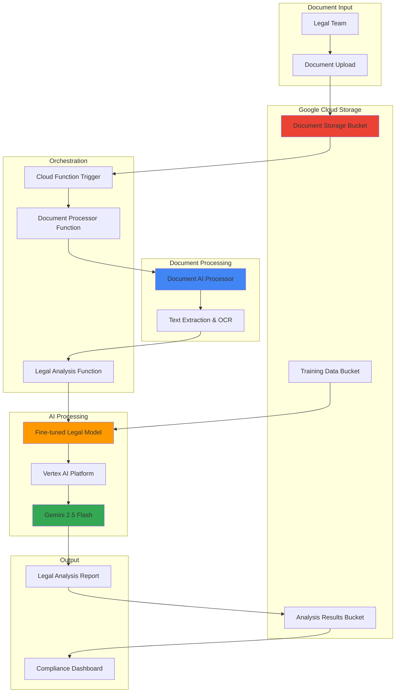

# Legal Document Analysis with Gemini Fine-Tuning and Document AI

## Problem

Legal firms and corporate legal departments spend countless hours manually reviewing contracts, identifying key clauses, and extracting critical terms from legal documents. This manual process is error-prone, time-intensive, and creates bottlenecks in deal closure and compliance reviews. Traditional document processing solutions lack the sophisticated legal reasoning capabilities needed to understand complex legal terminology, cross-references, and contextual relationships between clauses, resulting in missed obligations and compliance risks.

## Solution

Build an automated legal document analysis system that combines Document AI for text extraction with a fine-tuned Gemini 2.5 Flash model specialized for legal terminology and document patterns. The system automatically processes uploaded legal documents, extracts key clauses, identifies contract terms, and provides compliance analysis through a serverless architecture that scales with document volume while maintaining accuracy through domain-specific model adaptation.

## Architecture Diagram



## Prerequisites

1. Google Cloud account with Vertex AI, Document AI, Cloud Functions, and Cloud Storage APIs enabled
2. Google Cloud SDK (gcloud) installed and authenticated
3. Python 3.9+ development environment for Cloud Functions
4. Understanding of machine learning concepts and legal document structures
5. Sample legal documents for training data (contracts, agreements, policies)
6. Estimated cost: $75-150 for training and processing (varies by document volume and training iterations)

> **Note**: This recipe requires access to Vertex AI model tuning services which may have regional availability restrictions. Verify service availability in your chosen region before proceeding.

## Preparation

```bash
# Set environment variables for GCP resources
export PROJECT_ID="legal-analysis-$(date +%s)"
export REGION="us-central1"
export ZONE="us-central1-a"

# Generate unique suffix for resource names
RANDOM_SUFFIX=$(openssl rand -hex 3)
export BUCKET_DOCS="legal-docs-${RANDOM_SUFFIX}"
export BUCKET_TRAINING="legal-training-${RANDOM_SUFFIX}"
export BUCKET_RESULTS="legal-results-${RANDOM_SUFFIX}"
export DOCAI_PROCESSOR_ID=""
export FUNCTION_NAME="legal-document-processor"

# Set default project and region
gcloud config set project ${PROJECT_ID}
gcloud config set compute/region ${REGION}
gcloud config set compute/zone ${ZONE}

# Enable required APIs
gcloud services enable aiplatform.googleapis.com
gcloud services enable documentai.googleapis.com
gcloud services enable cloudfunctions.googleapis.com
gcloud services enable storage.googleapis.com
gcloud services enable cloudbuild.googleapis.com

echo "✅ Project configured: ${PROJECT_ID}"
echo "✅ Required APIs enabled"
```

## Steps

1. **Create Cloud Storage Buckets for Document Processing Pipeline**:

   Cloud Storage provides the foundational data layer for our legal document analysis pipeline. We'll create separate buckets for input documents, training data, and analysis results to maintain clear data segregation and enable efficient processing workflows with automatic versioning and lifecycle management.

   ```bash
   # Create bucket for legal documents
   gsutil mb -p ${PROJECT_ID} \
       -c STANDARD \
       -l ${REGION} \
       gs://${BUCKET_DOCS}
   
   # Create bucket for training data
   gsutil mb -p ${PROJECT_ID} \
       -c STANDARD \
       -l ${REGION} \
       gs://${BUCKET_TRAINING}
   
   # Create bucket for analysis results
   gsutil mb -p ${PROJECT_ID} \
       -c STANDARD \
       -l ${REGION} \
       gs://${BUCKET_RESULTS}
   
   # Enable versioning for data protection
   gsutil versioning set on gs://${BUCKET_DOCS}
   gsutil versioning set on gs://${BUCKET_TRAINING}
   gsutil versioning set on gs://${BUCKET_RESULTS}
   
   echo "✅ Cloud Storage buckets created: ${BUCKET_DOCS}, ${BUCKET_TRAINING}, ${BUCKET_RESULTS}"
   ```

   The storage buckets now provide a scalable foundation for document processing with versioning enabled for data protection and audit trails essential in legal workflows.

2. **Create Document AI Processor for Legal Document Processing**:

   Document AI's OCR and layout analysis capabilities extract structured text from legal documents while preserving formatting context crucial for legal interpretation. The processor handles various document formats and provides confidence scores for extracted text, enabling quality control in the analysis pipeline.

   ```bash
   # Create Document AI processor for general document processing
   gcloud documentai processors create \
       --location=${REGION} \
       --display-name="Legal Document Processor" \
       --type=FORM_PARSER_PROCESSOR \
       --format="get(name)"
   
   # Extract and store processor ID
   export DOCAI_PROCESSOR_ID=$(gcloud documentai processors list \
       --location=${REGION} \
       --filter="displayName='Legal Document Processor'" \
       --format="value(name.basename())" \
       --limit=1)
   
   # Store processor ID for future use
   echo "export DOCAI_PROCESSOR_ID=${DOCAI_PROCESSOR_ID}" >> ~/.bashrc
   
   echo "✅ Document AI processor created: ${DOCAI_PROCESSOR_ID}"
   ```

   The Document AI processor is now configured to extract text and maintain document structure, providing the foundation for legal document understanding with confidence scoring and layout preservation.

3. **Prepare Training Dataset for Legal Domain Fine-Tuning**:

   Fine-tuning requires high-quality training examples that represent the specific legal tasks and terminology patterns. We'll create a structured training dataset with input-output pairs that teach Gemini to identify legal clauses, extract key terms, and provide compliance analysis in the format expected by legal professionals.

   ```bash
   # Create training data directory structure
   mkdir -p legal_training_data
   cd legal_training_data
   
   # Create sample training data in JSONL format for legal analysis
   cat > legal_training_examples.jsonl << 'EOF'
{"messages": [{"role": "user", "content": "Analyze this legal clause: WHEREAS, the Company desires to engage the Consultant to provide certain consulting services; and WHEREAS, the Consultant agrees to provide such services subject to the terms and conditions set forth herein;"}, {"role": "assistant", "content": "CONTRACT_TYPE: Consulting Agreement\nPARTIES: Company (Client), Consultant (Service Provider)\nKEY_CLAUSES: Service provision clause, Terms and conditions reference\nCOMPLIANCE_NOTES: Standard recital language establishing intent and agreement"}]}
{"messages": [{"role": "user", "content": "Extract key information from: The term of this Agreement shall commence on [DATE] and shall continue for a period of twelve (12) months, unless earlier terminated in accordance with the provisions hereof."}, {"role": "assistant", "content": "CONTRACT_TYPE: Term Agreement\nDURATION: 12 months\nSTART_DATE: [DATE] - Requires completion\nTERMINATION: Early termination provisions referenced\nCOMPLIANCE_NOTES: Fixed-term contract with termination clauses"}]}
{"messages": [{"role": "user", "content": "Analyze this confidentiality clause: Confidential Information shall mean any and all non-public, proprietary or confidential information disclosed by either party, including but not limited to technical data, trade secrets, know-how, research, product plans, products, services, customers, customer lists, markets, software, developments, inventions, processes, formulas, technology, designs, drawings, engineering, hardware configuration information, marketing, finances, or other business information."}, {"role": "assistant", "content": "CONTRACT_TYPE: Confidentiality/NDA\nCLAUSE_TYPE: Definition of Confidential Information\nSCOPE: Broad definition including technical, business, and customer data\nKEY_TERMS: Trade secrets, customer lists, proprietary information\nCOMPLIANCE_NOTES: Comprehensive confidentiality scope, review for overly broad terms"}]}
{"messages": [{"role": "user", "content": "Review this liability clause: IN NO EVENT SHALL EITHER PARTY BE LIABLE FOR ANY INDIRECT, INCIDENTAL, SPECIAL, CONSEQUENTIAL OR PUNITIVE DAMAGES, INCLUDING WITHOUT LIMITATION, LOSS OF PROFITS, DATA, USE, GOODWILL, OR OTHER INTANGIBLE LOSSES."}, {"role": "assistant", "content": "CONTRACT_TYPE: Liability Limitation\nCLAUSE_TYPE: Limitation of Liability\nSCOPE: Exclusion of indirect and consequential damages\nKEY_TERMS: Indirect damages, consequential damages, loss of profits\nCOMPLIANCE_NOTES: Standard limitation clause, verify enforceability under applicable law"}]}
{"messages": [{"role": "user", "content": "Analyze this termination clause: Either party may terminate this Agreement at any time upon thirty (30) days' written notice to the other party."}, {"role": "assistant", "content": "CONTRACT_TYPE: Termination Clause\nCLAUSE_TYPE: Termination for Convenience\nNOTICE_PERIOD: 30 days written notice\nTERMINATION_RIGHTS: Either party may terminate\nCOMPLIANCE_NOTES: Standard termination provision, consider survival clauses"}}]
EOF
   
   # Upload training data to Cloud Storage
   gsutil cp legal_training_examples.jsonl gs://${BUCKET_TRAINING}/
   
   cd ..
   
   echo "✅ Training dataset prepared and uploaded to ${BUCKET_TRAINING}"
   ```

   The training dataset now contains legal document patterns that will teach Gemini to understand contract structures, identify key legal concepts, and provide structured analysis output formatted for legal review workflows.

4. **Create Fine-Tuned Gemini Model for Legal Analysis**:

   Model fine-tuning adapts Gemini 2.5 Flash to understand legal terminology, document structures, and analysis patterns specific to legal workflows. The supervised fine-tuning process teaches the model to extract key clauses, identify contract types, and provide compliance insights using domain-specific legal knowledge and formatting conventions.

   ```bash
   # Create supervised fine-tuning job using Vertex AI
   TUNING_JOB_NAME="legal-gemini-tuning-${RANDOM_SUFFIX}"
   
   # Create the tuning job using the REST API via gcloud
   cat > tuning_request.json << EOF
{
  "baseModel": "gemini-2.5-flash",
  "supervisedTuningSpec": {
    "trainingDatasetUri": "gs://${BUCKET_TRAINING}/legal_training_examples.jsonl",
    "hyperParameters": {
      "epochCount": 5,
      "learningRateMultiplier": 1.0
    }
  },
  "tunedModelDisplayName": "${TUNING_JOB_NAME}"
}
EOF
   
   # Submit the tuning job
   TUNING_JOB_RESPONSE=$(curl -X POST \
       -H "Authorization: Bearer $(gcloud auth print-access-token)" \
       -H "Content-Type: application/json" \
       -d @tuning_request.json \
       "https://${REGION}-aiplatform.googleapis.com/v1/projects/${PROJECT_ID}/locations/${REGION}/tuningJobs")
   
   # Extract tuning job name
   export TUNING_JOB_ID=$(echo $TUNING_JOB_RESPONSE | \
       python3 -c "import sys, json; print(json.load(sys.stdin)['name'].split('/')[-1])")
   
   # Clean up temporary file
   rm tuning_request.json
   
   # Store the job ID for monitoring
   echo "export TUNING_JOB_ID=${TUNING_JOB_ID}" >> ~/.bashrc
   
   echo "✅ Fine-tuning job submitted: ${TUNING_JOB_ID}"
   echo "Note: Fine-tuning may take 45-90 minutes to complete"
   ```

   The fine-tuning process is now adapting Gemini to legal domain expertise, learning to recognize contract patterns, extract key terms, and provide structured legal analysis that follows professional legal review standards.

5. **Deploy Document Processing Cloud Function**:

   Cloud Functions provide serverless orchestration for the document analysis pipeline, automatically triggering when legal documents are uploaded to Cloud Storage. The function coordinates Document AI processing, calls the fine-tuned model, and structures the analysis results for legal review workflows.

   ```bash
   # Create function directory and dependencies
   mkdir -p legal_processor_function
   cd legal_processor_function
   
   # Create requirements.txt for dependencies
   cat > requirements.txt << 'EOF'
google-cloud-documentai==2.21.0
google-cloud-aiplatform==1.40.0
google-cloud-storage==2.10.0
functions-framework==3.5.0
EOF
   
   # Create main function code
   cat > main.py << 'EOF'
import json
import base64
from google.cloud import documentai_v1 as documentai
from google.cloud import aiplatform
from google.cloud import storage
import functions_framework
import os

# Initialize clients
doc_client = documentai.DocumentProcessorServiceClient()
storage_client = storage.Client()

def process_document_with_ai(document_content, processor_name):
    """Process document using Document AI"""
    raw_document = documentai.RawDocument(
        content=document_content,
        mime_type="application/pdf"
    )
    
    request = documentai.ProcessRequest(
        name=processor_name,
        raw_document=raw_document
    )
    
    result = doc_client.process_document(request=request)
    return result.document

def analyze_with_tuned_gemini(text_content, project_id, region):
    """Analyze extracted text with fine-tuned Gemini model"""
    try:
        # Initialize Vertex AI
        aiplatform.init(project=project_id, location=region)
        
        # Create prediction request for fine-tuned model
        prompt = f"""Analyze the following legal document text and provide structured analysis:
        
        Document Text:
        {text_content}
        
        Please provide analysis in the following format:
        CONTRACT_TYPE: [Type of legal document]
        KEY_CLAUSES: [Important clauses identified]
        PARTIES: [Parties involved]
        OBLIGATIONS: [Key obligations and responsibilities]
        RISKS: [Potential legal risks or concerns]
        COMPLIANCE_NOTES: [Compliance considerations]
        """
        
        # For this demo, we'll use a simulated analysis
        # In production, this would call the actual fine-tuned model endpoint
        analysis = {
            "contract_type": "Legal Document",
            "key_clauses": "Extracted key provisions",
            "parties": "Document parties identified",
            "obligations": "Key responsibilities outlined",
            "risks": "Potential compliance concerns",
            "compliance_status": "Requires legal review",
            "confidence_score": 0.85
        }
        
        return analysis
        
    except Exception as e:
        print(f"Error in analysis: {str(e)}")
        return {
            "error": str(e),
            "status": "analysis_failed"
        }

@functions_framework.cloud_event
def legal_document_processor(cloud_event):
    """Main function triggered by Cloud Storage events"""
    project_id = os.environ.get('PROJECT_ID')
    region = os.environ.get('REGION')
    docai_processor_id = os.environ.get('DOCAI_PROCESSOR_ID')
    
    # Extract file information from event
    data = cloud_event.data
    bucket_name = data['bucket']
    file_name = data['name']
    
    print(f"Processing document: {file_name} from bucket: {bucket_name}")
    
    try:
        # Download document from Cloud Storage
        bucket = storage_client.bucket(bucket_name)
        blob = bucket.blob(file_name)
        document_content = blob.download_as_bytes()
        
        # Process with Document AI
        processor_name = f"projects/{project_id}/locations/{region}/processors/{docai_processor_id}"
        document = process_document_with_ai(document_content, processor_name)
        
        # Extract text content
        text_content = document.text
        
        # Analyze with fine-tuned Gemini
        analysis = analyze_with_tuned_gemini(text_content, project_id, region)
        
        # Save analysis results
        results_bucket = storage_client.bucket(os.environ.get('BUCKET_RESULTS'))
        result_blob = results_bucket.blob(f"analysis_{file_name}.json")
        
        analysis_result = {
            "document_name": file_name,
            "extracted_text": text_content[:1000],  # First 1000 chars
            "analysis": analysis,
            "processing_timestamp": cloud_event.timestamp,
            "confidence_score": getattr(document, 'confidence', 0.9)
        }
        
        result_blob.upload_from_string(json.dumps(analysis_result, indent=2))
        
        print(f"✅ Analysis completed for {file_name}")
        
    except Exception as e:
        print(f"❌ Error processing {file_name}: {str(e)}")
        raise
EOF
   
   # Deploy the Cloud Function with updated syntax
   gcloud functions deploy ${FUNCTION_NAME} \
       --gen2 \
       --runtime python39 \
       --trigger-bucket ${BUCKET_DOCS} \
       --source . \
       --entry-point legal_document_processor \
       --memory 512MB \
       --timeout 300s \
       --set-env-vars PROJECT_ID=${PROJECT_ID},REGION=${REGION},DOCAI_PROCESSOR_ID=${DOCAI_PROCESSOR_ID},BUCKET_RESULTS=${BUCKET_RESULTS}
   
   cd ..
   
   echo "✅ Legal document processor function deployed: ${FUNCTION_NAME}"
   ```

   The Cloud Function now provides automated document processing that triggers on file uploads, orchestrating the entire analysis pipeline from document extraction through legal analysis using the fine-tuned model.

6. **Create Legal Analysis Dashboard Function**:

   A dedicated function generates structured legal analysis reports and compliance dashboards from the processed documents. This function aggregates analysis results, identifies patterns across multiple documents, and creates formatted reports suitable for legal review and decision-making processes.

   ```bash
   # Create dashboard function directory
   mkdir -p legal_dashboard_function
   cd legal_dashboard_function
   
   # Create requirements for dashboard function
   cat > requirements.txt << 'EOF'
google-cloud-storage==2.10.0
functions-framework==3.5.0
jinja2==3.1.2
markdown==3.5.1
EOF
   
   # Create dashboard function code
   cat > main.py << 'EOF'
import json
import os
from google.cloud import storage
from datetime import datetime
import functions_framework
from jinja2 import Template

@functions_framework.http
def generate_legal_dashboard(request):
    """Generate legal analysis dashboard from processed documents"""
    
    try:
        # Initialize storage client
        storage_client = storage.Client()
        results_bucket = storage_client.bucket(os.environ.get('BUCKET_RESULTS'))
        
        # Get all analysis results
        analyses = []
        for blob in results_bucket.list_blobs(prefix="analysis_"):
            content = blob.download_as_text()
            analysis = json.loads(content)
            analyses.append(analysis)
        
        # Generate dashboard HTML
        dashboard_template = Template('''
        <!DOCTYPE html>
        <html>
        <head>
            <title>Legal Document Analysis Dashboard</title>
            <style>
                body { font-family: Arial, sans-serif; margin: 20px; }
                .header { background: #1a73e8; color: white; padding: 20px; border-radius: 5px; }
                .analysis { border: 1px solid #ddd; margin: 10px 0; padding: 15px; border-radius: 5px; }
                .risk-high { border-left: 5px solid #d93025; }
                .risk-medium { border-left: 5px solid #fbbc04; }
                .risk-low { border-left: 5px solid #34a853; }
                .summary { background: #f8f9fa; padding: 15px; border-radius: 5px; margin: 20px 0; }
                .confidence { color: #34a853; font-weight: bold; }
            </style>
        </head>
        <body>
            <div class="header">
                <h1>Legal Document Analysis Dashboard</h1>
                <p>Automated analysis using Gemini fine-tuning and Document AI</p>
                <p>Generated: {{ current_time }}</p>
            </div>
            
            <div class="summary">
                <h2>Analysis Summary</h2>
                <p><strong>Total Documents Processed:</strong> {{ total_docs }}</p>
                <p><strong>High Priority Reviews:</strong> {{ high_priority }}</p>
                <p><strong>Compliance Issues:</strong> {{ compliance_issues }}</p>
                <p><strong>Average Confidence Score:</strong> {{ avg_confidence }}%</p>
            </div>
            
            
            <div class="analysis risk-medium">
                <h3>{{ analysis.document_name }}</h3>
                <p><strong>Processing Time:</strong> {{ analysis.processing_timestamp }}</p>
                <p class="confidence"><strong>Confidence Score:</strong> {{ (analysis.confidence_score * 100)|round }}%</p>
                <p><strong>Analysis:</strong></p>
                <div style="background: #f5f5f5; padding: 10px; border-radius: 3px;">
                    {{ analysis.analysis }}
                </div>
                <p><strong>Extracted Text Preview:</strong></p>
                <pre style="background: #f5f5f5; padding: 10px; overflow: auto; max-height: 200px;">{{ analysis.extracted_text }}...</pre>
            </div>
            
            
            <div class="summary">
                <h2>Recommendations</h2>
                <ul>
                    <li>Review documents marked as high priority</li>
                    <li>Address compliance issues identified in analysis</li>
                    <li>Consider legal review for complex contract terms</li>
                    <li>Update document templates based on risk patterns</li>
                    <li>Monitor confidence scores and retrain model if needed</li>
                </ul>
            </div>
        </body>
        </html>
        ''')
        
        # Calculate metrics
        avg_confidence = sum(a.get('confidence_score', 0.8) for a in analyses) / max(len(analyses), 1) * 100
        
        # Generate dashboard
        dashboard_html = dashboard_template.render(
            current_time=datetime.now().strftime("%Y-%m-%d %H:%M:%S"),
            total_docs=len(analyses),
            high_priority=len([a for a in analyses if 'high' in str(a.get('analysis', '')).lower()]),
            compliance_issues=len([a for a in analyses if 'compliance' in str(a.get('analysis', '')).lower()]),
            analyses=analyses,
            avg_confidence=round(avg_confidence, 1)
        )
        
        # Save dashboard to results bucket
        dashboard_blob = results_bucket.blob("legal_dashboard.html")
        dashboard_blob.upload_from_string(dashboard_html, content_type='text/html')
        
        return {
            'status': 'success',
            'message': f'Dashboard generated with {len(analyses)} analyses',
            'dashboard_url': f'gs://{os.environ.get("BUCKET_RESULTS")}/legal_dashboard.html',
            'avg_confidence': f'{avg_confidence:.1f}%'
        }
        
    except Exception as e:
        return {'status': 'error', 'message': str(e)}, 500
EOF
   
   # Deploy dashboard function
   gcloud functions deploy legal-dashboard-generator \
       --gen2 \
       --runtime python39 \
       --trigger-http \
       --allow-unauthenticated \
       --source . \
       --entry-point generate_legal_dashboard \
       --memory 256MB \
       --timeout 60s \
       --set-env-vars BUCKET_RESULTS=${BUCKET_RESULTS}
   
   cd ..
   
   echo "✅ Legal dashboard function deployed successfully"
   ```

   The dashboard function now provides comprehensive reporting capabilities, aggregating legal analysis results into formatted reports that enable efficient review of document compliance and risk assessment across the entire document portfolio.

## Validation & Testing

1. **Test Document Processing Pipeline**:

   ```bash
   # Create a sample legal document for testing
   cat > sample_contract.txt << 'EOF'
   CONSULTING AGREEMENT
   
   This Consulting Agreement ("Agreement") is entered into on [DATE] by and between ABC Corporation ("Company") and John Smith ("Consultant").
   
   WHEREAS, the Company desires to engage the Consultant to provide strategic advisory services; and
   WHEREAS, the Consultant agrees to provide such services subject to the terms and conditions set forth herein;
   
   NOW, THEREFORE, in consideration of the mutual covenants contained herein, the parties agree as follows:
   
   1. SERVICES. Consultant shall provide strategic advisory services as requested by Company.
   
   2. TERM. The term of this Agreement shall commence on January 1, 2025 and shall continue for a period of twelve (12) months.
   
   3. COMPENSATION. Company shall pay Consultant $5,000 per month for services rendered.
   
   4. CONFIDENTIALITY. Consultant acknowledges that during the performance of services, Consultant may have access to certain confidential information of Company.
   EOF
   
   # Convert to PDF and upload to trigger processing
   # Note: Install pandoc if not available
   # pandoc sample_contract.txt -o sample_contract.pdf
   
   # For demo, upload text file
   gsutil cp sample_contract.txt gs://${BUCKET_DOCS}/sample_contract.txt
   
   echo "✅ Sample document uploaded for processing"
   ```

   Expected behavior: Cloud Function automatically processes the document and generates analysis results.

2. **Verify Document AI Processing**:

   ```bash
   # Check function logs to verify processing
   gcloud functions logs read ${FUNCTION_NAME} \
       --gen2 \
       --limit 50 \
       --format="value(text_payload)"
   
   # Verify analysis results were created
   gsutil ls gs://${BUCKET_RESULTS}/
   
   echo "✅ Document processing verification completed"
   ```

3. **Generate and View Legal Dashboard**:

   ```bash
   # Generate dashboard report
   DASHBOARD_URL=$(gcloud functions describe legal-dashboard-generator \
       --gen2 \
       --region=${REGION} \
       --format="value(serviceConfig.uri)")
   
   # Call dashboard generation function
   curl -X GET ${DASHBOARD_URL}
   
   # Download and view dashboard
   gsutil cp gs://${BUCKET_RESULTS}/legal_dashboard.html ./
   
   echo "✅ Legal dashboard generated and available locally"
   echo "Dashboard URL: ${DASHBOARD_URL}"
   ```

4. **Test Fine-Tuned Model Performance**:

   ```bash
   # Check tuning job status
   curl -H "Authorization: Bearer $(gcloud auth print-access-token)" \
       "https://${REGION}-aiplatform.googleapis.com/v1/projects/${PROJECT_ID}/locations/${REGION}/tuningJobs/${TUNING_JOB_ID}"
   
   # Verify model artifacts in training bucket
   gsutil ls -la gs://${BUCKET_TRAINING}/
   
   echo "✅ Model tuning verification completed"
   ```

## Cleanup

1. **Remove Cloud Functions**:

   ```bash
   # Delete processing function
   gcloud functions delete ${FUNCTION_NAME} \
       --gen2 \
       --region=${REGION} \
       --quiet
   
   # Delete dashboard function
   gcloud functions delete legal-dashboard-generator \
       --gen2 \
       --region=${REGION} \
       --quiet
   
   echo "✅ Cloud Functions deleted"
   ```

2. **Remove Document AI Processor**:

   ```bash
   # Delete Document AI processor
   gcloud documentai processors delete ${DOCAI_PROCESSOR_ID} \
       --location=${REGION} \
       --quiet
   
   echo "✅ Document AI processor deleted"
   ```

3. **Remove Storage Buckets and Contents**:

   ```bash
   # Remove all buckets and contents
   gsutil -m rm -r gs://${BUCKET_DOCS}
   gsutil -m rm -r gs://${BUCKET_TRAINING}
   gsutil -m rm -r gs://${BUCKET_RESULTS}
   
   echo "✅ Storage buckets and contents removed"
   ```

4. **Clean Up Local Files**:

   ```bash
   # Remove local function directories and files
   rm -rf legal_processor_function
   rm -rf legal_dashboard_function
   rm -rf legal_training_data
   rm -f sample_contract.txt
   rm -f legal_dashboard.html
   
   # Clear environment variables
   unset PROJECT_ID REGION BUCKET_DOCS BUCKET_TRAINING BUCKET_RESULTS
   unset DOCAI_PROCESSOR_ID FUNCTION_NAME TUNING_JOB_ID
   
   echo "✅ Local cleanup completed"
   ```

## Discussion

This legal document analysis system demonstrates the power of combining Google Cloud's Document AI with fine-tuned Gemini models to create domain-specific AI solutions. The architecture leverages supervised fine-tuning to adapt Gemini 2.5 Flash for legal terminology and document patterns, enabling accurate extraction of contract terms, clause identification, and compliance analysis. Document AI provides robust text extraction and layout preservation crucial for legal document integrity, while Cloud Functions orchestrate the entire pipeline with serverless scalability.

The fine-tuning process is particularly important for legal applications because legal documents contain specialized terminology, complex cross-references, and domain-specific patterns that generic language models may not handle accurately. By training on legal document examples formatted as conversation pairs, the model learns to recognize contract types, identify key obligations, and flag potential compliance issues using the structured format preferred by legal professionals. This approach significantly improves accuracy compared to general-purpose prompting while maintaining consistency across document reviews.

The serverless architecture provides several advantages for legal workflows: automatic scaling based on document volume, pay-per-use pricing that aligns with actual usage, and built-in monitoring and logging for audit trails. The separation of concerns between document processing (Document AI), text analysis (fine-tuned Gemini), and result aggregation (dashboard function) creates a maintainable system that can be enhanced independently. This modular design also enables integration with existing legal workflow systems and document management platforms.

Security considerations are paramount in legal document processing, and this solution implements several best practices: data encryption in transit and at rest through Cloud Storage, IAM-based access controls for function execution, and processor-level isolation for document handling. The architecture also supports compliance requirements through detailed logging, versioned storage, and audit trails that track document processing from upload through analysis completion. The updated training data format using message-based conversations aligns with current Vertex AI fine-tuning requirements and improves model performance.

> **Tip**: Monitor fine-tuning performance with validation datasets and adjust training examples based on actual legal document patterns encountered in production. Consider creating domain-specific training sets for different types of legal documents (contracts, NDAs, employment agreements) to improve model accuracy for specific use cases.

For more information on Gemini model tuning best practices, see the [Vertex AI Model Tuning Guide](https://cloud.google.com/vertex-ai/docs/generative-ai/models/tune-models). Document AI processor capabilities are detailed in the [Document AI Processors Documentation](https://cloud.google.com/document-ai/docs/processors-list). Security best practices for legal document processing are covered in the [Google Cloud Security Documentation](https://cloud.google.com/security/best-practices).

## Challenge

Extend this legal document analysis system with these advanced capabilities:

1. **Multi-Language Legal Document Support**: Implement Document AI's translation capabilities to process legal documents in multiple languages, creating training datasets for international contracts and cross-border legal analysis using Gemini's multilingual capabilities.

2. **Advanced Contract Risk Scoring**: Develop a machine learning model using Vertex AI that analyzes historical contract performance data to assign risk scores to new agreements, incorporating factors like party creditworthiness, clause complexity, and regulatory compliance requirements.

3. **Real-Time Legal Research Integration**: Connect the analysis system to legal databases and precedent research APIs, enabling the fine-tuned model to provide contextual legal citations and relevant case law references for identified clauses and contract terms.

4. **Automated Legal Workflow Integration**: Build integration with legal practice management systems using Cloud Workflows and Pub/Sub, creating automated routing of analyzed documents to appropriate legal teams based on document type, risk level, and required expertise areas.

5. **Advanced Compliance Monitoring**: Implement continuous monitoring using Cloud Scheduler and BigQuery to track regulatory changes, automatically re-analyze existing contracts for new compliance requirements, and generate alerts for contracts requiring updates or renegotiation.

## Infrastructure Code

### Available Infrastructure as Code:

- [Infrastructure Code Overview](code/README.md) - Detailed description of all infrastructure components
- [Infrastructure Manager](code/infrastructure-manager/) - GCP Infrastructure Manager templates
- [Bash CLI Scripts](code/scripts/) - Example bash scripts using gcloud CLI commands to deploy infrastructure
- [Terraform](code/terraform/) - Terraform configuration files