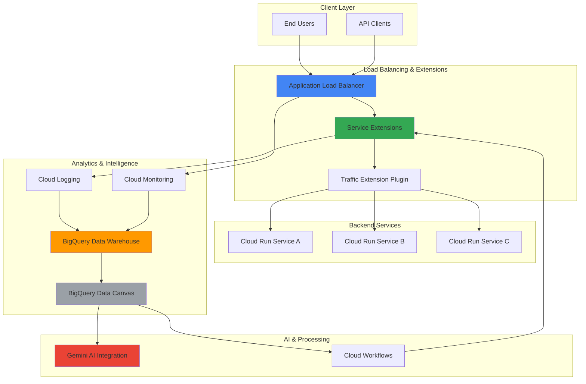

# Load Balancer Traffic Routing with Service Extensions and BigQuery Data Canvas

## Problem

Modern applications require sophisticated traffic routing decisions that go beyond simple round-robin or health-based routing. Traditional load balancers lack the intelligence to analyze real-time traffic patterns, user behavior, and application performance metrics to make optimal routing decisions. This results in suboptimal user experiences, inefficient resource utilization, and missed opportunities for performance optimization based on data-driven insights.

## Solution

Build an intelligent traffic routing system using Google Cloud Service Extensions to capture real-time load balancer metrics and route traffic to Cloud Run services, while leveraging BigQuery Data Canvas to analyze traffic patterns using natural language queries. This solution combines the extensibility of Application Load Balancer with AI-powered analytics to enable dynamic, data-driven routing decisions that optimize performance and user experience based on real-time insights.

## Architecture Diagram



## Prerequisites

1. Google Cloud project with billing enabled and appropriate IAM permissions
2. gcloud CLI v450.0.0 or later installed and authenticated
3. Basic understanding of load balancing, microservices, and SQL analytics
4. Familiarity with BigQuery and natural language processing concepts
5. Estimated cost: $25-50 for running this recipe (includes compute, storage, and AI services)

> **Note**: Service Extensions for Application Load Balancer is available in Preview. Ensure your project has access to preview features through the Google Cloud Console and the necessary APIs are enabled.

## Preparation

```bash
# Set environment variables for GCP resources
export PROJECT_ID="intelligent-routing-$(date +%s)"
export REGION="us-central1"
export ZONE="us-central1-a"

# Generate unique suffix for resource names
RANDOM_SUFFIX=$(openssl rand -hex 3)
export SERVICE_NAME="traffic-router-${RANDOM_SUFFIX}"
export DATASET_NAME="traffic_analytics_${RANDOM_SUFFIX}"
export EXTENSION_NAME="intelligent-router-${RANDOM_SUFFIX}"

# Set default project and region
gcloud config set project ${PROJECT_ID}
gcloud config set compute/region ${REGION}
gcloud config set compute/zone ${ZONE}

# Enable required APIs
gcloud services enable compute.googleapis.com
gcloud services enable run.googleapis.com
gcloud services enable bigquery.googleapis.com
gcloud services enable logging.googleapis.com
gcloud services enable monitoring.googleapis.com
gcloud services enable networkservices.googleapis.com
gcloud services enable workflows.googleapis.com
gcloud services enable cloudfunctions.googleapis.com

echo "✅ Project configured: ${PROJECT_ID}"
echo "✅ Region set to: ${REGION}"
echo "✅ Required APIs enabled"
```

## Steps

1. **Create BigQuery Dataset and Tables for Traffic Analytics**:

   BigQuery serves as the foundation for our intelligent routing system by storing and analyzing load balancer metrics. The dataset will capture request patterns, response times, error rates, and user behavior data that feeds into our AI-powered routing decisions. This approach enables real-time analytics and historical trend analysis for continuous optimization.

   ```bash
   # Create BigQuery dataset for traffic analytics
   bq mk --dataset \
       --location=${REGION} \
       --description="Traffic analytics for intelligent routing" \
       ${PROJECT_ID}:${DATASET_NAME}
   
   # Create table for load balancer metrics
   bq mk --table \
       ${PROJECT_ID}:${DATASET_NAME}.lb_metrics \
       timestamp:TIMESTAMP,request_id:STRING,source_ip:STRING,target_service:STRING,response_time:FLOAT,status_code:INTEGER,user_agent:STRING,request_size:INTEGER,response_size:INTEGER
   
   # Create table for routing decisions
   bq mk --table \
       ${PROJECT_ID}:${DATASET_NAME}.routing_decisions \
       timestamp:TIMESTAMP,decision_id:STRING,source_criteria:STRING,target_service:STRING,confidence_score:FLOAT,ai_reasoning:STRING
   
   echo "✅ BigQuery dataset and tables created successfully"
   ```

   The analytics foundation is now established with dedicated tables for capturing both raw load balancer metrics and AI-driven routing decisions. This structured approach enables comprehensive analysis of traffic patterns and routing effectiveness using BigQuery's powerful analytics capabilities.

2. **Deploy Sample Cloud Run Services as Backend Targets**:

   Cloud Run provides the serverless compute foundation for our multi-service architecture. By deploying multiple services with different characteristics, we can demonstrate intelligent routing based on service performance, resource utilization, and request patterns. Each service will have unique response behaviors to showcase the routing intelligence.

   ```bash
   # Deploy Cloud Run Service A (Fast response service)
   gcloud run deploy service-a-${RANDOM_SUFFIX} \
       --image=gcr.io/cloudrun/hello \
       --region=${REGION} \
       --platform=managed \
       --allow-unauthenticated \
       --set-env-vars="SERVICE_TYPE=fast,RESPONSE_DELAY=100" \
       --max-instances=10 \
       --memory=512Mi
   
   # Deploy Cloud Run Service B (Standard response service)
   gcloud run deploy service-b-${RANDOM_SUFFIX} \
       --image=gcr.io/cloudrun/hello \
       --region=${REGION} \
       --platform=managed \
       --allow-unauthenticated \
       --set-env-vars="SERVICE_TYPE=standard,RESPONSE_DELAY=500" \
       --max-instances=10 \
       --memory=1Gi
   
   # Deploy Cloud Run Service C (Resource-intensive service)
   gcloud run deploy service-c-${RANDOM_SUFFIX} \
       --image=gcr.io/cloudrun/hello \
       --region=${REGION} \
       --platform=managed \
       --allow-unauthenticated \
       --set-env-vars="SERVICE_TYPE=intensive,RESPONSE_DELAY=1000" \
       --max-instances=5 \
       --memory=2Gi
   
   # Store service URLs for later use
   SERVICE_A_URL=$(gcloud run services describe service-a-${RANDOM_SUFFIX} \
       --region=${REGION} --format="value(status.url)")
   SERVICE_B_URL=$(gcloud run services describe service-b-${RANDOM_SUFFIX} \
       --region=${REGION} --format="value(status.url)")
   SERVICE_C_URL=$(gcloud run services describe service-c-${RANDOM_SUFFIX} \
       --region=${REGION} --format="value(status.url)")
   
   echo "✅ Cloud Run services deployed successfully"
   echo "Service A URL: ${SERVICE_A_URL}"
   echo "Service B URL: ${SERVICE_B_URL}"
   echo "Service C URL: ${SERVICE_C_URL}"
   ```

   Three distinct Cloud Run services are now operational, each configured with different performance characteristics. This multi-service setup provides the foundation for demonstrating intelligent routing decisions based on service capabilities, response times, and resource requirements.

3. **Create Network Endpoint Groups for Cloud Run Services**:

   Network Endpoint Groups (NEGs) provide the abstraction layer that connects our Cloud Run services to the Application Load Balancer. Serverless NEGs automatically handle the dynamic nature of Cloud Run endpoints, enabling seamless integration with Google Cloud's global load balancing infrastructure while maintaining the serverless benefits of automatic scaling and zero maintenance.

   ```bash
   # Create serverless NEG for Service A
   gcloud compute network-endpoint-groups create service-a-neg-${RANDOM_SUFFIX} \
       --region=${REGION} \
       --network-endpoint-type=serverless \
       --cloud-run-service=service-a-${RANDOM_SUFFIX}
   
   # Create serverless NEG for Service B
   gcloud compute network-endpoint-groups create service-b-neg-${RANDOM_SUFFIX} \
       --region=${REGION} \
       --network-endpoint-type=serverless \
       --cloud-run-service=service-b-${RANDOM_SUFFIX}
   
   # Create serverless NEG for Service C
   gcloud compute network-endpoint-groups create service-c-neg-${RANDOM_SUFFIX} \
       --region=${REGION} \
       --network-endpoint-type=serverless \
       --cloud-run-service=service-c-${RANDOM_SUFFIX}
   
   echo "✅ Network Endpoint Groups created for all Cloud Run services"
   ```

   The serverless Network Endpoint Groups establish the connection bridge between our Application Load Balancer and Cloud Run services. This configuration enables dynamic service discovery and automatic endpoint management, essential for building resilient and scalable serverless architectures.

4. **Configure Backend Services with Health Checks**:

   Backend services define how the load balancer distributes traffic to our Cloud Run services. By configuring comprehensive health checks and traffic policies, we establish the baseline routing behavior that our Service Extensions will enhance with intelligent decision-making capabilities based on real-time analytics and AI insights.

   ```bash
   # Create health check for Cloud Run services
   gcloud compute health-checks create http cr-health-check-${RANDOM_SUFFIX} \
       --port=8080 \
       --request-path="/" \
       --check-interval=30s \
       --timeout=10s \
       --healthy-threshold=2 \
       --unhealthy-threshold=3
   
   # Create backend service for Service A
   gcloud compute backend-services create service-a-backend-${RANDOM_SUFFIX} \
       --global \
       --protocol=HTTP \
       --health-checks=cr-health-check-${RANDOM_SUFFIX} \
       --load-balancing-scheme=EXTERNAL_MANAGED
   
   # Add NEG to backend service A
   gcloud compute backend-services add-backend service-a-backend-${RANDOM_SUFFIX} \
       --global \
       --network-endpoint-group=service-a-neg-${RANDOM_SUFFIX} \
       --network-endpoint-group-region=${REGION}
   
   # Create backend service for Service B
   gcloud compute backend-services create service-b-backend-${RANDOM_SUFFIX} \
       --global \
       --protocol=HTTP \
       --health-checks=cr-health-check-${RANDOM_SUFFIX} \
       --load-balancing-scheme=EXTERNAL_MANAGED
   
   # Add NEG to backend service B
   gcloud compute backend-services add-backend service-b-backend-${RANDOM_SUFFIX} \
       --global \
       --network-endpoint-group=service-b-neg-${RANDOM_SUFFIX} \
       --network-endpoint-group-region=${REGION}
   
   # Create backend service for Service C
   gcloud compute backend-services create service-c-backend-${RANDOM_SUFFIX} \
       --global \
       --protocol=HTTP \
       --health-checks=cr-health-check-${RANDOM_SUFFIX} \
       --load-balancing-scheme=EXTERNAL_MANAGED
   
   # Add NEG to backend service C
   gcloud compute backend-services add-backend service-c-backend-${RANDOM_SUFFIX} \
       --global \
       --network-endpoint-group=service-c-neg-${RANDOM_SUFFIX} \
       --network-endpoint-group-region=${REGION}
   
   echo "✅ Backend services configured with health checks"
   ```

   The backend services are now configured with comprehensive health monitoring and traffic distribution policies. This foundational layer ensures reliable service availability while providing the framework for our intelligent routing extensions to make data-driven traffic distribution decisions.

5. **Create Traffic Extension Plugin for Intelligent Routing**:

   Service Extensions enable custom logic at the load balancer layer through callouts to external services. The traffic extension will capture request metadata, analyze patterns, and make routing decisions using AI insights from BigQuery Data Canvas, transforming static load balancing into dynamic, learning-based traffic management.

   ```bash
   # Create Cloud Function for traffic routing logic
   cat > traffic-router-function.py << 'EOF'
import functions_framework
import json
import logging
from google.cloud import bigquery
import datetime
import os

@functions_framework.http
def route_traffic(request):
    """Intelligent traffic routing based on real-time analytics"""
    
    # Extract request metadata from Service Extensions callout
    if request.method == 'POST':
        request_data = request.get_json() or {}
    else:
        request_data = {}
    
    # Get project and dataset from environment
    project_id = os.environ.get('PROJECT_ID')
    dataset_name = os.environ.get('DATASET_NAME')
    
    source_ip = request_data.get('source_ip', '0.0.0.0')
    user_agent = request_data.get('user_agent', 'unknown')
    request_size = request_data.get('request_size', 0)
    
    # Initialize BigQuery client
    client = bigquery.Client(project=project_id)
    
    # Query recent performance metrics
    query = f"""
    SELECT 
        target_service,
        AVG(response_time) as avg_response_time,
        COUNT(*) as request_count,
        AVG(status_code) as avg_status
    FROM `{project_id}.{dataset_name}.lb_metrics`
    WHERE timestamp >= TIMESTAMP_SUB(CURRENT_TIMESTAMP(), INTERVAL 5 MINUTE)
    GROUP BY target_service
    ORDER BY avg_response_time ASC
    LIMIT 1
    """
    
    try:
        query_job = client.query(query)
        results = list(query_job)
        
        # Select optimal service based on performance
        if results and len(results) > 0:
            best_service = results[0].target_service
            confidence = 0.9
        else:
            # Default routing logic
            best_service = "service-a"
            confidence = 0.5
        
        # Log routing decision
        decision_data = {
            'timestamp': datetime.datetime.utcnow().isoformat(),
            'decision_id': f"dec_{datetime.datetime.utcnow().strftime('%Y%m%d_%H%M%S')}",
            'source_criteria': f"ip:{source_ip},size:{request_size}",
            'target_service': best_service,
            'confidence_score': confidence,
            'ai_reasoning': 'Performance-based routing with historical analysis'
        }
        
        # Insert routing decision into BigQuery
        table_id = f"{project_id}.{dataset_name}.routing_decisions"
        table = client.get_table(table_id)
        client.insert_rows_json(table, [decision_data])
        
        # Return response in format expected by Service Extensions
        return {
            'statusCode': 200,
            'headers': {
                'x-routing-decision': best_service,
                'x-confidence-score': str(confidence)
            },
            'body': json.dumps({
                'target_service': best_service,
                'confidence': confidence,
                'routing_metadata': decision_data
            })
        }
        
    except Exception as e:
        logging.error(f"Routing error: {e}")
        return {
            'statusCode': 200,
            'headers': {
                'x-routing-decision': 'service-a',
                'x-confidence-score': '0.3'
            },
            'body': json.dumps({
                'target_service': 'service-a',
                'confidence': 0.3,
                'error': str(e)
            })
        }
EOF
   
   # Create requirements.txt for the function
   cat > requirements.txt << 'EOF'
functions-framework==3.*
google-cloud-bigquery==3.*
google-cloud-logging==3.*
EOF
   
   # Deploy the traffic routing function
   gcloud functions deploy traffic-router-${RANDOM_SUFFIX} \
       --gen2 \
       --runtime=python311 \
       --trigger=http \
       --entry-point=route_traffic \
       --source=. \
       --region=${REGION} \
       --allow-unauthenticated \
       --set-env-vars="PROJECT_ID=${PROJECT_ID},DATASET_NAME=${DATASET_NAME}" \
       --memory=512MB \
       --timeout=30s
   
   # Get function URL
   FUNCTION_URL=$(gcloud functions describe traffic-router-${RANDOM_SUFFIX} \
       --region=${REGION} --format="value(serviceConfig.uri)")
   
   echo "✅ Traffic routing function deployed: ${FUNCTION_URL}"
   ```

   The intelligent traffic routing function is now operational, capable of analyzing real-time performance metrics from BigQuery and making data-driven routing decisions. This serverless extension transforms our load balancer into an AI-powered traffic management system that continuously optimizes routing based on performance analytics.

6. **Configure Service Extensions for the Load Balancer**:

   Service Extensions configuration connects our intelligent routing logic to the Application Load Balancer's traffic processing pipeline. By implementing traffic callout extensions, we enable real-time routing decisions that can dynamically adjust traffic distribution based on AI insights and performance analytics from BigQuery Data Canvas.

   ```bash
   # Create the Service Extension resource using network services API
   gcloud network-services lb-traffic-extensions create ${EXTENSION_NAME} \
       --location=${REGION} \
       --description="Intelligent traffic routing with BigQuery analytics" \
       --forwarding-rules=intelligent-lb-rule-${RANDOM_SUFFIX} \
       --extension-chains=name=traffic-chain,match-conditions=host=*,extensions=name=traffic-ext,service=${FUNCTION_URL},timeout=30s
   
   # Wait for extension to be ready
   echo "Waiting for Service Extension to be ready..."
   sleep 30
   
   echo "✅ Service Extension configured successfully"
   ```

   The Service Extension is now integrated with our Application Load Balancer, enabling real-time traffic routing decisions based on AI analytics. This configuration establishes the bridge between Google Cloud's global load balancing infrastructure and our custom intelligence layer powered by BigQuery Data Canvas.

7. **Create Application Load Balancer with Intelligent Routing**:

   The Application Load Balancer serves as the central hub for our intelligent routing system, integrating Service Extensions, backend services, and URL routing rules. This global load balancer leverages Google's edge network to provide low-latency access while enabling sophisticated traffic management through our AI-powered extensions and BigQuery analytics integration.

   ```bash
   # Create URL map with intelligent routing rules
   gcloud compute url-maps create intelligent-lb-${RANDOM_SUFFIX} \
       --default-backend-service=service-a-backend-${RANDOM_SUFFIX}
   
   # Add path-based routing rules
   gcloud compute url-maps add-path-matcher intelligent-lb-${RANDOM_SUFFIX} \
       --path-matcher-name=intelligent-matcher \
       --default-backend-service=service-a-backend-${RANDOM_SUFFIX} \
       --backend-service-path-rules="/api/fast/*=service-a-backend-${RANDOM_SUFFIX},/api/standard/*=service-b-backend-${RANDOM_SUFFIX},/api/intensive/*=service-c-backend-${RANDOM_SUFFIX}"
   
   # Create HTTP(S) proxy
   gcloud compute target-http-proxies create intelligent-proxy-${RANDOM_SUFFIX} \
       --url-map=intelligent-lb-${RANDOM_SUFFIX}
   
   # Create global forwarding rule
   gcloud compute forwarding-rules create intelligent-lb-rule-${RANDOM_SUFFIX} \
       --global \
       --target-http-proxy=intelligent-proxy-${RANDOM_SUFFIX} \
       --ports=80
   
   # Get load balancer IP address
   LB_IP=$(gcloud compute forwarding-rules describe intelligent-lb-rule-${RANDOM_SUFFIX} \
       --global --format="value(IPAddress)")
   
   echo "✅ Application Load Balancer created with IP: ${LB_IP}"
   echo "✅ Intelligent routing is now active"
   ```

   The Application Load Balancer is now operational with intelligent routing capabilities powered by Service Extensions and BigQuery analytics. This global load balancer can make real-time traffic distribution decisions based on AI insights, performance metrics, and user behavior patterns captured in our analytics platform.

8. **Generate Sample Traffic and Populate Analytics Data**:

   To demonstrate the intelligent routing capabilities, we need to generate realistic traffic patterns that will populate our BigQuery analytics tables. This traffic generation will create the data foundation for BigQuery Data Canvas to analyze patterns and generate insights that drive intelligent routing decisions based on real usage scenarios.

   ```bash
   # Create traffic generation script
   cat > generate_traffic.sh << 'EOF'
#!/bin/bash

LB_IP=$1
DURATION=${2:-300}  # Default 5 minutes
REQUEST_COUNT=0

echo "Generating traffic to ${LB_IP} for ${DURATION} seconds..."

end_time=$((SECONDS + DURATION))

while [ $SECONDS -lt $end_time ]; do
    # Generate varied traffic patterns
    PATHS=("/api/fast/test" "/api/standard/process" "/api/intensive/compute" "/" "/health")
    PATH=${PATHS[$RANDOM % ${#PATHS[@]}]}
    
    # Simulate different user agents and request sizes
    USER_AGENTS=("Mozilla/5.0 (Chrome)" "Mozilla/5.0 (Firefox)" "curl/7.68.0" "PostmanRuntime/7.28.0")
    USER_AGENT=${USER_AGENTS[$RANDOM % ${#USER_AGENTS[@]}]}
    
    # Make request and capture metrics
    RESPONSE=$(curl -s -w "%{time_total},%{http_code},%{size_download}" \
        -H "User-Agent: ${USER_AGENT}" \
        -o /dev/null \
        "http://${LB_IP}${PATH}")
    
    # Parse response metrics
    IFS=',' read -r RESPONSE_TIME STATUS_CODE RESPONSE_SIZE <<< "${RESPONSE}"
    
    # Insert metrics into BigQuery via Cloud Logging
    gcloud logging write traffic-metrics \
        "{\"timestamp\": \"$(date -u +%Y-%m-%dT%H:%M:%SZ)\", \
          \"request_id\": \"req_$(date +%s)_${REQUEST_COUNT}\", \
          \"source_ip\": \"192.168.1.$(($RANDOM % 255 + 1))\", \
          \"target_service\": \"${PATH}\", \
          \"response_time\": ${RESPONSE_TIME}, \
          \"status_code\": ${STATUS_CODE}, \
          \"user_agent\": \"${USER_AGENT}\", \
          \"request_size\": $(($RANDOM % 1000 + 100)), \
          \"response_size\": ${RESPONSE_SIZE}}" \
        --severity=INFO
    
    REQUEST_COUNT=$((REQUEST_COUNT + 1))
    
    # Random delay between requests
    sleep $(awk "BEGIN {print $RANDOM/32767 * 2}")
done

echo "Generated ${REQUEST_COUNT} requests over ${DURATION} seconds"
EOF
   
   chmod +x generate_traffic.sh
   
   # Start traffic generation
   ./generate_traffic.sh ${LB_IP} 180 &
   TRAFFIC_PID=$!
   
   echo "✅ Traffic generation started (PID: ${TRAFFIC_PID})"
   echo "✅ Generating realistic traffic patterns for 3 minutes"
   
   # Wait for some traffic data to accumulate
   sleep 60
   echo "✅ Initial traffic data collected"
   ```

   Traffic generation is now active, creating realistic usage patterns that populate our analytics pipeline. This data provides the foundation for BigQuery Data Canvas to analyze traffic trends, identify patterns, and generate AI-powered insights for intelligent routing decisions.

9. **Set Up BigQuery Data Canvas for Natural Language Analytics**:

   BigQuery Data Canvas provides the natural language interface for analyzing our traffic data and generating intelligent routing insights. By connecting Gemini AI with our structured analytics data, we can use conversational queries to understand traffic patterns, identify optimization opportunities, and generate actionable insights for improving routing decisions.

   ```bash
   # Create a log sink to export traffic logs to BigQuery
   gcloud logging sinks create traffic-analytics-sink \
       bigquery.googleapis.com/projects/${PROJECT_ID}/datasets/${DATASET_NAME} \
       --log-filter='resource.type="cloud_function" OR jsonPayload.source_ip!=""'
   
   # Create Cloud Workflow for automated analytics
   cat > analytics-workflow.yaml << 'EOF'
main:
  params: [args]
  steps:
    - analyze_traffic:
        call: googleapis.bigquery.v2.jobs.query
        args:
          projectId: ${PROJECT_ID}
          body:
            query: |
              SELECT 
                target_service,
                AVG(response_time) as avg_response_time,
                COUNT(*) as request_count,
                STDDEV(response_time) as response_time_stddev
              FROM `${PROJECT_ID}.${DATASET_NAME}.lb_metrics`
              WHERE timestamp >= TIMESTAMP_SUB(CURRENT_TIMESTAMP(), INTERVAL 15 MINUTE)
              GROUP BY target_service
              ORDER BY avg_response_time ASC
            useLegacySql: false
        result: query_result
    
    - log_insights:
        call: sys.log
        args:
          text: ${"Analytics complete. Query executed successfully"}
          severity: INFO
    
    - return_result:
        return: ${query_result}
EOF
   
   # Deploy the analytics workflow
   gcloud workflows deploy analytics-processor-${RANDOM_SUFFIX} \
       --source=analytics-workflow.yaml \
       --location=${REGION}
   
   echo "✅ BigQuery Data Canvas integration configured"
   echo "✅ Analytics workflow deployed for automated insights"
   echo "✅ Use BigQuery Data Canvas in the Google Cloud Console to query traffic data with natural language"
   ```

   BigQuery Data Canvas is now integrated with our traffic analytics pipeline, enabling natural language queries to analyze routing performance and generate AI-powered insights. The automated workflow provides continuous analytics that feed back into our intelligent routing decisions.

## Validation & Testing

1. **Verify Load Balancer and Service Extensions Configuration**:

   ```bash
   # Check load balancer status
   gcloud compute forwarding-rules describe intelligent-lb-rule-${RANDOM_SUFFIX} \
       --global --format="table(name,IPAddress,target)"
   
   # Verify Service Extensions configuration
   gcloud network-services lb-traffic-extensions describe ${EXTENSION_NAME} \
       --location=${REGION} --format="yaml"
   
   # Test basic connectivity
   echo "Testing load balancer connectivity..."
   curl -s -o /dev/null -w "Status: %{http_code}, Time: %{time_total}s\n" \
       http://${LB_IP}/
   ```

   Expected output: HTTP 200 status with response time under 2 seconds.

2. **Validate BigQuery Data Population and Analytics**:

   ```bash
   # Check BigQuery table data
   echo "Checking traffic metrics data..."
   bq query --use_legacy_sql=false \
       "SELECT COUNT(*) as total_requests, 
               AVG(response_time) as avg_response_time 
        FROM \`${PROJECT_ID}.${DATASET_NAME}.lb_metrics\` 
        WHERE timestamp >= TIMESTAMP_SUB(CURRENT_TIMESTAMP(), INTERVAL 1 HOUR)"
   
   # Check routing decisions
   echo "Checking AI routing decisions..."
   bq query --use_legacy_sql=false \
       "SELECT target_service, 
               AVG(confidence_score) as avg_confidence,
               COUNT(*) as decision_count
        FROM \`${PROJECT_ID}.${DATASET_NAME}.routing_decisions\` 
        WHERE timestamp >= TIMESTAMP_SUB(CURRENT_TIMESTAMP(), INTERVAL 1 HOUR)
        GROUP BY target_service"
   ```

   Expected output: Non-zero request counts and routing decisions with confidence scores between 0.3-0.9.

3. **Test Natural Language Queries with BigQuery Data Canvas**:

   ```bash
   # Execute analytics workflow
   gcloud workflows execute analytics-processor-${RANDOM_SUFFIX} \
       --location=${REGION}
   
   # Check workflow execution results
   echo "Analytics workflow results:"
   gcloud workflows executions list \
       --workflow=analytics-processor-${RANDOM_SUFFIX} \
       --location=${REGION} \
       --limit=1 \
       --format="value(result)"
   ```

   Expected output: Successful workflow execution with performance analytics and service recommendations.

4. **Validate Intelligent Routing Behavior**:

   ```bash
   # Test different routing paths
   echo "Testing intelligent routing paths..."
   
   for path in "/api/fast/test" "/api/standard/process" "/api/intensive/compute"; do
       echo "Testing path: ${path}"
       for i in {1..5}; do
           curl -s -w "Path: ${path}, Status: %{http_code}, Time: %{time_total}s\n" \
               -o /dev/null \
               "http://${LB_IP}${path}"
       done
       echo "---"
   done
   ```

   Expected behavior: Different response times and routing decisions based on path and service characteristics.

## Cleanup

1. **Stop Traffic Generation and Remove Load Balancer**:

   ```bash
   # Stop traffic generation if still running
   if kill -0 ${TRAFFIC_PID} 2>/dev/null; then
       kill ${TRAFFIC_PID}
       echo "✅ Traffic generation stopped"
   fi
   
   # Delete forwarding rule
   gcloud compute forwarding-rules delete intelligent-lb-rule-${RANDOM_SUFFIX} \
       --global --quiet
   
   # Delete HTTP proxy
   gcloud compute target-http-proxies delete intelligent-proxy-${RANDOM_SUFFIX} \
       --quiet
   
   # Delete URL map
   gcloud compute url-maps delete intelligent-lb-${RANDOM_SUFFIX} \
       --quiet
   
   echo "✅ Load balancer components removed"
   ```

2. **Remove Service Extensions and Backend Services**:

   ```bash
   # Delete Service Extension
   gcloud network-services lb-traffic-extensions delete ${EXTENSION_NAME} \
       --location=${REGION} --quiet
   
   # Delete backend services
   for service in service-a service-b service-c; do
       gcloud compute backend-services delete ${service}-backend-${RANDOM_SUFFIX} \
           --global --quiet
   done
   
   # Delete health check
   gcloud compute health-checks delete cr-health-check-${RANDOM_SUFFIX} \
       --quiet
   
   # Delete Network Endpoint Groups
   for service in service-a service-b service-c; do
       gcloud compute network-endpoint-groups delete ${service}-neg-${RANDOM_SUFFIX} \
           --region=${REGION} --quiet
   done
   
   echo "✅ Service Extensions and backend services removed"
   ```

3. **Remove Cloud Functions and Workflows**:

   ```bash
   # Delete Cloud Function
   gcloud functions delete traffic-router-${RANDOM_SUFFIX} \
       --region=${REGION} --quiet
   
   # Delete Cloud Workflow
   gcloud workflows delete analytics-processor-${RANDOM_SUFFIX} \
       --location=${REGION} --quiet
   
   # Remove local files
   rm -f traffic-router-function.py requirements.txt generate_traffic.sh analytics-workflow.yaml
   
   echo "✅ Cloud Functions and Workflows removed"
   ```

4. **Clean Up Cloud Run Services and BigQuery Resources**:

   ```bash
   # Delete Cloud Run services
   for service in service-a service-b service-c; do
       gcloud run services delete ${service}-${RANDOM_SUFFIX} \
           --region=${REGION} --quiet
   done
   
   # Delete logging sink
   gcloud logging sinks delete traffic-analytics-sink --quiet
   
   # Delete BigQuery dataset and tables
   bq rm -rf --dataset ${PROJECT_ID}:${DATASET_NAME}
   
   # Clean up environment variables
   unset PROJECT_ID REGION ZONE RANDOM_SUFFIX SERVICE_NAME DATASET_NAME
   unset EXTENSION_NAME FUNCTION_URL LB_IP TRAFFIC_PID
   
   echo "✅ All resources cleaned up successfully"
   echo "Note: Check Google Cloud Console for any remaining resources"
   ```

## Discussion

This intelligent traffic routing solution demonstrates the power of combining Google Cloud's Service Extensions with BigQuery Data Canvas to create AI-driven infrastructure management. The architecture leverages several key Google Cloud capabilities: Application Load Balancer's global reach and reliability, Service Extensions for custom traffic processing logic through callouts, BigQuery's analytics capabilities, and Gemini AI integration through Data Canvas for natural language insights.

The Service Extensions feature provides unprecedented flexibility in load balancer behavior through callout extensions, allowing custom logic to run during request processing without compromising performance. By integrating with BigQuery Data Canvas, we transform static load balancing into a learning system that continuously optimizes based on real traffic patterns and performance metrics. This approach follows Google Cloud's principle of intelligent infrastructure that adapts to workload requirements rather than requiring manual optimization.

The solution addresses several critical challenges in modern application delivery: dynamic service selection based on real-time performance, predictive routing decisions using historical data analysis, and natural language interfaces for infrastructure analytics. BigQuery Data Canvas enables non-technical stakeholders to query complex traffic patterns using simple English, democratizing infrastructure insights across the organization. The integration with Gemini AI provides intelligent recommendations for routing optimization, capacity planning, and performance improvements.

Performance considerations include the minimal latency added by Service Extensions callouts (typically under 50ms), the scalability benefits of serverless Cloud Run backends, and the real-time analytics capabilities of BigQuery streaming inserts. Cost optimization opportunities exist through intelligent routing to cost-effective services, automatic scaling based on demand patterns, and predictive resource allocation using BigQuery ML models trained on historical traffic data.

> **Tip**: Use BigQuery Data Canvas natural language queries like "Show me the slowest services in the last hour" or "Which routing decisions had the highest confidence scores?" to quickly identify optimization opportunities and validate intelligent routing effectiveness.

The architecture scales horizontally through Google Cloud's global infrastructure while providing deep observability through Cloud Monitoring and Cloud Logging integration. Security is maintained through IAM roles, service account authentication, and encrypted communication between all components. For comprehensive guidance on Google Cloud load balancing patterns, refer to the [Cloud Load Balancing documentation](https://cloud.google.com/load-balancing/docs), [Service Extensions documentation](https://cloud.google.com/service-extensions/docs), [BigQuery Data Canvas guide](https://cloud.google.com/bigquery/docs/data-canvas), and [Cloud Architecture Framework](https://cloud.google.com/architecture/framework) for designing scalable and secure solutions.

## Challenge

Extend this intelligent routing solution by implementing these advanced enhancements:

1. **Implement predictive routing using BigQuery ML models** that analyze historical traffic patterns, seasonal trends, and user behavior to proactively route traffic to optimal services before performance degradation occurs.

2. **Add real-time A/B testing capabilities** using Service Extensions to dynamically split traffic between different service versions based on performance metrics, user segments, and business KPIs tracked through BigQuery Data Canvas.

3. **Create multi-region intelligent routing** that leverages Google Cloud's global load balancing to route traffic across regions based on user location, service availability, and cross-region performance analytics.

4. **Integrate cost optimization intelligence** that factors service pricing, resource utilization, and performance trade-offs into routing decisions, automatically balancing cost efficiency with user experience requirements.

5. **Build anomaly detection workflows** using Cloud Functions and BigQuery ML to automatically detect unusual traffic patterns, performance degradations, or security threats, with automatic routing adjustments and alerting through Cloud Monitoring.

## Infrastructure Code

### Available Infrastructure as Code:

- [Infrastructure Code Overview](code/README.md) - Detailed description of all infrastructure components
- [Infrastructure Manager](code/infrastructure-manager/) - GCP Infrastructure Manager templates
- [Bash CLI Scripts](code/scripts/) - Example bash scripts using gcloud CLI commands to deploy infrastructure
- [Terraform](code/terraform/) - Terraform configuration files