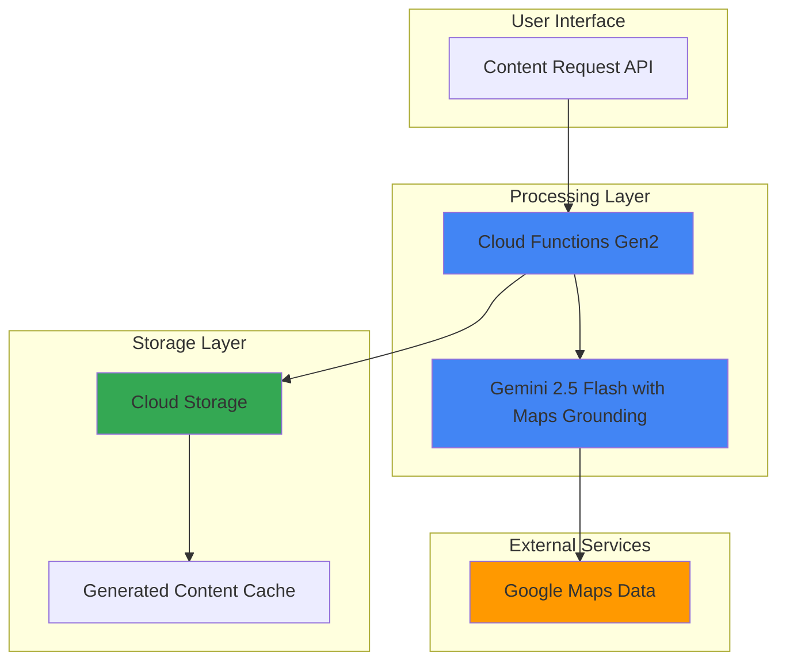

# Location-Aware Content Generation with Gemini and Maps

## Problem

Marketing teams and content creators struggle to generate accurate, locally-relevant content for different geographic locations without extensive manual research. Creating compelling travel descriptions, restaurant reviews, and location-specific marketing copy requires deep local knowledge that's time-consuming to gather and often becomes outdated quickly, leading to generic content that fails to resonate with local audiences.

## Solution

Build an intelligent content generation system using Gemini's Google Maps grounding capabilities to automatically create location-specific, factually accurate marketing content. The system leverages Google's extensive database of 250+ million places to generate contextually relevant descriptions, recommendations, and marketing copy that reflects real local knowledge and current information.

## Architecture Diagram



## Prerequisites

1. Google Cloud account with billing enabled and appropriate IAM permissions
2. Google Cloud CLI installed and configured (or Cloud Shell)
3. Basic understanding of serverless functions and REST APIs
4. Billing account country must be outside the European Economic Area (EEA)
5. Estimated cost: $5-15 for testing resources (Cloud Functions invocations and Vertex AI API calls)

> **Note**: Google Maps grounding requires specific billing permissions and is currently in Preview with geographic restrictions. Ensure your billing account is configured correctly for accessing this feature.

## Preparation

```bash
# Set environment variables for GCP resources
export PROJECT_ID="location-content-$(date +%s)"
export REGION="us-central1"
export ZONE="us-central1-a"

# Generate unique suffix for resource names
RANDOM_SUFFIX=$(openssl rand -hex 3)

# Create new project and set as active
gcloud projects create ${PROJECT_ID} \
    --name="Location Content Generator"
gcloud config set project ${PROJECT_ID}
gcloud config set compute/region ${REGION}
gcloud config set compute/zone ${ZONE}

# Enable required APIs for the project
gcloud services enable cloudfunctions.googleapis.com
gcloud services enable storage.googleapis.com
gcloud services enable aiplatform.googleapis.com
gcloud services enable cloudbuild.googleapis.com

# Create Cloud Storage bucket for generated content
export BUCKET_NAME="location-content-${RANDOM_SUFFIX}"
gsutil mb -p ${PROJECT_ID} \
    -c STANDARD \
    -l ${REGION} \
    gs://${BUCKET_NAME}

# Enable versioning for content history
gsutil versioning set on gs://${BUCKET_NAME}

echo "✅ Project configured: ${PROJECT_ID}"
echo "✅ Storage bucket created: ${BUCKET_NAME}"
```

## Steps

1. **Create Service Account with Required Permissions**:

   Google Maps grounding requires specific IAM permissions to validate billing account eligibility and access Vertex AI services. We'll create a service account with the necessary roles for both resource management and billing verification, following the principle of least privilege.

   ```bash
   # Create service account for the application
   gcloud iam service-accounts create location-content-sa \
       --display-name="Location Content Generator Service Account" \
       --description="Service account for location-aware content generation"
   
   # Get the service account email
   export SA_EMAIL="location-content-sa@${PROJECT_ID}.iam.gserviceaccount.com"
   
   # Grant required permissions for Maps grounding and storage access
   gcloud projects add-iam-policy-binding ${PROJECT_ID} \
       --member="serviceAccount:${SA_EMAIL}" \
       --role="roles/viewer"
   
   gcloud projects add-iam-policy-binding ${PROJECT_ID} \
       --member="serviceAccount:${SA_EMAIL}" \
       --role="roles/aiplatform.user"
   
   gcloud projects add-iam-policy-binding ${PROJECT_ID} \
       --member="serviceAccount:${SA_EMAIL}" \
       --role="roles/storage.admin"
   
   echo "✅ Service account created with Maps grounding permissions"
   ```

2. **Create Function Source Code Directory**:

   Cloud Functions Gen2 provides the serverless compute layer for our content generation API. We'll structure the function code to handle location-based content requests and integrate with Gemini's Maps grounding capabilities using the latest google-genai library.

   ```bash
   # Create function directory and files
   mkdir -p location-content-function
   cd location-content-function
   
   # Create requirements.txt with latest compatible versions
   cat > requirements.txt << 'EOF'
google-genai==0.7.0
functions-framework==3.8.1
google-cloud-storage==2.18.0
flask==3.0.3
EOF
   
   echo "✅ Function directory structure created"
   ```

3. **Implement Location-Aware Content Generation Function**:

   This function integrates Gemini's Google Maps grounding to generate contextually accurate, location-specific content. The Maps grounding feature ensures responses are based on real place data from Google's extensive database of over 250 million locations.

   ```bash
   # Create main.py with content generation logic
   cat > main.py << 'EOF'
import os
import json
from datetime import datetime
from google import genai
from google.genai import types
from google.cloud import storage
from flask import jsonify

# Initialize Vertex AI client with Maps grounding support
client = genai.Client(
    vertexai=True,
    project=os.environ.get('GCP_PROJECT'),
    location='us-central1'
)

# Initialize Cloud Storage client
storage_client = storage.Client()

def generate_location_content(request):
    """Generate location-aware content using Gemini with Maps grounding."""
    
    # Handle CORS for web requests
    if request.method == 'OPTIONS':
        headers = {
            'Access-Control-Allow-Origin': '*',
            'Access-Control-Allow-Methods': 'POST',
            'Access-Control-Allow-Headers': 'Content-Type',
            'Access-Control-Max-Age': '3600'
        }
        return ('', 204, headers)
    
    headers = {'Access-Control-Allow-Origin': '*'}
    
    try:
        # Parse request data
        request_json = request.get_json()
        location = request_json.get('location', '')
        content_type = request_json.get('content_type', 'marketing')
        audience = request_json.get('audience', 'general')
        
        if not location:
            return jsonify({'error': 'Location parameter required'}), 400
        
        # Construct prompt based on content type
        prompts = {
            'marketing': f"""Create compelling marketing copy for {location}. 
                        Include specific local attractions, dining options, and unique 
                        features that make this location special. Target audience: {audience}.
                        Use factual information about real places and businesses.""",
            
            'travel': f"""Write a detailed travel guide for {location}. 
                      Include must-see attractions, local restaurants, transportation 
                      options, and insider tips. Make it engaging and informative 
                      with specific place names and details.""",
            
            'business': f"""Create professional business content about {location} 
                        including market opportunities, local demographics, key 
                        attractions, and business environment. Include specific 
                        venues and establishments."""
        }
        
        prompt = prompts.get(content_type, prompts['marketing'])
        
        # Configure Maps grounding tool
        maps_tool = types.Tool(
            google_maps=types.GoogleMaps(
                auth_config={}  # Uses default authentication
            )
        )
        
        # Generate content with Maps grounding
        response = client.models.generate_content(
            model='gemini-2.5-flash',
            contents=prompt,
            tools=[maps_tool],
            config=types.GenerateContentConfig(
                temperature=0.7,
                max_output_tokens=1000,
                top_p=0.8
            )
        )
        
        generated_content = response.text
        
        # Extract grounding information if available
        grounding_info = []
        if hasattr(response, 'grounding_metadata') and response.grounding_metadata:
            metadata = response.grounding_metadata
            if hasattr(metadata, 'grounding_chunks') and metadata.grounding_chunks:
                for chunk in metadata.grounding_chunks:
                    if hasattr(chunk, 'web') and chunk.web:
                        grounding_info.append({
                            'title': getattr(chunk.web, 'title', 'Unknown'),
                            'uri': getattr(chunk.web, 'uri', ''),
                            'domain': getattr(chunk.web, 'domain', '')
                        })
        
        # Save generated content to Cloud Storage
        bucket_name = os.environ.get('BUCKET_NAME')
        if bucket_name:
            bucket = storage_client.bucket(bucket_name)
            timestamp = datetime.now().strftime('%Y%m%d_%H%M%S')
            filename = f"content/{content_type}_{location.replace(' ', '_')}_{timestamp}.json"
            
            content_data = {
                'location': location,
                'content_type': content_type,
                'audience': audience,
                'generated_content': generated_content,
                'grounding_sources': grounding_info,
                'timestamp': timestamp,
                'model': 'gemini-2.5-flash'
            }
            
            blob = bucket.blob(filename)
            blob.upload_from_string(
                json.dumps(content_data, indent=2),
                content_type='application/json'
            )
        
        return jsonify({
            'content': generated_content,
            'location': location,
            'content_type': content_type,
            'grounding_sources': grounding_info,
            'timestamp': timestamp
        }), 200, headers
        
    except Exception as e:
        return jsonify({'error': str(e)}), 500, headers
EOF
   
   echo "✅ Content generation function implemented with Maps grounding"
   ```

4. **Deploy Cloud Function with Vertex AI Integration**:

   Deploy the serverless function with appropriate environment variables and service account permissions. The function will handle HTTP requests and integrate with Vertex AI's Gemini models using Google Maps grounding for location-specific content generation.

   ```bash
   # Deploy function with Gen2 configuration
   gcloud functions deploy generate-location-content \
       --gen2 \
       --runtime=python312 \
       --region=${REGION} \
       --source=. \
       --entry-point=generate_location_content \
       --trigger=http \
       --service-account=${SA_EMAIL} \
       --set-env-vars="GCP_PROJECT=${PROJECT_ID},BUCKET_NAME=${BUCKET_NAME}" \
       --memory=512Mi \
       --timeout=60s \
       --max-instances=10 \
       --allow-unauthenticated
   
   # Get function URL for testing
   export FUNCTION_URL=$(gcloud functions describe generate-location-content \
       --region=${REGION} \
       --format="value(serviceConfig.uri)")
   
   echo "✅ Function deployed successfully"
   echo "Function URL: ${FUNCTION_URL}"
   ```

5. **Create Content Generation Test Script**:

   This test script demonstrates various content generation scenarios using different locations and content types. It shows how the Maps grounding feature provides accurate, location-specific information for diverse use cases.

   ```bash
   # Return to main directory and create test script
   cd ..
   
   cat > test_content_generation.py << 'EOF'
#!/usr/bin/env python3
import requests
import json
import sys
import os

def test_content_generation(function_url):
    """Test location-aware content generation with various scenarios."""
    
    test_cases = [
        {
            'location': 'Times Square, New York City',
            'content_type': 'marketing',
            'audience': 'tourists'
        },
        {
            'location': 'Pike Place Market, Seattle',
            'content_type': 'travel',
            'audience': 'food enthusiasts'
        },
        {
            'location': 'Silicon Valley, California',
            'content_type': 'business',
            'audience': 'entrepreneurs'
        }
    ]
    
    print("Testing Location-Aware Content Generation...")
    print("=" * 50)
    
    for i, test_case in enumerate(test_cases, 1):
        print(f"\nTest {i}: {test_case['content_type'].title()} content for {test_case['location']}")
        print("-" * 40)
        
        try:
            response = requests.post(
                function_url,
                json=test_case,
                headers={'Content-Type': 'application/json'},
                timeout=60
            )
            
            if response.status_code == 200:
                result = response.json()
                print(f"✅ Content generated successfully")
                print(f"Content preview: {result['content'][:200]}...")
                
                if result.get('grounding_sources'):
                    print(f"📍 Grounded with {len(result['grounding_sources'])} sources")
                    for source in result['grounding_sources'][:2]:
                        print(f"   - {source.get('title', 'Unknown title')}")
                else:
                    print("📍 No explicit grounding sources returned")
            else:
                print(f"❌ Request failed: {response.status_code}")
                print(f"Error: {response.text}")
                
        except requests.exceptions.RequestException as e:
            print(f"❌ Request error: {e}")
    
    print("\n" + "=" * 50)
    print("Testing completed!")

if __name__ == "__main__":
    function_url = os.environ.get('FUNCTION_URL')
    if not function_url:
        print("Please set FUNCTION_URL environment variable")
        sys.exit(1)
    
    test_content_generation(function_url)
EOF
   
   chmod +x test_content_generation.py
   
   echo "✅ Test script created for content generation scenarios"
   ```

6. **Test Location-Aware Content Generation**:

   Execute comprehensive testing to validate that the Maps grounding integration provides accurate, location-specific content. The tests cover different content types and geographic locations to demonstrate the system's versatility.

   ```bash
   # Install required Python packages for testing
   pip3 install requests --user --quiet
   
   # Run content generation tests
   python3 test_content_generation.py
   
   echo "✅ Content generation tests completed"
   ```

## Validation & Testing

1. **Verify Cloud Function Deployment**:

   ```bash
   # Check function status and configuration
   gcloud functions describe generate-location-content \
       --region=${REGION} \
       --format="table(name,status,runtime,serviceConfig.environmentVariables)"
   ```

   Expected output: Function status should show "ACTIVE" with Python 3.12 runtime.

2. **Test Direct API Endpoint**:

   ```bash
   # Test with a simple location request
   curl -X POST ${FUNCTION_URL} \
       -H "Content-Type: application/json" \
       -d '{
         "location": "Golden Gate Bridge, San Francisco",
         "content_type": "travel",
         "audience": "photographers"
       }' | python3 -m json.tool
   ```

   Expected output: JSON response with generated content and potential grounding sources.

3. **Verify Content Storage in Cloud Storage**:

   ```bash
   # Check generated content files
   gsutil ls -la gs://${BUCKET_NAME}/content/
   
   # View a sample generated content file
   LATEST_FILE=$(gsutil ls gs://${BUCKET_NAME}/content/ | tail -1)
   gsutil cat ${LATEST_FILE} | python3 -m json.tool
   ```

   Expected output: List of JSON files containing generated content with metadata.

## Cleanup

1. **Delete Cloud Function**:

   ```bash
   # Remove the deployed function
   gcloud functions delete generate-location-content \
       --region=${REGION} \
       --quiet
   
   echo "✅ Cloud Function deleted"
   ```

2. **Remove Cloud Storage Resources**:

   ```bash
   # Delete all objects and bucket
   gsutil -m rm -r gs://${BUCKET_NAME}
   
   echo "✅ Storage bucket and contents deleted"
   ```

3. **Delete Service Account**:

   ```bash
   # Remove service account
   gcloud iam service-accounts delete ${SA_EMAIL} --quiet
   
   echo "✅ Service account deleted"
   ```

4. **Remove Project (Optional)**:

   ```bash
   # Delete entire project to ensure complete cleanup
   gcloud projects delete ${PROJECT_ID} --quiet
   
   echo "✅ Project deletion initiated"
   echo "Note: Project deletion may take several minutes to complete"
   ```

## Discussion

Google Maps grounding in Vertex AI represents a significant advancement in location-aware AI applications, providing access to Google's comprehensive database of over 250 million places worldwide. This integration ensures that generated content is not only contextually relevant but also factually accurate, drawing from real-time information about businesses, landmarks, and points of interest. The grounding mechanism reduces hallucination risks common in generative AI while providing verifiable sources for the information presented, making it invaluable for content creators who need accurate local information.

The serverless architecture using Cloud Functions Gen2 provides automatic scaling and cost efficiency, charging only for actual content generation requests. This pattern is particularly valuable for applications with variable traffic patterns, such as travel websites, marketing platforms, or real estate applications that may experience seasonal usage spikes. The integration with Cloud Storage creates a comprehensive content management system that maintains historical versions and enables content analysis over time, providing valuable insights into content performance and user preferences.

Security considerations are paramount when implementing Maps grounding, as the feature requires specific IAM permissions and billing account validation. The service currently restricts access from accounts with billing addresses in the European Economic Area, reflecting data residency and privacy regulations. Organizations implementing this solution should ensure compliance with their geographic and regulatory requirements while leveraging the enhanced accuracy that Maps grounding provides. The latest google-genai library provides robust error handling and improved authentication mechanisms for production deployments.

> **Tip**: Monitor your Vertex AI usage through Google Cloud's cost management tools, as Maps grounding may incur additional charges compared to standard Gemini model usage. Consider implementing caching strategies to reduce API calls for frequently requested locations.

For more information, see the official [Google Maps Grounding documentation](https://cloud.google.com/vertex-ai/generative-ai/docs/grounding/grounding-with-google-maps) and [Vertex AI best practices guide](https://cloud.google.com/vertex-ai/docs/best-practices).

## Challenge

Extend this location-aware content generation system with these enhancements:

1. **Multi-language Support**: Implement content generation in multiple languages using Gemini's translation capabilities, allowing the same location data to serve diverse global audiences with culturally appropriate content.

2. **Real-time Content Optimization**: Add Cloud Monitoring integration to track content performance metrics and automatically adjust generation parameters based on user engagement data and conversion rates.

3. **Advanced Grounding Analysis**: Implement detailed analysis of grounding sources to provide content confidence scores and source reliability metrics for editorial review processes, including verification of business hours and current information.

4. **Batch Processing Pipeline**: Create a Cloud Workflows solution for bulk content generation across multiple locations, useful for travel companies or marketing agencies managing large destination portfolios with scheduled updates.

5. **Integration with Google My Business**: Enhance the system by integrating with Google My Business API to incorporate verified business information, current operating hours, and real-time reviews into generated content for maximum accuracy.

## Infrastructure Code

*Infrastructure code will be generated after recipe approval.*