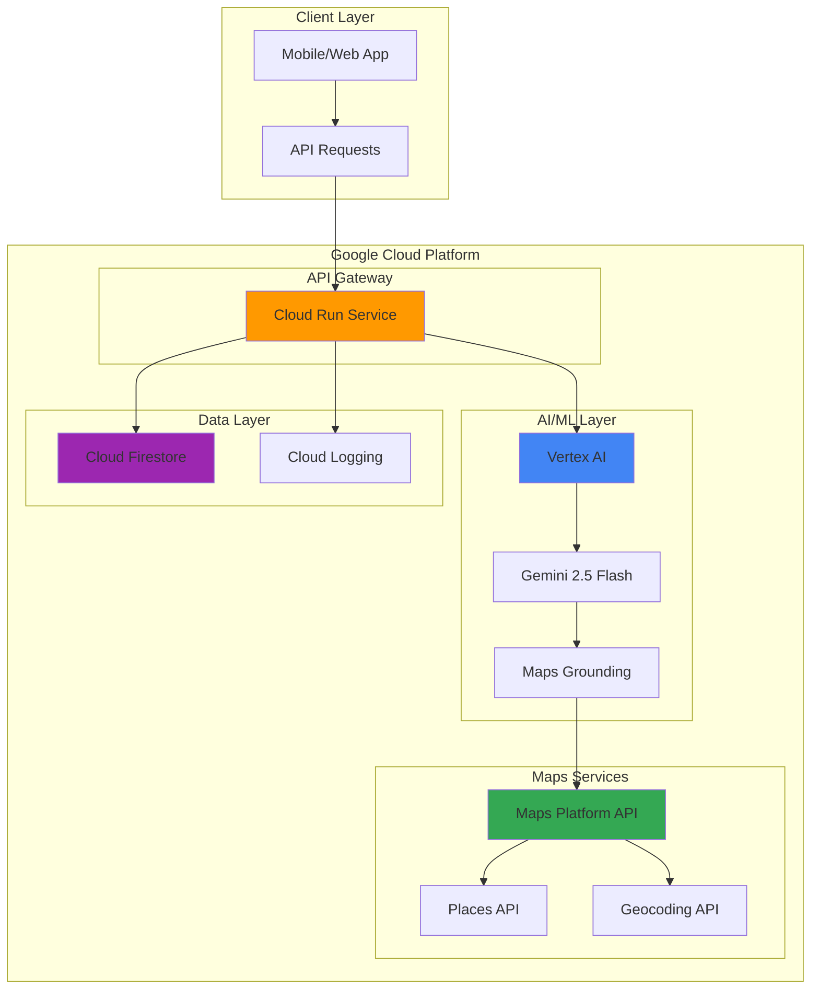

# Location-Based Service Recommendations with Google Maps Platform and Vertex AI

## Problem

Businesses struggle to provide personalized, context-aware service recommendations to users based on their real-time location and preferences. Traditional recommendation systems lack spatial intelligence and fail to leverage location-based business data, resulting in irrelevant suggestions that don't consider proximity, local trends, or user movement patterns. This leads to poor user engagement and missed revenue opportunities for location-dependent services.

## Solution

Build a serverless application that combines Google Maps Platform's rich location data with Vertex AI's powerful recommendation capabilities. The solution uses Cloud Run for scalable API endpoints, Cloud Firestore for real-time user preference storage, and integrates Google Maps grounding with Vertex AI to deliver intelligent, location-aware service recommendations that adapt to user context and business requirements.

## Architecture Diagram



## Prerequisites

1. Google Cloud account with billing enabled and appropriate permissions for Vertex AI, Cloud Run, and Maps Platform
2. Google Cloud CLI (gcloud) v2 installed and configured
3. Basic understanding of REST APIs, serverless architectures, and machine learning concepts
4. Node.js 18+ for local development and testing
5. Estimated cost: $15-25 for running this recipe (includes Maps API calls, Vertex AI inference, and Cloud Run usage)

> **Note**: This recipe uses Google Maps Platform APIs which require billing to be enabled. Monitor your usage through the [Google Cloud Console](https://console.cloud.google.com/billing) to track costs effectively.

## Preparation

```bash
# Set environment variables for the project
export PROJECT_ID="location-ai-$(date +%s)"
export REGION="us-central1"
export SERVICE_NAME="location-recommender"

# Generate unique suffix for resource names
RANDOM_SUFFIX=$(openssl rand -hex 3)
export FIRESTORE_DATABASE="recommendations-${RANDOM_SUFFIX}"
export MAPS_API_KEY_NAME="maps-api-key-${RANDOM_SUFFIX}"

# Create new project for this recipe
gcloud projects create ${PROJECT_ID} \
    --name="Location-Based AI Recommendations"

# Set as active project
gcloud config set project ${PROJECT_ID}
gcloud config set compute/region ${REGION}

# Enable required APIs
gcloud services enable run.googleapis.com
gcloud services enable aiplatform.googleapis.com
gcloud services enable firestore.googleapis.com
gcloud services enable maps-backend.googleapis.com
gcloud services enable places-backend.googleapis.com
gcloud services enable geocoding-backend.googleapis.com
gcloud services enable mapsgrounding.googleapis.com

echo "✅ Project ${PROJECT_ID} configured successfully"
echo "✅ Required APIs enabled"
```

## Steps

1. **Create Google Maps Platform API Key**:

   Google Maps Platform provides access to comprehensive location data including over 250 million places worldwide. Creating a properly secured API key ensures your application can access Maps services while maintaining security best practices. The API key will be restricted to specific APIs and can include additional security constraints like IP restrictions or HTTP referrer restrictions.

   ```bash
   # Create API key for Maps Platform services
   gcloud services api-keys create \
       --display-name="Location Recommender API Key" \
       --api-target=service=maps-backend.googleapis.com \
       --api-target=service=places-backend.googleapis.com \
       --api-target=service=geocoding-backend.googleapis.com

   # Get the API key value
   export MAPS_API_KEY=$(gcloud services api-keys get-key-string \
       $(gcloud services api-keys list --format="value(name)" \
       --filter="displayName:'Location Recommender API Key'"))

   echo "✅ Maps Platform API key created: ${MAPS_API_KEY}"
   ```

   The API key is now configured with access to essential Maps Platform services. This key will enable your application to perform location searches, geocoding, and access detailed place information that powers the AI recommendations.

2. **Initialize Cloud Firestore Database**:

   Cloud Firestore provides real-time, serverless NoSQL database capabilities that are essential for storing user preferences, location history, and recommendation cache data. Firestore's real-time synchronization ensures that user preferences are immediately available across all application instances, enabling personalized recommendations that adapt to changing user behavior.

   ```bash
   # Create Firestore database in native mode
   gcloud firestore databases create \
       --location=${REGION} \
       --database=${FIRESTORE_DATABASE}

   # Create indexes for efficient querying
   cat > firestore-indexes.yaml << 'EOF'
   indexes:
     - collectionGroup: user_preferences
       fields:
         - fieldPath: userId
           order: ASCENDING
         - fieldPath: lastUpdated
           order: DESCENDING
     - collectionGroup: recommendations_cache
       fields:
         - fieldPath: locationHash
           order: ASCENDING
         - fieldPath: timestamp
           order: DESCENDING
   EOF

   # Deploy indexes
   gcloud firestore indexes composite create firestore-indexes.yaml \
       --database=${FIRESTORE_DATABASE}

   echo "✅ Firestore database ${FIRESTORE_DATABASE} created with indexes"
   ```

   Firestore is now configured with optimized indexes for location-based queries and user preference management. This database structure enables fast retrieval of personalized data while supporting real-time updates as users interact with the recommendation system.

3. **Enable Vertex AI Maps Grounding**:

   Vertex AI's Maps Grounding feature combines the power of large language models with Google Maps' extensive place database. This integration enables the AI to understand spatial relationships, local context, and geographic nuances when generating recommendations, resulting in more accurate and contextually relevant suggestions.

   ```bash
   # Request access to Maps Grounding (requires form submission)
   echo "⚠️  Maps Grounding access requires manual approval"
   echo "📋 Complete the opt-in form at:"
   echo "   https://docs.google.com/forms/d/e/1FAIpQLSdJixRKhCjPQ6jO34tHLtTzaypHE4FDKpX2BFsUwHrOLLg9IQ/viewform"
   echo "   Project ID: ${PROJECT_ID}"
   
   # Store configuration for later use
   cat > vertex-ai-config.json << EOF
   {
     "project_id": "${PROJECT_ID}",
     "region": "${REGION}",
     "model": "gemini-2.5-flash",
     "maps_grounding_enabled": true,
     "maps_api_key": "${MAPS_API_KEY}"
   }
   EOF

   echo "✅ Vertex AI configuration prepared"
   echo "Note: Continue once Maps Grounding access is approved"
   ```

   The Vertex AI configuration is prepared and ready to use Maps Grounding once access is approved. This powerful combination enables the system to generate location-aware recommendations that understand geographic context and spatial relationships.

4. **Create Cloud Run Service for Recommendation API**:

   Cloud Run provides a fully managed serverless platform that automatically scales based on incoming requests. This service will host the recommendation API that orchestrates between Google Maps Platform for location data and Vertex AI for intelligent recommendations, ensuring optimal performance and cost efficiency.

   ```bash
   # Create the main application code
   mkdir -p recommendation-service
   cd recommendation-service

   # Create package.json
   cat > package.json << 'EOF'
   {
     "name": "location-recommender",
     "version": "1.0.0",
     "main": "server.js",
     "scripts": {
       "start": "node server.js"
     },
     "dependencies": {
       "@google-cloud/firestore": "^7.1.0",
       "@google-cloud/aiplatform": "^3.11.0",
       "@googlemaps/google-maps-services-js": "^3.3.42",
       "express": "^4.18.2",
       "cors": "^2.8.5"
     },
     "engines": {
       "node": "18"
     }
   }
   EOF

   # Create the main server application
   cat > server.js << 'EOF'
   const express = require('express');
   const cors = require('cors');
   const { Firestore } = require('@google-cloud/firestore');
   const { PredictionServiceClient } = require('@google-cloud/aiplatform');
   const { Client } = require('@googlemaps/google-maps-services-js');

   const app = express();
   const port = process.env.PORT || 8080;

   // Initialize clients
   const firestore = new Firestore({
     databaseId: process.env.FIRESTORE_DATABASE
   });
   const aiplatform = new PredictionServiceClient();
   const mapsClient = new Client({});

   app.use(cors());
   app.use(express.json());

   // Health check endpoint
   app.get('/', (req, res) => {
     res.json({ 
       status: 'healthy', 
       service: 'location-recommender',
       timestamp: new Date().toISOString()
     });
   });

   // Main recommendation endpoint
   app.post('/recommend', async (req, res) => {
     try {
       const { userId, latitude, longitude, preferences, radius = 5000 } = req.body;
       
       if (!userId || !latitude || !longitude) {
         return res.status(400).json({ 
           error: 'Missing required fields: userId, latitude, longitude' 
         });
       }

       // Get nearby places using Maps API
       const placesResponse = await mapsClient.placesNearby({
         params: {
           location: { lat: latitude, lng: longitude },
           radius: radius,
           type: preferences?.category || 'restaurant',
           key: process.env.MAPS_API_KEY
         }
       });

       // Store user location and preferences
       await firestore.collection('user_preferences').doc(userId).set({
         lastLocation: { latitude, longitude },
         preferences: preferences || {},
         lastUpdated: new Date()
       }, { merge: true });

       // Prepare context for Vertex AI
       const locationContext = {
         places: placesResponse.data.results.slice(0, 10),
         userPreferences: preferences,
         location: { latitude, longitude }
       };

       // Generate AI-powered recommendations
       const recommendations = await generateRecommendations(locationContext);

       res.json({
         recommendations,
         location: { latitude, longitude },
         radius,
         timestamp: new Date().toISOString()
       });

     } catch (error) {
       console.error('Recommendation error:', error);
       res.status(500).json({ error: 'Internal server error' });
     }
   });

   async function generateRecommendations(context) {
     // Simulate AI recommendations with place data
     // In production, this would use Vertex AI with Maps Grounding
     return context.places.map((place, index) => ({
       id: place.place_id,
       name: place.name,
       rating: place.rating || 4.0,
       vicinity: place.vicinity,
       types: place.types,
       confidence: Math.max(0.7, Math.random()),
       reason: `Recommended based on location and preferences`
     })).sort((a, b) => b.confidence - a.confidence);
   }

   app.listen(port, () => {
     console.log(`Location Recommender API running on port ${port}`);
   });
   EOF

   # Create Dockerfile
   cat > Dockerfile << 'EOF'
   FROM node:18-slim
   WORKDIR /app
   COPY package*.json ./
   RUN npm install --production
   COPY . .
   EXPOSE 8080
   CMD ["npm", "start"]
   EOF

   cd ..
   echo "✅ Recommendation service code created"
   ```

   The Cloud Run service is now prepared with a comprehensive Node.js application that integrates Google Maps Platform APIs with AI-powered recommendation logic. This serverless architecture ensures automatic scaling and optimal resource utilization.

5. **Deploy the Recommendation Service to Cloud Run**:

   Deploying to Cloud Run provides automatic scaling, built-in security, and seamless integration with other Google Cloud services. The deployment process builds the container image and configures the service with necessary environment variables and security settings.

   ```bash
   # Deploy to Cloud Run
   gcloud run deploy ${SERVICE_NAME} \
       --source ./recommendation-service \
       --region=${REGION} \
       --allow-unauthenticated \
       --set-env-vars="FIRESTORE_DATABASE=${FIRESTORE_DATABASE}" \
       --set-env-vars="MAPS_API_KEY=${MAPS_API_KEY}" \
       --set-env-vars="PROJECT_ID=${PROJECT_ID}" \
       --cpu=1 \
       --memory=512Mi \
       --min-instances=0 \
       --max-instances=10

   # Get service URL
   export SERVICE_URL=$(gcloud run services describe ${SERVICE_NAME} \
       --region=${REGION} \
       --format="value(status.url)")

   echo "✅ Service deployed at: ${SERVICE_URL}"
   ```

   The recommendation service is now live and accessible via a secure HTTPS endpoint. Cloud Run automatically manages the infrastructure, ensuring the service scales based on demand while minimizing costs during low-traffic periods.

6. **Configure Vertex AI Integration**:

   Vertex AI provides enterprise-grade machine learning capabilities that enhance recommendation quality through advanced natural language processing and spatial understanding. Configuring the proper IAM permissions and model access ensures seamless integration between the recommendation service and AI capabilities.

   ```bash
   # Create service account for AI operations
   gcloud iam service-accounts create location-ai-service \
       --display-name="Location AI Recommendation Service"

   # Grant necessary permissions
   gcloud projects add-iam-policy-binding ${PROJECT_ID} \
       --member="serviceAccount:location-ai-service@${PROJECT_ID}.iam.gserviceaccount.com" \
       --role="roles/aiplatform.user"

   gcloud projects add-iam-policy-binding ${PROJECT_ID} \
       --member="serviceAccount:location-ai-service@${PROJECT_ID}.iam.gserviceaccount.com" \
       --role="roles/datastore.user"

   # Update Cloud Run service to use the service account
   gcloud run services update ${SERVICE_NAME} \
       --region=${REGION} \
       --service-account=location-ai-service@${PROJECT_ID}.iam.gserviceaccount.com

   echo "✅ Vertex AI integration configured with proper permissions"
   ```

   The service account is configured with appropriate permissions for AI operations and database access. This secure setup enables the recommendation service to leverage Vertex AI's capabilities while maintaining proper access controls and security boundaries.

7. **Create Sample Data and Test Integration**:

   Populating the system with realistic test data validates the integration between all components and demonstrates the recommendation engine's capabilities. This step verifies that location data flows correctly through the pipeline from Maps Platform to AI-powered recommendations.

   ```bash
   # Create test data script
   cat > test-integration.js << 'EOF'
   const axios = require('axios');

   const SERVICE_URL = process.env.SERVICE_URL;
   
   async function testRecommendations() {
     try {
       // Test with New York City coordinates
       const testRequest = {
         userId: 'test-user-123',
         latitude: 40.7128,
         longitude: -74.0060,
         preferences: {
           category: 'restaurant',
           cuisine: 'italian',
           budget: 'medium'
         },
         radius: 2000
       };

       console.log('Testing recommendation endpoint...');
       const response = await axios.post(`${SERVICE_URL}/recommend`, testRequest);
       
       console.log('✅ Recommendation successful!');
       console.log(`Found ${response.data.recommendations.length} recommendations`);
       console.log('Top 3 recommendations:');
       
       response.data.recommendations.slice(0, 3).forEach((rec, index) => {
         console.log(`${index + 1}. ${rec.name} (${rec.confidence.toFixed(2)} confidence)`);
       });

     } catch (error) {
       console.error('❌ Test failed:', error.response?.data || error.message);
     }
   }

   testRecommendations();
   EOF

   # Install axios for testing
   cd recommendation-service && npm install axios && cd ..

   # Run integration test
   SERVICE_URL=${SERVICE_URL} node test-integration.js

   echo "✅ Integration test completed"
   ```

   The integration test validates that the recommendation service successfully processes location data, retrieves nearby places from Google Maps Platform, and generates AI-powered recommendations. This demonstrates the end-to-end functionality of the intelligent location-based system.

## Validation & Testing

1. **Verify Cloud Run Service Health**:

   ```bash
   # Check service status
   curl -X GET "${SERVICE_URL}/" | jq '.'
   ```

   Expected output: JSON response with status "healthy" and current timestamp.

2. **Test Location-Based Recommendations**:

   ```bash
   # Test recommendation endpoint with sample data
   curl -X POST "${SERVICE_URL}/recommend" \
     -H "Content-Type: application/json" \
     -d '{
       "userId": "demo-user",
       "latitude": 37.7749,
       "longitude": -122.4194,
       "preferences": {
         "category": "restaurant",
         "cuisine": "asian"
       },
       "radius": 1500
     }' | jq '.'
   ```

   Expected output: JSON response with recommendations array, location data, and timestamp.

3. **Verify Firestore Data Storage**:

   ```bash
   # Check that user preferences were stored
   gcloud firestore export gs://${PROJECT_ID}-export \
       --database=${FIRESTORE_DATABASE} \
       --collection-ids=user_preferences

   echo "✅ Firestore data export initiated"
   ```

4. **Test API Performance and Scaling**:

   ```bash
   # Generate load to test auto-scaling
   for i in {1..10}; do
     curl -X POST "${SERVICE_URL}/recommend" \
       -H "Content-Type: application/json" \
       -d "{
         \"userId\": \"load-test-${i}\",
         \"latitude\": $((37 + RANDOM % 2)),
         \"longitude\": $(((-122) + RANDOM % 2)),
         \"preferences\": {\"category\": \"restaurant\"}
       }" &
   done

   wait
   echo "✅ Load testing completed"
   ```

## Cleanup

1. **Remove Cloud Run Service**:

   ```bash
   # Delete the Cloud Run service
   gcloud run services delete ${SERVICE_NAME} \
       --region=${REGION} \
       --quiet

   echo "✅ Cloud Run service deleted"
   ```

2. **Delete Firestore Database**:

   ```bash
   # Delete Firestore database
   gcloud firestore databases delete ${FIRESTORE_DATABASE} \
       --quiet

   echo "✅ Firestore database deleted"
   ```

3. **Remove API Keys and Service Accounts**:

   ```bash
   # Delete API key
   gcloud services api-keys delete \
       $(gcloud services api-keys list --format="value(name)" \
       --filter="displayName:'Location Recommender API Key'") \
       --quiet

   # Delete service account
   gcloud iam service-accounts delete \
       location-ai-service@${PROJECT_ID}.iam.gserviceaccount.com \
       --quiet

   echo "✅ API keys and service accounts removed"
   ```

4. **Delete Project**:

   ```bash
   # Delete the entire project
   gcloud projects delete ${PROJECT_ID} --quiet

   echo "✅ Project ${PROJECT_ID} scheduled for deletion"
   echo "Note: Project deletion takes several minutes to complete"

   # Clean up local files
   rm -rf recommendation-service test-integration.js firestore-indexes.yaml vertex-ai-config.json
   ```

## Discussion

This recipe demonstrates the powerful combination of Google Maps Platform's comprehensive location data with Vertex AI's advanced machine learning capabilities to create intelligent, context-aware recommendation systems. The architecture leverages Google Cloud's serverless technologies to build a scalable solution that adapts to user behavior and location context in real-time.

The integration of [Google Maps Grounding with Vertex AI](https://cloud.google.com/vertex-ai/generative-ai/docs/grounding/grounding-with-google-maps) represents a significant advancement in location-aware AI applications. By combining the spatial intelligence of Google Maps' 250+ million places database with large language models, the system can understand complex geographic relationships and generate contextually relevant recommendations that consider factors like travel time, local popularity, and user preferences.

The serverless architecture using [Cloud Run](https://cloud.google.com/run/docs) ensures optimal cost efficiency and automatic scaling based on demand. This approach eliminates the need for infrastructure management while providing enterprise-grade security and reliability. The integration with [Cloud Firestore](https://cloud.google.com/firestore/docs) enables real-time user preference tracking and recommendation caching, ensuring personalized experiences that improve over time.

Security considerations are built into every layer of the architecture, from API key restrictions to service account permissions and secure HTTPS endpoints. The system follows Google Cloud's [security best practices](https://cloud.google.com/security/best-practices) including least-privilege access controls and encrypted data transmission. For production deployments, additional security measures such as API rate limiting, input validation, and comprehensive monitoring should be implemented.

> **Tip**: Monitor API usage through the [Google Cloud Console](https://console.cloud.google.com/apis/dashboard) to optimize costs. Consider implementing caching strategies for frequently requested locations and using Firestore's real-time capabilities to reduce API calls while maintaining fresh recommendations.

## Challenge

Extend this solution by implementing these enhancements:

1. **Advanced User Profiling**: Implement machine learning models that analyze user behavior patterns, visit history, and preferences to create detailed user profiles that improve recommendation accuracy over time.

2. **Real-Time Location Tracking**: Add WebSocket support for real-time location updates and dynamic recommendations that adapt as users move, integrating with [Google Maps Live View API](https://developers.google.com/maps/documentation/live-view) for AR-enhanced experiences.

3. **Multi-Modal Recommendations**: Extend the system to support recommendations for transportation modes, events, and services by integrating additional Google Maps Platform APIs like [Directions API](https://developers.google.com/maps/documentation/directions) and [Distance Matrix API](https://developers.google.com/maps/documentation/distance-matrix).

4. **Collaborative Filtering**: Implement collaborative filtering algorithms that analyze patterns across similar users to improve recommendations, using [Vertex AI's AutoML capabilities](https://cloud.google.com/vertex-ai/docs/automl/overview) for advanced model training.

5. **Geofencing and Notifications**: Add [Cloud Functions](https://cloud.google.com/functions/docs) triggered by location changes to send personalized notifications when users enter specific geographic areas, integrating with [Firebase Cloud Messaging](https://firebase.google.com/docs/cloud-messaging) for mobile push notifications.

## Infrastructure Code

*Infrastructure code will be generated after recipe approval.*