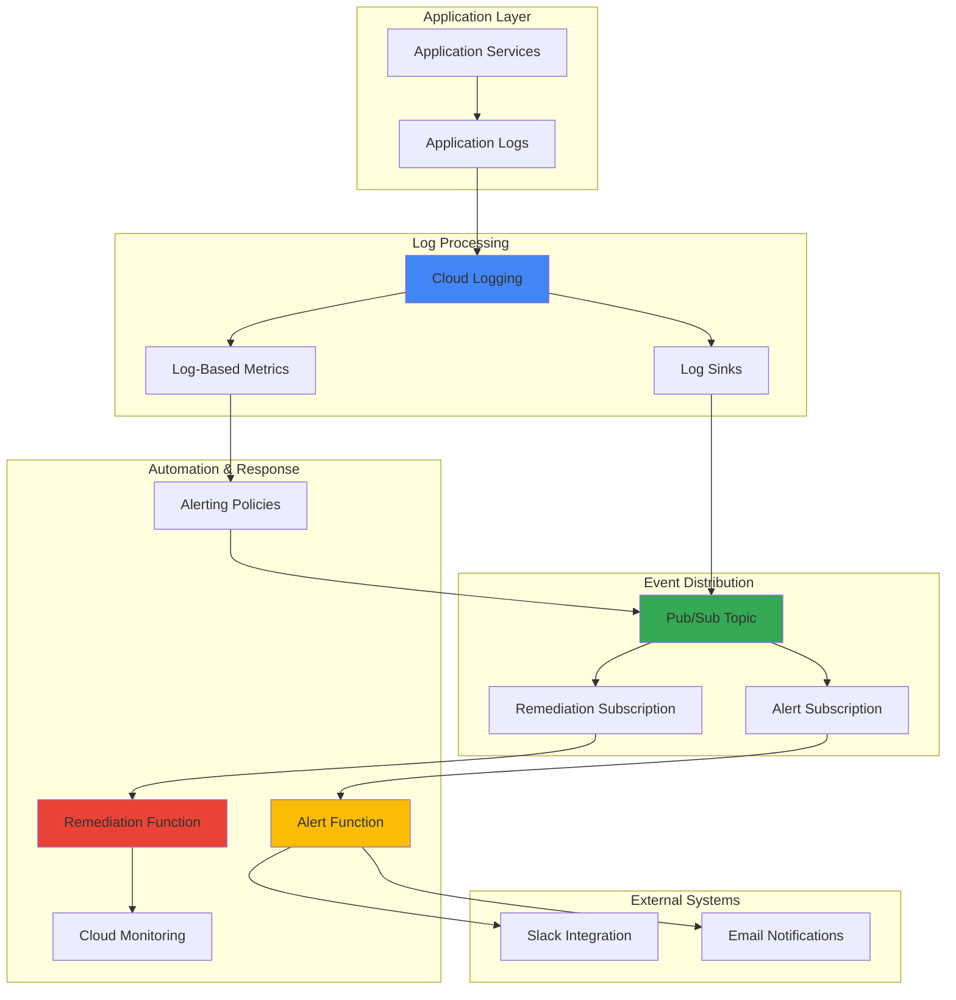

# Log-Driven Automation with Cloud Logging and Pub/Sub

## Problem

Organizations struggle with manual incident response processes that lead to delayed detection and resolution of application issues. Traditional monitoring approaches require teams to actively watch dashboards, manually correlate log patterns, and execute remediation actions, resulting in prolonged service outages and increased operational overhead during critical production incidents.

## Solution

Build an intelligent log-driven automation system using Cloud Logging's log-based metrics, Pub/Sub for event distribution, and Cloud Functions for automated remediation. This solution monitors application logs in real-time, automatically detects error patterns and anomalies, triggers structured alerts through Pub/Sub messaging, and executes predefined remediation actions to minimize incident response time.

## Architecture Diagram



## Prerequisites

1. Google Cloud account with billing enabled and appropriate IAM permissions
2. Google Cloud CLI installed and configured (or Google Cloud Shell)
3. Basic understanding of Google Cloud Logging, Pub/Sub, and Cloud Functions
4. Familiarity with log-based metrics and alerting concepts
5. Knowledge of JavaScript/Node.js for Cloud Functions development
6. Estimated cost: $5-15 per month depending on log volume and function executions

> **Note**: This implementation follows Google Cloud's Well-Architected Framework principles for operational excellence and reliability. Ensure proper IAM permissions are configured for cross-service integration.

## Preparation

```bash
# Set environment variables for Google Cloud resources
export PROJECT_ID="log-automation-$(date +%s)"
export REGION="us-central1"
export ZONE="us-central1-a"

# Generate unique suffix for resource names
RANDOM_SUFFIX=$(openssl rand -hex 3)
export TOPIC_NAME="incident-automation-${RANDOM_SUFFIX}"
export ALERT_FUNCTION_NAME="alert-processor-${RANDOM_SUFFIX}"
export REMEDIATION_FUNCTION_NAME="auto-remediate-${RANDOM_SUFFIX}"
export LOG_SINK_NAME="automation-sink-${RANDOM_SUFFIX}"

# Set default project and region
gcloud config set project ${PROJECT_ID}
gcloud config set compute/region ${REGION}
gcloud config set functions/region ${REGION}

# Enable required Google Cloud APIs
gcloud services enable logging.googleapis.com
gcloud services enable pubsub.googleapis.com
gcloud services enable cloudfunctions.googleapis.com
gcloud services enable monitoring.googleapis.com
gcloud services enable cloudresourcemanager.googleapis.com

echo "✅ Project configured: ${PROJECT_ID}"
echo "✅ Region configured: ${REGION}"
```

## Steps

1. **Create Pub/Sub Topic for Event Distribution**:

   Pub/Sub provides a fully managed messaging service that enables reliable, scalable event distribution between your log processing pipeline and automation functions. Creating a topic establishes the central communication hub where log-based alerts and automation triggers will be published, ensuring decoupled and resilient system architecture.

   ```bash
   # Create the main topic for incident automation
   gcloud pubsub topics create ${TOPIC_NAME}
   
   # Create subscriptions for different automation workflows
   gcloud pubsub subscriptions create alert-subscription \
       --topic=${TOPIC_NAME} \
       --ack-deadline=60
   
   gcloud pubsub subscriptions create remediation-subscription \
       --topic=${TOPIC_NAME} \
       --ack-deadline=300 \
       --filter='attributes.severity="HIGH" OR attributes.type="ERROR"'
   
   echo "✅ Pub/Sub topic and subscriptions created successfully"
   ```

   The topic now serves as the central event distribution mechanism with dedicated subscriptions for alerts and remediation workflows. The filtered subscription ensures that only high-severity incidents trigger automated remediation, while all events are captured for alerting purposes.

2. **Create Log Sink to Forward Critical Logs**:

   Cloud Logging sinks enable automatic forwarding of log entries that match specific criteria to external destinations like Pub/Sub. This configuration ensures that critical application errors and anomalies are immediately routed to your automation pipeline, enabling real-time incident detection and response.

   ```bash
   # Create log sink to forward error logs to Pub/Sub
   gcloud logging sinks create ${LOG_SINK_NAME} \
       pubsub.googleapis.com/projects/${PROJECT_ID}/topics/${TOPIC_NAME} \
       --log-filter='severity>=ERROR OR jsonPayload.level="ERROR" OR textPayload:"Exception"'
   
   # Get the sink's service account for IAM binding
   SINK_SERVICE_ACCOUNT=$(gcloud logging sinks describe ${LOG_SINK_NAME} \
       --format="value(writerIdentity)")
   
   # Grant Pub/Sub publisher permissions to the sink
   gcloud pubsub topics add-iam-policy-binding ${TOPIC_NAME} \
       --member=${SINK_SERVICE_ACCOUNT} \
       --role=roles/pubsub.publisher
   
   echo "✅ Log sink configured with Pub/Sub integration"
   ```

   The log sink is now actively monitoring your application logs and automatically forwarding error-level entries to Pub/Sub. This creates the foundation for real-time log-driven automation by ensuring critical events are immediately available for processing.

3. **Create Log-Based Metrics for Monitoring**:

   Log-based metrics convert log data into Cloud Monitoring time-series data, enabling you to track trends, create dashboards, and establish alerting thresholds. These metrics provide quantitative insights into application health and form the basis for intelligent alerting policies.

   ```bash
   # Create metric for error rate monitoring
   gcloud logging metrics create error_rate_metric \
       --description="Tracks application error rates over time" \
       --log-filter='severity>=ERROR' \
       --value-extractor="" \
       --label-extractors='service=EXTRACT(jsonPayload.service)'
   
   # Create metric for exception patterns
   gcloud logging metrics create exception_pattern_metric \
       --description="Counts specific exception patterns" \
       --log-filter='textPayload:"Exception" OR jsonPayload.exception_type!=""' \
       --value-extractor="" \
       --label-extractors='exception_type=EXTRACT(jsonPayload.exception_type)'
   
   # Create metric for latency anomalies
   gcloud logging metrics create latency_anomaly_metric \
       --description="Tracks request latency spikes" \
       --log-filter='jsonPayload.response_time>5000' \
       --value-extractor='EXTRACT(jsonPayload.response_time)' \
       --metric-kind=GAUGE
   
   echo "✅ Log-based metrics created for comprehensive monitoring"
   ```

   These metrics now provide quantitative visibility into your application's health patterns. The metrics enable trend analysis, threshold-based alerting, and automated decision-making for incident response workflows.

4. **Deploy Alert Processing Cloud Function**:

   Cloud Functions provide serverless compute for processing automation events without managing infrastructure. This function receives log-based alerts from Pub/Sub and enriches them with context, performs initial triage, and routes notifications to appropriate channels based on severity and impact.

   ```bash
   # Create directory for alert function
   mkdir -p alert-function
   cd alert-function
   
   # Create package.json for dependencies
   cat > package.json << 'EOF'
   {
     "name": "alert-processor",
     "version": "1.0.0",
     "dependencies": {
       "@google-cloud/functions-framework": "^3.0.0",
       "@google-cloud/monitoring": "^4.0.0",
       "@google-cloud/logging": "^11.0.0",
       "axios": "^1.6.0"
     }
   }
   EOF
   
   # Create the alert processing function
   cat > index.js << 'EOF'
   const functions = require('@google-cloud/functions-framework');
   const {Logging} = require('@google-cloud/logging');
   const axios = require('axios');
   
   const logging = new Logging();
   
   functions.cloudEvent('processAlert', async (cloudEvent) => {
     try {
       const message = cloudEvent.data;
       const logEntry = Buffer.from(message.data, 'base64').toString();
       const parsedLog = JSON.parse(logEntry);
       
       // Extract relevant information
       const severity = parsedLog.severity || 'UNKNOWN';
       const timestamp = parsedLog.timestamp;
       const resource = parsedLog.resource?.labels?.instance_id || 'unknown';
       
       // Enrich alert with context
       const alertData = {
         severity: severity,
         timestamp: timestamp,
         resource: resource,
         message: parsedLog.textPayload || parsedLog.jsonPayload?.message,
         source: 'cloud-logging',
         runbook: getRunbookUrl(parsedLog)
       };
       
       // Route notification based on severity
       if (severity === 'CRITICAL' || severity === 'ERROR') {
         await sendSlackAlert(alertData);
         await createIncident(alertData);
       }
       
       console.log('Alert processed successfully:', alertData);
     } catch (error) {
       console.error('Error processing alert:', error);
       throw error;
     }
   });
   
   function getRunbookUrl(logEntry) {
     // Return relevant runbook based on log patterns
     if (logEntry.textPayload?.includes('OutOfMemory')) {
       return 'https://runbooks.company.com/memory-issues';
     }
     if (logEntry.textPayload?.includes('Connection')) {
       return 'https://runbooks.company.com/connectivity';
     }
     return 'https://runbooks.company.com/general';
   }
   
   async function sendSlackAlert(alertData) {
     // Integrate with Slack webhook (replace with actual webhook URL)
     const slackWebhook = process.env.SLACK_WEBHOOK_URL;
     if (!slackWebhook) return;
     
     const payload = {
       text: `🚨 ${alertData.severity} Alert`,
       attachments: [{
         color: alertData.severity === 'CRITICAL' ? 'danger' : 'warning',
         fields: [
           { title: 'Resource', value: alertData.resource, short: true },
           { title: 'Time', value: alertData.timestamp, short: true },
           { title: 'Message', value: alertData.message, short: false },
           { title: 'Runbook', value: alertData.runbook, short: false }
         ]
       }]
     };
     
     try {
       await axios.post(slackWebhook, payload);
     } catch (error) {
       console.error('Failed to send Slack alert:', error);
     }
   }
   
   async function createIncident(alertData) {
     console.log('Creating incident for:', alertData);
     // Integrate with incident management system
   }
   EOF
   
   # Deploy the alert processing function
   gcloud functions deploy ${ALERT_FUNCTION_NAME} \
       --runtime=nodejs20 \
       --trigger-topic=${TOPIC_NAME} \
       --entry-point=processAlert \
       --memory=256MB \
       --timeout=60s \
       --set-env-vars="PROJECT_ID=${PROJECT_ID}"
   
   cd ..
   echo "✅ Alert processing function deployed successfully"
   ```

   The alert processing function is now active and ready to receive log-based events. It automatically enriches alerts with contextual information, routes notifications intelligently, and provides integration points for external systems like Slack and incident management platforms.

5. **Deploy Automated Remediation Function**:

   This function implements self-healing capabilities by automatically executing remediation actions based on detected log patterns. It demonstrates how log-driven automation can reduce manual intervention and improve system resilience through intelligent response mechanisms.

   ```bash
   # Create directory for remediation function
   mkdir -p remediation-function
   cd remediation-function
   
   # Create package.json
   cat > package.json << 'EOF'
   {
     "name": "auto-remediation",
     "version": "1.0.0",
     "dependencies": {
       "@google-cloud/functions-framework": "^3.0.0",
       "@google-cloud/compute": "^4.0.0",
       "@google-cloud/monitoring": "^4.0.0",
       "@google-cloud/pubsub": "^4.0.0"
     }
   }
   EOF
   
   # Create the remediation function
   cat > index.js << 'EOF'
   const functions = require('@google-cloud/functions-framework');
   const compute = require('@google-cloud/compute');
   const {PubSub} = require('@google-cloud/pubsub');
   
   const computeClient = new compute.InstancesClient();
   const pubsub = new PubSub();
   
   functions.cloudEvent('autoRemediate', async (cloudEvent) => {
     try {
       const message = cloudEvent.data;
       const logEntry = Buffer.from(message.data, 'base64').toString();
       const parsedLog = JSON.parse(logEntry);
       
       // Analyze log patterns for remediation actions
       const remediationAction = determineRemediationAction(parsedLog);
       
       if (remediationAction) {
         console.log('Executing remediation:', remediationAction);
         await executeRemediation(remediationAction, parsedLog);
         
         // Publish remediation success/failure notification
         await publishRemediationResult(remediationAction);
       }
       
     } catch (error) {
       console.error('Remediation failed:', error);
       await publishRemediationResult({ action: 'failed', error: error.message });
     }
   });
   
   function determineRemediationAction(logEntry) {
     const message = logEntry.textPayload || logEntry.jsonPayload?.message || '';
     
     if (message.includes('OutOfMemoryError')) {
       return {
         type: 'restart_service',
         target: logEntry.resource?.labels?.instance_id,
         reason: 'Memory exhaustion detected'
       };
     }
     
     if (message.includes('Connection timeout')) {
       return {
         type: 'restart_network',
         target: logEntry.resource?.labels?.instance_id,
         reason: 'Network connectivity issues'
       };
     }
     
     if (message.includes('Disk space')) {
       return {
         type: 'cleanup_disk',
         target: logEntry.resource?.labels?.instance_id,
         reason: 'Disk space exhaustion'
       };
     }
     
     return null;
   }
   
   async function executeRemediation(action, logEntry) {
     switch (action.type) {
       case 'restart_service':
         await restartInstance(action.target);
         break;
       case 'restart_network':
         await resetNetworkInterface(action.target);
         break;
       case 'cleanup_disk':
         await triggerDiskCleanup(action.target);
         break;
       default:
         console.log('No remediation action defined for:', action.type);
     }
   }
   
   async function restartInstance(instanceId) {
     if (!instanceId) return;
     
     const [operation] = await computeClient.reset({
       project: process.env.PROJECT_ID,
       zone: process.env.ZONE || 'us-central1-a',
       instance: instanceId
     });
     
     console.log('Instance restart initiated:', operation.name);
   }
   
   async function resetNetworkInterface(instanceId) {
     console.log('Network interface reset for:', instanceId);
     // Implement network interface reset logic
   }
   
   async function triggerDiskCleanup(instanceId) {
     console.log('Disk cleanup triggered for:', instanceId);
     // Implement disk cleanup automation
   }
   
   async function publishRemediationResult(result) {
     const topic = pubsub.topic(process.env.TOPIC_NAME);
     const message = {
       data: Buffer.from(JSON.stringify({
         timestamp: new Date().toISOString(),
         remediation_result: result,
         source: 'auto-remediation'
       }))
     };
     
     await topic.publish(message);
   }
   EOF
   
   # Deploy the remediation function
   gcloud functions deploy ${REMEDIATION_FUNCTION_NAME} \
       --runtime=nodejs20 \
       --trigger-topic=${TOPIC_NAME} \
       --entry-point=autoRemediate \
       --memory=512MB \
       --timeout=300s \
       --set-env-vars="PROJECT_ID=${PROJECT_ID},ZONE=${ZONE},TOPIC_NAME=${TOPIC_NAME}"
   
   cd ..
   echo "✅ Auto-remediation function deployed successfully"
   ```

   The remediation function is now monitoring for specific log patterns and can automatically execute corrective actions. This self-healing capability reduces incident resolution time and minimizes the impact of common infrastructure issues.

6. **Create Cloud Monitoring Alerting Policies**:

   Cloud Monitoring alerting policies provide intelligent threshold-based monitoring that complements your log-driven automation. These policies monitor the log-based metrics and trigger alerts when patterns indicate potential issues, creating multiple layers of incident detection and response.

   ```bash
   # Create alerting policy for error rate spikes
   cat > error-rate-policy.json << 'EOF'
   {
     "displayName": "High Error Rate Alert",
     "documentation": {
       "content": "Alert when error rate exceeds normal thresholds",
       "mimeType": "text/markdown"
     },
     "conditions": [
       {
         "displayName": "Error rate condition",
         "conditionThreshold": {
           "filter": "resource.type=\"global\" AND metric.type=\"logging.googleapis.com/user/error_rate_metric\"",
           "comparison": "COMPARISON_GREATER_THAN",
           "thresholdValue": 10.0,
           "duration": "300s",
           "aggregations": [
             {
               "alignmentPeriod": "60s",
               "perSeriesAligner": "ALIGN_RATE",
               "crossSeriesReducer": "REDUCE_SUM"
             }
           ]
         }
       }
     ],
     "alertStrategy": {
       "autoClose": "1800s"
     },
     "enabled": true
   }
   EOF
   
   # Create the alerting policy
   gcloud alpha monitoring policies create --policy-from-file=error-rate-policy.json
   
   # Create policy for latency anomalies
   cat > latency-policy.json << 'EOF'
   {
     "displayName": "High Latency Alert",
     "documentation": {
       "content": "Alert when response times indicate performance degradation",
       "mimeType": "text/markdown"
     },
     "conditions": [
       {
         "displayName": "Latency anomaly condition",
         "conditionThreshold": {
           "filter": "resource.type=\"global\" AND metric.type=\"logging.googleapis.com/user/latency_anomaly_metric\"",
           "comparison": "COMPARISON_GREATER_THAN",
           "thresholdValue": 5000.0,
           "duration": "180s",
           "aggregations": [
             {
               "alignmentPeriod": "60s",
               "perSeriesAligner": "ALIGN_MEAN",
               "crossSeriesReducer": "REDUCE_MEAN"
             }
           ]
         }
       }
     ],
     "alertStrategy": {
       "autoClose": "1200s"
     },
     "enabled": true
   }
   EOF
   
   gcloud alpha monitoring policies create --policy-from-file=latency-policy.json
   
   echo "✅ Cloud Monitoring alerting policies created"
   ```

   The alerting policies now provide intelligent monitoring of your application's health metrics. These policies work alongside your log-driven automation to ensure comprehensive incident detection through both real-time log analysis and trend-based threshold monitoring.

7. **Configure Log-Based Alerting for Immediate Response**:

   Log-based alerting policies in Cloud Logging provide near real-time detection of specific log patterns without the latency of metric aggregation. This creates the fastest possible response to critical incidents by triggering automation directly from individual log entries.

   ```bash
   # Create log-based alerting policy
   cat > log-based-alert-policy.json << 'EOF'
   {
     "displayName": "Critical Log Pattern Alert",
     "documentation": {
       "content": "Immediate alert for critical log patterns requiring urgent attention",
       "mimeType": "text/markdown"
     },
     "conditions": [
       {
         "displayName": "Critical error pattern",
         "conditionMatchedLog": {
           "filter": "severity=CRITICAL OR textPayload:(\"FATAL\" OR \"OutOfMemoryError\" OR \"StackOverflowError\")",
           "labelExtractors": {
             "service": "EXTRACT(jsonPayload.service)",
             "instance": "EXTRACT(resource.labels.instance_id)"
           }
         }
       }
     ],
     "alertStrategy": {
       "autoClose": "86400s"
     },
     "enabled": true,
     "notificationChannels": []
   }
   EOF
   
   gcloud alpha monitoring policies create --policy-from-file=log-based-alert-policy.json
   
   echo "✅ Log-based alerting policy configured for immediate incident response"
   ```

   The log-based alerting policy now provides the fastest possible incident detection by monitoring individual log entries in near real-time. This complements your metric-based monitoring with immediate response capabilities for the most critical application issues.

## Validation & Testing

1. **Verify Pub/Sub Topic and Subscriptions**:

   ```bash
   # Check topic creation and configuration
   gcloud pubsub topics describe ${TOPIC_NAME}
   
   # List subscriptions and verify filters
   gcloud pubsub subscriptions describe alert-subscription
   gcloud pubsub subscriptions describe remediation-subscription
   ```

   Expected output: Topic details with subscription configurations showing proper filter setup for severity-based routing.

2. **Test Log Sink Functionality**:

   ```bash
   # Generate test log entries to verify sink operation
   gcloud logging write test-logs "Test ERROR message for automation" \
       --severity=ERROR \
       --payload-type=text
   
   # Check log sink status
   gcloud logging sinks describe ${LOG_SINK_NAME}
   
   # Verify messages are flowing to Pub/Sub
   gcloud pubsub subscriptions pull alert-subscription \
       --limit=5 --auto-ack
   ```

   Expected behavior: Test log entries should appear in Pub/Sub subscriptions, confirming the sink is properly forwarding error-level logs.

3. **Validate Cloud Functions Deployment**:

   ```bash
   # Check function deployment status
   gcloud functions describe ${ALERT_FUNCTION_NAME}
   gcloud functions describe ${REMEDIATION_FUNCTION_NAME}
   
   # View function logs to verify operation
   gcloud functions logs read ${ALERT_FUNCTION_NAME} --limit=10
   gcloud functions logs read ${REMEDIATION_FUNCTION_NAME} --limit=10
   ```

   Expected output: Functions should be deployed successfully with active trigger configurations and proper environment variables.

4. **Test End-to-End Automation Flow**:

   ```bash
   # Generate a critical error log to trigger full automation
   gcloud logging write automation-test \
       '{"severity": "CRITICAL", "message": "OutOfMemoryError in application", "service": "web-app", "instance_id": "test-instance"}' \
       --severity=CRITICAL \
       --payload-type=json
   
   # Monitor function execution
   sleep 30
   gcloud functions logs read ${ALERT_FUNCTION_NAME} --limit=5
   gcloud functions logs read ${REMEDIATION_FUNCTION_NAME} --limit=5
   ```

   Expected behavior: The critical log should trigger both alert processing and remediation functions, with visible execution logs showing proper event handling.

## Cleanup

1. **Remove Cloud Functions**:

   ```bash
   # Delete deployed functions
   gcloud functions delete ${ALERT_FUNCTION_NAME} --quiet
   gcloud functions delete ${REMEDIATION_FUNCTION_NAME} --quiet
   
   echo "✅ Cloud Functions deleted"
   ```

2. **Remove Cloud Monitoring Resources**:

   ```bash
   # Delete alerting policies
   gcloud alpha monitoring policies list --format="value(name)" | \
       xargs -I {} gcloud alpha monitoring policies delete {} --quiet
   
   # Delete log-based metrics
   gcloud logging metrics delete error_rate_metric --quiet
   gcloud logging metrics delete exception_pattern_metric --quiet
   gcloud logging metrics delete latency_anomaly_metric --quiet
   
   echo "✅ Monitoring resources cleaned up"
   ```

3. **Remove Logging and Pub/Sub Resources**:

   ```bash
   # Delete log sink
   gcloud logging sinks delete ${LOG_SINK_NAME} --quiet
   
   # Delete Pub/Sub subscriptions and topic
   gcloud pubsub subscriptions delete alert-subscription --quiet
   gcloud pubsub subscriptions delete remediation-subscription --quiet
   gcloud pubsub topics delete ${TOPIC_NAME} --quiet
   
   echo "✅ Logging and Pub/Sub resources removed"
   ```

4. **Clean up local files and environment**:

   ```bash
   # Remove function directories
   rm -rf alert-function remediation-function
   rm -f *.json
   
   # Clear environment variables
   unset PROJECT_ID REGION ZONE TOPIC_NAME
   unset ALERT_FUNCTION_NAME REMEDIATION_FUNCTION_NAME LOG_SINK_NAME
   
   echo "✅ Local cleanup completed"
   ```

## Discussion

This log-driven automation solution demonstrates the power of Google Cloud's integrated observability and automation services to create intelligent incident response systems. By combining Cloud Logging's real-time log processing with Pub/Sub's reliable messaging and Cloud Functions' serverless execution, organizations can achieve dramatically reduced incident response times and improved system reliability through automated self-healing capabilities.

The architecture leverages Google Cloud's native service integration to create a scalable, cost-effective solution that processes millions of log entries efficiently. The use of log-based metrics provides both real-time alerting and historical trend analysis, while log sinks ensure that critical events are immediately available for automated processing. This approach aligns with Google Cloud's Well-Architected Framework principles of operational excellence and reliability by implementing automated monitoring, alerting, and remediation workflows.

The solution's modular design allows for easy extension and customization. Organizations can add new remediation patterns, integrate additional external systems, or implement more sophisticated machine learning-based anomaly detection. The use of Pub/Sub's filtering capabilities ensures that different automation workflows can operate independently while sharing the same event stream, providing both efficiency and flexibility in incident response automation.

Key architectural benefits include the decoupled design that prevents cascading failures, the serverless approach that minimizes operational overhead, and the use of Google Cloud's managed services that provide built-in scalability and reliability. The log-based metrics create a bridge between real-time operational data and strategic monitoring dashboards, enabling both immediate response and long-term capacity planning.

> **Tip**: Consider implementing circuit breaker patterns in your remediation functions to prevent automated actions from causing additional issues during widespread outages. Use Cloud Monitoring to track automation effectiveness and continuously refine your remediation logic based on success rates.

For comprehensive implementation guidance, refer to the [Google Cloud Logging documentation](https://cloud.google.com/logging/docs), [Pub/Sub best practices](https://cloud.google.com/pubsub/docs/best-practices), [Cloud Functions patterns](https://cloud.google.com/functions/docs/bestpractices), and the [Google Cloud Operations suite](https://cloud.google.com/products/operations) for additional monitoring and alerting capabilities. The [Google Cloud Architecture Center](https://cloud.google.com/architecture) provides additional patterns for implementing resilient, automated systems at scale.

## Challenge

Extend this solution by implementing these advanced automation capabilities:

1. **Implement machine learning-based anomaly detection** by integrating Vertex AI to identify unusual log patterns that don't match predefined rules, enabling detection of previously unknown issues and adaptive remediation strategies.

2. **Add multi-cloud log aggregation** by configuring log forwarding from AWS CloudWatch and Azure Monitor to your Google Cloud automation pipeline, creating a unified incident response system across hybrid cloud environments.

3. **Build intelligent escalation workflows** that automatically promote incidents to human operators when automated remediation fails multiple times, includes integration with PagerDuty or similar systems, and maintains context throughout the escalation process.

4. **Create cost-aware automation policies** that factor in resource costs when making remediation decisions, implement budget-based approval workflows for expensive operations, and provide cost impact analysis for all automated actions.

5. **Develop predictive incident prevention** using historical log patterns and Cloud AI to predict potential issues before they occur, automatically trigger preventive maintenance workflows, and optimize resource allocation based on predicted demand patterns.

## Infrastructure Code

*Infrastructure code will be generated after recipe approval.*